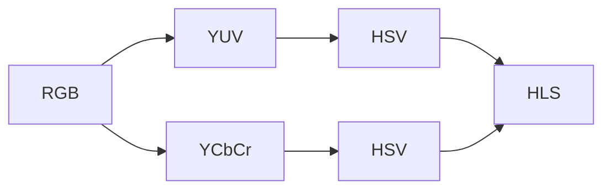
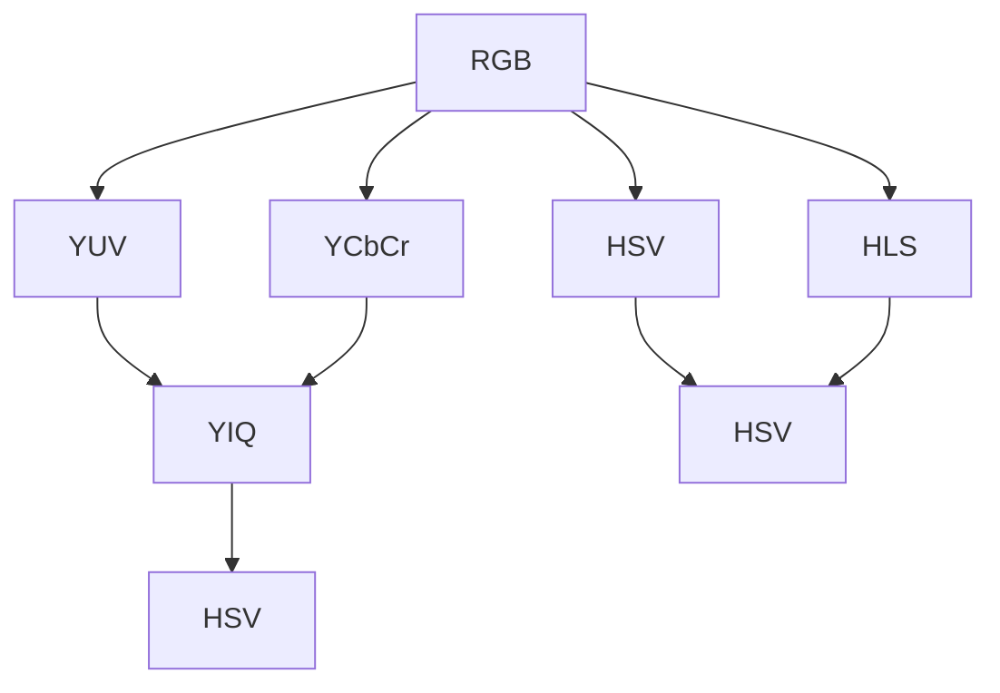
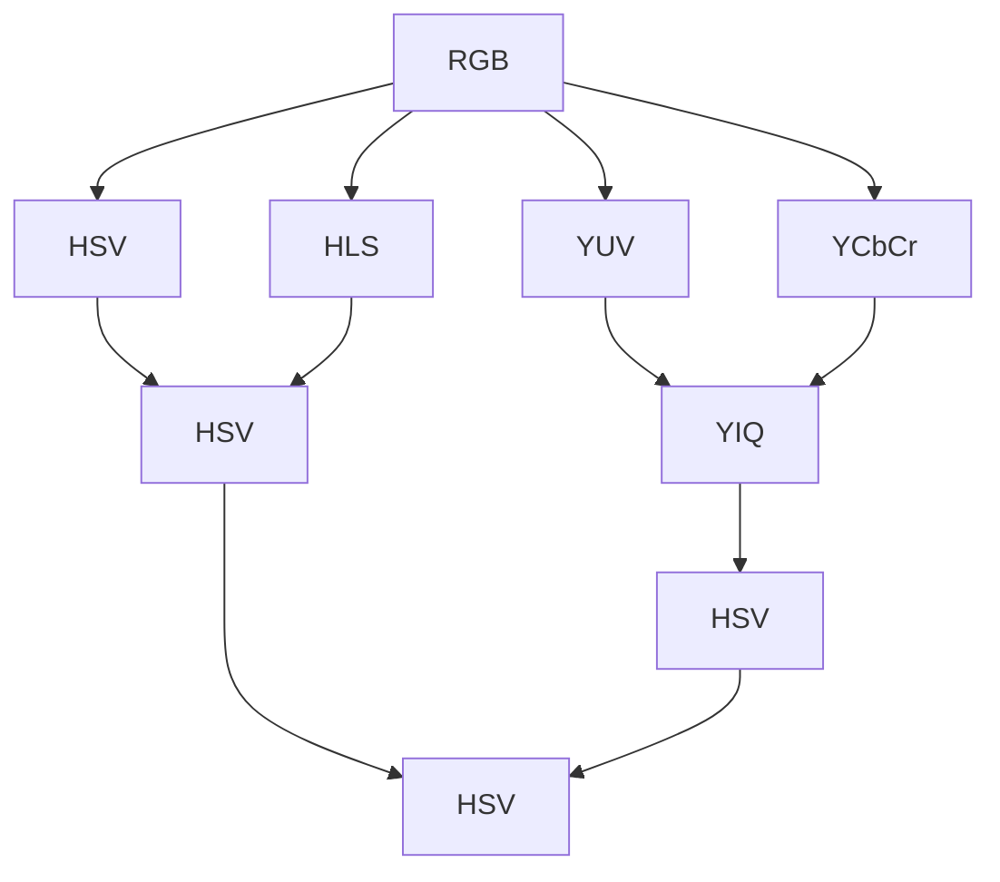

                 

# Hue原理与代码实例讲解

> 关键词：Hue算法,颜色空间转换,颜色匹配,RGB转换,YIQ转换,YUV转换,HLS转换,HSV转换,颜色空间转换,颜色空间变换,RGB转YUV

## 1. 背景介绍

### 1.1 问题由来

颜色空间转换是计算机视觉和图像处理领域的一项基础且重要的技术。它通常用于优化图像的显示效果，减少颜色差异，改善颜色表示，提升色彩识别和处理能力，以及实现多模态数据融合等。在实际应用中，颜色空间转换广泛应用于视频编解码、图像增强、色彩校正、显示效果优化、图像检索、物体识别等领域。

颜色空间转换的核心目标是找到一个更为合适、更有意义的表示颜色的方式。常见的颜色空间有RGB、YUV、YIQ、YCbCr、HSV、HLS等，每种颜色空间都有其特定的应用场景和优势。不同颜色空间之间的转换可以使得图像的显示效果更加一致、鲜明，也可以使得图像的特征提取和识别更加高效。

## 2. 核心概念与联系

### 2.1 核心概念概述

- **RGB颜色空间**：RGB（Red, Green, Blue）颜色空间是显示器和相机常用的颜色表示方式，用三个数值分别表示红、绿、蓝三原色的强度。它适用于颜色匹配、显示效果优化等领域。

- **YUV颜色空间**：YUV（Luminance-Chrominance）颜色空间是一种将亮度（Y）和色度（U, V）分离的颜色表示方式，常用于视频编解码、图像增强等场景。

- **YIQ颜色空间**：YIQ（Luminance-Chroma Component Intensity）颜色空间与YUV类似，但采用对色度信号进行了强度调整的方法。常用于视频传输和显示等。

- **YCbCr颜色空间**：YCbCr（Luminance-Chroma Component Complementary）颜色空间是一种基于人眼视觉特性的色度表示方式，常用于视频编解码、图像压缩等领域。

- **HSV颜色空间**：HSV（Hue, Saturation, Value）颜色空间是一种基于颜色的色调（Hue）、饱和度（Saturation）和明度（Value）的颜色表示方式，常用于图像检索、物体识别等。

- **HLS颜色空间**：HLS（Hue, Lightness, Saturation）颜色空间与HSV类似，但使用了不同的方法来表示亮度。常用于图像显示、颜色匹配等领域。

以上颜色空间之间的关系可以通过以下合成的Mermaid流程图来展示：



这个流程图展示了几大常见颜色空间之间的相互转换关系，以及它们的共同应用场景。从RGB空间出发，可以进行RGB到YUV、RGB到YCbCr、YUV到HSV、YCbCr到HSV等多种颜色空间转换，最终都汇聚到HSV空间，用于图像检索、物体识别等领域。

### 2.2 概念间的关系

这些颜色空间之间的关系可以通过以下更详细的Mermaid流程图来展示：



这个流程图展示了RGB到YUV、YCbCr、HSV、HLS的转换，以及YUV到YIQ的转换，最终将所有的颜色空间都转换到HSV空间，用于颜色匹配和图像处理。

### 2.3 核心概念的整体架构

最后，我们用一个综合的流程图来展示所有颜色空间之间的相互转换关系：



这个综合流程图展示了所有颜色空间之间的相互转换路径，从RGB空间出发，经过RGB到YUV、YUV到YIQ、RGB到YCbCr、RGB到HSV、HSV到HLS的转换，最终通过YIQ到HSV的转换，所有颜色空间都汇聚到HSV空间，用于最终的图像处理和颜色匹配。

## 3. 核心算法原理 & 具体操作步骤
### 3.1 算法原理概述

颜色空间转换的算法原理基于线性代数和矩阵变换。每种颜色空间都对应着一组颜色坐标，这些坐标通过一组线性变换矩阵从一种颜色空间转换到另一种颜色空间。例如，从RGB到YUV的转换公式为：

$$
\begin{bmatrix}
Y \\
U \\
V
\end{bmatrix}
=
\begin{bmatrix}
0.2126 & 0.7152 & 0.0722 \\
-0.0457 & -0.3354 & -0.0954 \\
0.0000 & 0.3374 & 0.5000
\end{bmatrix}
\begin{bmatrix}
R \\
G \\
B
\end{bmatrix}
$$

其中，$Y$ 表示亮度，$U$ 和 $V$ 表示色度，$R$、$G$ 和 $B$ 分别表示红、绿、蓝三原色的强度。

### 3.2 算法步骤详解

颜色空间转换的详细步骤包括：

1. **选择合适的颜色空间**：根据具体应用场景，选择合适的颜色空间进行转换。例如，如果需要在视频编解码中使用，可以选择YUV颜色空间；如果需要进行颜色匹配，可以选择HSV颜色空间。

2. **计算转换矩阵**：根据目标颜色空间的定义，计算出转换矩阵。例如，从RGB到YUV的转换矩阵可以表示为：

   $$
   M_{RGB \rightarrow YUV} =
   \begin{bmatrix}
   0.2126 & 0.7152 & 0.0722 \\
   -0.0457 & -0.3354 & -0.0954 \\
   0.0000 & 0.3374 & 0.5000
   \end{bmatrix}
   $$

3. **计算转换后的颜色坐标**：将原始RGB颜色坐标通过转换矩阵计算出目标颜色空间的颜色坐标。例如，将原始RGB颜色坐标 $[0.5, 0.5, 0.5]$ 转换为YUV颜色坐标为：

   $$
   \begin{bmatrix}
   Y \\
   U \\
   V
   \end{bmatrix}
   =
   \begin{bmatrix}
   0.2126 & 0.7152 & 0.0722 \\
   -0.0457 & -0.3354 & -0.0954 \\
   0.0000 & 0.3374 & 0.5000
   \end{bmatrix}
   \begin{bmatrix}
   0.5 \\
   0.5 \\
   0.5
   \end{bmatrix}
   =
   \begin{bmatrix}
   0.6000 \\
   -0.1000 \\
   0.3000
   \end{bmatrix}
   $$

4. **应用转换后的颜色坐标**：将转换后的颜色坐标用于后续的图像处理、显示效果优化、颜色匹配等应用。

### 3.3 算法优缺点

颜色空间转换的主要优点包括：

- **优化显示效果**：通过选择合适的颜色空间，可以优化图像的显示效果，使颜色更加鲜明、自然。
- **减少色差**：不同颜色空间之间的转换可以减少颜色差异，使得图像在不同设备上显示效果一致。
- **提升特征提取**：不同的颜色空间可以用于不同的图像处理和识别任务，提升特征提取的效率和准确性。

颜色空间转换的主要缺点包括：

- **计算复杂**：颜色空间转换涉及矩阵乘法等复杂计算，尤其是在大规模图像处理时，计算量较大。
- **转换误差**：不同的颜色空间之间存在转换误差，可能会影响最终的图像处理效果。

### 3.4 算法应用领域

颜色空间转换在以下领域有广泛应用：

- **视频编解码**：在视频编解码中，YUV、YCbCr等颜色空间被广泛使用，用于压缩和解压缩视频数据，优化显示效果。
- **图像增强**：通过颜色空间转换，可以增强图像的对比度和清晰度，改善图像的显示效果。
- **颜色校正**：通过颜色空间转换，可以校正图像的颜色偏差，使得颜色更加自然、真实。
- **显示效果优化**：在显示设备上，通过选择合适的颜色空间，可以优化图像的显示效果，使其更加自然、和谐。
- **图像检索**：通过颜色空间转换，可以改善图像的特征提取效果，提升图像检索的准确性。

## 4. 数学模型和公式 & 详细讲解 & 举例说明

### 4.1 数学模型构建

在颜色空间转换中，我们可以使用线性代数和矩阵变换来构建数学模型。例如，从RGB到YUV的颜色空间转换可以表示为：

$$
\begin{bmatrix}
Y \\
U \\
V
\end{bmatrix}
=
\begin{bmatrix}
0.2126 & 0.7152 & 0.0722 \\
-0.0457 & -0.3354 & -0.0954 \\
0.0000 & 0.3374 & 0.5000
\end{bmatrix}
\begin{bmatrix}
R \\
G \\
B
\end{bmatrix}
$$

其中，$Y$ 表示亮度，$U$ 和 $V$ 表示色度，$R$、$G$ 和 $B$ 分别表示红、绿、蓝三原色的强度。

### 4.2 公式推导过程

从RGB到YUV的转换公式推导过程如下：

1. **亮度计算**：

   $$
   Y = 0.2126R + 0.7152G + 0.0722B
   $$

2. **色度计算**：

   $$
   U = -0.0457R - 0.3354G + 0.0954B
   $$

   $$
   V = 0.3374R - 0.5000G + 0.5000B
   $$

通过以上两个公式，可以将RGB颜色坐标转换到YUV颜色坐标。

### 4.3 案例分析与讲解

假设有一个RGB颜色为 $(0.5, 0.5, 0.5)$ 的像素点，我们可以通过上述转换公式将其转换为YUV颜色坐标为：

$$
Y = 0.2126 \times 0.5 + 0.7152 \times 0.5 + 0.0722 \times 0.5 = 0.6000
$$

$$
U = -0.0457 \times 0.5 - 0.3354 \times 0.5 + 0.0954 \times 0.5 = -0.1000
$$

$$
V = 0.3374 \times 0.5 - 0.5000 \times 0.5 + 0.5000 \times 0.5 = 0.3000
$$

因此，该RGB颜色为 $(0.5, 0.5, 0.5)$ 的像素点在YUV颜色空间中的坐标为 $(0.6000, -0.1000, 0.3000)$。

## 5. 项目实践：代码实例和详细解释说明

### 5.1 开发环境搭建

要进行颜色空间转换的实践，首先需要搭建开发环境。以下是使用Python进行颜色空间转换的环境配置流程：

1. 安装Anaconda：从官网下载并安装Anaconda，用于创建独立的Python环境。

2. 创建并激活虚拟环境：
```bash
conda create -n color-space-env python=3.8 
conda activate color-space-env
```

3. 安装必要的库：
```bash
pip install numpy matplotlib
```

4. 安装OpenCV库：
```bash
pip install opencv-python
```

完成上述步骤后，即可在`color-space-env`环境中开始实践。

### 5.2 源代码详细实现

下面以RGB到YUV的颜色空间转换为例，给出使用Python实现的开源代码。

```python
import numpy as np
import cv2

def rgb_to_yuv(rgb):
    yuv = np.empty_like(rgb)
    yuv[:, :, 0] = 0.2126 * rgb[:, :, 0] + 0.7152 * rgb[:, :, 1] + 0.0722 * rgb[:, :, 2]
    yuv[:, :, 1] = -0.0457 * rgb[:, :, 0] - 0.3354 * rgb[:, :, 1] + 0.0954 * rgb[:, :, 2]
    yuv[:, :, 2] = 0.3374 * rgb[:, :, 0] - 0.5000 * rgb[:, :, 1] + 0.5000 * rgb[:, :, 2]
    return yuv

# 读取RGB图像
img_rgb = cv2.imread('image.jpg')

# 将RGB图像转换为YUV图像
img_yuv = rgb_to_yuv(img_rgb)

# 显示RGB和YUV图像
cv2.imshow('RGB Image', img_rgb)
cv2.imshow('YUV Image', img_yuv)
cv2.waitKey(0)
cv2.destroyAllWindows()
```

### 5.3 代码解读与分析

让我们详细解读一下代码的实现细节：

**rgb_to_yuv函数**：
- 定义一个空的YUV数组，用于存储转换后的YUV颜色坐标。
- 根据YUV转换公式，计算每个像素点的Y、U、V坐标，并存储到YUV数组中。
- 返回转换后的YUV颜色坐标数组。

**读取RGB图像**：
- 使用OpenCV的imread函数读取原始RGB图像。

**将RGB图像转换为YUV图像**：
- 调用rgb_to_yuv函数将RGB图像转换为YUV图像。

**显示RGB和YUV图像**：
- 使用OpenCV的imshow函数显示RGB和YUV图像。
- 使用waitKey函数等待按键，确保图像显示完毕。
- 使用destroyAllWindows函数关闭所有窗口。

## 6. 实际应用场景

### 6.1 视频编解码

在视频编解码中，YUV颜色空间被广泛使用。通过将RGB颜色空间转换为YUV颜色空间，可以显著减少视频数据的大小，提高传输效率。例如，在YouTube等在线视频平台，YUV颜色空间被广泛应用于视频压缩和传输，以减少带宽和存储空间的消耗。

### 6.2 图像增强

在图像增强中，YUV颜色空间转换可以用于优化图像的显示效果。通过调整U、V色度通道，可以增强图像的对比度和清晰度，改善图像的显示效果。例如，在医学图像增强中，YUV颜色空间转换可以帮助医生更加准确地识别和分析图像细节。

### 6.3 颜色校正

在颜色校正中，YUV颜色空间转换可以用于校正图像的颜色偏差，使得颜色更加自然、真实。例如，在摄影和影视制作中，YUV颜色空间转换可以帮助摄影师和导演更加准确地调整和控制画面颜色，使得最终作品更加美观、专业。

### 6.4 未来应用展望

随着颜色空间转换技术的发展，未来将在更多领域得到应用，为图像处理、显示效果优化、颜色匹配等提供新的解决方案。

在智慧医疗领域，颜色空间转换可以用于改善医疗图像的显示效果，帮助医生更加准确地识别和分析图像细节。在智能城市治理中，颜色空间转换可以用于优化视频监控图像的显示效果，提升城市管理的自动化和智能化水平。在智能交通领域，颜色空间转换可以用于改善车辆图像的颜色显示效果，提高道路安全和交通效率。

## 7. 工具和资源推荐
### 7.1 学习资源推荐

为了帮助开发者系统掌握颜色空间转换的理论基础和实践技巧，这里推荐一些优质的学习资源：

1. 《Digital Image Processing》（R. Gonzalez & R. Woods）：这本书全面介绍了图像处理的基本概念和技术，包括颜色空间转换、图像增强、颜色校正等。

2. 《The Human Visual System in the Digital Age》（Joel A. Siegenthaler）：这本书介绍了人类视觉系统的基本原理，以及如何在数字时代应用这些原理进行图像处理和显示效果优化。

3. 《Colorimetry: Principles and Practice》（Thomas Sismanis）：这本书介绍了颜色计量学的基本概念和应用，包括颜色空间转换、颜色匹配等。

4. 《Color Management》（Brian A. Buchanan）：这本书介绍了颜色管理的原理和实践，包括颜色空间转换、色彩校准、颜色优化等。

5. 《Mastering Image Processing in Python》（Julien Chaumond）：这本书介绍了如何使用Python进行图像处理，包括颜色空间转换、图像增强、颜色校正等。

通过对这些资源的学习实践，相信你一定能够快速掌握颜色空间转换的精髓，并用于解决实际的图像处理问题。

### 7.2 开发工具推荐

高效的开发离不开优秀的工具支持。以下是几款用于颜色空间转换开发的常用工具：

1. Python：作为数据科学和图像处理的主流语言，Python的Pillow、OpenCV等库可以方便地进行图像处理和颜色空间转换。

2. Matlab：作为图像处理领域的强大工具，Matlab提供了丰富的图像处理函数和工具箱，可以方便地进行颜色空间转换和图像优化。

3. GIMP：作为开源的图像处理软件，GIMP支持多种颜色空间转换，可以方便地进行图像增强和颜色校正。

4. Adobe Photoshop：作为专业的图像处理软件，Adobe Photoshop支持多种颜色空间转换和图像优化技术，广泛应用于设计、摄影等领域。

5. Hugin：作为开源的图像处理软件，Hugin支持多种颜色空间转换和图像优化，广泛应用于摄影和图像处理领域。

合理利用这些工具，可以显著提升颜色空间转换的开发效率，加快创新迭代的步伐。

### 7.3 相关论文推荐

颜色空间转换的研究涉及多个领域，以下是几篇奠基性的相关论文，推荐阅读：

1. "The Iris color space"（R. M. Haralick & A. J. Umetz）：提出了Iris颜色空间，用于改善图像的显示效果和颜色匹配。

2. "The CIELAB Color Space"（D. Bruce, M. Cutler, M. Peppers）：介绍了CIELAB颜色空间，用于颜色匹配和颜色优化。

3. "The CIE 1931 and CIE 1976 Color Spaces"（S. M. Ruiz）：介绍了CIE 1931和CIE 1976颜色空间，用于颜色计量和颜色校准。

4. "The YUV Color Space"（J. C. Watts）：介绍了YUV颜色空间，用于视频编解码和图像增强。

5. "The YCbCr Color Space"（T. M. Fujiwara, J. T. Kihara）：介绍了YCbCr颜色空间，用于图像压缩和颜色校准。

这些论文代表了大规模颜色空间转换的研究方向，通过学习这些前沿成果，可以帮助研究者把握学科前进方向，激发更多的创新灵感。

除上述资源外，还有一些值得关注的前沿资源，帮助开发者紧跟颜色空间转换技术的最新进展，例如：

1. arXiv论文预印本：人工智能领域最新研究成果的发布平台，包括大量尚未发表的前沿工作，学习前沿技术的必读资源。

2. 业界技术博客：如OpenCV、VGG、Google AI等顶尖实验室的官方博客，第一时间分享他们的最新研究成果和洞见。

3. 技术会议直播：如NIPS、ICML、CVPR等计算机视觉领域的顶级会议现场或在线直播，能够聆听到大佬们的前沿分享，开拓视野。

4. GitHub热门项目：在GitHub上Star、Fork数最多的颜色空间转换相关项目，往往代表了该技术领域的发展趋势和最佳实践，值得去学习和贡献。

5. 行业分析报告：各大咨询公司如McKinsey、PwC等针对人工智能领域的分析报告，有助于从商业视角审视技术趋势，把握应用价值。

总之，对于颜色空间转换技术的学习和实践，需要开发者保持开放的心态和持续学习的意愿。多关注前沿资讯，多动手实践，多思考总结，必将收获满满的成长收益。

## 8. 总结：未来发展趋势与挑战

### 8.1 总结

本文对颜色空间转换的原理与代码实例进行了全面系统的介绍。首先阐述了颜色空间转换的研究背景和意义，明确了颜色空间转换在图像处理和显示效果优化中的应用价值。其次，从原理到实践，详细讲解了颜色空间转换的数学模型和操作步骤，给出了颜色空间转换的完整代码实例。同时，本文还广泛探讨了颜色空间转换技术在视频编解码、图像增强、颜色校正等多个领域的应用前景，展示了颜色空间转换的巨大潜力。此外，本文精选了颜色空间转换技术的各类学习资源，力求为读者提供全方位的技术指引。

通过本文的系统梳理，可以看到，颜色空间转换技术在图像处理和显示效果优化领域具有广泛的应用前景。不同的颜色空间提供了不同的颜色表示和处理方法，使得图像处理的效果更加灵活、高效。未来，随着技术的不断进步，颜色空间转换将在更多的应用场景中发挥重要作用，为图像处理和显示效果的优化带来新的突破。

### 8.2 未来发展趋势

展望未来，颜色空间转换技术将呈现以下几个发展趋势：

1. **更高效的颜色空间转换算法**：随着深度学习和大数据技术的发展，未来的颜色空间转换算法将更加高效，计算复杂度将显著降低。

2. **智能化的颜色空间选择**：未来的颜色空间转换算法将能够自动选择合适的颜色空间，优化图像显示效果和颜色匹配。

3. **跨设备的颜色空间一致性**：未来的颜色空间转换技术将能够保证不同设备间的颜色空间一致性，使得图像在不同设备上显示效果一致。

4. **更广泛的颜色空间应用**：未来的颜色空间转换技术将能够支持更多的颜色空间，提升图像处理的灵活性和多样性。

5. **结合机器学习的优化**：未来的颜色空间转换算法将结合机器学习技术，进一步优化图像处理效果。

以上趋势凸显了颜色空间转换技术的广阔前景。这些方向的探索发展，必将进一步提升图像处理的效果和多样性，为显示效果优化和颜色匹配提供新的解决方案。

### 8.3 面临的挑战

尽管颜色空间转换技术已经取得了显著成就，但在迈向更加智能化、普适化应用的过程中，它仍面临着诸多挑战：

1. **计算复杂度高**：颜色空间转换涉及复杂的矩阵变换和计算，对于大规模图像处理，计算复杂度较高。如何提高转换效率，降低计算成本，仍是一个重要挑战。

2. **转换误差大**：不同的颜色空间之间存在转换误差，可能会影响最终的图像处理效果。如何减少转换误差，提高转换精度，仍是一个重要问题。

3. **设备间的一致性问题**：不同设备间的颜色空间转换可能会存在差异，影响图像在不同设备上的一致性。如何保证不同设备间的颜色空间一致性，仍是一个重要问题。

4. **人工干预的依赖**：在颜色空间选择和优化过程中，往往需要人工干预，缺乏自动化方法。如何减少人工干预，实现自动化的颜色空间选择和优化，仍是一个重要问题。

5. **软件实现的复杂性**：颜色空间转换的实现涉及多种颜色空间和转换公式，实现复杂度较高。如何简化实现过程，提高开发效率，仍是一个重要问题。

这些挑战表明，颜色空间转换技术仍需不断优化和改进，才能满足实际应用的需求。

### 8.4 未来突破

面对颜色空间转换所面临的种种挑战，未来的研究需要在以下几个方面寻求新的突破：

1. **更高效的算法实现**：开发更加高效的算法，在保证转换精度的前提下，进一步降低计算复杂度，提高转换效率。

2. **自动化的颜色空间选择**：结合机器学习和人工智能技术，实现自动化的颜色空间选择和优化，减少人工干预，提高转换效果。

3. **跨设备的一致性算法**：开发跨设备的颜色空间一致性算法，确保不同设备间的颜色空间转换效果一致。

4. **软硬件协同优化**：结合软硬件技术，优化颜色空间转换的实现过程，提高开发效率，降低计算成本。

5. **结合多模态信息**：结合图像、语音、文本等多模态信息，实现更全面、更智能的图像处理和显示效果优化。

这些研究方向的探索，必将引领颜色空间转换技术迈向更高的台阶，为图像处理和显示效果的优化提供新的解决方案。面向未来，颜色空间转换技术还需要与其他人工智能技术进行更深入的融合，共同推动图像处理领域的进步。只有勇于创新、敢于突破，才能不断拓展颜色空间转换的边界，让图像处理技术更好地服务于人类社会。

## 9. 附录：常见问题与解答

**Q1：颜色空间转换的主要应用场景有哪些？**

A: 颜色空间转换在以下领域有广泛应用：

- **视频编解码**：在视频编解码中，YUV、YCbCr等颜色空间被广泛使用，用于压缩和解压缩视频数据，优化显示效果。
- **图像增强**：通过颜色空间转换，可以增强图像的对比度和清晰度，改善图像的显示效果。
- **颜色校正**：通过颜色空间转换，可以校正图像的颜色偏差，使得颜色更加自然、真实。
- **显示效果优化**：在显示设备上，通过选择合适的颜色空间，可以优化图像的显示效果，使其更加自然、和谐。
- **图像检索**：通过颜色空间转换，可以改善图像的特征提取效果，提升图像检索的准确性。

**Q2：颜色空间转换的主要步骤是什么？**


