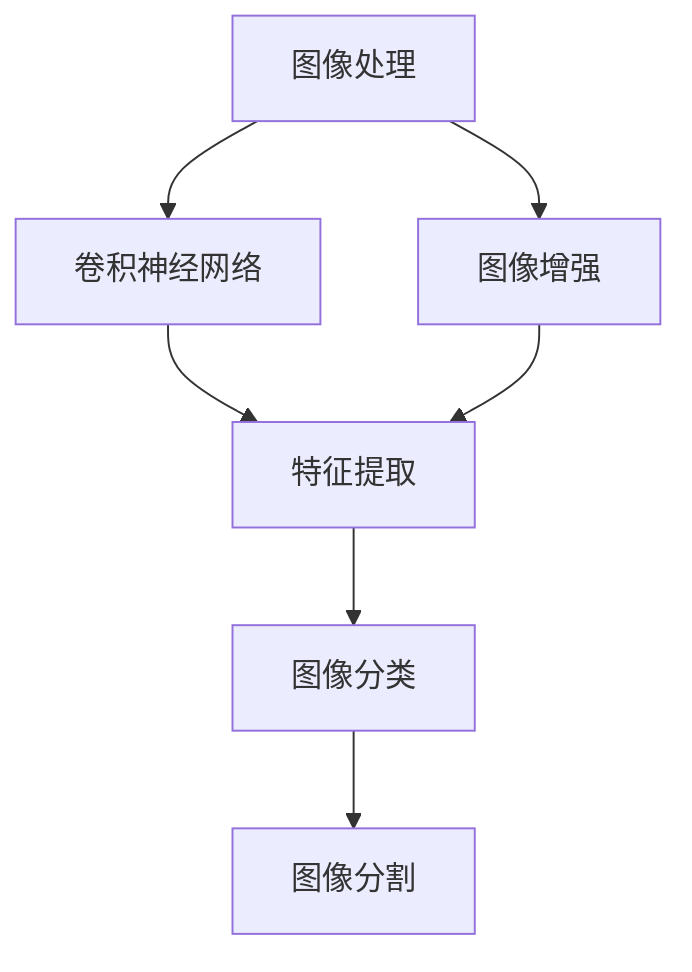
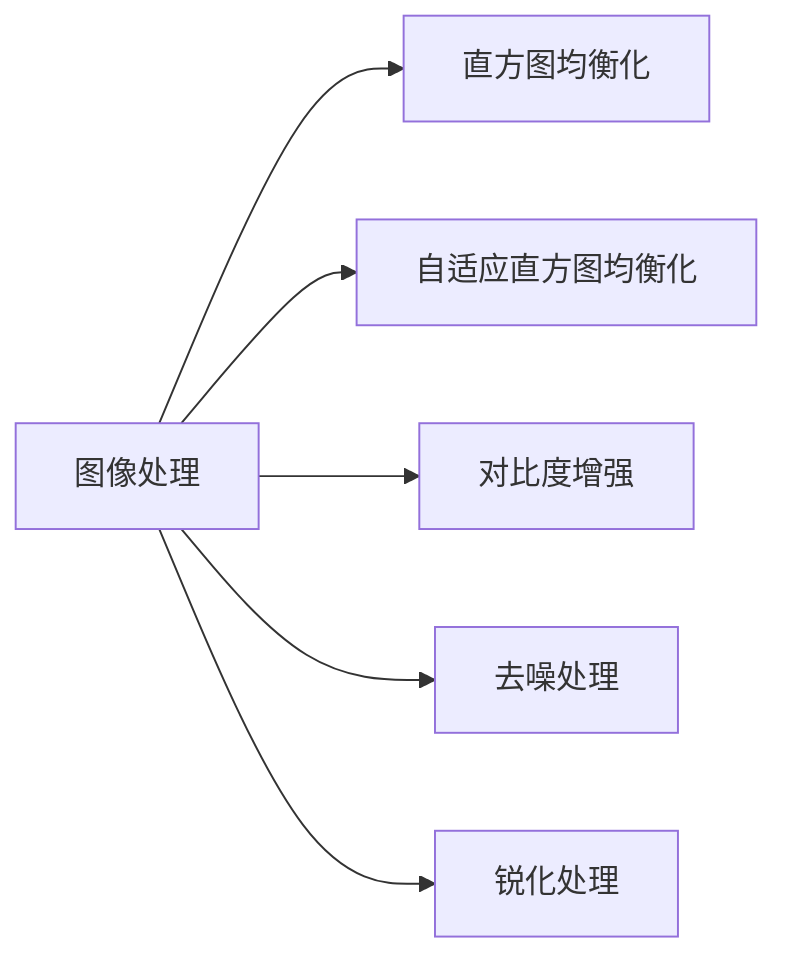
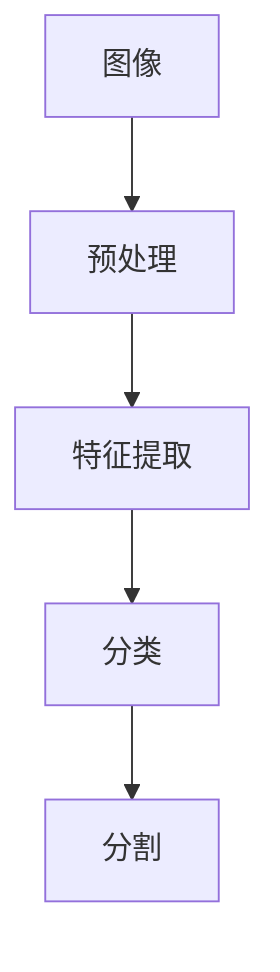
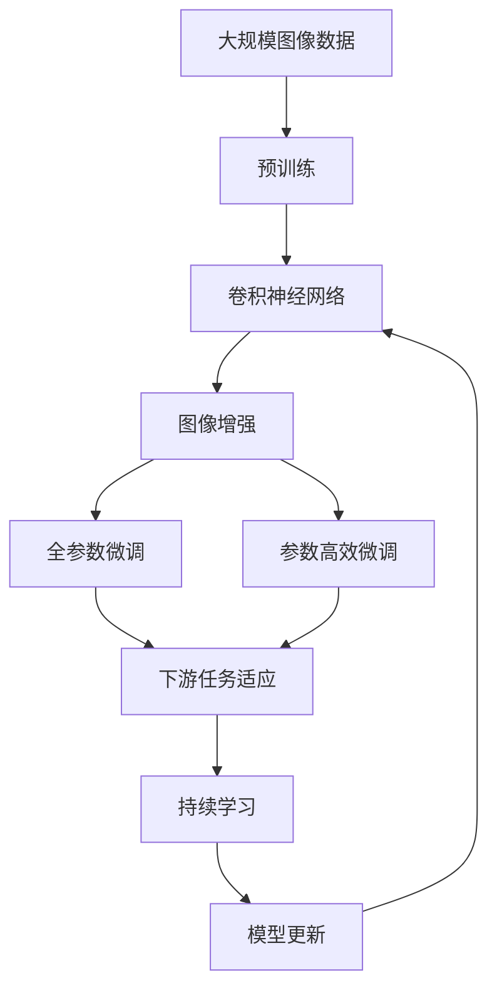

                 

# Image Processing 原理与代码实战案例讲解

> 关键词：图像处理,卷积神经网络,图像增强,图像分割,深度学习,计算机视觉

## 1. 背景介绍

### 1.1 问题由来
图像处理（Image Processing）是计算机视觉和模式识别领域的基础，广泛应用于医疗影像分析、自动驾驶、工业检测、社交媒体、增强现实（AR）和虚拟现实（VR）等多个行业。随着深度学习技术的兴起，卷积神经网络（Convolutional Neural Network, CNN）成为图像处理中的主要工具，极大地提高了图像识别、分类和分割的精度。

近年来，卷积神经网络在图像处理中的应用取得了显著进展，如ImageNet比赛的胜利，极大提升了图像分类、物体检测和语义分割等任务的性能。然而，实际应用中，图像噪声、光照变化、尺度变化等问题仍然严重影响着图像处理的效果。因此，图像增强（Image Enhancement）技术成为图像处理的重要组成部分，能够提升图像质量，为后续的深度学习任务提供更好的输入数据。

### 1.2 问题核心关键点
图像增强技术的核心在于通过一系列预处理操作，如滤波、均衡化、直方图修正等，改善图像的质量，增强其对比度、清晰度等特性，从而提高后续深度学习任务的性能。常见的图像增强方法包括：

- 直方图均衡化（Histogram Equalization）：通过对图像灰度级进行平滑分配，增强图像对比度和亮度。
- 自适应直方图均衡化（Adaptive Histogram Equalization）：对图像局部区域进行均衡化，避免过度增强。
- 对比度增强（Contrast Stretching）：通过调整图像的亮度和对比度，提升图像的对比度。
- 去噪处理（Noise Reduction）：去除图像中的噪声，提升图像的清晰度和细节。
- 锐化处理（Sharpening）：增强图像的边缘和细节，提升图像的清晰度。

图像增强技术不仅能够提升图像处理的效果，还能减少后续深度学习模型对数据质量的依赖，进一步提高模型的泛化能力。

### 1.3 问题研究意义
图像增强技术对于提升图像处理效果、降低深度学习模型对数据质量的要求、提高模型的泛化能力具有重要意义：

1. **降低数据获取成本**：高质量的图像数据通常需要专业的设备和长时间采集，图像增强技术可以在一定程度上弥补数据获取过程中的不足。
2. **提升模型性能**：增强图像质量后，深度学习模型的训练和推理过程更加稳定，从而提升了模型精度和鲁棒性。
3. **加速模型迭代**：图像增强技术的引入可以加速模型的迭代进程，缩短从数据采集到模型训练的时间。
4. **扩展应用场景**：图像增强技术可以使深度学习模型在实际应用中更好地适应各种光照、噪声和尺度变化，扩展了模型应用的范围。
5. **提高用户体验**：增强图像质量后，用户可以更清晰地看到图像的细节，提升了用户体验。

## 2. 核心概念与联系

### 2.1 核心概念概述

为更好地理解图像增强技术，本节将介绍几个密切相关的核心概念：

- **图像处理（Image Processing）**：通过一系列预处理操作改善图像质量，增强图像特性。
- **卷积神经网络（Convolutional Neural Network, CNN）**：一种特殊的神经网络，通过卷积层、池化层等操作对图像进行特征提取和分类。
- **图像增强（Image Enhancement）**：通过对图像进行滤波、均衡化、直方图修正等操作，提升图像质量。
- **直方图均衡化（Histogram Equalization）**：通过对图像灰度级进行平滑分配，增强图像对比度和亮度。
- **自适应直方图均衡化（Adaptive Histogram Equalization）**：对图像局部区域进行均衡化，避免过度增强。
- **对比度增强（Contrast Stretching）**：通过调整图像的亮度和对比度，提升图像的对比度。
- **去噪处理（Noise Reduction）**：去除图像中的噪声，提升图像的清晰度和细节。
- **锐化处理（Sharpening）**：增强图像的边缘和细节，提升图像的清晰度。

这些核心概念之间的逻辑关系可以通过以下Mermaid流程图来展示：



这个流程图展示了几大核心概念之间的关系：

1. 图像处理通过预处理操作改善图像质量。
2. 卷积神经网络通过卷积层、池化层等操作对图像进行特征提取。
3. 图像增强提升图像质量，为后续的深度学习任务提供更好的输入数据。
4. 特征提取层通过卷积操作提取图像特征。
5. 图像分类层对图像进行分类。
6. 图像分割层将图像分割成不同的区域。

### 2.2 概念间的关系

这些核心概念之间存在着紧密的联系，形成了图像增强技术的完整生态系统。下面我们通过几个Mermaid流程图来展示这些概念之间的关系。

#### 2.2.1 图像处理的分类



这个流程图展示了图像处理的几种主要技术：

1. 直方图均衡化。
2. 自适应直方图均衡化。
3. 对比度增强。
4. 去噪处理。
5. 锐化处理。

这些技术可以独立使用，也可以组合使用，以达到最佳的图像增强效果。

#### 2.2.2 图像增强的流程



这个流程图展示了图像增强的总体流程：

1. 图像预处理。
2. 特征提取。
3. 分类。
4. 分割。

### 2.3 核心概念的整体架构

最后，我们用一个综合的流程图来展示这些核心概念在大规模图像增强过程中的整体架构：



这个综合流程图展示了从预训练到图像增强，再到持续学习的完整过程。图像处理首先在大规模图像数据上进行预训练，然后通过图像增强技术提升图像质量，接着通过微调（包括全参数微调和参数高效微调）来适应下游任务，最后通过持续学习技术不断更新模型，保持模型的时效性和适应性。

## 3. 核心算法原理 & 具体操作步骤
### 3.1 算法原理概述

图像增强技术的核心在于通过一系列预处理操作，改善图像质量，增强图像特性。其核心思想是：通过平滑、滤波等技术，调整图像的灰度分布，增强图像的对比度和亮度，从而提高图像质量。

形式化地，假设输入图像为 $I$，经过一系列预处理操作后得到输出图像 $I'$。预处理操作通常可以表示为以下数学公式：

$$
I' = f(I)
$$

其中 $f$ 为预处理函数，$I'$ 为预处理后的图像。常见的预处理操作包括直方图均衡化、自适应直方图均衡化、对比度增强、去噪处理和锐化处理等。

### 3.2 算法步骤详解

以下是几个常见的图像增强技术的具体实现步骤：

**直方图均衡化（Histogram Equalization）**

1. **计算灰度直方图**：对输入图像 $I$ 进行灰度处理，得到灰度图像 $I_g$。然后计算 $I_g$ 的灰度直方图 $H_g$。
2. **计算累积分布函数**：计算 $H_g$ 的累积分布函数 $C_g$，即 $C_g(i) = \sum_{j \leq i} H_g(j)$。
3. **生成均衡化图像**：对每个像素 $i$，根据 $C_g(i)$ 计算其映射值 $o(i)$，得到均衡化图像 $I'$。具体公式为：

$$
o(i) = 255 \times \frac{i}{256} \times (1 - \frac{C_g(i)}{255})
$$

$$
I'(i) = 255 \times \frac{I(i)}{255} \times (1 - \frac{C_g(I(i))}{255}) + 255 \times \frac{C_g(I(i))}{255} \times \frac{I(i)}{255}
$$

**自适应直方图均衡化（Adaptive Histogram Equalization）**

1. **计算局部均衡化系数**：对图像 $I$ 进行分割，得到多个局部区域 $R_1, R_2, \cdots, R_n$。然后计算每个局部区域 $R_i$ 的直方图 $H_i$ 和累积分布函数 $C_i$。
2. **计算局部均衡化系数**：对每个局部区域 $R_i$，计算其均衡化系数 $a_i$，使得 $H_i$ 在 $[a_i, 1-a_i]$ 区间内分布均匀。
3. **生成均衡化图像**：对每个像素 $i$，根据 $C_i(i)$ 和 $a_i$ 计算其映射值 $o(i)$，得到均衡化图像 $I'$。

**对比度增强（Contrast Stretching）**

1. **计算对比度系数**：设定对比度增强的参数 $\alpha$ 和 $\beta$，计算对比度系数 $c = \max(I) - \min(I)$。
2. **生成增强图像**：对每个像素 $i$，根据 $I(i)$ 计算其映射值 $o(i)$，得到增强图像 $I'$。具体公式为：

$$
o(i) = 
\begin{cases}
\alpha \times \frac{I(i) - \min(I)}{c}, & I(i) < \min(I) + \frac{c}{2} \\
\alpha \times \frac{I(i) - \min(I)}{c} + 0.5, & \min(I) + \frac{c}{2} \leq I(i) < \max(I) \\
\beta \times \frac{\max(I) - I(i)}{c} + 0.5, & I(i) \geq \max(I)
\end{cases}
$$

**去噪处理（Noise Reduction）**

1. **选择去噪方法**：常见的去噪方法包括均值滤波、中值滤波、高斯滤波等。这里以均值滤波为例。
2. **计算平滑图像**：对输入图像 $I$ 进行平滑处理，得到平滑图像 $I_s$。
3. **生成去噪图像**：对每个像素 $i$，根据 $I_s(i)$ 计算其映射值 $o(i)$，得到去噪图像 $I'$。

**锐化处理（Sharpening）**

1. **选择锐化方法**：常见的锐化方法包括拉普拉斯锐化、Sobel锐化、Gaussian锐化等。这里以拉普拉斯锐化为例。
2. **计算拉普拉斯图像**：对输入图像 $I$ 进行拉普拉斯滤波，得到拉普拉斯图像 $I_l$。
3. **生成锐化图像**：对每个像素 $i$，根据 $I_l(i)$ 计算其映射值 $o(i)$，得到锐化图像 $I'$。

### 3.3 算法优缺点

图像增强技术的优点包括：

1. **简单高效**：通过一系列预处理操作，可以显著提升图像质量，所需时间和计算资源较少。
2. **通用适用**：适用于各种图像处理任务，如图像分类、目标检测、图像分割等。
3. **提升模型性能**：增强图像质量后，深度学习模型的训练和推理过程更加稳定，从而提升了模型精度和鲁棒性。

然而，图像增强技术也存在一些局限性：

1. **过度增强**：如果均衡化过度，会导致图像失真，影响后续深度学习模型的性能。
2. **细节丢失**：某些预处理操作可能会丢失图像的某些细节，影响图像的清晰度和真实性。
3. **依赖预处理参数**：预处理参数的选择对图像增强效果有重要影响，需要根据实际情况进行调整。
4. **计算复杂度高**：某些预处理操作（如拉普拉斯滤波）的计算复杂度较高，影响实时性。

尽管存在这些局限性，图像增强技术仍然是图像处理中的重要工具，广泛应用于实际应用中。

### 3.4 算法应用领域

图像增强技术已经广泛应用于多个领域，例如：

- **医疗影像分析**：通过增强图像质量，提升病灶检测和诊断的精度。
- **自动驾驶**：增强图像和视频质量，提升目标检测和环境感知的能力。
- **工业检测**：增强图像质量，提高缺陷检测和尺寸测量的准确度。
- **社交媒体**：提升图像质量，改善用户上传内容的视觉体验。
- **增强现实和虚拟现实**：增强图像和视频质量，提升用户互动体验。

除了上述这些领域，图像增强技术还被应用于更多场景中，如遥感影像处理、无人机图像分析、地质勘探等，为相关领域带来了新的突破。

## 4. 数学模型和公式 & 详细讲解 & 举例说明

### 4.1 数学模型构建

以下是几个常见的图像增强技术的数学模型构建：

**直方图均衡化**

假设输入图像为 $I$，其灰度级范围为 $[0, 255]$。设 $I_g$ 为 $I$ 的灰度图像，$H_g$ 为 $I_g$ 的灰度直方图，$C_g$ 为 $H_g$ 的累积分布函数，$I'$ 为均衡化后的图像。则直方图均衡化模型可表示为：

$$
H_g(i) = \frac{1}{255} \sum_{j=0}^{i} H_g(j) \quad \text{for} \quad i \in [0, 255]
$$

$$
C_g(i) = \sum_{j=0}^{i} H_g(j) \quad \text{for} \quad i \in [0, 255]
$$

$$
I'(i) = 255 \times \frac{i}{256} \times (1 - \frac{C_g(i)}{255}) + 255 \times \frac{C_g(i)}{255} \times \frac{I(i)}{255} \quad \text{for} \quad i \in [0, 255]
$$

**自适应直方图均衡化**

假设输入图像为 $I$，其局部区域为 $R_1, R_2, \cdots, R_n$。设 $H_i$ 为 $R_i$ 的直方图，$C_i$ 为 $H_i$ 的累积分布函数，$I'$ 为均衡化后的图像。则自适应直方图均衡化模型可表示为：

$$
H_i(i) = \frac{1}{\text{size}(R_i)} \sum_{j \in R_i} H_j(j)
$$

$$
C_i(i) = \sum_{j \in R_i} H_j(j) \quad \text{for} \quad i \in [0, \text{size}(R_i)]
$$

$$
a_i = 1 - \frac{\min(C_i)}{\max(C_i)}
$$

$$
I'(i) = 255 \times \frac{i}{256} \times (1 - a_i \times C_i(i)) + a_i \times C_i(i) \times I(i) \quad \text{for} \quad i \in [0, 255]
$$

**对比度增强**

假设输入图像为 $I$，其最小和最大灰度级分别为 $\min(I)$ 和 $\max(I)$。设 $I'$ 为增强后的图像，$\alpha$ 和 $\beta$ 为对比度增强参数。则对比度增强模型可表示为：

$$
c = \max(I) - \min(I)
$$

$$
o(i) = 
\begin{cases}
\alpha \times \frac{I(i) - \min(I)}{c}, & I(i) < \min(I) + \frac{c}{2} \\
\alpha \times \frac{I(i) - \min(I)}{c} + 0.5, & \min(I) + \frac{c}{2} \leq I(i) < \max(I) \\
\beta \times \frac{\max(I) - I(i)}{c} + 0.5, & I(i) \geq \max(I)
\end{cases}
$$

**拉普拉斯锐化**

假设输入图像为 $I$，其拉普拉斯图像为 $I_l$。设 $I'$ 为锐化后的图像。则拉普拉斯锐化模型可表示为：

$$
I_l(i) = \sum_{j \in \mathcal{N}(i)} (I(j) - I(i))
$$

$$
I'(i) = I(i) + \lambda \times I_l(i) \quad \text{for} \quad i \in \text{Im}
$$

其中 $\mathcal{N}(i)$ 为像素 $i$ 的邻域集合，$\lambda$ 为锐化参数。

### 4.2 公式推导过程

以下是几个常见的图像增强技术的公式推导过程：

**直方图均衡化**

假设输入图像为 $I$，其灰度级范围为 $[0, 255]$。设 $I_g$ 为 $I$ 的灰度图像，$H_g$ 为 $I_g$ 的灰度直方图，$C_g$ 为 $H_g$ 的累积分布函数，$I'$ 为均衡化后的图像。

1. **计算灰度直方图**：对输入图像 $I$ 进行灰度处理，得到灰度图像 $I_g$。然后计算 $I_g$ 的灰度直方图 $H_g$。

$$
H_g(i) = \sum_{j=0}^{i} \frac{1}{256} \sum_{k=0}^{255} I(i,j,k)
$$

2. **计算累积分布函数**：计算 $H_g$ 的累积分布函数 $C_g$。

$$
C_g(i) = \sum_{j=0}^{i} H_g(j) \quad \text{for} \quad i \in [0, 255]
$$

3. **生成均衡化图像**：对每个像素 $i$，根据 $C_g(i)$ 计算其映射值 $o(i)$，得到均衡化图像 $I'$。

$$
o(i) = 255 \times \frac{i}{256} \times (1 - \frac{C_g(i)}{255}) + 255 \times \frac{C_g(i)}{255} \times \frac{I(i)}{255}
$$

$$
I'(i) = 255 \times \frac{I(i)}{255} \times (1 - \frac{C_g(I(i))}{255}) + 255 \times \frac{C_g(I(i))}{255} \times \frac{I(i)}{255}
$$

**自适应直方图均衡化**

假设输入图像为 $I$，其局部区域为 $R_1, R_2, \cdots, R_n$。设 $H_i$ 为 $R_i$ 的直方图，$C_i$ 为 $H_i$ 的累积分布函数，$I'$ 为均衡化后的图像。

1. **计算局部均衡化系数**：对每个局部区域 $R_i$，计算其均衡化系数 $a_i$，使得 $H_i$ 在 $[a_i, 1-a_i]$ 区间内分布均匀。

$$
a_i = 1 - \frac{\min(C_i)}{\max(C_i)}
$$

2. **生成均衡化图像**：对每个像素 $i$，根据 $C_i(i)$ 和 $a_i$ 计算其映射值 $o(i)$，得到均衡化图像 $I'$。

$$
H_i(i) = \frac{1}{\text{size}(R_i)} \sum_{j \in R_i} H_j(j)
$$

$$
C_i(i) = \sum_{j \in R_i} H_j(j) \quad \text{for} \quad i \in [0, \text{size}(R_i)]
$$

$$
a_i = 1 - \frac{\min(C_i)}{\max(C_i)}
$$

$$
I'(i) = 255 \times \frac{i}{256} \times (1 - a_i \times C_i(i)) + a_i \times C_i(i) \times I(i) \quad \text{for} \quad i \in [0, 255]
$$

### 4.3 案例分析与讲解

以拉普拉斯锐化为例，分析其原理和实现过程。

**拉普拉斯锐化原理**

拉普拉斯锐化是一种增强图像边缘和细节的处理方式，通过增强图像的二阶导数，提升图像的清晰度。拉普拉斯锐化操作通常包括以下步骤：

1. **计算拉普拉斯图像**：对输入图像 $I$ 进行拉普拉斯滤波，得到拉普拉斯图像 $I_l$。
2. **生成锐化图像**：对每个像素 $i$，根据 $I_l(i)$ 计算其映射值 $o(i)$，得到锐化图像 $I'$。

**拉普拉斯锐化实现**

假设输入图像为 $I$，其拉普拉斯图像为 $I_l$。设 $I'$ 为锐化后的图像。

1. **计算拉普拉斯图像**：对输入图像 $I$ 进行拉普拉斯滤波，得到拉普拉斯图像 $I_l$。

$$
I_l(i) = \sum_{j \in \mathcal{N}(i)} (I(j) - I(i))
$$

2. **生成锐化图像**：对每个像素 $i$，根据 $I_l(i)$ 计算其映射值 $o(i)$，得到锐化图像 $I'$。

$$
I'(i) = I(i) + \lambda \times I_l(i) \quad \text{for} \quad i \in \text{Im}
$$

其中 $\mathcal{N}(i)$ 为像素 $i$ 的邻域集合，$\lambda$ 为锐化参数。

## 5. 项目实践：代码实例和详细解释说明

### 5.1 开发环境搭建

在进行图像增强实践前，我们需要准备好开发环境。以下是使用Python进行OpenCV开发的环境配置流程：

1. 安装Anaconda：从官网下载并安装Anaconda，用于创建独立的Python环境。

2. 创建并激活虚拟环境：
```bash
conda create -n image-processing python=3.8 
conda activate image-processing
```

3. 安装OpenCV：
```bash
conda install opencv-python
```

4. 安装NumPy、Matplotlib、Pillow等库：
```bash
pip install numpy matplotlib pillow
```

完成上述步骤后，即可在`image-processing`环境中开始图像增强实践。

### 5.2 源代码详细实现

这里以直方图均衡化为例，展示使用OpenCV实现图像增强的代码。

```python
import cv2
import numpy as np

def histogram_equalization(img):
    gray = cv2.cvtColor(img, cv2.COLOR_BGR2GRAY)
    eq = cv2.createCLAHE(clipLimit=2.0, tileGridSize=(8, 8))
    equ = eq.apply(gray)
    return cv2.cvtColor(equ, cv2.COLOR_GRAY2BGR)

# 读取图像
img = cv2.imread('image.jpg')

# 增强图像
eq_img = histogram_equalization(img)

# 显示结果
cv2.imshow('Original Image', img)
cv2.imshow('Equalized Image', eq_img)
cv2.waitKey(0)
cv2.destroyAllWindows()
```

以上代码实现了使用OpenCV进行直方图均衡化的功能。

### 5.3 代码解读与分析

让我们再详细解读一下关键代码的实现细节：

**读取图像**

```python
img = cv2.imread('image.jpg')
```

读取名为`image.jpg`的图像，并将其存储在`img`变量中。

**转换颜色空间**

```python
gray = cv2.cvtColor(img, cv2.COLOR_BGR2GRAY)
```

将彩色图像转换为灰度图像，存储在`gray`变量中。

**创建CLAHE对象**

```python
eq = cv2.createCLAHE(clipLimit=2.0, tileGridSize=(8, 8))
```

创建CLAHE对象，用于进行直方图均衡化。`clipLimit`参数控制对比度增强的强度，`tileGridSize`参数指定均衡化区域的大小。

**均衡化灰度图像**

```python
equ = eq.apply(gray)
```

对灰度图像进行直方图均衡化，得到均衡化后的灰度图像。

**转换颜色空间**

```python
equ = cv2.cvtColor(equ, cv2.COLOR_GRAY2BGR)
```

将均衡化后的灰度图像转换回彩色图像，并存储在`equ`变量中

