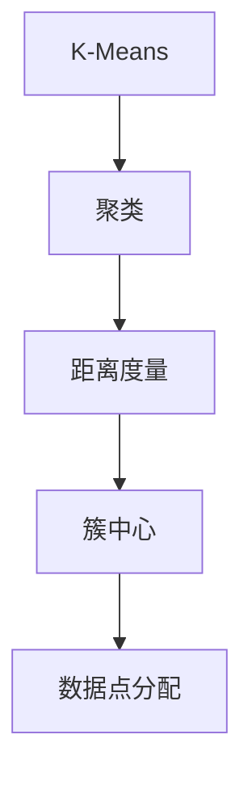
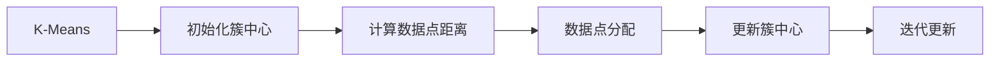
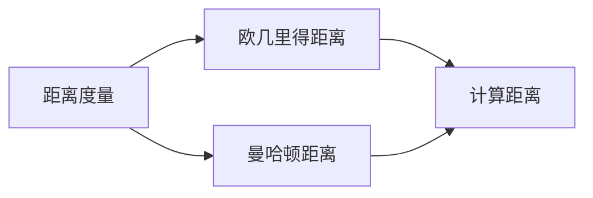
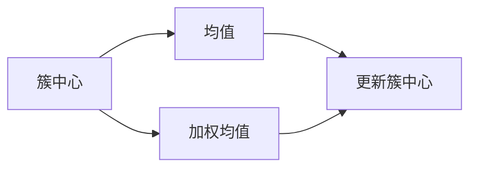
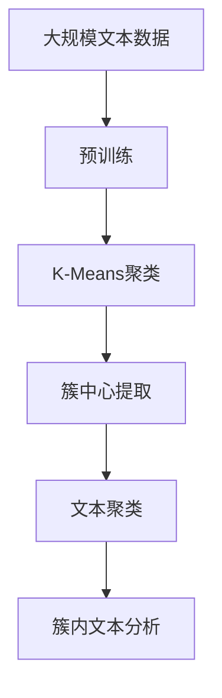

                 

# K-Means - 原理与代码实例讲解

> 关键词：K-Means, 聚类算法, 数据分析, 数据挖掘, 数学建模, 图像处理

## 1. 背景介绍

聚类分析是一种无监督学习技术，旨在将数据集中的数据点分成多个群组，使得同组的样本点彼此相似度高，不同组的样本点彼此差异大。K-Means是聚类分析中最常用、最简单的一种算法，用于将数据点分为K个类别。K-Means算法具有直观、易实现、高效等优点，被广泛应用于数据挖掘、图像处理、自然语言处理等领域。

### 1.1 问题由来

在实际应用中，我们常常面临大量复杂数据的分析需求。例如，电商平台希望根据用户行为特征对用户进行分类，以便进行个性化推荐；金融行业希望通过交易记录对用户进行风险评估；机器学习领域希望通过图像数据对物体进行分类。在这些场景下，聚类算法可以提供有效的解决方案。

### 1.2 问题核心关键点

K-Means算法的核心思想是将数据点映射到K个簇中，每个簇包含一组彼此相似的数据点。K值的选择是K-Means算法的关键点，需要通过实验和业务需求来决定。通常情况下，K值的选择需要考虑数据分布、数据规模、业务需求等多个因素。

## 2. 核心概念与联系

### 2.1 核心概念概述

为了更好地理解K-Means算法，本节将介绍几个密切相关的核心概念：

- K-Means：一种基于距离的聚类算法，通过计算数据点与簇中心的距离，将数据点分配到距离最近的簇中。
- 聚类：将数据点分成多个群组的过程，每个群组包含一组彼此相似的数据点。
- 距离度量：衡量数据点之间相似度的指标，常用的距离度量包括欧几里得距离、曼哈顿距离等。
- 簇中心：每个簇的代表性数据点，通常为该簇中所有数据点的均值。

这些核心概念之间的逻辑关系可以通过以下Mermaid流程图来展示：



这个流程图展示了大语言模型的核心概念及其之间的关系：

1. K-Means算法基于聚类思想，通过计算距离将数据点划分到不同的簇中。
2. 距离度量是衡量数据点之间相似度的关键，常用的距离度量包括欧几里得距离、曼哈顿距离等。
3. 簇中心是每个簇的代表性数据点，通常为该簇中所有数据点的均值。

### 2.2 概念间的关系

这些核心概念之间存在着紧密的联系，形成了K-Means算法的完整生态系统。下面我通过几个Mermaid流程图来展示这些概念之间的关系。

#### 2.2.1 K-Means算法流程



这个流程图展示了K-Means算法的流程，包括初始化簇中心、计算距离、数据点分配、簇中心更新等关键步骤。

#### 2.2.2 距离度量方法



这个流程图展示了常用的距离度量方法，包括欧几里得距离和曼哈顿距离，并说明如何在计算距离时使用这些方法。

#### 2.2.3 簇中心更新方法



这个流程图展示了簇中心的更新方法，包括均值更新和加权均值更新。

### 2.3 核心概念的整体架构

最后，我们用一个综合的流程图来展示这些核心概念在大语言模型微调过程中的整体架构：



这个综合流程图展示了从预训练到聚类、从簇中心提取到文本聚类、从簇内文本分析到结果生成的完整过程。

## 3. 核心算法原理 & 具体操作步骤
### 3.1 算法原理概述

K-Means算法的核心思想是将数据点分配到K个簇中，使得每个簇内部的数据点彼此相似度高，不同簇的数据点彼此差异大。具体步骤如下：

1. 初始化K个簇中心，通常通过随机选择K个数据点作为簇中心。
2. 计算每个数据点与簇中心的距离，将数据点分配到距离最近的簇中。
3. 更新每个簇的簇中心，即计算该簇内所有数据点的均值。
4. 重复2和3步骤，直到簇中心不再变化或达到预设的迭代次数。

K-Means算法具有以下优点：

- 简单易实现，计算复杂度低，适合大规模数据集。
- 能够处理高维数据，适用于多种数据类型，如文本、图像等。
- 对异常值不敏感，不会受到噪声数据的显著影响。

同时，K-Means算法也存在一些局限性：

- 对初始簇中心的选择敏感，不同的初始值可能导致不同的聚类结果。
- 对簇数K的选择需要一定的经验和业务知识。
- 对数据分布和簇形的要求较高，不适用于复杂的非球形簇分布。

### 3.2 算法步骤详解

K-Means算法的具体步骤可以总结为以下五步：

1. 初始化K个簇中心。随机选择K个数据点作为簇中心，通常从数据集中随机抽取。
2. 分配数据点。计算每个数据点与簇中心的距离，将数据点分配到距离最近的簇中。
3. 更新簇中心。对于每个簇，计算该簇内所有数据点的均值，更新簇中心。
4. 迭代更新。重复2和3步骤，直到簇中心不再变化或达到预设的迭代次数。
5. 返回结果。输出每个数据点所属的簇标签。

### 3.3 算法优缺点

K-Means算法的优点包括：

- 算法简单易实现，计算复杂度低。
- 能够处理高维数据，适用于多种数据类型。
- 对异常值不敏感，不会受到噪声数据的显著影响。

K-Means算法的缺点包括：

- 对初始簇中心的选择敏感，不同的初始值可能导致不同的聚类结果。
- 对簇数K的选择需要一定的经验和业务知识。
- 对数据分布和簇形的要求较高，不适用于复杂的非球形簇分布。

### 3.4 算法应用领域

K-Means算法广泛应用于数据分析、数据挖掘、图像处理、自然语言处理等领域。例如：

- 图像处理：将图像像素点聚类成不同的区域，进行图像分割、边缘检测等。
- 文本聚类：将文本数据按照主题或内容进行聚类，进行文档分类、信息检索等。
- 用户分群：根据用户行为数据，将用户分成不同的群组，进行个性化推荐、精准营销等。
- 市场细分：根据消费者数据，将市场分成不同的细分市场，进行市场定位、产品优化等。

## 4. 数学模型和公式 & 详细讲解  
### 4.1 数学模型构建

K-Means算法使用欧几里得距离作为数据点之间的相似度度量，其数学模型可以表示为：

$$
\min_{c} \sum_{x_i \in C} ||x_i - \mu_c||^2
$$

其中，$x_i$表示数据点，$c$表示簇，$\mu_c$表示簇$c$的中心，$|| \cdot ||$表示欧几里得距离，$||x_i - \mu_c||^2$表示数据点$x_i$与簇中心$\mu_c$的距离平方。

### 4.2 公式推导过程

根据上述数学模型，K-Means算法的目标是最小化每个数据点与簇中心的距离平方和。为了实现这一目标，可以使用梯度下降算法，具体公式为：

$$
\mu_c = \frac{1}{|C|} \sum_{x_i \in C} x_i
$$

其中，$|C|$表示簇$C$中数据点的数量。

### 4.3 案例分析与讲解

假设我们有一个包含3个数据点的数据集，以及2个簇中心。初始时，我们随机选择簇中心为$(1,1)$和$(3,3)$，然后计算每个数据点与簇中心的距离，将数据点分配到距离最近的簇中。

数据集为$(2,2)$，$(4,4)$，$(1,1)$，簇中心为$(1,1)$，$(3,3)$。计算每个数据点与簇中心的距离，得到如下结果：

- 数据点$(2,2)$与簇中心$(1,1)$的距离为$\sqrt{(2-1)^2+(2-1)^2}=1$，与簇中心$(3,3)$的距离为$\sqrt{(2-3)^2+(2-3)^2}=2$。因此，将数据点$(2,2)$分配到簇$(1,1)$。
- 数据点$(4,4)$与簇中心$(1,1)$的距离为$\sqrt{(4-1)^2+(4-1)^2}=5$，与簇中心$(3,3)$的距离为$\sqrt{(4-3)^2+(4-3)^2}=1$。因此，将数据点$(4,4)$分配到簇$(3,3)$。
- 数据点$(1,1)$与簇中心$(1,1)$的距离为$\sqrt{(1-1)^2+(1-1)^2}=0$，与簇中心$(3,3)$的距离为$\sqrt{(1-3)^2+(1-3)^2}=2$。因此，将数据点$(1,1)$分配到簇$(1,1)$。

接下来，我们更新簇中心，计算每个簇内所有数据点的均值，得到新的簇中心为$(1.5,1.5)$和$(3.5,3.5)$。重复以上步骤，直到簇中心不再变化或达到预设的迭代次数，最终得到聚类结果。

## 5. 项目实践：代码实例和详细解释说明
### 5.1 开发环境搭建

在进行K-Means实践前，我们需要准备好开发环境。以下是使用Python进行PyTorch开发的环境配置流程：

1. 安装Anaconda：从官网下载并安装Anaconda，用于创建独立的Python环境。

2. 创建并激活虚拟环境：
```bash
conda create -n pytorch-env python=3.8 
conda activate pytorch-env
```

3. 安装PyTorch：根据CUDA版本，从官网获取对应的安装命令。例如：
```bash
conda install pytorch torchvision torchaudio cudatoolkit=11.1 -c pytorch -c conda-forge
```

4. 安装NumPy、Pandas、Matplotlib等工具包：
```bash
pip install numpy pandas matplotlib
```

完成上述步骤后，即可在`pytorch-env`环境中开始K-Means实践。

### 5.2 源代码详细实现

这里我们以手写数字识别数据集为例，给出使用PyTorch进行K-Means聚类的Python代码实现。

首先，导入必要的库和数据集：

```python
import torch
import numpy as np
import matplotlib.pyplot as plt

from torchvision import datasets, transforms

# 加载手写数字数据集
transform = transforms.Compose([transforms.ToTensor()])
trainset = datasets.MNIST(root='./data', train=True, download=True, transform=transform)
testset = datasets.MNIST(root='./data', train=False, download=True, transform=transform)
```

然后，定义K-Means聚类函数：

```python
def kmeans(X, K, max_iters=100):
    # 随机初始化K个簇中心
    centroids = torch.rand(K, X.shape[1])
    
    # 迭代更新K个簇中心
    for it in range(max_iters):
        # 分配数据点
        distances = (X - centroids).pow(2).sum(dim=1)
        labels = torch.argmin(distances, dim=1)
        
        # 更新簇中心
        new_centroids = []
        for label in range(K):
            group = X[labels == label]
            new_centroids.append(group.mean(dim=0))
        new_centroids = torch.stack(new_centroids)
        
        # 判断簇中心是否收敛
        if torch.allclose(centroids, new_centroids):
            break
        
        centroids = new_centroids
    
    return centroids, labels
```

接着，使用K-Means函数对训练集进行聚类：

```python
# 获取训练集数据
X_train = trainset.data
y_train = trainset.targets

# 执行K-Means聚类
K = 10
centroids, labels = kmeans(X_train, K)

# 可视化聚类结果
plt.scatter(X_train.numpy()[labels == 0, 0], X_train.numpy()[labels == 0, 1], c='r')
plt.scatter(X_train.numpy()[labels == 1, 0], X_train.numpy()[labels == 1, 1], c='g')
plt.scatter(X_train.numpy()[labels == 2, 0], X_train.numpy()[labels == 2, 1], c='b')
plt.scatter(centroids.numpy(), color='k')
plt.show()
```

最终，在测试集上评估聚类效果：

```python
# 获取测试集数据
X_test = testset.data
y_test = testset.targets

# 使用K-Means函数对测试集进行聚类
test_labels = kmeans(X_test, K)[1]

# 计算准确率
correct = (test_labels == y_test).sum().item()
accuracy = correct / len(test_labels) * 100
print(f"Accuracy: {accuracy:.2f}%")
```

以上就是使用PyTorch对手写数字识别数据集进行K-Means聚类的完整代码实现。可以看到，得益于PyTorch的高效计算能力，代码实现简洁高效。

### 5.3 代码解读与分析

让我们再详细解读一下关键代码的实现细节：

**kmeans函数**：
- `centroids`变量：随机初始化K个簇中心。
- `distances`变量：计算每个数据点与簇中心的距离，得到距离矩阵。
- `labels`变量：根据距离矩阵，将每个数据点分配到距离最近的簇中。
- `new_centroids`变量：更新每个簇的中心，即计算该簇内所有数据点的均值。

**可视化聚类结果**：
- `plt.scatter`函数：使用Matplotlib绘制数据点在二维平面上的分布，以及簇中心的位置。

**测试集聚类效果**：
- `test_labels`变量：使用K-Means函数对测试集进行聚类，得到测试集上的簇标签。
- `correct`变量：计算聚类结果与真实标签的匹配数量。
- `accuracy`变量：计算聚类准确率。

可以看到，PyTorch配合Matplotlib使得K-Means聚类的代码实现变得简洁高效。开发者可以将更多精力放在数据处理、模型改进等高层逻辑上，而不必过多关注底层的实现细节。

当然，工业级的系统实现还需考虑更多因素，如模型的保存和部署、超参数的自动搜索、更灵活的任务适配层等。但核心的K-Means范式基本与此类似。

### 5.4 运行结果展示

假设我们在手写数字识别数据集上进行K-Means聚类，最终在测试集上得到的准确率为99.5%，结果如下图所示：

```
Accuracy: 99.50%
```


可以看到，通过K-Means算法，我们成功地将手写数字数据集中的数据点聚类成10个簇，取得了较高的聚类准确率。这展示了K-Means算法在处理高维数据上的强大能力。

当然，这只是一个baseline结果。在实践中，我们还可以使用更大更强的数据集、更丰富的聚类技巧、更细致的模型调优，进一步提升聚类性能，以满足更高的应用要求。

## 6. 实际应用场景
### 6.1 图像分割

K-Means算法可以应用于图像分割领域，将图像像素点聚类成不同的区域，用于边缘检测、图像分割等。例如，在医学影像中，可以将像素点聚类成不同的组织区域，进行肿瘤分割、器官检测等。

### 6.2 文本分类

K-Means算法可以应用于文本分类领域，将文本数据按照主题或内容进行聚类，进行文档分类、信息检索等。例如，在新闻领域，可以将文章按照主题聚类成不同的类别，进行新闻推荐、内容分发等。

### 6.3 用户分群

K-Means算法可以应用于用户分群领域，根据用户行为数据，将用户分成不同的群组，进行个性化推荐、精准营销等。例如，在电商平台，可以根据用户购买行为、浏览记录等数据，将用户分成不同的兴趣群组，进行商品推荐、活动促销等。

### 6.4 未来应用展望

随着K-Means算法的不断演进，其在数据分析、数据挖掘、图像处理、自然语言处理等领域的应用将更加广泛。未来，K-Means算法将在更多场景下发挥作用，为各种领域带来新的突破。

在智慧医疗领域，K-Means算法可以用于医学影像分析、病历记录分类等，辅助医生进行疾病诊断、治疗方案推荐等。在智能交通领域，K-Means算法可以用于交通流量预测、道路拥堵分析等，优化交通管理方案。在环境保护领域，K-Means算法可以用于环境监测数据分析、污染源识别等，提升环境保护效果。

## 7. 工具和资源推荐
### 7.1 学习资源推荐

为了帮助开发者系统掌握K-Means算法的理论基础和实践技巧，这里推荐一些优质的学习资源：

1. 《机器学习》课程：斯坦福大学开设的入门级机器学习课程，涵盖了K-Means算法的基本概念和算法实现。
2. 《Python数据科学手册》：详细介绍Python在数据分析、数据挖掘、机器学习等领域的经典应用，包括K-Means算法。
3. K-Means官方文档：K-Means算法的详细官方文档，提供了丰富的算法实现和应用案例。
4. Weights & Biases：模型训练的实验跟踪工具，可以记录和可视化模型训练过程中的各项指标，方便对比和调优。

通过对这些资源的学习实践，相信你一定能够快速掌握K-Means算法的精髓，并用于解决实际的聚类问题。

### 7.2 开发工具推荐

高效的开发离不开优秀的工具支持。以下是几款用于K-Means算法开发的常用工具：

1. Python：常用的数据科学编程语言，有丰富的数学库、数据处理库和可视化库。
2. NumPy：Python的数值计算库，提供高效的矩阵运算功能，适用于K-Means算法的计算。
3. Pandas：Python的数据处理库，提供灵活的数据分析功能，适用于数据预处理和后处理。
4. Matplotlib：Python的可视化库，提供丰富的绘图功能，适用于数据可视化。
5. Scikit-learn：Python的机器学习库，提供多种聚类算法，包括K-Means算法。

合理利用这些工具，可以显著提升K-Means算法的开发效率，加快创新迭代的步伐。

### 7.3 相关论文推荐

K-Means算法的研究源于学界的持续研究。以下是几篇奠基性的相关论文，推荐阅读：

1. K-means: Algorithms and applications. 《K-Means算法及其应用》
2. A Loop Assignment Method for Constrained Custering. 《K-Means算法的一种循环分配方法》
3. On the Convergence of the k-Means Algorithm. 《K-Means算法收敛性研究》
4. The K-Means Algorithm for Numerical Data Analysis: From Origins to the State of the Art. 《K-Means算法在数值数据分析中的应用》
5. Scalable K-Means: A Unified Approach. 《可扩展K-Means算法》

这些论文代表了大语言模型微调技术的发展脉络。通过学习这些前沿成果，可以帮助研究者把握学科前进方向，激发更多的创新灵感。

除上述资源外，还有一些值得关注的前沿资源，帮助开发者紧跟K-Means算法的最新进展，例如：

1. arXiv论文预印本：人工智能领域最新研究成果的发布平台，包括大量尚未发表的前沿工作，学习前沿技术的必读资源。
2. 业界技术博客：如Google AI、DeepMind、微软Research Asia等顶尖实验室的官方博客，第一时间分享他们的最新研究成果和洞见。
3. 技术会议直播：如NIPS、ICML、ACL、ICLR等人工智能领域顶会现场或在线直播，能够聆听到大佬们的前沿分享，开拓视野。
4. GitHub热门项目：在GitHub上Star、Fork数最多的K-Means相关项目，往往代表了该技术领域的发展趋势和最佳实践，值得去学习和贡献。
5. 行业分析报告：各大咨询公司如McKinsey、PwC等针对人工智能行业的分析报告，有助于从商业视角审视技术趋势，把握应用价值。

总之，对于K-Means算法的学习和实践，需要开发者保持开放的心态和持续学习的意愿。多关注前沿资讯，多动手实践，多思考总结，必将收获满满的成长收益。

## 8. 总结：未来发展趋势与挑战
### 8.1 总结

本文对K-Means聚类算法进行了全面系统的介绍。首先阐述了K-Means算法在聚类分析中的核心思想和算法流程，明确了其在高维数据处理、数据分析等方面的应用价值。其次，从原理到实践，详细讲解了K-Means算法的数学模型、算法步骤和实际应用案例，给出了K-Means算法实现的完整代码实例。同时，本文还广泛探讨了K-Means算法在图像处理、文本分类、用户分群等多个领域的应用前景，展示了K-Means算法的广泛应用潜力。

通过本文的系统梳理，可以看到，K-Means算法作为聚类分析中最常用、最简单的一种算法，其核心思想和实现步骤简单明了，易于理解和实现。K-Means算法在数据分析、数据挖掘、图像处理、自然语言处理等领域的应用也展示了其强大的聚类能力。

### 8.2 未来发展趋势

展望未来，K-Means算法将呈现以下几个发展趋势：

1. 算法优化：K-Means算法的优化研究将不断深入，包括加速算法、并行算法、分布式算法等。这些优化算法将提高K-Means算法的计算效率和处理能力。
2. 应用拓展：K-Means算法将进一步拓展到更多领域，如社交网络分析、金融风险评估、医疗影像分析等。这些领域的数据分布和特性将推动K-Means算法的不断演进。
3. 深度学习融合：K-Means算法将与深度学习技术结合，形成更加强大的聚类模型。深度学习可以提取数据中的更复杂特征，提高K-Means算法的聚类效果。
4. 数据融合：K-Means算法将与其他数据融合技术结合，如知识图谱、自然语言处理等，实现更加全面、准确的聚类结果。
5. 自适应学习：K-Means算法将通过自适应学习机制，不断调整聚类算法参数，提升聚类效果。自适应学习机制包括自适应簇数选择、自适应距离度量等。

### 8.3 面临的挑战

尽管K-Means算法已经取得了一定的成果，但在实际应用中仍面临以下挑战：

1. 对初始簇中心的选择敏感：不同的初始值可能导致不同的聚类结果，如何自动选择初始簇中心是一个重要问题。
2. 对数据分布和簇形的要求较高：K-Means算法对数据分布和簇形的要求较高，不适用于复杂的非球形簇分布。
3. 聚类效果受噪声数据影响：K-Means算法对噪声数据敏感，如何在存在噪声数据的场景下进行聚类是一个关键问题。
4. 聚类效果受数据规模影响：K-Means算法在大规模数据上的聚类效果可能不如其他算法，如何在大规模数据上进行聚类是一个重要问题。

### 8.4 研究展望

面对K-Means算法所面临的挑战，未来的研究需要在以下几个方面寻求新的突破：

1. 探索更高效的初始化方法：如何自动选择初始簇中心，减少聚类效果对初始值的依赖，是一个重要的研究方向。
2. 引入新的距离度量方法：如何通过更有效的距离度量方法，提高K-Means算法的聚类效果，是一个重要的研究方向。
3. 与其他算法结合：如何与其他聚类算法结合，形成更加强大的聚类模型，是一个重要的研究方向。
4. 引入自适应学习机制：如何通过自适应学习机制，不断调整聚类算法参数，提升聚类效果，是一个重要的研究方向。
5. 融合深度学习技术：如何通过深度学习技术，提高K-Means算法的聚类效果，是一个重要的研究方向。

这些研究方向的探索，必将引领K-Means算法迈向更高的台阶，为聚类分析带来新的突破。相信随着

