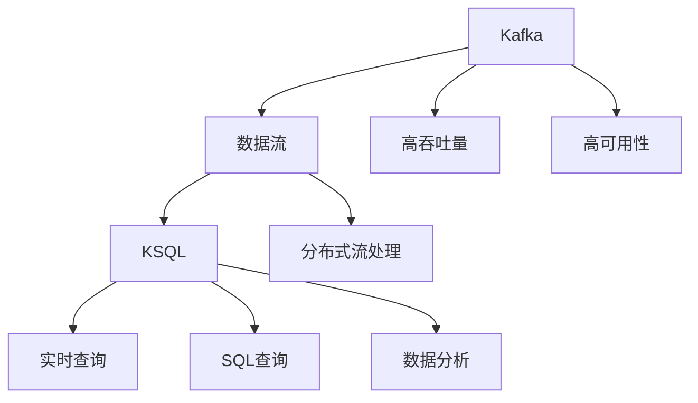
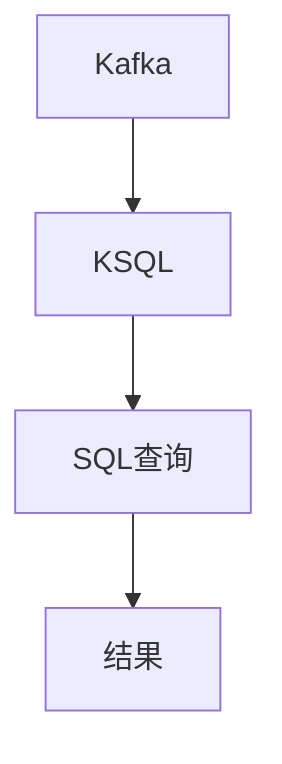
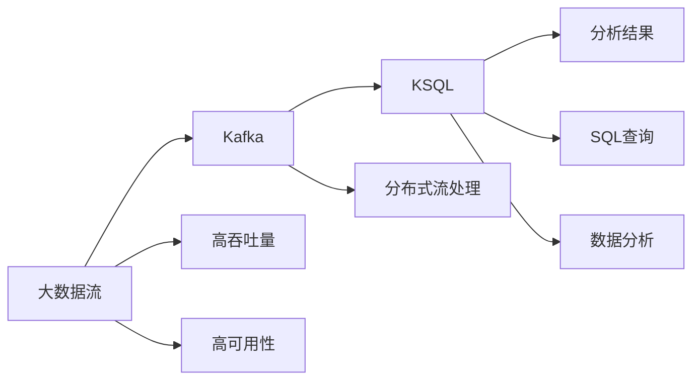

                 

# Kafka KSQL原理与代码实例讲解

> 关键词：Kafka, KSQL, 分布式流处理, 实时数据流, SQL语言, 大数据, 数据湖

## 1. 背景介绍

### 1.1 问题由来
在数据处理领域，流数据的处理变得越来越重要。越来越多的系统产生了大量的实时或准实时数据流，比如日志、传感器数据、交易数据、用户行为数据等。这些数据流的处理需要高效、可靠、可扩展的解决方案。

Kafka和KSQL是Apache软件基金会开源的数据处理系统，由LinkedIn公司开发，是处理大规模流数据的重要工具。Kafka是一个分布式流处理平台，支持高吞吐量、高可靠性的数据传输，而KSQL则是在Kafka上的实时数据流查询工具，支持SQL查询和数据分析。

Kafka和KSQL的结合，为实时数据流的处理提供了高效、可扩展、可靠的技术方案，被广泛应用于大数据、数据湖、流处理、事件驱动等场景。

### 1.2 问题核心关键点
Kafka和KSQL的核心关键点包括：
- Kafka是一个分布式流平台，支持高吞吐量、高可靠性的数据传输。
- KSQL是基于Kafka的流式SQL查询工具，支持SQL查询和数据分析。
- 二者结合，可以实现高效、可靠、可扩展的实时数据流处理。

## 2. 核心概念与联系

### 2.1 核心概念概述

为更好地理解Kafka和KSQL的工作原理和架构，本节将介绍几个关键概念：

- Kafka：一个分布式流平台，支持高吞吐量、高可靠性的数据传输。
- KSQL：基于Kafka的流式SQL查询工具，支持SQL查询和数据分析。
- 分布式流处理：将大规模数据流分布式地处理，以支持高吞吐量和高可用性。
- 实时数据流：指在时间线上实时产生和消费的数据流。
- 数据湖：一个集成了所有数据的存储库，支持大数据分析和实时数据处理。

这些核心概念之间的关系可以通过以下Mermaid流程图来展示：



这个流程图展示了Kafka和KSQL的核心概念及其之间的关系：

1. Kafka提供了高吞吐量、高可靠性的数据流传输。
2. KSQL在Kafka上实现了实时数据流的SQL查询和分析。
3. 通过分布式流处理技术，Kafka和KSQL可以处理大规模数据流。
4. 实时数据流通过Kafka传输到KSQL，被查询和分析。
5. 数据湖可以集成Kafka和KSQL，支持大数据分析和实时数据处理。

### 2.2 概念间的关系

这些核心概念之间存在着紧密的联系，形成了Kafka和KSQL的完整生态系统。下面我们通过几个Mermaid流程图来展示这些概念之间的关系。

#### 2.2.1 Kafka的工作流程


这个流程图展示了Kafka的基本工作流程：

1. 消息被生产者发送到Kafka。
2. Kafka接收到消息后，将消息存储在分布式分区中。
3. 消费者从Kafka中订阅分区，接收并处理消息。
4. 接收者处理完消息后，可以进行后续的数据处理或存储。

#### 2.2.2 KSQL的查询流程



这个流程图展示了KSQL的基本查询流程：

1. Kafka接收到消息后，发送给KSQL。
2. KSQL将消息解析为SQL语句，进行实时查询。
3. 查询结果通过KSQL计算并存储，供后续分析或处理。

#### 2.2.3 Kafka和KSQL的结合


这个流程图展示了Kafka和KSQL的结合过程：

1. 数据流被生产者发送到Kafka。
2. Kafka将数据流存储在分布式分区中。
3. KSQL在Kafka上执行SQL查询，实时分析数据流。
4. 分析结果供后续处理或存储。

### 2.3 核心概念的整体架构

最后，我们用一个综合的流程图来展示这些核心概念在大数据流处理中的整体架构：



这个综合流程图展示了从数据流产生到实时查询和分析的完整过程。Kafka和KSQL通过分布式流处理技术，高效地处理大规模数据流，支持高吞吐量和高可用性，实现了实时数据的查询和分析。

## 3. 核心算法原理 & 具体操作步骤
### 3.1 算法原理概述

Kafka和KSQL的核心算法原理主要包括：

- Kafka通过分布式分区和流式传输机制，实现了高吞吐量和高可用性。
- KSQL通过流式SQL查询，实现了实时数据的分析和处理。

### 3.2 算法步骤详解

Kafka和KSQL的基本流程可以分为以下几个步骤：

**Step 1: 创建Kafka集群**
- 安装Kafka并启动多个Kafka节点，构成分布式集群。
- 配置Kafka集群，包括分区数、复制因子、broker地址等参数。
- 创建topic并设置分区数、副本数等参数。

**Step 2: 安装KSQL**
- 在Kafka集群上安装KSQL。
- 配置KSQL连接Kafka集群，指定broker地址和topic名称。
- 创建KSQL查询表，从Kafka topic中读取数据。

**Step 3: 执行SQL查询**
- 在KSQL中编写SQL查询语句，对实时数据流进行分析和处理。
- 通过KSQL的计算引擎，对查询结果进行实时计算和存储。
- 查询结果可以进一步进行处理，如写入数据库、展示给用户等。

**Step 4: 监控和管理**
- 通过KSQL的监控工具，实时查看查询性能和集群状态。
- 根据监控结果，对Kafka集群和KSQL配置进行优化调整。
- 定期备份和恢复Kafka和KSQL数据，保障数据安全和可靠性。

### 3.3 算法优缺点

Kafka和KSQL的主要优点包括：

- 高吞吐量：通过分布式分区和流式传输，支持高吞吐量的大数据流传输。
- 高可用性：通过副本和故障转移机制，保障数据处理的高可用性。
- 实时性：支持实时数据流处理，满足实时查询和分析的需求。
- 可扩展性：支持水平扩展，轻松应对数据量增长。
- 兼容性：兼容多种数据源和数据格式，支持多数据流整合。

Kafka和KSQL的主要缺点包括：

- 学习曲线陡峭：对于初学者而言，Kafka和KSQL的使用需要一定的学习曲线。
- 配置复杂：集群配置和数据流配置比较复杂，需要仔细规划和调试。
- 高资源消耗：处理大数据流需要大量的计算和存储资源，需要投入一定的硬件设施。
- 不适合低延迟场景：对于低延迟要求高的场景，Kafka和KSQL的实时性可能会有一定的延迟。

### 3.4 算法应用领域

Kafka和KSQL的应用领域非常广泛，包括但不限于以下几个方面：

- 大数据处理：用于处理大规模数据流，支持大数据分析和实时数据处理。
- 数据湖构建：用于构建数据湖，集成各种数据源和数据格式。
- 实时数据流分析：用于实时数据流分析，支持实时决策和实时监控。
- 事件驱动架构：用于事件驱动架构，支持高吞吐量和高可靠性的事件处理。
- 金融风控：用于金融风控，支持实时监控和实时预警。
- 电商推荐：用于电商推荐系统，支持实时推荐和实时分析。
- IoT数据处理：用于IoT数据处理，支持实时数据传输和实时分析。

## 4. 数学模型和公式 & 详细讲解  
### 4.1 数学模型构建

在Kafka和KSQL中，主要涉及以下几个数学模型：

- 分布式分区模型：描述Kafka的分布式分区机制，计算每个分区的容量和负载。
- 流式传输模型：描述Kafka的流式传输机制，计算消息传输的吞吐量和延迟。
- 流式SQL查询模型：描述KSQL的流式查询机制，计算查询结果的实时性和准确性。

### 4.2 公式推导过程

以下我们将分别对这三个数学模型进行推导，并给出具体的公式和推导过程。

**分布式分区模型**

Kafka的分区模型是分布式流处理的基础，其核心思想是将大规模数据流分成多个分区，并分布在多个节点上进行并行处理，以提高处理效率和系统可用性。

假设Kafka集群有N个节点，每个节点处理K个分区，则总分区数为：

$$
\text{Total Partitions} = N \times K
$$

每个分区的容量为C，每个节点的处理能力为T，则每个分区的负载率为：

$$
\text{Partition Load Rate} = \frac{T}{N \times K}
$$

在实际应用中，节点数和分区数需要根据数据量和系统要求进行调整，以达到最优的处理效率和可用性。

**流式传输模型**

Kafka的流式传输模型通过缓冲区、缓冲区水位线和消息传递机制，实现高吞吐量和低延迟的消息传输。

假设每个分区的大小为S，消息的传输速度为V，缓冲区大小为B，则缓冲区的水位线为：

$$
\text{Buffer Waterline} = S \times \frac{N}{B} + \frac{V \times S}{N}
$$

当消息到达缓冲区水位线时，需要触发消息传递机制，将消息传递到下一个节点，以保证高吞吐量和低延迟的传输。

**流式SQL查询模型**

KSQL的流式SQL查询模型通过实时解析和计算，实现流数据的实时查询和分析。

假设KSQL接收到K个分区，每个分区的数据量为P，查询结果的大小为R，查询时间间隔为T，则实时查询的吞吐量为：

$$
\text{Real-time Query Throughput} = \frac{K \times P}{T \times R}
$$

实时查询的延迟取决于查询的复杂度和数据量，需要通过优化查询语句和调整计算资源来进一步降低延迟。

### 4.3 案例分析与讲解

以电商推荐系统为例，展示Kafka和KSQL的实际应用。

假设一个电商平台有10个数据源，每个数据源产生1GB的数据流，共10GB的数据流。通过Kafka将数据流发送到KSQL，进行实时分析和推荐。

**Step 1: 创建Kafka集群**

在10台服务器上安装Kafka，配置集群参数，创建10个topic，每个topic有1个分区，副本数为3。

**Step 2: 安装KSQL**

在Kafka集群上安装KSQL，配置KSQL连接Kafka集群，指定broker地址和topic名称。

**Step 3: 编写SQL查询**

在KSQL中编写SQL查询语句，对10GB的数据流进行实时分析和推荐。查询结果存储在Hadoop数据库中，供后续展示和处理。

**Step 4: 监控和管理**

通过KSQL的监控工具，实时查看查询性能和集群状态，根据监控结果调整集群配置和查询语句。

## 5. 项目实践：代码实例和详细解释说明
### 5.1 开发环境搭建

在进行Kafka和KSQL的开发前，我们需要准备好开发环境。以下是使用Python进行Kafka和KSQL开发的环境配置流程：

1. 安装Java：Kafka和KSQL都是基于Java开发的，需要安装Java JDK环境。

2. 安装Kafka：从官网下载并安装Kafka，配置Kafka集群，启动Kafka节点。

3. 安装KSQL：在Kafka集群上安装KSQL，配置KSQL连接Kafka集群，启动KSQL服务器。

4. 安装Python客户端：安装Python的Kafka和KSQL客户端，使用Python进行数据生产和消费。

5. 安装其他依赖包：安装其他必要的Python依赖包，如numpy、pandas、PyKafka等。

完成上述步骤后，即可在Kafka集群上启动KSQL，进行实时数据流的处理和查询。

### 5.2 源代码详细实现

这里我们以一个简单的Kafka和KSQL项目为例，展示其代码实现。

**Kafka数据生产**

```python
from kafka import KafkaProducer
import json
import time

producer = KafkaProducer(bootstrap_servers='localhost:9092')
topic = 'topic1'

for i in range(10):
    data = {'id': i, 'value': i * 100}
    producer.send(topic, value=json.dumps(data).encode('utf-8'))
    time.sleep(1)
```

**KSQL数据消费**

```python
from kafka import KafkaConsumer
import json
import pandas as pd

consumer = KafkaConsumer('topic1', bootstrap_servers='localhost:9092', value_deserializer=lambda x: json.loads(x.decode('utf-8')))
df = pd.DataFrame(consumer)

print(df)
```

**KSQL查询**

```sql
CREATE STREAM order_stream (order_id INT, order_time VARCHAR, total_amount DOUBLE) WITH (kafka_topic='order_topic', format='json');
SELECT order_id, order_time, total_amount, ROUND(total_amount, 2) AS formatted_amount
FROM order_stream
```

在上述代码中，我们使用了Kafka的Python客户端进行数据生产和消费，使用了KSQL的SQL语句进行数据查询。

### 5.3 代码解读与分析

让我们再详细解读一下关键代码的实现细节：

**Kafka数据生产**

- 创建KafkaProducer对象，指定broker地址和topic名称。
- 循环生产10条数据，每条数据包括id和value，发送到指定的topic。
- 使用time.sleep()方法在每条数据之间休眠1秒，模拟实时数据流的产生。

**KSQL数据消费**

- 创建KafkaConsumer对象，指定topic名称和broker地址。
- 使用pandas库将消费的数据转换成DataFrame格式，方便后续处理。
- 输出DataFrame，展示消费的数据。

**KSQL查询**

- 创建KSQL stream，指定kafka_topic和format参数。
- 使用SELECT语句对stream进行查询，返回订单id、订单时间、总金额和格式化后的金额。

**运行结果展示**

通过上述代码，我们可以在Kafka集群上启动KSQL，对实时数据流进行查询和处理。查询结果将展示在KSQL的输出中，供后续分析和展示。

## 6. 实际应用场景
### 6.1 智能客服系统

基于Kafka和KSQL的智能客服系统可以高效地处理客户咨询和回复，提供快速、准确的客户服务。系统通过Kafka收集客户咨询，使用KSQL进行数据分析和处理，生成自动回复，从而实现智能客服。

**Step 1: 创建Kafka集群**

在多台服务器上安装Kafka，配置集群参数，创建客户咨询topic。

**Step 2: 安装KSQL**

在Kafka集群上安装KSQL，配置KSQL连接Kafka集群。

**Step 3: 编写SQL查询**

在KSQL中编写SQL查询语句，对客户咨询进行分析和处理，生成自动回复。

**Step 4: 监控和管理**

通过KSQL的监控工具，实时查看查询性能和集群状态，根据监控结果调整集群配置和查询语句。

## 7. 工具和资源推荐
### 7.1 学习资源推荐

为了帮助开发者系统掌握Kafka和KSQL的理论基础和实践技巧，这里推荐一些优质的学习资源：

1. Kafka官方文档：Kafka官方文档提供了详细的API文档和使用指南，是学习Kafka的必备资料。

2. KSQL官方文档：KSQL官方文档提供了详细的SQL语法和API文档，是学习KSQL的必备资料。

3. Kafka学习指南：《Kafka: The Definitive Guide》一书深入浅出地介绍了Kafka的工作原理和最佳实践。

4. KSQL学习指南：《KSQL: SQL for Streaming Data》一书介绍了KSQL的基本概念和SQL查询技巧。

5. Udemy Kafka和KSQL课程：Udemy上有多个Kafka和KSQL的在线课程，适合初学者和进阶学习者。

6. LinkedIn Learning Kafka和KSQL课程：LinkedIn Learning上有多个Kafka和KSQL的在线课程，适合初学者和进阶学习者。

通过这些资源的学习实践，相信你一定能够快速掌握Kafka和KSQL的精髓，并用于解决实际的业务问题。

### 7.2 开发工具推荐

高效的开发离不开优秀的工具支持。以下是几款用于Kafka和KSQL开发的常用工具：

1. Kafka：Kafka官方提供的开发工具，支持大数据流传输和流式处理。

2. KSQL：KSQL官方提供的开发工具，支持SQL查询和流式处理。

3. Confluent Platform：Kafka的商业化解决方案，提供完整的Kafka和KSQL生态系统。

4. Apache NiFi：Apache NiFi支持大数据流的传输、转换和加载，与Kafka无缝集成。

5. Dataflow：Google Cloud的流式处理工具，支持实时数据流处理和数据湖构建。

6. Apache Spark：Apache Spark支持大数据处理和流式处理，与Kafka和KSQL无缝集成。

合理利用这些工具，可以显著提升Kafka和KSQL的开发效率，加快创新迭代的步伐。

### 7.3 相关论文推荐

Kafka和KSQL的发展源于学界的持续研究。以下是几篇奠基性的相关论文，推荐阅读：

1. Kafka: The Real-time Distributed Message System: A Tutorial: 介绍Kafka的基本概念和工作原理。

2. Kafka: Design Principles: 介绍Kafka的设计原则和关键技术。

3. Stream Processing with Apache Kafka: An Overview: 介绍Kafka在流处理中的应用。

4. Kafka Streams: Processing Streams in Kafka: 介绍Kafka Streams的流式处理功能。

5. SQL on Kafka Streams: 介绍Kafka Streams和KSQL的集成使用。

6. Scalable and Consistent Real-time Data Processing with Kafka: 介绍Kafka的高吞吐量和高可用性。

这些论文代表了大数据流处理的发展脉络。通过学习这些前沿成果，可以帮助研究者把握学科前进方向，激发更多的创新灵感。

除上述资源外，还有一些值得关注的前沿资源，帮助开发者紧跟Kafka和KSQL技术的最新进展，例如：

1. arXiv论文预印本：人工智能领域最新研究成果的发布平台，包括大量尚未发表的前沿工作，学习前沿技术的必读资源。

2. 业界技术博客：如Kafka官方博客、KSQL官方博客、Confluent官方博客等，第一时间分享他们的最新研究成果和洞见。

3. 技术会议直播：如KAFKA meetup、KAFKAconf、Apache Spark大会等，能够聆听到大佬们的前沿分享，开拓视野。

4. GitHub热门项目：在GitHub上Star、Fork数最多的Kafka和KSQL相关项目，往往代表了该技术领域的发展趋势和最佳实践，值得去学习和贡献。

5. 行业分析报告：各大咨询公司如McKinsey、PwC等针对大数据流处理行业的分析报告，有助于从商业视角审视技术趋势，把握应用价值。

总之，对于Kafka和KSQL的学习和实践，需要开发者保持开放的心态和持续学习的意愿。多关注前沿资讯，多动手实践，多思考总结，必将收获满满的成长收益。

## 8. 总结：未来发展趋势与挑战
### 8.1 总结

本文对Kafka和KSQL的原理与实践进行了全面系统的介绍。首先阐述了Kafka和KSQL的研究背景和意义，明确了流数据处理在数据处理领域的重要性和紧迫性。其次，从原理到实践，详细讲解了Kafka和KSQL的工作原理和关键步骤，给出了Kafka和KSQL项目开发的完整代码实例。同时，本文还广泛探讨了Kafka和KSQL在智能客服、金融风控、电商推荐等实际应用场景中的应用前景，展示了其广阔的应用前景。

通过本文的系统梳理，可以看到，Kafka和KSQL为大规模流数据的处理提供了高效、可靠、可扩展的解决方案，推动了大数据、数据湖、流处理、事件驱动等技术的发展。未来，伴随流处理技术的不断进步，基于Kafka和KSQL的技术手段将不断拓展，为各行各业提供更加智能、高效的数据处理能力。

### 8.2 未来发展趋势

展望未来，Kafka和KSQL的发展趋势将呈现以下几个方向：

1. 容器化部署：Kafka和KSQL将支持容器化部署，方便在多种云平台和集群环境中运行。

2. 大数据湖：Kafka和KSQL将支持数据湖的构建，集成多种数据源和数据格式，提供更全面、丰富的数据处理能力。

3. 事件驱动架构：Kafka和KSQL将支持事件驱动架构，实现实时数据流的高吞吐量和低延迟传输。

4. 微服务化：Kafka和KSQL将支持微服务化，提供更灵活、可扩展的数据处理能力。

5. 实时流分析：Kafka和KSQL将支持实时流分析，提供更强大、精准的数据分析和决策支持能力。

6. 分布式处理：Kafka和KSQL将支持更强大的分布式处理能力，支持更大规模、更复杂的数据流处理需求。

7. 自动调优：Kafka和KSQL将支持自动调优，优化数据流处理性能和资源使用效率。

以上趋势凸显了Kafka和KSQL技术的强大潜力和广泛应用前景。这些方向的探索发展，必将进一步提升大数据流处理的性能和应用范围，为数据驱动决策提供更强大的技术支持。

### 8.3 面临的挑战

尽管Kafka和KSQL已经取得了显著成就，但在迈向更加智能化、普适化应用的过程中，它仍面临着诸多挑战：

1. 学习曲线陡峭：对于初学者而言，Kafka和KSQL的使用需要一定的学习曲线。需要投入一定的时间和精力进行学习和实践。

2. 配置复杂：集群配置和数据流配置比较复杂，需要仔细规划和调试。配置不当可能导致性能瓶颈和数据丢失。

3. 高资源消耗：处理大规模数据流需要大量的计算和存储资源，需要投入一定的硬件设施。资源不足可能导致数据处理延迟和性能下降。

4. 不适合低延迟场景：对于低延迟要求高的场景，Kafka和KSQL的实时性可能会有一定的延迟。数据处理延迟可能导致系统性能下降。

5. 数据一致性：在分布式环境中，Kafka和KSQL的数据一致性需要仔细设计和保障。不当的设计可能导致数据一致性问题。

6. 系统可靠性：在分布式环境中，Kafka和KSQL的系统可靠性需要仔细设计和保障。不当的设计可能导致系统崩溃和数据丢失。

这些挑战需要开发者在实践过程中不断优化和改进，才能充分发挥Kafka和KSQL的优势，实现其应用价值。

### 8.4 研究展望

面对Kafka和KSQL面临的挑战，未来的研究需要在以下几个方面寻求新的突破：

1. 简化配置：通过优化配置和使用工具，简化Kafka和KSQL的部署和调试。

2. 提高性能：通过优化算法和优化资源，提高Kafka和KSQL的性能和效率。

3. 增强可靠性：通过冗余设计和备份机制，增强Kafka和KSQL的系统可靠性和数据一致性。

4. 支持更多数据源：通过引入更多数据源和数据格式，支持更丰富、多样化的数据流处理需求。

5. 支持更多场景：通过优化算法和优化架构，支持更多、更复杂的数据流处理场景。

6. 支持更多语言：通过扩展SDK和API，支持更多编程语言和开发环境。

这些研究方向将推动Kafka和KSQL技术的进一步发展和优化，为数据处理和决策支持提供更强大、灵活、可靠的技术手段。

## 9. 附录：常见问题与解答

**Q1：Kafka和KSQL的区别是什么？**

A: Kafka是一个分布式流平台，支持高吞吐量、高可靠性的数据传输。KSQL是基于Kafka的流式SQL查询工具，支持SQL查询和数据分析。

**Q2：Kafka和KSQL如何集成？**

A: Kafka和KSQL可以通过kafka.stream()函数进行集成，将Kafka的流数据发送到KSQL进行实时查询和分析。

**Q3：Kafka和KSQL的性能如何保证？**

A: Kafka和KSQL通过分布式分区和流式传输机制，保证高吞吐量和低延迟的数据传输。同时，KSQL通过流式SQL查询，实现实时数据的高效处理。

**Q4：Kafka和KSQL在实际应用中需要注意哪些问题？**

A: 在实际应用中，需要注意集群配置、数据流配置、系统监控等问题。同时，需要优化查询语句和调整计算资源，以实现最优的性能和可靠性。

**Q5：Kafka和KSQL在哪些场景下应用效果最好？**

A: Kafka和KSQL适用于高吞吐量、高可靠性的数据流处理场景，如大数据处理、数据湖构建、实时数据流分析等。在低延迟要求高的场景，Kafka和KSQL的实时性可能会有一定的延迟。

