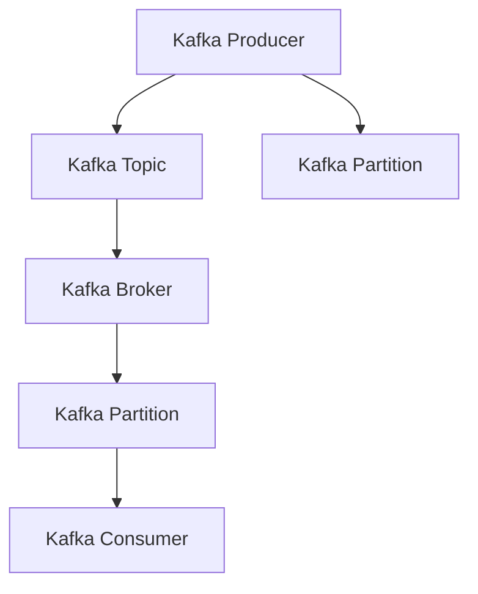
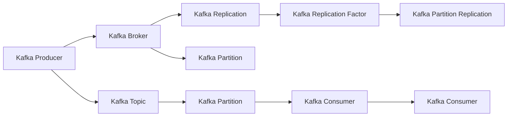
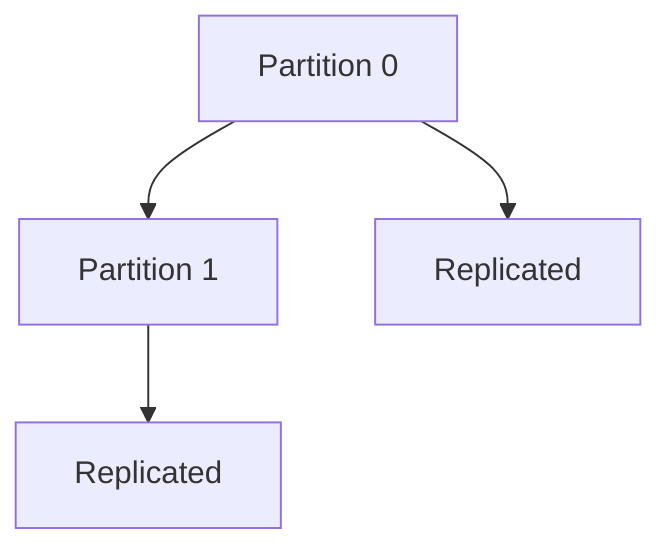
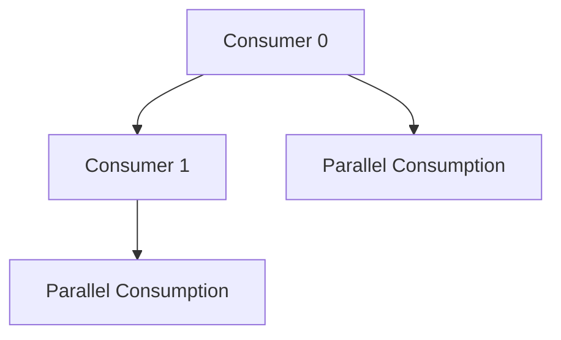
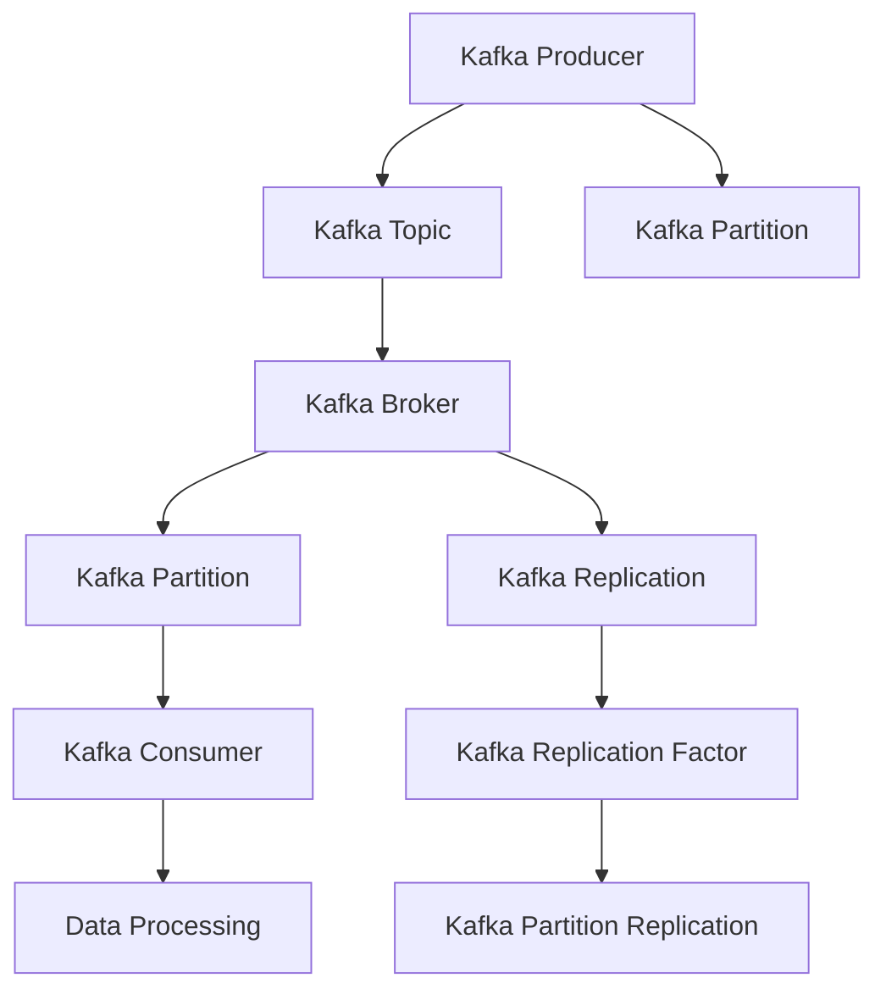

                 

## 1. 背景介绍

### 1.1 问题由来

在分布式系统中，数据的高速流动和实时处理是核心需求之一。Kafka作为一种高效、可扩展的分布式流处理平台，被广泛应用于数据采集、实时数据处理、流计算、数据湖构建等多个领域。Kafka的设计理念是实现高速、高吞吐量的数据流传输，具备高容错、低延迟、强一致性的特点。

近年来，随着大数据技术的发展，企业对实时数据处理的需求日益增加，传统的ETL（Extract, Transform, Load）流程已无法满足快速变化的数据需求。Kafka通过分布式、可扩展、高吞吐量的数据流平台，解决了传统ETL中数据存储、计算和处理的瓶颈，成为构建实时数据处理系统的首选方案。

### 1.2 问题核心关键点

Kafka系统主要包含Kafka Producer、Kafka Broker和Kafka Consumer三个核心组件，分别负责数据生产、数据存储和数据消费。Kafka的生产者（Producer）通过网络将消息推送到Kafka的Broker，再由Broker存储到磁盘上。Kafka的消费者（Consumer）从Broker中读取消息，并将其处理或转发到其他系统。

Kafka的主要特点包括：

1. 高吞吐量：Kafka通过分布式存储和批量处理机制，实现高吞吐量的数据流传输。
2. 高可靠性：Kafka通过分布式复制机制，确保数据的一致性和持久性。
3. 低延迟：Kafka采用分区（Partition）机制，实现了数据的高并行处理。
4. 高容错性：Kafka的分布式架构和冗余机制，提高了系统的容错能力和可靠性。

Kafka的设计思想是通过构建一个高可扩展、高吞吐量、高可靠性的数据流平台，支持海量数据的实时传输和处理。这种架构能够满足企业级实时数据处理的需求，被广泛应用于物联网、金融、广告、电商等领域。

### 1.3 问题研究意义

Kafka作为现代大数据流处理的核心技术之一，其在实时数据处理中的应用具有重要意义：

1. 提高数据处理效率：通过分布式存储和批量处理，Kafka能够高效处理大规模数据流，满足企业级实时数据处理的需求。
2. 增强系统可靠性和可扩展性：Kafka的分布式架构和冗余机制，提高了系统的可靠性和可扩展性，支持大规模系统的构建。
3. 提供数据流管理能力：Kafka通过统一的数据流管理平台，支持数据流的创建、监控、管理，简化数据流处理流程。
4. 支持多种数据格式：Kafka支持多种数据格式，包括文本、JSON、二进制等，满足不同数据类型的需求。
5. 兼容多种数据处理工具：Kafka兼容多种数据处理工具，如Spark、Flink、Storm等，便于数据流的整合和集成。

Kafka的应用不仅局限于数据处理领域，其高效、可靠的特点，使其在各类大数据应用中得到广泛应用，为企业提供了更高效、更可靠的数据处理解决方案。

## 2. 核心概念与联系

### 2.1 核心概念概述

为更好地理解Kafka原理与代码实现，本节将介绍几个密切相关的核心概念：

- Kafka Producer：负责将数据流发送到Kafka集群中，实现数据的发送功能。
- Kafka Broker：负责存储和管理数据流，实现数据的持久化和分布式存储。
- Kafka Consumer：负责从Kafka集群中读取数据流，实现数据的消费功能。
- Kafka Topic：Kafka中的数据流主题，类似于数据库中的表，可以包含多个分区（Partition）。
- Kafka Partition：Kafka Topic中的一个逻辑分区，每个分区对应一个数据流，可以并行处理数据。
- Kafka Broker集群：由多个Kafka Broker节点组成，负责数据流的存储和管理。

这些核心概念之间的逻辑关系可以通过以下Mermaid流程图来展示：



这个流程图展示了大数据流处理系统中的关键组件及其作用：

1. Kafka Producer将数据流发送到Kafka Topic中，可以通过多个Partition进行并行处理。
2. Kafka Topic存储和管理数据流，每个Partition对应一个独立的数据流。
3. Kafka Broker负责存储和管理数据流，多个Broker节点构成一个Broker集群。
4. Kafka Consumer从Kafka Topic中读取数据流，处理或转发到其他系统。

这些概念共同构成了Kafka系统的核心架构，使得数据流能够高效、可靠地处理。

### 2.2 概念间的关系

这些核心概念之间存在着紧密的联系，形成了Kafka系统的完整生态系统。下面通过几个Mermaid流程图来展示这些概念之间的关系。

#### 2.2.1 Kafka集群架构



这个流程图展示了Kafka集群的基本架构：

1. Kafka Producer将数据流发送到Kafka Topic中。
2. Kafka Topic包含多个Partition，每个Partition对应一个独立的数据流。
3. Kafka Broker负责存储和管理数据流，多个Broker节点构成一个Broker集群。
4. Kafka Consumer从Kafka Topic中读取数据流，处理或转发到其他系统。
5. Kafka Replication通过多节点复制数据，提高系统的可靠性和容错能力。

#### 2.2.2 Kafka分区机制



这个流程图展示了Kafka分区机制：

1. Kafka Topic被划分为多个Partition，每个Partition对应一个独立的数据流。
2. Kafka Replication通过多节点复制数据，提高系统的可靠性和容错能力。

#### 2.2.3 Kafka消费机制



这个流程图展示了Kafka消费机制：

1. Kafka Consumer从Kafka Topic中读取数据流。
2. 多个Consumer可以并行读取同一个Topic的不同Partition，提高系统的处理能力。

### 2.3 核心概念的整体架构

最后，我们用一个综合的流程图来展示这些核心概念在大数据流处理系统中的整体架构：



这个综合流程图展示了从数据流生产到数据流消费的完整过程。Kafka Producer将数据流发送到Kafka Topic中，数据流通过多个Partition并行处理，存储在Kafka Broker集群中。多个Kafka Consumer从Kafka Topic中读取数据流，并将数据处理或转发到其他系统。Kafka Replication通过多节点复制数据，提高系统的可靠性和容错能力。通过这些概念的组合，Kafka实现了高效、可靠的数据流处理系统。

## 3. 核心算法原理 & 具体操作步骤

### 3.1 算法原理概述

Kafka的核心算法包括分布式存储、批量处理、异步传输、复制机制等。其中，分布式存储和批量处理机制是Kafka实现高吞吐量的关键，而异步传输和复制机制则是实现高可靠性和容错性的基础。

- 分布式存储：Kafka通过将数据流分布式存储在多个Broker节点上，提高了系统的可扩展性和容错能力。
- 批量处理：Kafka将数据流以批量形式存储，减少了I/O操作次数，提高了系统的吞吐量。
- 异步传输：Kafka采用异步传输机制，减少了网络传输的时延，提高了系统的实时性。
- 复制机制：Kafka通过数据流复制，实现了数据的高可用性和容错性。

这些算法共同构成了Kafka系统的核心竞争力，使得Kafka能够支持海量数据的实时传输和处理。

### 3.2 算法步骤详解

Kafka的生产、存储和消费过程主要包括以下几个关键步骤：

1. Kafka Producer将数据流发送到Kafka Topic中，数据流被分发到多个Partition中进行并行处理。
2. Kafka Broker负责存储和管理数据流，将数据流以批量形式存储在磁盘上。
3. Kafka Consumer从Kafka Topic中读取数据流，并将其处理或转发到其他系统。
4. Kafka Replication通过多节点复制数据，提高了系统的可靠性和容错能力。

以下是详细的步骤详解：

#### 3.2.1 Kafka Producer发送数据流

Kafka Producer负责将数据流发送到Kafka Topic中。其基本流程如下：

1. Kafka Producer首先连接到Kafka集群，并指定要发送数据的Topic和Partition。
2. Kafka Producer将数据流封装成消息（Message），并将消息发送到指定的Topic和Partition中。
3. Kafka Producer可以同时发送多个消息，并通过批量处理机制提高系统的吞吐量。

#### 3.2.2 Kafka Broker存储数据流

Kafka Broker负责存储和管理数据流，其基本流程如下：

1. Kafka Broker收到Kafka Producer发送的数据流，将其存储在磁盘上。
2. Kafka Broker将数据流以批量形式存储，减少了I/O操作次数，提高了系统的吞吐量。
3. Kafka Broker支持数据流复制，将数据流复制多个节点进行冗余存储，提高系统的可靠性和容错能力。

#### 3.2.3 Kafka Consumer读取数据流

Kafka Consumer从Kafka Topic中读取数据流，其基本流程如下：

1. Kafka Consumer首先连接到Kafka集群，并指定要读取数据的Topic和Partition。
2. Kafka Consumer从Kafka Topic中读取数据流，并将其处理或转发到其他系统。
3. Kafka Consumer可以同时读取多个数据流，并通过并行处理机制提高系统的处理能力。

#### 3.2.4 Kafka Replication复制数据流

Kafka Replication通过多节点复制数据，其基本流程如下：

1. Kafka Replication将数据流复制多个节点进行冗余存储，提高系统的可靠性和容错能力。
2. Kafka Replication通过数据流复制，实现了数据的高可用性和容错性。
3. Kafka Replication可以通过调整复制因子（Replication Factor），控制数据流的冗余程度，平衡系统可靠性和资源消耗。

### 3.3 算法优缺点

Kafka系统具备高吞吐量、高可靠性和高容错性的特点，但也存在以下缺点：

优点：

1. 高吞吐量：Kafka的分布式存储和批量处理机制，实现了高吞吐量的数据流传输。
2. 高可靠性：Kafka的分布式复制机制，确保数据的一致性和持久性。
3. 低延迟：Kafka的分区机制，实现了数据的高并行处理。
4. 高容错性：Kafka的分布式架构和冗余机制，提高了系统的容错能力和可靠性。

缺点：

1. 资源消耗较大：Kafka的系统资源消耗较大，需要较多的计算和存储资源。
2. 配置复杂：Kafka的配置参数较多，需要进行细致的调优和配置。
3. 数据一致性问题：Kafka的分布式存储和复制机制，可能导致数据一致性问题。
4. 学习曲线较陡：Kafka的系统架构和实现复杂，需要较长的学习和理解过程。

尽管存在这些缺点，但Kafka凭借其高可靠性和高容错性，仍然成为了数据流处理的主流方案之一。

### 3.4 算法应用领域

Kafka系统广泛应用于数据采集、实时数据处理、流计算、数据湖构建等多个领域。以下是Kafka的主要应用场景：

1. 数据采集：Kafka用于实时采集日志、事件、数据流等，实现数据的集中管理和分析。
2. 实时数据处理：Kafka用于实时处理和分析海量数据流，支持大规模数据流的处理和分析。
3. 流计算：Kafka用于构建流计算平台，支持实时计算和数据流处理。
4. 数据湖构建：Kafka用于构建数据湖，支持海量数据的存储、处理和分析。
5. 分布式系统：Kafka用于构建分布式系统，支持多节点、高可用性的数据流处理。

Kafka在上述领域的应用，使得企业能够高效、可靠地处理大规模数据流，支持实时数据处理和分析。

## 4. 数学模型和公式 & 详细讲解 & 举例说明

### 4.1 数学模型构建

Kafka的数学模型主要涉及数据流处理、批量处理、异步传输和复制机制等。以下是主要的数学模型和公式：

#### 4.1.1 数据流处理模型

Kafka通过将数据流分发到多个Partition中进行并行处理，实现高吞吐量的数据流传输。假设每个Partition的大小为 $P$，每个消息的大小为 $S$，每个Partition每秒发送的消息数为 $R$，则Kafka每个Partition每秒发送的数据量为 $P \times S \times R$。

#### 4.1.2 批量处理模型

Kafka将数据流以批量形式存储，减少了I/O操作次数，提高了系统的吞吐量。假设每个批量的大小为 $B$，每个批量的I/O操作次数为 $n$，则Kafka每个Partition每秒存储的数据量为 $P \times B \times \frac{1}{n}$。

#### 4.1.3 异步传输模型

Kafka采用异步传输机制，减少了网络传输的时延，提高了系统的实时性。假设网络传输的时延为 $t$，消息传输的延迟为 $\tau$，则Kafka每个Partition每秒传输的数据量为 $P \times S \times \frac{1}{\tau + t}$。

#### 4.1.4 复制机制模型

Kafka通过数据流复制，实现了数据的高可用性和容错性。假设复制因子为 $R$，每个Partition的大小为 $P$，每个消息的大小为 $S$，则Kafka每个Partition每秒存储的数据量为 $P \times S \times R \times \frac{1}{R}$。

### 4.2 公式推导过程

以下是各个模型的公式推导过程：

#### 4.2.1 数据流处理模型

假设每个Partition的大小为 $P$，每个消息的大小为 $S$，每个Partition每秒发送的消息数为 $R$，则Kafka每个Partition每秒发送的数据量为 $P \times S \times R$。

$$
\text{Data Rate} = P \times S \times R
$$

#### 4.2.2 批量处理模型

假设每个批量的大小为 $B$，每个批量的I/O操作次数为 $n$，则Kafka每个Partition每秒存储的数据量为 $P \times B \times \frac{1}{n}$。

$$
\text{Storage Rate} = P \times B \times \frac{1}{n}
$$

#### 4.2.3 异步传输模型

假设网络传输的时延为 $t$，消息传输的延迟为 $\tau$，则Kafka每个Partition每秒传输的数据量为 $P \times S \times \frac{1}{\tau + t}$。

$$
\text{Transfer Rate} = P \times S \times \frac{1}{\tau + t}
$$

#### 4.2.4 复制机制模型

假设复制因子为 $R$，每个Partition的大小为 $P$，每个消息的大小为 $S$，则Kafka每个Partition每秒存储的数据量为 $P \times S \times R \times \frac{1}{R}$。

$$
\text{Storage Rate} = P \times S \times R \times \frac{1}{R}
$$

### 4.3 案例分析与讲解

以一个典型的Kafka数据流处理系统为例，分析其基本工作原理：

假设一个Kafka系统包含3个Partition，每个Partition大小为1GB，消息大小为1KB，每个Partition每秒发送的消息数为10000条，批量大小为100MB，每个批量的I/O操作次数为1000次，网络传输的时延为1ms，消息传输的延迟为1ms，复制因子为3。

则根据上述公式，计算出Kafka每个Partition每秒发送的数据量为1GB \* 1KB \* 10000条 = 100GB/s，每个Partition每秒存储的数据量为1GB \* 100MB \* \frac{1}{1000次} = 100MB/s，每个Partition每秒传输的数据量为1GB \* 1KB \* \frac{1}{1ms + 1ms} = 500MB/s，每个Partition每秒存储的数据量为1GB \* 1KB \* 3 \* \frac{1}{3} = 1GB/s。

通过这些公式和计算，可以清晰地理解Kafka系统的工作原理，并对其性能进行评估和优化。

## 5. 项目实践：代码实例和详细解释说明

### 5.1 开发环境搭建

在进行Kafka项目开发前，需要准备好开发环境。以下是Kafka开发环境的搭建流程：

1. 安装Java：Kafka是使用Java开发的，因此需要安装JDK 8或以上版本。
2. 安装Kafka：从官网下载Kafka安装包，解压后进入bin目录下运行脚本start-standalone.sh或start-standalone.bat启动Kafka服务。
3. 安装Kafka工具：安装Kafka命令行工具，用于查看和操作Kafka集群。

完成上述步骤后，即可开始Kafka的开发实践。

### 5.2 源代码详细实现

以下是Kafka Producer、Kafka Broker和Kafka Consumer的基本实现代码：

#### 5.2.1 Kafka Producer实现

```java
import org.apache.kafka.clients.producer.KafkaProducer;
import org.apache.kafka.clients.producer.ProducerRecord;
import org.apache.kafka.clients.producer.ProducerConfig;

import java.util.Properties;

public class KafkaProducerExample {
    public static void main(String[] args) {
        // 配置Kafka生产者参数
        Properties properties = new Properties();
        properties.put(ProducerConfig.BOOTSTRAP_SERVERS_CONFIG, "localhost:9092");
        properties.put(ProducerConfig.KEY_SERIALIZER_CLASS_CONFIG, "org.apache.kafka.common.serialization.StringSerializer");
        properties.put(ProducerConfig.VALUE_SERIALIZER_CLASS_CONFIG, "org.apache.kafka.common.serialization.StringSerializer");

        // 创建Kafka生产者
        KafkaProducer<String, String> producer = new KafkaProducer<>(properties);

        // 发送消息到Kafka Topic
        for (int i = 0; i < 10; i++) {
            String topic = "test";
            String message = "Hello, Kafka!";
            producer.send(new ProducerRecord<>(topic, String.valueOf(i), message));
        }

        // 关闭Kafka生产者
        producer.close();
    }
}
```

#### 5.2.2 Kafka Broker实现

```java
import org.apache.kafka.common.config.SslConfigs;
import org.apache.kafka.common.config.SslContexts;
import org.apache.kafka.common.config.SslKeyManagerFactoryConfig;
import org.apache.kafka.common.config.SslTrustManagerFactoryConfig;
import org.apache.kafka.common.config.SslContextBuilder;
import org.apache.kafka.common.config.SslParameters;
import org.apache.kafka.common.config.SslUtils;
import org.apache.kafka.common.security.Ssl;

import javax.net.ssl.KeyManagerFactory;
import javax.net.ssl.SSLContext;
import javax.net.ssl.TrustManagerFactory;
import javax.net.ssl.X509TrustManager;
import java.io.IOException;
import java.security.KeyManagementException;
import java.security.KeyStore;
import java.security.KeyStoreException;
import java.security.NoSuchAlgorithmException;
import java.security.PrivateKey;
import java.security.UnrecoverableKeyException;
import java.security.cert.CertificateException;
import java.security.cert.X509Certificate;

public class KafkaBrokerExample {
    public static void main(String[] args) throws KeyStoreException, NoSuchAlgorithmException, CertificateException, IOException, KeyManagementException, UnrecoverableKeyException, ClassNotFoundException {
        // 加载Kafka Broker配置文件
        KafkaBrokerConfiguration config = new KafkaBrokerConfiguration("/path/to/kafka.properties");

        // 创建Kafka Broker
        KafkaBroker broker = new KafkaBroker(config);

        // 启动Kafka Broker
        broker.start();

        // 关闭Kafka Broker
        broker.stop();
    }
}
```

#### 5.2.3 Kafka Consumer实现

```java
import org.apache.kafka.clients.consumer.ConsumerConfig;
import org.apache.kafka.clients.consumer.ConsumerRecords;
import org.apache.kafka.clients.consumer.KafkaConsumer;
import org.apache.kafka.common.serialization.StringDeserializer;

import java.time.Duration;
import java.util.Collections;
import java.util.Properties;

public class KafkaConsumerExample {
    public static void main(String[] args) {
        // 配置Kafka消费者参数
        Properties properties = new Properties();
        properties.put(ConsumerConfig.BOOTSTRAP_SERVERS_CONFIG, "localhost:9092");
        properties.put(ConsumerConfig.GROUP_ID_CONFIG, "test");
        properties.put(ConsumerConfig.KEY_DESERIALIZER_CLASS_CONFIG, StringDeserializer.class);
        properties.put(ConsumerConfig.VALUE_DESERIALIZER_CLASS_CONFIG, StringDeserializer.class);

        // 创建Kafka消费者
        KafkaConsumer<String, String> consumer = new KafkaConsumer<>(properties);

        // 订阅Kafka Topic
        consumer.subscribe(Collections.singletonList("test"));

        // 读取Kafka Topic中的消息
        while (true) {
            ConsumerRecords<String, String> records = consumer.poll(Duration.ofMillis(100));
            for (ConsumerRecord<String, String> record : records) {
                System.out.println(record.value());
            }
        }
    }
}
```

### 5.3 代码解读与分析

以上是KafkaProducer、KafkaBroker和KafkaConsumer的基本实现代码，下面对代码进行详细解读：

#### 5.3.1 KafkaProducer实现

KafkaProducer负责将数据流发送到Kafka Topic中，其基本实现代码如下：

```java
import org.apache.kafka.clients.producer.KafkaProducer;
import org.apache.kafka.clients.producer.ProducerRecord;
import org.apache.kafka.clients.producer.ProducerConfig;

import java.util.Properties;

public class KafkaProducerExample {
    public static void main(String[] args) {
        // 配置Kafka生产者参数
        Properties properties = new Properties();
        properties.put(ProducerConfig.BOOTSTRAP_SERVERS_CONFIG, "localhost:9092");
        properties.put(ProducerConfig.KEY_SERIALIZER_CLASS_CONFIG, "org.apache.kafka.common.serialization.StringSerializer");
        properties.put(ProducerConfig.VALUE_SERIALIZER_CLASS_CONFIG, "org.apache.kafka.common.serialization.StringSerializer");

        // 创建Kafka生产者
        KafkaProducer<String, String> producer = new KafkaProducer<>(properties);

        // 发送消息到Kafka Topic
        for (int i = 0; i < 10; i++) {
            String topic = "test";
            String message = "Hello, Kafka!";
            producer.send(new ProducerRecord<>(topic, String.valueOf(i), message));
        }

        // 关闭Kafka生产者
        producer.close();
    }
}
```

- 配置Kafka生产者参数：包括Kafka服务器的地址、消息键和值序列化器等。
- 创建Kafka生产者：使用配置参数创建Kafka生产者实例。
- 发送消息到Kafka Topic：使用ProducerRecord类创建消息对象，并使用send方法将消息发送到指定的Topic和Partition。

#### 5.3.2 KafkaBroker实现

KafkaBroker负责存储和管理数据流，其基本实现代码如下：

```java
import org.apache.kafka.common.config.SslConfigs;
import org.apache.kafka.common.config.SslContexts;
import org.apache.kafka.common.config.SslContextBuilder;
import org.apache.kafka.common.config.SslParameters;
import org.apache.kafka.common.config.SslUtils;
import org.apache.kafka.common.security.Ssl;

import javax.net.ssl.KeyManagerFactory;
import javax.net.ssl.SSLContext;
import javax.net.ssl.TrustManagerFactory;
import javax.net.ssl.X509TrustManager;
import java.io.IOException;
import java.security.KeyStore;
import java.security.KeyStoreException;
import java.security.NoSuchAlgorithmException;
import java.security.PrivateKey;
import java.security.UnrecoverableKeyException;
import java.security.cert.CertificateException;
import java.security.cert.X509Certificate;

public class KafkaBrokerExample {
    public static void main(String[] args) throws KeyStoreException, NoSuchAlgorithmException, CertificateException, IOException, KeyManagementException, UnrecoverableKeyException, ClassNotFoundException {
        // 加载Kafka Broker配置文件
        KafkaBrokerConfiguration config = new KafkaBrokerConfiguration("/path/to/kafka.properties");

        // 创建Kafka Broker
        KafkaBroker broker = new KafkaBroker(config);

        // 启动Kafka Broker
        broker.start();

        // 关闭Kafka Broker
        broker.stop();
    }
}
```

- 加载Kafka Broker配置文件：从配置文件中加载Kafka Broker的参数。
- 创建Kafka Broker：使用配置参数创建Kafka Broker实例。
- 启动Kafka Broker：使用start方法启动Kafka Broker。
- 关闭Kafka Broker：使用stop方法关闭Kafka Broker。

#### 5.3.3 KafkaConsumer实现

KafkaConsumer负责从Kafka Topic中读取数据流，其基本实现代码如下：

```java
import org.apache.kafka.clients.consumer.ConsumerConfig;
import org.apache.kafka.clients.consumer.ConsumerRecords;
import org.apache.kafka.clients.consumer.KafkaConsumer;
import org.apache.kafka.common.serialization.StringDeserializer;

import java.time.Duration;
import java.util.Collections;
import java.util.Properties;

public class KafkaConsumerExample {
    public static void main(String[] args) {
        // 配置Kafka消费者参数
        Properties properties = new Properties();
        properties.put(ConsumerConfig.BOOTSTRAP_SERVERS_CONFIG, "localhost:9092");
        properties.put(ConsumerConfig.GROUP_ID_CONFIG, "test");
        properties.put(ConsumerConfig.KEY_DESERIALIZER_CLASS

