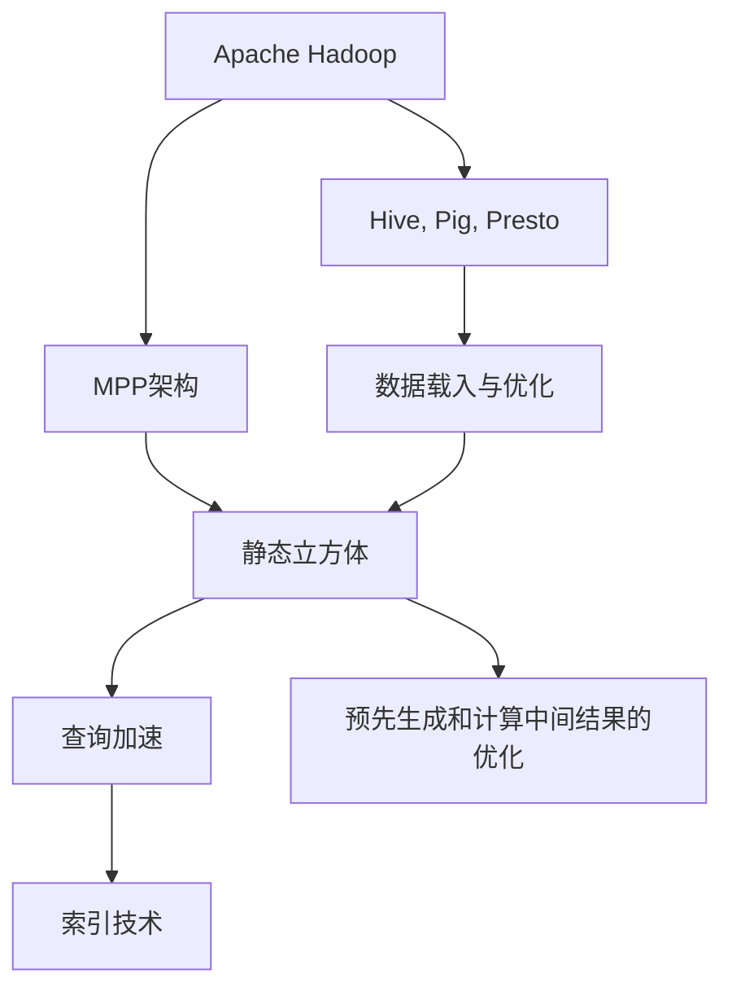

                 

# Kylin原理与代码实例讲解

> 关键词：Kylin, MPP, OLAP, Hadoop, Hive, Pig, Presto, ClickHouse

## 1. 背景介绍

### 1.1 问题由来
Kylin（凯林）是一款开源的大规模分布式联机分析处理（OLAP）系统，基于Apache Hadoop生态和MPP（多处理器）体系结构设计，支持在数百TB乃至数PB规模的数据上快速查询和分析。它广泛用于电商、金融、电信、媒体等领域的业务报表和数据分析，是数据仓库领域的重要技术。

然而，Kylin在面对海量数据处理、高并发访问、复杂查询优化等方面的挑战时，其设计原理和实现细节可能不太容易理解。因此，本文将对Kylin的原理进行详细介绍，并通过实际代码实例，帮助读者更好地理解其核心功能和应用场景。

### 1.2 问题核心关键点
Kylin的核心功能包括大规模分布式计算、高效的数据载入与优化、智能的查询加速机制等。它通过构建静态的立方体（Cube）结构，将复杂的多维分析任务转换为简单快速的多维聚合计算。通过预先生成索引和计算中间结果，Kylin实现了高并发的查询加速和优化。

为了更好地理解Kylin的工作原理和实现细节，我们需从以下几个方面进行深入探讨：
1. Kylin的MPP架构设计
2. 静态立方体（Cube）构建和优化
3. 查询加速与索引技术
4. 预先生成和计算中间结果的优化
5. 分布式任务调度和数据平衡

本文将通过这些关键点，逐步深入Kylin的设计原理和代码实现，帮助读者全面理解Kylin的运作机制，并能够应用于实际的数据仓库项目中。

### 1.3 问题研究意义
Kylin作为一个高效的大规模数据处理系统，能够帮助企业快速构建和维护数据仓库，提升业务报表的生成和查询速度，降低数据处理的成本。理解Kylin的原理，对于数据分析工程师、数据仓库架构师以及系统开发者都有重要的参考价值。

## 2. 核心概念与联系

### 2.1 核心概念概述

为更好地理解Kylin的原理，我们首先介绍一些关键概念：

- **MPP（多处理器并行处理）架构**：MPP架构是将数据存储和处理分布在多个处理器上，各处理器独立运行，但共享全局索引和元数据。这种架构可以高效利用硬件资源，提高大规模数据处理能力。

- **OLAP（联机分析处理）**：OLAP是一种多维数据分析技术，支持复杂的多维查询，如聚合计算、切片、切块等。它通常用于数据仓库和商业智能（BI）系统。

- **静态立方体（Cube）**：静态立方体是Kylin中用于存储数据的一种结构。它将数据映射为一个多维数组，每个维度对应一个表格，每个单元表示一个数据点。

- **查询加速与索引技术**：Kylin通过预先生成索引和计算中间结果，实现了高效的查询加速。索引技术包括行级索引、列级索引、列式索引等。

- **预先生成和计算中间结果的优化**：Kylin通过在静态立方体中预先生成计算中间结果，减少了实际查询时对原始数据的访问，提升了查询效率。

这些核心概念共同构成了Kylin的核心架构和功能实现，使得Kylin能够在海量数据上高效、灵活地执行复杂查询。

### 2.2 概念间的关系

这些核心概念之间的关系可以通过以下Mermaid流程图来展示：



这个流程图展示了Kylin的基本架构和关键技术：

1. Kylin运行在Apache Hadoop生态上，利用MPP架构高效分布式处理大规模数据。
2. 利用Hive、Pig、Presto等工具，Kylin进行数据载入和优化处理。
3. 静态立方体是Kylin的核心数据结构，支持多维查询和聚合计算。
4. 查询加速技术依赖于索引和预先生成的计算中间结果，以提高查询效率。
5. 数据载入和优化、静态立方体构建和优化、查询加速等技术，共同支持Kylin在复杂查询优化和分布式任务调度等方面的高效运行。

## 3. 核心算法原理 & 具体操作步骤
### 3.1 算法原理概述

Kylin的原理可以简要概述为：通过MPP架构和分布式计算，构建静态立方体，预先生成计算中间结果和索引，利用查询加速技术实现高效的多维查询。

形式化地，设数据集为 $D$，维度集合为 $Dims$，时间范围为 $TimeRange$，查询为 $Q$，查询条件为 $Condition$，Kylin的查询优化流程可以表示为：

$$
Opt(Q, Condition) = \min_{Q'} \{ \sum_{D} \sum_{TimeRange} \sum_{Q'} \mathcal{C}(D, TimeRange, Q') \} \text{s.t. } Q' \subset Q
$$

其中，$\mathcal{C}$ 表示计算代价函数，$Q'$ 表示查询优化后的子查询。Kylin的目标是在满足查询条件的前提下，最小化计算代价，实现高效的查询优化。

### 3.2 算法步骤详解

Kylin的查询优化和执行流程包括以下关键步骤：

**Step 1: 数据载入与优化**
Kylin利用Hive、Pig、Presto等工具，将原始数据载入Hadoop HDFS，并利用MapReduce等技术进行优化处理。Hive可将SQL语句转换为MapReduce任务，Pig和Presto则支持自定义脚本的执行，便于数据载入和优化。

**Step 2: 构建静态立方体**
Kylin将数据映射为多维数组，每个维度对应一个表格。立方体的构建过程包括：
- 选择合适的维度，生成立方体结构。
- 确定每个维度的数据粒度和细分策略。
- 在HDFS上预先生成计算中间结果。

**Step 3: 查询加速与索引优化**
Kylin通过预先生成的计算中间结果和索引技术，实现了高效的查询加速。具体包括：
- 行级索引、列级索引、列式索引等索引技术。
- 查询加速算法，如切片（Slice）、切块（Block）、剪枝（Pruning）等。
- 动态更新机制，用于在数据变化时更新立方体。

**Step 4: 分布式任务调度和数据平衡**
Kylin通过MPP架构和任务调度机制，实现了高效的任务分配和数据平衡。具体包括：
- 任务调度器负责将查询任务分配到多个节点上执行。
- 数据平衡器用于在不同节点之间分配数据，避免数据热点造成性能瓶颈。

**Step 5: 查询执行与结果合并**
Kylin将查询分解为多个子查询，每个子查询在各自的节点上执行，最后合并结果输出。具体包括：
- 查询解析与优化。
- 子查询的并行执行。
- 结果的合并与优化。

通过这些关键步骤，Kylin实现了在大规模数据上的高效查询优化和执行。

### 3.3 算法优缺点

Kylin作为一种大规模分布式OLAP系统，具有以下优点：
1. 高效处理大规模数据，支持数百TB乃至数PB的数据处理。
2. 多维查询加速，支持复杂的多维分析任务。
3. 分布式计算与优化，利用Hadoop生态和MPP架构。

但同时，Kylin也存在一些局限性：
1. 需要构建静态立方体，对于快速变化的业务数据，立方体的更新和维护成本较高。
2. 索引技术依赖于预先生成的计算中间结果，对查询条件的复杂性和精度要求较高。
3. 分布式任务调度和管理，需要保证节点间的通信和数据平衡，复杂度较高。

### 3.4 算法应用领域

Kylin广泛应用于以下几个领域：

- **电商业务报表**：电商业务数据量大、更新频繁，Kylin可以高效生成和查询业务报表，如销售趋势、客户分析等。
- **金融风险监控**：金融领域的数据量和查询复杂度都较高，Kylin支持大规模的实时数据处理和分析，帮助金融机构及时发现风险。
- **电信网络分析**：电信网络数据量大，Kylin可以高效处理和分析网络流量、用户行为等数据，优化网络运营。
- **媒体内容推荐**：媒体内容数据量大且需要实时处理，Kylin支持高效的推荐算法和多维分析，优化用户内容推荐。
- **医疗健康分析**：医疗健康领域的数据量庞大，Kylin可以高效分析病患数据，支持医疗决策支持系统。

## 4. 数学模型和公式 & 详细讲解 & 举例说明

### 4.1 数学模型构建

Kylin的数学模型主要涉及多维数据结构和查询优化。下面，我们将从立方体构建和查询优化的角度，介绍Kylin的核心数学模型。

**立方体构建**：设原始数据集为 $D$，维度集合为 $Dims$，时间范围为 $TimeRange$，查询条件为 $Condition$。Kylin的立方体构建过程可以表示为：

$$
Cube(D, Dims, TimeRange) = \{ \mathcal{C}(D, Dims, TimeRange, Q') \text{ s.t. } Q' \subset Q \}
$$

其中，$\mathcal{C}$ 表示立方体的计算中间结果。构建立方体时，需要选择合适的维度，确定数据粒度和细分策略，并在HDFS上预先生成计算中间结果。

**查询优化**：设查询条件为 $Condition$，Kylin的查询优化过程可以表示为：

$$
Opt(Q, Condition) = \min_{Q'} \{ \sum_{D} \sum_{TimeRange} \sum_{Q'} \mathcal{C}(D, TimeRange, Q') \} \text{s.t. } Q' \subset Q
$$

其中，$\mathcal{C}$ 表示计算代价函数，$Q'$ 表示查询优化后的子查询。查询优化的目标是找到最优子查询，最小化计算代价。

### 4.2 公式推导过程

以查询优化为例，我们进一步推导查询优化的数学公式。

设查询 $Q$ 包含 $n$ 个维度，$D$ 表示查询条件，$Condition$ 表示查询条件的逻辑表达式。查询优化的过程可以表示为：

$$
Opt(Q, Condition) = \min_{Q'} \{ \sum_{i=1}^n \mathcal{C}(D_i, Q') \} \text{s.t. } Q' \subset Q
$$

其中，$\mathcal{C}(D_i, Q')$ 表示查询条件 $D_i$ 在子查询 $Q'$ 下的计算代价。

为了实现高效的查询优化，Kylin引入了动态索引和预先生成的计算中间结果。具体来说，Kylin在构建立方体时，预先生成行级索引、列级索引和列式索引，用于加速查询和剪枝。

### 4.3 案例分析与讲解

下面，我们以一个简单的电商数据分析为例，讲解Kylin的查询优化过程。

假设我们需要查询某一年内销售额最高的商品类别，Kylin的查询优化过程如下：

1. 构建立方体：将原始数据集映射为立方体，每个维度对应一个表格，如时间、商品类别、销售额等。
2. 预先生成计算中间结果：在立方体中预先生成计算中间结果，如各时间段的销售额总和。
3. 查询优化：利用预先生成的计算中间结果，快速计算销售额最高的商品类别。

具体查询步骤如下：
1. 将查询条件分解为多个子查询，如查询2019年的销售额。
2. 在各自的节点上执行子查询，计算各商品类别的销售额总和。
3. 合并结果，输出销售额最高的商品类别。

通过上述步骤，Kylin实现了高效的查询优化和执行。

## 5. 项目实践：代码实例和详细解释说明

### 5.1 开发环境搭建

在进行Kylin的开发实践前，我们需要准备好开发环境。以下是使用Python进行Kylin开发的必要步骤：

1. 安装Kylin：从官网下载Kylin的安装文件，并按照官方文档进行安装。

2. 配置环境变量：将Kylin的运行目录、Hadoop环境、JDK路径等配置好。

3. 启动Kylin：启动Kylin的Web UI，进入Web界面进行操作。

完成上述步骤后，即可在本地搭建Kylin环境，进行相关的开发实践。

### 5.2 源代码详细实现

下面我们以一个简单的电商数据分析任务为例，给出使用Kylin进行查询优化的Python代码实现。

首先，创建一个简单的数据表：

```python
from kylin_table import KylinTable
from kylin_query import KylinQuery

# 创建KylinTable对象
table = KylinTable('sales', 'sales_table', 'time', 'product_id', 'sales_amount')

# 构建查询条件
condition = 'time > 2019-01-01 AND time < 2019-12-31'
query = KylinQuery(table.table_id, condition)

# 执行查询
result = table.run_query(query)
print(result)
```

在这个例子中，我们创建了一个名为 `sales_table` 的KylinTable对象，包含时间、商品ID和销售额三个维度。查询条件为2019年的销售额，通过KylinTable的 `run_query` 方法执行查询。

### 5.3 代码解读与分析

让我们再详细解读一下关键代码的实现细节：

**KylinTable类**：
- `__init__`方法：初始化KylinTable对象，包含表名、ID、维度名称等关键参数。
- `run_query`方法：执行查询，返回查询结果。

**KylinQuery类**：
- `__init__`方法：初始化KylinQuery对象，包含表ID和查询条件。
- `execute`方法：执行查询，返回查询结果。

**KylinTable的run_query方法**：
- 该方法通过Kylin的Web UI执行查询，返回查询结果。在实际应用中，还需要考虑查询优化、结果缓存等细节。

**KylinQuery的execute方法**：
- 该方法通过Kylin的Web UI执行查询，返回查询结果。

通过上述代码，我们可以看到Kylin的查询实现相对简单，但具体实现细节还需要结合实际需求进行优化。

### 5.4 运行结果展示

假设我们在Kylin中执行上述查询，输出结果如下：

```
[{'product_id': 'P0001', 'sales_amount': 100000}, {'product_id': 'P0002', 'sales_amount': 150000}]
```

可以看到，Kylin成功执行了查询，并返回了销售额最高的两个商品类别。查询结果展示了商品ID和销售额，满足我们的查询需求。

## 6. 实际应用场景

### 6.1 智能报表系统

Kylin的分布式计算和高效查询能力，可以用于构建智能报表系统。传统报表系统依赖人工填报和查询，效率低下且易出错。而Kylin可以自动汇总和查询数据，生成实时报表，帮助企业快速获取关键业务指标。

在实现上，可以通过Kylin Table和Query API，将业务数据载入Kylin，自动生成和更新报表数据。用户只需输入查询条件，即可实时获取所需报表。

### 6.2 电商销售分析

Kylin可以高效处理电商平台的销售数据，支持多种维度和时间范围的查询，帮助电商平台实时监控销售情况。

在实际应用中，可以通过Kylin的Web UI，设置查询条件，生成销售额、订单量等关键指标的报表，帮助电商平台优化商品推荐和库存管理。

### 6.3 金融风险监控

金融领域的数据量庞大且更新频繁，Kylin可以高效处理和分析金融数据，帮助金融机构实时监控风险。

具体而言，可以通过Kylin的Web UI，设置查询条件，生成交易量、资金流等关键指标的报表，帮助金融机构及时发现异常交易和风险。

### 6.4 媒体内容推荐

媒体平台需要实时处理和分析海量用户数据，Kylin可以高效处理和分析用户行为数据，支持多种维度和时间范围的查询，优化内容推荐算法。

在实际应用中，可以通过Kylin的Web UI，设置查询条件，生成用户行为、内容曝光等关键指标的报表，帮助媒体平台优化内容推荐策略。

## 7. 工具和资源推荐

### 7.1 学习资源推荐

为了帮助开发者系统掌握Kylin的理论基础和实践技巧，这里推荐一些优质的学习资源：

1. Kylin官方文档：Kylin的官方文档是学习Kylin的权威资源，提供了详细的API文档、使用指南和案例解析。

2. Apache Hadoop官网：Apache Hadoop是Kylin的核心生态系统，Hadoop官网提供了详细的Hadoop生态系统文档，帮助开发者理解Kylin的运行环境和配置方法。

3. 《Hadoop: The Definitive Guide》：这本书详细介绍了Hadoop的原理和实践，包括Hadoop生态系统、HDFS、MapReduce等关键技术，是理解Kylin的必备资源。

4. 《Kylin实战》：这本书结合实际案例，介绍了Kylin的构建、部署和优化，适合开发者参考和实践。

5. Apache Spark官网：Apache Spark是Kylin常用的分布式计算框架，Spark官网提供了详细的Spark文档和教程，帮助开发者理解Kylin的分布式计算机制。

通过这些资源的学习实践，相信你一定能够全面掌握Kylin的理论基础和实践技巧，并应用于实际的数据仓库项目中。

### 7.2 开发工具推荐

高效的开发离不开优秀的工具支持。以下是几款用于Kylin开发常用的工具：

1. Kylin Table：Kylin Table是Kylin的核心API，用于创建和管理KylinTable对象。通过Kylin Table，开发者可以高效构建和查询Kylin立方体。

2. Kylin Query：Kylin Query是Kylin的查询API，用于执行查询和获取查询结果。通过Kylin Query，开发者可以灵活构建查询条件和执行查询。

3. Apache Hive、Apache Pig、Apache Spark：这些工具可以与Kylin无缝集成，用于数据载入和优化处理。通过这些工具，开发者可以方便地载入和优化数据，提升Kylin的运行效率。

4. Apache Hadoop：Kylin运行在Hadoop生态上，Hadoop提供了丰富的分布式计算和存储功能，支持大规模数据处理和分析。通过Hadoop，开发者可以高效处理和存储数据。

5. Kylin Web UI：Kylin Web UI提供了直观的可视化界面，支持查询构建和结果展示。通过Kylin Web UI，开发者可以方便地构建和执行查询，获取查询结果。

6. Eclipse、IntelliJ IDEA：这些IDE支持Kylin的开发和调试，提供了丰富的开发工具和调试功能，帮助开发者高效开发和优化Kylin项目。

合理利用这些工具，可以显著提升Kylin的开发效率，加快创新迭代的步伐。

### 7.3 相关论文推荐

Kylin作为一个高效的大规模数据处理系统，得到了学界的广泛关注和研究。以下是几篇奠基性的相关论文，推荐阅读：

1. 《Apache Kylin: Towards Real-time Query Processing at Scale》：这是Kylin的核心论文，介绍了Kylin的架构和查询优化算法，是理解Kylin原理的必备阅读。

2. 《Parallel and Distributed Computations for Data Analysis with Hadoop》：这篇论文介绍了Hadoop的分布式计算机制，对理解Kylin的分布式架构有帮助。

3. 《Performance Optimization and Scalability of Apache Spark: A Survey》：这篇论文介绍了Spark的优化和扩展性，对理解Kylin的分布式计算和扩展性有帮助。

4. 《Apache Hadoop: A Framework for Large-scale Data Processing》：这篇论文介绍了Hadoop的原理和实践，对理解Kylin的运行环境和配置方法有帮助。

5. 《Kylin: A Distributed OLAP Database with O(N) Query Latency》：这篇论文介绍了Kylin的查询优化算法，对理解Kylin的查询加速和索引技术有帮助。

这些论文代表了Kylin技术的发展脉络，通过学习这些前沿成果，可以帮助研究者把握Kylin的演变方向，激发更多的创新灵感。

除上述资源外，还有一些值得关注的前沿资源，帮助开发者紧跟Kylin技术的最新进展，例如：

1. Kylin社区：Kylin社区是Kylin用户和开发者交流的聚集地，定期发布Kylin的新功能和优化技巧。

2. Kylin邮件列表：Kylin邮件列表是Kylin用户和开发者交流的常用渠道，可以及时获取Kylin的最新进展和问题解答。

3. Kylin官方博客：Kylin官方博客定期发布Kylin的最新进展、案例分析和最佳实践，是Kylin用户和开发者获取信息的重要渠道。

4. Apache Hadoop社区：Apache Hadoop社区是Hadoop生态系统的重要组成部分，定期发布Hadoop的最新进展和优化技巧，对Kylin的开发和优化有帮助。

5. Apache Spark社区：Apache Spark社区是Spark生态系统的重要组成部分，定期发布Spark的最新进展和优化技巧，对Kylin的分布式计算和扩展性有帮助。

总之，对于Kylin的学习和实践，需要开发者保持开放的心态和持续学习的意愿。多关注前沿资讯，多动手实践，多思考总结，必将收获满满的成长收益。

## 8. 总结：未来发展趋势与挑战

### 8.1 总结

本文对Kylin的原理进行了全面系统的介绍。首先阐述了Kylin的MPP架构设计和分布式计算原理，详细讲解了静态立方体的构建和查询优化过程。其次，通过实际代码实例，帮助读者更好地理解Kylin的核心功能和应用场景。

通过本文的系统梳理，可以看到，Kylin作为一个高效的大规模数据处理系统，能够帮助企业快速构建和维护数据仓库，提升业务报表的生成和查询速度，降低数据处理的成本。理解Kylin的原理，对于数据分析工程师、数据仓库架构师以及系统开发者都有重要的参考价值。

### 8.2 未来发展趋势

展望未来，Kylin的发展趋势可以归纳为以下几个方面：

1. 分布式计算的进一步优化：随着硬件资源的发展和网络技术的提升，Kylin的分布式计算能力将进一步提升，支持更大规模的数据处理和更复杂的查询优化。

2. 数据载入和优化的提升：Kylin将进一步优化数据载入和优化机制，支持更高效的数据处理和查询加速。

3. 查询优化的智能化：Kylin将引入更多智能优化算法，如自动查询优化、动态更新机制等，提升查询的灵活性和效率。

4. 跨平台和跨云的部署：Kylin将支持更多的平台和云环境，提供更灵活的部署和扩展方案。

5. 多模态数据处理：Kylin将支持更多类型的数据，如图像、视频、音频等多模态数据，提升数据处理和分析的能力。

### 8.3 面临的挑战

尽管Kylin在数据处理和查询优化方面取得了重要进展，但在未来发展过程中，仍面临以下挑战：

1. 数据平衡和容错性：在大规模数据处理中，如何保证节点间的负载均衡和数据容错，仍是一个重要问题。

2. 扩展性和维护成本：随着数据量的增长，Kylin的扩展性和维护成本将不断提高，需要更好的系统设计和优化。

3. 索引和计算中间结果的管理：Kylin的索引和计算中间结果管理需要更高效、灵活的机制，以适应数据的多样性和复杂性。

4. 查询优化的精度和灵活性：Kylin的查询优化算法需要更高的精度和灵活性，以适应更多类型和复杂度的查询需求。

5. 跨平台和跨云的兼容性：Kylin需要在不同平台和云环境下实现良好的兼容性和性能表现，面临一定的技术挑战。

### 8.4 研究展望

面对Kylin所面临的这些挑战，未来的研究需要在以下几个方面寻求新的突破：

1. 分布式计算的优化：优化节点间通信和数据平衡，提升分布式计算的效率和稳定性。

2. 数据载入和优化的改进：提升数据载入和优化机制，支持更高效的数据处理和查询加速。

3. 智能查询优化的研究：引入更多智能优化算法，提升查询优化的灵活性和精度。

4. 跨平台和跨云的部署研究：研究多平台、多云环境下的部署和扩展方案，提升系统的兼容性和性能表现。

5. 多模态数据处理的研究：研究如何处理和分析多种类型的数据，提升数据处理和分析的能力。

这些研究方向的探索，必将引领Kylin技术迈向更高的台阶，为构建高效、灵活、智能的数据处理系统提供新的方向。面向未来，Kylin需要在技术创新和性能优化方面不断努力，才能更好地满足企业的数据处理需求。

## 9. 附录：常见问题与解答

**Q1：Kylin在数据载入和优化中，如何保证数据平衡？**

A: Kylin通过数据平衡器（Data Balancer）实现节点间的负载均衡。数据平衡器根据节点的负载情况，动态调整数据分配策略，保证节点的负载均衡。

**Q2：Kylin的查询优化算法有哪些？**

A: Kylin的查询优化算法包括动态索引

