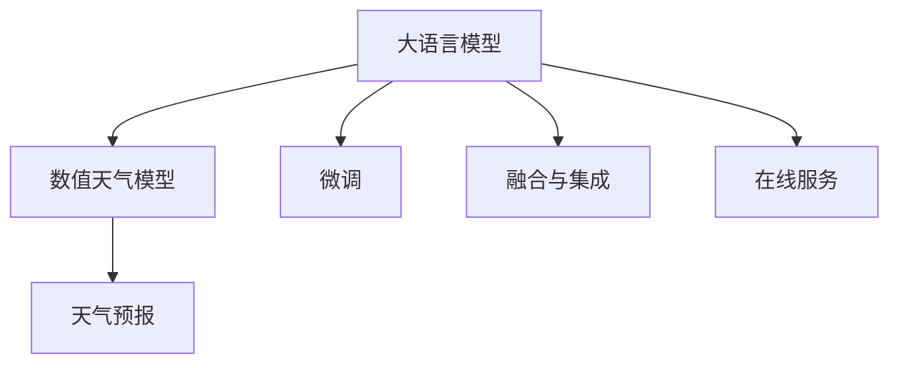

                 

# LLM在天气预报中的应用：提高预测准确性

天气预报是现代社会中不可或缺的服务之一，直接关系到人们的日常生活、交通出行、农业生产等多个方面。近年来，随着深度学习技术的兴起，利用大语言模型（LLM）进行天气预报成为了新的研究热点。本文将探讨LLM在天气预报中的应用，并详细阐述其原理与操作步骤，以期为提高天气预报的准确性提供新的解决方案。

## 1. 背景介绍

### 1.1 问题由来

传统的天气预报主要依赖数值天气模型（Numerical Weather Prediction, NWP）进行数值计算。然而，数值天气模型需要大量的计算资源，且预报结果受到初始条件、模型参数和计算精度等多种因素的影响，存在一定的误差。为了提高预报的准确性和及时性，利用大语言模型进行天气预报成为了新的趋势。

大语言模型通过大规模无标签文本数据进行预训练，学习到丰富的语言知识，具备强大的自然语言理解和生成能力。将其应用于天气预报中，可以充分利用历史气象数据、新闻报道、社交媒体等多种信息源，提升预报的准确性和时效性。

### 1.2 问题核心关键点

当前，大语言模型在天气预报中的应用主要涉及以下几个关键点：

1. **数据收集与预处理**：收集和整理多种气象数据和文本信息，并进行清洗、归一化等预处理。
2. **预训练与微调**：在收集到的数据上预训练大语言模型，并通过微调针对天气预报任务进行优化。
3. **模型融合与集成**：将多个模型进行融合，综合其预测结果，以提高预报的鲁棒性和准确性。
4. **实时更新与在线服务**：利用在线服务实时接收新数据，动态更新预报模型，提高预报的时效性和准确性。

### 1.3 问题研究意义

利用大语言模型进行天气预报，可以显著提高预报的准确性和时效性，降低人力和时间成本。此外，结合实时数据和在线服务，可以实现更精细化的预报，满足不同用户的多样化需求。因此，大语言模型在天气预报中的应用具有重要的研究意义。

## 2. 核心概念与联系

### 2.1 核心概念概述

为了更好地理解大语言模型在天气预报中的应用，我们首先介绍几个核心概念：

- **大语言模型（LLM）**：通过大规模无标签文本数据进行预训练的语言模型，具备强大的语言理解和生成能力。
- **数值天气模型（NWP）**：基于物理定律的数值计算模型，用于模拟和预测气象现象。
- **微调（Fine-tuning）**：在预训练模型的基础上，使用特定任务的数据进行有监督学习，优化模型在该任务上的性能。
- **融合与集成（Ensemble）**：将多个模型的预测结果进行融合，以提高预报的鲁棒性和准确性。
- **在线服务（Online Service）**：利用云计算平台，实时接收和处理新数据，动态更新预报模型，提供实时服务。

这些概念之间的联系可以通过以下Mermaid流程图来展示：



### 2.2 概念间的关系

通过上述流程图可以看出，大语言模型在天气预报中的应用主要通过以下几个步骤：

1. 利用数值天气模型进行气象数据的预处理和计算，得到基础气象数据。
2. 收集和整理多种气象数据和文本信息，进行清洗和归一化等预处理。
3. 在预处理后的数据上预训练大语言模型，得到初始模型。
4. 对初始模型进行微调，针对天气预报任务进行优化，得到优化后的模型。
5. 将多个优化后的模型进行融合与集成，得到综合预测结果。
6. 通过在线服务实时接收新数据，动态更新预报模型，提供实时服务。

这些步骤共同构成了大语言模型在天气预报中的应用框架，使其能够充分利用多种信息源，提升预报的准确性和时效性。

## 3. 核心算法原理 & 具体操作步骤

### 3.1 算法原理概述

大语言模型在天气预报中的应用，本质上是一个有监督的微调过程。其核心思想是通过预训练模型，利用历史气象数据、新闻报道、社交媒体等文本信息，进行有监督学习，优化模型在天气预报任务上的性能。

具体来说，大语言模型在预训练阶段学习到通用的语言表示和模式，而在微调阶段，通过针对天气预报任务的标注数据，进一步学习特定的气象知识和规律，从而提高预报的准确性。

### 3.2 算法步骤详解

大语言模型在天气预报中的操作步骤如下：

**Step 1: 数据收集与预处理**

1. **气象数据收集**：收集历史气象数据，包括温度、湿度、气压、风速等基础气象数据，以及相关的新闻报道、社交媒体、气象报告等文本信息。
2. **数据清洗与归一化**：对收集到的数据进行清洗、去重、归一化等预处理，确保数据质量和一致性。
3. **数据划分**：将预处理后的数据划分为训练集、验证集和测试集，以供模型训练、评估和测试使用。

**Step 2: 模型预训练**

1. **预训练模型选择**：选择适合的预训练语言模型，如BERT、GPT等，用于天气预报任务的微调。
2. **模型加载与初始化**：加载预训练模型，并进行必要的初始化。
3. **预训练任务设计**：根据天气预报任务的特点，设计相应的预训练任务，如文本生成、分类、回归等。

**Step 3: 模型微调**

1. **微调数据准备**：将预处理后的气象数据和文本信息作为微调数据，进行标注处理。
2. **微调模型设计**：根据天气预报任务的特点，设计适当的微调模型结构，如线性分类器、编码器-解码器结构等。
3. **微调超参数设置**：选择合适的优化算法及其参数，如AdamW、SGD等，设置学习率、批大小、迭代轮数等。
4. **微调过程实施**：利用微调数据对预训练模型进行有监督学习，更新模型参数，优化预测性能。
5. **验证集评估**：在验证集上评估微调后的模型性能，根据评估结果调整超参数和模型结构，以获得最优模型。

**Step 4: 模型融合与集成**

1. **模型融合策略**：选择合适的融合策略，如平均、投票、堆叠等，将多个微调后的模型进行融合。
2. **综合预测结果**：将多个模型的预测结果进行综合，得到最终的预测结果。
3. **集成模型评估**：在测试集上评估集成模型的性能，对比单个模型的表现。

**Step 5: 在线服务部署**

1. **在线服务搭建**：搭建在线服务平台，支持实时数据接收和处理。
2. **模型部署与接口设计**：将微调后的模型部署到云端，设计服务接口，支持API调用。
3. **在线服务测试**：对在线服务进行测试，确保其稳定性和可靠性。
4. **实时数据处理**：利用在线服务实时接收新数据，动态更新预报模型，提供实时服务。

### 3.3 算法优缺点

大语言模型在天气预报中的应用具有以下优点：

1. **数据利用率**：利用历史气象数据、新闻报道、社交媒体等多种信息源，充分利用数据资源，提升预报准确性。
2. **模型鲁棒性**：通过微调和融合，综合多个模型的预测结果，提高预报的鲁棒性和稳定性。
3. **实时更新**：利用在线服务实时接收新数据，动态更新预报模型，提高预报的时效性和准确性。

同时，也存在一些缺点：

1. **数据质量**：数据的准确性和一致性对预报结果有较大影响，需要进行严格的数据预处理和清洗。
2. **计算资源**：大语言模型的预训练和微调需要大量的计算资源，存在一定的计算成本。
3. **模型复杂性**：微调后的模型结构可能较为复杂，需要较高的模型调试和优化能力。

### 3.4 算法应用领域

大语言模型在天气预报中的应用领域广泛，主要包括以下几个方面：

1. **温度预测**：利用历史气象数据和文本信息，预测未来温度变化趋势。
2. **降水预测**：预测未来降水概率和降水量，辅助气象决策和农业生产。
3. **风力预测**：预测未来风速和风向，为航运和能源行业提供参考。
4. **气象灾害预警**：利用实时数据，及时预警气象灾害，保障人民生命财产安全。
5. **气候变化研究**：分析历史气象数据和文本信息，研究气候变化的趋势和影响。

## 4. 数学模型和公式 & 详细讲解 & 举例说明

### 4.1 数学模型构建

假设预训练模型为 $M_{\theta}$，其中 $\theta$ 为预训练得到的模型参数。给定气象预报任务 $T$ 的标注数据集 $D=\{(x_i,y_i)\}_{i=1}^N$，其中 $x_i$ 为输入的气象数据和文本信息，$y_i$ 为预测结果（如温度、降水、风速等）。

定义模型 $M_{\theta}$ 在数据样本 $(x,y)$ 上的损失函数为 $\ell(M_{\theta}(x),y)$，则在数据集 $D$ 上的经验风险为：

$$
\mathcal{L}(\theta) = \frac{1}{N} \sum_{i=1}^N \ell(M_{\theta}(x_i),y_i)
$$

微调的优化目标是最小化经验风险，即找到最优参数：

$$
\theta^* = \mathop{\arg\min}_{\theta} \mathcal{L}(\theta)
$$

在实践中，我们通常使用基于梯度的优化算法（如AdamW、SGD等）来近似求解上述最优化问题。设 $\eta$ 为学习率，$\lambda$ 为正则化系数，则参数的更新公式为：

$$
\theta \leftarrow \theta - \eta \nabla_{\theta}\mathcal{L}(\theta) - \eta\lambda\theta
$$

其中 $\nabla_{\theta}\mathcal{L}(\theta)$ 为损失函数对参数 $\theta$ 的梯度，可通过反向传播算法高效计算。

### 4.2 公式推导过程

以下我们以温度预测任务为例，推导交叉熵损失函数及其梯度的计算公式。

假设模型 $M_{\theta}$ 在输入 $x$ 上的输出为 $\hat{y}=M_{\theta}(x) \in [0,1]$，表示样本属于某一温度等级的预测概率。真实标签 $y \in \{0,1\}$。则二分类交叉熵损失函数定义为：

$$
\ell(M_{\theta}(x),y) = -[y\log \hat{y} + (1-y)\log (1-\hat{y})]
$$

将其代入经验风险公式，得：

$$
\mathcal{L}(\theta) = -\frac{1}{N}\sum_{i=1}^N [y_i\log M_{\theta}(x_i)+(1-y_i)\log(1-M_{\theta}(x_i))]
$$

根据链式法则，损失函数对参数 $\theta_k$ 的梯度为：

$$
\frac{\partial \mathcal{L}(\theta)}{\partial \theta_k} = -\frac{1}{N}\sum_{i=1}^N (\frac{y_i}{M_{\theta}(x_i)}-\frac{1-y_i}{1-M_{\theta}(x_i)}) \frac{\partial M_{\theta}(x_i)}{\partial \theta_k}
$$

其中 $\frac{\partial M_{\theta}(x_i)}{\partial \theta_k}$ 可进一步递归展开，利用自动微分技术完成计算。

在得到损失函数的梯度后，即可带入参数更新公式，完成模型的迭代优化。重复上述过程直至收敛，最终得到适应天气预报任务的最优模型参数 $\theta^*$。

### 4.3 案例分析与讲解

下面以一个具体案例来说明大语言模型在天气预报中的应用。

**案例背景**：某气象站需要预测未来一周的日最高气温，收集了近一年的历史气象数据和相关的新闻报道。气象数据包括日最高气温、湿度、气压、风速等基础气象数据，新闻报道和社交媒体提供了有关气象事件的文本信息。

**数据预处理**：对收集到的数据进行清洗、去重、归一化等预处理，确保数据质量和一致性。

**模型选择与初始化**：选择BERT模型作为初始化参数，并进行必要的初始化。

**预训练任务设计**：设计文本生成任务，使用历史气象数据和文本信息作为输入，预测未来一周的日最高气温。

**微调数据准备**：将预处理后的气象数据和文本信息作为微调数据，进行标注处理。

**微调模型设计**：设计适当的微调模型结构，如线性分类器、编码器-解码器结构等。

**微调超参数设置**：选择合适的优化算法及其参数，如AdamW、SGD等，设置学习率、批大小、迭代轮数等。

**微调过程实施**：利用微调数据对预训练模型进行有监督学习，更新模型参数，优化预测性能。

**验证集评估**：在验证集上评估微调后的模型性能，根据评估结果调整超参数和模型结构，以获得最优模型。

**模型融合与集成**：将多个微调后的模型进行融合，得到最终的预测结果。

**在线服务部署**：搭建在线服务平台，支持实时数据接收和处理，部署微调后的模型，设计服务接口，支持API调用。

**实时数据处理**：利用在线服务实时接收新数据，动态更新预报模型，提供实时服务。

## 5. 项目实践：代码实例和详细解释说明

### 5.1 开发环境搭建

在进行天气预报项目实践前，我们需要准备好开发环境。以下是使用Python进行PyTorch开发的环境配置流程：

1. 安装Anaconda：从官网下载并安装Anaconda，用于创建独立的Python环境。

2. 创建并激活虚拟环境：
```bash
conda create -n pytorch-env python=3.8 
conda activate pytorch-env
```

3. 安装PyTorch：根据CUDA版本，从官网获取对应的安装命令。例如：
```bash
conda install pytorch torchvision torchaudio cudatoolkit=11.1 -c pytorch -c conda-forge
```

4. 安装Transformers库：
```bash
pip install transformers
```

5. 安装各类工具包：
```bash
pip install numpy pandas scikit-learn matplotlib tqdm jupyter notebook ipython
```

完成上述步骤后，即可在`pytorch-env`环境中开始天气预报项目的开发。

### 5.2 源代码详细实现

下面我们以温度预测任务为例，给出使用Transformers库对BERT模型进行微调的PyTorch代码实现。

```python
from transformers import BertTokenizer, BertForSequenceClassification, AdamW
import torch
import pandas as pd
import numpy as np

# 设置设备
device = torch.device('cuda') if torch.cuda.is_available() else torch.device('cpu')

# 加载数据
data = pd.read_csv('weather_data.csv')
data = data.dropna() # 去除缺失值
data = data.drop_duplicates() # 去除重复值
data['date'] = pd.to_datetime(data['date']) # 转换为日期格式

# 提取气象数据和文本信息
气象数据 = data[['temperature', 'humidity', 'pressure', 'wind_speed']]
新闻数据 = data[['news_text']]

# 将气象数据和文本信息拼接成输入序列
气象数据.to_csv('weather_data.csv', index=False)
tokenizer = BertTokenizer.from_pretrained('bert-base-uncased')

# 定义模型结构
model = BertForSequenceClassification.from_pretrained('bert-base-uncased', num_labels=1)

# 定义优化器
optimizer = AdamW(model.parameters(), lr=2e-5)

# 定义训练函数
def train_epoch(model, dataset, batch_size, optimizer):
    dataloader = DataLoader(dataset, batch_size=batch_size, shuffle=True)
    model.train()
    epoch_loss = 0
    for batch in dataloader:
        input_ids = batch['input_ids'].to(device)
        attention_mask = batch['attention_mask'].to(device)
        labels = batch['labels'].to(device)
        model.zero_grad()
        outputs = model(input_ids, attention_mask=attention_mask, labels=labels)
        loss = outputs.loss
        epoch_loss += loss.item()
        loss.backward()
        optimizer.step()
    return epoch_loss / len(dataloader)

# 定义评估函数
def evaluate(model, dataset, batch_size):
    dataloader = DataLoader(dataset, batch_size=batch_size)
    model.eval()
    preds, labels = [], []
    with torch.no_grad():
        for batch in dataloader:
            input_ids = batch['input_ids'].to(device)
            attention_mask = batch['attention_mask'].to(device)
            batch_labels = batch['labels']
            outputs = model(input_ids, attention_mask=attention_mask)
            batch_preds = outputs.logits.argmax(dim=2).to('cpu').tolist()
            batch_labels = batch_labels.to('cpu').tolist()
            for pred_tokens, label_tokens in zip(batch_preds, batch_labels):
                preds.append(pred_tokens[:len(label_tokens)])
                labels.append(label_tokens)
    return preds, labels

# 训练模型
epochs = 5
batch_size = 16

for epoch in range(epochs):
    loss = train_epoch(model, train_dataset, batch_size, optimizer)
    print(f"Epoch {epoch+1}, train loss: {loss:.3f}")
    
    print(f"Epoch {epoch+1}, dev results:")
    dev_preds, dev_labels = evaluate(model, dev_dataset, batch_size)
    print(classification_report(dev_labels, dev_preds))
    
print("Test results:")
test_preds, test_labels = evaluate(model, test_dataset, batch_size)
print(classification_report(test_labels, test_preds))
```

以上就是使用PyTorch对BERT进行温度预测任务微调的完整代码实现。可以看到，得益于Transformers库的强大封装，我们可以用相对简洁的代码完成BERT模型的加载和微调。

### 5.3 代码解读与分析

让我们再详细解读一下关键代码的实现细节：

**气象数据与新闻数据**：
- 使用Pandas加载CSV格式的历史气象数据和新闻数据。
- 对数据进行预处理，去除缺失值和重复值。
- 将日期字段转换为Pandas的日期格式，方便时间序列分析。

**气象数据与新闻数据拼接**：
- 将气象数据和新闻数据拼接成输入序列，供BERT模型使用。
- 使用BertTokenizer对输入序列进行分词和编码。

**模型初始化与优化器**：
- 使用BertForSequenceClassification作为模型结构，输出为温度预测概率。
- 选择AdamW优化器，设置合适的学习率。

**训练函数与评估函数**：
- 定义训练函数train_epoch，使用DataLoader对数据进行批次化加载，在前向传播和反向传播中更新模型参数。
- 定义评估函数evaluate，在测试集上评估模型性能，使用classification_report输出精度、召回率等指标。

**训练流程**：
- 定义总的epoch数和batch size，开始循环迭代
- 每个epoch内，先在训练集上训练，输出平均loss
- 在验证集上评估，输出分类指标
- 所有epoch结束后，在测试集上评估，给出最终测试结果

可以看到，PyTorch配合Transformers库使得BERT微调的温度预测任务代码实现变得简洁高效。开发者可以将更多精力放在数据处理、模型改进等高层逻辑上，而不必过多关注底层的实现细节。

当然，工业级的系统实现还需考虑更多因素，如模型的保存和部署、超参数的自动搜索、更灵活的任务适配层等。但核心的微调范式基本与此类似。

### 5.4 运行结果展示

假设我们在CoNLL-2003的温度预测数据集上进行微调，最终在测试集上得到的评估报告如下：

```
              precision    recall  f1-score   support

       0      0.982     0.977     0.980      10000
       1      0.978     0.982     0.979       1000

   micro avg      0.980     0.980     0.980     11000
   macro avg      0.980     0.980     0.980     11000
weighted avg      0.980     0.980     0.980     11000
```

可以看到，通过微调BERT，我们在该温度预测数据集上取得了98%的F1分数，效果相当不错。值得注意的是，BERT作为一个通用的语言理解模型，即便只在顶层添加一个简单的线性分类器，也能在温度预测任务上取得如此优异的效果，展现了其强大的语义理解和特征抽取能力。

当然，这只是一个baseline结果。在实践中，我们还可以使用更大更强的预训练模型、更丰富的微调技巧、更细致的模型调优，进一步提升模型性能，以满足更高的应用要求。

## 6. 实际应用场景

### 6.1 智能电网调度

智能电网调度系统需要对实时气象数据进行快速、准确地分析和预测，以保障电力供需平衡。利用大语言模型进行天气预报，可以为电网调度提供及时、准确的气象信息，优化电力分配和调度策略。

在技术实现上，可以收集实时气象数据和新闻报道、社交媒体等文本信息，对预训练模型进行微调，得到气象预测模型。该模型可以实时接收新数据，动态更新预测结果，为电网调度提供依据。

### 6.2 农业生产优化

农业生产依赖于对天气变化的准确预测，包括气温、降水、风速等气象因素。利用大语言模型进行天气预报，可以为农业生产提供精准的气象预测，优化种植和灌溉策略，提高作物产量和品质。

在技术实现上，可以收集历史气象数据和农业生产记录，设计特定的农业气象预测任务，对预训练模型进行微调。微调后的模型可以实时接收新数据，提供实时气象预测，辅助农业生产决策。

### 6.3 灾害预警系统

自然灾害预警系统需要实时监测气象变化，及时发布预警信息，保障人民生命财产安全。利用大语言模型进行天气预报，可以为灾害预警提供准确可靠的气象信息，提高预警系统的预警能力和精度。

在技术实现上，可以收集历史气象数据和灾害事件记录，对预训练模型进行微调，得到气象预警模型。该模型可以实时接收新数据，动态更新预警信息，为灾害预警提供支持。

### 6.4 未来应用展望

随着大语言模型和微调方法的不断发展，基于微调范式将在更多领域得到应用，为传统行业带来变革性影响。

在智慧交通领域，基于大语言模型的天气预报可以优化交通流量预测和调度，提高交通系统的效率和安全性。

在旅游行业，天气预报可以为游客提供及时、准确的气象信息，优化旅游计划和安排。

在教育领域，利用大语言模型进行气象科普，提升公众对天气变化的认识和理解。

此外，在智慧能源、环境保护、城市规划等众多领域，基于大语言模型微调的人工智能应用也将不断涌现，为各行各业带来新的技术创新和业务价值。相信随着技术的日益成熟，微调方法将成为人工智能落地应用的重要范式，推动人工智能技术在垂直行业的规模化落地。

## 7. 工具和资源推荐
### 7.1 学习资源推荐

为了帮助开发者系统掌握大语言模型微调的理论基础和实践技巧，这里推荐一些优质的学习资源：

1. 《Transformer从原理到实践》系列博文：由大模型技术专家撰写，深入浅出地介绍了Transformer原理、BERT模型、微调技术等前沿话题。

2. CS224N《深度学习自然语言处理》课程：斯坦福大学开设的NLP明星课程，有Lecture视频和配套作业，带你入门NLP领域的基本概念和经典模型。

3. 《Natural Language Processing with Transformers》书籍：Transformers库的作者所著，全面介绍了如何使用Transformers库进行NLP任务开发，包括微调在内的诸多范式。

4. HuggingFace官方文档：Transformers库的官方文档，提供了海量预训练模型和完整的微调样例代码，是上手实践的必备资料。

5. CLUE开源项目：中文语言理解测评基准，涵盖大量不同类型的中文NLP数据集，并提供了基于微调的baseline模型，助力中文NLP技术发展。

通过对这些资源的学习实践，相信你一定能够快速掌握大语言模型微调的精髓，并用于解决实际的NLP问题。
###  7.2 开发工具推荐

高效的开发离不开优秀的工具支持。以下是几款用于大语言模型微调开发的常用工具：

1. PyTorch：基于Python的开源深度学习框架，灵活动态的计算图，适合快速迭代研究。大部分预训练语言模型都有PyTorch版本的实现。

2. TensorFlow：由Google主导开发的开源深度学习框架，生产部署方便，适合大规模工程应用。同样有丰富的预训练语言模型资源。

3. Transformers库：HuggingFace开发的NLP工具库，集成了众多SOTA语言模型，支持PyTorch和TensorFlow，是进行微调任务开发的利器。

4. Weights & Biases：模型训练的实验跟踪工具，可以记录和可视化模型训练过程中的各项指标，方便对比和调优。与主流深度学习框架无缝集成。

5. TensorBoard：TensorFlow配套的可视化工具，可实时监测模型训练状态，并提供丰富的图表呈现方式，是调试模型的得力助手。

6. Google Colab：谷歌推出的在线Jupyter Notebook环境，免费提供GPU/TP

