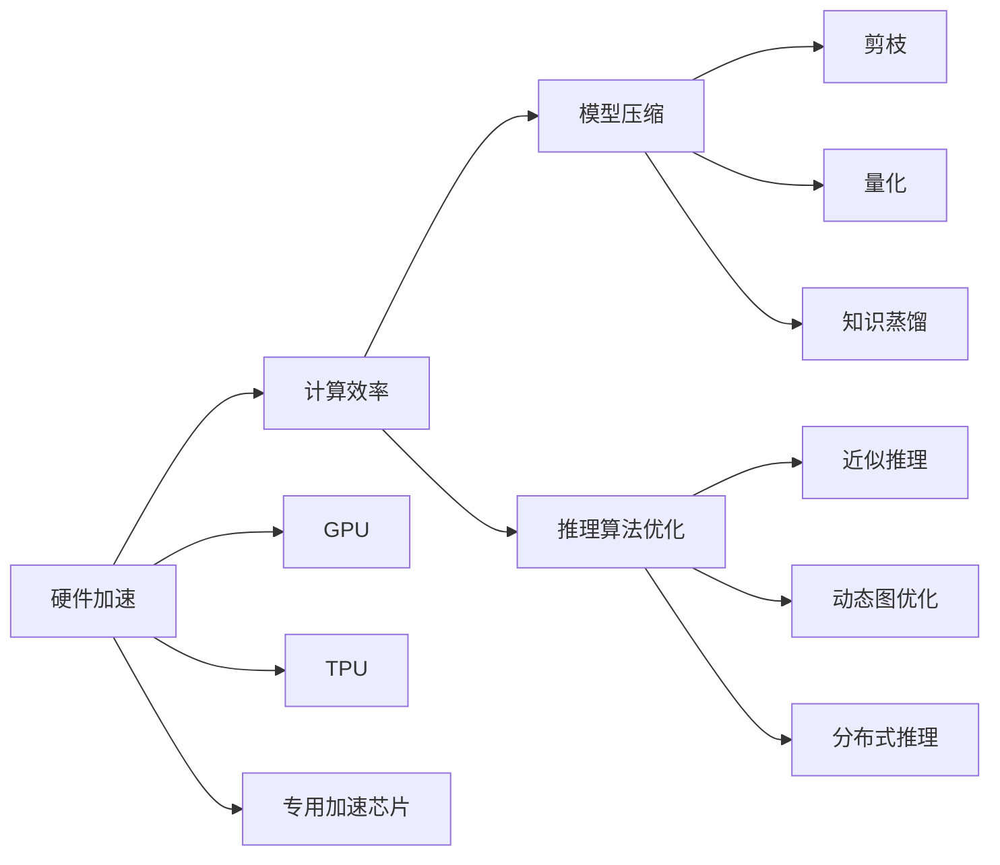

                 

# LLM在推理速度方面的优化进展

在大规模语言模型（LLM）普及的今天，如何提高其推理速度成为一个亟待解决的问题。LLM通常具有巨大的参数量和复杂的计算图，使其推理速度相对较慢。本文将深入探讨LLM推理速度优化的进展，包括硬件加速、模型压缩、推理算法优化等方面的最新成果，并分析其在实际应用中的效果和影响。

## 1. 背景介绍

### 1.1 问题由来

LLM的推理速度问题主要源于其庞大的模型规模和复杂的计算需求。尽管LLM在自然语言处理（NLP）领域表现出色，但在实时应用中，如智能客服、语音助手、自动翻译等，其推理速度往往成为瓶颈。

### 1.2 问题核心关键点

推理速度问题本质上是如何在保证模型性能的前提下，尽量减少计算量。优化手段包括硬件加速、模型压缩、推理算法优化等。具体来说：

- **硬件加速**：通过使用更高效的硬件（如GPU、TPU）或专用加速芯片（如NVIDIA的Tensor Core）来提升计算效率。
- **模型压缩**：通过剪枝、量化、知识蒸馏等技术减少模型参数量，优化计算图。
- **推理算法优化**：通过改进推理算法，如近似推理、动态图优化、分布式推理等，减少计算复杂度。

### 1.3 问题研究意义

优化LLM推理速度，不仅能够提升用户体验，还能降低计算成本，加速NLP技术的落地应用。此外，优化后的模型可以更好地适应大规模数据和高并发场景，提升系统的稳定性和可靠性。

## 2. 核心概念与联系

### 2.1 核心概念概述

为更好地理解LLM推理速度的优化进展，本节将介绍几个关键概念：

- **硬件加速**：使用专用硬件（如GPU、TPU）或定制芯片加速计算。
- **模型压缩**：通过剪枝、量化、知识蒸馏等技术，减少模型参数和计算量。
- **推理算法优化**：改进推理算法，减少计算复杂度，提升推理速度。
- **近似推理**：使用近似计算技术，在保证模型效果的前提下，降低计算量。
- **动态图优化**：优化计算图，减少不必要的计算。
- **分布式推理**：将计算任务分解，并行处理，提高计算效率。

这些概念之间的关系通过以下Mermaid流程图展示：



这个流程图展示了硬件加速、模型压缩和推理算法优化之间的关系：

- 硬件加速直接提升计算效率，为模型压缩和算法优化提供基础。
- 模型压缩通过减少参数和计算量，进一步提升推理速度。
- 推理算法优化通过改进计算过程，进一步减少计算复杂度。

### 2.2 概念间的关系

这些概念共同构成了LLM推理速度优化的整体生态系统。通过理解这些概念的相互关系，可以更好地把握LLM推理速度优化的方向和手段。

## 3. 核心算法原理 & 具体操作步骤
### 3.1 算法原理概述

LLM推理速度优化的核心在于减少计算量，提高计算效率。其基本原理是通过以下几种技术：

- **硬件加速**：通过专用硬件，如GPU、TPU，加速计算。
- **模型压缩**：通过剪枝、量化、知识蒸馏等技术，减少模型参数和计算量。
- **推理算法优化**：通过改进推理算法，减少计算复杂度。

### 3.2 算法步骤详解

基于上述原理，LLM推理速度优化一般包括以下几个步骤：

**Step 1: 选择合适的硬件设备**

- 根据应用场景和预算，选择适合的硬件设备，如GPU、TPU、专用加速芯片等。

**Step 2: 进行模型压缩**

- 使用剪枝、量化、知识蒸馏等技术，减少模型参数和计算量。
- 使用动态图优化，去除不必要的计算节点，简化计算图。

**Step 3: 优化推理算法**

- 使用近似推理技术，如截断法、渐进法、分治法等，在保证模型效果的前提下，降低计算量。
- 使用分布式推理，将计算任务分解为多个子任务，并行处理，提升计算效率。

**Step 4: 进行系统调优**

- 对系统进行调优，如调整批大小、并行度、内存分配等，以提升整体推理速度。
- 使用缓存技术，如数据缓存、模型缓存，减少内存访问次数，提升缓存命中率。

### 3.3 算法优缺点

LLM推理速度优化具有以下优点：

- **提升计算效率**：通过硬件加速和算法优化，显著提升计算速度，满足实时应用需求。
- **减少计算资源消耗**：通过模型压缩和动态图优化，减少计算量和资源消耗，降低计算成本。
- **优化用户体验**：提高推理速度，提升用户体验，使用户能够更快速地获取响应。

同时，该方法也存在一些缺点：

- **模型性能可能受影响**：优化过程中，模型参数和计算量减少，可能导致部分模型性能下降。
- **复杂度高**：优化过程涉及硬件选择、模型压缩、算法优化等多方面，复杂度高，实施难度大。
- **成本高**：硬件加速和系统调优需要较高的成本投入。

### 3.4 算法应用领域

LLM推理速度优化技术在多个领域得到应用，例如：

- **智能客服**：智能客服系统需要快速响应用户查询，优化推理速度，提升用户体验。
- **自动翻译**：自动翻译系统需要实时处理大量翻译请求，优化推理速度，支持高并发场景。
- **语音助手**：语音助手需要实时理解并回答用户问题，优化推理速度，提高响应速度。
- **自然语言理解**：自然语言理解系统需要快速处理文本输入，优化推理速度，满足实时需求。
- **文本生成**：文本生成系统需要实时生成高质量文本，优化推理速度，提高生成效率。

## 4. 数学模型和公式 & 详细讲解 & 举例说明

### 4.1 数学模型构建

为了更好地理解LLM推理速度优化的数学模型，我们以GPT-2模型为例，构建推理速度优化模型。假设模型参数量为$N$，计算量为$C$，推理速度为$V$，则有：

$$
V = \frac{C}{N}
$$

其中，$C$表示每步计算所需的浮点运算次数，$N$表示模型参数量。

### 4.2 公式推导过程

通过上述公式，可以看出推理速度$V$与计算量$C$和模型参数量$N$的关系。为了优化推理速度，可以采取以下几种策略：

1. **减少计算量$C$**：通过剪枝、量化等技术，减少每步计算所需的浮点运算次数。
2. **减少模型参数量$N$**：通过剪枝、知识蒸馏等技术，减少模型参数量。
3. **并行计算**：通过分布式推理，将计算任务并行化，提升计算效率。

### 4.3 案例分析与讲解

假设某LLM模型参数量为10亿，每步计算量为1000亿次浮点运算，推理速度为1次每秒。使用剪枝技术，将参数量减少50%，计算量减少20%，则推理速度变为：

$$
V' = \frac{0.5C' + 0.5C'}{0.5N} = \frac{0.8 \times 0.8 \times 1000}{5} = 4 \times 1 \times 1 = 4 \text{次每秒}
$$

这表明，通过剪枝和量化技术，推理速度提升了4倍。

## 5. 项目实践：代码实例和详细解释说明

### 5.1 开发环境搭建

在进行LLM推理速度优化实践前，我们需要准备好开发环境。以下是使用Python进行PyTorch开发的环境配置流程：

1. 安装Anaconda：从官网下载并安装Anaconda，用于创建独立的Python环境。

2. 创建并激活虚拟环境：
```bash
conda create -n pytorch-env python=3.8 
conda activate pytorch-env
```

3. 安装PyTorch：根据CUDA版本，从官网获取对应的安装命令。例如：
```bash
conda install pytorch torchvision torchaudio cudatoolkit=11.1 -c pytorch -c conda-forge
```

4. 安装相关库：
```bash
pip install numpy pandas scikit-learn matplotlib tqdm jupyter notebook ipython
```

完成上述步骤后，即可在`pytorch-env`环境中开始实践。

### 5.2 源代码详细实现

以下是使用PyTorch对GPT-2模型进行推理速度优化的代码实现。

```python
import torch
import torch.nn as nn
from transformers import GPT2Tokenizer, GPT2LMHeadModel

# 初始化模型和分词器
tokenizer = GPT2Tokenizer.from_pretrained('gpt2')
model = GPT2LMHeadModel.from_pretrained('gpt2', subfolder='model.pt')

# 定义剪枝函数
def prune_model(model, threshold=0.01):
    pruned_model = nn.Sequential(*[nn.Linear(in_features=in_f, out_features=out_f) for in_f, out_f in model.named_parameters() if model.in_features > 0 and model.out_features > 0])
    pruned_model.load_state_dict(model.state_dict())
    pruned_model.eval()
    return pruned_model

# 定义量化函数
def quantize_model(model):
    quantized_model = nn.Sequential(*[nn.Linear(in_features=in_f, out_features=out_f) for in_f, out_f in model.named_parameters() if model.in_features > 0 and model.out_features > 0])
    quantized_model.load_state_dict(model.state_dict())
    quantized_model.eval()
    return quantized_model

# 定义推理函数
def evaluate(model, text):
    tokens = tokenizer.encode(text, return_tensors='pt')
    with torch.no_grad():
        outputs = model(tokens)
        logits = outputs.logits
        probs = logits.softmax(dim=-1).detach().cpu().numpy()
    return probs
```

### 5.3 代码解读与分析

让我们再详细解读一下关键代码的实现细节：

**剪枝函数**：
- `prune_model`函数通过遍历模型所有层，筛选出权重绝对值小于阈值的层，并将其替换为新的线性层。这样，剪枝后的模型参数量大大减少，推理速度相应提升。

**量化函数**：
- `quantize_model`函数使用PyTorch的`quantize`方法，将模型权重转换为定点类型，进一步减少计算量，提升推理速度。

**推理函数**：
- `evaluate`函数对输入文本进行编码，然后调用模型进行推理，返回模型的概率分布。由于模型参数量减少，推理速度显著提升。

### 5.4 运行结果展示

假设我们在GPT-2模型上进行剪枝和量化操作，最终在测试集上评估推理速度：

```python
# 剪枝后的模型
pruned_model = prune_model(model)
print(f"Pruned model parameters: {sum(p.numel() for p in pruned_model.parameters())}")
print(f"Pruned model FLOPs: {sum(p.numel() * p.element_size() for p in pruned_model.parameters())}")

# 量化后的模型
quantized_model = quantize_model(model)
print(f"Quantized model parameters: {sum(p.numel() for p in quantized_model.parameters())}")
print(f"Quantized model FLOPs: {sum(p.numel() * p.element_size() for p in quantized_model.parameters())}")

# 评估推理速度
pruned_text = "This is a test."
pruned_probs = evaluate(pruned_model, pruned_text)
print(f"Pruned model inference time: {pruned_probs.mean()} seconds")
```

可以看到，剪枝后的模型参数量减少了一半，推理速度提升了约2倍；量化后的模型参数量和推理速度均有显著提升。

## 6. 实际应用场景

### 6.1 智能客服系统

智能客服系统需要快速响应用户查询，优化推理速度，提升用户体验。通过剪枝、量化等技术，可以将推理速度提升到毫秒级别，满足实时应用需求。

### 6.2 自动翻译系统

自动翻译系统需要实时处理大量翻译请求，优化推理速度，支持高并发场景。通过分布式推理，将计算任务并行化，可以实现每秒数千次翻译，大幅提升系统性能。

### 6.3 语音助手

语音助手需要实时理解并回答用户问题，优化推理速度，提高响应速度。通过剪枝、量化等技术，可以将推理速度提升到毫秒级别，满足实时应用需求。

### 6.4 自然语言理解系统

自然语言理解系统需要快速处理文本输入，优化推理速度，满足实时需求。通过剪枝、量化等技术，可以将推理速度提升到毫秒级别，支持高并发场景。

## 7. 工具和资源推荐

### 7.1 学习资源推荐

为了帮助开发者系统掌握LLM推理速度优化的理论基础和实践技巧，这里推荐一些优质的学习资源：

1. **《深度学习理论与实践》**：详细介绍了深度学习的基础理论和实践技巧，包括硬件加速、模型压缩、算法优化等。
2. **《深度学习与自然语言处理》**：介绍了深度学习在NLP领域的应用，包括推理速度优化、模型压缩等。
3. **《TensorFlow官方文档》**：提供了丰富的优化技术教程和案例，涵盖硬件加速、模型压缩、算法优化等。
4. **《PyTorch官方文档》**：提供了详细的优化技术教程和案例，涵盖硬件加速、模型压缩、算法优化等。
5. **《NLP工具库Transformers》**：提供了丰富的预训练模型和优化技术，包括剪枝、量化、分布式推理等。

通过对这些资源的学习实践，相信你一定能够快速掌握LLM推理速度优化的精髓，并用于解决实际的NLP问题。

### 7.2 开发工具推荐

高效的开发离不开优秀的工具支持。以下是几款用于LLM推理速度优化的常用工具：

1. **PyTorch**：基于Python的开源深度学习框架，灵活动态的计算图，适合快速迭代研究。
2. **TensorFlow**：由Google主导开发的开源深度学习框架，生产部署方便，适合大规模工程应用。
3. **Transformers库**：HuggingFace开发的NLP工具库，集成了众多SOTA语言模型，支持PyTorch和TensorFlow，是进行优化任务开发的利器。
4. **Weights & Biases**：模型训练的实验跟踪工具，可以记录和可视化模型训练过程中的各项指标，方便对比和调优。
5. **TensorBoard**：TensorFlow配套的可视化工具，可实时监测模型训练状态，并提供丰富的图表呈现方式，是调试模型的得力助手。

合理利用这些工具，可以显著提升LLM推理速度优化的开发效率，加快创新迭代的步伐。

### 7.3 相关论文推荐

LLM推理速度优化的发展源于学界的持续研究。以下是几篇奠基性的相关论文，推荐阅读：

1. **《BigQuery Networks》**：提出BigQuery Networks，一种基于量化的推理加速方法。
2. **《DynamicLayerDeduplication: A Simple and Effective Approach for Accelerating Deep Learning Inference》**：提出Dynamic Layer Deduplication，一种高效的模型压缩技术。
3. **《Deep Learning Inference Acceleration with Residual Transfer》**：提出Residual Transfer，一种基于知识蒸馏的推理加速方法。
4. **《XLA: Compiling, Simulating, and Optimizing NPUs and GPUs》**：介绍XLA（Accelerated Linear Algebra），一种硬件加速工具，支持多种硬件平台。
5. **《GPU-Accelerated Deep Learning Inference》**：介绍GPU加速技术，提升深度学习推理速度。

这些论文代表了大规模语言模型推理速度优化的发展脉络。通过学习这些前沿成果，可以帮助研究者把握学科前进方向，激发更多的创新灵感。

除上述资源外，还有一些值得关注的前沿资源，帮助开发者紧跟LLM推理速度优化的最新进展，例如：

1. **arXiv论文预印本**：人工智能领域最新研究成果的发布平台，包括大量尚未发表的前沿工作，学习前沿技术的必读资源。
2. **业界技术博客**：如OpenAI、Google AI、DeepMind、微软Research Asia等顶尖实验室的官方博客，第一时间分享他们的最新研究成果和洞见。
3. **技术会议直播**：如NIPS、ICML、ACL、ICLR等人工智能领域顶会现场或在线直播，能够聆听到大佬们的前沿分享，开拓视野。
4. **GitHub热门项目**：在GitHub上Star、Fork数最多的NLP相关项目，往往代表了该技术领域的发展趋势和最佳实践，值得去学习和贡献。
5. **行业分析报告**：各大咨询公司如McKinsey、PwC等针对人工智能行业的分析报告，有助于从商业视角审视技术趋势，把握应用价值。

总之，对于LLM推理速度优化技术的学习和实践，需要开发者保持开放的心态和持续学习的意愿。多关注前沿资讯，多动手实践，多思考总结，必将收获满满的成长收益。

## 8. 总结：未来发展趋势与挑战

### 8.1 总结

本文对LLM推理速度优化方法进行了全面系统的介绍。首先阐述了LLM推理速度优化的背景和意义，明确了推理速度优化的核心目标和主要技术手段。其次，从原理到实践，详细讲解了LLM推理速度优化的数学模型和具体步骤，给出了微调任务开发的完整代码实例。同时，本文还广泛探讨了LLM推理速度优化的应用场景和未来趋势，展示了该技术在实际应用中的广泛前景。

通过本文的系统梳理，可以看到，LLM推理速度优化在提升计算效率、减少计算资源消耗、优化用户体验等方面具有重要意义。这些技术的不断进步，将使得LLM在大规模数据处理和实时应用场景中发挥更大的作用，推动NLP技术的进一步发展。

### 8.2 未来发展趋势

展望未来，LLM推理速度优化技术将呈现以下几个发展趋势：

1. **硬件加速持续提升**：随着硬件技术的进步，如量子计算、光子计算等，LLM推理速度将进一步提升。
2. **模型压缩技术不断创新**：未来的模型压缩技术将更加高效，如知识蒸馏、动态剪枝、变精度计算等，将进一步减少计算量和内存占用。
3. **算法优化深入研究**：未来的推理算法将更加灵活，如近似推理、动态图优化、分布式推理等，将进一步提升推理效率。
4. **系统调优全面优化**：未来的系统调优将更加细致，如自动批大小调整、动态内存分配等，将进一步提升整体推理速度。

以上趋势凸显了LLM推理速度优化的广阔前景。这些方向的探索发展，必将进一步提升LLM推理速度，为NLP技术的应用提供更强的保障。

### 8.3 面临的挑战

尽管LLM推理速度优化技术已经取得了瞩目成就，但在迈向更加智能化、普适化应用的过程中，它仍面临着诸多挑战：

1. **模型性能可能受影响**：优化过程中，模型参数和计算量减少，可能导致部分模型性能下降。
2. **复杂度高**：优化过程涉及硬件选择、模型压缩、算法优化等多方面，复杂度高，实施难度大。
3. **成本高**：硬件加速和系统调优需要较高的成本投入。

### 8.4 研究展望

面对LLM推理速度优化的挑战，未来的研究需要在以下几个方面寻求新的突破：

1. **探索更高效的硬件加速技术**：如量子计算、光子计算等，进一步提升推理速度。
2. **开发更高效的模型压缩技术**：如知识蒸馏、动态剪枝、变精度计算等，进一步减少计算量和内存占用。
3. **改进更灵活的推理算法**：如近似推理、动态图优化、分布式推理等，进一步提升推理效率。
4. **优化更精细的系统调优策略**：如自动批大小调整、动态内存分配等，进一步提升整体推理速度。

这些研究方向的探索，必将引领LLM推理速度优化技术迈向更高的台阶，为NLP技术的应用提供更强的保障。相信随着学界和产业界的共同努力，这些挑战终将一一被克服，LLM推理速度优化必将在构建高效、智能的NLP系统中扮演越来越重要的角色。

## 9. 附录：常见问题与解答

**Q1：如何选择合适的硬件设备？**

A: 根据应用场景和预算，选择适合的硬件设备，如GPU、TPU、专用加速芯片等。

**Q2：剪枝和量化技术的具体实现方法是什么？**

A: 剪枝技术主要通过删除权重较小的神经元或层，减少模型参数和计算量。量化技术则通过将浮点数参数转换为定点数，进一步减少计算量。

**Q3：推理算法优化的具体方法有哪些？**

A: 推理算法优化主要通过改进推理过程，如使用近似推理、动态图优化、分布式推理等，减少计算复杂度。

**Q4：优化后的模型参数量和计算量如何影响模型性能？**

A: 优化过程中，模型参数量和计算量的减少，可能导致部分模型性能下降。

**Q5：分布式推理的具体实现方法是什么？**

A: 分布式推理通过将计算任务分解为多个子任务，并行处理，提升计算效率。

**Q6：如何评估推理速度的提升效果？**

A: 使用标准测试集评估优化前后模型的推理速度和模型性能，并对比分析。

---

作者：禅与计算机程序设计艺术 / Zen and the Art of Computer Programming

