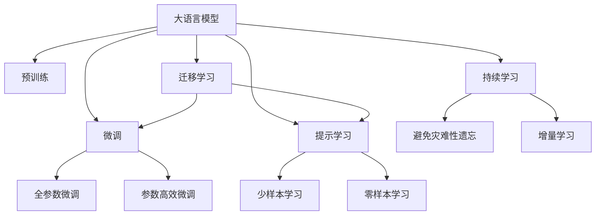
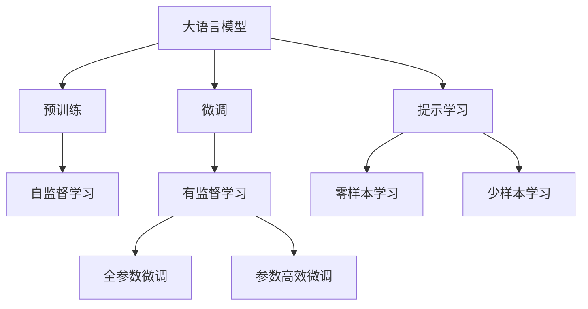
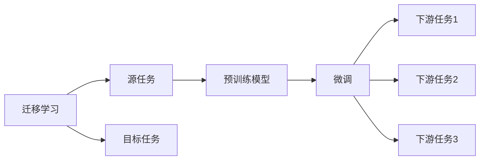
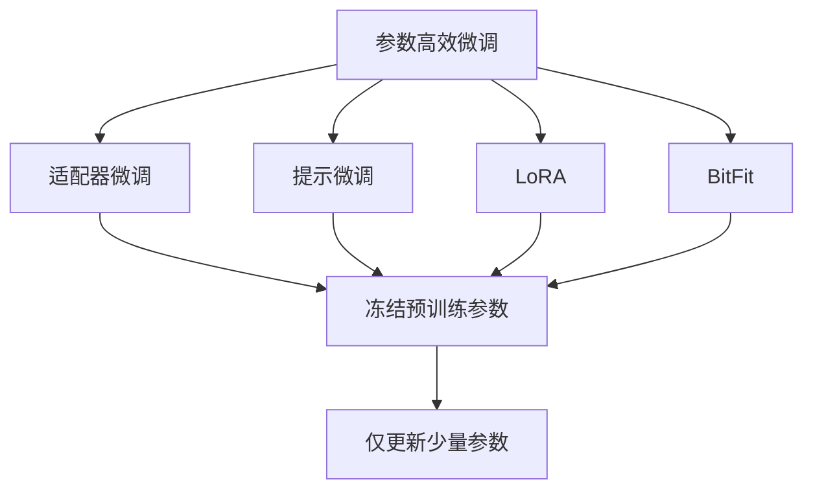
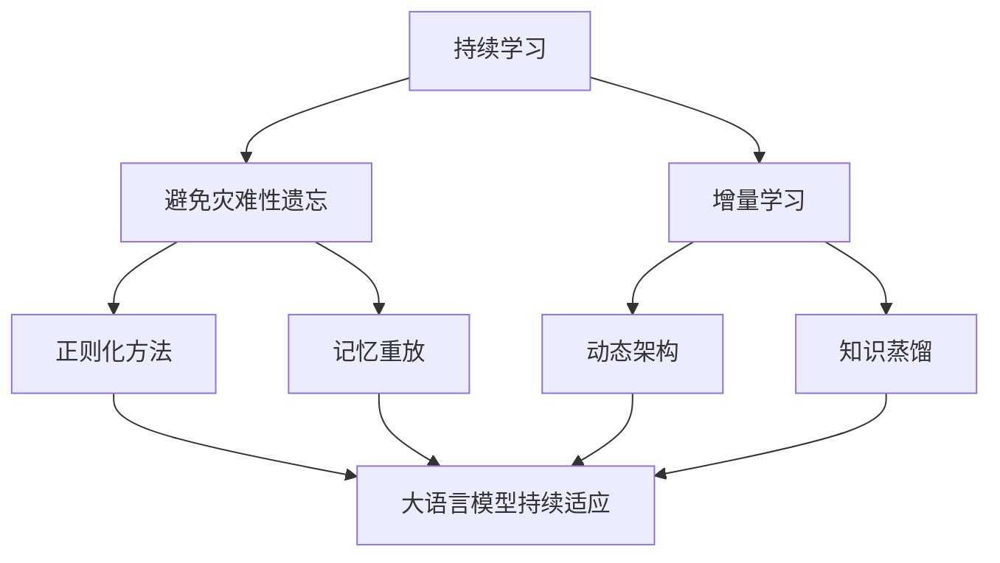
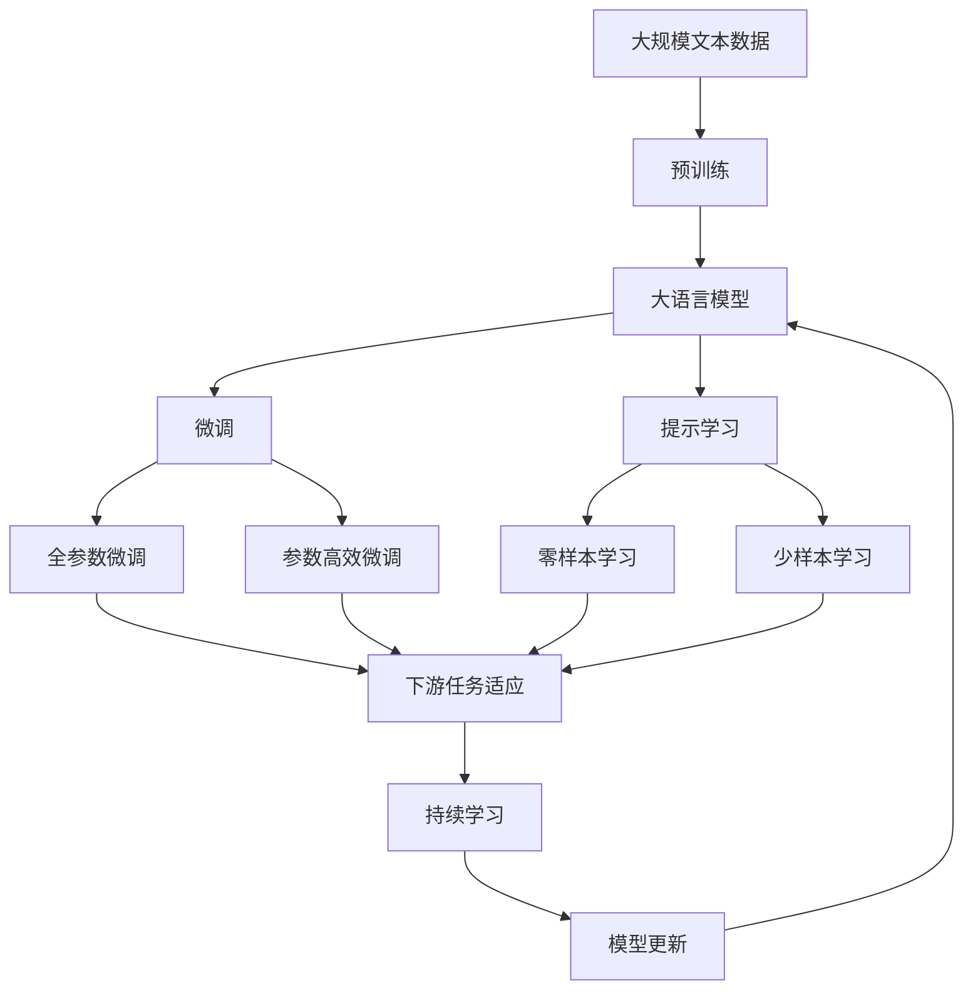

                 

# LLM的无限可能：超越传统指令集的束缚

> 关键词：大语言模型(LLM), 自然语言处理(NLP), 指令微调, 提示学习, 交互式编程, 零样本学习, 多模态学习, 可解释性

## 1. 背景介绍

### 1.1 问题由来

近年来，自然语言处理（NLP）领域经历了翻天覆地的变化，尤其是大语言模型（Large Language Models, LLMs）的崛起。如GPT-3、BERT等模型已经在各种NLP任务上展现出了非凡的实力，带来了NLP技术的重大突破。这些模型的共同特征是能够在预训练阶段学习到大量的语言知识，然后在下游任务上进行微调，从而在特定任务上表现出色。

然而，传统的基于指令集的方式来指导模型完成任务，常常面临许多限制和问题。传统的指令集依赖于明确且固定的模板或关键词，难以适应复杂的自然语言和多样化的任务场景。大语言模型通过大量的文本数据预训练，可以学习到语言的广泛知识，具备更强的泛化能力和语言理解能力。因此，利用大语言模型进行任务微调，可以超越传统指令集的束缚，实现更加灵活和高效的NLP应用。

### 1.2 问题核心关键点

大语言模型进行微调的核心目标是通过对预训练模型的优化，使其在特定任务上表现优异。其关键点包括：

- **微调范式**：基于监督学习，利用下游任务的少量标注数据对预训练模型进行优化。
- **提示学习**：通过精心设计的输入模板，引导模型进行特定任务推理。
- **参数高效微调**：只调整少量参数，以避免过拟合并提高效率。
- **零样本学习和少样本学习**：利用大模型的语言理解能力，在不需要标注数据的情况下进行任务推理。

这些技术手段使得大语言模型在任务微调方面具有极高的灵活性和应用潜力。

### 1.3 问题研究意义

研究大语言模型的微调方法，对于拓展其应用范围，提升任务性能，加速NLP技术的产业化进程具有重要意义：

1. **降低应用开发成本**：基于成熟的大模型进行微调，可以显著减少从头开发所需的数据、计算和人力等成本投入。
2. **提升模型效果**：微调使得通用大模型更好地适应特定任务，在应用场景中取得更优表现。
3. **加速开发进度**：“站在巨人的肩膀上”，微调使得开发者可以更快地完成任务适配，缩短开发周期。
4. **技术创新**：微调范式促进了对预训练-微调的深入研究，催生了提示学习、少样本学习等新的研究方向。
5. **赋能产业升级**：微调使得NLP技术更容易被各行各业所采用，为传统行业数字化转型升级提供新的技术路径。

## 2. 核心概念与联系

### 2.1 核心概念概述

为更好地理解大语言模型在微调过程中的工作机制，本节将介绍几个密切相关的核心概念：

- **大语言模型(Large Language Model, LLM)**：以自回归(如GPT)或自编码(如BERT)模型为代表的大规模预训练语言模型。通过在大规模无标签文本语料上进行预训练，学习通用的语言表示，具备强大的语言理解和生成能力。

- **预训练(Pre-training)**：指在大规模无标签文本语料上，通过自监督学习任务训练通用语言模型的过程。常见的预训练任务包括言语建模、遮挡语言模型等。预训练使得模型学习到语言的通用表示。

- **微调(Fine-tuning)**：指在预训练模型的基础上，使用下游任务的少量标注数据，通过有监督地训练来优化模型在该任务上的性能。通常只需要调整顶层分类器或解码器，并以较小的学习率更新全部或部分的模型参数。

- **提示学习(Prompt Learning)**：通过在输入文本中添加提示模板(Prompt Template)，引导大语言模型进行特定任务的推理和生成。可以在不更新模型参数的情况下，实现零样本或少样本学习。

- **少样本学习(Few-shot Learning)**：指在只有少量标注样本的情况下，模型能够快速适应新任务的学习方法。在大语言模型中，通常通过在输入中提供少量示例来实现，无需更新模型参数。

- **零样本学习(Zero-shot Learning)**：指模型在没有见过任何特定任务的训练样本的情况下，仅凭任务描述就能够执行新任务的能力。大语言模型通过预训练获得的广泛知识，使其能够理解任务指令并生成相应输出。

- **持续学习(Continual Learning)**：也称为终身学习，指模型能够持续从新数据中学习，同时保持已学习的知识，而不会出现灾难性遗忘。这对于保持大语言模型的时效性和适应性至关重要。

这些核心概念之间的逻辑关系可以通过以下Mermaid流程图来展示：



这个流程图展示了大语言模型的核心概念及其之间的关系：

1. 大语言模型通过预训练获得基础能力。
2. 微调是对预训练模型进行任务特定的优化，可以分为全参数微调和参数高效微调。
3. 提示学习是一种不更新模型参数的方法，可以实现少样本学习和零样本学习。
4. 迁移学习是连接预训练模型与下游任务的桥梁，可以通过微调或提示学习来实现。
5. 持续学习旨在使模型能够不断学习新知识，同时避免遗忘旧知识。

这些核心概念共同构成了大语言模型的学习和应用框架，使其能够在各种场景下发挥强大的语言理解和生成能力。通过理解这些核心概念，我们可以更好地把握大语言模型的工作原理和优化方向。

### 2.2 概念间的关系

这些核心概念之间存在着紧密的联系，形成了大语言模型的完整生态系统。下面我通过几个Mermaid流程图来展示这些概念之间的关系。

#### 2.2.1 大语言模型的学习范式



这个流程图展示了大语言模型的三种主要学习范式：预训练、微调和提示学习。预训练主要采用自监督学习方法，而微调则是有监督学习的过程。提示学习可以实现零样本和少样本学习。微调又可以分为全参数微调和参数高效微调两种方式。

#### 2.2.2 迁移学习与微调的关系



这个流程图展示了迁移学习的基本原理，以及它与微调的关系。迁移学习涉及源任务和目标任务，预训练模型在源任务上学习，然后通过微调适应各种下游任务（目标任务）。

#### 2.2.3 参数高效微调方法



这个流程图展示了几种常见的参数高效微调方法，包括适配器微调、提示微调、LoRA和BitFit。这些方法的共同特点是冻结大部分预训练参数，只更新少量参数，从而提高微调效率。

#### 2.2.4 持续学习在大语言模型中的应用



这个流程图展示了持续学习在大语言模型中的应用。持续学习的主要目标是避免灾难性遗忘和实现增量学习。通过正则化方法、记忆重放、动态架构和知识蒸馏等技术，可以使大语言模型持续适应新的任务和数据。

### 2.3 核心概念的整体架构

最后，我们用一个综合的流程图来展示这些核心概念在大语言模型微调过程中的整体架构：



这个综合流程图展示了从预训练到微调，再到持续学习的完整过程。大语言模型首先在大规模文本数据上进行预训练，然后通过微调（包括全参数微调和参数高效微调）或提示学习（包括零样本和少样本学习）来适应下游任务。最后，通过持续学习技术，模型可以不断更新和适应新的任务和数据。 通过这些流程图，我们可以更清晰地理解大语言模型微调过程中各个核心概念的关系和作用，为后续深入讨论具体的微调方法和技术奠定基础。

## 3. 核心算法原理 & 具体操作步骤
### 3.1 算法原理概述

基于指令的微调方法主要依赖于特定的指令模板，通过在输入中插入特定的关键词或短语，来指导大语言模型完成任务。然而，这种基于固定模板的方法往往缺乏灵活性和可扩展性。而基于提示学习的方法则通过对输入文本进行微调，使得模型能够根据输入内容动态生成输出，从而超越了传统指令集的束缚。

形式化地，假设预训练模型为 $M_{\theta}$，其中 $\theta$ 为预训练得到的模型参数。给定下游任务 $T$ 的指令 $I$ 和提示 $P$，微调的目标是找到新的模型参数 $\hat{\theta}$，使得：

$$
\hat{\theta}=\mathop{\arg\min}_{\theta} \mathcal{L}(M_{\theta},I,P)
$$

其中 $\mathcal{L}$ 为针对任务 $T$ 设计的损失函数，用于衡量模型根据指令 $I$ 和提示 $P$ 生成的输出与任务标签之间的差异。常见的损失函数包括交叉熵损失、均方误差损失等。

通过梯度下降等优化算法，微调过程不断更新模型参数 $\theta$，最小化损失函数 $\mathcal{L}$，使得模型输出逼近真实标签。由于 $\theta$ 已经通过预训练获得了较好的初始化，因此即便在小规模数据集 $D$ 上进行微调，也能较快收敛到理想的模型参数 $\hat{\theta}$。

### 3.2 算法步骤详解

基于提示的微调方法通常包括以下几个关键步骤：

**Step 1: 准备预训练模型和指令**

- 选择合适的预训练语言模型 $M_{\theta}$ 作为初始化参数，如 BERT、GPT 等。
- 设计合适的指令 $I$，使得指令能够覆盖下游任务的主要逻辑流程。

**Step 2: 添加任务适配层**

- 根据任务类型，在预训练模型顶层设计合适的输出层和损失函数。
- 对于分类任务，通常在顶层添加线性分类器和交叉熵损失函数。
- 对于生成任务，通常使用语言模型的解码器输出概率分布，并以负对数似然为损失函数。

**Step 3: 设置微调超参数**

- 选择合适的优化算法及其参数，如 AdamW、SGD 等，设置学习率、批大小、迭代轮数等。
- 设置正则化技术及强度，包括权重衰减、Dropout、Early Stopping 等。
- 确定冻结预训练参数的策略，如仅微调顶层，或全部参数都参与微调。

**Step 4: 执行梯度训练**

- 将指令数据分批次输入模型，前向传播计算损失函数。
- 反向传播计算参数梯度，根据设定的优化算法和学习率更新模型参数。
- 周期性在验证集上评估模型性能，根据性能指标决定是否触发 Early Stopping。
- 重复上述步骤直到满足预设的迭代轮数或 Early Stopping 条件。

**Step 5: 测试和部署**

- 在测试集上评估微调后模型 $M_{\hat{\theta}}$ 的性能，对比微调前后的精度提升。
- 使用微调后的模型对新指令进行推理预测，集成到实际的应用系统中。
- 持续收集新的指令，定期重新微调模型，以适应指令分布的变化。

以上是基于提示的微调方法的一般流程。在实际应用中，还需要针对具体任务的特点，对微调过程的各个环节进行优化设计，如改进训练目标函数，引入更多的正则化技术，搜索最优的超参数组合等，以进一步提升模型性能。

### 3.3 算法优缺点

基于提示的微调方法具有以下优点：

1. **灵活性**：可以根据任务需求灵活设计指令模板，适应不同任务场景。
2. **可扩展性**：通过添加新指令，模型可以持续适应新的任务，实现持续学习和知识更新。
3. **可解释性**：提示学习方法可以在不更新模型参数的情况下，实现零样本或少样本学习，更容易解释模型的推理过程。
4. **低成本**：由于不需要标注数据，提示学习方法可以在更少的样本上取得较好的效果，降低了标注成本。

同时，该方法也存在一定的局限性：

1. **依赖提示质量**：提示模板的质量直接影响了模型的推理结果，设计好的提示模板至关重要。
2. **过拟合风险**：提示模板可能包含特定任务的信息，过度依赖提示模板可能导致模型在特定任务上表现过好，泛化能力下降。
3. **迭代成本高**：提示学习方法通常需要迭代多次，调整提示模板，才能找到最佳效果。

尽管存在这些局限性，但就目前而言，基于提示的微调方法仍是大语言模型应用的最主流范式。未来相关研究的重点在于如何进一步提高提示模板的质量和可扩展性，降低迭代成本，提高模型的泛化能力和可解释性。

### 3.4 算法应用领域

基于提示的微调方法在NLP领域已经得到了广泛的应用，覆盖了几乎所有常见任务，例如：

- 文本分类：如情感分析、主题分类、意图识别等。通过设计特定的指令模板，指导模型学习文本-标签映射。
- 命名实体识别：识别文本中的人名、地名、机构名等特定实体。通过设计指令模板，指导模型学习实体边界和类型。
- 关系抽取：从文本中抽取实体之间的语义关系。通过设计指令模板，指导模型学习实体-关系三元组。
- 问答系统：对自然语言问题给出答案。将问题-答案对作为指令模板，训练模型学习匹配答案。
- 机器翻译：将源语言文本翻译成目标语言。通过设计翻译指令模板，训练模型学习语言-语言映射。
- 文本摘要：将长文本压缩成简短摘要。通过设计摘要指令模板，训练模型学习抓取要点。
- 对话系统：使机器能够与人自然对话。通过设计对话指令模板，训练模型进行回复生成。

除了上述这些经典任务外，提示微调也被创新性地应用到更多场景中，如可控文本生成、常识推理、代码生成、数据增强等，为NLP技术带来了全新的突破。随着预训练模型和微调方法的不断进步，相信NLP技术将在更广阔的应用领域大放异彩。

## 4. 数学模型和公式 & 详细讲解 & 举例说明

### 4.1 数学模型构建

本节将使用数学语言对基于提示的微调过程进行更加严格的刻画。

记预训练语言模型为 $M_{\theta}$，其中 $\theta$ 为预训练得到的模型参数。假设微调任务的指令为 $I$，提示为 $P$，则微调的目标是找到新的模型参数 $\hat{\theta}$，使得：

$$
\hat{\theta}=\mathop{\arg\min}_{\theta} \mathcal{L}(M_{\theta},I,P)
$$

其中 $\mathcal{L}$ 为针对任务 $T$ 设计的损失函数，用于衡量模型根据指令 $I$ 和提示 $P$ 生成的输出与任务标签之间的差异。常见的损失函数包括交叉熵损失、均方误差损失等。

定义模型 $M_{\theta}$ 在输入 $(x,y)$ 上的损失函数为 $\ell(M_{\theta}(x),y)$，则在数据集 $D$ 上的经验风险为：

$$
\mathcal{L}(\theta) = \frac{1}{N} \sum_{i=1}^N \ell(M_{\theta}(x_i),y_i)
$$

在实践中，我们通常使用基于梯度的优化算法（如SGD、Adam等）来近似求解上述最优化问题。设 $\eta$ 为学习率，$\lambda$ 为正则化系数，则参数的更新公式为：

$$
\theta \leftarrow \theta - \eta \nabla_{\theta}\mathcal{L}(\theta) - \eta\lambda\theta
$$

其中 $\nabla_{\theta}\mathcal{L}(\theta)$ 为损失函数对参数 $\theta$ 的梯度，可通过反向传播算法高效计算。

### 4.2 公式推导过程

以下我们以二分类任务为例，推导交叉熵损失函数及其梯度的计算公式。

假设模型 $M_{\theta}$ 在输入 $x$ 上的输出为 $\hat{y}=M_{\theta}(x) \in [0,1]$，表示样本属于正类的概率。真实标签 $y \in \{0,1\}$。则二分类交叉熵损失函数定义为：

$$
\ell(M_{\theta}(x),y) = -[y\log \hat{y} + (1-y)\log (1-\hat{y})]
$$

将其代入经验风险公式，得：

$$
\mathcal{L}(\theta) = -\frac{1}{N}\sum_{i=1}^N [y_i\log M_{\theta}(x_i)+(1-y_i)\log(1-M_{\theta}(x_i))]
$$

根据链式法则，损失函数对参数 $\theta_k$ 的梯度为：

$$
\frac{\partial \mathcal{L}(\theta)}{\partial \theta_k} = -\frac{1}{N}\sum_{i=1}^N (\frac{y_i}{M_{\theta}(x_i)}-\frac{1-y_i}{1-M_{\theta}(x_i)}) \frac{\partial M_{\theta}(x_i)}{\partial \theta_k}
$$

其中 $\frac{\partial M_{\theta}(x_i)}{\partial \theta_k}$ 可进一步递归展开，利用自动微分技术完成计算。

在得到损失函数的梯度后，即可带入参数更新公式，完成模型的迭代优化。重复上述过程直至收敛，最终得到适应下游任务的最优模型参数 $\theta^*$。

### 4.3 案例分析与讲解

假设我们希望构建一个简单的情感分析模型，用于识别评论的情感极性（正面或负面）。首先，我们可以设计如下的指令模板：

```
给定一个评论，判断该评论的情感极性是正面还是负面。

输入：{评论文本}
输出：正面/负面
```

然后，我们将评论文本作为模型的输入，模型的输出为二元分类结果。在训练时，我们随机从数据集中抽取一部分评论和对应的情感标签，将它们作为模型训练的数据集。

在训练过程中，我们首先定义训练数据集 $D=\{(x_i,y_i)\}_{i=1}^N$，其中 $x_i$ 为评论文本，$y_i$ 为情感标签。然后，我们定义模型 $M_{\theta}$ 在输入 $x$ 上的输出为 $\hat{y}=M_{\theta}(x) \in [0,1]$，表示评论属于正类的概率。

定义模型 $M_{\theta}$ 在输入 $x$ 上的损失函数为 $\ell(M_{\theta}(x),y)$，在数据集 $D$ 上的经验风险为：

$$
\mathcal{L}(\theta) = \frac{1}{N} \sum_{i=1}^N \ell(M_{\theta}(x_i),y_i)
$$

在实践中，我们通常使用基于梯度的优化算法（如SGD、Adam等）来近似求解上述最优化问题。设 $\eta$ 为学习率，$\lambda$ 为正则化系数，则参数的更新公式为：

$$
\theta \leftarrow \theta - \eta \nabla_{\theta}\mathcal{L}(\theta) - \eta\lambda\theta
$$

其中 $\nabla_{\theta}\mathcal{L}(\theta)$ 为损失函数对参数 $\theta$ 的梯度，可通过反向传播算法高效计算。

在训练过程中，我们首先将训练集数据分批次输入模型，前向传播计算损失函数。然后，反向传播计算参数梯度，根据设定的优化算法和学习率更新模型参数。周期性在验证集上评估模型性能，根据性能指标决定是否触发 Early Stopping。重复上述步骤直到满足预设的迭代轮数或 Early Stopping 条件。

## 5. 项目实践：代码实例和详细解释说明

### 5.1 开发环境搭建

在进行提示微调实践前，我们需要准备好开发环境。以下是使用Python进行PyTorch开发的环境配置流程：

1. 安装Anaconda：从官网下载并安装Anaconda，用于创建独立的Python环境。

2. 创建并激活虚拟环境：
```bash
conda create -n pytorch-env python=3.8 
conda activate pytorch-env
```

3. 安装PyTorch：根据CUDA版本，从官网获取对应的安装命令。例如：
```bash
conda install pytorch torchvision torchaudio cudatoolkit=11.1 -c pytorch -c conda-forge
```

4. 安装Transformers库：
```bash
pip install transformers
```

5. 安装各类工具包：
```bash
pip install numpy pandas scikit-learn matplotlib tqdm jupyter notebook ipython
```

完成上述步骤后，即可在`pytorch-env`环境中开始微调实践。

### 5.2 源代码详细实现

这里我们以情感分析任务为例，给出使用Transformers库对BERT模型进行提示微调的PyTorch代码实现。

首先，定义情感分析任务的数据处理函数：

```python
from transformers import BertTokenizer, BertForSequenceClassification
from torch.utils.data import Dataset
import torch

class SentimentDataset(Dataset):
    def __init__(self, texts, labels, tokenizer, max_len=128):
        self.texts = texts
        self.labels = labels
        self.tokenizer = tokenizer
        self.max_len = max_len
        
    def __len__(self):
        return len(self.texts)
    
    def __getitem__(self, item):
        text = self.texts[item]
        label = self.labels[item]
        
        encoding = self.tokenizer(text, return_tensors='pt', max_length=self.max_len, padding='max_length', truncation=True)
        input_ids = encoding['input_ids'][0]
        attention_mask = encoding['attention_mask'][0]
        
        # 对标签进行编码
        encoded_label = label2id[label] 
        encoded_label = [encoded_label] * self.max_len
        labels = torch.tensor(encoded_label, dtype=torch.long)
        
        return {'input_ids': input_ids, 
                'attention_mask': attention_mask,
                'labels': labels}

# 标签与id的映射
label2id = {'negative': 0, 'positive': 1}

# 创建dataset
tokenizer = BertTokenizer.from_pretrained('bert-base-cased')

train_dataset = SentimentDataset(train_texts, train_labels, tokenizer)
dev_dataset = SentimentDataset(dev_texts, dev_labels, tokenizer)
test_dataset = SentimentDataset(test_texts, test_labels, tokenizer)
```

然后，定义模型和优化器：

```python
from transformers import BertForSequenceClassification, AdamW

model = BertForSequenceClassification.from_pretrained('bert-base-cased', num_labels=2)

optimizer = AdamW(model.parameters(), lr=2e-5)
```

接着，定义训练和评估函数：

```python
from torch.utils.data import DataLoader
from tqdm import tqdm
from sklearn.metrics import classification_report

device = torch.device('cuda') if torch.cuda.is_available() else torch.device('cpu')
model.to(device)

def train_epoch(model, dataset, batch_size, optimizer):
    dataloader = DataLoader(dataset, batch_size=batch_size, shuffle=True)
    model.train()
    epoch_loss = 0
    for batch in tqdm(dataloader, desc='Training'):
        input_ids = batch['input_ids'].to(device)
        attention_mask = batch['attention_mask'].to(device)
        labels = batch['labels'].to

