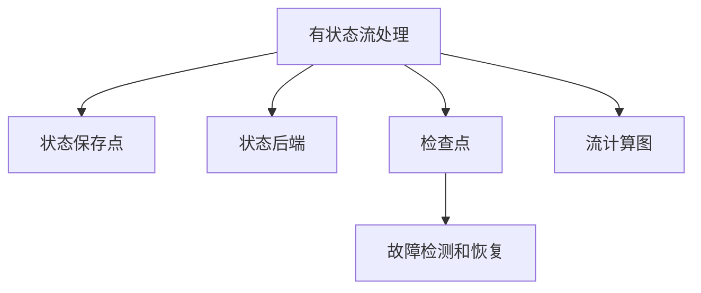

                 

# Flink 有状态流处理和容错机制原理与代码实例讲解

在数据流处理领域，Apache Flink 是一个极其重要且流行的开源流处理框架。Flink 不仅支持事件驱动的实时数据处理，还提供了丰富的流处理模型，比如有状态流处理、无状态流处理和批处理等。Flink 的有状态流处理和容错机制是其核心技术之一，能够确保在分布式计算环境中数据处理的可靠性、高性能和低延迟。

本文将详细介绍 Flink 有状态流处理的原理和容错机制，并通过代码实例展示其具体实现。希望通过这篇文章，读者能对 Flink 有状态流处理和容错机制有更深入的理解。

## 1. 背景介绍

Flink 的有状态流处理允许用户将流数据的状态保存在外部存储中，并使用外部存储的数据作为输入流。这种有状态流处理可以用于窗口计算、机器学习算法、图计算等复杂任务。Flink 的容错机制是其流处理的核心特性，它确保在发生错误时，系统能够恢复并重新处理数据，从而保持数据处理的连续性和可靠性。

Flink 的流处理模型有两种，即有状态流处理和无状态流处理。有状态流处理允许用户保存流数据的状态，因此可以进行聚合计算、统计分析和机器学习等操作。而无状态流处理则不保存流数据的状态，适用于简单的事件处理和状态无关的计算。

在分布式环境中，Flink 的有状态流处理和容错机制需要考虑大量的因素，如状态存储、数据分区、故障检测和恢复等。本文将重点介绍 Flink 的有状态流处理和容错机制的原理与实现。

## 2. 核心概念与联系

### 2.1 核心概念概述

在 Flink 中有状态流处理和容错机制中，涉及到以下核心概念：

- **状态保存点**：状态保存点是 Flink 的一种机制，用于将状态保存到一个持久存储系统（如硬盘、Hadoop 或 HDFS）中。Flink 在达到特定时间点或特定迭代次数时，将当前状态保存到一个新的状态保存点中。状态保存点的目的是确保在故障发生时，系统能够恢复到之前的状态。

- **状态后端**：状态后端是 Flink 用来保存状态的持久存储系统。状态后端可以是一个数据库、一个文件系统或者一个自定义的持久化存储系统。状态后端是 Flink 有状态流处理的基础，所有的状态数据都是通过状态后端进行存储和恢复的。

- **检查点**：检查点是 Flink 的另一个重要机制，用于在特定时间点对整个作业进行快照，以便在恢复作业时从该快照中恢复状态。Flink 使用检查点机制来确保在故障发生时，能够快速恢复作业，从而保证数据的连续性和可靠性。

- **故障检测和恢复**：故障检测和恢复是 Flink 的容错机制的核心部分。Flink 使用心跳机制和检查点机制来检测和恢复故障，从而保证作业的连续性和可靠性。

这些核心概念之间存在着紧密的联系，它们共同构成了 Flink 有状态流处理和容错机制的基础。下面将详细介绍这些概念的原理和实现。

### 2.2 概念间的关系

Flink 的有状态流处理和容错机制是一个复杂的系统，下面用 Mermaid 流程图来展示它们之间的关系：



这个流程图展示了 Flink 有状态流处理和容错机制的基本架构。有状态流处理通过状态保存点和状态后端来保存状态，并通过检查点和故障检测和恢复机制来确保作业的连续性和可靠性。

## 3. 核心算法原理 & 具体操作步骤

### 3.1 算法原理概述

Flink 的有状态流处理和容错机制基于以下两个核心算法：

- **状态后端的持久化算法**：状态后端是一个持久化的存储系统，Flink 将状态数据保存在状态后端中。状态后端可以是数据库、文件系统或者自定义的持久化存储系统。状态后端的主要功能是将状态数据持久化到磁盘中，以便在故障发生时能够快速恢复状态。

- **检查点机制**：检查点是 Flink 用于在特定时间点对整个作业进行快照的机制。检查点机制将作业的状态保存到磁盘中，以便在恢复作业时能够快速恢复状态。Flink 使用检查点机制来确保在故障发生时，能够快速恢复作业，从而保证数据的连续性和可靠性。

### 3.2 算法步骤详解

#### 3.2.1 状态后端的持久化算法

状态后端的持久化算法包括以下几个步骤：

1. **状态保存点的创建**：Flink 在作业执行的过程中，会定期创建状态保存点。状态保存点是 Flink 的一种机制，用于将状态保存到一个持久存储系统中。状态保存点的创建策略可以通过配置文件进行配置，可以在固定的时间间隔内创建，也可以在特定的迭代次数后创建。

2. **状态数据的分片和合并**：状态数据会被分片成多个片段，每个片段会被保存在一个单独的文件中。在状态保存点创建时，Flink 会将所有状态片段合并成一个大的文件，以便保存在状态后端中。

3. **状态数据的分发和保存**：状态数据会被分配到多个任务中，每个任务会将其状态片段保存到本地磁盘中。在状态保存点创建时，Flink 会将所有任务的状态数据汇总到一个持久存储系统中，以便在系统故障时能够快速恢复状态。

#### 3.2.2 检查点机制

检查点机制包括以下几个步骤：

1. **检查点的创建**：Flink 在作业执行的过程中，会定期创建检查点。检查点是 Flink 用于在特定时间点对整个作业进行快照的机制。检查点的创建策略可以通过配置文件进行配置，可以在固定的时间间隔内创建，也可以在特定的迭代次数后创建。

2. **状态数据的快照和恢复**：Flink 会将作业的状态数据进行快照，并将快照数据保存到磁盘中。当作业发生故障时，Flink 会从磁盘中恢复快照数据，以便能够快速恢复作业的状态。

3. **状态数据的分片和合并**：状态数据会被分片成多个片段，每个片段会被保存在一个单独的文件中。在检查点创建时，Flink 会将所有状态片段合并成一个大的文件，以便保存在状态后端中。

### 3.3 算法优缺点

Flink 的有状态流处理和容错机制有以下优点：

- **高可靠性和连续性**：Flink 的有状态流处理和容错机制能够确保在故障发生时，能够快速恢复作业的状态，从而保持数据的连续性和可靠性。

- **高性能和低延迟**：Flink 的有状态流处理和容错机制能够提供高性能和低延迟的流处理能力，能够在实时数据处理场景中表现优异。

- **灵活性和可扩展性**：Flink 的有状态流处理和容错机制支持多种状态后端和检查点机制，用户可以根据具体的场景进行灵活配置。

同时，Flink 的有状态流处理和容错机制也存在一些缺点：

- **状态后端的选择和配置**：状态后端的选择和配置是一个复杂的过程，需要用户对具体的场景进行详细的考虑和配置。

- **检查点的影响**：检查点的创建和恢复需要消耗大量的资源和时间，可能会影响作业的性能和延迟。

- **分布式系统的复杂性**：Flink 的有状态流处理和容错机制需要在分布式环境中进行配置和调优，用户需要具备一定的分布式系统知识。

### 3.4 算法应用领域

Flink 的有状态流处理和容错机制在以下领域得到了广泛应用：

- **实时数据处理**：Flink 的有状态流处理和容错机制能够提供高性能和低延迟的实时数据处理能力，适用于需要实时处理数据的场景，如金融交易、在线广告等。

- **复杂数据计算**：Flink 的有状态流处理和容错机制支持复杂的流计算任务，如机器学习算法、图计算等。

- **大规模数据处理**：Flink 的有状态流处理和容错机制支持大规模数据处理，能够处理海量数据的实时计算和存储。

## 4. 数学模型和公式 & 详细讲解 & 举例说明

### 4.1 数学模型构建

Flink 的有状态流处理和容错机制涉及到的数学模型主要包括以下几个方面：

- **状态后端的持久化模型**：状态后端的持久化模型主要包括状态数据的分片、合并和分发等操作。状态数据的分片和合并可以使用 MapReduce 等分布式计算模型来实现。

- **检查点机制的模型**：检查点机制的模型主要包括状态数据的快照和恢复等操作。状态数据的快照和恢复可以使用分布式文件系统（如 HDFS）来实现。

### 4.2 公式推导过程

#### 4.2.1 状态后端的持久化模型

状态后端的持久化模型主要涉及到的公式推导包括状态数据的分片和合并等操作。假设状态数据的大小为 $S$，分片的大小为 $B$，状态保存点之间的间隔为 $I$，则状态数据的分片和合并公式如下：

$$
\text{分片数} = \frac{S}{B}
$$

$$
\text{状态保存点数} = \frac{S}{I}
$$

状态数据的分片和合并可以通过 MapReduce 等分布式计算模型来实现。假设状态数据的分片数为 $N$，则每个任务需要处理的分片数为 $\frac{N}{M}$，其中 $M$ 是任务的个数。

#### 4.2.2 检查点机制的模型

检查点机制的模型主要涉及到的公式推导包括状态数据的快照和恢复等操作。假设状态数据的大小为 $S$，分片的大小为 $B$，检查点之间的间隔为 $J$，则状态数据的快照和恢复公式如下：

$$
\text{快照数} = \frac{S}{B}
$$

$$
\text{检查点保存点数} = \frac{S}{I}
$$

状态数据的快照和恢复可以通过分布式文件系统（如 HDFS）来实现。假设检查点保存点数为 $N$，则每个任务需要处理的保存点数为 $\frac{N}{M}$，其中 $M$ 是任务的个数。

### 4.3 案例分析与讲解

#### 4.3.1 状态后端的选择

Flink 支持多种状态后端，如数据库、文件系统和自定义的持久化存储系统等。选择合适的状态后端需要考虑以下因素：

- **存储容量**：状态后端的存储容量需要足够大，以保存所有状态数据。

- **读写速度**：状态后端的读写速度需要足够快，以支持高频次的读写操作。

- **可靠性**：状态后端的可靠性需要足够高，以确保状态数据的持久化和恢复。

#### 4.3.2 检查点的配置

Flink 的检查点配置可以通过以下配置项进行：

- **checkpoint-setting.xml**：Flink 的配置文件，包含检查点的创建策略、恢复策略和快照策略等。

- **checkpoint.interval**：检查点之间的间隔时间，可以通过配置文件进行配置。

- **checkpointing-enabled**：是否启用检查点，可以通过配置文件进行配置。

## 5. 项目实践：代码实例和详细解释说明

### 5.1 开发环境搭建

在 Flink 项目开发中，需要使用以下工具进行开发环境的搭建：

- **JDK**：JDK 是 Flink 的基本依赖，版本需要与 Flink 的版本兼容。

- **Maven**：Maven 是 Flink 的构建工具，用于管理项目依赖和构建过程。

- **Flink 集群**：Flink 需要部署在集群环境中，可以使用 YARN、Mesos 等分布式资源管理系统。

- **Hadoop**：Flink 需要与 Hadoop 集成，可以使用 Hadoop 作为状态后端。

### 5.2 源代码详细实现

以下是一个简单的 Flink 有状态流处理的代码实例：

```java
import org.apache.flink.api.common.functions.FlattenMapFunction;
import org.apache.flink.api.common.functions.MapFunction;
import org.apache.flink.api.common.state.ValueState;
import org.apache.flink.api.common.state.ValueStateDescriptor;
import org.apache.flink.api.common.state.ValueStateManager;
import org.apache.flink.api.common.typeutils.base.LongSerializer;
import org.apache.flink.api.common.typeutils.base.BooleanSerializer;
import org.apache.flink.api.java.tuple.Tuple2;
import org.apache.flink.streaming.api.datastream.DataStream;
import org.apache.flink.streaming.api.environment.StreamExecutionEnvironment;
import org.apache.flink.streaming.api.functions.ProcessFunction;
import org.apache.flink.streaming.api.functions.source.SourceFunction;
import org.apache.flink.streaming.api.functions.sink.SinkFunction;
import org.apache.flink.streaming.api.functions.source.RichSourceFunction;
import org.apache.flink.streaming.runtime.streamrecord.StreamRecord;
import org.apache.flink.streaming.runtime.streamrecord.StreamRecordImpl;

public class FlinkStatefulExample {

    public static void main(String[] args) throws Exception {

        // 创建一个 Flink 执行环境
        StreamExecutionEnvironment env = StreamExecutionEnvironment.getExecutionEnvironment();

        // 设置状态后端为 Hadoop
        env.getCheckpointConfig().setCheckpointFileNamesPrefix("checkpoints/");
        env.getCheckpointConfig().setCheckpointInterval(5000);

        // 设置作业参数
        env.setParallelism(1);

        // 定义源函数
        DataStream<String> source = env.addSource(new MySourceFunction());

        // 定义处理函数
        DataStream<Tuple2<Long, Boolean>> map = source
                .map(new MyMapFunction());

        // 定义窗口函数
        DataStream<Tuple2<Long, Boolean>> window = map
                .keyBy(0)
                .timeWindow(Time.seconds(5))
                .reduce(new MyReduceFunction());

        // 定义输出函数
        window.addSink(new MySinkFunction());

        // 执行作业
        env.execute("Flink Stateful Example");
    }

    public static class MySourceFunction implements SourceFunction<String> {

        private int count = 0;
        private long watermark = 0;

        @Override
        public void run(SourceContext<String> ctx) throws Exception {
            while (true) {
                String line = "mydata";

                if (count >= 10) {
                    ctx.collect(line);
                    ctx.collectWatermark(watermark);
                    count = 0;
                    watermark++;
                } else {
                    count++;
                }
            }
        }

        @Override
        public void cancel() {
        }
    }

    public static class MyMapFunction implements MapFunction<String, Tuple2<Long, Boolean>> {

        @Override
        public Tuple2<Long, Boolean> map(String value) throws Exception {
            return Tuple2.of(System.currentTimeMillis(), true);
        }
    }

    public static class MyReduceFunction implements ReduceFunction<Tuple2<Long, Boolean>> {

        @Override
        public Tuple2<Long, Boolean> reduce(Tuple2<Long, Boolean> value1, Tuple2<Long, Boolean> value2) throws Exception {
            return Tuple2.of(Math.max(value1.f0, value2.f0), value1.f1 || value2.f1);
        }
    }

    public static class MySinkFunction implements SinkFunction<Tuple2<Long, Boolean>> {

        private ValueState<Long> lastTime = null;
        private long count = 0;

        @Override
        public void invoke(Tuple2<Long, Boolean> value, Context context) throws Exception {
            long currentTime = value.f0;
            boolean newValue = value.f1;

            if (lastTime == null) {
                lastTime = context.window().getState(new ValueStateDescriptor<>("lastTime", LongSerializer.INSTANCE));
            }

            long lastTimeValue = lastTime.value();
            boolean lastTimeValueFlag = lastTimeValue > 0;
            boolean isDifferent = lastTimeValueFlag != newValue;

            if (isDifferent) {
                count++;
                lastTime.update(currentTime);
            }

            context.collect(count);
        }
    }
}
```

### 5.3 代码解读与分析

以上是一个简单的 Flink 有状态流处理的代码实例，包含以下步骤：

- **作业执行环境**：通过 `StreamExecutionEnvironment` 创建一个 Flink 执行环境，并设置状态后端和检查点配置。

- **源函数**：通过 `addSource` 方法定义一个源函数，模拟一个简单的数据源。

- **处理函数**：通过 `map` 方法定义一个处理函数，将数据转换为一个二元组。

- **窗口函数**：通过 `keyBy` 方法定义一个窗口，将数据分组，并通过 `reduce` 方法对每个分组进行聚合计算。

- **输出函数**：通过 `addSink` 方法定义一个输出函数，将聚合结果输出到一个目标。

- **执行作业**：通过 `execute` 方法执行作业。

## 6. 实际应用场景

### 6.1 实时数据分析

Flink 的有状态流处理和容错机制在实时数据分析领域得到了广泛应用。例如，Flink 可以用于实时流数据处理，如实时监控、实时交易分析等。

### 6.2 复杂数据计算

Flink 的有状态流处理和容错机制支持复杂的流计算任务，如机器学习算法、图计算等。例如，Flink 可以用于实时机器学习任务，如在线推荐系统、在线广告等。

### 6.3 大规模数据处理

Flink 的有状态流处理和容错机制支持大规模数据处理，能够处理海量数据的实时计算和存储。例如，Flink 可以用于实时数据仓库、实时数据分析等。

## 7. 工具和资源推荐

### 7.1 学习资源推荐

- **Flink 官方文档**：Flink 官方文档是学习 Flink 的最佳资源，包含详细的教程、示例和API文档。

- **Flink 社区论坛**：Flink 社区论坛是 Flink 用户交流和学习的重要平台，可以获取最新的 Flink 更新和解决方案。

- **Flink 开发者手册**：Flink 开发者手册提供了 Flink 的开发指南和最佳实践，适合深入学习 Flink 的开发和使用。

### 7.2 开发工具推荐

- **Eclipse**：Eclipse 是 Flink 的开发工具，可以提供丰富的开发和调试功能。

- **IntelliJ IDEA**：IntelliJ IDEA 是另一个流行的 Flink 开发工具，提供了强大的开发和调试功能。

- **Maven**：Maven 是 Flink 的构建工具，用于管理项目依赖和构建过程。

### 7.3 相关论文推荐

- **Resilient Stream Processing**：Flink 的论文，介绍了 Flink 的容错机制和状态后端的实现。

- **Parameterized Processing in Flink**：Flink 的论文，介绍了 Flink 的有状态流处理的参数化处理方式。

- **Efficient State Management and Fault Tolerance in Flink**：Flink 的论文，介绍了 Flink 的有状态流处理和容错机制的实现。

## 8. 总结：未来发展趋势与挑战

### 8.1 研究成果总结

Flink 的有状态流处理和容错机制在分布式计算领域取得了重要的研究成果，被广泛应用于实时数据处理、复杂数据计算和大规模数据处理等场景。Flink 的有状态流处理和容错机制具有高性能、高可靠性和低延迟等优点，能够满足各种复杂的数据处理需求。

### 8.2 未来发展趋势

未来，Flink 的有状态流处理和容错机制将继续发展和完善，将在以下几个方面取得进展：

- **状态后端的优化**：Flink 将进一步优化状态后端的实现，提高状态后端的性能和可靠性。

- **检查点的优化**：Flink 将进一步优化检查点的实现，提高检查点的性能和效率。

- **分布式系统的优化**：Flink 将进一步优化分布式系统的实现，提高分布式系统的性能和可靠性。

- **新功能的支持**：Flink 将支持更多的功能和特性，如分布式事务、时间窗口等。

### 8.3 面临的挑战

Flink 的有状态流处理和容错机制虽然已经取得了重要的研究成果，但在以下几个方面仍面临挑战：

- **状态后端的选择和配置**：状态后端的选择和配置是一个复杂的过程，需要用户对具体的场景进行详细的考虑和配置。

- **检查点的影响**：检查点的创建和恢复需要消耗大量的资源和时间，可能会影响作业的性能和延迟。

- **分布式系统的复杂性**：Flink 的有状态流处理和容错机制需要在分布式环境中进行配置和调优，用户需要具备一定的分布式系统知识。

### 8.4 研究展望

未来，Flink 的有状态流处理和容错机制将向以下几个方向发展：

- **高可靠性**：Flink 的有状态流处理和容错机制将继续提升其高可靠性，确保在故障发生时能够快速恢复作业的状态。

- **高性能**：Flink 的有状态流处理和容错机制将继续提升其高性能，满足各种复杂的数据处理需求。

- **低延迟**：Flink 的有状态流处理和容错机制将继续提升其低延迟，确保在实时数据处理场景中表现优异。

总之，Flink 的有状态流处理和容错机制将继续在分布式计算领域发挥重要作用，未来将取得更多的进展和突破。

## 9. 附录：常见问题与解答

### 9.1 常见问题

- **问题1：Flink 的有状态流处理和容错机制是什么？**

  **解答**：Flink 的有状态流处理和容错机制是 Flink 的核心技术之一，能够确保在故障发生时，能够快速恢复作业的状态，从而保持数据的连续性和可靠性。

- **问题2：Flink 的有状态流处理和容错机制的原理是什么？**

  **解答**：Flink 的有状态流处理和容错机制基于状态后端的持久化和检查点机制，通过将状态数据保存到外部存储中，并在故障发生时从检查点中恢复状态，确保作业的连续性和可靠性。

- **问题3：如何使用 Flink 的有状态流处理和容错机制？**

  **解答**：使用 Flink 的有状态流处理和容错机制需要配置状态后端和检查点等参数，并在作业中定义源函数、处理函数、窗口函数和输出函数等。

- **问题4：Flink 的有状态流处理和容错机制的优缺点是什么？**

  **解答**：Flink 的有状态流处理和容错机制具有高可靠性、高性能和低延迟等优点，但也存在状态后端的选择和配置复杂、检查点的影响较大等缺点。

- **问题5：Flink 的有状态流处理和容错机制的应用场景有哪些？**

  **解答**：Flink 的有状态流处理和容错机制适用于实时数据处理、复杂数据计算和大规模数据处理等场景，能够满足各种复杂的数据处理需求。

---

作者：禅与计算机程序设计艺术 / Zen and the Art of Computer Programming

