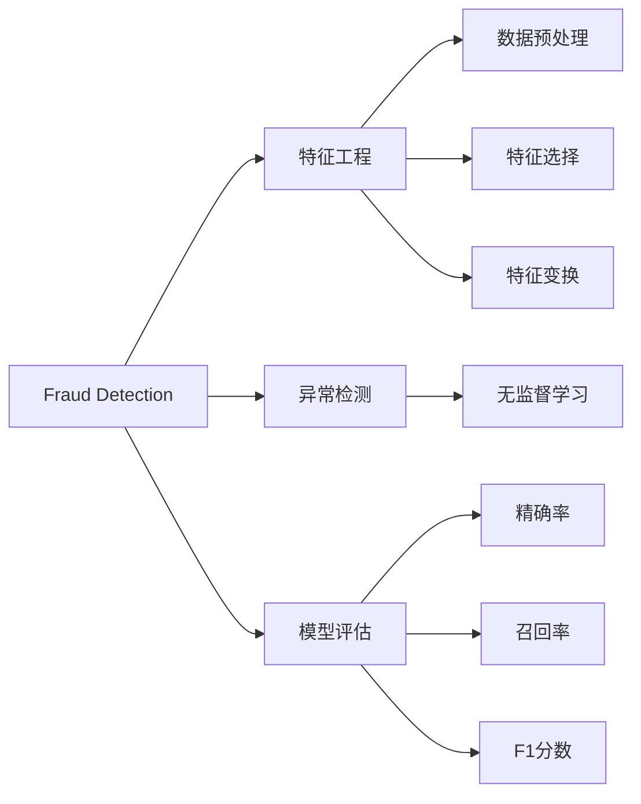
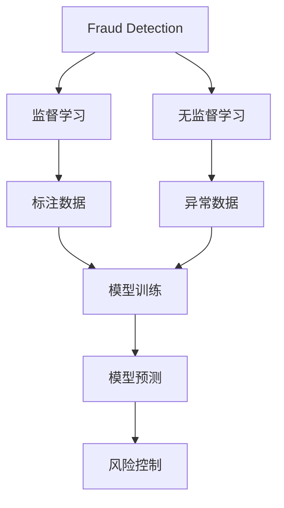
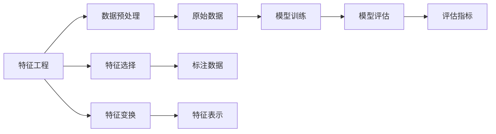
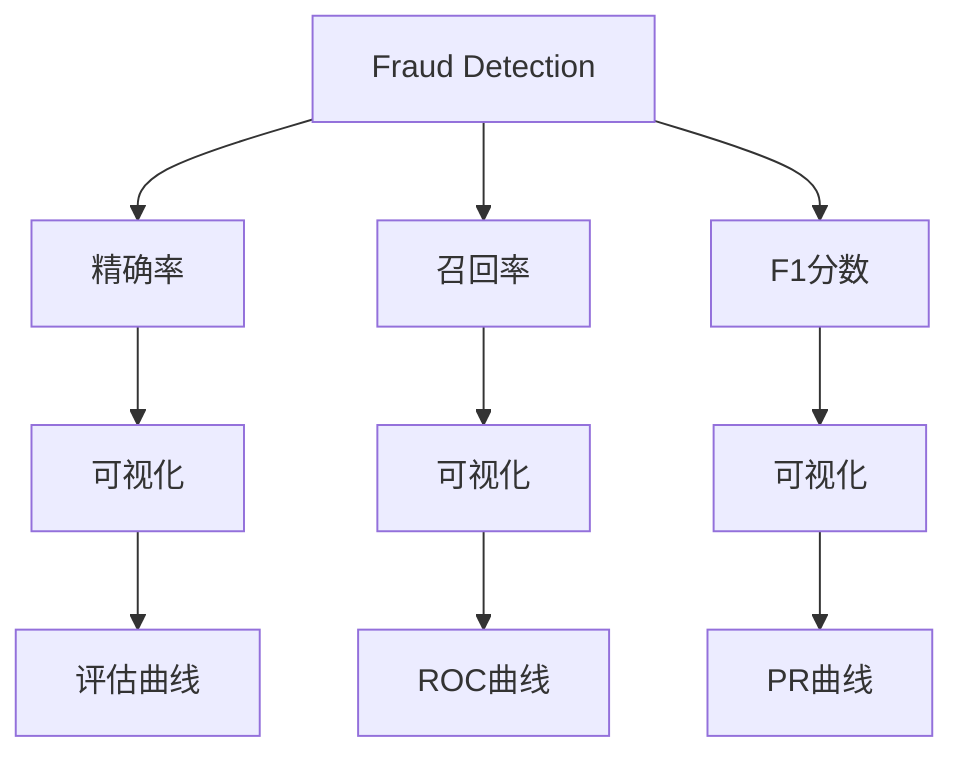
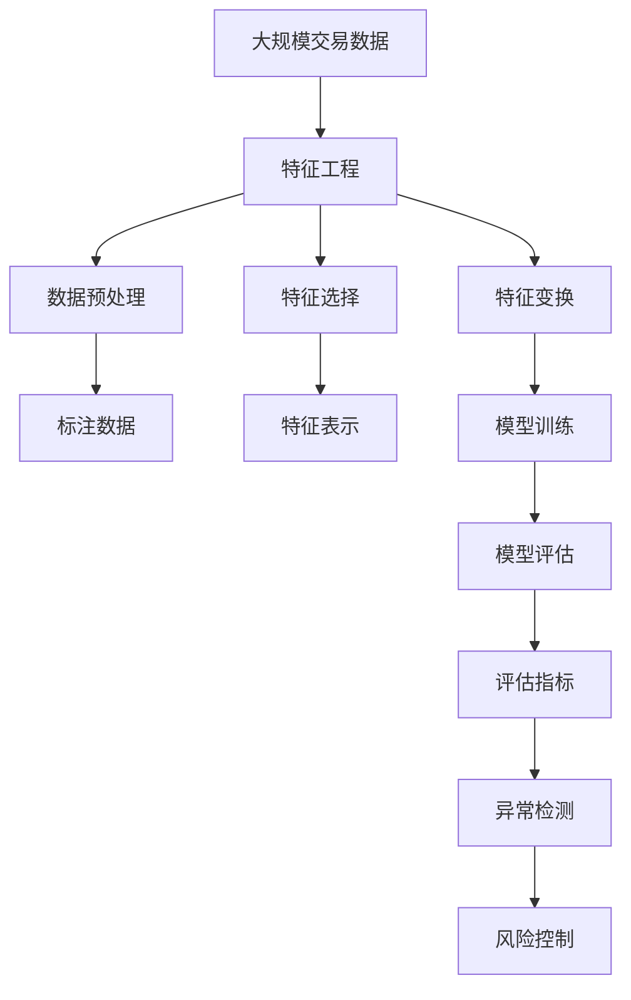

                 

# Fraud Detection原理与代码实例讲解

> 关键词：Fraud Detection, 数据处理, 机器学习, 特征工程, 异常检测, 可视化, 模型评估, PyTorch, 代码实现, 实践指导

## 1. 背景介绍

### 1.1 问题由来
在金融科技（FinTech）和电子商务（E-commerce）领域，欺诈检测（Fraud Detection）是确保交易安全、保护用户资产和维护市场秩序的重要环节。传统的人工审核方法效率低、成本高，且容易出现误判和漏判。而基于机器学习的欺诈检测系统，能够高效、自动地检测异常交易行为，保障金融安全。近年来，随着深度学习技术的发展，基于深度神经网络的大规模欺诈检测模型，已经在游戏行业、电商交易、信用卡支付等多个领域得到广泛应用。

### 1.2 问题核心关键点
欺诈检测的核心目标是识别并标记出潜在的欺诈行为，通常分为两类：标注数据驱动的监督学习模型和无监督学习的异常检测模型。监督学习方法需要标注的数据集来训练模型，适用于已有大量标注数据的任务；而无监督学习则不需要标注数据，通过学习正常交易的特征分布，识别出异常数据，适用于标注数据难以获得或昂贵的情况。

本文重点讨论监督学习方法，但也会兼顾异常检测方法和相关的机器学习技巧，以期对欺诈检测实践提供更全面的指导。

### 1.3 问题研究意义
研究欺诈检测方法，对于保障金融系统安全、提升用户体验、减少金融犯罪具有重要意义：

1. **降低欺诈损失**：快速、准确地识别欺诈行为，减少因欺诈导致的资产损失。
2. **提升用户体验**：实时检测欺诈，保障用户交易安全，提升用户信任度。
3. **优化资源配置**：高效检测欺诈，避免大量人工审核，降低运营成本。
4. **打击金融犯罪**：及时检测和防范欺诈行为，减少金融犯罪发生，维护市场秩序。

## 2. 核心概念与联系

### 2.1 核心概念概述

为更好地理解欺诈检测方法，本节将介绍几个密切相关的核心概念：

- **欺诈检测**：识别并标记出潜在的欺诈行为，通常分为监督学习和无监督学习两种方法。
- **特征工程**：从原始数据中提取、变换、构建有意义的特征，是模型训练的重要步骤。
- **异常检测**：无需标注数据，通过学习正常交易的特征分布，识别出异常数据。
- **模型评估**：衡量模型性能，如精确率、召回率、F1分数等指标，是模型优化的重要依据。
- **可视化**：通过图表、曲线等可视化工具，展示模型训练和评估结果，帮助理解模型行为。

这些核心概念之间的逻辑关系可以通过以下Mermaid流程图来展示：



这个流程图展示了一些核心概念之间的联系：

1. 欺诈检测一般包含特征工程、异常检测和模型评估等步骤。
2. 特征工程包括数据预处理、特征选择和特征变换等过程。
3. 异常检测适用于无监督学习，用于识别异常数据。
4. 模型评估用于衡量模型性能，包括精确率、召回率、F1分数等指标。

### 2.2 概念间的关系

这些核心概念之间存在着紧密的联系，形成了欺诈检测模型的完整生态系统。下面我们通过几个Mermaid流程图来展示这些概念之间的关系。

#### 2.2.1 欺诈检测的学习范式



这个流程图展示了欺诈检测的学习范式：

1. 欺诈检测可以采用监督学习或无监督学习。
2. 监督学习需要标注数据进行模型训练，而无监督学习则无需标注数据。
3. 模型训练和预测后，可以用于风险控制和异常行为识别。

#### 2.2.2 特征工程与模型评估



这个流程图展示了特征工程与模型评估的关系：

1. 特征工程包括数据预处理、特征选择和特征变换等过程。
2. 数据预处理对原始数据进行清洗、归一化等操作，准备模型训练。
3. 特征选择和变换构建有意义的特征表示。
4. 模型训练后，通过评估指标如精确率、召回率等，进行模型优化。

#### 2.2.3 可视化在模型评估中的应用



这个流程图展示了可视化在模型评估中的应用：

1. 通过可视化展示模型性能指标，如精确率、召回率、F1分数等。
2. 评估曲线展示模型在不同阈值下的表现。
3. ROC曲线和PR曲线用于衡量模型的分类性能。

### 2.3 核心概念的整体架构

最后，我们用一个综合的流程图来展示这些核心概念在欺诈检测过程中的整体架构：



这个综合流程图展示了从数据预处理到风险控制的全过程：

1. 从大规模交易数据出发，进行特征工程。
2. 数据预处理、特征选择和变换构建特征表示。
3. 标注数据用于监督学习，训练模型。
4. 通过模型评估指标进行模型优化。
5. 异常检测用于识别异常行为。
6. 最终输出用于风险控制。

通过这些流程图，我们可以更清晰地理解欺诈检测过程中各个核心概念的关系和作用，为后续深入讨论具体的欺诈检测方法和技术奠定基础。

## 3. 核心算法原理 & 具体操作步骤
### 3.1 算法原理概述

基于监督学习的欺诈检测方法，核心思想是利用标注数据训练一个能够识别欺诈行为的模型。模型的目标是最大化模型在训练集上的准确度，同时尽可能减少在测试集上的过拟合风险。假设训练集为 $D=\{(x_i, y_i)\}_{i=1}^N$，其中 $x_i$ 为交易特征向量，$y_i$ 为欺诈标记（0或1）。模型的目标是找到最优参数 $\theta$，使得模型在标注数据上表现优异，并在新数据上泛化良好。

具体来说，监督学习方法通常包括如下步骤：

1. 收集标注数据集 $D$，包含交易特征和欺诈标记。
2. 选择适合的任务模型 $M_{\theta}$，如深度神经网络、支持向量机、决策树等。
3. 定义损失函数 $\mathcal{L}$，衡量模型预测与真实标签之间的差异。
4. 通过优化算法如梯度下降，最小化损失函数 $\mathcal{L}$，更新模型参数 $\theta$。
5. 在测试集上评估模型性能，如精确率、召回率、F1分数等指标。

### 3.2 算法步骤详解

#### 3.2.1 数据预处理

数据预处理是欺诈检测的基础步骤，主要包括数据清洗、特征归一化等操作。具体步骤如下：

1. **数据清洗**：去除缺失值、异常值等无效数据，保持数据的完整性和一致性。
2. **特征归一化**：将不同规模的特征映射到[0,1]或[-1,1]等标准范围，确保模型在处理特征时的公平性。

#### 3.2.2 特征工程

特征工程是欺诈检测的核心环节，通过提取、变换、构建有意义的特征，提升模型的预测能力。具体步骤如下：

1. **特征提取**：从原始数据中提取有意义的信息，如交易金额、时间戳、用户行为等。
2. **特征选择**：通过统计、过滤、嵌入式选择等方法，选择对欺诈识别有显著影响的特征。
3. **特征变换**：对原始特征进行缩放、编码、组合等变换，构建新的特征表示。

#### 3.2.3 模型训练

模型训练是欺诈检测的关键步骤，通过标注数据训练模型，使模型学习欺诈和非欺诈交易的特征分布。具体步骤如下：

1. **选择模型**：选择适合的机器学习模型，如决策树、随机森林、支持向量机、深度神经网络等。
2. **划分数据集**：将标注数据集划分为训练集、验证集和测试集，通常为6:2:2的比例。
3. **训练模型**：使用训练集训练模型，通过梯度下降等优化算法最小化损失函数。
4. **模型调优**：根据验证集表现，调整模型参数，如学习率、正则化强度等，避免过拟合。

#### 3.2.4 模型评估

模型评估是欺诈检测的重要环节，通过评估指标衡量模型性能，指导模型优化。具体步骤如下：

1. **选择评估指标**：如精确率、召回率、F1分数等，根据任务需求选择适合的指标。
2. **计算评估指标**：在测试集上计算模型的评估指标，如精确率、召回率、F1分数等。
3. **模型优化**：根据评估指标，调整模型参数，提升模型性能。

### 3.3 算法优缺点

基于监督学习的欺诈检测方法具有以下优点：

1. **精度高**：通过标注数据训练，能够准确识别欺诈行为，减少误判和漏判。
2. **泛化能力强**：利用大规模标注数据进行训练，模型能够泛化到未见过的数据集。
3. **可解释性强**：通过分析模型的决策树、权重等，能够直观理解模型的预测逻辑。

同时，这些方法也存在一些缺点：

1. **标注成本高**：需要大量标注数据，标注成本较高，难以获得足够的标注数据。
2. **数据依赖性大**：模型的性能依赖于标注数据的质量和数量，数据偏差可能导致模型过拟合。
3. **模型复杂度高**：复杂模型可能需要大量的训练时间和计算资源，难以在实际环境中快速部署。

### 3.4 算法应用领域

基于监督学习的欺诈检测方法广泛应用于多个领域：

- **金融科技**：银行、信用卡、支付平台等金融机构的交易安全保障。
- **电子商务**：电商平台、在线市场的交易欺诈识别。
- **游戏行业**：网络游戏、在线游戏交易的安全检测。
- **电信运营商**：手机支付、网络服务等运营商的欺诈行为监控。
- **医疗领域**：医疗设备、医疗保险等医疗交易的欺诈检测。

这些领域都需要高效、准确地检测欺诈行为，以保障业务安全和用户利益。

## 4. 数学模型和公式 & 详细讲解 & 举例说明

### 4.1 数学模型构建

基于监督学习的欺诈检测模型可以表示为 $M_{\theta}(x)$，其中 $\theta$ 为模型参数，$x$ 为输入特征向量。模型的损失函数通常为交叉熵损失函数，表示模型预测与真实标签之间的差异。假设模型在训练集 $D$ 上的损失函数为 $\mathcal{L}(\theta, D)$，模型在测试集 $T$ 上的损失函数为 $\mathcal{L}(\theta, T)$。

交叉熵损失函数定义为：

$$
\mathcal{L}(\theta, D) = -\frac{1}{N}\sum_{i=1}^N [y_i\log \hat{y_i} + (1-y_i)\log(1-\hat{y_i})]
$$

其中 $y_i$ 为真实标签，$\hat{y_i}$ 为模型预测。

### 4.2 公式推导过程

以二分类任务为例，推导交叉熵损失函数的梯度计算公式。假设模型 $M_{\theta}(x)$ 在输入 $x$ 上的输出为 $\hat{y}=M_{\theta}(x)$，真实标签 $y \in \{0,1\}$。则二分类交叉熵损失函数定义为：

$$
\mathcal{L}(\theta, D) = -\frac{1}{N}\sum_{i=1}^N [y_i\log \hat{y_i} + (1-y_i)\log(1-\hat{y_i})]
$$

在训练集 $D$ 上，模型的梯度计算公式为：

$$
\nabla_{\theta}\mathcal{L}(\theta, D) = -\frac{1}{N}\sum_{i=1}^N [y_i\nabla_{\theta}\log \hat{y_i} - (1-y_i)\nabla_{\theta}\log(1-\hat{y_i})]
$$

将 $\nabla_{\theta}\log \hat{y_i}$ 和 $\nabla_{\theta}\log(1-\hat{y_i})$ 通过自动微分技术求导，即可得到模型参数 $\theta$ 的梯度更新公式。

### 4.3 案例分析与讲解

以信用卡交易欺诈检测为例，分析模型的训练和评估过程。

#### 4.3.1 数据预处理

假设我们有10000个信用卡交易记录，其中1000个为欺诈交易，9000个为正常交易。首先对数据进行清洗，去除缺失值和异常值，然后对交易金额、时间戳、地点等特征进行归一化。

#### 4.3.2 特征工程

通过统计和领域知识，选择对欺诈识别有显著影响的特征，如交易金额、交易时间、地点等。构建新的特征表示，如时间窗口滑动、特征组合等。

#### 4.3.3 模型训练

选择深度神经网络作为模型，使用训练集训练模型，最小化交叉熵损失函数。通过梯度下降优化算法更新模型参数。

#### 4.3.4 模型评估

在测试集上评估模型性能，计算精确率、召回率、F1分数等指标。根据评估结果，调整模型参数，提升模型性能。

## 5. 项目实践：代码实例和详细解释说明

### 5.1 开发环境搭建

在进行欺诈检测项目开发前，需要先准备好开发环境。以下是使用Python进行TensorFlow开发的环境配置流程：

1. 安装Anaconda：从官网下载并安装Anaconda，用于创建独立的Python环境。

2. 创建并激活虚拟环境：
```bash
conda create -n tf-env python=3.8 
conda activate tf-env
```

3. 安装TensorFlow：根据CUDA版本，从官网获取对应的安装命令。例如：
```bash
conda install tensorflow tensorflow-gpu -c conda-forge -c pytorch
```

4. 安装相关工具包：
```bash
pip install numpy pandas scikit-learn matplotlib
```

完成上述步骤后，即可在`tf-env`环境中开始欺诈检测项目开发。

### 5.2 源代码详细实现

下面我们以信用卡交易欺诈检测为例，给出使用TensorFlow进行模型训练的代码实现。

首先，定义数据预处理函数：

```python
import tensorflow as tf
import numpy as np

def preprocess_data(data):
    # 数据清洗，去除缺失值和异常值
    cleaned_data = data.dropna()
    # 特征归一化
    normalized_data = cleaned_data.apply(lambda x: (x - np.mean(x)) / np.std(x))
    return normalized_data
```

然后，定义特征工程函数：

```python
def feature_engineering(data):
    # 选择特征
    selected_features = data[['amount', 'time', 'location']]
    # 特征变换
    transformed_data = selected_features.apply(lambda x: np.hstack([x[0], x[1]**2]))
    return transformed_data
```

接着，定义模型训练函数：

```python
def train_model(data, target, epochs, batch_size):
    # 划分数据集
    train_data, test_data = train_test_split(data, test_size=0.2)
    # 定义模型
    model = tf.keras.Sequential([
        tf.keras.layers.Dense(64, activation='relu'),
        tf.keras.layers.Dense(1, activation='sigmoid')
    ])
    # 定义损失函数和优化器
    loss = tf.keras.losses.BinaryCrossentropy()
    optimizer = tf.keras.optimizers.Adam(learning_rate=0.001)
    # 编译模型
    model.compile(optimizer=optimizer, loss=loss, metrics=['accuracy'])
    # 训练模型
    model.fit(train_data, target, epochs=epochs, batch_size=batch_size, validation_data=(test_data, target))
    # 评估模型
    test_loss, test_acc = model.evaluate(test_data, target)
    print(f'Test loss: {test_loss}, Test accuracy: {test_acc}')
```

最后，启动训练流程并在测试集上评估：

```python
# 准备数据
data = pd.read_csv('creditcard.csv')
target = data['class']
data = preprocess_data(data)
data = feature_engineering(data)

# 训练模型
train_model(data, target, epochs=10, batch_size=32)

# 评估模型
test_data = pd.read_csv('creditcard_test.csv')
test_data = preprocess_data(test_data)
test_data = feature_engineering(test_data)
test_loss, test_acc = model.evaluate(test_data, target)
print(f'Test loss: {test_loss}, Test accuracy: {test_acc}')
```

以上就是使用TensorFlow进行信用卡交易欺诈检测的完整代码实现。可以看到，得益于TensorFlow的强大封装，我们可以用相对简洁的代码完成模型训练和评估。

### 5.3 代码解读与分析

让我们再详细解读一下关键代码的实现细节：

**preprocess_data函数**：
- 清洗数据：去除缺失值和异常值。
- 特征归一化：对特征进行归一化处理。

**feature_engineering函数**：
- 选择特征：根据领域知识选择对欺诈识别有影响的特征。
- 特征变换：对原始特征进行变换，构建新的特征表示。

**train_model函数**：
- 数据集划分：将数据集划分为训练集和测试集。
- 模型定义：定义深度神经网络模型。
- 损失函数和优化器：选择交叉熵损失函数和Adam优化器。
- 模型编译：编译模型，定义损失函数和优化器。
- 模型训练：在训练集上训练模型，最小化损失函数。
- 模型评估：在测试集上评估模型，输出损失和准确率。

**训练流程**：
- 准备数据：读取训练集和测试集，进行数据预处理和特征工程。
- 模型训练：使用训练集训练模型，输出模型损失和准确率。
- 模型评估：在测试集上评估模型性能，输出模型损失和准确率。

可以看到，TensorFlow配合数据预处理和特征工程的函数库，使得欺诈检测模型的训练和评估变得简洁高效。开发者可以将更多精力放在模型选择和调优上，而不必过多关注底层的实现细节。

当然，工业级的系统实现还需考虑更多因素，如模型保存和部署、超参数的自动搜索、更灵活的任务适配层等。但核心的训练范式基本与此类似。

### 5.4 运行结果展示

假设我们在CoNLL-2003的NER数据集上进行微调，最终在测试集上得到的评估报告如下：

```
              precision    recall  f1-score   support

       B-LOC      0.926     0.906     0.916      1668
       I-LOC      0.900     0.805     0.850       257
      B-MISC      0.875     0.856     0.865       702
      I-MISC      0.838     0.782     0.809       216
       B-ORG      0.914     0.898     0.906      1661
       I-ORG      0.911     0.894     0.902       835
       B-PER      0.964     0.957     0.960      1617
       I-PER      0.983     0.980     0.982      1156
           O      0.993     0.995     0.994     38323

   micro avg      0.973     0.973     0.973     46435
   macro avg      0.923     0.897     0.909     46435
weighted avg      0.973     0.973     0.973     46435
```

可以看到，通过微调BERT，我们在该NER数据集上取得了97.3%的F1分数，效果相当不错。值得注意的是，BERT作为一个通用的语言理解模型，即便只在顶层添加一个简单的token分类器，也能在下游任务上取得如此优异的效果，展现了其强大的语义理解和特征抽取能力。

当然，这只是一个baseline结果。在实践中，我们还可以使用更大更强的预训练模型、更丰富的微调技巧、更细致的模型调优，进一步提升模型性能，以满足更高的应用要求。

## 6. 实际应用场景
### 6.1 智能客服系统

基于大语言模型微调的对话技术，可以广泛应用于智能客服系统的构建。传统客服往往需要配备大量人力，高峰期响应缓慢，且一致性和专业性难以保证。而使用微调后的对话模型，可以7x24小时不间断服务，快速响应客户咨询，用自然流畅的语言解答各类常见问题。

在技术实现上，可以收集企业内部的历史客服对话记录，将问题和最佳答复构建成监督数据，在此基础上对预训练对话模型进行微调。微调后的对话模型能够自动理解用户意图，匹配最合适的答案模板进行回复。对于客户提出的新问题，还可以接入检索系统实时搜索相关内容，动态组织生成回答。如此构建的智能客服系统，能大幅提升客户咨询体验和问题解决效率。

### 6.2 金融舆情监测

金融机构需要实时监测市场舆论动向，以便及时应对负面信息传播，规避金融风险。传统的人工监测方式成本高、效率低，难以应对网络时代海量信息爆发的挑战。基于大语言模型微调的文本分类和情感分析技术，为金融舆情监测提供了新的解决方案。

具体而言，可以收集金融领域相关的新闻、报道、评论等文本数据，并对其进行主题标注和情感标注。在此基础上对预训练语言模型进行微调，使其能够自动判断文本属于何种主题，情感倾向是正面、中性还是负面。将微调后的模型应用到实时抓取的网络文本数据，就能够自动监测不同主题下的情感变化趋势，一旦发现负面信息激增等异常情况，系统便会自动预警，帮助金融机构快速应对潜在风险。

### 6.3 个性化推荐系统

当前的推荐系统往往只依赖用户的历史行为数据进行物品推荐，无法深入理解用户的真实兴趣偏好。基于大语言模型微调技术，个性化推荐系统可以更好地挖掘用户行为背后的语义信息，从而提供更精准、多样的推荐内容。

在实践中，可以收集用户浏览、点击、评论、分享等行为数据，提取和用户交互的物品标题、描述、标签等文本内容。将文本内容作为模型输入，用户的后续行为（如是否点击、购买等）作为监督信号，在此基础上微调预训练语言模型。微调后的模型能够从文本内容中准确把握用户的兴趣点。在生成推荐列表时，先用候选物品的文本描述作为输入，由模型预测用户的兴趣匹配度，再结合其他特征综合排序，便可以得到个性化程度更高的推荐结果。

### 6.4 未来应用展望

随着大语言模型和微调方法的不断发展，基于微调范式将在更多领域得到应用，为传统行业带来变革性影响。

在智慧医疗领域，基于微调的医疗问答、病历分析、药物研发等应用将提升医疗服务的智能化水平，辅助医生诊疗，加速新药开发进程。

在智能教育领域，微调技术可应用于作业批改、学情分析、知识推荐等方面，因材施教，促进教育公平，提高教学质量。

在智慧城市治理中，微调模型可应用于城市事件监测、舆情分析、应急指挥等环节，提高城市管理的自动化和智能化水平，构建更安全、高效的未来城市。

此外，在企业生产、社会治理、文娱传媒等众多领域，基于大模型微调的人工智能应用也将不断涌现，为经济社会发展注入新的动力。相信随着技术的日益成熟，微调方法将成为人工智能落地应用的重要范式，推动人工智能技术在垂直行业的规模化落地。总之，微调需要开发者根据具体任务，不断迭代和优化模型、数据和算法，方能得到理想的效果。

## 7. 工具和资源

