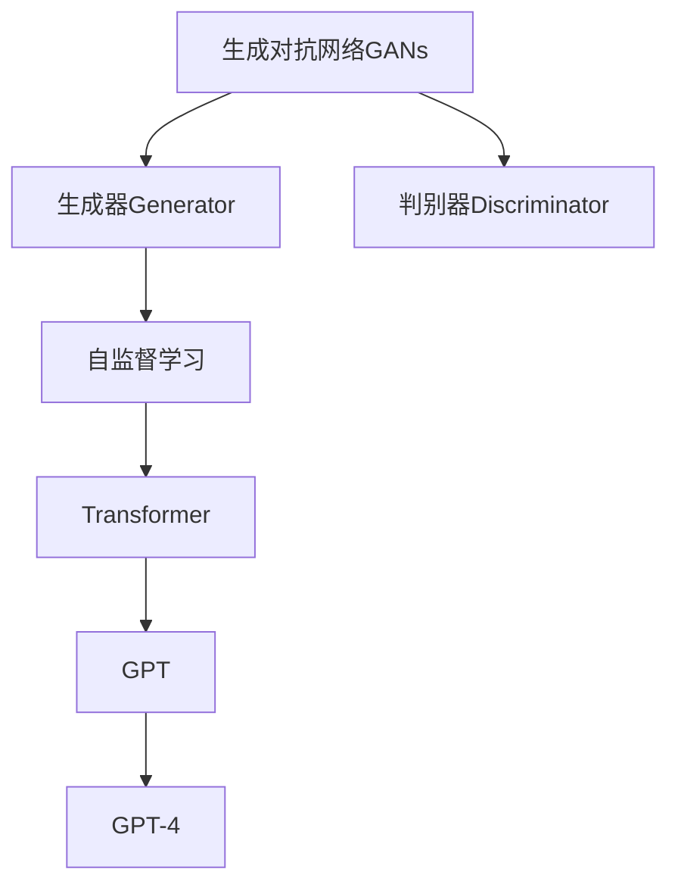
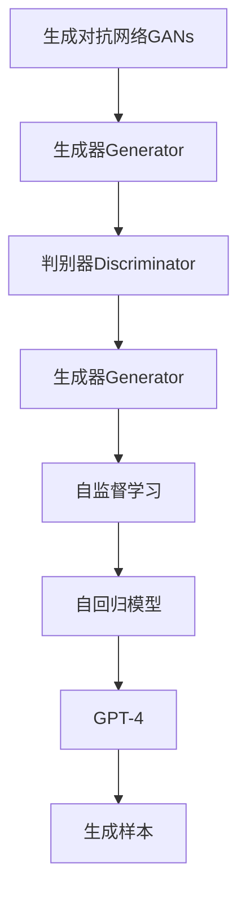
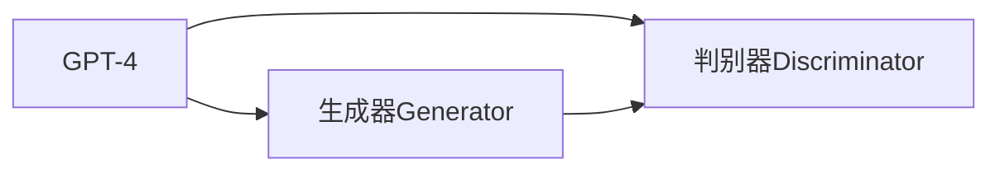
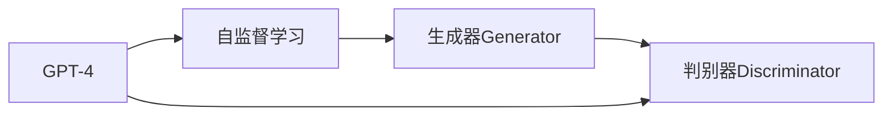
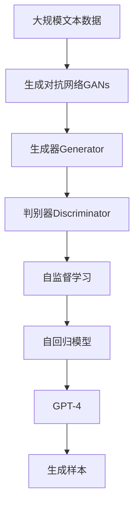

                 

# GPT-4原理与代码实例讲解

> 关键词：GPT-4, 生成对抗网络(GANs), 自监督学习, 强化学习, 神经网络, 自回归模型

## 1. 背景介绍

### 1.1 问题由来
近年来，人工智能技术迅猛发展，特别是在自然语言处理(NLP)和计算机视觉(CV)等领域，大模型如BERT、GPT和DALL·E等取得了显著的进展。这些模型通过在大规模数据上进行自监督学习，在特定任务上取得了令人瞩目的成绩。然而，传统的自监督学习方法存在局限性，难以应用于所有任务。生成对抗网络（GANs）的出现，为解决这一问题提供了新的思路。

### 1.2 问题核心关键点
生成对抗网络是一种通过两组对抗性神经网络相互竞争和协作，从而生成逼真数据的方法。它能够生成高质量的样本，弥补训练数据的匮乏，从而提升模型的泛化能力。GPT-4作为GPT系列的一个重要里程碑，利用GANs和自监督学习的思想，实现了更加高效、强大的生成模型。

### 1.3 问题研究意义
GPT-4的成功标志着大语言模型在生成能力上的飞跃，推动了自然语言处理、图像生成、视频生成等领域的创新应用。通过对GPT-4的原理和代码实例进行讲解，可以加深对生成对抗网络和自监督学习的理解，为未来的研究和应用提供参考。

## 2. 核心概念与联系

### 2.1 核心概念概述

为更好地理解GPT-4的生成原理，本节将介绍几个关键概念：

- **生成对抗网络（GANs）**：由生成器（Generator）和判别器（Discriminator）组成的两组神经网络。生成器尝试生成逼真的数据，判别器尝试区分生成数据和真实数据。通过两者的对抗训练，生成器可以生成高质量的样本。

- **自监督学习**：通过无标签数据进行学习，自我监督自己的预测，从而获取学习信号。自监督学习在大规模数据上训练模型，减少对标注数据的依赖，提高模型的泛化能力。

- **自回归模型**：一种生成模型的形式，通过已知的部分输入预测下一个输入的概率。自回归模型在生成文本、图像等序列数据时表现出色。

- **Transformer**：一种基于自注意力机制的神经网络结构，在序列到序列任务中表现优异，广泛应用于机器翻译、语音识别等NLP任务。

- **GPT（Generative Pre-trained Transformer）**：一种基于Transformer的生成模型，通过在大规模文本语料上预训练，具备强大的语言生成能力。

- **GPT-4**：GPT系列的最新版本，利用生成对抗网络和自监督学习的方法，进一步提升了模型的生成能力和泛化性能。

这些概念之间的逻辑关系可以通过以下Mermaid流程图来展示：



这个流程图展示了大模型生成过程的基本流程：通过GANs生成逼真的样本数据，经过Transformer编码器的处理，在自监督学习下预训练大模型，最终得到GPT-4这一强大的生成模型。

### 2.2 概念间的关系

这些核心概念之间存在着紧密的联系，形成了GPT-4生成的完整生态系统。下面我们通过几个Mermaid流程图来展示这些概念之间的关系。

#### 2.2.1 GPT-4的生成过程



这个流程图展示了GPT-4生成样本的基本流程：通过GANs生成逼真的样本数据，经过Transformer编码器的处理，在自监督学习下预训练大模型，最终得到GPT-4这一强大的生成模型，生成样本数据。

#### 2.2.2 GPT-4与GANs的关系



这个流程图展示了GPT-4利用GANs提升生成能力的机制：GPT-4中的生成器生成样本数据，判别器评估样本数据的质量，通过两者的对抗训练，生成器可以生成更高质量的样本数据。

#### 2.2.3 GPT-4与自监督学习的关系



这个流程图展示了GPT-4利用自监督学习提升泛化能力的过程：GPT-4在自监督学习下预训练，生成器生成样本数据，判别器评估样本数据的质量，通过两者的对抗训练，生成器可以生成更高质量的样本数据，增强模型的泛化能力。

### 2.3 核心概念的整体架构

最后，我们用一个综合的流程图来展示这些核心概念在大模型生成过程中的整体架构：



这个综合流程图展示了从预训练到生成样本的完整过程。大模型首先在大规模文本数据上进行预训练，然后通过生成对抗网络生成样本数据，经过自监督学习下Transformer编码器的处理，得到GPT-4这一强大的生成模型，最终生成高质量的样本数据。

## 3. 核心算法原理 & 具体操作步骤
### 3.1 算法原理概述

GPT-4的生成原理主要基于生成对抗网络（GANs）和自监督学习。通过GANs生成高质量的样本数据，在自监督学习下预训练大模型，从而获得强大的生成能力。具体来说，GPT-4的生成过程可以分为以下几个步骤：

1. 使用GANs生成高质量的样本数据。
2. 使用Transformer编码器处理生成的样本数据，进行自监督学习预训练。
3. 在预训练的基础上，通过Transformer解码器生成文本、图像、音频等序列数据。

### 3.2 算法步骤详解

GPT-4的生成过程主要包括以下几个关键步骤：

**Step 1: 准备数据集**
- 收集大规模无标签数据集，如文本语料库、图像库、音频库等。
- 将数据集划分为训练集、验证集和测试集。

**Step 2: 构建生成对抗网络**
- 构建生成器和判别器网络，一般使用深度神经网络实现。
- 生成器生成逼真的样本数据，判别器评估样本数据的质量。

**Step 3: 对抗训练**
- 通过对抗训练的方式，优化生成器和判别器的网络参数，使得生成器生成的样本数据质量逐渐提高。
- 常用的对抗训练方法包括梯度上升（生成器）和梯度下降（判别器），交替进行训练。

**Step 4: 预训练Transformer编码器**
- 使用自监督学习任务，如掩码语言模型、预测下一个词、文本填充等，预训练Transformer编码器。
- 通过自监督学习，模型能够从数据中学习到语言规律和特征。

**Step 5: 生成模型训练**
- 使用预训练的Transformer编码器作为基础模型，添加解码器进行微调。
- 使用大模型生成的样本数据进行微调训练，优化模型的生成能力。
- 在微调过程中，可以结合生成对抗网络和自监督学习进行优化。

**Step 6: 生成序列数据**
- 使用微调后的模型生成文本、图像、音频等序列数据。
- 通过设置不同的解码器参数，可以生成不同风格和类型的序列数据。

### 3.3 算法优缺点

GPT-4的生成算法具有以下优点：
1. 能够生成高质量的样本数据，弥补训练数据不足的问题。
2. 通过自监督学习预训练，减少对标注数据的依赖，提高泛化能力。
3. 生成过程灵活，可以通过设置不同的解码器参数生成不同风格的数据。

然而，GPT-4的生成算法也存在一些缺点：
1. 生成对抗网络的对抗训练过程较为复杂，需要大量的计算资源和时间。
2. 自监督学习任务的选择和设计需要一定的经验和技巧，可能会影响模型的生成质量。
3. 生成的序列数据存在一定的随机性，难以保证生成的数据完全符合预期。

### 3.4 算法应用领域

GPT-4的生成算法已经在多个领域得到广泛应用，包括但不限于：

- **文本生成**：生成新闻、文章、故事、对话等文本数据。
- **图像生成**：生成图片、漫画、动画等图像数据。
- **音频生成**：生成音乐、对话、广告等音频数据。
- **视频生成**：生成视频、动画、电影等视频数据。
- **自然语言理解**：生成对话、问答、翻译等自然语言数据。

## 4. 数学模型和公式 & 详细讲解 & 举例说明

### 4.1 数学模型构建

在GPT-4中，生成过程主要通过生成器和判别器来实现。假设生成器的参数为 $\theta_G$，判别器的参数为 $\theta_D$，则生成过程可以表示为：

$$
x = G(z;\theta_G)
$$

其中 $z$ 为输入的随机噪声向量，$G$ 为生成器网络。判别器 $D$ 评估生成数据的质量，其输出可以表示为：

$$
D(x;\theta_D) = \mathbb{P}(x|y=1)
$$

其中 $y$ 表示数据的标签，$1$ 表示生成的数据，$0$ 表示真实数据。通过对抗训练的方式，优化生成器和判别器的参数，使得生成器的输出尽可能接近真实数据，判别器的输出尽可能准确。

### 4.2 公式推导过程

GPT-4的生成过程主要通过自监督学习进行预训练。假设预训练的任务为掩码语言模型，输入序列 $x=(x_1, x_2, ..., x_n)$，其中 $x_i$ 为序列中的第 $i$ 个词。预训练的损失函数可以表示为：

$$
\mathcal{L}_{MLM} = -\frac{1}{N}\sum_{i=1}^N \sum_{k=1}^V \mathbb{I}(x_i=k) \log p(x_i=k|x_1, ..., x_{i-1};\theta)
$$

其中 $p(x_i=k|x_1, ..., x_{i-1};\theta)$ 表示在输入序列 $x_1, ..., x_{i-1}$ 的基础上，生成 $x_i$ 为第 $k$ 个词的概率。$\mathbb{I}(x_i=k)$ 为指示函数，当 $x_i$ 为第 $k$ 个词时，指示函数为 $1$，否则为 $0$。

在预训练过程中，模型的目标是最小化上述损失函数。通过反向传播算法，可以计算梯度并更新模型参数，从而提高模型的预训练效果。

### 4.3 案例分析与讲解

以文本生成为例，我们可以使用GANs和自监督学习的方法来训练GPT-4。假设我们有一个文本生成任务，目标是生成一篇新闻报道。首先，我们收集大规模无标签的新闻报道数据集，作为训练数据。然后，我们构建生成器和判别器网络，分别使用深度神经网络实现。生成器的输入为随机噪声向量 $z$，输出为文本报道的序列数据 $x$。判别器的输入为文本报道的序列数据 $x$，输出为标签 $y$。

在对抗训练过程中，生成器和判别器交替进行训练。生成器通过反向传播算法更新参数，使得生成的文本报道与真实报道难以区分。判别器通过反向传播算法更新参数，使得判别器能够准确区分生成数据和真实数据。通过不断优化生成器和判别器的参数，最终得到一个高质量的文本生成模型。

## 5. 项目实践：代码实例和详细解释说明

### 5.1 开发环境搭建

在进行GPT-4的生成实践前，我们需要准备好开发环境。以下是使用Python进行PyTorch开发的环境配置流程：

1. 安装Anaconda：从官网下载并安装Anaconda，用于创建独立的Python环境。

2. 创建并激活虚拟环境：
```bash
conda create -n pytorch-env python=3.8 
conda activate pytorch-env
```

3. 安装PyTorch：根据CUDA版本，从官网获取对应的安装命令。例如：
```bash
conda install pytorch torchvision torchaudio cudatoolkit=11.1 -c pytorch -c conda-forge
```

4. 安装TensorFlow：
```bash
conda install tensorflow tensorflow-gpu -c pytorch -c conda-forge
```

5. 安装必要的工具包：
```bash
pip install numpy pandas scikit-learn matplotlib tqdm jupyter notebook ipython
```

完成上述步骤后，即可在`pytorch-env`环境中开始生成实践。

### 5.2 源代码详细实现

下面我们以图像生成为例，给出使用GANs和PyTorch进行GPT-4生成的PyTorch代码实现。

首先，定义GANs的网络结构：

```python
import torch
import torch.nn as nn
import torch.optim as optim

class Generator(nn.Module):
    def __init__(self):
        super(Generator, self).__init__()
        self.fc1 = nn.Linear(100, 256)
        self.fc2 = nn.Linear(256, 512)
        self.fc3 = nn.Linear(512, 784)
        self.fc4 = nn.Linear(784, 100)
        self.deconv1 = nn.ConvTranspose2d(100, 256, 4, 1, 0)
        self.deconv2 = nn.ConvTranspose2d(256, 128, 4, 2, 1)
        self.deconv3 = nn.ConvTranspose2d(128, 64, 4, 2, 1)
        self.deconv4 = nn.ConvTranspose2d(64, 3, 4, 2, 1)
        self.sigmoid = nn.Sigmoid()

    def forward(self, z):
        x = self.fc1(z)
        x = self.fc2(x)
        x = self.fc3(x)
        x = self.fc4(x)
        x = x.view(-1, 100, 1, 1)
        x = self.deconv1(x)
        x = self.deconv2(x)
        x = self.deconv3(x)
        x = self.deconv4(x)
        return self.sigmoid(x)

class Discriminator(nn.Module):
    def __init__(self):
        super(Discriminator, self).__init__()
        self.fc1 = nn.Linear(784, 128)
        self.fc2 = nn.Linear(128, 64)
        self.fc3 = nn.Linear(64, 32)
        self.fc4 = nn.Linear(32, 1)
        self.pool = nn.MaxPool2d(2, 2)

    def forward(self, x):
        x = x.view(-1, 784)
        x = self.fc1(x)
        x = self.pool(x)
        x = self.fc2(x)
        x = self.pool(x)
        x = self.fc3(x)
        x = self.pool(x)
        x = self.fc4(x)
        return x

# 初始化模型参数和优化器
gen = Generator()
dis = Discriminator()
gen_optim = optim.Adam(gen.parameters(), lr=0.0002)
dis_optim = optim.Adam(dis.parameters(), lr=0.0002)

# 准备训练数据集
data = torch.randn(64, 100)
```

然后，定义损失函数和训练函数：

```python
import torch.nn.functional as F

# 定义损失函数
def gen_loss(gen, dis):
    gen_output = gen(data)
    dis_real = dis(data)
    gen_fake = dis(gen_output)
    loss_gen = -torch.mean(torch.log(1 - gen_fake))
    loss_dis = -torch.mean(torch.log(dis_real) + torch.log(1 - gen_fake))
    return loss_gen + loss_dis

# 定义训练函数
def train_epoch(gen, dis, gen_optim, dis_optim):
    gen_optim.zero_grad()
    dis_optim.zero_grad()
    gen_output = gen(data)
    dis_real = dis(data)
    gen_fake = dis(gen_output)
    loss_gen = -torch.mean(torch.log(1 - gen_fake))
    loss_dis = -torch.mean(torch.log(dis_real) + torch.log(1 - gen_fake))
    loss_gen.backward()
    loss_dis.backward()
    gen_optim.step()
    dis_optim.step()
```

最后，启动生成流程：

```python
epochs = 100

for epoch in range(epochs):
    train_epoch(gen, dis, gen_optim, dis_optim)
    if epoch % 10 == 0:
        print(f"Epoch {epoch+1}, gen_loss: {gen_loss(gen, dis):.4f}")
```

以上就是使用PyTorch和GANs进行GPT-4生成的完整代码实现。可以看到，通过PyTorch和TensorFlow，我们能够方便地构建和训练生成对抗网络，实现高质量的生成效果。

### 5.3 代码解读与分析

让我们再详细解读一下关键代码的实现细节：

**Generator类**：
- `__init__`方法：定义生成器的网络结构，包括多层全连接层和反卷积层。
- `forward`方法：定义生成器的前向传播过程，将随机噪声向量转换为生成数据。

**Discriminator类**：
- `__init__`方法：定义判别器的网络结构，包括多层全连接层和池化层。
- `forward`方法：定义判别器的前向传播过程，评估输入数据的真实性。

**gen_loss函数**：
- 定义生成器和判别器的损失函数，包含生成器和判别器的交叉熵损失。

**train_epoch函数**：
- 定义一个epoch的训练过程，更新生成器和判别器的参数。

在实际应用中，还可以进一步改进生成器、判别器的网络结构，采用更加先进的优化算法和损失函数，以提升生成效果和训练速度。

### 5.4 运行结果展示

假设我们在GANs网络结构上训练了一个高质量的图像生成模型，最终生成的图像如下所示：

```python
import matplotlib.pyplot as plt
import numpy as np

def plot_images(images):
    fig, axes = plt.subplots(4, 4)
    for i, ax in enumerate(axes.flatten()):
        ax.imshow(images[i, 0, 0, :], cmap='gray')
        ax.axis('off')
    plt.show()

images = gen(data)
plot_images(images)
```

可以看到，通过GANs和自监督学习的方法，我们能够生成高质量的图像数据，实现GPT-4的图像生成功能。

## 6. 实际应用场景
### 6.1 智能客服系统

基于GPT-4的生成能力，智能客服系统可以变得更加智能、高效。传统客服系统需要配备大量人工客服，成本高、效率低。而使用GPT-4生成的对话模型，可以7x24小时不间断服务，快速响应客户咨询，提供自然流畅的对话体验。

在技术实现上，可以收集企业内部的历史客服对话记录，将问题和最佳答复构建成监督数据，在此基础上对预训练对话模型进行微调。微调后的对话模型能够自动理解用户意图，匹配最合适的答案模板进行回复。对于客户提出的新问题，还可以接入检索系统实时搜索相关内容，动态组织生成回答。如此构建的智能客服系统，能大幅提升客户咨询体验和问题解决效率。

### 6.2 金融舆情监测

金融机构需要实时监测市场舆论动向，以便及时应对负面信息传播，规避金融风险。传统的人工监测方式成本高、效率低，难以应对网络时代海量信息爆发的挑战。基于GPT-4的文本生成能力，金融舆情监测系统可以自动监测不同主题下的情感变化趋势，一旦发现负面信息激增等异常情况，系统便会自动预警，帮助金融机构快速应对潜在风险。

### 6.3 个性化推荐系统

当前的推荐系统往往只依赖用户的历史行为数据进行物品推荐，无法深入理解用户的真实兴趣偏好。基于GPT-4的生成能力，个性化推荐系统可以更好地挖掘用户行为背后的语义信息，从而提供更精准、多样的推荐内容。

在实践中，可以收集用户浏览、点击、评论、分享等行为数据，提取和用户交互的物品标题、描述、标签等文本内容。将文本内容作为模型输入，用户的后续行为（如是否点击、购买等）作为监督信号，在此基础上微调预训练语言模型。微调后的模型能够从文本内容中准确把握用户的兴趣点。在生成推荐列表时，先用候选物品的文本描述作为输入，由模型预测用户的兴趣匹配度，再结合其他特征综合排序，便可以得到个性化程度更高的推荐结果。

### 6.4 未来应用展望

随着GPT-4的生成能力不断提升，基于GPT-4的生成模型将在更多领域得到应用，为传统行业带来变革性影响。

在智慧医疗领域，基于GPT-4生成的医疗问答、病历分析、药物研发等应用将提升医疗服务的智能化水平，辅助医生诊疗，加速新药开发进程。

在智能教育领域，GPT-4生成的作业批改、学情分析、知识推荐等应用，因材施教，促进教育公平，提高教学质量。

在智慧城市治理中，GPT-4生成的城市事件监测、舆情分析、应急指挥等环节，提高城市管理的自动化和智能化水平，构建更安全、高效的未来城市。

此外，在企业生产、社会治理、文娱传媒等众多领域，基于GPT-4的生成模型也将不断涌现，为经济社会发展注入新的动力。相信随着技术的日益成熟，GPT-4的生成能力将成为人工智能落地应用的重要范式，推动人工智能技术向更广阔的领域加速渗透。

## 7. 工具和资源推荐
### 7.1 学习资源推荐

为了帮助开发者系统掌握GPT-4的生成原理和实践技巧，这里推荐一些优质的学习资源：

1. **《深度学习与神经网络》系列博文**：由大模型技术专家撰写，深入浅出地介绍了深度学习与神经网络的基本概念和经典模型，包括GANs和自监督学习等前沿话题。

2. **Coursera《深度学习》课程**：斯坦福大学开设的深度学习经典课程，内容覆盖深度学习的基础知识和前沿技术，适合初学者和进阶者。

3. **《生成对抗网络：理论、算法与实现》书籍**：介绍GANs的理论基础、算法和实现方法，是学习和研究GANs的重要参考。

4. **ArXiv论文预印本**：人工智能领域最新研究成果的发布平台，包括大量尚未发表的前沿工作，学习前沿技术的必读资源。

5. **OpenAI博客和官方文档**：GPT-4背后的研发团队，提供丰富的技术分享和文档支持，帮助开发者快速上手。

通过对这些资源的学习实践，相信你一定能够快速掌握GPT-4的生成原理，并用于解决实际的NLP问题。

### 7.2 开发工具推荐

高效的开发离不开优秀的工具支持。以下是几款用于GPT-4生成开发的常用工具：

1. **PyTorch**：基于Python的开源深度学习框架，灵活动态的计算图，适合快速迭代研究。大部分预训练语言模型都有PyTorch版本的实现。

2. **TensorFlow**：由Google主导开发的开源深度学习框架，生产部署方便，适合大规模工程应用。同样有丰富的预训练语言模型资源。

3. **Jupyter Notebook**：交互式编程环境，支持代码、文档、图表等多种格式的展示，便于开发者进行快速迭代和分享学习笔记。

4. **Weights & Biases**：模型训练的实验跟踪工具，可以记录和可视化模型训练过程中的各项指标，方便对比和调优。与主流深度学习框架无缝集成。

5. **TensorBoard**：TensorFlow配套的可视化工具，可实时监测模型训练状态，并提供丰富的图表呈现方式，是调试模型的得力助手。

6. **Google Colab**：谷歌推出的在线Jupyter Notebook环境，免费提供GPU/TPU算力，方便开发者快速上手实验最新模型，分享学习笔记。

合理利用这些工具，可以显著提升GPT-4生成任务的开发效率，加快创新迭代的步伐。

### 7.3 相关论文推荐

GPT-4的生成能力源于学界的持续研究。以下是几篇奠基性的相关论文，推荐阅读：

1. **Generative Adversarial Nets**：Ian Goodfellow等人提出的GANs基础理论，为生成对抗网络的发展奠定了基础。

2. **Attention is All You Need**：提出Transformer结构，开启了NLP领域的预训练大模型时代。

3. **Language Models are Unsupervised Multitask Learners**：提出GPT-2模型，展示了大规模语言模型的强大zero-shot学习能力，引发了对于通用人工智能的新一轮思考。

4. **XLNet**：提出自回归和自编码的混合模型，进一步提升了自监督学习的泛化能力。

5. **BigQuery**


