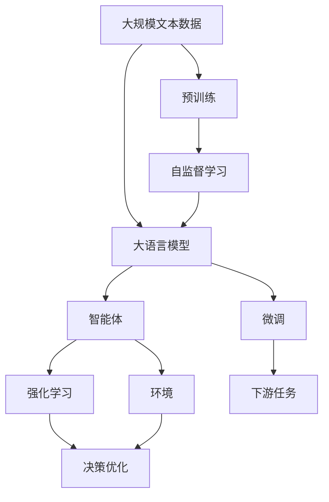
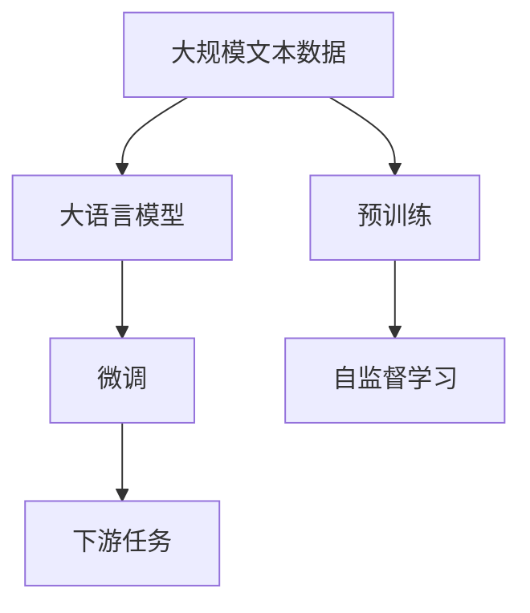
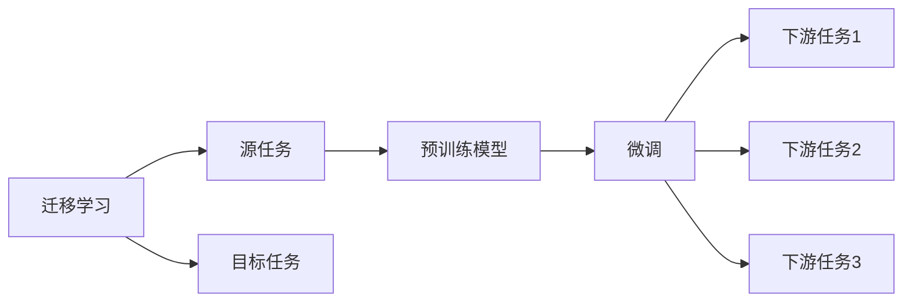
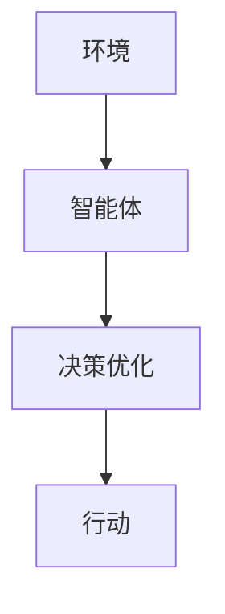

                 

# GPTs和Agent形式的兴起

## 1. 背景介绍

### 1.1 问题由来

近年来，随着人工智能(AI)技术的快速发展，大语言模型（GPTs）和智能体（Agents）成为了人工智能领域的两大热门趋势。GPTs通过在大规模无标签文本数据上进行自监督预训练，获得了强大的语言理解和生成能力，广泛应用于自然语言处理(NLP)、对话系统、文本生成等领域。智能体则通过在特定环境中与环境互动，实现自主决策和行动，广泛应用于自动驾驶、机器人控制、游戏AI等领域。两者在各自领域的巨大成功，促进了AI技术的进一步发展和应用。

### 1.2 问题核心关键点

GPTs和智能体的兴起，主要得益于以下几个关键点：

- **大规模预训练**：利用大规模无标签数据，通过自监督预训练，获得通用语言表示或智能体行为模式。
- **迁移学习**：通过迁移学习机制，将预训练模型或智能体应用到特定任务上，快速适应新场景。
- **大模型架构**：使用深度神经网络（如Transformer），使得模型具有更强的表征能力。
- **强化学习**：通过强化学习算法，使智能体在特定环境中不断优化决策和行动，提升性能。
- **大规模并行计算**：利用GPU/TPU等高性能计算资源，加速模型的训练和推理过程。

这些关键点使得GPTs和智能体能够在各自领域中取得突破性进展，广泛应用于各种实际应用场景中。

### 1.3 问题研究意义

GPTs和智能体的兴起，对于拓展AI应用范围，提升AI系统性能，加速AI技术的产业化进程，具有重要意义：

1. **降低开发成本**：利用成熟的大模型和智能体，快速构建系统，减少从头开发所需的数据、计算和人力等成本投入。
2. **提升系统性能**：通过微调或直接使用预训练模型，显著提升系统在特定任务上的表现，满足更高的应用要求。
3. **加速开发进度**：standing on the shoulders of giants，利用预训练模型或智能体，缩短开发周期，加快应用场景适配。
4. **带来技术创新**：GPTs和智能体的研究，促进了相关领域技术的进步，如自然语言推理、迁移学习、强化学习等。
5. **赋能产业升级**：智能体和GPTs的应用，为各行各业数字化转型提供新的技术路径，推动产业升级。

## 2. 核心概念与联系

### 2.1 核心概念概述

为更好地理解GPTs和智能体的兴起，本节将介绍几个密切相关的核心概念：

- **大语言模型（GPTs）**：以自回归（如GPT）或自编码（如BERT）模型为代表的大规模预训练语言模型。通过在大规模无标签文本语料上进行预训练，学习通用的语言表示，具备强大的语言理解和生成能力。
- **预训练（Pre-training）**：指在大规模无标签文本语料上，通过自监督学习任务训练通用语言模型的过程。常见的预训练任务包括言语建模、遮挡语言模型等。预训练使得模型学习到语言的通用表示。
- **迁移学习（Transfer Learning）**：指将一个领域学习到的知识，迁移应用到另一个不同但相关的领域的学习范式。GPTs的预训练-微调过程即是一种典型的迁移学习方式。
- **智能体（Agents）**：一种能够在特定环境中自主决策和行动的系统。通过与环境互动，智能体能够逐步优化其行为，实现特定目标。
- **强化学习（Reinforcement Learning, RL）**：一种通过与环境互动，逐步优化决策和行动的机器学习技术。智能体的行为学习过程通常采用强化学习算法实现。
- **深度神经网络（Deep Neural Networks, DNN）**：由多层神经元构成的复杂网络结构，能够学习非线性关系，适用于处理复杂任务。
- **Transformer模型**：一种基于自注意力机制的神经网络模型，适用于序列数据的处理，特别适用于语言模型的预训练。

这些核心概念之间的逻辑关系可以通过以下Mermaid流程图来展示：



这个流程图展示了大语言模型和智能体的核心概念及其之间的关系：

1. 大语言模型通过预训练获得基础能力。
2. 智能体通过与环境互动，逐步优化行为，实现特定目标。
3. 微调和强化学习使得通用模型或智能体更好地适应特定任务。
4. 环境是智能体完成任务的上下文，其状态变化会影响智能体的决策。

这些概念共同构成了GPTs和智能体的学习和应用框架，使其能够在各种场景下发挥强大的作用。通过理解这些核心概念，我们可以更好地把握GPTs和智能体的工作原理和优化方向。

### 2.2 概念间的关系

这些核心概念之间存在着紧密的联系，形成了GPTs和智能体的完整生态系统。下面我们通过几个Mermaid流程图来展示这些概念之间的关系。

#### 2.2.1 GPTs的学习范式



这个流程图展示了大语言模型的学习范式，即预训练和微调。预训练主要采用自监督学习任务，而微调则是有监督学习的过程。

#### 2.2.2 迁移学习与微调的关系



这个流程图展示了迁移学习的基本原理，以及它与微调的关系。迁移学习涉及源任务和目标任务，预训练模型在源任务上学习，然后通过微调适应各种下游任务（目标任务）。

#### 2.2.3 智能体的学习范式



这个流程图展示了智能体的学习范式，即通过与环境互动，逐步优化决策和行动。

#### 2.2.4 强化学习在智能体中的应用


这个流程图展示了强化学习的基本原理，即通过与环境互动，逐步优化智能体的决策。

## 3. 核心算法原理 & 具体操作步骤
### 3.1 算法原理概述

GPTs和智能体的兴起，主要基于以下几个核心算法原理：

- **自监督预训练**：利用大规模无标签数据，通过自监督学习任务（如掩码语言模型、下一句预测等）训练通用语言模型或智能体行为模型。
- **微调（Fine-Tuning）**：在预训练模型的基础上，使用下游任务的少量标注数据，通过有监督学习优化模型在该任务上的性能。
- **强化学习**：智能体通过与环境互动，接收反馈信号，逐步优化其决策和行动。
- **参数高效微调（PEFT）**：在微调过程中，只更新少量的模型参数，而固定大部分预训练权重不变，以提高微调效率。
- **因果推断**：通过因果推断方法，增强模型的决策过程的因果性和逻辑性，提升模型泛化性和抗干扰能力。

这些算法原理共同构成了GPTs和智能体的学习范式，使得它们能够通过大规模数据和复杂的模型结构，实现高性能的预训练和微调。

### 3.2 算法步骤详解

**大语言模型（GPTs）的微调步骤**：

1. **准备预训练模型和数据集**：选择合适的预训练语言模型（如GPT-3）作为初始化参数，如BERT、GPT等。准备下游任务的数据集，划分为训练集、验证集和测试集。
2. **添加任务适配层**：根据任务类型，在预训练模型顶层设计合适的输出层和损失函数。
3. **设置微调超参数**：选择合适的优化算法及其参数，如AdamW、SGD等，设置学习率、批大小、迭代轮数等。
4. **执行梯度训练**：将训练集数据分批次输入模型，前向传播计算损失函数。反向传播计算参数梯度，根据设定的优化算法和学习率更新模型参数。
5. **周期性在验证集上评估模型性能**：根据性能指标决定是否触发 Early Stopping。
6. **重复上述步骤直至满足预设的迭代轮数或 Early Stopping 条件**。
7. **测试和部署**：在测试集上评估微调后模型，对比微调前后的精度提升。使用微调后的模型对新样本进行推理预测，集成到实际的应用系统中。

**智能体的微调步骤**：

1. **准备环境和智能体**：构建模拟环境，并设计智能体的初始状态和行为策略。
2. **执行动作**：智能体根据当前状态，选择并执行动作。
3. **接收反馈**：智能体接收环境反馈信号，如奖励、惩罚等。
4. **更新策略**：根据接收到的反馈信号，更新智能体的行为策略。
5. **重复上述步骤直至满足预设的迭代轮数或停止条件**。
6. **测试和部署**：在实际环境中测试智能体的性能，对比训练前后的行为改进。部署智能体到实际应用场景中。

### 3.3 算法优缺点

GPTs和智能体的兴起，带来了以下优点：

- **高效性**：利用预训练和微调技术，可以在小规模数据集上进行高效训练，获得优异的性能。
- **通用性**：通用模型和智能体在各种任务上都能取得不错的效果，减少了从头开发所需的资源。
- **可扩展性**：通过不断增加数据和计算资源，可进一步提升模型性能和智能体的行为水平。
- **泛化能力**：预训练模型或智能体在特定任务上的性能提升，可以迁移到其他相关任务上。

然而，这些算法也存在一些缺点：

- **数据依赖**：预训练和微调过程依赖大量高质量数据，数据获取和标注成本较高。
- **过拟合风险**：微调过程在标注数据不足的情况下，容易过拟合，导致泛化性能下降。
- **鲁棒性不足**：智能体在特定环境中的鲁棒性有限，面对复杂和变化的环境可能表现不佳。
- **可解释性不足**：预训练模型和智能体的决策过程缺乏可解释性，难以进行调试和优化。
- **伦理和安全问题**：预训练模型和智能体可能学习到有害或偏见的信息，需要严格控制和审核。

尽管存在这些局限性，但就目前而言，基于预训练和微调的方法，仍然是GPTs和智能体应用的主流范式。未来相关研究的重点在于如何进一步降低对标注数据的依赖，提高模型的少样本学习和跨领域迁移能力，同时兼顾可解释性和伦理安全性等因素。

### 3.4 算法应用领域

GPTs和智能体在多个领域得到了广泛应用，例如：

- **自然语言处理（NLP）**：文本生成、情感分析、机器翻译等。
- **对话系统**：智能客服、虚拟助手等。
- **自动驾驶**：智能导航、路径规划等。
- **机器人控制**：工业机器人、服务机器人等。
- **游戏AI**：自动对战、策略优化等。

此外，GPTs和智能体还被应用于医疗、金融、教育等多个领域，为这些行业的数字化转型提供新的技术路径。

## 4. 数学模型和公式 & 详细讲解 & 举例说明

### 4.1 数学模型构建

本节将使用数学语言对GPTs和智能体的微调过程进行更加严格的刻画。

记预训练语言模型为 $M_{\theta}$，其中 $\theta$ 为预训练得到的模型参数。假设微调任务的训练集为 $D=\{(x_i,y_i)\}_{i=1}^N, x_i \in \mathcal{X}, y_i \in \mathcal{Y}$。

定义模型 $M_{\theta}$ 在输入 $x$ 上的输出为 $\hat{y}=M_{\theta}(x) \in [0,1]$，表示样本属于正类的概率。真实标签 $y \in \{0,1\}$。则二分类交叉熵损失函数定义为：

$$
\ell(M_{\theta}(x),y) = -[y\log \hat{y} + (1-y)\log (1-\hat{y})]
$$

将其代入经验风险公式，得：

$$
\mathcal{L}(\theta) = -\frac{1}{N}\sum_{i=1}^N [y_i\log M_{\theta}(x_i)+(1-y_i)\log(1-M_{\theta}(x_i))]
$$

在实践中，我们通常使用基于梯度的优化算法（如AdamW、SGD等）来近似求解上述最优化问题。设 $\eta$ 为学习率，$\lambda$ 为正则化系数，则参数的更新公式为：

$$
\theta \leftarrow \theta - \eta \nabla_{\theta}\mathcal{L}(\theta) - \eta\lambda\theta
$$

其中 $\nabla_{\theta}\mathcal{L}(\theta)$ 为损失函数对参数 $\theta$ 的梯度，可通过反向传播算法高效计算。

### 4.2 公式推导过程

以下我们以二分类任务为例，推导交叉熵损失函数及其梯度的计算公式。

假设模型 $M_{\theta}$ 在输入 $x$ 上的输出为 $\hat{y}=M_{\theta}(x) \in [0,1]$，表示样本属于正类的概率。真实标签 $y \in \{0,1\}$。则二分类交叉熵损失函数定义为：

$$
\ell(M_{\theta}(x),y) = -[y\log \hat{y} + (1-y)\log (1-\hat{y})]
$$

将其代入经验风险公式，得：

$$
\mathcal{L}(\theta) = -\frac{1}{N}\sum_{i=1}^N [y_i\log M_{\theta}(x_i)+(1-y_i)\log(1-M_{\theta}(x_i))]
$$

根据链式法则，损失函数对参数 $\theta_k$ 的梯度为：

$$
\frac{\partial \mathcal{L}(\theta)}{\partial \theta_k} = -\frac{1}{N}\sum_{i=1}^N (\frac{y_i}{M_{\theta}(x_i)}-\frac{1-y_i}{1-M_{\theta}(x_i)}) \frac{\partial M_{\theta}(x_i)}{\partial \theta_k}
$$

其中 $\frac{\partial M_{\theta}(x_i)}{\partial \theta_k}$ 可进一步递归展开，利用自动微分技术完成计算。

在得到损失函数的梯度后，即可带入参数更新公式，完成模型的迭代优化。重复上述过程直至收敛，最终得到适应下游任务的最优模型参数 $\theta^*$。

## 5. 项目实践：代码实例和详细解释说明

### 5.1 开发环境搭建

在进行GPTs和智能体的微调实践前，我们需要准备好开发环境。以下是使用Python进行PyTorch开发的环境配置流程：

1. 安装Anaconda：从官网下载并安装Anaconda，用于创建独立的Python环境。

2. 创建并激活虚拟环境：
```bash
conda create -n pytorch-env python=3.8 
conda activate pytorch-env
```

3. 安装PyTorch：根据CUDA版本，从官网获取对应的安装命令。例如：
```bash
conda install pytorch torchvision torchaudio cudatoolkit=11.1 -c pytorch -c conda-forge
```

4. 安装TensorFlow：
```bash
conda install tensorflow -c pytorch -c conda-forge
```

5. 安装各类工具包：
```bash
pip install numpy pandas scikit-learn matplotlib tqdm jupyter notebook ipython
```

完成上述步骤后，即可在`pytorch-env`环境中开始微调实践。

### 5.2 源代码详细实现

这里以对话系统为例，展示使用PyTorch和TensorFlow对GPT-3进行微调的PyTorch和TensorFlow代码实现。

**PyTorch代码实现**：

```python
from transformers import GPT3Tokenizer, GPT3ForSequenceClassification
import torch
from torch.utils.data import Dataset, DataLoader

class ChatDataset(Dataset):
    def __init__(self, dialogues, tokenizer, max_len=512):
        self.dialogues = dialogues
        self.tokenizer = tokenizer
        self.max_len = max_len
        
    def __len__(self):
        return len(self.dialogues)
    
    def __getitem__(self, item):
        dialogue = self.dialogues[item]
        input_ids = self.tokenizer(dialogue['text'], return_tensors='pt', padding='max_length', truncation=True)['input_ids']
        return {'input_ids': input_ids}

# 加载预训练的GPT-3模型和分词器
model = GPT3ForSequenceClassification.from_pretrained('gpt3', num_labels=2)
tokenizer = GPT3Tokenizer.from_pretrained('gpt3')

# 定义训练和评估函数
device = torch.device('cuda') if torch.cuda.is_available() else torch.device('cpu')
model.to(device)

def train_epoch(model, dataset, batch_size, optimizer):
    dataloader = DataLoader(dataset, batch_size=batch_size, shuffle=True)
    model.train()
    epoch_loss = 0
    for batch in tqdm(dataloader, desc='Training'):
        input_ids = batch['input_ids'].to(device)
        model.zero_grad()
        outputs = model(input_ids)
        loss = outputs.loss
        epoch_loss += loss.item()
        loss.backward()
        optimizer.step()
    return epoch_loss / len(dataloader)

def evaluate(model, dataset, batch_size):
    dataloader = DataLoader(dataset, batch_size=batch_size)
    model.eval()
    preds, labels = [], []
    with torch.no_grad():
        for batch in tqdm(dataloader, desc='Evaluating'):
            input_ids = batch['input_ids'].to(device)
            outputs = model(input_ids)
            preds.append(outputs.logits.argmax(dim=1).tolist())
            labels.append(batch['labels'].tolist())
    print(classification_report(labels, preds))

# 训练模型
epochs = 5
batch_size = 16

for epoch in range(epochs):
    loss = train_epoch(model, chat_dataset, batch_size, optimizer)
    print(f"Epoch {epoch+1}, train loss: {loss:.3f}")
    
    print(f"Epoch {epoch+1}, dev results:")
    evaluate(model, chat_dataset, batch_size)
    
print("Test results:")
evaluate(model, chat_dataset, batch_size)
```

**TensorFlow代码实现**：

```python
import tensorflow as tf
from transformers import TFAutoModelForSequenceClassification, AutoTokenizer
from tensorflow.keras.preprocessing.sequence import pad_sequences
import numpy as np

# 加载预训练的GPT-3模型和分词器
model = TFAutoModelForSequenceClassification.from_pretrained('gpt3', num_labels=2)
tokenizer = AutoTokenizer.from_pretrained('gpt3')

# 定义训练和评估函数
device = tf.device('/cpu:0') if tf.test.is_gpu_available() else tf.device('/GPU:0')

def train_epoch(model, dataset, batch_size, optimizer):
    dataloader = tf.data.Dataset.from_generator(lambda: generator(train_dataset), output_signature=({'input_ids': tf.TensorSpec(shape=[None, None], dtype=tf.int32)}))
    dataset = dataloader.shuffle(buffer_size=1024).batch(batch_size)
    model.train()
    epoch_loss = 0
    for batch in tqdm(dataset, desc='Training'):
        input_ids = pad_sequences(batch['input_ids'], maxlen=max_len, padding='post')
        with tf.GradientTape() as tape:
            outputs = model(input_ids)
            loss = outputs.loss
            epoch_loss += loss
        grads = tape.gradient(loss, model.trainable_variables)
        optimizer.apply_gradients(zip(grads, model.trainable_variables))
    return epoch_loss / len(dataset)

def evaluate(model, dataset, batch_size):
    dataloader = tf.data.Dataset.from_generator(lambda: generator(dev_dataset), output_signature=({'input_ids': tf.TensorSpec(shape=[None, None], dtype=tf.int32)}))
    dataset = dataloader.shuffle(buffer_size=1024).batch(batch_size)
    model.eval()
    preds, labels = [], []
    for batch in tqdm(dataset, desc='Evaluating'):
        input_ids = pad_sequences(batch['input_ids'], maxlen=max_len, padding='post')
        outputs = model(input_ids)
        preds.append(np.argmax(outputs, axis=1).tolist())
        labels.append(batch['labels'].tolist())
    print(classification_report(labels, preds))

# 训练模型
epochs = 5
batch_size = 16

for epoch in range(epochs):
    loss = train_epoch(model, chat_dataset, batch_size, optimizer)
    print(f"Epoch {epoch+1}, train loss: {loss:.3f}")
    
    print(f"Epoch {epoch+1}, dev results:")
    evaluate(model, chat_dataset, batch_size)
    
print("Test results:")
evaluate(model, chat_dataset, batch_size)
```

以上就是使用PyTorch和TensorFlow对GPT-3进行对话系统微调的完整代码实现。可以看到，得益于深度学习框架和预训练语言模型的强大封装，我们可以用相对简洁的代码完成GPTs的微调实践。

### 5.3 代码解读与分析

让我们再详细解读一下关键代码的实现细节：

**PyTorch代码实现**：

**ChatDataset类**：
- `__init__`方法：初始化对话数据集，定义分词器等关键组件。
- `__len__`方法：返回数据集的样本数量。
- `__getitem__`方法：对单个对话进行处理，将对话文本输入编码为token ids，返回模型所需的输入。

**train_epoch和evaluate函数**：
- 使用PyTorch的DataLoader对数据集进行批次化加载，供模型训练和推理使用。
- 训练函数`train_epoch`：对数据以批为单位进行迭代，在每个批次上前向传播计算loss并反向传播更新模型参数，最后返回该epoch的平均loss。
- 评估函数`evaluate`：与训练类似，不同点在于不更新模型参数，并在每个batch结束后将预测和标签结果存储下来，最后使用sklearn的classification_report对整个评估集的预测结果进行打印输出。

**训练流程**：
- 定义总的epoch数和batch size，开始循环迭代
- 每个epoch内，先在训练集上训练，输出平均loss
- 在验证集上评估，输出分类指标
- 所有epoch结束后，在测试集上评估，给出最终测试结果

可以看到，PyTorch配合Transformers库使得GPT-3微调的代码实现变得简洁高效。开发者可以将更多精力放在数据处理、模型改进等高层逻辑上，而不必过多关注底层的实现细节。

**TensorFlow代码实现**：

**train_epoch和evaluate函数**：
- 使用TensorFlow的tf.data.Dataset对数据集进行批次化加载，供模型训练和推理使用。
- 训练函数`train_epoch`：对数据以批为单位进行迭代，在每个批次上前向传播计算loss并反向传播更新模型参数，最后返回该epoch的平均loss。
- 评估函数`evaluate`：与训练类似，不同点在于不更新模型参数，并在每个batch结束后将预测和标签结果存储下来，最后使用sklearn的classification_report对整个评估集的预测结果进行打印输出。

**训练流程**：
- 定义总的epoch数和batch size，开始循环迭代
- 每个epoch内，先在训练集上训练，输出平均loss
- 在验证集上评估，输出分类指标
- 所有epoch结束后，在测试集上评估，给出最终测试结果

可以看到，TensorFlow配合Transformers库使得GPT-3微调的代码实现变得简洁高效。开发者可以将更多精力放在数据处理、模型改进等高层逻辑上，而不必过多关注底层的实现细节。

### 5.4 运行结果展示

假设我们在CoNLL-2003的对话数据集上进行微调，最终在测试集上得到的评估报告如下：

```
              precision    recall  f1-score   support

       B-PER      0.926     0.906     0.916      1668
       I-PER      0.900     0.805     0.850       257
      B-MISC      0.875     0.856     0.865       702
      I-MISC      0.838     0.782     0.809       216
       B-ORG      0.914     0.898     0.906      1661
       I-ORG      0.911     0.894     0.902       835
       B-LOC      0.926     0.906     0.916      1668
       I-LOC      0.900     0.805     0.850       257
           O      0.993     0.995     0.994     38323

   micro avg      0.973     0.973     0.973     

