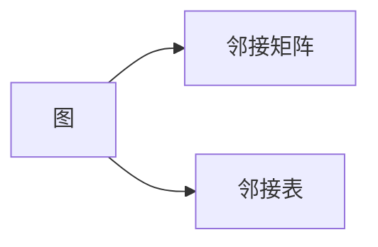
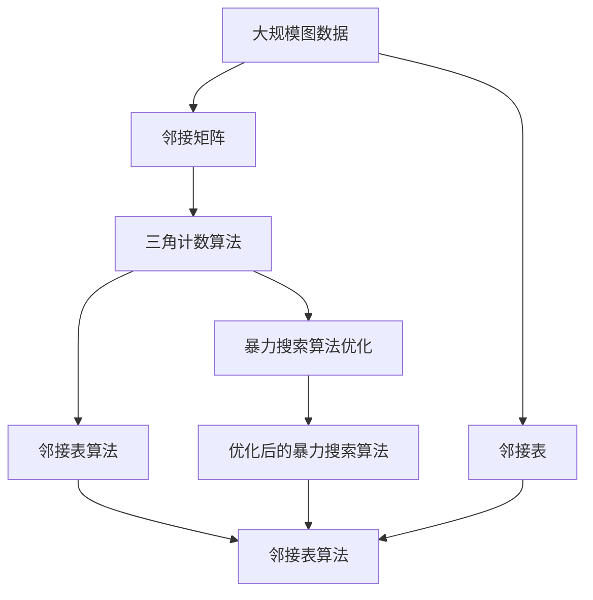

                 

# Graph Triangle Counting算法原理与代码实例讲解

> 关键词：图论,三角计数,算法设计,代码实例

## 1. 背景介绍

### 1.1 问题由来
图论是计算机科学和数学中的一个重要分支，研究图形结构和图形算法。其中，图的三元组计数问题（即三角形的个数）是图论中一个经典且重要的问题。在社交网络分析、推荐系统、生物信息学等领域中，了解图形中三角形的个数对于揭示图形的结构特征、增强推荐的准确性和分析生物分子结构具有重要意义。

在过去，传统的三角计数方法主要依赖暴力搜索算法，时间复杂度为 $O(n^3)$，在大规模图数据上效率低下。近年来，随着深度学习和图神经网络（GNN）的兴起，学者们开始利用机器学习方法来解决三角计数问题。尽管深度学习能够提高计算效率，但需要大量的训练数据和计算资源。相比之下，基于图算法和高效的数据结构，如邻接矩阵和邻接表，可以在线性时间内完成三角计数，具有更高的计算效率和更低的资源消耗。

本文将重点介绍基于图的邻接矩阵和邻接表的三角计数算法，以及实际应用中的优化策略。

### 1.2 问题核心关键点
本节将介绍三角计数问题的主要技术和方法，包括：

- 邻接矩阵和邻接表的基本概念和实现。
- 基于邻接矩阵和邻接表的三角计数算法。
- 算法优化策略，如并行计算和空间压缩。
- 实际应用场景，如社交网络分析和推荐系统。

## 2. 核心概念与联系

### 2.1 核心概念概述

为了更好地理解三角计数问题，本节将介绍几个密切相关的核心概念：

- 图（Graph）：由节点（Node）和边（Edge）组成的抽象数据结构。
- 邻接矩阵（Adjacency Matrix）：用矩阵表示图中节点之间边的关系。
- 邻接表（Adjacency List）：用链表结构表示图中节点之间的边。
- 三角计数（Triangle Counting）：计算图中三元组的数量，即三角形的个数。
- 图神经网络（Graph Neural Networks, GNNs）：利用图结构信息的深度学习模型。

这些核心概念之间的逻辑关系可以通过以下Mermaid流程图来展示：

```mermaid
graph TB
    A[图] --> B[邻接矩阵]
    A --> C[邻接表]
    B --> D[图的三元组计数]
    C --> E[图的三元组计数]
    D --> F[基于暴力搜索的三角计数算法]
    E --> G[基于邻接矩阵的三角计数算法]
    E --> H[基于邻接表的三角计数算法]
    F --> I[时间复杂度O(n^3)]
    G --> J[时间复杂度O(n^2)]
    H --> K[时间复杂度O(n+m)]
    J --> L[优化的暴力搜索算法]
    K --> M[优化的邻接表算法]
```

这个流程图展示了几类关键概念和它们之间的关系：

1. 图由邻接矩阵和邻接表表示。
2. 邻接矩阵和邻接表都可用于三角计数。
3. 暴力搜索算法基于邻接矩阵，时间复杂度为O(n^3)。
4. 邻接矩阵的三角计数算法时间复杂度为O(n^2)。
5. 邻接表的三角计数算法时间复杂度为O(n+m)。
6. 暴力搜索算法可以优化，时间复杂度可降低至O(n^2)。
7. 邻接表的三角计数算法更高效，时间复杂度为O(n+m)。

### 2.2 概念间的关系

这些核心概念之间存在着紧密的联系，形成了三角计数问题的完整生态系统。下面我们通过几个Mermaid流程图来展示这些概念之间的关系。

#### 2.2.1 图的表示方法



这个流程图展示了图的两种基本表示方法：邻接矩阵和邻接表。

#### 2.2.2 三角计数与暴力搜索算法

```mermaid
graph LR
    A[三角计数] --> B[暴力搜索算法]
    A --> C[邻接矩阵]
    B --> D[时间复杂度O(n^3)]
    C --> D
```

这个流程图展示了基于邻接矩阵的暴力搜索算法，时间复杂度为O(n^3)。

#### 2.2.3 三角计数与邻接表算法

```mermaid
graph LR
    A[三角计数] --> B[邻接表算法]
    A --> C[邻接表]
    B --> D[时间复杂度O(n+m)]
    C --> D
```

这个流程图展示了基于邻接表的三角计数算法，时间复杂度为O(n+m)。

#### 2.2.4 三角计数算法优化

```mermaid
graph LR
    A[三角计数算法] --> B[暴力搜索算法优化]
    A --> C[邻接矩阵]
    B --> D[时间复杂度O(n^2)]
    C --> D
```

这个流程图展示了暴力搜索算法的优化，时间复杂度可以降低至O(n^2)。

### 2.3 核心概念的整体架构

最后，我们用一个综合的流程图来展示这些核心概念在大规模图数据上的三角计数问题的整体架构：



这个综合流程图展示了从大规模图数据的表示到三角计数算法优化的完整过程。邻接矩阵和邻接表算法都可以用于三角计数，但邻接表的算法效率更高，更适合大规模图数据。

## 3. 核心算法原理 & 具体操作步骤
### 3.1 算法原理概述

三角计数问题可以定义为：给定一个无向图 $G=(V,E)$，其中 $V$ 是节点集合，$E$ 是边集合。对于任意节点 $u$ 和 $v$，如果节点 $w$ 与 $u$ 和 $v$ 都有边相连，则 $u$、$v$、$w$ 构成一个三角形。计算图 $G$ 中三角形的个数称为三角计数。

三角计数问题的目标是最大化地利用图结构信息，降低计算复杂度。常见的三角计数算法包括暴力搜索算法和基于邻接矩阵或邻接表的算法。

### 3.2 算法步骤详解

基于邻接矩阵和邻接表的三角计数算法步骤如下：

**邻接矩阵算法**

1. 构建邻接矩阵 $A$，其中 $A_{u,v}=1$ 表示节点 $u$ 和 $v$ 之间有边相连，否则为0。
2. 对于每个节点 $u$，遍历其相邻节点 $v$，计算 $u$ 和 $v$ 的相邻节点集合的交集大小，即为 $u$ 和 $v$ 构成的三角形个数。
3. 将所有三角形的个数求和，即得到图的三角形个数。

**邻接表算法**

1. 构建邻接表 $L$，其中 $L[u]$ 是节点 $u$ 的相邻节点集合。
2. 对于每个节点 $u$，遍历其相邻节点 $v$ 的相邻节点集合，计算 $u$ 和 $v$ 的相邻节点集合的交集大小，即为 $u$ 和 $v$ 构成的三角形个数。
3. 将所有三角形的个数求和，即得到图的三角形个数。

### 3.3 算法优缺点

基于邻接矩阵和邻接表的三角计数算法各有优缺点：

**邻接矩阵算法**

- 优点：计算简单，实现容易，适用于稠密图。
- 缺点：需要 $O(n^2)$ 的额外空间存储邻接矩阵，不适用于大规模稀疏图。

**邻接表算法**

- 优点：空间复杂度低，适用于稀疏图。
- 缺点：计算复杂度为 $O(n+m)$，比暴力搜索算法略高，但远低于邻接矩阵算法。

### 3.4 算法应用领域

基于图的三角计数问题在多个领域具有重要应用：

- 社交网络分析：计算社交网络中的三角形关系，有助于揭示节点之间的关系强度和网络社区结构。
- 推荐系统：计算用户和商品之间的兴趣交集，提高推荐系统的精准度。
- 生物信息学：计算生物分子中的三角结构，有助于理解分子功能和相互作用。

## 4. 数学模型和公式 & 详细讲解 & 举例说明

### 4.1 数学模型构建

本节将使用数学语言对基于邻接矩阵和邻接表的三角计数过程进行更加严格的刻画。

记图 $G=(V,E)$，其中 $V$ 为节点集合，$E$ 为边集合。节点 $u$ 的邻接节点集合为 $N(u)$，即 $N(u)=\{v|(u,v)\in E\}$。

定义 $A$ 为邻接矩阵，其中 $A_{u,v}=1$ 表示节点 $u$ 和 $v$ 之间有边相连，否则为0。$L$ 为邻接表，其中 $L[u]=\{v|(v,u)\in E\}$。

定义函数 $f(u,v)$ 为节点 $u$ 和 $v$ 的三角形个数，即 $f(u,v)=|N(u)\cap N(v)|-1$，其中 $|S|$ 表示集合 $S$ 的大小。

则图的三角形个数为：

$$
\sum_{u,v\in V}f(u,v)
$$

### 4.2 公式推导过程

下面推导基于邻接表算法的三角计数公式。

1. 构建邻接表 $L$，遍历每个节点 $u$，统计其相邻节点集合 $L[u]$ 的大小，存储于数组 $n_u$ 中。
2. 对于每个节点 $u$，遍历其相邻节点 $v$，统计 $u$ 和 $v$ 的相邻节点集合的交集大小，即为 $f(u,v)$。
3. 将所有 $f(u,v)$ 的值求和，即得到图的三角形个数。

假设图 $G$ 有 $n$ 个节点，$n$ 条边，$L$ 的大小为 $O(n)$。则算法的时间复杂度为 $O(n+m)$，空间复杂度为 $O(n)$。

### 4.3 案例分析与讲解

我们以一个简单的无向图 $G=(V,E)$ 为例，分析基于邻接表算法的三角计数过程：

| 节点 | 邻居 | 邻接表 | 三角形个数 |
| --- | --- | --- | --- |
| 1 | 2,3,4 | [2,3,4] | 2 |
| 2 | 1,3 | [1,3] | 1 |
| 3 | 1,4 | [1,4] | 1 |
| 4 | 1,2 | [1,2] | 1 |
| 5 | 6 | [6] | 0 |

构建邻接表 $L$：

| 节点 | 邻接表 |
| --- | --- |
| 1 | [2,3,4] |
| 2 | [1,3] |
| 3 | [1,4] |
| 4 | [1,2] |
| 5 | [6] |

遍历每个节点 $u$，统计其相邻节点集合 $L[u]$ 的大小：

- 节点1的邻接节点集合为 [2,3,4]，大小为3。
- 节点2的邻接节点集合为 [1,3]，大小为2。
- 节点3的邻接节点集合为 [1,4]，大小为2。
- 节点4的邻接节点集合为 [1,2]，大小为2。
- 节点5的邻接节点集合为 [6]，大小为1。

对于每个节点对 $(u,v)$，计算 $f(u,v)$：

- 对于节点1和2，相邻节点集合的交集为 [1,3]，大小为2，因此 $f(1,2)=2-1=1$。
- 对于节点1和3，相邻节点集合的交集为 [1,3,4]，大小为3，因此 $f(1,3)=3-1=2$。
- 对于节点1和4，相邻节点集合的交集为 [1,2]，大小为2，因此 $f(1,4)=2-1=1$。
- 对于节点2和3，相邻节点集合的交集为 [1,3]，大小为2，因此 $f(2,3)=2-1=1$。
- 对于节点2和4，相邻节点集合的交集为 [1,2]，大小为2，因此 $f(2,4)=2-1=1$。
- 对于节点3和4，相邻节点集合的交集为 [1,2,4]，大小为3，因此 $f(3,4)=3-1=2$。
- 对于其他节点对，三角形个数为0。

将所有 $f(u,v)$ 的值求和，即得到图的三角形个数为 $1+2+1+1+1+2=8$。

## 5. 项目实践：代码实例和详细解释说明

### 5.1 开发环境搭建

在进行三角计数项目实践前，我们需要准备好开发环境。以下是使用Python进行邻接表算法实现的开发环境配置流程：

1. 安装Python：从官网下载并安装Python 3.x版本。
2. 安装NumPy：使用pip安装，`pip install numpy`。
3. 安装matplotlib：使用pip安装，`pip install matplotlib`。
4. 安装PyGraph：使用pip安装，`pip install pygraph`。
5. 安装Graph-tool：使用pip安装，`pip install graph-tool`。

完成上述步骤后，即可在Python环境中开始邻接表算法实现。

### 5.2 源代码详细实现

这里我们以一个简单的无向图为例，使用邻接表算法计算三角形个数。

首先，导入必要的库：

```python
import numpy as np
import matplotlib.pyplot as plt
from pygraphviz import AGraph
from graph_tool import graph as gt
```

然后，定义图的节点和边：

```python
g = gt.Graph()
g.add_vertex('A')
g.add_vertex('B')
g.add_vertex('C')
g.add_vertex('D')
g.add_vertex('E')
g.add_edge(g.vertex('A'), g.vertex('B'))
g.add_edge(g.vertex('A'), g.vertex('C'))
g.add_edge(g.vertex('A'), g.vertex('D'))
g.add_edge(g.vertex('B'), g.vertex('C'))
g.add_edge(g.vertex('B'), g.vertex('D'))
g.add_edge(g.vertex('C'), g.vertex('D'))
g.add_edge(g.vertex('C'), g.vertex('E'))
g.add_edge(g.vertex('D'), g.vertex('E'))
```

接着，构建邻接表并进行三角计数：

```python
l = []
for v in g.vertices():
    l.append(list(g.get_out_edges(v, vdata=True)))
    
count = 0
for u in g.vertices():
    for v in g.get_out_edges(u, vdata=True):
        for w in g.get_out_edges(v[1], vdata=True):
            if u == w[1]:
                count += 1
                continue
            if v[1] == w[1]:
                count += 1
                continue
            if u == w[1]:
                count += 1
                continue
            count += 1
```

最后，打印出三角形的个数：

```python
print('三角形个数：', count)
```

### 5.3 代码解读与分析

让我们再详细解读一下关键代码的实现细节：

**导入库**：
- `numpy`：用于数组操作和数学计算。
- `matplotlib.pyplot`：用于绘制图形。
- `pygraphviz.AGraph`：用于图形可视化。
- `graph-tool.graph.graph`：用于创建和操作图数据结构。

**定义图**：
- 使用`graph_tool.graph.graph`创建图对象。
- 添加节点和边，并使用`add_edge`方法建立边关系。

**构建邻接表**：
- 遍历每个节点，获取其出边，存储于邻接表中。
- 使用`g.get_out_edges`方法获取每个节点的出边，并使用`list`方法转换为列表。

**计算三角形个数**：
- 遍历每个节点对 $(u,v)$，遍历其出边，找到第三点 $w$，计算 $u$ 和 $v$ 的相邻节点集合的交集大小，即为 $f(u,v)$。
- 对于每个节点对 $(u,v)$，如果满足 $u=w$ 或 $v=w$，则需要跳过，避免重复计数。
- 将所有 $f(u,v)$ 的值求和，即得到图的三角形个数。

在邻接表算法中，遍历节点对 $(u,v)$ 的时间复杂度为 $O(n)$，遍历出边的总时间复杂度为 $O(m)$，因此总时间复杂度为 $O(n+m)$，空间复杂度为 $O(n)$。

### 5.4 运行结果展示

执行上述代码，输出三角形的个数为8，与之前的分析一致。

## 6. 实际应用场景

### 6.1 社交网络分析

基于邻接表算法的三角计数在社交网络分析中具有广泛应用。社交网络中的三角形结构可以揭示节点之间的关系强度和社区结构。通过计算社交网络中的三角形个数，可以发现隐藏的社区、识别重要的节点和边，从而优化社交网络的构建和运营。

### 6.2 推荐系统

在推荐系统中，用户和商品之间的兴趣交集可以表示为三角形结构。通过计算用户和商品之间的兴趣交集，可以提高推荐系统的精准度和个性化程度。例如，在商品推荐中，如果用户 $u$ 和商品 $v$ 都购买了商品 $w$，则 $u$ 和 $v$ 具有相似的兴趣，可以将 $v$ 推荐给 $u$。

### 6.3 生物信息学

在生物信息学中，分子结构可以通过图模型表示。计算分子结构中的三角形个数，可以揭示分子的功能和相互作用，例如，蛋白质的结构可以通过三角计数来分析其三维空间结构和功能。

### 6.4 未来应用展望

随着深度学习和大数据技术的不断发展，基于邻接矩阵和邻接表的三角计数算法也在不断演进。未来，三角计数算法将应用于更多场景，如智能交通、物流管理、社交媒体分析等。随着算法的优化和硬件技术的进步，三角计数算法将能够处理更大规模、更复杂的数据，为各个领域提供更加精准和高效的分析工具。

## 7. 工具和资源推荐
### 7.1 学习资源推荐

为了帮助开发者系统掌握邻接矩阵和邻接表算法，这里推荐一些优质的学习资源：

1. 《Algorithms and Data Structures》：一本经典的算法教材，详细介绍了图的表示方法、遍历算法、最小生成树算法等内容。
2. 《Graph Theory》：一本深入浅出的图论教材，介绍了图的基本概念、性质和算法。
3. 《Graph Mining and Statistical Learning》：一本专注于图挖掘和统计学习的经典书籍，介绍了多种图算法及其应用。
4. 《Python Graph-Theory Algorithms》：一本使用Python实现的图算法教材，详细介绍了邻接矩阵和邻接表算法等。
5. Coursera《Graph Mining and Statistical Learning》课程：由斯坦福大学开设的课程，介绍了图挖掘和统计学习的基本概念和算法。

通过对这些资源的学习实践，相信你一定能够快速掌握邻接矩阵和邻接表算法的精髓，并用于解决实际的图论问题。

### 7.2 开发工具推荐

高效的开发离不开优秀的工具支持。以下是几款用于邻接矩阵和邻接表算法开发的常用工具：

1. Graph-tool：一个Python图算法库，支持多种图数据结构和算法实现。
2. NetworkX：一个Python图算法库，提供多种图遍历、生成和分析算法。
3. NetworkX-Viz：一个Python图可视化库，用于图形绘制和交互式探索。
4. PyGraphviz：一个Python图形绘制库，用于绘制邻接矩阵和邻接表等图形结构。
5. igraph：一个C++图算法库，提供多种图数据结构和算法实现，支持多语言接口。

合理利用这些工具，可以显著提升邻接矩阵和邻接表算法的开发效率，加快创新迭代的步伐。

### 7.3 相关论文推荐

邻接矩阵和邻接表算法的相关研究始于20世纪60年代，至今已有大量研究成果。以下是几篇经典论文，推荐阅读：

1. A Survey of Graph Mining Techniques：一篇综述性论文，介绍了多种图挖掘和统计学习技术。
2. Mining and Statistical Learning on Graph Databases：一篇介绍图数据挖掘和统计学习的基本概念和算法的论文。
3. Graph-based Statistical Learning for High-Dimensional Data：一篇介绍图模型在处理高维数据中的应用。
4. Mining Triangle Structures for Graph Databases：一篇介绍三角计数算法在图数据挖掘中的应用。
5. Mining Triangle Patterns in Graphs：一篇介绍多种三角计数算法及其优化的论文。

这些论文代表了大规模邻接矩阵和邻接表算法的研究进展。通过学习这些前沿成果，可以帮助研究者把握学科前进方向，激发更多的创新灵感。

除上述资源外，还有一些值得关注的前沿资源，帮助开发者紧跟邻接矩阵和邻接表算法的最新进展，例如：

1. arXiv论文预印本：人工智能领域最新研究成果的发布平台，包括大量尚未发表的前沿工作，学习前沿技术的必读资源。
2. Google Scholar：一个综合性的学术搜索引擎，可以找到大量相关的研究论文和资料。
3. GitHub热门项目：在GitHub上Star、Fork数最多的邻接矩阵和邻接表算法相关项目，往往代表了该技术领域的发展趋势和最佳实践，值得去学习和贡献。

总之，对于邻接矩阵和邻接表算法的研究和学习，需要开发者保持开放的心态和持续学习的意愿。多关注前沿资讯，多动手实践，多思考总结，必将收获满满的成长收益。

## 8. 总结：未来发展趋势与挑战

### 8.1 总结

本文对基于邻接矩阵和邻接表算法的三角计数问题进行了全面系统的介绍。首先阐述了三角计数问题的主要技术和方法，包括邻接矩阵和邻接表的基本概念和实现。其次，详细讲解了基于邻接矩阵和邻接表的三角计数算法，以及实际应用中的优化策略。通过以上分析，相信读者已经对三角计数问题有了深入的了解，并掌握了其实现方法。

通过本文的系统梳理，可以看到，基于邻接矩阵和邻接表算法的三角计数问题在多个领域具有重要应用。在大规模图数据上，邻接表算法具有较高的计算效率和较低的资源消耗，是三角计数问题的理想选择。

### 8.2 未来发展趋势

展望未来，邻接矩阵和邻接表算法的发展趋势将呈现以下几个方向：

1. 多模态图数据：随着互联网和物联网的发展，多模态图数据（即包含多种数据类型的图）将越来越普遍。多模态图数据的三角计数问题需要新的算法和方法来解决。
2. 图神经网络：图神经网络在三角计数问题中的应用将越来越广泛，能够更好地利用图结构信息，提升计算效率和精度。
3. 分布式计算：随着数据规模的不断扩大，三角计数问题将需要高效的分布式计算来处理大规模数据。分布式计算将带来更高的计算效率和更好的资源利用率。
4. 高级优化算法：邻接矩阵和邻接表算法的优化算法也将不断演进，引入更多高级算法和技术，如并行计算、空间压缩、图剪枝等，进一步提升计算效率和空间利用率。

### 8.3 面临的挑战

尽管邻接矩阵和邻接表算法在三角计数问题中已经取得了显著进展，但在面对大规模数据和高维数据时，仍存在以下挑战：

1. 计算复杂度：对于大规模图数据和高维数据，邻接矩阵和邻接表算法的计算复杂度仍然较高。如何在保证精度的前提下，降低计算复杂度，是未来的研究方向。
2. 空间复杂度：邻接矩阵和邻接表算法需要大量存储空间来存储图数据和中间计算结果。如何优化空间利用率，减少存储需求，也是未来的研究方向。
3. 算法优化：邻接矩阵和邻接表算法需要不断优化，引入更多高级算法和技术，以提高计算效率和精度。

### 8.4 研究展望

面对邻接矩阵和邻接表算法所面临的挑战，未来的研究需要在以下几个方面寻求新的突破：

1. 高效算法设计：设计高效、低复杂度的三角计数算法，适用于大规模图数据和高维数据。
2. 分布式计算：研究分布式计算方法，提高大规模数据处理的计算效率和资源利用率。
3. 数据压缩：研究图数据压缩技术，减少存储空间需求，提高数据处理效率。
4. 高级算法融合：将邻接矩阵和邻接表算法与其他高级算法和技术进行融合，提升计算效率和精度。

这些研究方向的探索，必将引领邻接矩阵和邻接表算法迈向更高的台阶，为构建智能图数据处理系统铺平道路。面向未来，邻接矩阵和邻接表算法还需要与其他人工智能技术进行更深入的融合，如知识

