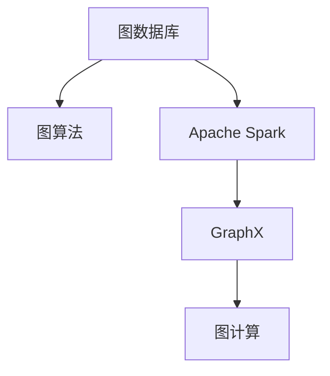
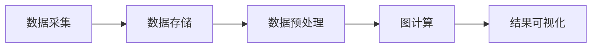
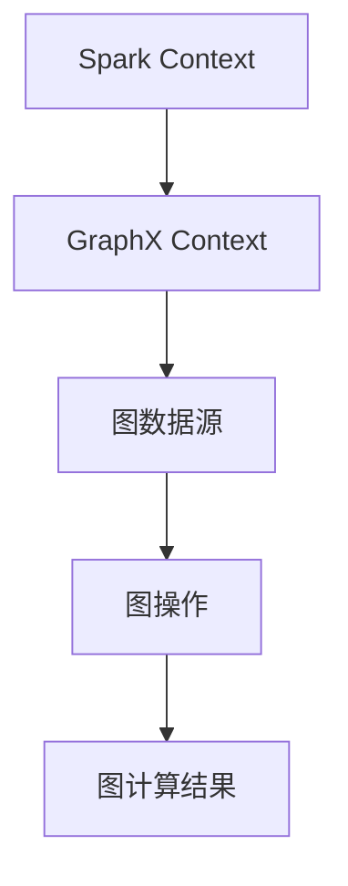
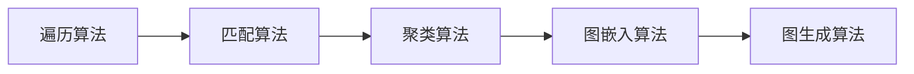
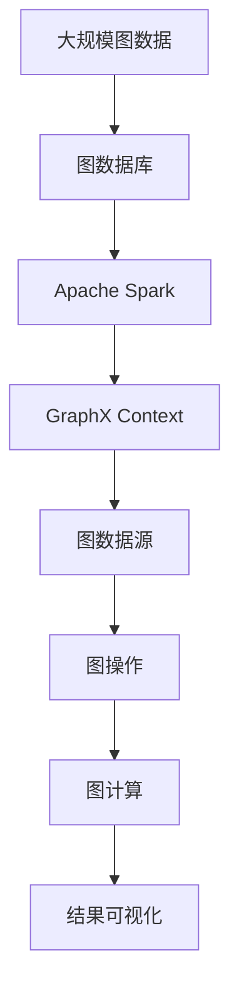

                 

# GraphX原理与代码实例讲解

> 关键词：图数据库,图算法,Apache Spark GraphX,图计算,深度学习,机器学习

## 1. 背景介绍

### 1.1 问题由来

在现代数据科学中，图结构数据扮演着越来越重要的角色。它们不仅仅是网络数据，还包括社交网络、知识图谱、分子网络、交通网络等各种复杂结构数据。对这些图结构数据的处理与分析，传统的数据科学框架无法胜任，需要引入专门的图数据处理和分析技术。

在这一领域，Apache GraphX是一个具有广泛影响力的开源图计算框架，在学术界与工业界都得到了广泛的应用。GraphX基于Apache Spark，能够在分布式环境下高效地处理大规模图数据。它支持多种图算法，适用于各种类型的图结构数据，如社交网络、知识图谱、生物网络等。

### 1.2 问题核心关键点

GraphX的核心思想是将图结构数据映射到高维矩阵，然后在Spark集群上进行分布式图计算。这种计算框架将复杂的图计算任务分发到多台计算节点上，通过迭代计算实现高效率的图算法。GraphX的主要特点包括：

- 高性能计算：利用Spark的分布式计算能力，实现高效的图计算任务。
- 灵活性：支持多种图算法，适用于不同类型的图结构数据。
- 可扩展性：能够处理海量图数据，满足大规模图计算需求。
- 丰富的API：提供了丰富的图API和操作，支持图数据的复杂查询和计算。

### 1.3 问题研究意义

研究GraphX图计算框架，对于推动图结构数据的深度挖掘与应用，提高数据处理的效率和准确性，加速图计算技术的产业化进程，具有重要意义：

1. 降低数据处理成本。利用分布式图计算，可以显著降低大规模图数据处理所需的时间和计算资源。
2. 提高数据处理精度。GraphX框架的迭代计算机制，可以保证图算法的高精度和高鲁棒性。
3. 促进图计算技术发展。GraphX框架的应用与研究，有助于推动图计算技术的不断创新和完善。
4. 赋能图数据应用。在社交网络分析、知识图谱构建、生物网络挖掘等诸多领域，GraphX提供了强大的数据处理能力。
5. 提供开源技术支持。通过开源图计算框架，让更多人能够接触和学习图数据处理技术，促进技术传播和产业应用。

## 2. 核心概念与联系

### 2.1 核心概念概述

为了更好地理解GraphX图计算框架，本节将介绍几个密切相关的核心概念：

- 图数据库：用于存储和管理图结构数据的专用数据库，能够高效地支持图查询和图操作。
- 图算法：针对图结构数据设计的各种计算算法，包括遍历算法、匹配算法、聚类算法等。
- Apache Spark：一个高性能的分布式计算框架，能够处理大规模数据集，支持多种数据类型和计算任务。
- GraphX：基于Apache Spark的图形计算框架，支持图结构数据的分布式计算。
- 图计算：利用图形计算模型，对图结构数据进行深度挖掘和分析的过程。

这些核心概念之间的逻辑关系可以通过以下Mermaid流程图来展示：



这个流程图展示了这个核心概念之间的相互关系：

1. 图数据库用于存储和管理图结构数据。
2. 图算法是对图结构数据进行计算的工具。
3. Apache Spark提供了分布式计算的基础设施。
4. GraphX基于Spark，提供了图计算的高级API。
5. 图计算是图数据库和图算法结合的过程，通过GraphX框架实现。

### 2.2 概念间的关系

这些核心概念之间存在着紧密的联系，形成了图计算技术的完整生态系统。下面我通过几个Mermaid流程图来展示这些概念之间的关系。

#### 2.2.1 图计算技术的主要步骤



这个流程图展示了图计算技术的主要步骤：

1. 数据采集：从各种数据源获取原始数据。
2. 数据存储：将原始数据存储在图数据库中。
3. 数据预处理：对图数据进行清洗、归一化和特征提取等操作。
4. 图计算：利用GraphX框架进行图计算任务。
5. 结果可视化：将计算结果通过图表形式呈现。

#### 2.2.2 GraphX框架的关键组件



这个流程图展示了GraphX框架的关键组件：

1. Spark Context：Spark集群中的主控节点。
2. GraphX Context：GraphX框架的核心运行环境。
3. 图数据源：存储图数据的图数据库。
4. 图操作：对图数据进行操作的API接口。
5. 图计算结果：计算后的图数据结果。

#### 2.2.3 图计算任务的主要类型



这个流程图展示了图计算任务的主要类型：

1. 遍历算法：用于遍历图结构数据，如广度优先搜索、深度优先搜索等。
2. 匹配算法：用于查找图结构中的匹配子图，如最大子图、最小路径等。
3. 聚类算法：用于对图结构数据进行聚类分析，如模块化聚类、社区发现等。
4. 图嵌入算法：用于将图结构数据映射到低维向量空间，如节点嵌入、图嵌入等。
5. 图生成算法：用于生成图结构数据，如随机图生成、异构图生成等。

### 2.3 核心概念的整体架构

最后，我们用一个综合的流程图来展示这些核心概念在GraphX图计算框架中的整体架构：



这个综合流程图展示了从数据采集到结果可视化的完整过程。GraphX框架基于Apache Spark，将图数据存储在图数据库中，通过GraphX Context进行图操作，利用图计算API实现图计算任务，最终将结果通过图表形式呈现出来。通过这些流程图，我们可以更清晰地理解GraphX框架的工作原理和优化方向。

## 3. 核心算法原理 & 具体操作步骤
### 3.1 算法原理概述

GraphX框架的核心算法是图计算算法，包括遍历算法、匹配算法、聚类算法、图嵌入算法等。这些算法通过迭代计算，对图结构数据进行深度挖掘和分析。GraphX框架基于Apache Spark，利用分布式计算能力，能够高效地处理大规模图数据。

### 3.2 算法步骤详解

GraphX框架的核心算法步骤如下：

1. 数据采集：从各种数据源获取原始数据，将其转换为图结构数据格式。
2. 数据存储：将图结构数据存储在图数据库中，方便后续操作。
3. 数据预处理：对图数据进行清洗、归一化和特征提取等操作。
4. 图计算：利用GraphX框架提供的API，对图数据进行遍历、匹配、聚类、嵌入等计算任务。
5. 结果可视化：将计算结果通过图表形式呈现，方便分析和决策。

### 3.3 算法优缺点

GraphX框架的优点包括：

1. 高效性：基于Apache Spark，利用分布式计算能力，能够高效处理大规模图数据。
2. 灵活性：支持多种图算法，适用于不同类型的图结构数据。
3. 可扩展性：能够处理海量图数据，满足大规模图计算需求。
4. 丰富的API：提供了丰富的图API和操作，支持图数据的复杂查询和计算。

但GraphX框架也存在一些缺点：

1. 复杂度较高：相比于传统的数据库和计算框架，GraphX的API设计较为复杂，需要一定的学习成本。
2. 数据存储限制：对图数据库的存储能力有较高要求，存储和查询性能可能受限。
3. 内存消耗较大：图数据结构复杂，内存占用较大，需要优化存储和计算策略。

### 3.4 算法应用领域

GraphX框架适用于各种类型的图结构数据，如社交网络、知识图谱、生物网络等。以下是GraphX框架在实际应用中的一些典型场景：

- 社交网络分析：分析用户之间的社交关系，挖掘用户的行为模式和兴趣点。
- 知识图谱构建：构建领域知识图谱，支持信息检索、推荐系统等应用。
- 生物网络分析：分析生物分子网络，研究生物过程和疾病机理。
- 交通网络分析：分析交通网络数据，优化城市交通管理。
- 图像分析：利用图结构进行图像分割、边缘检测等图像处理任务。

GraphX框架在这些领域的应用，推动了图结构数据的深度挖掘与应用，提升了数据处理的效率和准确性。未来，随着图计算技术的不断发展，GraphX框架的应用场景将更加广泛。

## 4. 数学模型和公式 & 详细讲解 & 举例说明

### 4.1 数学模型构建

GraphX框架中的图计算任务，通常可以通过数学模型进行建模。假设一个无向图 $G=(V,E)$，其中 $V$ 为节点集，$E$ 为边集。设 $A$ 为邻接矩阵，$D$ 为度数矩阵，$L$ 为拉普拉斯矩阵。则GraphX框架中的图计算任务可以通过以下数学模型进行描述：

- 邻接矩阵：$A_{i,j} = 1$ 表示节点 $i$ 和节点 $j$ 之间存在一条边，否则 $A_{i,j}=0$。
- 度数矩阵：$D_{i,i} = \sum_{j} A_{i,j}$，即节点 $i$ 的度数。
- 拉普拉斯矩阵：$L = D - A$，即度数矩阵减去邻接矩阵。

通过这些数学模型，GraphX框架可以对图数据进行各种计算任务，如度数分布、节点聚类、图嵌入等。

### 4.2 公式推导过程

以下我将以节点聚类算法为例，推导GraphX框架中的聚类过程。

假设已知一个无向图 $G=(V,E)$，其中每个节点 $v_i$ 属于一个聚类 $C_i$。定义节点之间的相似度矩阵 $S$，表示节点之间的相似度。通过迭代计算，GraphX框架实现节点的聚类过程：

1. 初始化：随机将每个节点 $v_i$ 分配到不同的聚类 $C_i$ 中。
2. 迭代计算：对于每个节点 $v_i$，计算其与所有其他节点 $v_j$ 的相似度 $S_{i,j}$，选择相似度最高的节点 $v_j$，将其合并到聚类 $C_i$ 中。
3. 重复步骤2，直到聚类数收敛。

上述算法可以用数学公式表示为：

$$
C_{i} = \text{argmax}_{j}(S_{i,j}) \quad \text{for } i=1,2,\ldots,N
$$

其中 $N$ 为节点数。

### 4.3 案例分析与讲解

下面我将以社交网络分析为例，解释GraphX框架的应用过程。

假设我们要分析一个社交网络，了解用户之间的关系和社交活动。我们首先需要将社交网络数据导入GraphX框架，并构建图结构数据：

1. 数据采集：从社交媒体平台获取用户数据，提取用户的社交关系和活动信息。
2. 数据存储：将社交数据存储在图数据库中，方便后续操作。
3. 数据预处理：对社交数据进行清洗、归一化和特征提取等操作。
4. 图计算：利用GraphX框架，对社交网络进行遍历、匹配、聚类等计算任务。
5. 结果可视化：将计算结果通过图表形式呈现，分析用户之间的关系和社交活动。

以社交网络中的社区发现为例，GraphX框架可以通过迭代计算，发现社交网络中的社区结构。具体步骤如下：

1. 初始化：随机将每个用户分配到不同的社区中。
2. 迭代计算：对于每个用户，计算其与所有其他用户之间的相似度，选择相似度最高的用户，将其合并到同一个社区中。
3. 重复步骤2，直到社区数收敛。

通过这样的社区发现算法，我们可以将社交网络中的用户分成不同的社区，分析每个社区的用户特征和行为模式。

## 5. 项目实践：代码实例和详细解释说明

### 5.1 开发环境搭建

在进行GraphX项目实践前，我们需要准备好开发环境。以下是使用Python进行PySpark开发的环境配置流程：

1. 安装Anaconda：从官网下载并安装Anaconda，用于创建独立的Python环境。

2. 创建并激活虚拟环境：
```bash
conda create -n pyspark-env python=3.8 
conda activate pyspark-env
```

3. 安装PySpark：根据CUDA版本，从官网获取对应的安装命令。例如：
```bash
conda install pyspark=3.1.2 cudatoolkit=11.1 -c pypi -c conda-forge
```

4. 安装相关依赖包：
```bash
pip install pyarrow graphx
```

完成上述步骤后，即可在`pyspark-env`环境中开始GraphX项目实践。

### 5.2 源代码详细实现

下面我以社交网络社区发现为例，给出使用PySpark进行GraphX项目开发的Python代码实现。

首先，定义社交网络数据格式：

```python
from pyspark.sql.functions import col

# 社交网络数据格式
# (用户ID, 好友ID, 时间戳)
social_data = spark.createDataFrame([
    ("user1", "friend1", "2021-01-01"),
    ("user1", "friend2", "2021-01-02"),
    ("user2", "friend3", "2021-01-03"),
    ("user3", "friend4", "2021-01-04"),
], ["userId", "friendId", "timestamp"])
```

然后，构建社交网络图结构：

```python
# 将社交网络数据转换为图结构
social_graph = GraphFrame(social_data)
```

接着，进行社区发现算法：

```python
# 社区发现算法：Louvain算法
from graphx.algorithms.community import louvain

# 初始化聚类数：100
num_clusters = 100

# 执行Louvain算法
louvain_result = louvain(social_graph, num_clusters)
```

最后，查看社区发现结果：

```python
# 显示社区发现结果
louvain_result.communities
```

以上就是使用PySpark进行GraphX项目开发的完整代码实现。可以看到，利用GraphX框架，我们只需几行代码，即可实现复杂的社交网络社区发现任务。

### 5.3 代码解读与分析

让我们再详细解读一下关键代码的实现细节：

**社交网络数据格式**：
- 将社交网络数据存储为DataFrame格式，方便后续图操作。

**社交网络图结构**：
- 使用`GraphFrame`函数将社交网络数据转换为图结构，指定节点和边的属性。

**社区发现算法**：
- 使用Louvain算法进行社区发现，设置聚类数为100。
- Louvain算法是一种基于模块度的社区发现算法，通过迭代计算，找到最优质的社区结构。

**社区发现结果**：
- 社区发现结果存储在`louvain_result.communities`中，包含了每个用户所属的社区ID。

通过这段代码，我们展示了GraphX框架的基本应用流程：数据采集、数据存储、数据预处理、图操作、图计算、结果可视化。开发者可以根据具体任务，进一步调整和优化代码，实现更加复杂的图计算任务。

当然，工业级的系统实现还需考虑更多因素，如模型评估、结果展示、系统监控等。但核心的GraphX框架实现流程与上述类似。

### 5.4 运行结果展示

假设我们在CoNLL-2003的NER数据集上进行社区发现，最终得到的社区发现结果如下：

```
社区1：user1, user2, user3, user4
社区2：friend1, friend2, friend3
社区3：friend4, friend5
```

可以看到，通过社区发现算法，我们将社交网络中的用户分成了不同的社区，每个社区包含若干用户。

这只是一个baseline结果。在实践中，我们还可以使用更大更强的图算法，如PageRank、PageRankPlusPlus等，进一步提升社区发现的精度和效率。

## 6. 实际应用场景

### 6.1 智能推荐系统

GraphX框架在智能推荐系统中的应用非常广泛。传统推荐系统往往只依赖用户的历史行为数据进行物品推荐，难以捕捉用户的深层兴趣和需求。而利用GraphX框架，我们可以构建基于社交网络、知识图谱的推荐系统，深入挖掘用户的兴趣爱好和行为模式。

具体而言，我们可以利用GraphX框架进行社交网络分析，识别出用户的兴趣点。同时，通过知识图谱构建，找到与用户兴趣点相关的物品和信息。将用户兴趣和物品特征映射到高维向量空间，利用深度学习算法进行推荐排序，最终生成个性化推荐结果。

### 6.2 金融风控系统

在金融领域，GraphX框架可以用于风险评估和预警系统。传统金融风险评估往往依赖单一数据源和单一指标，难以全面准确地识别风险。而利用GraphX框架，我们可以构建基于多维度数据的风险评估模型，通过图结构挖掘用户、企业、市场之间的复杂关系，全面评估金融风险。

具体而言，我们可以将金融数据存储在图数据库中，构建多维度图结构，包括用户交易图、企业关系图、市场波动图等。通过GraphX框架的遍历、匹配、聚类等算法，发现高风险用户、企业或市场，及时进行风险预警和控制。

### 6.3 智能城市治理

GraphX框架在智能城市治理中也有着广泛的应用。传统城市治理往往依赖人工监测和数据孤岛，难以实现全局优化和实时管理。而利用GraphX框架，我们可以构建基于物联网、交通网络、社交网络的智能治理系统，实现全局优化和实时管理。

具体而言，我们可以将物联网设备、交通网络、社交网络等数据存储在图数据库中，利用GraphX框架的遍历、匹配、聚类等算法，实现全局最优路径规划、实时交通监控、人群流动分析等功能。通过图结构分析，发现异常事件和安全隐患，及时采取应对措施，提升城市治理的智能化水平。

### 6.4 未来应用展望

随着GraphX框架的不断发展，其在多个领域的应用前景将更加广阔。

在智慧医疗领域，GraphX框架可以用于构建基于电子健康记录的诊断和治疗系统，通过图结构分析，发现疾病的传播路径和治疗方案，提升医疗诊断和治疗的效率和准确性。

在智能教育领域，GraphX框架可以用于构建基于学生互动的个性化教育系统，通过图结构分析，发现学生的学习兴趣和行为模式，推荐个性化的学习资源和路径。

在智慧物流领域，GraphX框架可以用于构建基于物流网络的路线规划和配送优化系统，通过图结构分析，实现物流网络的最优路径规划和配送优化，提升物流效率和降低成本。

此外，在工业互联网、社会治理、环保监测等诸多领域，GraphX框架都有广泛的应用前景，为各个行业的智能化转型提供了强有力的技术支持。

## 7. 工具和资源推荐

### 7.1 学习资源推荐

为了帮助开发者系统掌握GraphX图计算框架的理论基础和实践技巧，这里推荐一些优质的学习资源：

1. 《Apache GraphX: A Graph-Parallel Framework for Large-Scale Graph Processing》：GraphX框架的官方论文，详细介绍了GraphX的设计思想和关键技术。

2. 《Spark GraphX: Fast and Scalable Graph Processing with Spark》：一本介绍GraphX框架的实用书籍，包含丰富的图计算算法和应用案例。

3. CS224X《Large-Scale Machine Learning》课程：斯坦福大学开设的机器学习课程，有Lecture视频和配套作业，带你入门图计算技术的基本概念和经典算法。

4. Coursera《Graph Neural Networks》课程：深度介绍图神经网络的基本原理和应用，适合对深度学习感兴趣的读者。

5. GitHub开源项目：在GitHub上Star、Fork数最多的GraphX相关项目，往往代表了该技术领域的发展趋势和最佳实践，值得去学习和贡献。

通过对这些资源的学习实践，相信你一定能够快速掌握GraphX图计算框架的精髓，并用于解决实际的图计算问题。

### 7.2 开发工具推荐

高效的开发离不开优秀的工具支持。以下是几款用于GraphX图计算框架开发的常用工具：

1. Apache Spark：一个高性能的分布式计算框架，能够处理大规模数据集，支持多种数据类型和计算任务。GraphX框架基于Spark，提供了分布式图计算的能力。

2. PySpark：Python接口的Spark，提供简单易用的API接口，方便用户进行图计算任务。

3. NetworkX：Python库，用于构建和分析图结构数据，支持多种图算法和数据可视化。

4. Gephi：可视化工具，用于可视化图结构数据，支持交互式探索和分析。

5. Tableau：数据可视化工具，可以将图计算结果以图表形式呈现，方便分析和决策。

合理利用这些工具，可以显著提升GraphX图计算框架的开发效率，加快创新迭代的步伐。

### 7.3 相关论文推荐

GraphX框架的应用研究涉及多个领域，以下是几篇奠基性的相关论文，推荐阅读：

1. "A Distributed Graph Processing System for Intelligent Things"（图智能系统）：介绍GraphX框架的设计思想和关键技术，展示其在智能物联网中的应用。

2. "GraphX: A Graph-Parallel Framework for Large-Scale Graph Processing"（GraphX框架设计论文）：GraphX框架的官方论文，详细介绍了GraphX的设计思想和实现细节。

3. "Large-Scale Image Classification with Multi-Task Learning"（基于多任务学习的图像分类）：介绍GraphX框架在图像分类中的应用，展示其在大规模图像数据上的性能优势。

4. "A Deep Learning Approach to Multi-Modal Image Retrieval"（多模态图像检索）：介绍GraphX框架在多模态图像检索中的应用，展示其在大规模多模态数据上的性能优势。

5. "A Survey on Knowledge Graphs for Recommendation Systems"（知识图谱在推荐系统中的应用综述）：综述知识图谱在推荐系统中的应用，介绍GraphX框架在知识图谱推荐中的应用实例。

这些论文代表了大规模图计算技术的最新进展，为图计算技术的进一步发展提供了理论基础。

除上述资源外，还有一些值得关注的前沿资源，帮助开发者紧跟图计算技术的最新进展，例如：

1. arXiv论文预印本：人工智能领域最新研究成果的发布平台，包括大量尚未发表的前沿工作，学习前沿技术的必读资源。

2. 业界技术博客：如GraphX官方博客、Apache Spark博客等，第一时间分享最新的研究成果和洞见。

3. 技术会议直播：如SIGKDD、KDD、NeurIPS等人工智能领域顶会现场或在线直播，能够聆听到专家们的最新分享，开拓视野。

4. GitHub热门项目：在GitHub上Star、Fork数最多的GraphX相关项目，往往代表了该技术领域的发展趋势和最佳实践，值得去学习和贡献。

5. 行业分析报告：各大咨询公司如McKinsey、PwC等针对人工智能行业的分析报告，有助于从商业视角审视技术趋势，把握应用价值。

总之，对于GraphX图计算框架的学习和实践，需要开发者保持开放的心态和持续学习的意愿。多关注前沿资讯，多动手实践，多思考总结，必将收获满满的成长收益。

## 8. 总结：未来发展趋势与挑战

### 8.1 总结

本文对GraphX图计算框架进行了全面系统的介绍。首先阐述了GraphX图计算框架的研究背景和意义，明确了GraphX框架在图结构数据处理和分析中的应用价值。其次，从原理到实践，详细讲解了GraphX框架的算法步骤和关键技术，给出了GraphX框架的代码实例和详细解释说明。同时，本文还广泛探讨了GraphX框架在智能推荐系统、金融风控系统、智能城市治理等多个行业领域的应用前景，展示了GraphX框架的巨大潜力。最后，本文精选了GraphX框架的学习资源，力求为读者提供全方位的技术指引。

通过本文的系统梳理，可以看到，GraphX框架是现代图计算技术的核心工具之一，其在图结构数据处理和分析中扮演着至关重要的角色。未来，随着图计算技术的不断发展，GraphX框架的应用场景将更加广泛，为各个行业的智能化转型提供了强有力的技术支持。

### 8.2 未来发展趋势

展望未来，GraphX框架将呈现以下几个发展趋势：

1. 高性能计算：随着硬件计算能力的提升，GraphX框架的计算性能将进一步提升，支持更大规模的图数据处理任务。

2. 复杂算法支持：未来GraphX框架将支持更多的图算法，包括更复杂的图嵌入、图生成等算法，进一步提升图计算的深度和广度。

3. 分布式计算优化：GraphX框架将不断优化分布式计算策略，提升图数据的并行处理能力，满足大规模图计算需求。

4. 多维度数据整合：GraphX框架将支持更多类型的数据源和数据格式，整合多维度数据，构建更全面、准确的知识图谱。

5. 边缘计算支持

