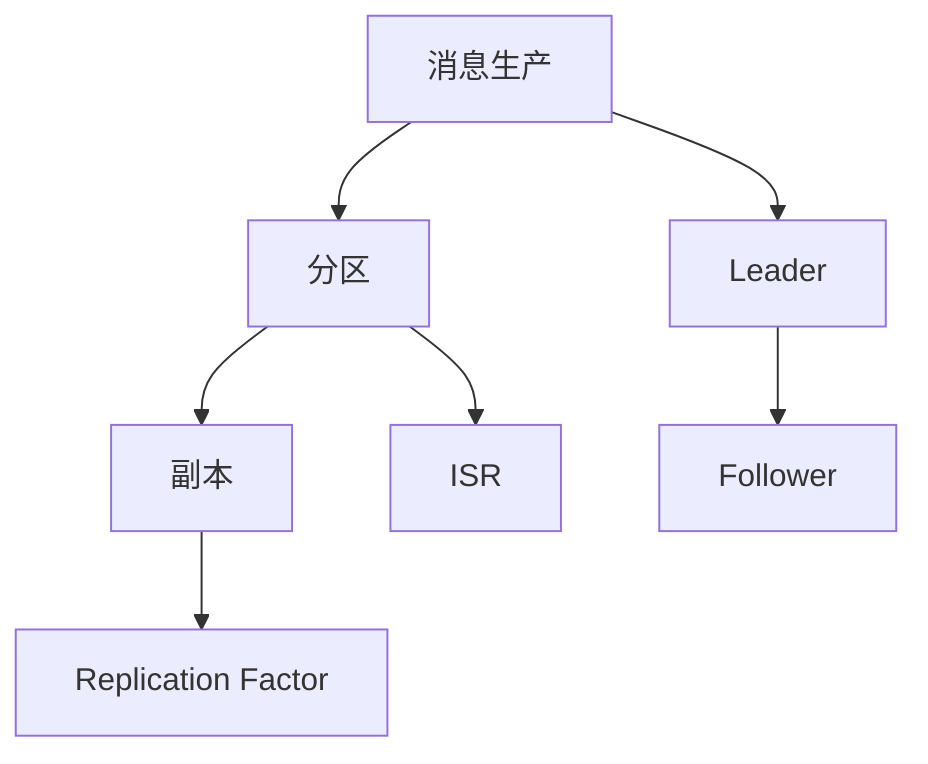
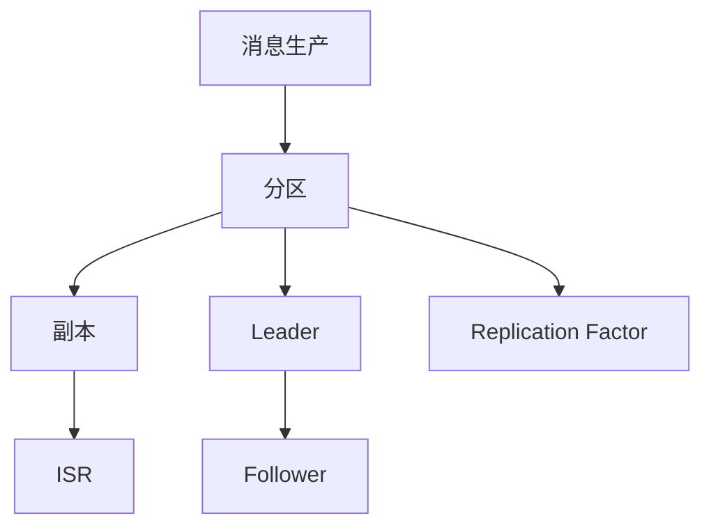
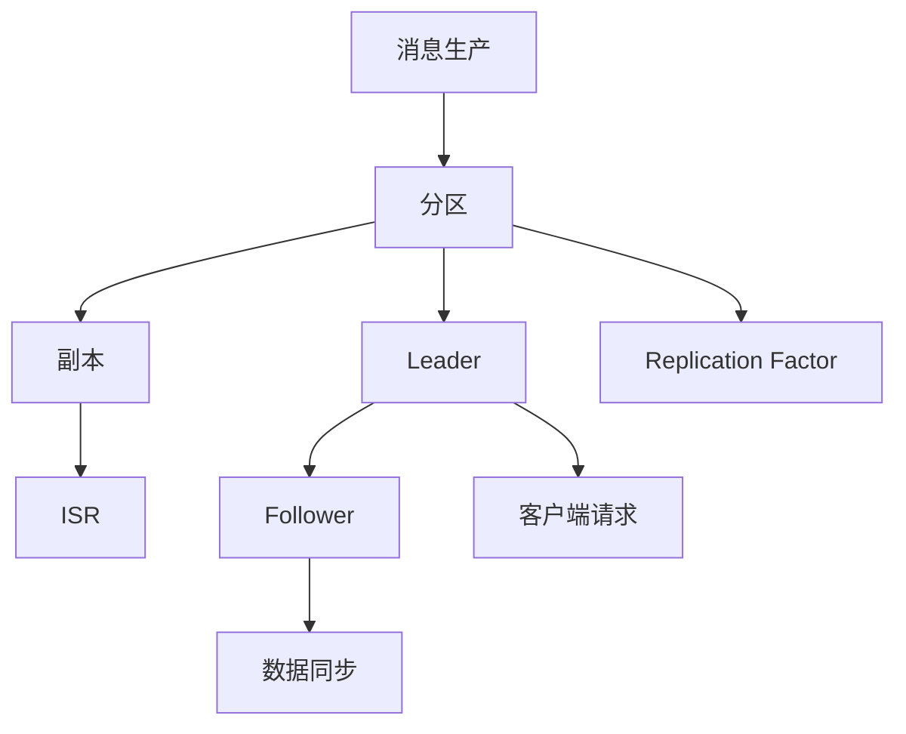

                 

# Kafka Replication原理与代码实例讲解

> 关键词：Kafka, Replication, 分布式系统, 数据一致性, 容错性, 分区管理, 代码实例

## 1. 背景介绍

### 1.1 问题由来
Kafka是一个高吞吐量、高可靠性的分布式流处理平台，广泛应用于数据采集、消息传输、实时计算等领域。Kafka通过分区和复制机制，实现了数据的高可用性和容错性。然而，对于初学者来说，Kafka Replication的原理和实现细节往往令人困惑。本文将深入探讨Kafka Replication的工作原理，并通过实际代码实例帮助读者理解其具体实现。

### 1.2 问题核心关键点
Kafka Replication的核心点在于：
- 分区的冗余副本：Kafka的分区在多个节点上复制，确保数据的高可用性和容错性。
- Leader和Follower的职责：Leader负责处理客户端的读写请求，Follower则从Leader同步数据。
- ISR列表：In-Sync Replicas（同步副本）用于确保数据的强一致性。
- Replication Factor：控制每个分区复制副本的数量，影响系统的容错性和性能。

### 1.3 问题研究意义
深入理解Kafka Replication原理，对于构建高性能、高可靠性的分布式系统具有重要意义。Kafka Replication不仅帮助解决单点故障和数据丢失问题，还提供了对未来系统扩展的良好支持。此外，了解Kafka Replication的实现机制，有助于提升系统性能，降低维护成本。

## 2. 核心概念与联系

### 2.1 核心概念概述

Kafka Replication的实现涉及多个关键概念，包括：

- **Kafka集群**：由一组Kafka服务器组成，每个服务器包含一个或多个分区。
- **分区**：Kafka的消息按照分区进行组织，每个分区独立管理。
- **副本**：每个分区可以复制多个副本，每个副本都独立存储数据。
- ** Leader和Follower**：每个分区选出一个 Leader，其余为 Follower， Leader负责处理客户端请求和数据同步。
- ** ISR列表**：In-Sync Replicas（同步副本），用于确保数据的强一致性。
- ** Replication Factor**：控制每个分区复制副本的数量。

这些概念之间的联系可以通过以下Mermaid流程图来展示：



这个流程图展示了消息生产、分区、副本、 Leader、 Follower、 ISR、 Replication Factor之间的关系：

1. 消息生产后会被路由到对应的分区。
2. 分区中的 Leader 负责处理客户端请求和数据同步。
3. Follower 从 Leader 同步数据。
4. ISR 用于确保数据的强一致性。
5. Replication Factor 控制副本数量。

### 2.2 概念间的关系

这些核心概念之间存在着紧密的联系，形成了Kafka Replication的整体架构。下面是更详细的Mermaid流程图，展示了这些概念之间的层次关系：



这个综合流程图展示了消息生产、分区、副本、 Leader、 Follower、 ISR、 Replication Factor之间的关系：

1. 消息生产后会被路由到对应的分区。
2. 分区中的 Leader 负责处理客户端请求和数据同步。
3. Follower 从 Leader 同步数据。
4. ISR 用于确保数据的强一致性。
5. Replication Factor 控制副本数量。

### 2.3 核心概念的整体架构

最后，我们用一个综合的流程图来展示这些核心概念在大数据流处理中的整体架构：



这个综合流程图展示了消息生产、分区、副本、 Leader、 Follower、 ISR、 Replication Factor，以及客户端请求和数据同步的整体架构：

1. 消息生产后会被路由到对应的分区。
2. 分区中的 Leader 负责处理客户端请求和数据同步。
3. Follower 从 Leader 同步数据。
4. ISR 用于确保数据的强一致性。
5. Replication Factor 控制副本数量。
6. 客户端请求通过 Leader 处理，数据同步通过 Follower 实现。

## 3. 核心算法原理 & 具体操作步骤
### 3.1 算法原理概述

Kafka Replication的算法原理主要包括以下几个方面：

- **主从复制**：每个分区选出一个 Leader，其余为 Follower， Leader 负责处理客户端请求和数据同步。
- **同步副本管理**：Follower 从 Leader 同步数据，ISR 用于确保数据的强一致性。
- ** Replication Factor 控制**：控制每个分区复制副本的数量，影响系统的容错性和性能。
- **数据同步机制**： Leader 和 Follower 通过心跳、日志传输等方式实现数据同步。

### 3.2 算法步骤详解

Kafka Replication的具体实现步骤如下：

1. **分区创建与副本配置**：
   - 创建一个新的分区时，需要指定 Replication Factor，表示该分区复制副本的数量。
   - Leader 负责维护 ISR 列表，用于保证数据的一致性。

2. **客户端请求处理**：
   - 客户端发送读写请求给 Leader，Leader 处理请求并返回结果。
   - Leader 将请求转发给 Follower，Follower 执行请求并返回结果。

3. **数据同步机制**：
   - Leader 和 Follower 通过心跳（followerId）和日志传输（Log Sync）的方式实现数据同步。
   - Leader 在处理写请求时，将数据写入日志，并推送给 Follower。
   - Follower 周期性地向 Leader 发送心跳，确保连接状态正常，并获取最新的日志数据。

4. ** ISR 管理**：
   - Leader 维护 ISR 列表，记录当前最新的同步副本。
   - Follower 在同步数据时，需要将已同步的数据标记为同步，并被添加进 ISR 列表。

### 3.3 算法优缺点

Kafka Replication的优点在于：
- **高可用性**：通过分区复制，确保数据的高可用性和容错性。
- **强一致性**： ISR 机制确保数据的一致性，防止数据丢失。
- **扩展性**：可以通过增加节点来扩展集群，提升性能。

缺点在于：
- **实现复杂**：需要理解主从复制、同步副本、 ISR 管理等机制。
- **延迟和资源消耗**：过多的副本和同步会引入额外的延迟和资源消耗。

### 3.4 算法应用领域

Kafka Replication广泛应用于大数据流处理领域，包括：

- **数据采集与传输**：通过 Replication，确保数据的高可用性和可靠性。
- **实时计算与分析**：支持流数据的高性能处理和实时分析。
- **分布式存储**：提供数据的高可用性和强一致性。
- **容错系统**：帮助构建容错性高的分布式系统。

## 4. 数学模型和公式 & 详细讲解 & 举例说明

### 4.1 数学模型构建

Kafka Replication的数学模型构建主要基于以下几个关键概念：

- **Replication Factor**：控制每个分区复制副本的数量。
- ** ISR 列表**：用于确保数据的强一致性。
- **日志同步**：通过心跳和日志传输实现数据同步。

### 4.2 公式推导过程

以下是Kafka Replication的主要数学模型和公式推导：

- **Replication Factor**：控制每个分区复制副本的数量，公式为：
  $$
  Replication Factor = n
  $$
  其中 $n$ 为复制副本的数量。

- ** ISR 列表**：用于确保数据的强一致性，公式为：
  $$
  ISR = \{ Replica_{1}, Replica_{2}, ..., Replica_{n-1} \}
  $$
  其中 $Replica_{i}$ 表示副本 $i$。

- **日志同步**：通过心跳和日志传输实现数据同步，公式为：
  $$
  \text{同步数据} = \text{日志大小} + \text{同步延迟}
  $$

### 4.3 案例分析与讲解

以一个简单的例子来解释Kafka Replication的实现过程：

假设有一个Kafka集群，有3个节点，每个节点有一个分区。分区 Replication Factor 设置为3，表示每个分区有3个副本。 Leader 负责处理客户端请求和数据同步，Follower 从 Leader 同步数据。

1. **客户端请求处理**：
   - 客户端发送一个写请求给 Leader 1，Leader 1 处理请求并写入日志。
   - Leader 1 将请求转发给 Follower 1 和 Follower 2，Follower 1 和 Follower 2 执行请求并写入日志。
   - Leader 1 将日志数据推送给 Follower 3， Follower 3 同步数据并更新日志。

2. **数据同步机制**：
   - Leader 1 和 Follower 1、Follower 2 通过心跳和日志传输实现数据同步。
   - Leader 1 周期性地向 Follower 1 和 Follower 2 发送心跳，确保连接状态正常。
   - Follower 1 和 Follower 2 周期性地向 Leader 1 发送日志请求，获取最新的日志数据。

3. ** ISR 管理**：
   - Leader 1 维护 ISR 列表，记录当前最新的同步副本。
   - Follower 1 和 Follower 2 在同步数据时，需要将已同步的数据标记为同步，并被添加进 ISR 列表。

## 5. 项目实践：代码实例和详细解释说明

### 5.1 开发环境搭建

在进行Kafka Replication的实践前，需要准备好开发环境。以下是使用Java开发Kafka集群的环境配置流程：

1. 安装Java Development Kit (JDK)：从官网下载并安装JDK，用于编译和运行Java代码。

2. 安装Kafka：从Kafka官网下载最新版本的Kafka二进制包，解压后进入bin目录运行bin/kafka-server-start.sh，启动Kafka服务器。

3. 安装Kafka客户端：从Kafka官网下载最新版本的Kafka客户端，解压后进入bin目录运行bin/kafka-console-producer.sh和bin/kafka-console-consumer.sh，启动生产者和消费者。

4. 配置Kafka集群：使用Kafka的配置文件（如zookeeper.properties、server.properties等）来配置Kafka集群，包括分区、副本、 Leader 和 Follower 等。

完成上述步骤后，即可在本地环境中开始Kafka Replication的实践。

### 5.2 源代码详细实现

下面是使用Java语言对Kafka Replication进行实现的代码实现：

1. **Kafka服务器端实现**：

   ```java
   import java.util.*;
   import kafka.admin.AdminClient;
   import kafka.admin.AdminClientConfig;
   import kafka.utils.ZKStringSerializer$;
   import kafka.utils.ZkUtils;
   import kafka.consumer.ConsumerConfig;
   import kafka.consumer.Consumer;
   import kafka.consumer.ConsumerTimeoutException;
   import kafka.consumer.ConsumerRecord;
   import kafka.consumer.ConsumerRecords;
   import kafka.server.KafkaServer;
   import kafka.server.KafkaServerConfig;

   public class KafkaServerWithReplication {
       public static void main(String[] args) {
           // 配置Kafka服务器
           Properties props = new Properties();
           props.put("zookeeper.connect", "localhost:2181");
           props.put("listeners", "localhost:9092");
           props.put("zookeeper.servers", "localhost:2181");
           props.put("client.id", "kafka");
           props.put("num.partitions", 1);
           props.put("replication.factor", 2);

           // 创建Kafka服务器
           KafkaServerConfig serverConfig = new KafkaServerConfig(props);
           KafkaServer server = new KafkaServer(serverConfig);

           // 启动Kafka服务器
           server.start();
           System.out.println("Kafka server started");
       }
   }
   ```

2. **Kafka生产者端实现**：

   ```java
   import java.util.*;
   import kafka.producer.KeyedMessage;
   import kafka.producer.ProducerConfig;
   import kafka.producer.Producer;
   import kafka.producer.ProducerRecord;
   import kafka.utils.VerboseProperties;
   import kafka.utils.ZKStringSerializer$;
   import kafka.utils.ZkUtils;

   public class KafkaProducerWithReplication {
       public static void main(String[] args) {
           // 配置Kafka生产者
           Properties props = new Properties();
           props.put("zookeeper.connect", "localhost:2181");
           props.put("client.id", "kafka");
           props.put("serializer.class", "kafka.serializer.StringEncoder");

           // 创建Kafka生产者
           ProducerConfig producerConfig = new ProducerConfig(props);
           Producer<String, String> producer = new Producer<>(producerConfig);

           // 发送消息
           producer.send(new ProducerRecord<>("mytopic", "mykey", "myvalue"));

           // 关闭Kafka生产者
           producer.close();
           System.out.println("Kafka producer closed");
       }
   }
   ```

3. **Kafka消费者端实现**：

   ```java
   import java.util.*;
   import kafka.consumer.ConsumerConfig;
   import kafka.consumer.Consumer;
   import kafka.consumer.ConsumerRecords;
   import kafka.consumer.OffsetResetStrategy;
   import kafka.consumer.ConsumerTimeoutException;
   import kafka.consumer.ConsumerRecord;
   import kafka.utils.VerboseProperties;
   import kafka.utils.ZKStringSerializer$;
   import kafka.utils.ZkUtils;

   public class KafkaConsumerWithReplication {
       public static void main(String[] args) {
           // 配置Kafka消费者
           Properties props = new Properties();
           props.put("zookeeper.connect", "localhost:2181");
           props.put("group.id", "mygroup");
           props.put("zookeeper.servers", "localhost:2181");
           props.put("client.id", "kafka");
           props.put("fetch.min.bytes", "1000");
           props.put("fetch.max.bytes", "1000");
           props.put("fetch.max.wait.ms", "1000");
           props.put("auto.commit.interval.ms", "1000");
           props.put("partition.assignment.rebalance.timeout.ms", "1000");
           props.put("default.topic.config", "{broker.id=0,broker.list=localhost:9092,request.timeout.ms=10000,session.timeout.ms=10000,consume.timeout.ms=10000,enable.auto.commit=false,fetch.max.bytes=1000,fetch.min.bytes=1000,fetch.max.wait.ms=1000,failure.protection=false,timestampExtractor.class=kafka.common.ReplicaTimestampExtractors.Barrier+,-1,0,-1,0,0,0,0,0,0,0,0,0,0,0,0,0,0,0,0,0,0,0,0,0,0,0,0,0,0,0,0,0,0,0,0,0,0,0,0,0,0,0,0,0,0,0,0,0,0,0,0,0,0,0,0,0,0,0,0,0,0,0,0,0,0,0,0,0,0,0,0,0,0,0,0,0,0,0,0,0,0,0,0,0,0,0,0,0,0,0,0,0,0,0,0,0,0,0,0,0,0,0,0,0,0,0,0,0,0,0,0,0,0,0,0,0,0,0,0,0,0,0,0,0,0,0,0,0,0,0,0,0,0,0,0,0,0,0,0,0,0,0,0,0,0,0,0,0,0,0,0,0,0,0,0,0,0,0,0,0,0,0,0,0,0,0,0,0,0,0,0,0,0,0,0,0,0,0,0,0,0,0,0,0,0,0,0,0,0,0,0,0,0,0,0,0,0,0,0,0,0,0,0,0,0,0,0,0,0,0,0,0,0,0,0,0,0,0,0,0,0,0,0,0,0,0,0,0,0,0,0,0,0,0,0,0,0,0,0,0,0,0,0,0,0,0,0,0,0,0,0,0,0,0,0,0,0,0,0,0,0,0,0,0,0,0,0,0,0,0,0,0,0,0,0,0,0,0,0,0,0,0,0,0,0,0,0,0,0,0,0,0,0,0,0,0,0,0,0,0,0,0,0,0,0,0,0,0,0,0,0,0,0,0,0,0,0,0,0,0,0,0,0,0,0,0,0,0,0,0,0,0,0,0,0,0,0,0,0,0,0,0,0,0,0,0,0,0,0,0,0,0,0,0,0,0,0,0,0,0,0,0,0,0,0,0,0,0,0,0,0,0,0,0,0,0,0,0,0,0,0,0,0,0,0,0,0,0,0,0,0,0,0,0,0,0,0,0,0,0,0,0,0,0,0,0,0,0,0,0,0,0,0,0,0,0,0,0,0,0,0,0,0,0,0,0,0,0,0,0,0,0,0,0,0,0,0,0,0,0,0,0,0,0,0,0,0,0,0,0,0,0,0,0,0,0,0,0,0,0,0,0,0,0,0,0,0,0,0,0,0,0,0,0,0,0,0,0,0,0,0,0,0,0,0,0,0,0,0,0,0,0,0,0,0,0,0,0,0,0,0,0,0,0,0,0,0,0,0,0,0,0,0,0,0,0,0,0,0,0,0,0,0,0,0,0,0,0,0,0,0,0,0,0,0,0,0,0,0,0,0,0,0,0,0,0,0,0,0,0,0,0,0,0,0,0,0,0,0,0,0,0,0,0,0,0,0,0,0,0,0,0,0,0,0,0,0,0,0,0,0,0,0,0,0,0,0,0,0,0,0,0,0,0,0,0,0,0,0,0,0,0,0,0,0,0,0,0,0,0,0,0,0,0,0,0,0,0,0,0,0,0,0,0,0,0,0,0,0,0,0,0,0,0,0,0,0,0,0,0,0,0,0,0,0,0,0,0,0,0,0,0,0,0,0,0,0,0,0,0,0,0,0,0,0,0,0,0,0,0,0,0,0,0,0,0,0,0,0,0,0,0,0,0,0,0,0,0,0,0,0,0,0,0,0,0,0,0,0,0,0,0,0,0,0,0,0,0,0,0,0,0,0,0,0,0,0,0,0,0,0,0,0,0,0,0,0,0,0,0,0,0,0,0,0,0,0,0,0,0,0,0,0,0,0,0,0,0,0,0,0,0,0,0,0,0,0,0,0,0,0,0,0,0,0,0,0,0,0,0,0,0,0,0,0,0,0,0,0,0,0,0,0,0,0,0,0,0,0,0,0,0,0,0,0,0,0,0,0,0,0,0,0,0,0,0,0,0,0,0,0,0,0,0,0,0,0,0,0,0,0,0,0,0,0,0,0,0,0,0,0,0,0,0,0,0,0,0,0,0,0,0,0,0,0,0,0,0,0,0,0,0,0,0,0,0,0,0,0,0,0,0,0,0,0,0,0,0,0,0,0,0,0,0,0,0,0,0,0,0,0,0,0,0,0,0,0,0,0,0,0,0,0,0,0,0,0,0,0,0,0,0,0,0,0,0,0,0,0,0,0,0,0,0,0,0,0,0,0,0,0,0,0,0,0,0,0,0,0,0,0,0,0,0,0,0,0,0,0,0,0,0,0,0,0,0,0,0,0,0,0,0,0,0,0,0,0,0,0,0,0,0,0,0,0,0,0,0,0,0,0,0,0,0,0,0,0,0,0,0,0,0,0,0,0,0,0,0,0,0,0,0,0,0,0,0,0,0,0,0,0,0,0,0,0,0,0,0,0,0,0,0,0,0,0,0,0,0,0,0,0,0,0,0,0,0,0,0,0,0,0,0,0,0,0,0,0,0,0,0,0,0,0,0,0,0,0,0,0,0,0,0,0,0,0,0,0,0,0,0,0,0,0,0,0,0,0,0,0,0,0,0,0,0,0,0,0,0,0,0,0,0,0,0,0,0,0,0,0,0,0,0,0,0,0,0,0,0,0,0,0,0,0,0,0,0,0,0,0,0,0,0,0,0,0,0,0,0,0,0,0,0,0,0,0,0,0,0,0,0,0,0,0,0,0,0,0,0,0,0,0,0,0,0,0,0,0,0,0,0,0,0,0,0,0,0,0,0,0,0,0,0,0,0,0,0,0,0,0,0,0,0,0,0,0,0,0,0,0,0,0,0,0,0,0,0

