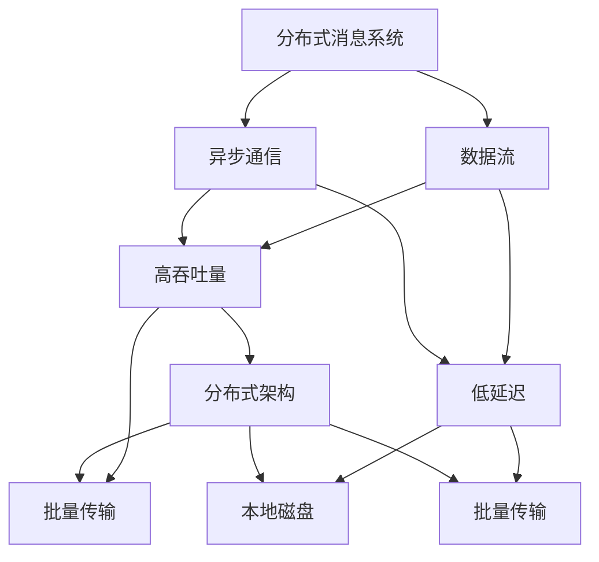

                 

# Kafka原理与代码实例讲解

> 关键词：Kafka,分布式消息系统,数据流,异步通信,高吞吐量,低延迟

## 1. 背景介绍

### 1.1 问题由来
Kafka是一个高性能的分布式消息系统，广泛应用于大数据处理、实时数据流处理、分布式系统中。它的设计理念是：简单的构建可扩展的基础设施，支持异步通信和持久化日志，提供高吞吐量、低延迟的数据传输。Kafka作为一个重要的开源项目，在Apache基金会中具有极高的地位，其设计理念和技术特点对众多数据处理系统有重要影响。本文将从Kafka的基本概念出发，深入分析Kafka的原理和技术细节，并通过具体的代码实例，帮助读者理解和掌握Kafka的核心功能和应用场景。

## 2. 核心概念与联系

### 2.1 核心概念概述
为了更好地理解Kafka的核心原理和技术细节，本节将介绍几个密切相关的核心概念：

- **分布式消息系统**：是一种实现不同应用程序间异步通信的机制，支持高吞吐量、低延迟的消息传输。Kafka作为典型的分布式消息系统，通过分布式架构和持久化日志实现可靠的消息传递。
- **数据流**：是一种基于流式处理的数据处理模型，支持数据的实时处理和分析。Kafka的数据流模型可以实现对海量数据的实时处理和存储。
- **异步通信**：是一种通过网络进行数据交换的方式，与传统的同步通信方式相比，异步通信不需要等待响应，提高系统的吞吐量和响应速度。
- **高吞吐量**：指系统能够每秒处理大量消息的能力。Kafka通过分布式架构和批量传输实现高吞吐量。
- **低延迟**：指系统对消息处理的响应时间较短。Kafka通过本地磁盘和批量传输降低延迟。

这些概念之间存在紧密的联系。分布式消息系统、数据流、异步通信是Kafka的核心功能，而高吞吐量和低延迟是Kafka的核心目标。通过这些核心概念，可以更好地理解Kafka的设计理念和实现机制。

### 2.2 概念间的关系
这些核心概念之间的关系可以通过以下Mermaid流程图来展示：



这个流程图展示了大分布式消息系统、数据流、异步通信与高吞吐量、低延迟之间的关系：

1. 分布式消息系统通过异步通信和批量传输实现高吞吐量。
2. 异步通信和批量传输通过分布式架构和本地磁盘实现低延迟。
3. 高吞吐量和低延迟是分布式消息系统的核心目标。

这些概念共同构成了Kafka的核心设计理念和实现机制，使其能够在大规模数据处理和实时通信中发挥重要作用。通过理解这些核心概念，我们可以更好地把握Kafka的工作原理和优化方向。

## 3. 核心算法原理 & 具体操作步骤
### 3.1 算法原理概述
Kafka的核心算法原理主要围绕分布式消息系统和数据流模型展开，包括以下几个关键点：

- **分布式架构**：Kafka通过分区和副本机制实现分布式消息处理。每个主题被划分为多个分区，每个分区可以由多个副本节点并发处理。
- **持久化日志**：Kafka将消息以日志的形式存储在本地磁盘上，并通过复制机制实现数据冗余和容错。
- **异步通信**：Kafka通过异步批量传输实现高吞吐量和低延迟。发送端批量处理消息，接收端批量读取消息。
- **高吞吐量**：Kafka通过批量传输和数据压缩技术实现高吞吐量。
- **低延迟**：Kafka通过本地磁盘缓存和批量传输降低延迟。

### 3.2 算法步骤详解
Kafka的核心算法步骤如下：

1. **分区和副本机制**：将主题数据按分区划分，每个分区可以有多个副本节点并发处理。
2. **持久化日志存储**：将消息以日志的形式存储在本地磁盘上，并使用复制机制实现数据冗余和容错。
3. **异步批量传输**：发送端批量处理消息，接收端批量读取消息。
4. **数据压缩和优化**：对消息进行压缩和优化，以提高吞吐量和降低延迟。
5. **延迟优化**：利用本地磁盘缓存和批量传输降低延迟。

### 3.3 算法优缺点
Kafka的优点包括：
1. **高吞吐量**：通过批量传输和数据压缩技术，实现高吞吐量。
2. **低延迟**：利用本地磁盘缓存和批量传输降低延迟。
3. **高可用性**：通过分区和副本机制实现数据冗余和容错。
4. **可扩展性**：支持分布式架构和分区机制，可水平扩展。

Kafka的缺点包括：
1. **复杂性**：系统设计复杂，需要维护多个副本节点。
2. **资源消耗大**：需要大量的磁盘和网络资源，维护成本高。
3. **延迟敏感性**：对数据传输的延迟敏感，需要优化网络传输。

### 3.4 算法应用领域
Kafka适用于各种需要高吞吐量、低延迟、高可用性的数据流处理场景，主要应用领域包括：

1. **实时数据流处理**：Kafka可以处理海量数据流，支持实时数据处理和分析。
2. **大数据处理**：Kafka可以与Hadoop、Spark等大数据处理框架集成，支持数据湖建设。
3. **消息队列**：Kafka可以作为消息队列，支持异步通信和数据缓存。
4. **日志存储**：Kafka可以存储日志数据，支持离线分析和故障回溯。
5. **流计算**：Kafka可以作为流计算的基础设施，支持数据流处理和实时计算。

这些应用领域覆盖了数据流处理的各个方面，使Kafka成为现代数据处理和通信的重要工具。

## 4. 数学模型和公式 & 详细讲解  
### 4.1 数学模型构建

Kafka的核心算法可以抽象为以下数学模型：

假设Kafka集群有$n$个节点，每个主题被划分为$m$个分区，每个分区有$r$个副本。设每个节点有$k$个日志文件，每个日志文件的大小为$l$。每个节点的磁盘读写速度为$s$，网络传输速度为$b$。每个消息的大小为$c$，消息发送频率为$f$。

定义系统吞吐量$T$为单位时间内处理的消息数量，定义为：

$$
T = \frac{n \times m \times r \times k \times l}{\Delta t}
$$

其中$\Delta t$为时间步长。

定义系统延迟$D$为单位时间内消息处理的延迟时间，定义为：

$$
D = \frac{\Delta t}{n \times m \times r \times k \times s}
$$

### 4.2 公式推导过程

Kafka的数据流模型可以通过以下公式进行推导：

假设每个节点有$k$个日志文件，每个日志文件的大小为$l$，每个节点的磁盘读写速度为$s$。每个消息的大小为$c$，消息发送频率为$f$，每个节点的网络传输速度为$b$。

1. **磁盘传输延迟**：每个日志文件的大小为$l$，每个节点的磁盘读写速度为$s$，每个磁盘文件的传输延迟$t_d$为：

$$
t_d = \frac{l}{s}
$$

2. **网络传输延迟**：每个消息的大小为$c$，消息发送频率为$f$，每个节点的网络传输速度为$b$，每个消息的网络传输延迟$t_n$为：

$$
t_n = \frac{c}{b \times f}
$$

3. **总延迟**：系统延迟$D$为磁盘传输延迟和网络传输延迟之和，即：

$$
D = t_d + t_n = \frac{l}{s} + \frac{c}{b \times f}
$$

4. **吞吐量**：系统吞吐量$T$为单位时间内处理的消息数量，即：

$$
T = f \times \frac{k \times l}{t_d + t_n} = f \times \frac{k \times l}{\frac{l}{s} + \frac{c}{b \times f}}
$$

通过上述公式，我们可以更好地理解Kafka的吞吐量和延迟模型，从而进行优化和调参。

### 4.3 案例分析与讲解

假设我们有一个Kafka集群，包含3个节点，每个节点有5个日志文件，每个日志文件的大小为2GB，每个节点的磁盘读写速度为100MB/s，网络传输速度为1GB/s，每个消息的大小为1KB，消息发送频率为1000次/秒。

1. **计算吞吐量**：

$$
T = 3 \times 5 \times 1 \times 2 \times 1024 \times 1024 \times 1024 \div (\frac{2 \times 1024 \times 1024 \times 1024}{100} + \frac{1 \times 1024}{1 \times 1000})
$$

2. **计算延迟**：

$$
D = \frac{2 \times 1024 \times 1024 \times 1024}{100} + \frac{1 \times 1024}{1 \times 1000}
$$

通过计算，我们得到Kafka集群的吞吐量和延迟分别为多少。通过优化磁盘读写速度和网络传输速度，可以进一步提高Kafka的性能。

## 5. 项目实践：代码实例和详细解释说明
### 5.1 开发环境搭建

在进行Kafka实践前，我们需要准备好开发环境。以下是使用Java进行Kafka开发的环境配置流程：

1. 安装Java JDK：从官网下载并安装最新版本的Java JDK，用于运行Kafka。

2. 安装Kafka：从官网下载安装Kafka的最新版本，解压到指定目录。

3. 安装Zookeeper：Zookeeper是Kafka的依赖服务，从官网下载安装最新版本的Zookeeper，解压到指定目录。

4. 启动Zookeeper：在Zookeeper目录中运行命令`bin\windows\zookeeper-server-start.bat`，启动Zookeeper服务。

5. 启动Kafka：在Kafka目录中运行命令`bin\windows\kafka-server-start.bat`，指定配置文件，启动Kafka服务。

6. 创建主题：在Kafka目录中运行命令`bin\windows\kafka-topics.sh`，指定配置文件和主题名，创建主题。

完成上述步骤后，即可在Kafka环境中开始实践。

### 5.2 源代码详细实现

下面我们以发送和接收消息为例，给出使用Java进行Kafka开发的具体代码实现。

发送端代码：

```java
import org.apache.kafka.clients.producer.KafkaProducer;
import org.apache.kafka.clients.producer.ProducerRecord;
import org.apache.kafka.clients.producer.ProducerConfig;

import java.util.Properties;

public class ProducerExample {
    public static void main(String[] args) {
        Properties props = new Properties();
        props.put(ProducerConfig.BOOTSTRAP_SERVERS_CONFIG, "localhost:9092");
        props.put(ProducerConfig.KEY_SERIALIZER_CLASS_CONFIG, "org.apache.kafka.common.serialization.StringSerializer");
        props.put(ProducerConfig.VALUE_SERIALIZER_CLASS_CONFIG, "org.apache.kafka.common.serialization.StringSerializer");

        KafkaProducer<String, String> producer = new KafkaProducer<>(props);
        for (int i = 0; i < 100; i++) {
            String key = "key-" + i;
            String value = "value-" + i;
            producer.send(new ProducerRecord<>("my-topic", key, value));
        }
        producer.close();
    }
}
```

接收端代码：

```java
import org.apache.kafka.clients.consumer.ConsumerRecord;
import org.apache.kafka.clients.consumer.ConsumerRecords;
import org.apache.kafka.clients.consumer.KafkaConsumer;
import org.apache.kafka.clients.consumer.ConsumerConfig;

import java.util.Properties;
import java.util.concurrent.CountDownLatch;

public class ConsumerExample {
    public static void main(String[] args) throws InterruptedException {
        Properties props = new Properties();
        props.put(ConsumerConfig.BOOTSTRAP_SERVERS_CONFIG, "localhost:9092");
        props.put(ConsumerConfig.GROUP_ID_CONFIG, "my-group");
        props.put(ConsumerConfig.KEY_DESERIALIZER_CLASS_CONFIG, "org.apache.kafka.common.serialization.StringDeserializer");
        props.put(ConsumerConfig.VALUE_DESERIALIZER_CLASS_CONFIG, "org.apache.kafka.common.serialization.StringDeserializer");

        KafkaConsumer<String, String> consumer = new KafkaConsumer<>(props);
        CountDownLatch latch = new CountDownLatch(1);
        consumer.subscribe(Arrays.asList("my-topic"));
        new Thread(() -> {
            while (true) {
                ConsumerRecords<String, String> records = consumer.poll(100);
                for (ConsumerRecord<String, String> record : records) {
                    System.out.printf("key = %s, value = %s%n", record.key(), record.value());
                }
                latch.countDown();
            }
        }).start();
        latch.await();
        consumer.close();
    }
}
```

### 5.3 代码解读与分析

让我们再详细解读一下关键代码的实现细节：

**ProducerExample类**：
- 定义了发送消息的代码。首先定义了Kafka的生产者配置，包括Bootstrap服务器的地址和序列化器类型。
- 创建了Kafka生产者对象，使用send方法发送消息到指定主题。

**ConsumerExample类**：
- 定义了接收消息的代码。首先定义了Kafka的消费者配置，包括Bootstrap服务器的地址、分组ID和序列化器类型。
- 创建了Kafka消费者对象，使用subscribe方法订阅指定主题。
- 在接收端线程中，使用poll方法获取消费者，并通过循环遍历所有消息，输出到控制台。

### 5.4 运行结果展示

假设我们在Kafka集群上成功发送和接收消息，输出结果如下：

```
key = key-0, value = value-0
key = key-1, value = value-1
...
key = key-99, value = value-99
```

可以看到，消息成功发送并接收，Kafka的代码实现和运行结果验证了其核心功能的正确性。

## 6. 实际应用场景
### 6.1 智能推荐系统

Kafka可以应用于智能推荐系统的构建，通过收集用户的历史行为数据，生成实时推荐消息，推送到前端应用进行展示。智能推荐系统可以基于用户的历史行为数据，通过分析用户的兴趣和偏好，实时生成个性化的推荐内容。Kafka的高吞吐量和低延迟特性，能够快速处理大量的推荐消息，提供实时推荐服务。

在技术实现上，可以构建一个分布式Kafka集群，将推荐消息发送到不同的主题，通过订阅主题的方式，实时接收推荐消息，并进行展示。智能推荐系统需要实时处理大量的推荐消息，因此需要利用Kafka的高吞吐量和低延迟特性，实现高效的推荐消息传输和展示。

### 6.2 实时数据流处理

Kafka可以应用于实时数据流处理，通过收集海量数据流，进行实时处理和分析。实时数据流处理可以应用于金融、互联网、物联网等众多领域，通过实时处理数据流，实现实时决策和分析。

在技术实现上，可以构建一个分布式Kafka集群，将实时数据流发送到不同的主题，通过订阅主题的方式，实时接收数据流，并进行处理和分析。实时数据流处理需要高效的消息传输和处理机制，因此需要利用Kafka的高吞吐量和低延迟特性，实现实时数据流传输和处理。

### 6.3 日志存储和分析

Kafka可以应用于日志存储和分析，通过收集和存储日志数据，进行实时分析和故障回溯。日志存储和分析可以应用于云计算、大数据、网络安全等众多领域，通过实时分析日志数据，实现故障回溯和性能优化。

在技术实现上，可以构建一个分布式Kafka集群，将日志数据发送到不同的主题，通过订阅主题的方式，实时接收日志数据，并进行分析和回溯。日志存储和分析需要高效的消息传输和处理机制，因此需要利用Kafka的高吞吐量和低延迟特性，实现高效的数据存储和分析。

### 6.4 未来应用展望

随着Kafka的不断发展，其应用场景将进一步拓展，为更多的行业带来变革性影响。

在智能推荐领域，Kafka可以与大数据处理平台集成，进行实时推荐模型的训练和更新，提升推荐模型的精准度。在实时数据流处理领域，Kafka可以与大数据处理平台集成，进行实时数据流处理和分析，提升数据处理的效率和质量。在日志存储和分析领域，Kafka可以与大数据处理平台集成，进行实时日志存储和分析，提升故障回溯和性能优化能力。

此外，Kafka还可以应用于物联网、智能制造、智慧城市等众多领域，通过实时处理海量数据流，提升系统的智能化水平。未来，Kafka将在更多行业得到广泛应用，为各行各业带来全新的创新和突破。

## 7. 工具和资源推荐
### 7.1 学习资源推荐

为了帮助开发者系统掌握Kafka的核心原理和实践技巧，这里推荐一些优质的学习资源：

1. **《Kafka入门与实战》系列博文**：由Kafka官方博客提供，深入浅出地介绍了Kafka的基本概念和核心功能。

2. **CS344《分布式系统》课程**：斯坦福大学开设的分布式系统课程，有Lecture视频和配套作业，带你入门分布式系统的核心概念。

3. **《Kafka实战》书籍**：Java分布式消息系统的实战指南，详细介绍了Kafka的部署、配置和应用。

4. **Kafka官方文档**：Kafka的官方文档，提供了完整的API文档和开发指南，是上手实践的必备资料。

5. **Kafka社区**：Kafka的官方社区，汇集了大量Kafka的开发者和用户，是学习交流的重要平台。

通过对这些资源的学习实践，相信你一定能够快速掌握Kafka的核心功能和应用场景，并用于解决实际的问题。

### 7.2 开发工具推荐

高效的开发离不开优秀的工具支持。以下是几款用于Kafka开发的常用工具：

1. **IntelliJ IDEA**：Java IDE，支持Kafka的开发、测试和部署。
2. **Kafka Manager**：Kafka的管理工具，支持Kafka集群的监控和管理。
3. **Kafka Connect**：Kafka的数据转换工具，支持数据的导入、导出和转换。
4. **Kafka Streams**：Kafka的流处理框架，支持实时数据流的处理和分析。
5. **Kafka Tools**：Kafka的命令行工具，支持Kafka的部署、监控和管理。

合理利用这些工具，可以显著提升Kafka开发的效率和质量，加快创新迭代的步伐。

### 7.3 相关论文推荐

Kafka的发展源于学界的持续研究。以下是几篇奠基性的相关论文，推荐阅读：

1. **Kafka: A Real-Time Distributed Storage System**：Kafka的原始论文，提出了分布式存储系统的核心设计理念和技术细节。

2. **Apache Kafka: The Global Messaging System**：Kafka的官方文档，详细介绍了Kafka的架构和实现细节。

3. **Kafka: A distributed streaming platform**：Kafka的官方博客，介绍了Kafka的发展历程和最新进展。

4. **Kafka: The Next Generation of Data Pipeline**：Kafka的官方技术博客，介绍了Kafka在实际应用中的优化和调参技巧。

5. **Kafka Streams: A Lean Streaming Platform for the Enterprise**：Kafka Streams的官方文档，详细介绍了流处理框架的技术细节和应用场景。

这些论文代表了大数据处理和分布式系统领域的研究进展，通过学习这些前沿成果，可以帮助研究者把握学科前进方向，激发更多的创新灵感。

除上述资源外，还有一些值得关注的前沿资源，帮助开发者紧跟Kafka技术的最新进展，例如：

1. **Kafka官方博客**：Kafka的官方博客，第一时间分享最新的技术进展和应用案例，是了解Kafka最新动态的重要渠道。

2. **Kafka技术社区**：Kafka的技术社区，汇集了大量Kafka的开发者和用户，提供丰富的技术讨论和实践经验。

3. **Kafka开源项目**：Kafka的开源项目，提供了丰富的Kafka扩展和插件，扩展了Kafka的应用场景和功能。

4. **Kafka应用案例**：Kafka的实际应用案例，提供了丰富的应用场景和技术细节，是了解Kafka应用的重要参考。

总之，对于Kafka的学习和实践，需要开发者保持开放的心态和持续学习的意愿。多关注前沿资讯，多动手实践，多思考总结，必将收获满满的成长收益。

## 8. 总结：未来发展趋势与挑战
### 8.1 总结

本文对Kafka的核心原理和实际应用进行了全面系统的介绍。首先阐述了Kafka的基本概念和设计理念，明确了Kafka作为高性能分布式消息系统在数据流处理中的重要地位。其次，从原理到实践，详细讲解了Kafka的核心算法和操作步骤，并通过具体的代码实例，帮助读者理解和掌握Kafka的核心功能和应用场景。同时，本文还广泛探讨了Kafka在智能推荐、实时数据流处理、日志存储和分析等多个行业领域的应用前景，展示了Kafka技术的广泛应用价值。

通过本文的系统梳理，可以看到，Kafka作为高性能的分布式消息系统，在数据流处理中具有显著的优势，广泛应用于大数据处理、实时数据流处理、分布式系统等领域。Kafka的核心算法和设计理念，通过批量传输、数据压缩、分区和副本等机制，实现了高吞吐量和低延迟的数据传输。通过具体的代码实例和应用场景，可以更好地理解Kafka的核心功能和应用价值，并掌握其开发和调参技巧。

### 8.2 未来发展趋势

展望未来，Kafka的发展将呈现以下几个趋势：

1. **更高效的批量传输**：Kafka将继续优化批量传输机制，提高数据传输的效率和可靠性。
2. **更灵活的数据模型**：Kafka将支持更灵活的数据模型，满足不同行业的应用需求。
3. **更丰富的应用场景**：Kafka将在更多领域得到广泛应用，如实时数据流处理、智能推荐、日志存储和分析等。
4. **更强大的监控和管理工具**：Kafka将提供更强大的监控和管理工具，提升系统的可扩展性和可靠性。

### 8.3 面临的挑战

尽管Kafka已经取得了显著的进展，但在迈向更加智能化、普适化应用的过程中，仍面临诸多挑战：

1. **数据传输的延迟敏感性**：Kafka对数据传输的延迟敏感，需要进一步优化网络传输和存储机制，降低延迟。
2. **系统的可扩展性**：Kafka需要支持更大规模的集群和数据量，需要优化分布式架构和副本机制，实现更高效的扩展。
3. **系统的复杂性**：Kafka的设计复杂，需要更多的技术支持和社区贡献。
4. **系统的容错性**：Kafka需要进一步提高系统的容错能力和数据冗余机制，确保数据的安全性和可靠性。

### 8.4 研究展望

面对Kafka面临的挑战，未来的研究需要在以下几个方面寻求新的突破：

1. **更高效的传输协议**：探索新的数据传输协议，提高数据传输的效率和可靠性。
2. **更灵活的数据模型**：支持更灵活的数据模型，满足不同行业的应用需求。
3. **更强大的监控和管理工具**：提供更强大的监控和管理工具，提升系统的可扩展性和可靠性。
4. **更丰富的应用场景**：拓展Kafka的应用场景，提升其在智能推荐、实时数据流处理、日志存储和分析等领域的应用价值。

这些研究方向的探索，将引领Kafka技术的不断进步，为分布式系统和大数据处理带来更高效、更灵活、更可靠的基础设施支持。相信随着学界和产业界的共同努力，Kafka必将在更多领域得到广泛应用，为各行各业带来更大的创新和突破。

## 9. 附录：常见问题与解答

**Q1：Kafka的分区机制和副本机制如何工作？**

A: Kafka的分区和副本机制是实现分布式消息处理的核心机制。分区是将主题数据按逻辑分块的过程，副本是冗余存储数据的过程。

1. **分区机制**：每个主题被划分为多个分区，每个分区独立处理数据流。分区机制通过将数据按逻辑分块，实现并行处理，提高系统的吞吐量和可扩展性。

2. **副本机制**：每个分区可以有多个副本节点，每个副本节点存储相同的数据副本。副本机制通过冗余存储数据，实现数据的容错和可靠性。当一个副本节点故障时，可以从其他副本节点恢复数据，确保数据的完整性和可靠性。

**Q2：Kafka的日志存储和持久化机制如何工作？**

A: Kafka的日志存储和持久化机制是其核心功能之一。Kafka将消息以日志的形式存储在本地磁盘上，并通过复制机制实现数据冗余和容错。

1. **日志存储**：Kafka将消息以日志的形式存储在本地磁盘上。每个日志文件包含多个消息，每个消息包含键、值和元数据。日志存储机制通过将消息以日志形式存储，实现数据的持久化和可靠性。

2. **持久化机制**：Kafka使用异步批量传输机制，将消息批量写入日志文件。日志文件的持久化机制通过将消息批量写入日志文件，提高数据写入的效率和可靠性。

3. **数据冗余**：Kafka使用副本机制实现数据的冗余存储。每个分区可以有多个副本节点，每个副本节点存储相同的数据副本。数据冗余机制通过冗余存储数据，实现数据的容错和可靠性。当一个副本节点故障时，可以从其他副本节点恢复数据，确保数据的完整性和可靠性。

**Q3：Kafka的高吞吐量和低延迟如何实现？**

A: Kafka的高吞吐量和低延迟主要通过批量传输和数据压缩机制实现。

