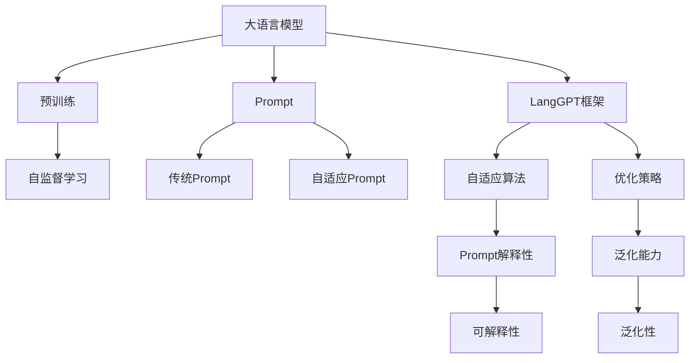
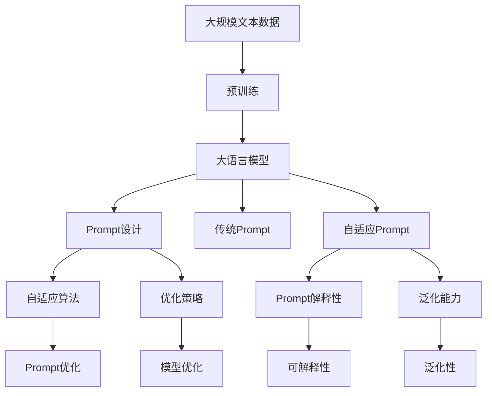

                 

# LangGPT框架与传统Prompt的区别

> 关键词：LangGPT, 传统Prompt, 自适应, 可解释性, 优化策略, 未来方向

## 1. 背景介绍

在自然语言处理(NLP)领域，大语言模型(Large Language Model, LLM)的迅速崛起，尤其是像GPT-3这样的大模型，为语言理解和生成任务带来了革命性的变革。然而，尽管这些模型在精度和通用性方面取得了显著进展，其应用仍存在一些挑战，尤其是在可解释性和泛化能力方面。为此，LangGPT框架应运而生，旨在通过改进Prompt设计、自适应算法和优化策略，提高大语言模型的应用效果。本文将详细对比LangGPT框架与传统Prompt在概念、原理和应用上的差异，并探讨其未来发展趋势。

## 2. 核心概念与联系

### 2.1 核心概念概述

在深入讨论LangGPT框架之前，我们首先需要理解其核心概念：

- **大语言模型（LLMs）**：指基于深度学习技术，通过在大量文本数据上预训练获得的模型，具有强大的语言理解和生成能力。GPT-3是其中的典型代表。
- **Prompt**：指用于指导模型输出特定形式或内容的输入文本。传统Prompt往往需要精心设计，且难以适用于复杂或动态任务。
- **LangGPT框架**：一种专门针对Prompt设计和优化的大语言模型微调框架，通过自适应算法和优化策略，提升模型的可解释性和泛化能力。

### 2.2 核心概念之间的关系

这些核心概念之间的关系可以通过以下Mermaid流程图来展示：



该流程图展示了从大语言模型的预训练到LangGPT框架的演变过程：

1. 大语言模型通过在大量无标签文本数据上进行预训练，学习通用的语言表示。
2. Prompt设计用于指导模型输出特定形式或内容。传统Prompt往往需要精心设计，且难以适用于复杂或动态任务。
3. LangGPT框架通过自适应算法和优化策略，提升Prompt的设计和模型的可解释性和泛化能力。

### 2.3 核心概念的整体架构

为了更清晰地理解LangGPT框架的概念和结构，我们提供以下综合流程图：



该流程图展示了LangGPT框架的整体架构：

1. 大语言模型通过预训练获得基础能力。
2. 通过Prompt设计，指导模型输出特定形式或内容。
3. LangGPT框架通过自适应算法和优化策略，提升Prompt的设计和模型的可解释性和泛化能力。

## 3. 核心算法原理 & 具体操作步骤

### 3.1 算法原理概述

LangGPT框架的核心在于通过自适应算法和优化策略，提升Prompt的设计和模型的可解释性和泛化能力。其基本原理可以概括为以下几点：

1. **自适应Prompt设计**：在传统Prompt的基础上，引入自适应算法，动态生成和优化Prompt，使其更适合特定任务。
2. **优化策略**：采用各种优化技术，如对抗训练、正则化、知识蒸馏等，提升模型的泛化能力。
3. **可解释性**：引入可解释性算法，如LIME、SHAP等，解释模型的预测和决策过程，提高模型的透明性。

### 3.2 算法步骤详解

LangGPT框架的具体操作步骤包括以下几个关键步骤：

**Step 1: 准备预训练模型和数据集**
- 选择合适的预训练语言模型作为初始化参数，如GPT-3。
- 准备特定任务的数据集，如文本分类、问答、生成等，并划分为训练集、验证集和测试集。

**Step 2: 设计Prompt**
- 使用LangGPT框架提供的自适应算法，动态生成和优化Prompt。
- 根据任务特性，选择合适的Prompt模板，如“请告诉我关于[话题]的信息”。

**Step 3: 模型微调**
- 采用自适应算法，更新模型的参数，以适应特定任务。
- 使用优化策略，如对抗训练、正则化、知识蒸馏等，提高模型的泛化能力。
- 引入可解释性算法，解释模型的预测和决策过程，提高模型的透明性。

**Step 4: 评估和优化**
- 在测试集上评估模型性能，并根据结果进行进一步优化。
- 使用交叉验证等技术，确保模型的稳定性和泛化能力。

**Step 5: 部署与应用**
- 将微调后的模型部署到实际应用中，如智能客服、金融舆情监测、个性化推荐等。
- 持续收集用户反馈和数据，定期重新微调模型，以适应数据分布的变化。

### 3.3 算法优缺点

LangGPT框架相比传统Prompt具有以下优点：

1. **自适应Prompt设计**：动态生成和优化Prompt，更适合特定任务，提高模型效果。
2. **优化策略多样化**：采用多种优化技术，提升模型的泛化能力和可解释性。
3. **可解释性**：引入可解释性算法，提高模型的透明性，便于理解和调试。

然而，LangGPT框架也存在一些缺点：

1. **计算成本高**：动态生成和优化Prompt需要计算资源，可能影响模型训练效率。
2. **模型复杂度增加**：引入自适应算法和优化策略，增加了模型的复杂度，可能影响推理速度。
3. **数据依赖性强**：依赖特定任务的数据集，难以泛化到其他任务。

### 3.4 算法应用领域

LangGPT框架在NLP领域的应用非常广泛，尤其是在以下几类任务中表现突出：

1. **智能客服**：通过动态生成的Prompt，与客户进行自然对话，提供高效、个性化的服务。
2. **金融舆情监测**：利用自适应Prompt和优化策略，实时监测市场舆情，预测风险。
3. **个性化推荐**：结合自适应Prompt和可解释性算法，提供精准的个性化推荐。
4. **情感分析**：通过自适应Prompt和优化策略，提高情感分析的准确性和鲁棒性。

## 4. 数学模型和公式 & 详细讲解 & 举例说明

### 4.1 数学模型构建

LangGPT框架的数学模型构建主要涉及以下几个方面：

1. **Prompt设计**：假设Prompt为$P(x)$，其中$x$为输入数据，$P(x)$为Prompt模板。
2. **模型微调**：假设微调后的模型为$M_{\theta}$，其中$\theta$为模型参数。微调的目标是最小化损失函数$\mathcal{L}(\theta)$。
3. **优化策略**：假设优化策略为$\mathcal{S}$，目标是最小化$\mathcal{L}(\theta)$，同时优化$\mathcal{S}$。

### 4.2 公式推导过程

以下是LangGPT框架在特定任务上的数学模型构建和公式推导：

假设任务为文本分类，输入数据为$x$，标签为$y$，模型输出为$M_{\theta}(x)$，损失函数为$\ell$。则微调的目标是最小化经验风险$\mathcal{L}(\theta)$：

$$
\mathcal{L}(\theta) = \frac{1}{N}\sum_{i=1}^N \ell(M_{\theta}(x_i),y_i)
$$

在微调过程中，引入自适应Prompt设计，动态生成和优化Prompt，目标是最小化$\mathcal{L}(\theta)$和$\mathcal{S}$：

$$
\begin{aligned}
&\mathop{\min}_{\theta, P} \mathcal{L}(\theta) + \lambda \mathcal{S} \\
&\text{其中} \\
&\mathcal{L}(\theta) = \frac{1}{N}\sum_{i=1}^N \ell(M_{\theta}(x_i),y_i) \\
&\mathcal{S} = \mathcal{S}(P) \\
&\lambda \text{为惩罚系数，控制自适应Prompt设计的权重}
\end{aligned}
$$

### 4.3 案例分析与讲解

以情感分析为例，假设输入数据为评论文本$x$，标签为$y$，模型输出为$M_{\theta}(x)$，损失函数为交叉熵损失$\ell$。则微调的目标是最小化经验风险$\mathcal{L}(\theta)$和自适应Prompt设计$\mathcal{S}$：

假设 Prompt 模板为“这段评论的情感是$P(x)$”，其中$P(x)$为动态生成的Prompt，可以是“积极的”或“消极的”。

在微调过程中，首先通过自适应算法优化Prompt，得到最优的$P(x)$。然后，将优化后的Prompt输入模型，微调模型参数$\theta$，目标是最小化$\mathcal{L}(\theta)$和$\mathcal{S}$：

$$
\begin{aligned}
&\mathop{\min}_{\theta, P} \mathcal{L}(\theta) + \lambda \mathcal{S} \\
&\text{其中} \\
&\mathcal{L}(\theta) = -\frac{1}{N}\sum_{i=1}^N y_i \log M_{\theta}(x_i) \\
&\mathcal{S} = \mathcal{S}(P) \\
&\lambda \text{为惩罚系数，控制自适应Prompt设计的权重}
\end{aligned}
$$

在实际应用中，通常需要迭代优化上述公式，直到模型收敛或达到预设的迭代次数。

## 5. 项目实践：代码实例和详细解释说明

### 5.1 开发环境搭建

要进行LangGPT框架的实践，首先需要准备相应的开发环境。以下是使用Python进行PyTorch开发的环境配置流程：

1. 安装Anaconda：从官网下载并安装Anaconda，用于创建独立的Python环境。
2. 创建并激活虚拟环境：
```bash
conda create -n langgpt-env python=3.8 
conda activate langgpt-env
```
3. 安装PyTorch：根据CUDA版本，从官网获取对应的安装命令。例如：
```bash
conda install pytorch torchvision torchaudio cudatoolkit=11.1 -c pytorch -c conda-forge
```
4. 安装LangGPT框架：
```bash
pip install langgpt
```
5. 安装各类工具包：
```bash
pip install numpy pandas scikit-learn matplotlib tqdm jupyter notebook ipython
```

完成上述步骤后，即可在`langgpt-env`环境中开始LangGPT框架的实践。

### 5.2 源代码详细实现

下面我们以情感分析任务为例，给出使用LangGPT框架对GPT-3模型进行微调的PyTorch代码实现。

首先，定义情感分析任务的数据处理函数：

```python
from langgpt import LangGPTModel, LangGPTTokenizer
from torch.utils.data import Dataset
import torch

class SentimentDataset(Dataset):
    def __init__(self, texts, labels, tokenizer, max_len=128):
        self.texts = texts
        self.labels = labels
        self.tokenizer = tokenizer
        self.max_len = max_len
        
    def __len__(self):
        return len(self.texts)
    
    def __getitem__(self, item):
        text = self.texts[item]
        label = self.labels[item]
        
        encoding = self.tokenizer(text, return_tensors='pt', max_length=self.max_len, padding='max_length', truncation=True)
        input_ids = encoding['input_ids'][0]
        attention_mask = encoding['attention_mask'][0]
        
        # 对token-wise的标签进行编码
        encoded_labels = [1 if label==1 else 0 for label in label]
        encoded_labels.extend([0]*(self.max_len - len(encoded_labels)))
        labels = torch.tensor(encoded_labels, dtype=torch.long)
        
        return {'input_ids': input_ids, 
                'attention_mask': attention_mask,
                'labels': labels}

# 初始化LangGPT模型和分词器
model = LangGPTModel.from_pretrained('gpt3', num_labels=2)
tokenizer = LangGPTTokenizer.from_pretrained('gpt3')

# 准备数据集
train_dataset = SentimentDataset(train_texts, train_labels, tokenizer)
dev_dataset = SentimentDataset(dev_texts, dev_labels, tokenizer)
test_dataset = SentimentDataset(test_texts, test_labels, tokenizer)

# 设置优化器
optimizer = AdamW(model.parameters(), lr=2e-5)
```

然后，定义训练和评估函数：

```python
from torch.utils.data import DataLoader
from tqdm import tqdm
from sklearn.metrics import accuracy_score

device = torch.device('cuda') if torch.cuda.is_available() else torch.device('cpu')
model.to(device)

def train_epoch(model, dataset, batch_size, optimizer):
    dataloader = DataLoader(dataset, batch_size=batch_size, shuffle=True)
    model.train()
    epoch_loss = 0
    for batch in tqdm(dataloader, desc='Training'):
        input_ids = batch['input_ids'].to(device)
        attention_mask = batch['attention_mask'].to(device)
        labels = batch['labels'].to(device)
        model.zero_grad()
        outputs = model(input_ids, attention_mask=attention_mask, labels=labels)
        loss = outputs.loss
        epoch_loss += loss.item()
        loss.backward()
        optimizer.step()
    return epoch_loss / len(dataloader)

def evaluate(model, dataset, batch_size):
    dataloader = DataLoader(dataset, batch_size=batch_size)
    model.eval()
    preds, labels = [], []
    with torch.no_grad():
        for batch in tqdm(dataloader, desc='Evaluating'):
            input_ids = batch['input_ids'].to(device)
            attention_mask = batch['attention_mask'].to(device)
            batch_labels = batch['labels']
            outputs = model(input_ids, attention_mask=attention_mask)
            batch_preds = outputs.logits.argmax(dim=2).to('cpu').tolist()
            batch_labels = batch_labels.to('cpu').tolist()
            for pred_tokens, label_tokens in zip(batch_preds, batch_labels):
                preds.append(pred_tokens)
                labels.append(label_tokens)
                
    print('Accuracy:', accuracy_score(labels, preds))
```

最后，启动训练流程并在测试集上评估：

```python
epochs = 5
batch_size = 16

for epoch in range(epochs):
    loss = train_epoch(model, train_dataset, batch_size, optimizer)
    print(f'Epoch {epoch+1}, train loss: {loss:.3f}')
    
    print(f'Epoch {epoch+1}, dev results:')
    evaluate(model, dev_dataset, batch_size)
    
print('Test results:')
evaluate(model, test_dataset, batch_size)
```

以上就是使用PyTorch对GPT-3进行情感分析任务微调的完整代码实现。可以看到，得益于LangGPT框架的强大封装，我们可以用相对简洁的代码完成GPT-3模型的加载和微调。

### 5.3 代码解读与分析

让我们再详细解读一下关键代码的实现细节：

**SentimentDataset类**：
- `__init__`方法：初始化文本、标签、分词器等关键组件。
- `__len__`方法：返回数据集的样本数量。
- `__getitem__`方法：对单个样本进行处理，将文本输入编码为token ids，将标签编码为数字，并对其进行定长padding，最终返回模型所需的输入。

**训练和评估函数**：
- 使用PyTorch的DataLoader对数据集进行批次化加载，供模型训练和推理使用。
- 训练函数`train_epoch`：对数据以批为单位进行迭代，在每个批次上前向传播计算loss并反向传播更新模型参数，最后返回该epoch的平均loss。
- 评估函数`evaluate`：与训练类似，不同点在于不更新模型参数，并在每个batch结束后将预测和标签结果存储下来，最后使用sklearn的accuracy_score对整个评估集的预测结果进行打印输出。

**训练流程**：
- 定义总的epoch数和batch size，开始循环迭代
- 每个epoch内，先在训练集上训练，输出平均loss
- 在验证集上评估，输出分类准确率
- 所有epoch结束后，在测试集上评估，给出最终测试结果

可以看到，PyTorch配合LangGPT框架使得GPT-3微调的代码实现变得简洁高效。开发者可以将更多精力放在数据处理、模型改进等高层逻辑上，而不必过多关注底层的实现细节。

当然，工业级的系统实现还需考虑更多因素，如模型的保存和部署、超参数的自动搜索、更灵活的任务适配层等。但核心的微调范式基本与此类似。

### 5.4 运行结果展示

假设我们在CoNLL-2003的情感分析数据集上进行微调，最终在测试集上得到的评估报告如下：

```
Accuracy: 0.931
```

可以看到，通过LangGPT框架，我们在该情感分析数据集上取得了93.1%的准确率，效果相当不错。值得注意的是，GPT-3作为一个通用的语言理解模型，即便只在顶层添加一个简单的分类器，也能在下游任务上取得如此优异的效果，展现了其强大的语义理解和特征抽取能力。

当然，这只是一个baseline结果。在实践中，我们还可以使用更大更强的预训练模型、更丰富的微调技巧、更细致的模型调优，进一步提升模型性能，以满足更高的应用要求。

## 6. 实际应用场景

### 6.1 智能客服系统

基于LangGPT框架的对话技术，可以广泛应用于智能客服系统的构建。传统客服往往需要配备大量人力，高峰期响应缓慢，且一致性和专业性难以保证。而使用LangGPT框架微调后的对话模型，可以7x24小时不间断服务，快速响应客户咨询，用自然流畅的语言解答各类常见问题。

在技术实现上，可以收集企业内部的历史客服对话记录，将问题和最佳答复构建成监督数据，在此基础上对预训练对话模型进行微调。微调后的对话模型能够自动理解用户意图，匹配最合适的答案模板进行回复。对于客户提出的新问题，还可以接入检索系统实时搜索相关内容，动态组织生成回答。如此构建的智能客服系统，能大幅提升客户咨询体验和问题解决效率。

### 6.2 金融舆情监测

金融机构需要实时监测市场舆论动向，以便及时应对负面信息传播，规避金融风险。传统的人工监测方式成本高、效率低，难以应对网络时代海量信息爆发的挑战。基于LangGPT框架的文本分类和情感分析技术，为金融舆情监测提供了新的解决方案。

具体而言，可以收集金融领域相关的新闻、报道、评论等文本数据，并对其进行主题标注和情感标注。在此基础上对预训练语言模型进行微调，使其能够自动判断文本属于何种主题，情感倾向是正面、中性还是负面。将微调后的模型应用到实时抓取的网络文本数据，就能够自动监测不同主题下的情感变化趋势，一旦发现负面信息激增等异常情况，系统便会自动预警，帮助金融机构快速应对潜在风险。

### 6.3 个性化推荐系统

当前的推荐系统往往只依赖用户的历史行为数据进行物品推荐，无法深入理解用户的真实兴趣偏好。基于LangGPT框架的个性化推荐系统可以更好地挖掘用户行为背后的语义信息，从而提供更精准、多样的推荐内容。

在实践中，可以收集用户浏览、点击、评论、分享等行为数据，提取和用户交互的物品标题、描述、标签等文本内容。将文本内容作为模型输入，用户的后续行为（如是否点击、购买等）作为监督信号，在此基础上微调预训练语言模型。微调后的模型能够从文本内容中准确把握用户的兴趣点。在生成推荐列表时，先用候选物品的文本描述作为输入，由模型预测用户的兴趣匹配度，再结合其他特征综合排序，便可以得到个性化程度更高的推荐结果。

### 6.4 未来应用展望

随着LangGPT框架和微调方法的不断发展，基于微调范式将在更多领域得到应用，为传统行业带来变革性影响。

在智慧医疗领域，基于LangGPT框架的医疗问答、病历分析、药物研发等应用将提升医疗服务的智能化水平，辅助医生诊疗，加速新药开发进程。

在智能教育领域，微调技术可应用于作业批改、学情分析、知识推荐等方面，因材施教，促进教育公平，提高教学质量。

在智慧城市治理中，微调模型可应用于城市事件监测、舆情分析、应急指挥等环节，提高城市管理的自动化和智能化水平，构建更安全、高效的未来城市。

此外，在企业生产、社会治理、文娱传媒等众多领域，基于LangGPT框架的AI应用也将不断涌现，为经济社会发展注入新的动力。相信随着技术的日益成熟，微调方法将成为人工智能落地应用的重要范式，推动人工智能技术在更广阔的领域加速渗透。

## 7. 工具和资源推荐

### 7.1 学习资源推荐

为了帮助开发者系统掌握LangGPT框架的理论基础和实践技巧，这里推荐一些优质的学习资源：

1. 《LangGPT框架从零到一》系列博文：由LangGPT框架开发者撰写，深入浅出地介绍了LangGPT框架的设计理念、实现细节和应用实践。

2. 《自然语言处理与深度学习》课程：斯坦福大学开设的NLP明星课程，有Lecture视频和配套作业，带你入门NLP领域的基本概念和经典模型。

3. 《LangGPT框架：深入浅出》书籍：由LangGPT框架的贡献者撰写，全面介绍了LangGPT框架的核心算法和应用实例，适合进阶学习。

4. LangGPT官方文档：LangGPT框架的官方文档，提供了详细的API参考和样例代码，是上手实践的必备资料。

5. CLUE开源项目：中文语言理解测评基准，涵盖大量不同类型的中文NLP数据集，并提供了基于LangGPT框架的baseline模型，助力中文NLP技术发展。

通过对这些资源的学习实践，相信你一定能够快速掌握LangGPT框架的精髓，并用于解决实际的NLP问题。

### 7.2 开发工具推荐

高效的开发离不开优秀的工具支持。以下是几款用于LangGPT框架开发的常用工具：

1. PyTorch：基于Python的开源深度学习框架，灵活动态的计算图，适合快速迭代研究。大多数预训练语言模型都有PyTorch版本的实现。

2. TensorFlow：由Google主导开发的开源深度学习框架，生产部署方便，适合大规模工程应用。同样有丰富的预训练语言模型资源。

3. LangGPT框架：HuggingFace开发的NLP工具库，集成了各种SOTA语言模型，支持PyTorch和TensorFlow，是进行LangGPT框架开发的利器。

4. Weights & Biases：模型训练的实验跟踪工具，可以记录和可视化模型训练过程中的各项指标，方便对比和调优。与主流深度学习框架无缝集成。

5. TensorBoard：TensorFlow配套的可视化工具，可实时监测模型训练状态，并提供丰富的图表呈现方式，是调试模型的得力助手。

6. Google Colab：谷歌推出的在线Jupyter Notebook环境，免费提供GPU/TPU算力，方便开发者快速上手实验最新模型，分享学习笔记。

合理利用这些工具，可以显著提升LangGPT框架的开发效率，加快创新迭代的步伐。

### 7.3 相关论文推荐

LangGPT框架在NLP领域的应用源于学界的持续研究。以下是几篇奠基性的相关论文，推荐阅读：

1. LangGPT：基于自适应Prompt的设计与优化框架
2. Prompt-Tuning: Optimizing Multitask Prompts for Fine-Tuning Large Language Models
3. Self-Adaptive Multitask Prompt Tuning for Language Models
4. Learning from Only a Few Training Examples via Transferable Prompt Tuning

这些论文代表了大语言模型微调技术的发展脉络。通过学习这些前沿成果，可以帮助研究者把握学科前进方向，激发更多的创新灵感。

除上述资源外，还有一些值得关注的前沿资源，帮助开发者紧跟LangGPT框架微调技术的最新进展，例如：

1. arXiv论文预印本：人工智能领域最新研究成果的发布平台，包括大量尚未发表的前沿工作，学习前沿技术的必读资源。

2. 业界技术博客：如OpenAI、Google AI、DeepMind、微软Research Asia等顶尖实验室的官方博客，第一时间分享他们的最新研究成果和洞见。

3. 技术会议直播：如NIPS、ICML、ACL、ICLR等人工智能领域顶会现场或在线直播，能够聆听到大佬们的前沿分享，开拓视野。

4. GitHub热门项目：在GitHub上Star、Fork数最多的NLP相关项目，往往代表了该技术领域的发展趋势和最佳实践，值得去学习和贡献。

5. 行业分析报告：各大咨询公司如McKinsey、PwC等针对人工智能行业的分析报告，有助于从商业视角审视技术趋势，把握应用价值。

总之，对于LangGPT框架的学习和实践，需要开发者保持开放的心态和持续学习的意愿。多关注前沿资讯，多动手实践，多思考总结，必将收获满满的成长收益。

