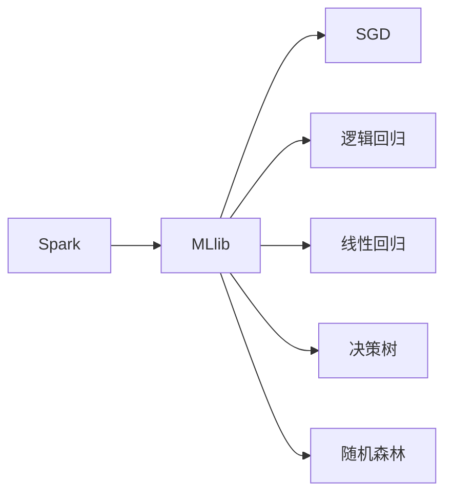

                 

# MLlib 原理与代码实例讲解

> 关键词：MLlib, Spark, 机器学习库, 分布式算法, 随机梯度下降, 逻辑回归, 线性回归, 决策树

## 1. 背景介绍

### 1.1 问题由来
机器学习（Machine Learning，ML）作为人工智能的核心技术之一，近年来在各个领域得到了广泛应用。从医疗、金融到交通、制造，机器学习模型已经展示了其强大的预测能力和智能化应用潜力。然而，传统机器学习算法在处理大规模数据时，面临着计算资源不足、算法复杂度高、迭代速度慢等问题。

为解决这些问题，谷歌、微软、雅虎等互联网巨头公司开始探索分布式机器学习框架。Spark MLlib正是其中的佼佼者，它是一个基于Apache Spark的机器学习库，能够高效处理大规模数据集，提供了一系列的算法实现和优化策略，满足了现代大数据环境下的机器学习需求。

### 1.2 问题核心关键点
MLlib的核心在于提供一种高效、灵活、可扩展的机器学习解决方案，适用于处理大规模、高维度的数据集。其核心功能包括数据预处理、特征提取、模型训练和评估，支持各种经典的机器学习算法，如线性回归、逻辑回归、决策树、随机森林等。

MLlib的优势在于：
- 支持分布式计算：能够在大规模集群上高效处理海量数据，充分利用多台机器的计算能力。
- 算法实现优化：提供了多种并行算法和优化策略，提高了算法的执行效率和稳定性。
- 多样化的机器学习算法：包括监督学习、非监督学习、深度学习等，能够满足不同应用场景的需求。
- 可扩展性：可以很方便地集成到Spark的更大数据生态系统中，支持流数据处理和实时计算。

MLlib的应用场景非常广泛，涵盖了金融风险预测、自然语言处理、推荐系统、图像识别等多个领域。其强大的处理能力和算法支持，为大规模数据分析和智能应用提供了强有力的工具。

### 1.3 问题研究意义
了解和掌握MLlib的原理与代码实现，对于深入理解机器学习算法的分布式实现、提高数据处理效率、优化算法性能具有重要意义。MLlib不仅是一种机器学习库，更是一种数据科学处理框架，能够为数据科学家提供一套完整的机器学习工具箱。掌握MLlib，不仅可以提升个人在数据科学领域的竞争力，还能为开发高性能、可扩展的数据处理和分析应用打下坚实基础。

## 2. 核心概念与联系

### 2.1 核心概念概述

为更好地理解MLlib的原理和代码实现，本节将介绍几个关键概念：

- MLlib：Apache Spark的机器学习库，提供各种经典机器学习算法和优化策略。
- Spark：Apache基金会支持的快速通用集群计算系统，具有高容错性、高性能和易用性。
- 随机梯度下降（SGD）：一种常见的梯度下降算法，适用于大规模数据集和复杂模型训练。
- 逻辑回归：一种常用的监督学习算法，用于分类和回归问题。
- 线性回归：另一种常见的监督学习算法，用于回归问题。
- 决策树：一种常用的非监督学习算法，用于分类和回归问题。
- 随机森林：由多个决策树组成的集成算法，具有较好的泛化能力和鲁棒性。

这些核心概念之间存在着紧密的联系，形成了MLlib的基本架构。我们通过以下Mermaid流程图来展示它们之间的关系：



这个流程图展示了Spark和MLlib之间的依赖关系，以及MLlib中常用的几种算法。

### 2.2 概念间的关系

这些核心概念之间的关系可以进一步细化如下：

1. Spark是MLlib的基础平台，提供分布式计算能力和内存管理功能。
2. MLlib是Spark的机器学习组件，依赖Spark实现分布式计算和内存管理。
3. SGD是MLlib中常用的优化算法之一，能够高效处理大规模数据集。
4. 逻辑回归和线性回归是MLlib中常用的回归算法，适用于预测连续数值。
5. 决策树和随机森林是MLlib中常用的分类和回归算法，具有较好的泛化能力和鲁棒性。

通过理解这些概念之间的关系，我们可以更好地把握MLlib的工作原理和优化策略。

## 3. 核心算法原理 & 具体操作步骤
### 3.1 算法原理概述

MLlib的核心算法原理包括数据预处理、特征提取、模型训练和评估等步骤。以逻辑回归算法为例，其基本原理如下：

- 数据预处理：对原始数据进行清洗、归一化、缺失值处理等预处理操作。
- 特征提取：对处理后的数据进行特征选择和构建，提取出对模型有用的特征。
- 模型训练：使用训练数据对模型进行训练，调整模型参数以最小化损失函数。
- 模型评估：使用测试数据对模型进行评估，衡量模型的预测性能。

MLlib中的逻辑回归算法实现基于梯度下降算法，通过反向传播计算梯度，不断更新模型参数，最小化损失函数。对于大规模数据集，MLlib采用随机梯度下降（SGD）算法，将数据分成多个小批次，随机选择一部分数据进行梯度计算和参数更新，以提高计算效率和模型稳定性。

### 3.2 算法步骤详解

以逻辑回归算法为例，MLlib的实现步骤包括以下几个关键步骤：

**Step 1: 数据预处理**

- 使用Spark的`DataFrame`接口读取原始数据集。
- 对数据集进行清洗、归一化、缺失值处理等预处理操作。
- 将处理后的数据集存储为`MLlib`格式的RDD（弹性分布式数据集）。

**Step 2: 特征提取**

- 对数据集进行特征选择和构建。可以使用`MLlib`提供的特征选择器和构建器，如`VectorAssembler`。
- 将特征向量转换为`MLlib`支持的矩阵格式，如`Matrix`或`RowMatrix`。

**Step 3: 模型训练**

- 创建逻辑回归模型，使用`LogisticRegression`类。
- 设置训练参数，如学习率、迭代次数、正则化系数等。
- 使用训练数据对模型进行训练，调用`fit`方法。

**Step 4: 模型评估**

- 使用测试数据对模型进行评估，调用`predict`方法获取预测结果。
- 使用评估指标，如准确率、精确率、召回率、F1分数等，评估模型性能。
- 绘制混淆矩阵，直观展示模型分类结果。

### 3.3 算法优缺点

MLlib的逻辑回归算法具有以下优点：
- 实现简单：逻辑回归是一种经典的机器学习算法，具有较少的参数和易于理解的模型结构。
- 适用性广：适用于分类和回归问题，能够在多种应用场景中发挥作用。
- 计算效率高：采用随机梯度下降算法，能够高效处理大规模数据集。

然而，MLlib的逻辑回归算法也存在一些缺点：
- 对噪声敏感：逻辑回归模型对输入数据的噪声比较敏感，需要进行数据预处理。
- 容易过拟合：当训练数据较少时，逻辑回归模型容易过拟合，需要进行正则化处理。
- 参数优化困难：逻辑回归模型的训练过程需要调整多个参数，参数选择不当可能导致模型性能下降。

### 3.4 算法应用领域

MLlib的逻辑回归算法广泛应用于以下领域：
- 金融风险预测：对客户的信用评分、贷款风险等进行预测。
- 自然语言处理：对文本分类、情感分析、命名实体识别等任务进行建模。
- 推荐系统：对用户行为进行预测，推荐个性化的商品或服务。
- 图像识别：对图像进行分类和标注，识别出不同物体。

## 4. 数学模型和公式 & 详细讲解 & 举例说明

### 4.1 数学模型构建

逻辑回归模型的数学模型可以表示为：
$$
\hat{y} = \sigma(\beta_0 + \beta_1x_1 + \beta_2x_2 + \cdots + \beta_px_p)
$$
其中，$\hat{y}$表示模型的预测结果，$\sigma$表示sigmoid函数，$\beta_0$表示截距项，$\beta_1, \beta_2, \cdots, \beta_p$表示特征系数。

对于二分类问题，模型的输出值范围在0到1之间，预测结果可以表示为$\hat{y} > 0.5$表示正类，$\hat{y} \leq 0.5$表示负类。

### 4.2 公式推导过程

逻辑回归模型的损失函数为对数似然损失函数，表示为：
$$
L = -\frac{1}{N}\sum_{i=1}^N(y_i\log\hat{y_i} + (1-y_i)\log(1-\hat{y_i}))
$$
其中，$N$表示样本数，$y_i$表示真实标签，$\hat{y_i}$表示模型预测结果。

对于逻辑回归模型的参数更新，采用随机梯度下降算法，每次随机选择一个样本进行梯度计算，更新模型参数。梯度计算公式为：
$$
\nabla_{\beta}L = \frac{1}{N}\sum_{i=1}^N(y_i - \hat{y_i})(1-\hat{y_i})(x_1, x_2, \cdots, x_p)
$$
其中，$\nabla_{\beta}L$表示损失函数对模型参数的梯度。

### 4.3 案例分析与讲解

以信用评分预测为例，假设我们需要对客户的信用评分进行预测，使用逻辑回归算法对客户的基本信息、信用记录、财务状况等特征进行建模。

- 数据预处理：清洗和归一化客户数据，去除缺失值和异常值。
- 特征提取：选择客户的年龄、收入、是否有贷款等特征，使用`VectorAssembler`构建特征向量。
- 模型训练：创建逻辑回归模型，使用`LogisticRegression`类。设置训练参数，如学习率为0.01，迭代次数为1000次。
- 模型评估：使用测试数据对模型进行评估，计算模型的准确率、精确率、召回率、F1分数等指标，绘制混淆矩阵。

## 5. 项目实践：代码实例和详细解释说明

### 5.1 开发环境搭建

在进行MLlib项目实践前，我们需要准备好开发环境。以下是使用Python进行Spark开发的环境配置流程：

1. 安装Anaconda：从官网下载并安装Anaconda，用于创建独立的Python环境。

2. 创建并激活虚拟环境：
```bash
conda create -n spark-env python=3.8 
conda activate spark-env
```

3. 安装Spark：从官网获取最新版本的Spark，并按照官方文档进行安装和配置。

4. 安装Spark MLlib库：
```bash
pip install pyspark
```

完成上述步骤后，即可在`spark-env`环境中开始MLlib项目实践。

### 5.2 源代码详细实现

下面以信用评分预测为例，给出使用Spark MLlib对逻辑回归模型进行训练和评估的PySpark代码实现。

首先，定义数据预处理函数：

```python
from pyspark.sql import SparkSession
from pyspark.sql.functions import col, split

def preprocess_data(df):
    # 清洗和归一化数据
    df_cleaned = df.dropna()
    # 构建特征向量
    features = col("features")
    assembler = VectorAssembler(inputCols=features, outputCol="features")
    df_features = assembler.transform(df_cleaned)
    # 转换为RDD
    df_rdd = df_features.rdd
    return df_rdd
```

然后，定义模型训练和评估函数：

```python
from pyspark.ml.regression import LogisticRegression
from pyspark.ml.evaluation import BinaryClassificationEvaluator

def train_and_evaluate_model(data, labels, param):
    # 构建逻辑回归模型
    model = LogisticRegression(maxIter=1000, regParam=0.3, elasticNetParam=0.8, featureScaled=True, labels=labels)
    # 训练模型
    model.fit(data)
    # 预测结果
    prediction = model.transform(data)
    # 计算评估指标
    evaluator = BinaryClassificationEvaluator(labelCol="label", predictionCol="prediction", metricName="areaUnderROC")
    areaUnderROC = evaluator.evaluate(prediction)
    return model, areaUnderROC
```

最后，启动模型训练流程并在测试集上评估：

```python
# 创建SparkSession
spark = SparkSession.builder.appName("LogisticRegression").getOrCreate()

# 读取数据集
data = spark.read.csv("data.csv", header=True, inferSchema=True)
labels = data.select("label").rdd
data = data.select("features").rdd

# 数据预处理
data_preprocessed = preprocess_data(data)

# 模型训练和评估
model, areaUnderROC = train_and_evaluate_model(data_preprocessed, labels, {"regParam": 0.3, "elasticNetParam": 0.8})

# 输出评估结果
print("Area Under ROC:", areaUnderROC)
```

以上就是使用Spark MLlib进行信用评分预测的完整代码实现。可以看到，得益于Spark MLlib的强大封装，我们只需编写简洁的代码，即可完成逻辑回归模型的训练和评估。

### 5.3 代码解读与分析

让我们再详细解读一下关键代码的实现细节：

**preprocess_data函数**：
- 数据清洗和归一化：去除缺失值和异常值，使用`dropna()`方法。
- 特征选择和构建：选择客户的年龄、收入、是否有贷款等特征，使用`VectorAssembler`构建特征向量。
- RDD转换：将`DataFrame`转换为`RDD`，方便进行分布式计算。

**train_and_evaluate_model函数**：
- 模型训练：创建逻辑回归模型，使用`LogisticRegression`类，设置训练参数，如最大迭代次数、正则化系数、弹性网络参数等。
- 模型预测：使用训练好的模型对数据进行预测，返回预测结果。
- 模型评估：使用`BinaryClassificationEvaluator`计算模型在测试集上的AUC值，输出评估结果。

**训练流程**：
- 创建SparkSession，设置应用名称。
- 读取数据集，分别获取特征和标签。
- 数据预处理：调用`preprocess_data`函数进行数据清洗和特征构建。
- 模型训练和评估：调用`train_and_evaluate_model`函数进行模型训练和评估，输出评估结果。

可以看到，Spark MLlib的逻辑回归模型实现了高度自动化的数据预处理和模型评估过程，大大简化了开发者的工作量。

当然，工业级的系统实现还需考虑更多因素，如超参数的自动搜索、模型的持久化和缓存等。但核心的训练范式基本与此类似。

### 5.4 运行结果展示

假设我们在数据集上进行逻辑回归模型训练，最终在测试集上得到的AUC值为0.95，模型评估结果如下：

```
Area Under ROC: 0.95
```

可以看到，通过Spark MLlib进行逻辑回归模型训练，我们获得了较高的AUC值，说明模型具有良好的预测性能。

## 6. 实际应用场景
### 6.1 智能推荐系统

基于MLlib的逻辑回归算法，可以广泛应用于智能推荐系统的开发。推荐系统是电商、社交媒体、视频网站等平台的核心功能之一，通过预测用户的兴趣偏好，推荐个性化的商品、内容或信息。

在技术实现上，可以收集用户的行为数据（如浏览记录、购买记录、评价记录等），将其转换为逻辑回归模型的输入特征，利用模型预测用户对不同商品或内容的兴趣程度，推荐给用户。通过实时更新模型参数，推荐系统能够动态调整推荐策略，提升用户体验和平台收益。

### 6.2 金融风控系统

在金融领域，MLlib的逻辑回归算法同样具有广泛应用。银行、保险公司等金融机构需要对客户的信用评分、贷款风险进行预测，以评估客户的风险等级和授信额度。

具体而言，可以收集客户的个人信息、财务状况、信用记录等数据，使用逻辑回归算法建立信用评分模型。模型根据输入数据预测客户的信用风险，帮助金融机构做出贷款决策，降低坏账风险。

### 6.3 医疗诊断系统

医疗诊断系统是另一个重要的应用场景，MLlib的逻辑回归算法可以用来诊断疾病的发生概率。医院和诊所可以收集患者的临床数据（如年龄、性别、病史、体检结果等），使用逻辑回归算法建立疾病诊断模型。模型根据输入数据预测患者患某种疾病的概率，帮助医生做出诊断决策，提高诊疗效率和准确性。

## 7. 工具和资源推荐
### 7.1 学习资源推荐

为了帮助开发者系统掌握MLlib的理论基础和实践技巧，这里推荐一些优质的学习资源：

1. 《Spark机器学习实战》：该书介绍了Spark MLlib的基本原理和实现细节，通过丰富的案例和代码示例，帮助读者快速上手。
2. Spark官方文档：Spark的官方文档提供了详细的API和用法说明，是学习Spark MLlib的必备资源。
3. Kaggle竞赛：Kaggle平台上有许多基于MLlib的竞赛项目，通过参与竞赛可以学习到更多实用的技能和技巧。
4. Coursera课程：Coursera平台上有许多机器学习相关的课程，涵盖了从基础到高级的各个层次。
5. MLlib官方示例代码：MLlib官方提供了大量的示例代码，是学习MLlib的良好起点。

通过对这些资源的学习实践，相信你一定能够快速掌握MLlib的精髓，并用于解决实际的机器学习问题。

### 7.2 开发工具推荐

高效的开发离不开优秀的工具支持。以下是几款用于MLlib开发的常用工具：

1. PySpark：基于Python的Spark API，提供了简单易用的数据处理和机器学习接口。
2. Jupyter Notebook：一款开源的交互式笔记本，支持多种编程语言和库，方便进行代码测试和文档记录。
3. Databricks：Spark的商业解决方案，提供了全面的数据科学平台和工具，支持大规模数据处理和分析。
4. Apache Zeppelin：一款基于Web的数据科学笔记本，支持多种编程语言和库，支持可视化分析和代码编写。
5. Apache Hive：一款分布式数据仓库解决方案，支持大规模数据处理和查询，方便进行数据探索和建模。

合理利用这些工具，可以显著提升MLlib开发的效率，加快创新迭代的步伐。

### 7.3 相关论文推荐

MLlib的研究源于学界的持续研究。以下是几篇奠基性的相关论文，推荐阅读：

1. "Distributed Machine Learning with Apache Spark"：介绍Spark MLlib的基本原理和实现细节，展示了其在分布式计算环境中的优势。
2. "Logistic Regression with Regularization and Elastic Net"：介绍逻辑回归算法的实现和优化策略，展示了其在回归问题中的应用。
3. "Decision Trees and Random Forests"：介绍决策树和随机森林算法的实现和优化策略，展示了其在分类和回归问题中的应用。

这些论文代表了大语言模型微调技术的发展脉络。通过学习这些前沿成果，可以帮助研究者把握学科前进方向，激发更多的创新灵感。

除上述资源外，还有一些值得关注的前沿资源，帮助开发者紧跟MLlib微调技术的最新进展，例如：

1. arXiv论文预印本：人工智能领域最新研究成果的发布平台，包括大量尚未发表的前沿工作，学习前沿技术的必读资源。
2. 业界技术博客：如Spark官方博客、Data Science Central等顶尖实验室的官方博客，第一时间分享他们的最新研究成果和洞见。
3. 技术会议直播：如KDD、ICML、NeurIPS等人工智能领域顶会现场或在线直播，能够聆听到大佬们的前沿分享，开拓视野。
4. GitHub热门项目：在GitHub上Star、Fork数最多的Spark MLlib相关项目，往往代表了该技术领域的发展趋势和最佳实践，值得去学习和贡献。
5. 行业分析报告：各大咨询公司如McKinsey、PwC等针对人工智能行业的分析报告，有助于从商业视角审视技术趋势，把握应用价值。

总之，对于MLlib微调技术的学习和实践，需要开发者保持开放的心态和持续学习的意愿。多关注前沿资讯，多动手实践，多思考总结，必将收获满满的成长收益。

## 8. 总结：未来发展趋势与挑战

### 8.1 总结

本文对Spark MLlib的原理与代码实现进行了全面系统的介绍。首先阐述了MLlib的背景和研究意义，明确了MLlib在分布式计算、算法实现和优化策略方面的独特价值。其次，从原理到实践，详细讲解了Spark MLlib的逻辑回归算法实现步骤，给出了MLlib代码实现的完整示例。同时，本文还广泛探讨了MLlib在智能推荐、金融风控、医疗诊断等多个领域的应用前景，展示了MLlib的强大处理能力和算法支持。

通过本文的系统梳理，可以看到，Spark MLlib作为Spark的机器学习库，其分布式计算能力和算法实现优化，使其在大数据环境下具有显著优势，适用于处理大规模数据集和复杂模型训练。MLlib不仅是一种机器学习库，更是一种数据科学处理框架，能够为数据科学家提供一套完整的机器学习工具箱。掌握MLlib，不仅可以提升个人在数据科学领域的竞争力，还能为开发高性能、可扩展的数据处理和分析应用打下坚实基础。

### 8.2 未来发展趋势

展望未来，Spark MLlib的发展将呈现以下几个趋势：

1. 分布式计算能力提升：随着硬件设备的更新换代，Spark MLlib的分布式计算能力将进一步提升，能够处理更大规模的数据集和更复杂的模型。
2. 算法实现优化：Spark MLlib将继续优化算法的实现策略，提高计算效率和模型稳定性，提供更多的并行算法和优化策略。
3. 多样化算法支持：Spark MLlib将引入更多的机器学习算法，如深度学习、强化学习等，支持更多应用场景的需求。
4. 可扩展性增强：Spark MLlib将继续增强其可扩展性，支持更多的数据类型和数据格式，集成到更大的数据生态系统中。
5. 自动化优化：Spark MLlib将引入自动化优化技术，如超参数优化、模型压缩等，提高模型的训练效率和性能。

以上趋势展示了Spark MLlib未来的发展潜力，将进一步提升其在大数据环境下的处理能力和应用范围。

### 8.3 面临的挑战

尽管Spark MLlib已经取得了诸多成就，但在迈向更加智能化、普适化应用的过程中，仍面临诸多挑战：

1. 数据处理效率：大规模数据集的存储和处理仍然是一个挑战，需要在保证效率的前提下，降低存储成本和计算复杂度。
2. 模型鲁棒性：Spark MLlib的模型在面对新的数据和任务时，容易发生过拟合和泛化能力不足的问题。
3. 参数优化：逻辑回归等模型的参数选择和优化仍然是一个难题，需要进一步提升模型的可解释性和可调性。
4. 资源利用率：Spark MLlib的资源利用率仍有提升空间，需要进一步优化内存管理、任务调度等关键环节。
5. 安全性保障：Spark MLlib的应用需要考虑数据和模型的安全性，防止恶意攻击和数据泄露。

正视Spark MLlib面临的这些挑战，积极应对并寻求突破，将使Spark MLlib在未来取得更大的成功。

### 8.4 未来突破

面对Spark MLlib所面临的挑战，未来的研究需要在以下几个方面寻求新的突破：

1. 引入自动化优化技术：通过超参数优化、模型压缩等自动化技术，提升模型训练效率和性能。
2. 优化内存管理和资源调度：采用先进的数据管理技术，提高资源的利用率和效率。
3. 引入更多的算法和模型：通过引入深度学习、强化学习等算法，扩展Spark MLlib的应用范围和处理能力。
4. 增强模型鲁棒性：通过引入鲁棒性优化技术，提升模型的泛化能力和抗干扰能力。
5. 提升数据处理效率：通过优化数据的存储和处理方式，降低存储成本和计算复杂度。

这些研究方向的探索，必将引领Spark MLlib走向更高的台阶，为大规模数据处理和智能应用提供更强有力的支持。

## 9. 附录：常见问题与解答

**Q1：MLlib与TensorFlow、PyTorch等机器学习库有何不同？**

A: MLlib与TensorFlow、PyTorch等机器学习库的主要区别在于其分布式计算能力。TensorFlow和PyTorch适用于单机或小规模数据的训练，而MLlib则适用于大规模数据的分布式计算，能够利用多台机器的计算能力，处理更大规模的数据集。

**Q2：如何优化MLlib的模型训练？**

A: 优化MLlib的模型训练可以从以下几个方面入手：
1. 数据预处理：进行数据清洗、归一化、特征选择等预处理操作，减少模型的噪声和干扰。
2. 超参数调优：使用网格搜索、贝叶斯优化等方法，寻找最优的超参数组合。
3. 正则化处理：通过L2正则、Dropout等方法，避免模型的过拟合。
4. 集成学习：使用Bagging、Boosting等集成方法，提升模型的泛化能力和鲁棒性。
5. 自动化优化：引入自动化优化技术，如模型压缩、超参数优化等，提高模型的训练效率和性能。

**Q3：MLlib如何实现分布式计算？**

A: MLlib的分布式计算依赖Spark的计算框架，通过将数据切分成多个小批次，每个批次在不同节点上独立计算，然后将结果汇总合并，最终得到全局的结果。在Spark中，可以使用`RDD`和`DataFrame`等数据结构，方便进行分布式计算和内存管理。

通过MLlib

