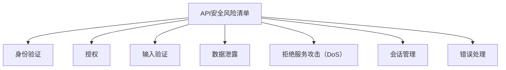

                 

# OWASP API 安全风险清单的概述

> 关键词：
- API安全
- 漏洞
- OWASP
- 安全风险
- 应用程序

## 1. 背景介绍

### 1.1 问题由来

随着Web应用程序的不断发展和微服务的普及，API（应用程序编程接口）的重要性日益凸显。API已成为连接后端系统与前端应用的桥梁，是现代Web应用的核心组成部分。然而，API的安全问题也日益严峻。由于API通常不直接暴露给用户，其安全风险往往被忽视，导致安全漏洞频发。

### 1.2 问题核心关键点

API安全风险主要集中在以下几方面：

- **身份验证和授权**：缺乏有效的身份验证机制，导致未经授权的用户可以访问API。
- **输入验证**：API未能对输入数据进行充分的验证和过滤，容易被恶意数据攻击，如SQL注入、跨站脚本攻击等。
- **数据泄露**：API未能妥善处理敏感数据，导致数据泄露风险。
- **拒绝服务攻击**：API无法有效抵御大规模的请求洪水攻击，导致服务中断。
- **未授权的资源访问**：API未能对资源的访问权限进行有效控制，导致内部资源的泄露。
- **API密钥管理不善**：API密钥泄露或被滥用，导致API被未经授权的用户访问。
- **会话管理不善**：API未能有效管理用户会话，导致会话劫持或会话固定。
- **错误处理不当**：API未能妥善处理错误和异常，导致攻击者可以通过错误响应获取敏感信息。

这些问题不仅影响API本身的安全性，还会波及整个Web应用的安全性。因此，制定一份详细的API安全风险清单至关重要。

## 2. 核心概念与联系

### 2.1 核心概念概述

- **API（应用程序编程接口）**：一组定义了软件组件之间交互的规则和协议。
- **安全风险清单**：根据OWASP（开放式Web应用安全项目）的标准，系统列出API可能面临的各种安全威胁和漏洞。
- **身份验证**：确定用户身份的过程。
- **授权**：根据用户身份和角色，决定用户是否能够访问资源。
- **输入验证**：检查输入数据是否符合预期格式和规则。
- **数据泄露**：敏感数据未得到妥善处理，导致数据泄露。
- **拒绝服务攻击（DoS）**：通过大量请求使API无法正常服务。
- **会话管理**：管理和控制用户的会话状态。
- **错误处理**：处理API中的错误和异常。

这些概念之间相互关联，共同构成API安全风险的完整框架。

### 2.2 概念间的关系

以下是一个简单的Mermaid流程图，展示了API安全风险清单中各概念之间的关系：



## 3. 核心算法原理 & 具体操作步骤

### 3.1 算法原理概述

OWASP API 安全风险清单基于威胁建模和风险评估的原理，通过系统化的方法识别和评估API可能面临的安全威胁和漏洞。其核心原理包括：

- **威胁建模**：通过建立威胁模型，确定API可能面临的威胁和攻击。
- **风险评估**：对已识别的威胁进行评估，确定其严重性和影响范围。
- **风险缓解**：提出具体的缓解措施，降低或消除风险。

### 3.2 算法步骤详解

1. **威胁建模**：识别API可能面临的各种威胁，包括身份验证、授权、输入验证等。
2. **风险评估**：对识别出的威胁进行评估，确定其严重性和影响范围。
3. **风险缓解**：提出具体的缓解措施，如身份验证策略、输入验证规则等。
4. **实现和测试**：将缓解措施落实到API的实现中，并进行充分的测试，确保其有效性。

### 3.3 算法优缺点

#### 优点：

- **全面覆盖**：清单覆盖了API可能面临的各种安全威胁和漏洞。
- **可操作性强**：每个风险都有具体的缓解措施，便于实践。
- **标准化**：基于OWASP的标准，易于理解和应用。

#### 缺点：

- **复杂度高**：对于复杂的API系统，需要投入大量时间和精力进行风险评估。
- **可能遗漏细节**：清单可能无法涵盖所有特定的安全威胁。

### 3.4 算法应用领域

API安全风险清单适用于所有使用API的Web应用程序，特别是那些涉及敏感数据或关键业务功能的系统。无论是在内部网络还是公共云环境中，都可以应用该清单来指导API的安全设计和管理。

## 4. 数学模型和公式 & 详细讲解

### 4.1 数学模型构建

OWASP API 安全风险清单主要关注API的威胁模型和风险评估，不涉及具体的数学模型。但我们可以用数学语言来描述一些基本概念和计算方法。

假设API面临的安全威胁数量为 $T$，其中第 $i$ 个威胁的严重性为 $S_i$，影响范围为 $R_i$，则风险 $R$ 可以表示为：

$$
R = \sum_{i=1}^{T} S_i \times R_i
$$

其中 $S_i$ 和 $R_i$ 通常采用评分或等级来表示。

### 4.2 公式推导过程

以下是一个简单的公式推导示例，用于计算API的安全风险：

假设API面临两种威胁：身份验证问题和数据泄露问题。身份验证问题的严重性为3，影响范围为5，数据泄露问题的严重性为5，影响范围为4。则总的风险 $R$ 为：

$$
R = S_{ID} \times R_{ID} + S_{DL} \times R_{DL} = 3 \times 5 + 5 \times 4 = 25
$$

### 4.3 案例分析与讲解

假设某API需要进行身份验证和数据泄露风险评估。根据OWASP API 安全风险清单，该API的威胁模型和风险评估过程如下：

1. **威胁建模**：识别身份验证问题和数据泄露问题。
2. **风险评估**：
   - 身份验证问题：严重性为3，影响范围为5。
   - 数据泄露问题：严重性为5，影响范围为4。
3. **风险缓解**：
   - 身份验证问题：采用强密码策略和双因素认证。
   - 数据泄露问题：采用数据加密和访问控制策略。
4. **实现和测试**：
   - 实现上述缓解措施。
   - 进行充分的测试，确保措施的有效性。

通过这个过程，API的安全性得到了有效保障。

## 5. 项目实践：代码实例和详细解释说明

### 5.1 开发环境搭建

在进行API安全风险清单的实践时，需要搭建一个基础的开发环境。以下是一些基本的开发环境搭建步骤：

1. 安装Python和必要的依赖库，如Flask、requests等。
2. 搭建虚拟环境，确保项目隔离和版本管理。
3. 使用Docker容器化API，确保环境一致性。

### 5.2 源代码详细实现

以下是一个简单的Flask API示例，演示了如何实现身份验证和授权功能：

```python
from flask import Flask, request, jsonify
from functools import wraps

app = Flask(__name__)
api_key = "my_secret_api_key"

def requires_auth(f):
    @wraps(f)
    def decorated(*args, **kwargs):
        auth = request.headers.get('Authorization')
        if not auth or auth != f"Bearer {api_key}":
            return jsonify({"error": "Unauthorized"}), 401
        return f(*args, **kwargs)
    return decorated

@app.route('/api/resource', methods=['GET'])
@requires_auth
def get_resource():
    # 处理API请求
    return jsonify({"data": "resource data"})

if __name__ == '__main__':
    app.run(debug=True)
```

### 5.3 代码解读与分析

- **Flask框架**：使用Flask框架搭建API。
- **装饰器**：定义了一个 `requires_auth` 装饰器，用于验证API请求的Authorization头部。
- **路由保护**：使用 `@requires_auth` 装饰器保护 `/api/resource` 路由。
- **错误处理**：返回401错误，表示未经授权访问。

### 5.4 运行结果展示

假设运行上述代码，访问 `/api/resource` 路由时，如果不提供正确的Authorization头部，将返回401错误：

```
{
  "error": "Unauthorized"
}
```

## 6. 实际应用场景

### 6.1 企业内部API

企业内部API通常用于连接不同系统，如内部门户、ERP系统等。这些API通常需要较强的身份验证和授权功能，以确保数据安全。

### 6.2 公共云API

公共云API如AWS Lambda、Google Cloud Functions等，面临的安全风险更多，需要更完善的防护措施。

### 6.3 第三方API

第三方API通常需要跨网络访问，面临更大的安全风险，需要严格的身份验证和授权机制。

### 6.4 未来应用展望

未来的API安全风险清单将进一步细化，涵盖更多的安全威胁和缓解措施。同时，随着AI技术的进步，API安全也将引入更多智能化手段，如威胁检测、异常识别等。

## 7. 工具和资源推荐

### 7.1 学习资源推荐

- **OWASP API Security Top 10**：OWASP官方发布的API安全十大威胁。
- **API Security Guidance**：OWASP发布的API安全指南。
- **API Security Cheat Sheet**：OWASP发布的API安全最佳实践清单。
- **Flask API Development**：Flask官方文档，详细介绍了如何使用Flask构建API。

### 7.2 开发工具推荐

- **Flask**：轻量级的Web框架，适合快速开发API。
- **Postman**：API测试工具，方便进行API的测试和调试。
- **Swagger**：API文档工具，生成API文档和UI界面。
- **OWASP ZAP**：开源的Web应用安全测试工具，可以用于API的渗透测试。

### 7.3 相关论文推荐

- **"OWASP API Security Top 10"**：OWASP发布的API安全十大威胁。
- **"API Security in Practice: Implementing the OWASP API Security Top 10"**：OWASP发布的API安全指南。
- **"Practical API Security Guidelines: Best Practices and Techniques for Secure API Development"**：OWASP发布的API安全最佳实践清单。

## 8. 总结：未来发展趋势与挑战

### 8.1 研究成果总结

OWASP API 安全风险清单为API安全提供了全面的指导，帮助开发者在系统设计和实现阶段识别和缓解安全风险。该清单不仅涵盖常见的安全威胁和缓解措施，还提供了丰富的案例分析和实践指南。

### 8.2 未来发展趋势

未来的API安全将更注重智能化和自动化，引入更多AI技术如威胁检测、异常识别等。同时，API安全将更全面地覆盖各种场景，如企业内部API、公共云API等。

### 8.3 面临的挑战

API安全面临的主要挑战包括：

- **复杂度增加**：随着API系统的复杂度增加，风险评估和缓解措施的实施难度加大。
- **跨网络安全**：跨网络的API面临更大的安全风险，需要更严格的防护措施。
- **用户习惯**：用户可能忽略API的安全风险，需要加强安全意识教育。

### 8.4 研究展望

未来的API安全研究将重点关注以下几个方向：

- **智能化安全检测**：引入AI技术，提高API安全检测的自动化和智能化水平。
- **跨网络安全防护**：研究跨网络API的安全防护措施，确保数据传输安全。
- **用户安全意识提升**：通过教育和培训，提高用户对API安全风险的认知和防范能力。

## 9. 附录：常见问题与解答

### Q1: 什么是OWASP API 安全风险清单？

A: OWASP API 安全风险清单是根据OWASP的标准，系统列出了API可能面临的各种安全威胁和漏洞。

### Q2: 如何使用OWASP API 安全风险清单？

A: 首先进行威胁建模，识别API可能面临的各种威胁。然后进行风险评估，确定威胁的严重性和影响范围。最后提出具体的缓解措施，并落实到API的实现中，并进行充分的测试。

### Q3: OWASP API 安全风险清单是否适用于所有API？

A: OWASP API 安全风险清单适用于所有使用API的Web应用程序，特别是涉及敏感数据或关键业务功能的系统。

### Q4: API安全风险清单的优点和缺点是什么？

A: 优点包括全面覆盖、可操作性强、标准化。缺点包括复杂度高、可能遗漏细节。

### Q5: API安全风险清单的未来发展方向是什么？

A: 未来的API安全将更注重智能化和自动化，引入更多AI技术如威胁检测、异常识别等。同时，API安全将更全面地覆盖各种场景，如企业内部API、公共云API等。

作者：禅与计算机程序设计艺术 / Zen and the Art of Computer Programming

