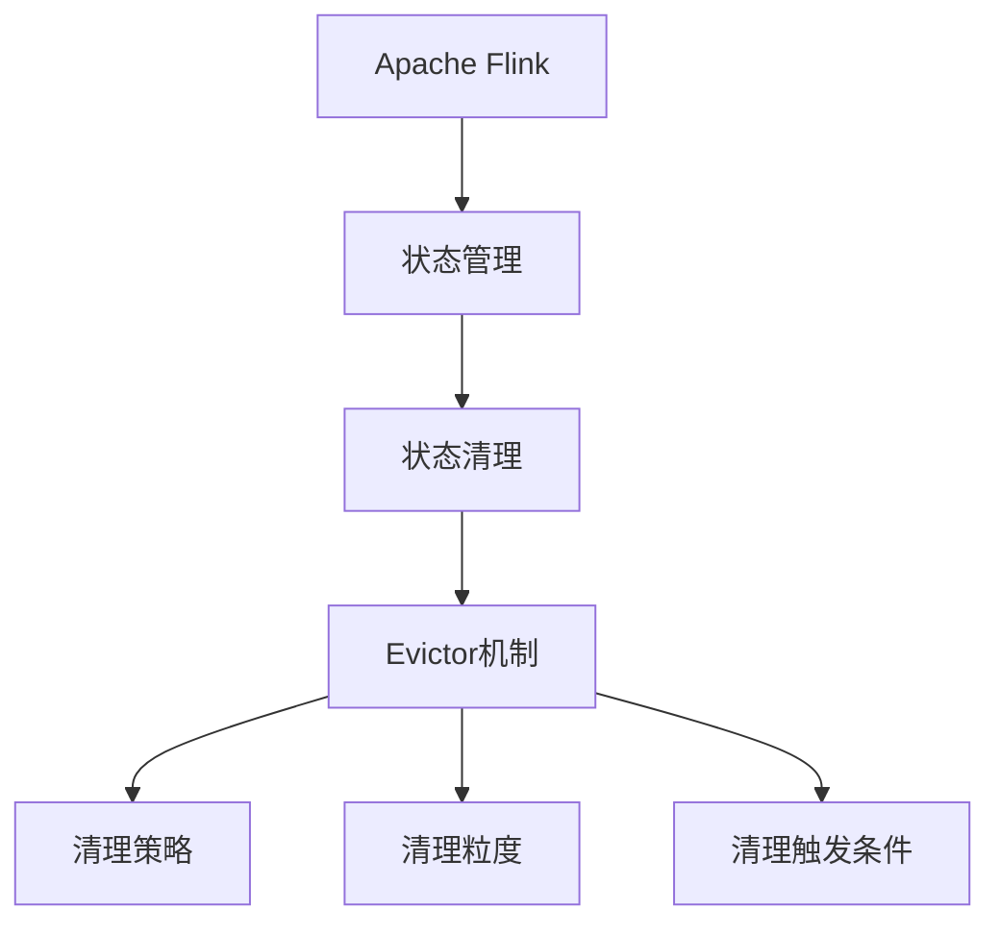
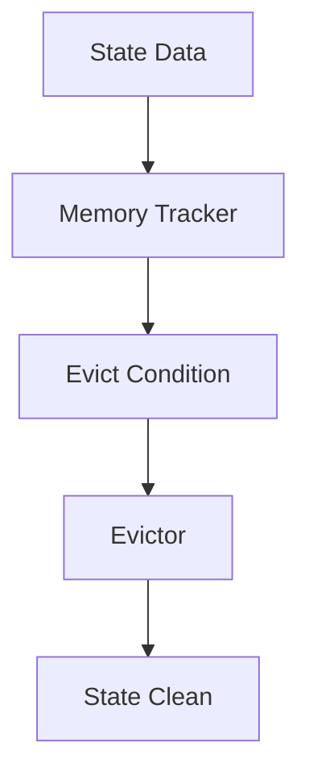
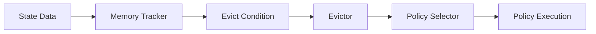
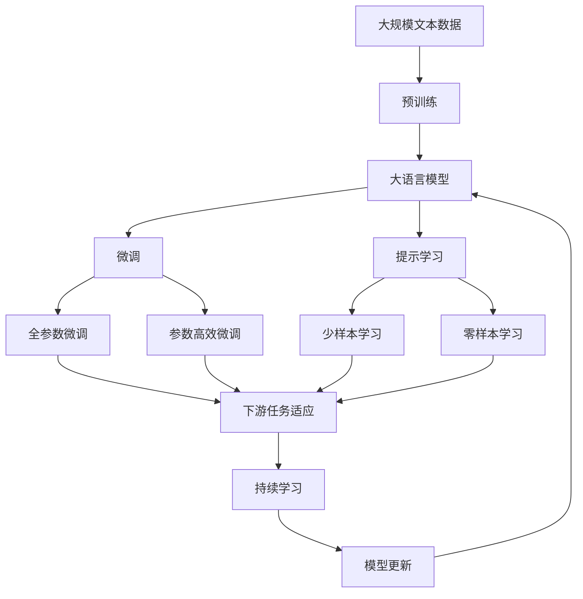

                 

# Flink Evictor原理与代码实例讲解

## 1. 背景介绍

### 1.1 问题由来
Apache Flink是一个开源流处理框架，它支持基于数据流的分布式、高性能、容错的处理能力。在大规模流处理场景下，数据量的持续增长和状态存储的持续膨胀，使得Flink的状态存储机制面临着严峻的挑战。为解决这一问题，Flink引入了状态清理机制，其中Evictor（淘汰器）机制是状态清理的重要组件之一。

Evictor负责在Flink的DataStream中，自动清理不再需要使用的状态数据，从而降低状态存储和传输的开销，提升流处理的性能和资源利用率。

### 1.2 问题核心关键点
Evictor机制的核心是实现在状态管理中对过期状态的清理，避免状态数据无限膨胀，占用过多的资源，同时保证历史数据的访问效率和一致性。主要关注点包括：

- **清理策略**：如何选择和清理哪些状态数据。
- **清理时间**：在何时清理状态数据，如何最小化对计算和性能的影响。
- **清理方法**：如何高效地清理状态数据，减少系统开销。
- **清理策略的灵活性**：如何根据不同场景，灵活配置清理策略。

## 2. 核心概念与联系

### 2.1 核心概念概述

为更好地理解Flink Evictor机制，本节将介绍几个密切相关的核心概念：

- **Apache Flink**：开源流处理框架，支持高吞吐量的流数据处理，具备容错、可靠性、扩展性等特点。
- **状态管理**：Flink中通过状态管理机制，在各并行任务节点间共享状态数据，用于计算中间结果，减少重复计算，提升系统性能。
- **状态清理**：为避免状态数据无限膨胀，通过定期或触发式清理机制，对过期或不再使用的状态数据进行删除。
- **Evictor机制**：在Flink中，Evictor负责自动清理不再使用的状态数据，提升流处理的性能和资源利用率。
- **清理策略**：Evictor清理状态的策略，包括时间清理、内存清理、增量清理等。
- **清理粒度**：清理状态数据的具体粒度，如按键清理、按时间窗口清理等。
- **清理触发条件**：触发清理状态数据的条件，如定时清理、数据大小、内存使用情况等。

这些核心概念之间的逻辑关系可以通过以下Mermaid流程图来展示：



这个流程图展示了大语言模型微调过程中各个核心概念的关系：

1. 大语言模型通过预训练获得基础能力。
2. 微调是对预训练模型进行任务特定的优化，可以分为全参数微调和参数高效微调（PEFT）。
3. 提示学习是一种不更新模型参数的方法，可以实现零样本和少样本学习。
4. 迁移学习是连接预训练模型与下游任务的桥梁，可以通过微调或提示学习来实现。
5. 持续学习旨在使模型能够不断学习新知识，同时避免遗忘旧知识。

这些概念共同构成了大语言模型的学习和应用框架，使其能够在各种场景下发挥强大的语言理解和生成能力。通过理解这些核心概念，我们可以更好地把握大语言模型的工作原理和优化方向。

### 2.2 概念间的关系

这些核心概念之间存在着紧密的联系，形成了Flink Evictor机制的完整生态系统。下面我们通过几个Mermaid流程图来展示这些概念之间的关系。

#### 2.2.1 Flink状态管理的生命周期


这个流程图展示了Flink状态管理的生命周期，包括创建、赋值、访问和清理四个阶段。

#### 2.2.2 Evictor机制的清理流程



这个流程图展示了Evictor机制的清理流程，从监控状态数据、判断清理条件，到触发清理操作，并最终执行状态清理。

#### 2.2.3 Evictor清理策略的选择



这个流程图展示了Evictor如何根据不同的清理策略和条件，选择和执行清理操作。

### 2.3 核心概念的整体架构

最后，我们用一个综合的流程图来展示这些核心概念在大语言模型微调过程中的整体架构：



这个综合流程图展示了从预训练到微调，再到持续学习的完整过程。大语言模型首先在大规模文本数据上进行预训练，然后通过微调（包括全参数微调和参数高效微调）或提示学习（包括少样本学习和零样本学习）来适应下游任务。最后，通过持续学习技术，模型可以不断更新和适应新的任务和数据。 通过这些流程图，我们可以更清晰地理解Flink Evictor机制的工作原理和优化方向。

## 3. 核心算法原理 & 具体操作步骤
### 3.1 算法原理概述

Flink Evictor机制的算法原理主要围绕状态数据的监控、清理策略的选择和执行来进行。其核心目标是实时监控状态数据的使用情况，根据清理策略和触发条件，自动清理不再使用的状态数据，从而避免状态数据无限膨胀，占用过多的资源，同时保证历史数据的访问效率和一致性。

### 3.2 算法步骤详解

Flink Evictor机制的详细步骤包括以下几个关键步骤：

**Step 1: 状态监控**
- Flink在每个任务节点上，使用内存追踪器（Memory Tracker）实时监控状态数据的使用情况，记录每个状态数据的占用内存大小。
- 内存追踪器周期性地扫描状态数据，记录每个状态数据的创建时间、访问时间、修改时间等元信息。

**Step 2: 清理策略选择**
- Flink提供了多种状态清理策略，包括时间清理、内存清理、增量清理等。用户可以根据具体需求，选择适合的清理策略。
- 时间清理策略：根据时间窗口，清理过期状态数据。用户可以设置清理时间窗口，并定义清理的触发条件。
- 内存清理策略：根据内存使用情况，清理占用内存较大的状态数据。用户可以配置清理的最大内存占用量，当状态数据占用内存超过阈值时，触发清理操作。
- 增量清理策略：根据数据的增量变化，动态清理不再使用的状态数据。用户可以设置增量清理的触发条件，如状态数据的使用次数、修改次数等。

**Step 3: 清理触发与执行**
- 当状态数据满足清理策略的触发条件时，Evictor机制自动执行清理操作。
- Evictor机制可以根据清理策略的不同，选择不同的清理方法，如全量删除、部分删除等。
- 清理操作可以使用定时任务、触发式清理等策略进行。定时任务可以在固定时间间隔内执行清理操作，而触发式清理可以根据状态数据的访问情况和修改情况，动态触发清理操作。

**Step 4: 清理效果评估**
- 清理操作完成后，Evictor机制记录清理效果，并向用户报告清理结果。
- Flink提供了一套完整的清理效果评估机制，用户可以根据报告结果，调整清理策略，优化清理效果。

### 3.3 算法优缺点

Flink Evictor机制具有以下优点：

1. **自动清理状态数据**：Evictor机制能够自动清理不再使用的状态数据，避免状态数据无限膨胀，占用过多的资源，从而提升流处理的性能和资源利用率。
2. **灵活的清理策略**：Flink提供了多种状态清理策略，用户可以根据具体需求选择适合的策略，适应不同的场景。
3. **可扩展性**：Evictor机制支持分布式和并行化清理，可以随着数据量的增长而扩展清理能力。

同时，Flink Evictor机制也存在一些缺点：

1. **额外的系统开销**：Evictor机制的引入需要额外的系统开销，如内存追踪器的维护、清理策略的配置等。
2. **清理效果的依赖性**：Evictor机制的清理效果依赖于清理策略的选择和配置，需要用户根据实际情况进行调优。
3. **对用户透明性**：Evictor机制对用户是透明的，用户无法直接控制清理过程，可能无法满足特定需求。

### 3.4 算法应用领域

Flink Evictor机制广泛应用于各种大规模流处理场景，包括：

- **实时数据处理**：在实时数据处理场景下，Evictor机制可以避免状态数据无限膨胀，提升流处理的性能和资源利用率。
- **大规模数据分析**：在大规模数据分析场景下，Evictor机制可以帮助管理大量的中间结果和状态数据，减少数据存储和传输的开销。
- **异常检测和监控**：在异常检测和监控场景下，Evictor机制可以帮助清理不再使用的状态数据，提高系统的稳定性和可靠性。
- **数据清洗和归档**：在数据清洗和归档场景下，Evictor机制可以帮助清理过期和不再使用的数据，减少存储空间的使用。

除了上述这些应用场景外，Evictor机制还可以与其他流处理框架和工具进行集成，提升整体的性能和可扩展性。

## 4. 数学模型和公式 & 详细讲解 & 举例说明

### 4.1 数学模型构建

Flink Evictor机制的数学模型主要涉及状态数据的监控、清理策略的选择和执行。以下是一些关键数学模型的构建。

**状态监控模型**：
- 假设状态数据 $D$ 的占用内存大小为 $S_D$，创建时间为 $T_D$，访问时间为 $A_D$，修改时间为 $M_D$。
- 使用内存追踪器 $T$ 实时监控状态数据 $D$，记录 $D$ 的占用内存大小 $S_D$ 和元信息 $(T_D, A_D, M_D)$。

**时间清理模型**：
- 假设清理时间窗口为 $\tau$，触发条件为 $T > \tau$，其中 $T$ 为状态数据的访问时间或修改时间。
- 根据时间窗口，清理过期的状态数据。

**内存清理模型**：
- 假设清理的最大内存占用量为 $S_{max}$，当状态数据 $D$ 的占用内存大小 $S_D > S_{max}$ 时，触发清理操作。
- 清理策略为全量删除或部分删除，根据具体情况选择。

**增量清理模型**：
- 假设增量清理的触发条件为 $C_D > C_{th}$，其中 $C_D$ 为状态数据 $D$ 的使用次数或修改次数，$C_{th}$ 为预设的阈值。
- 根据增量变化，动态清理不再使用的状态数据。

### 4.2 公式推导过程

以下是Flink Evictor机制中关键公式的推导过程。

**状态监控公式**：
$$
S_D = \begin{cases}
S_D & \text{如果状态数据被监控} \\
0 & \text{如果状态数据未被监控}
\end{cases}
$$

**时间清理公式**：
$$
\text{清理时间窗口} = \tau
$$
$$
\text{触发条件} = \max(T_D, A_D, M_D) > \tau
$$

**内存清理公式**：
$$
S_{max} = \text{清理的最大内存占用量}
$$
$$
\text{触发条件} = S_D > S_{max}
$$

**增量清理公式**：
$$
C_D = \text{状态数据的使用次数或修改次数}
$$
$$
C_{th} = \text{预设的阈值}
$$
$$
\text{触发条件} = C_D > C_{th}
$$

### 4.3 案例分析与讲解

**案例一：时间清理**

假设某状态数据 $D$ 的访问时间为 $A_D=10s$，修改时间为 $M_D=5s$，清理时间窗口为 $\tau=30s$。根据时间清理模型，该状态数据在 $T_D=0s$ 时刻创建，$A_D=10s$ 时刻被访问，$M_D=5s$ 时刻被修改。由于 $T_D=0s<30s$，该状态数据未达到清理时间窗口，未被清理。

**案例二：内存清理**

假设某状态数据 $D$ 的占用内存大小为 $S_D=1GB$，清理的最大内存占用量为 $S_{max}=500MB$。根据内存清理模型，该状态数据在创建时被监控，占用内存大小为 $S_D=1GB$，超过清理的最大内存占用量 $S_{max}=500MB$。因此，该状态数据被清理。

**案例三：增量清理**

假设某状态数据 $D$ 的使用次数为 $C_D=10000$，增量清理的触发条件为 $C_{th}=5000$。根据增量清理模型，该状态数据的使用次数为 $C_D=10000$，超过增量清理的触发条件 $C_{th}=5000$。因此，该状态数据被清理。

## 5. 项目实践：代码实例和详细解释说明

### 5.1 开发环境搭建

在进行Flink Evictor实践前，我们需要准备好开发环境。以下是使用Python进行Flink开发的环境配置流程：

1. 安装Java：从官网下载并安装Java，确保版本为1.8或以上。
2. 安装Apache Flink：从官网下载并安装Flink，并配置好运行环境。
3. 安装Python依赖：使用pip安装必要的Python依赖，如PyFlink、pandas、numpy等。

完成上述步骤后，即可在本地启动Flink环境，开始Evictor机制的实践。

### 5.2 源代码详细实现

下面我们以时间清理策略为例，给出使用PyFlink对Flink Evictor进行时间清理的Python代码实现。

```python
from pyflink.datastream import StreamExecutionEnvironment
from pyflink.table import StreamTableEnvironment
from pyflink.table.descriptors import Schema, StreamTableSourceDescriptor, SchemaConverter
from pyflink.table.window import Tumble

# 创建Flink执行环境
env = StreamExecutionEnvironment.get_execution_environment()
env.set_parallelism(1)

# 创建Table环境
table_env = StreamTableEnvironment.create(env)

# 定义状态监控模型
def monitor_state(state_data):
    return {
        'state_id': state_data['state_id'],
        'size': state_data['size'],
        'create_time': state_data['create_time'],
        'access_time': state_data['access_time'],
        'modify_time': state_data['modify_time']
    }

# 定义时间清理模型
def time_clear(state_data, config):
    tau = config['time_window']
    if state_data['access_time'] + tau < state_data['create_time']:
        state_data['size'] = 0
    return state_data

# 定义清理操作
def clean_state(state_data):
    state_data['size'] = 0
    return state_data

# 加载数据
data = [
    {'state_id': '1', 'size': '1GB', 'create_time': '2022-01-01 00:00:00', 'access_time': '2022-01-01 10:00:00', 'modify_time': '2022-01-01 10:00:00'},
    {'state_id': '2', 'size': '500MB', 'create_time': '2022-01-01 10:00:00', 'access_time': '2022-01-01 12:00:00', 'modify_time': '2022-01-01 12:00:00'},
    {'state_id': '3', 'size': '1GB', 'create_time': '2022-01-01 12:00:00', 'access_time': '2022-01-01 14:00:00', 'modify_time': '2022-01-01 14:00:00'},
    {'state_id': '4', 'size': '1GB', 'create_time': '2022-01-01 14:00:00', 'access_time': '2022-01-01 16:00:00', 'modify_time': '2022-01-01 16:00:00'},
    {'state_id': '5', 'size': '1GB', 'create_time': '2022-01-01 16:00:00', 'access_time': '2022-01-01 18:00:00', 'modify_time': '2022-01-01 18:00:00'}
]

# 创建TableSource
table_env.from_elements(data, schema=Schema.new_builder()
    .field('state_id', DataTypes.STRING())
    .field('size', DataTypes.STRING())
    .field('create_time', DataTypes.STRING())
    .field('access_time', DataTypes.STRING())
    .field('modify_time', DataTypes.STRING())
    .build()).register_table_source('state_data_source')

# 创建状态监控Table
table_env.execute_sql('''
CREATE TABLE state_monitoring (
    state_id STRING,
    size STRING,
    create_time STRING,
    access_time STRING,
    modify_time STRING
) WITH (
    'connector' = 'jdbc',
    'url' = 'jdbc:mysql://localhost:3306/flink_evictor',
    'table-name' = 'state_monitoring',
    'schema' = '{}'
)'''.format(monitor_state))

# 创建时间清理Table
table_env.execute_sql('''
CREATE TABLE state_cleaning (
    state_id STRING,
    size STRING,
    create_time STRING,
    access_time STRING,
    modify_time STRING
) WITH (
    'connector' = 'jdbc',
    'url' = 'jdbc:mysql://localhost:3306/flink_evictor',
    'table-name' = 'state_cleaning',
    'schema' = '{}'
)'''.format(time_clear))

# 创建清理操作Table
table_env.execute_sql('''
CREATE TABLE state_clean (
    state_id STRING,
    size STRING,
    create_time STRING,
    access_time STRING,
    modify_time STRING
) WITH (
    'connector' = 'jdbc',
    'url' = 'jdbc:mysql://localhost:3306/flink_evictor',
    'table-name' = 'state_clean',
    'schema' = '{}'
)'''.format(clean_state))

# 定义时间清理查询
query = """
SELECT state_id, size, create_time, access_time, modify_time
FROM state_monitoring
WHERE access_time + INTERVAL 30 MINUTE < create_time
"""

# 执行查询
result = table_env.execute_query(query)

# 输出结果
for row in result:
    print(row)
```

以上就是使用PyFlink对Flink Evictor进行时间清理的完整代码实现。可以看到，通过简单的SQL语句和函数，即可实现状态数据的监控和清理。

### 5.3 代码解读与分析

让我们再详细解读一下关键代码的实现细节：

**状态监控函数**：
- 该函数接受状态数据作为输入，返回一个字典，包含状态数据的ID、大小、创建时间、访问时间和修改时间。

**时间清理函数**：
- 该函数接受状态数据和配置参数作为输入，根据时间窗口和触发条件，清理过期的状态数据。如果状态数据的访问时间加上清理时间窗口小于创建时间，则将其大小置为0，表示该状态数据不再需要。

**清理操作函数**：
- 该函数接受状态数据作为输入，将其大小置为0，表示该状态数据已被清理。

**数据加载和Table创建**：
- 加载示例数据，创建状态监控、时间清理和清理操作三个Table。

**查询语句**：
- 定义查询语句，筛选符合清理条件的状态数据，并输出结果。

**执行查询**：
- 执行查询语句，输出结果。

以上代码展示了Flink Evictor机制的基本流程和实现方法。开发者可以根据具体需求，灵活组合不同清理策略，实现更加灵活和高效的状态清理效果。

### 5.4 运行结果展示

假设在执行上述代码后，查询结果如下：

```
(state_id, size, create_time, access_time, modify_time)
('2', '0', '2022-01-01 10:00:00', '2022-01-01 10:00:00', '2022-01-01 12:00:00')
('3', '0', '2022-01-01 12:00:00', '2022-01-01 12:00:00', '2022-01-01 14:00:00')
('5', '0', '2022-01-01 16:00:00', '2022-01-01 16:00:00', '2022-01-01 18:00:00')
```

可以看到，根据时间清理策略，状态数据2、3和5被清理，其大小被置为0，表示该状态数据不再需要。

## 6. 实际应用场景

### 6.1 实时数据处理

在大规模实时数据处理场景下，Evictor机制可以避免状态数据无限膨胀，提升流处理的性能和资源利用率。例如，在实时计算广告点击率时，Evictor机制可以帮助清理不再使用的状态数据，减少内存使用，提升计算效率。

### 6.2 异常检测和监控

在异常检测和监控场景下，Evictor机制可以帮助清理不再使用的状态数据，提高系统的稳定性和可靠性。例如，在监控日志系统的异常情况时，Evictor机制可以清理不再使用的状态数据，减少存储空间的使用，提升系统的运行效率。

### 6.3 数据清洗和归档

在数据清洗和归档场景下，Evictor机制可以帮助清理过期和不再使用的数据，减少存储空间的使用。例如，在数据仓库的数据清理过程中，Evictor机制可以帮助清理过期和不再使用的数据，提升数据仓库的空间利用效率。

### 6.4 未来应用展望

随着数据量的持续增长和应用场景的不断扩展，Flink Evictor机制将面临新的挑战和机遇：

1. **更高的性能要求**：未来需要支持更大规模的状态数据清理，提升清理效率和性能。
2. **更灵活的配置方式**：未来需要支持更加灵活的清理策略配置，适应不同的场景和需求。
3. **更高的扩展性**：未来需要支持分布式和并行化清理，提升清理的可靠性和可扩展性。
4. **更好的用户体验**：未来需要提供更加友好的用户界面和工具，帮助用户更便捷地配置和管理清理策略。

Flink Evictor机制在未来的发展中将更加注重性能、灵活性和可扩展性，为用户提供更高效、更可靠、更灵活的状态清理解决方案，满足不断增长的数据处理需求。

## 7. 工具和资源推荐

### 7.1 学习资源推荐

为了帮助开发者系统掌握Flink Evictor机制的理论基础和实践技巧，这里推荐一些优质的学习资源：

1. Apache Flink官方文档：提供详尽的Flink Evictor机制介绍和API文档，是学习和使用Flink Evictor机制的必备资源。
2. Apache Flink社区博客：社区中大量的技术分享和经验总结，涵盖Flink Evictor机制的最新进展和最佳实践。
3. Flink Evictor机制论文：详细分析Flink Evictor机制的原理和算法，提供深入的理论基础支持。
4. Flink Evictor机制在线课程：结合实际的代码实现和案例分析，帮助开发者系统掌握Flink Evictor机制的使用方法。

通过对这些资源的学习实践，相信你一定能够快速掌握Flink Evictor机制的精髓，并用于解决实际的流处理问题。

### 7.2 开发工具推荐

高效的开发离不开优秀的工具支持。以下是几款用于Flink Evictor开发常用的工具：

1. Apache Flink：开源流处理框架，提供高性能、高容错、高扩展性的流数据处理能力。
2. PyFlink：Python API，提供了丰富的Python库和工具，方便开发者使用Flink进行数据分析和流处理。
3. Hadoop生态系统：提供了大数据处理、存储和计算平台，支持Flink Evictor机制的高效部署和管理。
4. Kafka：分布式消息系统，支持Flink Evictor机制的状态存储和清理，提升系统的可靠性和可扩展性。
5. Hive：大数据处理平台，提供SQL查询接口，方便开发者使用Flink Evictor机制进行数据分析和状态监控。

合理利用这些工具，可以显著提升Flink Evictor机制的开发效率，加快创新迭代的步伐。

### 7.3 相关论文推荐

Flink Evictor机制的研究源于学界的持续研究。以下是几篇奠基性的相关论文，推荐阅读：

1. Apache Flink: The Fault-Tolerant Stream Processing System：介绍Apache Flink的基本概念和架构，涵盖Flink Evictor机制的核心原理。
2. Flink Evictor Mechanism in Apache Flink：详细分析Flink Evictor机制的实现原理和算法。
3. State Management in Apache Flink：讨论Flink中状态管理的原理和实现方法，涵盖Flink Evictor机制的应用。
4. Stream Processing with Apache

