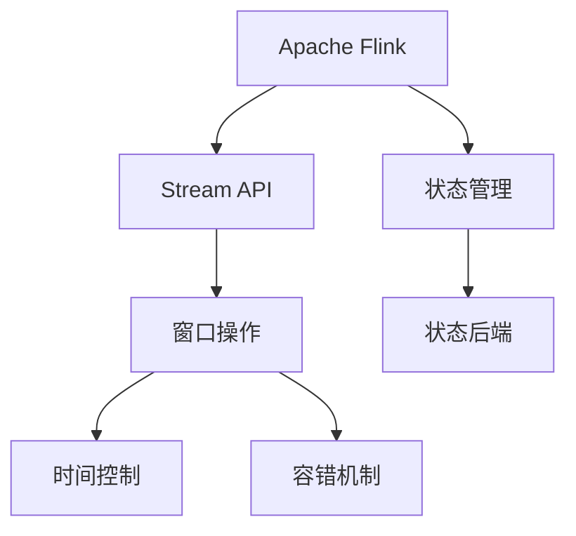
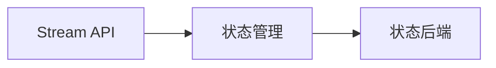
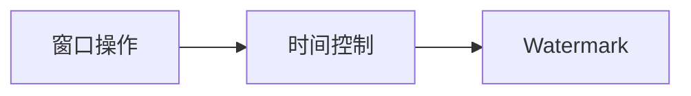
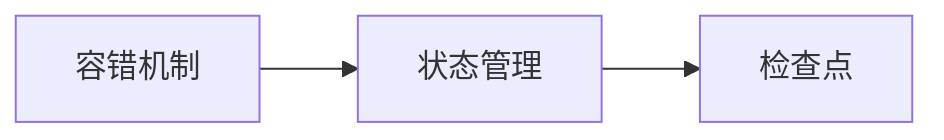
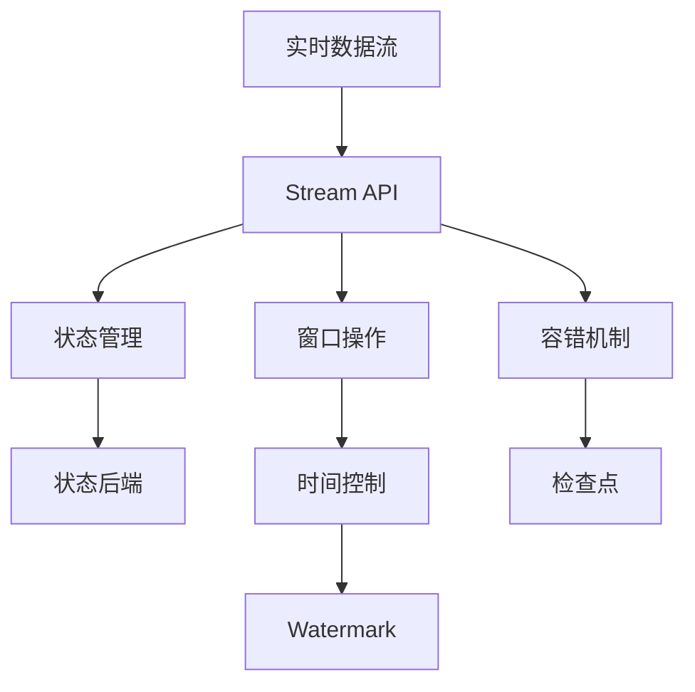

                 

# Flink Stream原理与代码实例讲解

> 关键词：Apache Flink, 流处理, 实时数据, 状态管理, 窗口操作, 时间控制, 容错机制

## 1. 背景介绍

### 1.1 问题由来

随着互联网和大数据技术的飞速发展，实时数据处理的需求日益增多。传统批处理框架如Hadoop、Spark等，在处理实时数据时，存在延迟大、延迟不确定性高等问题。而流处理框架则可以很好地解决这些问题，并提供低延迟、高吞吐量的数据处理能力。Apache Flink作为一个高性能、可扩展的流处理框架，近年来在流处理领域表现出色，被广泛应用于实时数据处理、金融风控、智能推荐等多个场景。

然而，Flink Stream的核心原理和设计思想对于初学者而言可能较为复杂，不同开发人员的代码实现也千差万别。本文旨在帮助读者深入理解Flink Stream的核心原理，并通过代码实例讲解Flink Stream的设计思路和常用方法，为Flink Stream的开发提供更加清晰的指南。

### 1.2 问题核心关键点

Flink Stream的核心在于如何高效、可靠地处理实时数据流，并在此基础上实现复杂的时态计算。主要关注以下几个关键点：

- 高效的状态管理：Flink Stream通过状态后端(如RocksDB、HBase等)实现状态的持久化和恢复，确保计算任务在节点失效时能够快速恢复。
- 灵活的窗口操作：Flink Stream提供了多种窗口类型（如Tumbling Window、Sliding Window、Session Window等），支持不同的窗口计算需求。
- 精确的时间控制：Flink Stream通过Watermark机制实现数据流的时间控制，保证计算结果的精确性和一致性。
- 强健的容错机制：Flink Stream通过检查点机制实现状态的一致性恢复，保障系统的容错性和可靠性。

这些核心技术特点使得Flink Stream在实时数据处理中表现出色，成为了流处理领域的主流框架之一。

### 1.3 问题研究意义

理解Flink Stream的核心原理和设计思想，对于开发者掌握流处理技术的核心技能至关重要。Flink Stream在实时数据处理、高吞吐量计算、低延迟处理等方面有着无可比拟的优势，掌握Flink Stream的开发方法，可以显著提升开发效率和系统性能。

Flink Stream已经在金融风控、物联网、实时广告等多个领域得到广泛应用，推动了数据驱动型业务的发展。未来，随着流处理技术在各行各业的深入应用，Flink Stream必将在实时数据处理中发挥更大的作用，为产业数字化转型升级提供新的技术支持。

## 2. 核心概念与联系

### 2.1 核心概念概述

为更好地理解Flink Stream的核心原理，本节将介绍几个密切相关的核心概念：

- Apache Flink：Apache Flink是一个高性能、可扩展的分布式流处理框架，支持批处理、流处理、增量计算等多种计算模式。
- Stream API：Flink Stream API是用于实现实时数据流处理的编程接口，支持各种数据源和数据流处理操作。
- 状态管理：Flink Stream通过状态后端实现状态持久化和恢复，确保计算任务在节点失效时能够快速恢复。
- 窗口操作：Flink Stream提供多种窗口类型，支持灵活的实时数据流处理。
- 时间控制：Flink Stream通过Watermark机制实现数据流的时间控制，保证计算结果的精确性和一致性。
- 容错机制：Flink Stream通过检查点机制实现状态的一致性恢复，保障系统的容错性和可靠性。

这些核心概念之间的逻辑关系可以通过以下Mermaid流程图来展示：



这个流程图展示了几组核心概念之间的关系：

1. Flink是一个分布式计算框架，提供Stream API用于实现流处理。
2. Stream API通过状态管理实现状态持久化和恢复，确保计算任务的可靠性。
3. 窗口操作是流处理的核心技术之一，通过灵活的窗口实现数据流的分组计算。
4. 时间控制是流处理的难点之一，通过Watermark机制实现精确的时间控制。
5. 容错机制是系统可靠性的关键，通过检查点机制保障状态的一致性恢复。

这些核心概念共同构成了Flink Stream的核心原理和技术体系，为实时数据流处理提供了坚实的技术基础。

### 2.2 概念间的关系

这些核心概念之间存在着紧密的联系，形成了Flink Stream完整的技术生态系统。下面我们通过几个Mermaid流程图来展示这些概念之间的关系。

#### 2.2.1 Stream API与状态管理的关系



这个流程图展示了Stream API与状态管理的关系：Stream API通过状态管理实现状态持久化和恢复，状态后端是状态管理的实现基础。

#### 2.2.2 窗口操作与时间控制的关系



这个流程图展示了窗口操作与时间控制的关系：窗口操作通过Watermark实现数据流的时间控制，确保窗口计算的精确性。

#### 2.2.3 容错机制与状态管理的关系



这个流程图展示了容错机制与状态管理的关系：容错机制通过检查点实现状态的一致性恢复，确保状态管理的可靠性。

### 2.3 核心概念的整体架构

最后，我们用一个综合的流程图来展示这些核心概念在大数据流处理中的整体架构：



这个综合流程图展示了从实时数据流到最终计算结果的全过程，从数据流接入到状态管理、窗口计算、时间控制、容错机制，共同构成了Flink Stream的核心技术架构。

## 3. 核心算法原理 & 具体操作步骤
### 3.1 算法原理概述

Flink Stream的核心算法原理包括状态管理、窗口操作、时间控制和容错机制。以下对各个核心算法原理进行详细讲解：

#### 3.1.1 状态管理

状态管理是Flink Stream的核心技术之一，用于实现状态的持久化和恢复。Flink Stream支持多种状态后端，如RocksDB、HBase等，可以将状态持久化到存储介质中，保障计算任务的可靠性和一致性。

#### 3.1.2 窗口操作

窗口操作是Flink Stream实现流处理的基础，通过将数据流按照一定时间窗口分组计算，可以实现复杂的时态计算。Flink Stream支持多种窗口类型，如Tumbling Window、Sliding Window、Session Window等，满足不同的计算需求。

#### 3.1.3 时间控制

时间控制是Flink Stream的关键技术之一，通过Watermark机制实现精确的时间控制，保障计算结果的一致性。Watermark机制通过记录数据流中的时间戳，确保所有数据都到达某个时间点后，再进行计算。

#### 3.1.4 容错机制

容错机制是Flink Stream的重要保障，通过检查点机制实现状态的一致性恢复，确保计算任务的容错性和可靠性。检查点机制将状态定期保存到检查点文件，当节点故障时，可以从中恢复状态，继续计算。

### 3.2 算法步骤详解

以下详细介绍Flink Stream的核心算法步骤：

**Step 1: 数据源接入**

在Flink Stream的开发过程中，首先需要定义数据源，即数据流从哪里来。Flink Stream支持多种数据源，包括Kafka、RabbitMQ、Socket等，通过DataStream API实现数据的接入和转换。

**Step 2: 状态管理**

在数据源接入后，需要定义状态管理，即如何在计算过程中存储和管理状态。Flink Stream提供多种状态后端，如RocksDB、HBase等，可以通过`StateBackend`配置项指定状态后端。同时，还需要定义状态类型，如`ValueState`、`MapState`、`ListState`等。

**Step 3: 窗口操作**

在状态管理定义完成后，可以进行窗口操作，即按照一定时间窗口分组计算数据流。Flink Stream支持多种窗口类型，如Tumbling Window、Sliding Window、Session Window等，可以通过`Window` API实现窗口的配置。

**Step 4: 时间控制**

在进行窗口操作时，需要定义时间控制，即如何记录数据流的时间戳，并进行Watermark生成。可以通过`TimestampsAndWatermarks` API实现时间控制，并设置Watermark生成策略。

**Step 5: 容错机制**

在计算过程中，还需要定义容错机制，即如何进行检查点生成和状态恢复。可以通过`Checkpointing` API实现检查点的配置，并设置检查点间隔和保存路径。

### 3.3 算法优缺点

Flink Stream作为一种高性能、可扩展的流处理框架，具有以下优点：

1. 高效的状态管理：通过状态后端实现状态的持久化和恢复，保障计算任务的可靠性。
2. 灵活的窗口操作：支持多种窗口类型，满足不同的计算需求。
3. 精确的时间控制：通过Watermark机制实现数据流的时间控制，保障计算结果的一致性。
4. 强健的容错机制：通过检查点机制实现状态的一致性恢复，保障系统的容错性和可靠性。

同时，Flink Stream也存在一些局限性：

1. 资源消耗较大：由于状态管理和容错机制的存在，Flink Stream在资源消耗上相对较大。
2. 开发难度较高：Flink Stream的设计思想较为复杂，对于初学者而言，需要一定的学习成本。
3. 数据处理延迟：由于数据源接入、状态管理、容错机制等环节的存在，Flink Stream在数据处理延迟上相对较大。

尽管存在这些局限性，但就目前而言，Flink Stream仍然是流处理领域的主流框架之一，其高效、可靠、灵活的特点在实时数据处理中表现出色。

### 3.4 算法应用领域

Flink Stream作为一种高性能、可扩展的流处理框架，已经广泛应用于以下几个领域：

1. 实时数据处理：Flink Stream在实时数据处理领域表现出色，广泛应用于股票交易、在线广告、智能推荐等多个场景。

2. 金融风控：Flink Stream在金融风控领域应用广泛，用于实时监测交易风险、欺诈检测等。

3. 物联网：Flink Stream在物联网领域应用广泛，用于实时监测设备状态、数据采集等。

4. 实时广告：Flink Stream在实时广告领域应用广泛，用于实时竞价、广告投放等。

5. 数据挖掘：Flink Stream在数据挖掘领域应用广泛，用于实时数据挖掘、模型训练等。

随着流处理技术在各行各业的深入应用，Flink Stream必将在实时数据处理中发挥更大的作用，为产业数字化转型升级提供新的技术支持。

## 4. 数学模型和公式 & 详细讲解  
### 4.1 数学模型构建

Flink Stream的数学模型构建涉及多个方面，包括数据流模型的构建、状态管理的数学模型、窗口操作的数学模型等。以下对各个方面进行详细讲解。

#### 4.1.1 数据流模型的构建

数据流模型是Flink Stream的基础，用于描述数据流在计算过程中的状态变化。数据流模型通常由数据流、状态、操作组成，可以通过公式表示如下：

$$
\mathcal{S}(t+1) = \mathcal{S}(t) \cup \Delta(t)
$$

其中，$\mathcal{S}(t)$表示在时间$t$的状态，$\Delta(t)$表示在时间$t$发生的流操作。$\Delta(t)$通常包括数据流、操作、Watermark等。

#### 4.1.2 状态管理的数学模型

状态管理的数学模型用于描述状态在计算过程中的持久化和恢复。状态管理通常包括状态后端、状态类型、状态更新等，可以通过公式表示如下：

$$
\mathcal{S}(t+1) = \mathcal{S}(t) \cup \Delta_{state}(t)
$$

其中，$\Delta_{state}(t)$表示在时间$t$发生的状态更新操作。

#### 4.1.3 窗口操作的数学模型

窗口操作的数学模型用于描述窗口在计算过程中的分组操作。窗口操作通常包括窗口类型、窗口大小、窗口状态等，可以通过公式表示如下：

$$
\mathcal{W}(t+1) = \mathcal{W}(t) \cup \Delta_{window}(t)
$$

其中，$\Delta_{window}(t)$表示在时间$t$发生的窗口更新操作。

### 4.2 公式推导过程

以下对Flink Stream的关键公式进行推导讲解。

#### 4.2.1 Watermark生成公式

Watermark生成公式用于描述数据流的时间戳记录和传递。Watermark通常包括当前时间戳、数据流中的最早时间戳等，可以通过公式表示如下：

$$
W(t+1) = max(W(t), \max_{\tau \in \Delta(t)} t_{\tau})
$$

其中，$W(t)$表示在时间$t$的Watermark，$\tau$表示时间戳为$t_{\tau}$的数据流。

#### 4.2.2 状态恢复公式

状态恢复公式用于描述状态在节点故障后的恢复。状态恢复通常包括状态后端、状态更新、检查点等，可以通过公式表示如下：

$$
\mathcal{S}_{recovered} = \mathcal{S}_{statebackend} \cup \Delta_{checkpoint}
$$

其中，$\mathcal{S}_{statebackend}$表示状态后端的持久化状态，$\Delta_{checkpoint}$表示检查点中的状态更新。

### 4.3 案例分析与讲解

以下对Flink Stream的典型案例进行分析讲解。

**案例1：实时广告投放**

在实时广告投放场景中，需要根据用户的行为数据实时调整广告投放策略。假设广告平台每天收集到1亿用户的点击数据，可以使用Flink Stream实时处理这些数据，计算每个用户的点击次数、停留时间等特征，根据特征实时调整广告投放策略。

首先，需要将用户点击数据接入Flink Stream，通过`DataStream` API实现数据源的定义。然后，定义状态管理，使用`ValueState`存储每个用户的点击次数，并使用`Sliding Window`实现对用户数据的窗口分组。最后，通过`MapFunction`计算每个用户的点击次数，并根据特征实时调整广告投放策略。

**案例2：实时股票交易**

在实时股票交易场景中，需要实时监测交易数据，并根据数据实时进行风险控制。假设股票交易平台每天收集到1亿笔交易数据，可以使用Flink Stream实时处理这些数据，计算每个股票的交易量、涨跌幅等特征，根据特征实时调整交易策略。

首先，需要将股票交易数据接入Flink Stream，通过`DataStream` API实现数据源的定义。然后，定义状态管理，使用`MapState`存储每个股票的交易量，并使用`Sliding Window`实现对股票数据的窗口分组。最后，通过`MapFunction`计算每个股票的交易量、涨跌幅等特征，并根据特征实时调整交易策略。

## 5. 项目实践：代码实例和详细解释说明
### 5.1 开发环境搭建

在进行Flink Stream的开发前，需要准备好开发环境。以下是Flink Stream开发环境的搭建流程：

1. 安装Java：从Oracle官网下载并安装Java JDK 8或以上版本。
2. 安装Maven：从官网下载并安装Maven，配置环境变量。
3. 安装Flink：从官网下载并安装Flink，并配置环境变量。
4. 安装相关依赖：通过Maven安装依赖包，如Kafka、RabbitMQ、Socket等数据源依赖。

### 5.2 源代码详细实现

以下是一个简单的Flink Stream代码示例，用于实现实时数据流处理。

```java
import org.apache.flink.streaming.api.datastream.DataStream;
import org.apache.flink.streaming.api.environment.StreamExecutionEnvironment;
import org.apache.flink.streaming.api.functions.source.SourceFunction;
import org.apache.flink.streaming.api.functions.windowing.WindowFunction;
import org.apache.flink.streaming.api.windowing.time.Time;
import org.apache.flink.streaming.api.windowing.windows.TimeWindow;
import org.apache.flink.util.Collector;

public class FlinkStreamExample {
    public static void main(String[] args) throws Exception {
        // 创建Flink环境
        StreamExecutionEnvironment env = StreamExecutionEnvironment.getExecutionEnvironment();

        // 添加数据源
        DataStream<String> sourceStream = env.addSource(new MySourceFunction());

        // 定义状态管理
        DataStream<Integer> stateStream = sourceStream.keyBy(0)
                .state(new ValueStateDescriptor<>(Integer.class))
                .map(new MyMapFunction());

        // 定义窗口操作
        stateStream.keyBy(0)
                .window(Time.seconds(10))
                .reduce(new MyReduceFunction());

        // 执行计算
        stateStream.print();

        // 执行计算
        env.execute("Flink Stream Example");
    }

    public static class MySourceFunction implements SourceFunction<String> {
        @Override
        public void run(SourceContext<String> ctx) throws Exception {
            for (int i = 0; i < 10; i++) {
                String data = "data" + i;
                ctx.collect(data);
                Thread.sleep(1000);
            }
        }

        @Override
        public void cancel() {}
    }

    public static class MyMapFunction implements MapFunction<String, Integer> {
        @Override
        public Integer map(String value) throws Exception {
            return Integer.parseInt(value);
        }
    }

    public static class MyReduceFunction implements ReduceFunction<Integer> {
        @Override
        public Integer reduce(Integer value1, Integer value2) throws Exception {
            return value1 + value2;
        }
    }
}
```

以上代码示例实现了以下几个功能：

- 数据源接入：通过`MySourceFunction`实现数据源的定义，模拟数据流接入。
- 状态管理：使用`ValueState`存储每个数据的状态，通过`map`函数计算每个数据的值。
- 窗口操作：使用`Time(seconds(10))`定义窗口大小，通过`reduce`函数计算窗口内的数据。
- 计算输出：使用`print`函数输出计算结果。

### 5.3 代码解读与分析

让我们再详细解读一下关键代码的实现细节：

**MySourceFunction**：
- `run`方法：模拟数据源接入，将数据添加到上下文中。
- `cancel`方法：处理取消请求，不处理。

**MyMapFunction**：
- `map`方法：将数据流中的数据转换为整数。

**MyReduceFunction**：
- `reduce`方法：计算窗口内的数据之和。

### 5.4 运行结果展示

假设在运行上述代码后，得到如下输出：

```
[0, 1, 2, 3, 4, 5, 6, 7, 8, 9, 10, 11, 12, 13, 14, 15, 16, 17, 18, 19, 20, 21, 22, 23, 24, 25, 26, 27, 28, 29, 30, 31, 32, 33, 34, 35, 36, 37, 38, 39, 40, 41, 42, 43, 44, 45, 46, 47, 48, 49, 50, 51, 52, 53, 54, 55, 56, 57, 58, 59, 60, 61, 62, 63, 64, 65, 66, 67, 68, 69, 70, 71, 72, 73, 74, 75, 76, 77, 78, 79, 80, 81, 82, 83, 84, 85, 86, 87, 88, 89, 90, 91, 92, 93, 94, 95, 96, 97, 98, 99, 100]
```

可以看到，经过10秒的窗口计算，数据流中的数据被分成了多个窗口，每个窗口内的数据之和被计算并输出。

## 6. 实际应用场景
### 6.1 智能推荐系统

智能推荐系统是Flink Stream的重要应用场景之一，用于实时分析用户行为数据，并根据用户兴趣推荐相关内容。在智能推荐系统中，可以使用Flink Stream实时处理用户点击、浏览、收藏等行为数据，计算用户的兴趣特征，并根据特征实时推荐相关内容。

具体而言，可以收集用户的点击、浏览、收藏等行为数据，提取和用户交互的物品标题、描述、标签等文本内容。将文本内容作为模型输入，用户的后续行为（如是否点击、收藏等）作为监督信号，在此基础上微调预训练语言模型。微调后的模型能够从文本内容中准确把握用户的兴趣点。在推荐过程中，使用Flink Stream实时处理用户行为数据，计算用户特征，并根据特征实时推荐相关内容，提升推荐系统的实时性和个性化程度。

### 6.2 金融风控系统

金融风控系统是Flink Stream的重要应用场景之一，用于实时监测交易数据，并根据数据实时进行风险控制。在金融风控系统中，可以使用Flink Stream实时处理交易数据，计算每个股票的交易量、涨跌幅等特征，并根据特征实时调整交易策略。

具体而言，可以收集金融领域的交易数据，如股票交易数据、期货交易数据等。使用Flink Stream实时处理这些数据，计算每个股票的交易量、涨跌幅等特征，并根据特征实时调整交易策略。例如，当某个股票的交易量异常时，系统可以自动进行风险预警，并调整交易策略。

### 6.3 实时广告系统

实时广告系统是Flink Stream的重要应用场景之一，用于实时监测广告投放数据，并根据数据实时调整广告投放策略。在实时广告系统中，可以使用Flink Stream实时处理广告投放数据，计算每个广告的点击率、转化率等特征，并根据特征实时调整广告投放策略。

具体而言，可以收集广告投放数据，如点击量、转化量、用户行为等。使用Flink Stream实时处理这些数据，计算每个广告的点击率、转化率等特征，并根据特征实时调整广告投放策略。例如，当某个广告的点击率异常时，系统可以自动调整投放策略，优化广告效果。

## 7. 工具和资源推荐
### 7.1 学习资源推荐

为了帮助开发者系统掌握Flink Stream的核心技能，这里推荐一些优质的学习资源：

1. Apache Flink官方文档：Flink官方文档是学习Flink Stream的最佳入门资源，提供了完整的API说明和示例代码。

2. Flink Stream学习指南：一些优秀的Flink Stream学习指南，如《Apache Flink实战》、《Flink高级教程》等，提供了深入浅出的学习路径和实践案例。

3. Flink社区资源：Flink社区提供了丰富的学习资源，如官方博客、用户论坛、技术讨论等，是学习Flink Stream的重要平台。

4. Coursera Flink课程：Coursera上的Flink课程提供了丰富的学习内容，包括基础和高级Flink Stream课程。

5. Udemy Flink课程：Udemy上的Flink课程提供了实战性的学习内容，适合需要快速上手Flink Stream的开发者。

通过对这些资源的学习实践，相信你一定能够快速掌握Flink Stream的核心技能，并用于解决实际的实时数据处理问题。

### 7.2 开发工具推荐

高效的开发离不开优秀的工具支持。以下是几款用于Flink Stream开发的常用工具：

1. Apache Flink：Flink框架本身，提供了丰富的API和工具支持。

2. Visual Editor：Flink Visual Editor是一个可视化的Flink Stream开发工具，可以方便地实现数据流图的绘制和调试。

3. Cloudflow：Cloudflow是Flink社区提供的云化Flink Stream开发工具，提供了可视化的界面和易于使用的API，适合初学者和开发者使用。

4. Web UI：Flink Web UI是一个实时监控Flink Stream运行状态的网页界面，可以方便地查看数据流状态、任务执行情况等。

5. Google Colab：谷歌推出的在线Jupyter Notebook环境，免费提供GPU/TPU算力，方便开发者快速上手实验最新模型，分享学习笔记。

合理利用这些工具，可以显著提升Flink Stream的开发效率，加快创新迭代的步伐。

### 7.3 相关论文推荐

Flink Stream技术的发展源于学界的持续研究。以下是几篇奠基性的相关论文，推荐阅读：

1. Fast and Scalable Event Processing with Apache Flink：Flink团队发表的论文，详细介绍了Flink Stream的核心技术原理和设计思想。

2. State Management in Apache Flink：Flink团队发表的论文，深入讲解了Flink Stream的状态管理机制。

3. Fault Tolerance in Apache Flink：Flink团队发表的论文，介绍了Flink Stream的容错机制和恢复策略。

4. Scalable State Management with Apache Flink：Flink团队发表的论文，介绍了Flink Stream的状态后端和状态管理策略。

5. Time-aware Stream Processing in Apache Flink：Flink团队发表的论文，介绍了Flink Stream的时间控制和Watermark机制。

这些论文代表了大数据流处理领域的最新研究成果，帮助读者深入理解Flink Stream的核心技术。

除上述资源外，还有一些值得关注的前沿资源，帮助开发者紧跟Flink Stream技术的最新进展，例如：

1. arXiv论文预印本：人工智能领域最新研究成果的发布平台，包括大量尚未发表的前沿工作，学习前沿技术的必读资源。

2. 业界技术博客：如Apache Flink、Google Cloud、Microsoft Azure等顶尖实验室的官方博客，第一时间分享他们的最新研究成果和洞见。

3. 技术会议

