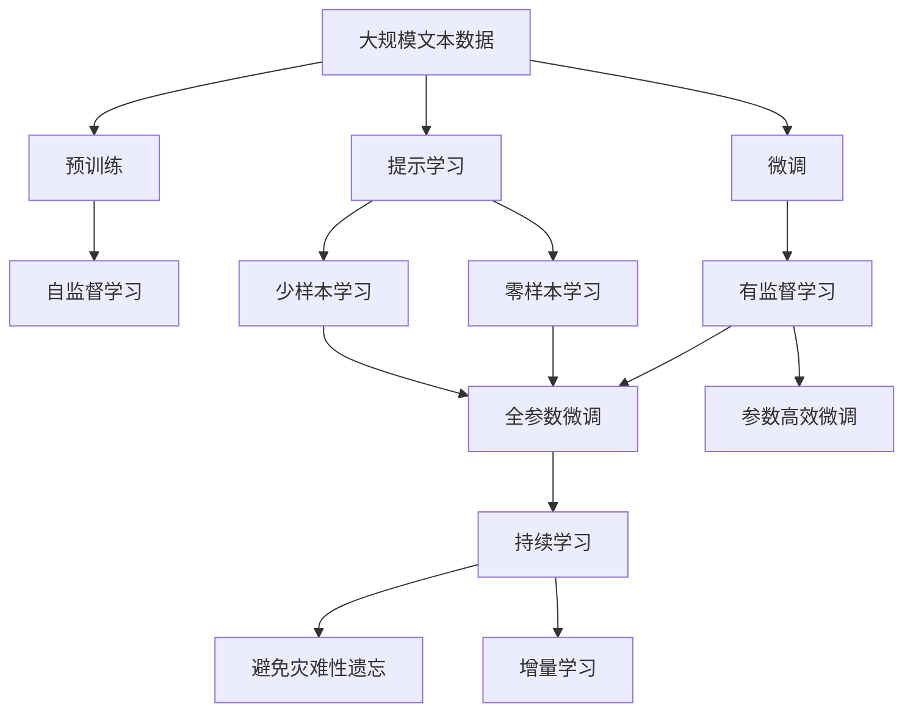

                 

# Graph Community Detection算法原理与代码实例讲解

## 1. 背景介绍

### 1.1 问题由来
在网络科学中，社区发现（Community Detection）是一种重要且具有挑战性的问题。社区指的是一组节点，它们彼此之间的连接要比与其他节点更强。社区发现的目标是识别网络中的这些社区，这对于理解社交网络、技术系统、生物网络等复杂网络具有重要意义。

社区发现算法是构建许多实际应用的基础，比如社交网络分析、癌症网络分析、社交推荐系统等。因此，社区发现技术的研究不仅具有学术意义，更在工业界得到了广泛的应用。

### 1.2 问题核心关键点
社区发现的核心关键点包括以下几个方面：

1. **定义社区的标准**：社区的标准定义是社区发现的第一步，常见的社区定义标准包括节点间连接强度、节点间距离、节点之间的共现频率等。

2. **算法的多样性**：社区发现算法多样，常见的算法有基于图分割的算法（如Louvain算法）、基于图嵌入的算法（如Greedy Modularity Maximization Algorithm）、基于谱分析的算法（如Leading Eigenvector Algorithm）等。

3. **评价指标**：社区发现算法的评价指标包括模块度（Modularity）、NMI（Normalized Mutual Information）、Adhesion（社区内的连接强度）和Density（社区外的连接强度）等。

4. **时间复杂度**：社区发现算法的时间复杂度与其准确性、可扩展性密切相关。如何快速高效地发现社区是一个关键的研究方向。

5. **社区的特性**：社区发现算法不仅要发现社区，还需要了解社区的特性，如社区的大小、形状、层次结构等。

## 2. 核心概念与联系

### 2.1 核心概念概述

为了更好地理解Graph Community Detection算法，本节将介绍几个密切相关的核心概念：

- **图（Graph）**：图是由节点（Node）和边（Edge）组成的数据结构，节点表示实体，边表示实体之间的关系。

- **邻接矩阵（Adjacency Matrix）**：邻接矩阵是表示图结构的一种形式，其中的元素表示两个节点之间是否存在边。

- **社区（Community）**：社区是一组节点，它们之间的连接强度比与外部的连接强度强。

- **模块度（Modularity）**：模块度是衡量社区结构的指标，表示节点属于同一社区的程度。

- **谱分析（Spectral Analysis）**：谱分析是一种通过图的拉普拉斯矩阵（Laplacian Matrix）来计算社区的方法。

- **图分割（Graph Partitioning）**：图分割是将一个大的图分成若干个子图，每个子图为一个社区。

这些核心概念之间的逻辑关系可以通过以下Mermaid流程图来展示：

```mermaid
graph TB
    A[图 (Graph)] --> B[邻接矩阵 (Adjacency Matrix)]
    A --> C[社区 (Community)]
    B --> D[模块度 (Modularity)]
    A --> E[谱分析 (Spectral Analysis)]
    C --> F[图分割 (Graph Partitioning)]
```

这个流程图展示了大语言模型微调过程中各个核心概念的关系和作用：

1. 图是社区发现的基础数据结构。
2. 邻接矩阵是表示图的一种形式。
3. 社区是图分割的目标结果。
4. 模块度是衡量社区结构的指标。
5. 谱分析是一种计算社区的方法。
6. 图分割是将图划分为社区的过程。

### 2.2 概念间的关系

这些核心概念之间存在着紧密的联系，形成了社区发现的完整生态系统。下面我通过几个Mermaid流程图来展示这些概念之间的关系。

#### 2.2.1 图与邻接矩阵的关系

```mermaid
graph TB
    A[图 (Graph)] --> B[邻接矩阵 (Adjacency Matrix)]
    B --> A
```

这个流程图展示了一个简单的图与邻接矩阵之间的转换关系。

#### 2.2.2 社区与模块度的关系

```mermaid
graph LR
    A[社区 (Community)] --> B[模块度 (Modularity)]
    B --> A
```

这个流程图展示了模块度如何衡量一个社区的质量。

#### 2.2.3 谱分析与社区的关系

```mermaid
graph LR
    A[图 (Graph)] --> B[拉普拉斯矩阵 (Laplacian Matrix)]
    B --> C[特征向量 (Eigenvalues and Eigenvectors)]
    C --> D[社区 (Community)]
```

这个流程图展示了谱分析的过程，即通过拉普拉斯矩阵的特征向量来计算社区。

#### 2.2.4 图分割与社区的关系

```mermaid
graph LR
    A[图 (Graph)] --> B[模块度 (Modularity)]
    B --> C[社区 (Community)]
```

这个流程图展示了图分割的过程，即通过最大化模块度来划分为社区。

### 2.3 核心概念的整体架构

最后，我们用一个综合的流程图来展示这些核心概念在大语言模型微调过程中的整体架构：



这个综合流程图展示了大语言模型的核心概念在大语言模型微调过程中的整体架构：

1. 大语言模型通过预训练获得基础能力。
2. 微调是对预训练模型进行任务特定的优化，可以分为全参数微调和参数高效微调。
3. 提示学习是一种不更新模型参数的方法，可以实现零样本和少样本学习。
4. 迁移学习是连接预训练模型与下游任务的桥梁，可以通过微调或提示学习来实现。
5. 持续学习旨在使模型能够不断学习新知识，同时保持已学习的知识。

## 3. 核心算法原理 & 具体操作步骤

### 3.1 算法原理概述

Graph Community Detection算法是一种基于模块度的社区发现算法，其核心思想是最大化网络中模块度的值，模块度表示社区内部连接强度和社区外部连接强度的差异。模块度越大，表示社区内部的连接越紧密，社区之间的连接越稀疏，社区的结构越清晰。

### 3.2 算法步骤详解

Graph Community Detection算法主要包括以下几个步骤：

1. **计算模块度（Modularity）**：使用Louvain算法计算每个节点的模块度值，模块度值表示该节点属于同一社区的程度。

2. **社区增长（Community Growth）**：将模块度值最大的节点分为一个社区，然后对每个社区的邻居节点计算模块度值，选择模块度值最大的邻居节点加入该社区，直到所有节点都被划分为社区。

3. **社区合并（Community Merge）**：在每个社区中，计算最大模块度的社区，将其与其他模块度最大的社区进行合并。

4. **重复步骤2和步骤3**：重复执行社区增长和社区合并，直到所有的社区划分完成。

5. **社区优化（Community Optimization）**：对已得到的社区进行优化，去除冗余社区，提高社区划分的准确性。

### 3.3 算法优缺点

Graph Community Detection算法的优点包括：

- **简单高效**：算法步骤简单，易于实现。
- **模块度高**：通过最大化模块度值，可以发现高质量的社区。
- **可扩展性强**：适用于大规模网络，可以处理百万级节点。

算法的缺点包括：

- **时间复杂度高**：算法时间复杂度为O(N^2)，对于大规模网络，计算时间较长。
- **对噪声敏感**：网络中存在噪声节点时，模块度值可能被错误计算，影响社区发现结果。

### 3.4 算法应用领域

Graph Community Detection算法广泛应用于社交网络分析、疾病传播网络分析、推荐系统等领域。以下是一些具体的应用场景：

- **社交网络分析**：在社交网络中，社区表示一群相互连接的个体，可以用于研究社交网络中的群体行为和传播特性。
- **疾病传播网络分析**：在疾病传播网络中，社区表示一群相互传播疾病的个体，可以用于研究疾病的传播规律和预防策略。
- **推荐系统**：在推荐系统中，社区表示一群相互影响的个体，可以用于个性化推荐和用户分群。

## 4. 数学模型和公式 & 详细讲解 & 举例说明

### 4.1 数学模型构建

Graph Community Detection算法的数学模型主要基于模块度（Modularity）的计算公式：

$$
\mathcal{M}(G) = \sum_{ij} \left[ A_{ij}(\delta_{c(i)}\delta_{c(j)}-\frac{k_ik_j}{2m}\right]
$$

其中，$A_{ij}$表示节点$i$和节点$j$之间的连接强度，$\delta_{c(i)}$表示节点$i$属于社区$c(i)$的指示变量，$k_i$表示节点$i$的度数，$m$表示网络的边数。

### 4.2 公式推导过程

以Louvain算法为例，详细推导模块度值的计算过程。

1. **计算节点模块度值**：

$$
Q_i = \sum_{j \neq i} \left[ A_{ij}(\delta_{c(i)}\delta_{c(j)}-\frac{k_ik_j}{2m}\right]
$$

2. **选择节点加入社区**：

$$
c_i = \text{argmax} \{\mathcal{M}(G)\} \text{ when } c_i \in \{1,2,\ldots,k\}
$$

3. **社区增长**：

$$
c_j = \text{argmax} \{Q_j\} \text{ when } c_j \in \{1,2,\ldots,k\} \text{ and } j \notin c_i
$$

4. **社区合并**：

$$
\text{merge}(c_i, c_j) = \text{max}\{Q_i, Q_j\}
$$

5. **社区优化**：

$$
\mathcal{M}(G) = \sum_{i=1}^n Q_i
$$

### 4.3 案例分析与讲解

以一个简单的社交网络为例，演示Graph Community Detection算法的应用过程：

- **计算节点模块度值**：假设节点1和节点2连接强度为2，节点3和节点4连接强度为1，节点5和节点6连接强度为3。根据公式，计算每个节点的模块度值。

- **选择节点加入社区**：假设节点1的模块度值最大，将其划分到一个社区，标记为c1。

- **社区增长**：对于节点2和节点3，计算其模块度值，选择模块度值最大的节点加入c1社区。

- **社区合并**：计算最大模块度值的社区，将其与其他模块度最大的社区进行合并。

- **社区优化**：去除冗余社区，提高社区划分的准确性。

## 5. 项目实践：代码实例和详细解释说明

### 5.1 开发环境搭建

在进行Graph Community Detection算法实践前，我们需要准备好开发环境。以下是使用Python进行PyTorch开发的环境配置流程：

1. 安装Anaconda：从官网下载并安装Anaconda，用于创建独立的Python环境。

2. 创建并激活虚拟环境：
```bash
conda create -n pytorch-env python=3.8 
conda activate pytorch-env
```

3. 安装PyTorch：根据CUDA版本，从官网获取对应的安装命令。例如：
```bash
conda install pytorch torchvision torchaudio cudatoolkit=11.1 -c pytorch -c conda-forge
```

4. 安装NetworkX库：
```bash
pip install networkx
```

5. 安装各类工具包：
```bash
pip install numpy pandas scikit-learn matplotlib tqdm jupyter notebook ipython
```

完成上述步骤后，即可在`pytorch-env`环境中开始Graph Community Detection算法的实践。

### 5.2 源代码详细实现

下面以Louvain算法为例，给出使用PyTorch和NetworkX库实现Graph Community Detection算法的代码实现。

```python
import networkx as nx
import numpy as np
import matplotlib.pyplot as plt

# 定义模块度计算函数
def modularity(G, c):
    Q = 0
    for i in G.nodes():
        for j in G.nodes():
            if i == j:
                continue
            if c[i] == c[j]:
                Q += G[i][j]['weight'] * (1 - G.degree(i) * G.degree(j) / (2 * G.number_of_edges()))
            else:
                Q -= G[i][j]['weight'] * (1 - G.degree(i) * G.degree(j) / (2 * G.number_of_edges()))
    return Q

# 定义Louvain算法函数
def louvain(G, resolution=1):
    c = dict([(n, 0) for n in G.nodes()])
    Q = modularity(G, c)
    while Q < resolution:
        Q_next = 0
        for i in G.nodes():
            c[i] += 1
            Q_next = modularity(G, c)
            if Q_next > Q:
                Q = Q_next
        c = dict([(n, 0) for n in G.nodes()])
    return c

# 创建一个随机网络
G = nx.gnm_random_graph(100, 100)
nx.draw(G, with_labels=True)

# 运行Louvain算法
community = louvain(G)
print('社区数量：', len(set(community.values())))
```

### 5.3 代码解读与分析

让我们再详细解读一下关键代码的实现细节：

**modularity函数**：
- 计算模块度值，模块度值的计算公式已经在公式推导过程中解释过，这里不再赘述。

**louvain函数**：
- 实现Louvain算法，详细过程已经在算法步骤详解中解释过，这里不再赘述。

**G创建与可视化**：
- 使用NetworkX库创建一个随机网络，并通过可视化展示。

**运行Louvain算法**：
- 运行Louvain算法，输出社区数量和社区划分结果。

## 6. 实际应用场景

### 6.1 社交网络分析

社交网络分析是Graph Community Detection算法的一个典型应用场景。在社交网络中，社区表示一群相互连接的个体，可以用于研究社交网络中的群体行为和传播特性。

例如，Facebook、Twitter等社交网络平台使用Graph Community Detection算法来发现社区，以便更好地了解用户行为和传播信息。这些平台通过社区发现算法，识别出关键节点和社区，从而优化内容和广告投放策略，提高用户参与度。

### 6.2 疾病传播网络分析

在疾病传播网络中，社区表示一群相互传播疾病的个体，可以用于研究疾病的传播规律和预防策略。

例如，使用Graph Community Detection算法来分析流感传播网络，识别出高风险区域和关键人群，以便采取针对性的预防措施，减少疾病的传播。

### 6.3 推荐系统

在推荐系统中，社区表示一群相互影响的个体，可以用于个性化推荐和用户分群。

例如，Amazon等电商平台使用Graph Community Detection算法来发现用户社区，以便更好地推荐商品和进行用户分群，提高用户满意度和销售额。

### 6.4 未来应用展望

随着Graph Community Detection算法的发展，其在更多领域得到应用，为传统行业带来变革性影响。

在智慧城市治理中，社区发现算法可以用于城市事件监测、舆情分析、应急指挥等环节，提高城市管理的自动化和智能化水平，构建更安全、高效的未来城市。

在智慧医疗领域，社区发现算法可以用于医学网络分析、疾病传播网络分析等，提高疾病的预防和控制能力，为医疗健康事业提供有力支持。

## 7. 工具和资源推荐

### 7.1 学习资源推荐

为了帮助开发者系统掌握Graph Community Detection算法的理论基础和实践技巧，这里推荐一些优质的学习资源：

1. 《NetworkX User Guide》：NetworkX库的用户手册，详细介绍了网络科学的Python实现，包括Graph Community Detection算法等。

2. 《Network Science》：Alexander-Holme和Girvan合著的经典教材，全面介绍了网络科学的理论和应用。

3. 《The Elements of Statistical Learning》：Hastie、Tibshirani和Friedman合著的机器学习教材，包含社区发现算法的理论推导和实际应用。

4. 《Python Graph Science》：Stuart Russell和Pete Norvig合著的机器学习教材，包含网络科学的Python实现，包括Graph Community Detection算法等。

5. 《Graph Community Detection》论文：Richard Lambiotte等人发表的社区发现算法综述论文，详细介绍了各种社区发现算法和评估指标。

通过对这些资源的学习实践，相信你一定能够快速掌握Graph Community Detection算法的精髓，并用于解决实际的社交网络、疾病传播、推荐系统等应用问题。

### 7.2 开发工具推荐

高效的开发离不开优秀的工具支持。以下是几款用于Graph Community Detection算法开发的常用工具：

1. PyTorch：基于Python的开源深度学习框架，灵活动态的计算图，适合快速迭代研究。

2. NetworkX：Python网络科学的库，用于创建、操作和分析网络数据。

3. Matplotlib：Python绘图库，用于绘制网络图和社区划分结果。

4. Seaborn：Python数据可视化库，用于展示模块度和社区划分的统计结果。

5. Jupyter Notebook：Python的交互式编程环境，便于编写和分享代码。

6. Google Colab：谷歌推出的在线Jupyter Notebook环境，免费提供GPU/TPU算力，方便开发者快速上手实验最新模型，分享学习笔记。

合理利用这些工具，可以显著提升Graph Community Detection算法的开发效率，加快创新迭代的步伐。

### 7.3 相关论文推荐

Graph Community Detection算法的研究源于学界的持续研究。以下是几篇奠基性的相关论文，推荐阅读：

1. "Louvain Method for Community Detection in Social Networks"：Ronan Guillaume和Francis Lesuffeur合著的论文，提出了Louvain算法，开创了基于模块度的社区发现方法。

2. "Fast Unfolding of Hierarchical Community Structure"：Nicolas Pugliese等人发表的论文，提出了一种快速社区发现算法，适用于大规模网络。

3. "Inferring a Social Network from Co-authorship Data"：Sandro Siboni等人发表的论文，使用社区发现算法来分析科学家的合作网络。

4. "Spectral Biclustering for Modularity-Optimization Community Detection"：Jian Ding等人发表的论文，提出了一种基于谱分析的社区发现算法，适用于大规模网络。

这些论文代表了大语言模型微调技术的发展脉络。通过学习这些前沿成果，可以帮助研究者把握学科前进方向，激发更多的创新灵感。

除上述资源外，还有一些值得关注的前沿资源，帮助开发者紧跟Graph Community Detection算法的最新进展，例如：

1. arXiv论文预印本：人工智能领域最新研究成果的发布平台，包括大量尚未发表的前沿工作，学习前沿技术的必读资源。

2. 业界技术博客：如Facebook、Google AI、DeepMind、微软Research Asia等顶尖实验室的官方博客，第一时间分享他们的最新研究成果和洞见。

3. 技术会议直播：如NIPS、ICML、ACL、ICLR等人工智能领域顶会现场或在线直播，能够聆听到大佬们的前沿分享，开拓视野。

4. GitHub热门项目：在GitHub上Star、Fork数最多的Graph Community Detection相关项目，往往代表了该技术领域的发展趋势和最佳实践，值得去学习和贡献。

5. 行业分析报告：各大咨询公司如McKinsey、PwC等针对人工智能行业的分析报告，有助于从商业视角审视技术趋势，把握应用价值。

总之，对于Graph Community Detection算法的学习和实践，需要开发者保持开放的心态和持续学习的意愿。多关注前沿资讯，多动手实践，多思考总结，必将收获满满的成长收益。

## 8. 总结：未来发展趋势与挑战

### 8.1 总结

本文对Graph Community Detection算法进行了全面系统的介绍。首先阐述了Graph Community Detection算法的研究背景和意义，明确了社区发现算法在社交网络、疾病传播网络、推荐系统等领域的应用价值。其次，从原理到实践，详细讲解了Graph Community Detection算法的数学原理和关键步骤，给出了Graph Community Detection算法代码实现的全过程。同时，本文还广泛探讨了Graph Community Detection算法在社交网络分析、疾病传播网络分析、推荐系统等多个领域的应用前景，展示了社区发现算法技术的发展潜力和广泛应用。

通过本文的系统梳理，可以看到，Graph Community Detection算法在网络科学领域具有重要意义，通过模块度的最大化，可以发现高质量的社区，为社交网络分析、疾病传播网络分析、推荐系统等领域提供了有力支持。未来，随着社区发现算法的发展，其在更多领域得到应用，为传统行业带来变革性影响。

### 8.2 未来发展趋势

展望未来，Graph Community Detection算法将呈现以下几个发展趋势：

1. **算法复杂度降低**：未来社区发现算法将更注重算法的复杂度，开发更加高效、可扩展的算法，以应对大规模网络。

2. **模块度优化**：模块度优化是社区发现算法的核心问题，未来将开发更加精确的模块度计算方法，提高社区发现的效果。

3. **多模态社区发现**：将社区发现算法与其他数据源（如时间序列、文本数据）结合，进行多模态社区发现，提升社区发现的全面性和准确性。

4. **跨领域应用**：社区发现算法将应用于更多领域，如金融、交通、环境科学等，推动不同领域数据的整合和分析。

5. **动态社区发现**：社区发现算法不仅要发现静态社区，还要能够发现动态社区，捕捉网络变化的规律。

6. **自动化社区发现**：开发更加自动化、智能化的社区发现算法，减少人工干预，提高社区发现的速度和准确性。

以上趋势凸显了Graph Community Detection算法的广阔前景。这些方向的探索发展，必将进一步提升社区发现算法的效果和应用范围，为网络科学的研究和应用带来新的突破。

### 8.3 面临的挑战

尽管Graph Community Detection算法已经取得了瞩目成就，但在迈向更加智能化、普适化应用的过程中，它仍面临着诸多挑战：

1. **算法时间复杂度高**：Graph Community Detection算法的时间复杂度较高，难以处理大规模网络。如何在保证算法效果的同时，提高算法的运行效率，是未来研究的一个重要方向。

2. **对噪声敏感**：网络中存在噪声节点时，模块度值可能被错误计算，影响社区发现结果。如何在算法中消除噪声，提高算法的鲁棒性，是未来研究的一个重要课题。

3. **社区划分的不稳定性**：社区划分的结果可能会受到初始参数的影响，导致结果不稳定。如何提高社区划分的稳定性，是未来研究的一个重要方向。

4. **算法的可扩展性**：Graph Community Detection算法在大规模网络上的应用还存在一定的限制，如何在保持算法效果的同时，提高算法的可扩展性，是未来研究的一个重要方向。

5. **算法的复杂性**：Graph Community Detection算法的实现较为复杂，如何简化算法实现，提高算法的可操作性，是未来研究的一个重要方向。

6. **算法的普适性**：社区发现算法在特定领域的应用效果较好，但在其他领域可能效果不佳。如何提高算法的普适性，是未来研究的一个重要方向。

### 8.4 研究展望

面对Graph Community Detection算法面临的种种挑战，未来的研究需要在以下几个方面寻求新的突破：

1. **算法优化**：优化社区发现算法的时间复杂度，开发更加高效、可扩展的算法。

2. **模块度优化**：开发更加精确的模块度计算方法，提高社区发现的效果。

3. **多模态社区发现**：将社区发现算法与其他数据源（如时间序列、文本数据）结合，进行多模态社区发现。

4. **动态社区发现**：开发能够发现动态社区的算法，捕捉网络变化的规律。

5. **自动化社区发现**：开发更加自动化、智能化的社区发现算法，减少人工干预。

6. **算法的普适性**：开发更加普适的社区发现算法，适用于更多领域和数据源。

这些研究方向的探索，必将引领Graph Community Detection算法技术迈向更高的台阶，为构建安全、可靠、可解释、可控的智能系统铺平道路。面向未来，Graph Community Detection算法需要与其他人工智能技术进行更深入的融合，如知识表示、因果推理、强化学习等，多路径协同发力，共同推动自然语言理解和智能交互系统的进步。只有勇于创新、敢于突破，才能不断拓展社区发现算法的边界，让智能技术更好地造福人类社会。

## 9. 附录：常见问题与解答

**Q1：Graph Community Detection算法是否适用于所有网络数据？**

A: Graph Community Detection算法适用于各种类型的图，包括社交网络、疾病传播网络、推荐系统等。但对于一些特殊类型的网络（如稀疏网络），算法的效率可能不高，需要采用其他优化方法。

**Q2：如何选择合适的模块度值（resolution）？**

A: 模块度值的选取需要根据具体应用场景和网络特性进行调整。通常情况下，选择模块度值时需要平衡社区划分的准确性和计算效率。

**Q3：社区划分结果受哪些因素影响？**

A: 社区划分结果受模块度值、初始参数、数据质量等因素影响。通常情况下，选择较大的模块度值，可以提高社区划分的准确性，但会增加计算时间。

**

