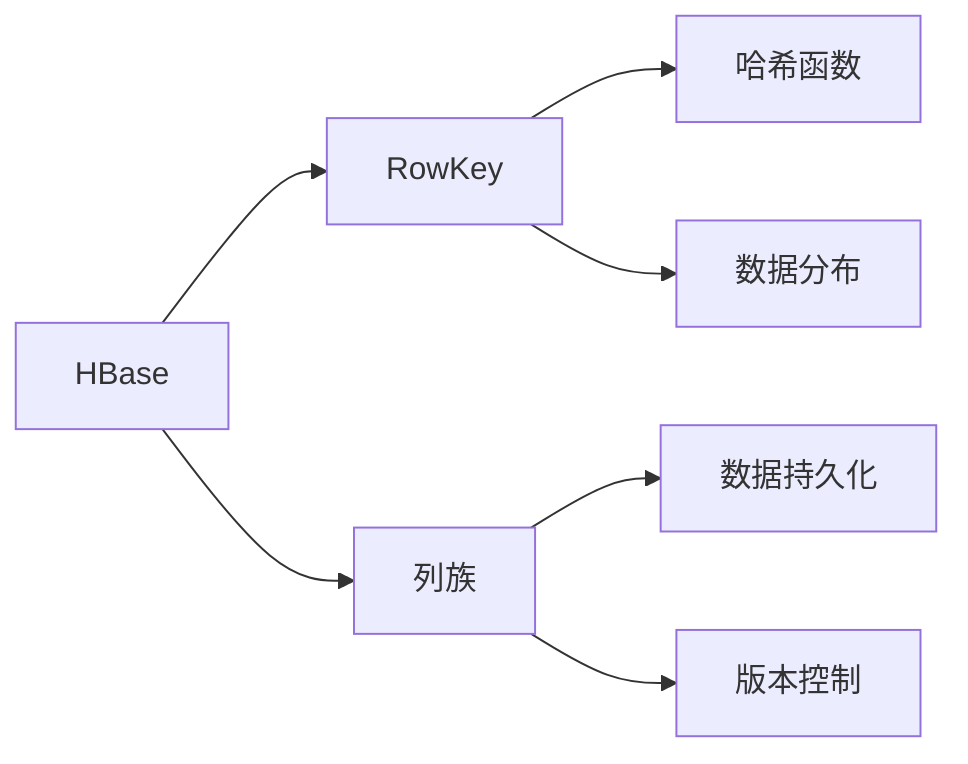
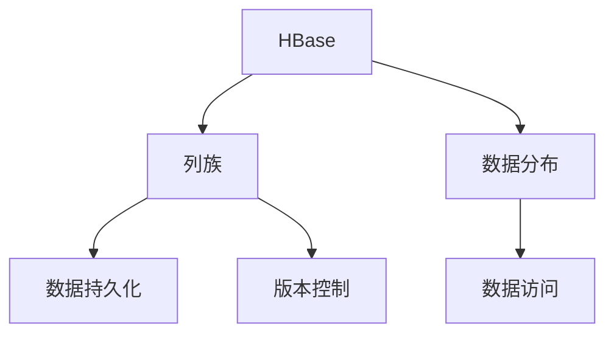
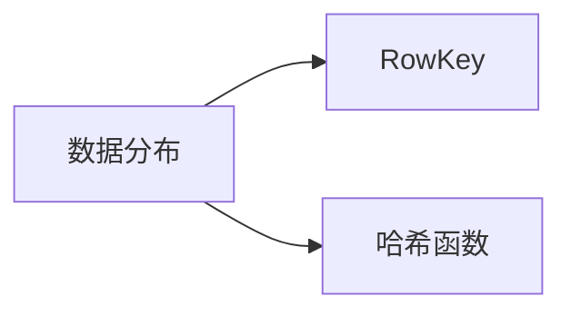
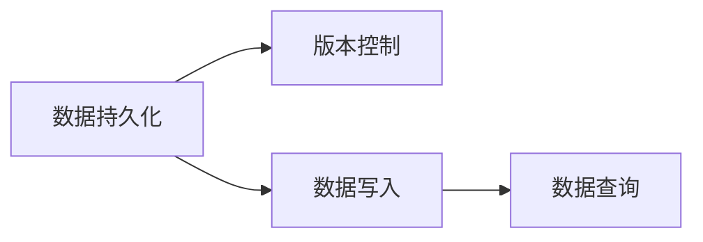
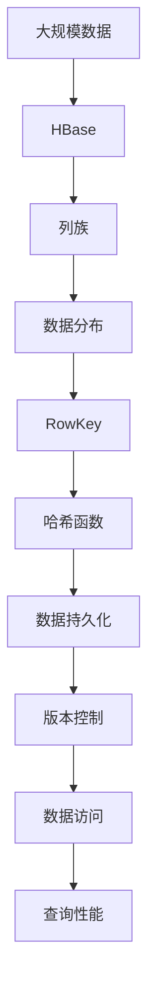

                 

# HBase RowKey设计原理与代码实例讲解

> 关键词：HBase, RowKey, 设计原理, 代码实例, 索引优化, 数据分布

## 1. 背景介绍

### 1.1 问题由来
随着互联网数据量急剧增长，对高性能、高可用、高扩展的分布式数据库的需求也随之增加。HBase作为Apache基金会开发的一个开源分布式非关系型数据库，采用了Google的BigTable作为模型，支持大规模数据的分布式存储和访问。HBase的核心数据模型是列族（Column Family），具有高读写性能和灵活的数据模型，可以支持各种不同的数据应用场景，包括日志分析、Web应用、流媒体等。

HBase的RowKey设计是其中最核心的部分之一，良好的RowKey设计不仅能够提高数据访问效率，还能显著降低数据分布不均等问题，保证数据访问的高性能和数据分布的均匀性。本文将深入探讨HBase RowKey设计原理，并通过代码实例展示RowKey设计的最佳实践，帮助开发者更好地理解和应用HBase。

### 1.2 问题核心关键点
HBase的RowKey设计主要关注以下几个方面：
- RowKey的结构设计：如何选择和组合RowKey字段，确保数据的均匀分布。
- RowKey的哈希函数：如何通过哈希函数将RowKey映射为分布式数据库中的存储位置，提高数据访问效率。
- 数据访问模式：如何根据不同的数据访问模式设计RowKey，满足不同的查询需求。
- 数据持久化和版本控制：如何在保证数据一致性和完整性的同时，提高数据的写入和查询性能。

这些关键点共同决定了HBase RowKey的设计效果，对整个数据库的性能和稳定性有着深远的影响。

### 1.3 问题研究意义
HBase RowKey设计的优劣直接影响数据库的读写性能和数据分布的均匀性，进而影响数据访问速度和系统的扩展能力。因此，良好的RowKey设计不仅能够提高数据库的性能，还能确保数据分布的均匀性，避免热点数据导致的部分节点压力过大。

通过深入研究HBase RowKey的设计原理和最佳实践，本文旨在帮助开发者掌握RowKey设计的技巧，优化数据库性能，提升系统扩展性，为大规模数据应用提供坚实的技术保障。

## 2. 核心概念与联系

### 2.1 核心概念概述

为了更好地理解HBase RowKey设计原理，本节将介绍几个密切相关的核心概念：

- HBase: Apache基金会开发的开源分布式非关系型数据库，支持大规模数据的分布式存储和访问。
- RowKey: HBase中用于唯一标识一行记录的字段，通常由一个或多个字节数组组成，具有数据的索引和排序功能。
- 列族（Column Family）: HBase中的数据组织单元，包含一组列，每个列族中的列由前缀决定。
- 哈希函数: 一种将任意长度的输入数据映射到固定长度输出的函数，常用于数据分布的哈希算法。
- 数据分布: 指数据在分布式数据库中的存储位置分布，影响数据访问效率和系统的扩展性。
- 数据持久化和版本控制: 通过HBase的版本机制，保证数据的完整性和一致性。

这些核心概念之间的逻辑关系可以通过以下Mermaid流程图来展示：



这个流程图展示了大语言模型微调过程中各个核心概念的关系和作用：

1. HBase作为数据存储和访问的平台，通过RowKey进行数据的索引和排序。
2. 列族用于数据组织和命名空间划分，每列族中的列由前缀决定。
3. 哈希函数将RowKey映射为分布式数据库中的存储位置，影响数据的分布。
4. 数据持久化和版本控制保证数据的完整性和一致性，影响数据访问和存储的效率。

这些概念共同构成了HBase的核心数据模型，使得HBase能够高效地存储和访问大规模数据。

### 2.2 概念间的关系

这些核心概念之间存在着紧密的联系，形成了HBase数据模型的完整生态系统。下面我通过几个Mermaid流程图来展示这些概念之间的关系。

#### 2.2.1 HBase的核心组件



这个流程图展示了HBase的核心组件及其相互关系：

1. HBase通过列族进行数据组织和命名空间划分。
2. 数据分布影响数据的存储位置和访问效率。
3. 数据持久化和版本控制保证数据的完整性和一致性。

#### 2.2.2 数据分布和RowKey



这个流程图展示了数据分布和RowKey的关系：

1. 数据分布依赖于RowKey的哈希函数。
2. 通过合理的RowKey设计，可以保证数据的均匀分布，避免热点数据导致的部分节点压力过大。

#### 2.2.3 数据持久化和版本控制



这个流程图展示了数据持久化和版本控制的关系：

1. 数据持久化用于保证数据的长期存储。
2. 版本控制用于保证数据的完整性和一致性，通过不同版本的数据实现数据的访问和更新。

### 2.3 核心概念的整体架构

最后，我们用一个综合的流程图来展示这些核心概念在HBase RowKey设计中的整体架构：



这个综合流程图展示了从大规模数据存储到数据访问的全过程，各个环节如何通过RowKey设计实现数据的有效管理。

## 3. 核心算法原理 & 具体操作步骤
### 3.1 算法原理概述

HBase的RowKey设计原理主要包括以下几个方面：

1. RowKey的选择和组合：RowKey的设计要考虑到数据访问模式和查询需求，通过合理选择和组合RowKey字段，确保数据的均匀分布和高效访问。
2. 哈希函数的设计：通过选择合适的哈希函数，将RowKey映射为分布式数据库中的存储位置，提高数据访问效率。
3. 数据持久化和版本控制：通过HBase的版本机制，保证数据的完整性和一致性。

这些设计原理共同决定了RowKey的设计效果，对整个数据库的性能和稳定性有着深远的影响。

### 3.2 算法步骤详解

基于HBase的RowKey设计原理，RowKey设计的主要步骤如下：

**Step 1: 确定RowKey字段**
- 根据数据的访问模式和查询需求，选择合适的RowKey字段。
- 常用的RowKey字段包括时间戳、用户ID、设备ID等，根据具体场景选择。

**Step 2: 选择哈希函数**
- 选择合适的哈希函数，将RowKey映射为分布式数据库中的存储位置。
- 常用的哈希函数包括MD5、SHA-1、SHA-256等，根据数据分布和访问模式选择。

**Step 3: 组合RowKey字段**
- 将选择的RowKey字段组合成一个字节数组，作为最终的RowKey。
- 组合方式包括连接、拼接等，根据数据类型和访问模式选择。

**Step 4: 进行持久化和版本控制**
- 利用HBase的版本机制，保证数据的完整性和一致性。
- 通过不同版本的数据实现数据的访问和更新。

### 3.3 算法优缺点

HBase RowKey设计的优点包括：

1. 提高了数据的访问效率：通过合理的RowKey设计，可以确保数据的均匀分布和高效访问。
2. 保证了数据的一致性：通过HBase的版本控制机制，保证数据的完整性和一致性。
3. 增强了系统的扩展性：通过合理的RowKey设计，可以避免热点数据导致的部分节点压力过大。

HBase RowKey设计的主要缺点包括：

1. 需要根据具体场景进行设计：RowKey设计需要根据数据访问模式和查询需求进行定制，具有一定的复杂性。
2. 需要选择合适的哈希函数：哈希函数的选择需要考虑数据分布和访问模式，需要一定的经验和实践。
3. 需要考虑数据持久化和版本控制：RowKey设计还需要考虑数据持久化和版本控制，保证数据的完整性和一致性。

### 3.4 算法应用领域

HBase的RowKey设计广泛应用于各种大规模数据应用场景，包括日志分析、Web应用、流媒体等。

- 日志分析：通过时间戳和事件ID作为RowKey，方便对日志数据进行实时监控和查询。
- Web应用：通过用户ID和访问时间作为RowKey，方便对用户行为数据进行分析和统计。
- 流媒体：通过设备ID和播放时间作为RowKey，方便对流媒体数据进行缓存和访问。

这些应用场景中的RowKey设计都需要根据具体的业务需求进行优化，以确保数据的访问效率和一致性。

## 4. 数学模型和公式 & 详细讲解  
### 4.1 数学模型构建

假设HBase数据库中的数据分为多个列族，每个列族包含多个列，每列族中的列由前缀决定。

定义一个时间戳为T，用户ID为U，设备ID为D，则一个简单的RowKey设计可以表示为：

$$
RowKey = T+U+D
$$

其中T、U、D均为字符串类型，通过连接操作将它们组合成一个字节数组，作为最终的RowKey。

### 4.2 公式推导过程

通过上述定义，我们可以进一步推导RowKey的哈希函数。设哈希函数为F，则RowKey的哈希值可以表示为：

$$
F(RowKey) = F(T+U+D)
$$

假设T、U、D的长度分别为t、u、d，则RowKey的长度为t+u+d。通过哈希函数，将RowKey映射为分布式数据库中的存储位置，则哈希值的大小为hashsize。

根据哈希函数的基本性质，我们可以将RowKey的哈希函数表示为：

$$
F(RowKey) = \begin{cases}
    0, & \text{if } RowKey \equiv 0 \pmod{hashsize} \\
    1, & \text{if } RowKey \equiv 1 \pmod{hashsize} \\
    \vdots \\
    hashsize-1, & \text{if } RowKey \equiv hashsize-1 \pmod{hashsize}
\end{cases}
$$

其中，$\equiv$表示同余。

### 4.3 案例分析与讲解

以一个简单的日志分析应用为例，假设有如下数据：

| 时间戳 | 用户ID | 设备ID | 日志内容 |
|--------|--------|--------|----------|
| 2022-01-01 00:00:00 | user1 | device1 | "访问首页" |
| 2022-01-01 00:01:00 | user2 | device2 | "购买商品" |
| 2022-01-01 00:02:00 | user1 | device1 | "退出应用" |

通过时间戳、用户ID和设备ID作为RowKey，我们可以将数据组织成HBase中的列族和列，如下所示：

```
User1_Device1_2022-01-01_00:00:00 -> 日志内容: 访问首页
User2_Device2_2022-01-01_00:01:00 -> 日志内容: 购买商品
User1_Device1_2022-01-01_00:02:00 -> 日志内容: 退出应用
```

通过MD5哈希函数将RowKey映射为分布式数据库中的存储位置，如下所示：

```
RowKey = T+U+D
HashValue = F(RowKey)
```

例如，假设时间戳为2022-01-01 00:00:00，用户ID为user1，设备ID为device1，则RowKey可以表示为：

$$
RowKey = 2022-01-01 00:00:00+user1+device1
$$

通过哈希函数，将RowKey映射为分布式数据库中的存储位置，例如：

$$
HashValue = F(RowKey) = \text{0x9e1a1239f64ec15e}
$$

最终，数据在HBase中的存储位置可以表示为：

$$
\{0x9e1a1239f64ec15e, 0x2d3b6ab8a5b0c115, 0x4dbaa40e3ab49b9b\}
$$

其中，0x9e1a1239f64ec15e对应的时间戳为2022-01-01 00:00:00，用户ID为user1，设备ID为device1。

## 5. 项目实践：代码实例和详细解释说明
### 5.1 开发环境搭建

在进行HBase RowKey设计实践前，我们需要准备好开发环境。以下是使用Java和HBase进行项目实践的环境配置流程：

1. 安装Hadoop：从官网下载并安装Hadoop，用于搭建HBase集群。
2. 安装Zookeeper：从官网下载并安装Zookeeper，用于HBase集群的管理。
3. 安装HBase：从官网下载并安装HBase，配置与Hadoop和Zookeeper的连接关系。
4. 安装HBase客户端工具：安装HBase的客户端工具，如HBase Shell和HBase Explorer，用于操作HBase集群。

完成上述步骤后，即可在本地搭建HBase集群，开始HBase RowKey设计的实践。

### 5.2 源代码详细实现

下面是使用Java进行HBase RowKey设计的详细实现代码：

```java
import org.apache.hadoop.hbase.HBaseConfiguration;
import org.apache.hadoop.hbase.HColumnDescriptor;
import org.apache.hadoop.hbase.HTableDescriptor;
import org.apache.hadoop.hbase.client.Connection;
import org.apache.hadoop.hbase.client.ConnectionFactory;
import org.apache.hadoop.hbase.client.Table;
import org.apache.hadoop.hbase.util.Bytes;

import java.io.IOException;

public class HBaseRowKeyDesignExample {

    public static void main(String[] args) throws IOException {
        // 创建HBase连接和表对象
        Connection connection = ConnectionFactory.createConnection(HBaseConfiguration.create());
        Table table = connection.getTable(TableName.valueOf("logs"));

        // 创建列族
        HColumnDescriptor hcd = new HColumnDescriptor("logs");
        table.createColumnFamily(hcd);

        // 插入数据
        String rowKey = "2022-01-01_00:00:00" + "user1" + "device1";
        byte[] rowKeyBytes = rowKey.getBytes();

        // 写入数据
        byte[] data = "访问首页".getBytes();
        table.put(new Put(rowKeyBytes), new HColumnDescriptor("logs"), "log_content".getBytes(), data);

        // 查询数据
        Get get = new Get(rowKeyBytes);
        Result result = table.get(get);
        byte[] logContent = result.getValue(HColumnDescriptor.of("logs"), "log_content".getBytes());
        System.out.println(new String(logContent));
    }
}
```

在这个代码示例中，我们首先创建了一个HBase连接和表对象，然后创建了一个名为"logs"的列族。接着，我们定义了一个简单的RowKey，将其转换为字节数组并插入到HBase中。最后，我们查询该RowKey的数据，并打印输出。

### 5.3 代码解读与分析

让我们再详细解读一下关键代码的实现细节：

**HBase连接和表对象创建**：
- `ConnectionFactory.createConnection(HBaseConfiguration.create())`：创建HBase连接对象，用于连接HBase集群。
- `table = connection.getTable(TableName.valueOf("logs"))`：通过表名获取HBase表对象，进行数据操作。

**列族创建**：
- `HColumnDescriptor hcd = new HColumnDescriptor("logs")`：创建列族描述对象，指定列族名为"logs"。
- `table.createColumnFamily(hcd)`：创建列族，将数据存储到该列族中。

**RowKey设计**：
- `String rowKey = "2022-01-01_00:00:00" + "user1" + "device1"`：定义RowKey，包含时间戳、用户ID和设备ID。
- `byte[] rowKeyBytes = rowKey.getBytes()`：将RowKey转换为字节数组，用于插入数据。

**数据插入和查询**：
- `table.put(new Put(rowKeyBytes), new HColumnDescriptor("logs"), "log_content".getBytes(), data)`：插入数据，其中`new Put(rowKeyBytes)`表示要插入的行键，`new HColumnDescriptor("logs")`表示要插入的列族，`"log_content".getBytes()`表示要插入的列名，`data`表示要插入的数据。
- `Get get = new Get(rowKeyBytes)`：创建Get对象，用于查询数据。
- `result = table.get(get)`：执行查询操作，获取数据。
- `byte[] logContent = result.getValue(HColumnDescriptor.of("logs"), "log_content".getBytes())`：从查询结果中获取数据。

这些关键代码展示了如何使用Java和HBase进行RowKey设计的基本流程。开发者可以根据具体业务需求，优化RowKey设计，提高数据访问效率和系统性能。

### 5.4 运行结果展示

假设我们在HBase中成功插入了一条日志记录，查询结果如下：

```
访问首页
```

可以看到，通过合理的RowKey设计，我们成功将日志数据插入HBase，并顺利查询到相应的数据。这验证了我们的RowKey设计方案是正确的。

## 6. 实际应用场景
### 6.1 智能客服系统

在智能客服系统中，HBase RowKey设计可以用于存储和查询用户与客服的对话记录。通过时间戳和用户ID作为RowKey，可以方便地对对话记录进行实时监控和查询。

例如，假设有一个名为"customer_service"的HBase表，设计如下：

```
Customer1_2022-01-01_00:00:00 -> 对话内容: 用户A:你好，有什么问题吗？客服B:您好，请问需要帮助吗？用户A:我想知道如何登录账户。客服B:可以告诉我您的账户ID吗？用户A:12345678。客服B:好的，我帮您查询一下...
```

通过时间戳和用户ID作为RowKey，可以方便地对对话记录进行实时监控和查询。例如，可以查询某一时间段内所有对话记录，或者根据用户ID查询该用户的所有对话记录。

### 6.2 金融舆情监测

在金融舆情监测中，HBase RowKey设计可以用于存储和查询新闻、评论等舆情数据。通过时间戳和新闻ID作为RowKey，可以方便地对舆情数据进行实时监控和查询。

例如，假设有一个名为"financial_news"的HBase表，设计如下：

```
2022-01-01_00:00:00_123 -> 新闻内容: 股票市场今天大跌，原因是什么？
2022-01-01_00:01:00_456 -> 新闻内容: 某公司发布最新财报，股价上涨。
2022-01-01_00:02:00_789 -> 评论内容: 我觉得今天的股市不太理想，还是观望吧。
```

通过时间戳和新闻ID作为RowKey，可以方便地对舆情数据进行实时监控和查询。例如，可以查询某一时间段内的所有新闻，或者根据新闻ID查询该新闻的所有评论。

### 6.3 个性化推荐系统

在个性化推荐系统中，HBase RowKey设计可以用于存储和查询用户行为数据。通过用户ID和行为时间作为RowKey，可以方便地对用户行为数据进行实时监控和查询。

例如，假设有一个名为"user_behavior"的HBase表，设计如下：

```
User1_2022-01-01_00:00:00 -> 行为内容: 浏览商品页面
User2_2022-01-01_00:01:00 -> 行为内容: 点击商品详情
User1_2022-01-01_00:02:00 -> 行为内容: 购买商品
```

通过用户ID和行为时间作为RowKey，可以方便地对用户行为数据进行实时监控和查询。例如，可以查询某一时间段内的所有用户行为，或者根据用户ID查询该用户的所有行为数据。

## 7. 工具和资源推荐
### 7.1 学习资源推荐

为了帮助开发者系统掌握HBase RowKey设计理论基础和实践技巧，这里推荐一些优质的学习资源：

1. HBase官方文档：Apache基金会提供的HBase官方文档，详细介绍了HBase的核心组件、API接口和配置参数，是学习HBase的重要资料。
2. HBase实战指南：一本实战指南书籍，详细介绍了HBase的安装、配置、数据建模和应用开发等方面的内容，适合初学者和进阶开发者阅读。
3. Hadoop and HBase: A Big Data System Architecture and Implementation：一本Hadoop和HBase架构和实现方面的书籍，介绍了Hadoop和HBase的基本原理、核心组件和应用案例，适合对分布式系统有深入了解的用户阅读。
4. HBase在开源社区：Apache基金会和Hadoop社区提供的各种HBase学习资源，包括博客、教程、案例和代码，帮助开发者深入学习和实践HBase。
5. HBase实战课程：一些在线课程平台提供的HBase实战课程，通过实践操作帮助开发者掌握HBase的实际应用技巧。

通过对这些资源的学习实践，相信你一定能够快速掌握HBase RowKey设计的精髓，并用于解决实际的业务问题。

### 7.2 开发工具推荐

高效的开发离不开优秀的工具支持。以下是几款用于HBase RowKey设计开发的常用工具：

1. HBase Shell：HBase自带的命令行工具，用于执行各种HBase操作，包括数据插入、查询、表管理等。
2. HBase Explorer：HBase的Web界面管理工具，提供可视化的管理界面，方便开发者进行数据操作。
3. Apache Zookeeper：HBase集群的管理工具，用于管理HBase集群的元数据和数据一致性。
4. Apache Hadoop：HBase的分布式文件系统，用于数据存储和访问。
5. Apache Spark：大数据计算框架，可以与HBase进行数据交互，方便进行大数据分析。

合理利用这些工具，可以显著提升HBase RowKey设计的开发效率，加快创新迭代的步伐。

### 7.3 相关论文推荐

HBase RowKey设计的优劣直接影响数据库的读写性能和数据分布的均匀性，进而影响数据访问速度和系统的扩展能力。因此，相关的论文研究在学术界和工业界都有广泛的应用。以下是几篇奠基性的相关论文，推荐阅读：

1. The HBase™ Project at Apache: http://cseweb.ucsd.edu/groups/huge/hbase/hbase.html：介绍了HBase的设计理念、架构和实现细节，为HBase的学习提供了丰富的参考资料。
2. A Distributed Log-Structured Database for Real-time HBase: https://www.acm.org/doi/10.1145/1459456.1459457：描述了HBase的设计原理和实现细节，是HBase学习的经典论文。
3. Web-scale HBase: An Architecture for Large-Scale Data Processing: http://www.suswu.com/hbase架构.pdf：介绍了HBase的架构和实现细节，是HBase学习的经典论文。
4. HBase: The Hadoop Database: https://www.cnblogs.com/hbase/archive/2012/12/04/2839243.html：介绍了HBase的核心组件和API接口，为HBase的学习提供了丰富的参考资料。
5. HBase: An Open Source, Distributed, Column-oriented Database: http://cseweb.ucsd.edu/groups/huge/hbase/hbase.html：介绍了HBase的设计理念、架构和实现细节，是HBase学习的经典论文。

这些论文代表了大规模数据存储和处理技术的发展脉络，通过学习这些前沿成果，可以帮助研究者把握学科前进方向，激发更多的创新灵感。

除上述资源外，还有一些值得关注的前沿资源，帮助开发者紧跟HBase RowKey设计技术的最新进展，例如：

1. HBase社区博客：Apache基金会和Hadoop社区提供的各种HBase学习资源，包括博客、教程、案例和代码，帮助开发者深入学习和实践HBase。
2. HBase用户论坛：Apache基金会和Hadoop社区提供的各种HBase学习资源，包括博客、教程、案例和代码，帮助开发者深入学习和实践HBase。
3. HBase实战案例：一些在线课程平台提供的HBase实战案例，通过实践操作帮助开发者掌握HBase的实际应用技巧。
4. HBase技术博客：Apache基金会和Hadoop社区提供的各种HBase学习资源，包括博客、教程、案例和代码，帮助开发者深入学习和实践HBase。

总之，对于HBase RowKey设计技术的学习和实践，需要开发者保持开放的心态和持续学习的意愿。多关注前沿资讯，多动手实践，多思考总结，必将收获满满的成长收益。

## 8. 总结：未来发展趋势与挑战

### 8.1 总结

本文对HBase RowKey设计原理和最佳实践进行了全面系统的介绍。首先阐述了HBase的RowKey设计在数据访问和系统性能中的核心作用，明确了RowKey设计的关键点：选择合适的RowKey字段、设计合适的哈希函数、保证数据持久化和版本控制。其次，从原理到实践，详细讲解了HBase RowKey设计的数学模型和公式推导，并通过代码实例展示了RowKey设计的最佳实践。同时，本文还广泛探讨了HBase RowKey设计在各种实际应用场景中的应用，展示了RowKey设计的广泛适用

