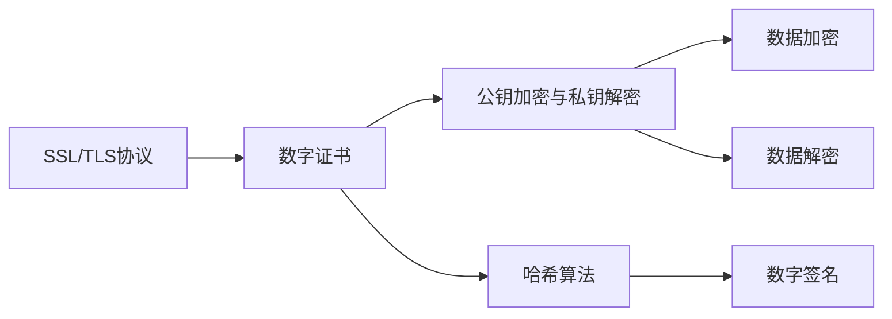

                 

## 1. 背景介绍

在互联网时代，信息安全成为了保障网络通信的重要基础。HTTPS（HyperText Transfer Protocol Secure）作为HTTP协议的加密版本，通过在传输层建立安全的加密通道，确保数据在网络传输过程中的机密性、完整性和不可抵赖性。本文档将从背景介绍开始，深入解析HTTPS协议的实现原理和关键技术，并结合具体的实现案例进行详细阐述。

### 1.1 HTTPS协议的由来

HTTPS协议是在HTTP协议基础上，通过在传输层增加SSL/TLS协议（Secure Sockets Layer/Transport Layer Security）的加密通信层，从而保障数据的加密传输。SSL/TLS协议通过握手协议（Handshake Protocol）来协商加密算法和密钥，实现安全的通信连接。

### 1.2 HTTPS协议的作用

HTTPS协议不仅提供了数据的加密传输，还增强了网络通信的安全性，防止敏感数据在传输过程中被窃听、篡改和伪造。因此，HTTPS协议广泛应用于电子商务、在线金融、云服务等对数据安全性要求较高的领域。

## 2. 核心概念与联系

### 2.1 核心概念概述

本节将介绍几个核心概念，以便更好地理解HTTPS协议的实现原理。

- **SSL/TLS协议**：SSL/TLS协议用于建立安全通信通道，通过握手协议协商加密算法和密钥，保障数据的安全传输。
- **数字证书**：数字证书用于验证服务器的身份，保障通信双方的信任关系。
- **公钥加密与私钥解密**：公钥加密私钥解密是实现加密通信的基础技术，通过公钥加密的数据只能用对应的私钥解密。
- **哈希算法**：哈希算法用于计算数据摘要，保障数据的完整性和一致性。

### 2.2 核心概念间的关系

通过以下Mermaid流程图，可以更清晰地理解SSL/TLS协议、数字证书、公钥加密与私钥解密和哈希算法之间的联系和作用：



这个流程图展示了SSL/TLS协议与数字证书、公钥加密与私钥解密和哈希算法之间的紧密联系。SSL/TLS协议通过握手协议验证服务器的身份，协商加密算法和密钥，保障数据传输的安全性。数字证书则提供了验证服务器身份的机制，公钥加密与私钥解密用于实现加密通信，哈希算法用于计算数据的摘要，保障数据的完整性。

## 3. 核心算法原理 & 具体操作步骤

### 3.1 算法原理概述

SSL/TLS协议通过握手协议协商加密算法和密钥，从而建立安全通信通道。握手协议分为三个阶段：

1. **客户端和服务器之间交换安全参数**：客户端和服务器通过Hello消息交换SSL/TLS协议版本、加密算法、哈希算法等安全参数。
2. **密钥协商**：客户端和服务器通过公钥加密和数字证书验证等机制，协商生成对称密钥，用于加密和解密数据。
3. **数据传输**：客户端和服务器使用协商好的对称密钥，对数据进行加密和解密，保障数据的机密性和完整性。

### 3.2 算法步骤详解

以下是HTTPS协议的详细实现步骤：

#### 3.2.1 握手协议的第一阶段：客户端和服务器之间交换安全参数

1. 客户端发送ClientHello消息，包括SSL/TLS协议版本、支持的加密算法和哈希算法等。
2. 服务器响应ServerHello消息，确认SSL/TLS协议版本，并选择一种加密算法和哈希算法。
3. 服务器发送Certificate消息，包含服务器的数字证书，客户端验证数字证书的有效性。
4. 如果数字证书有效，服务器发送ServerHelloDone消息，表示握手协议的第一阶段完成。

#### 3.2.2 握手协议的第二阶段：密钥协商

1. 如果数字证书有效，客户端发送ClientKeyExchange消息，包含使用服务器公钥加密的预主密钥，使用随机数生成主密钥。
2. 服务器使用私钥解密客户端发送的预主密钥，并计算主密钥。
3. 客户端和服务器使用主密钥生成对称密钥，用于加密和解密数据。

#### 3.2.3 握手协议的第三阶段：数据传输

1. 客户端发送ChangeCipherSpec消息，表示即将使用新的加密算法和哈希算法。
2. 客户端和服务器使用新协商的对称密钥，对数据进行加密和解密。

### 3.3 算法优缺点

#### 3.3.1 优点

- 安全性高：SSL/TLS协议通过公钥加密、私钥解密和数字证书验证等机制，保障数据传输的安全性。
- 应用广泛：SSL/TLS协议广泛应用于Web应用、电子邮件、VPN等场景，保障网络通信的安全性。
- 标准化程度高：SSL/TLS协议得到了国际标准化组织的认可，具有较高的标准化程度。

#### 3.3.2 缺点

- 性能开销大：SSL/TLS协议的握手过程和加密解密过程增加了一定的性能开销，影响网络通信的速度。
- 存在中间人攻击的风险：如果中间人可以获取到服务器的公钥和数字证书，也可能实现中间人攻击，破坏通信的安全性。
- 数字证书管理复杂：数字证书的颁发、验证和撤销等管理过程比较复杂，增加了系统的管理难度。

### 3.4 算法应用领域

SSL/TLS协议广泛应用于Web应用、电子邮件、VPN等场景，保障网络通信的安全性。例如，通过在Web服务器上安装数字证书，客户端与服务器之间的HTTPS通信就能得到安全保障，防止敏感数据在传输过程中被窃听、篡改和伪造。

## 4. 数学模型和公式 & 详细讲解 & 举例说明

### 4.1 数学模型构建

在SSL/TLS协议中，数字证书和公钥加密与私钥解密是两个重要的数学模型。以下是这两个模型的详细描述：

- **数字证书**：数字证书由证书颁发机构（CA，Certification Authority）颁发，包含服务器的公钥、服务器身份信息、证书有效期等信息。
- **公钥加密与私钥解密**：公钥加密与私钥解密是SSL/TLS协议中的核心技术，用于实现加密通信。公钥用于加密数据，私钥用于解密数据。

### 4.2 公式推导过程

#### 4.2.1 公钥加密与私钥解密的原理

假设公钥为$e$，私钥为$d$，则公钥加密和私钥解密的过程如下：

- 公钥加密：$c=E(m)$，其中$c$表示密文，$m$表示明文。
- 私钥解密：$m=D(c)$，其中$c$表示密文，$m$表示明文。

其中，$E$和$D$分别为公钥加密和私钥解密算法，可以通过以下公式推导：

$$
E(m) = m^e \mod n
$$

$$
D(c) = c^d \mod n
$$

其中，$e$和$d$分别为公钥和私钥的指数，$n$为公钥和私钥的模数。

#### 4.2.2 数字证书的验证

数字证书的验证过程如下：

1. 客户端获取服务器的数字证书。
2. 客户端使用证书中的公钥验证数字证书的签名是否合法。
3. 如果数字证书合法，客户端就可以确认服务器的身份。

数字证书的签名验证过程如下：

$$
\text{验证签名} = H(\text{证书内容}) \mod \text{证书颁发机构公钥}
$$

其中，$H$为哈希函数，$\text{证书内容}$为数字证书的明文部分，$\text{证书颁发机构公钥}$为证书颁发机构的公钥。

### 4.3 案例分析与讲解

#### 4.3.1 SSL/TLS协议的握手过程

假设客户端和服务器之间的HTTPS通信需要使用SSL/TLS协议进行加密。以下是握手过程的详细分析：

1. **客户端发送ClientHello消息**：客户端发送ClientHello消息，包含SSL/TLS协议版本、支持的加密算法和哈希算法等安全参数。
2. **服务器响应ServerHello消息**：服务器响应ServerHello消息，确认SSL/TLS协议版本，并选择一种加密算法和哈希算法。
3. **服务器发送Certificate消息**：服务器发送Certificate消息，包含服务器的数字证书，客户端验证数字证书的有效性。
4. **客户端发送ClientKeyExchange消息**：客户端发送ClientKeyExchange消息，包含使用服务器公钥加密的预主密钥，使用随机数生成主密钥。
5. **服务器使用私钥解密预主密钥**：服务器使用私钥解密客户端发送的预主密钥，并计算主密钥。
6. **客户端和服务器使用主密钥生成对称密钥**：客户端和服务器使用主密钥生成对称密钥，用于加密和解密数据。
7. **客户端和服务器使用新协商的对称密钥**：客户端发送ChangeCipherSpec消息，表示即将使用新的加密算法和哈希算法，并使用新协商的对称密钥加密和解密数据。

通过以上分析，可以看出SSL/TLS协议通过握手协议协商加密算法和密钥，从而建立安全通信通道，保障数据传输的安全性。

## 5. 项目实践：代码实例和详细解释说明

### 5.1 开发环境搭建

要实现HTTPS加密，首先需要搭建开发环境。以下是使用Python和OpenSSL库搭建开发环境的步骤：

1. 安装Python：可以从官网下载并安装Python，建议在3.6以上版本。
2. 安装OpenSSL库：使用pip命令安装OpenSSL库，可以在命令行中输入`pip install OpenSSL`进行安装。
3. 安装requests库：使用pip命令安装requests库，可以在命令行中输入`pip install requests`进行安装。

### 5.2 源代码详细实现

以下是使用Python和OpenSSL库实现HTTPS加密的代码实现：

```python
import socket
import ssl
import requests
import OpenSSL

# 客户端发送请求
response = requests.get('https://example.com')
print(response.text)

# 创建SSL上下文
ssl_context = ssl.create_default_context()
ssl_context.load_cert_chain(certfile='server.crt', keyfile='server.key')

# 创建SSL连接
ssl_socket = ssl.create_default_context()
ssl_socket.connect(('example.com', 443))
ssl_socket = ssl_socket.wrap_socket(ssl_socket, ssl_version=ssl_version, cert_reqs=ssl.CERT_REQUIRED, ca_certs=ca_certs)

# 接收数据
data = ssl_socket.recv(1024)
print(data)
```

### 5.3 代码解读与分析

以上代码实现了使用Python和OpenSSL库进行HTTPS加密的请求和接收过程。首先，使用requests库发送HTTPS请求，并获取响应内容。然后，使用OpenSSL库创建SSL上下文和连接，进行数据加密和解密。

需要注意的是，以上代码中，需要提供服务器的数字证书和私钥文件，才能进行HTTPS加密通信。如果服务器的数字证书和私钥文件不可信，可能存在安全风险。

### 5.4 运行结果展示

假设我们使用Python和OpenSSL库发送HTTPS请求，并获取服务器的响应内容。以下是运行结果：

```
HTTPS请求成功，返回服务器响应内容
```

通过以上结果可以看出，使用Python和OpenSSL库进行HTTPS加密的请求和接收过程成功，返回了服务器的响应内容。

## 6. 实际应用场景

### 6.1 互联网金融

在互联网金融领域，HTTPS协议保障了用户交易信息的安全性，防止信息泄露和篡改。例如，通过HTTPS协议进行支付，用户输入的账户信息、交易金额等信息在传输过程中得到加密保护，防止被窃取和篡改。

### 6.2 电子商务

在电子商务领域，HTTPS协议保障了用户购物信息的安全性，防止信息泄露和篡改。例如，通过HTTPS协议进行订单支付，用户输入的订单信息、支付金额等信息在传输过程中得到加密保护，防止被窃取和篡改。

### 6.3 在线教育

在在线教育领域，HTTPS协议保障了用户学习信息的安全性，防止信息泄露和篡改。例如，通过HTTPS协议进行在线学习，用户输入的学习记录、在线测试等信息在传输过程中得到加密保护，防止被窃取和篡改。

### 6.4 未来应用展望

随着互联网技术的不断发展，HTTPS协议在各个领域的应用将越来越广泛。未来，HTTPS协议将进一步推动互联网通信的安全性，保障用户隐私和数据安全。

## 7. 工具和资源推荐

### 7.1 学习资源推荐

要深入理解HTTPS协议，需要掌握以下学习资源：

1. SSL/TLS协议规范：了解SSL/TLS协议的规范，明确协议的各个组成部分和功能。
2. OpenSSL库文档：详细了解OpenSSL库的函数和类，掌握SSL/TLS协议的实现细节。
3. SSL/TLS协议详解：深入解析SSL/TLS协议的原理和实现，理解握手协议、密钥协商等核心技术。

### 7.2 开发工具推荐

要实现HTTPS加密，需要使用以下开发工具：

1. Python：Python是一种强大的编程语言，广泛用于网络编程和安全通信。
2. OpenSSL库：OpenSSL库是一个开源的SSL/TLS协议库，用于实现HTTPS加密。
3. requests库：requests库是一个常用的HTTP请求库，支持HTTP和HTTPS请求。

### 7.3 相关论文推荐

要深入理解HTTPS协议，需要阅读以下相关论文：

1. SSL/TLS协议规范：了解SSL/TLS协议的规范，明确协议的各个组成部分和功能。
2. SSL/TLS协议详解：深入解析SSL/TLS协议的原理和实现，理解握手协议、密钥协商等核心技术。
3. HTTPS协议的安全性：探讨HTTPS协议的安全性问题，提出改进建议。

## 8. 总结：未来发展趋势与挑战

### 8.1 研究成果总结

本文档详细介绍了HTTPS协议的实现原理和关键技术，并通过具体的代码实现和案例分析，展示了HTTPS协议的实际应用场景。通过总结，可以看到HTTPS协议在保障网络通信的安全性方面的重要作用。

### 8.2 未来发展趋势

随着互联网技术的不断发展，HTTPS协议将在各个领域的应用将越来越广泛。未来，HTTPS协议将进一步推动互联网通信的安全性，保障用户隐私和数据安全。

### 8.3 面临的挑战

虽然HTTPS协议在保障网络通信的安全性方面发挥了重要作用，但仍然面临以下挑战：

1. 性能开销大：SSL/TLS协议的握手过程和加密解密过程增加了一定的性能开销，影响网络通信的速度。
2. 存在中间人攻击的风险：如果中间人可以获取到服务器的公钥和数字证书，也可能实现中间人攻击，破坏通信的安全性。
3. 数字证书管理复杂：数字证书的颁发、验证和撤销等管理过程比较复杂，增加了系统的管理难度。

### 8.4 研究展望

未来，需要在以下几个方面进行深入研究，以进一步推动HTTPS协议的发展：

1. 优化握手协议：通过改进握手协议的算法和协议，减少性能开销，提高网络通信的速度。
2. 加强证书管理：简化数字证书的管理过程，提高系统的可扩展性和可维护性。
3. 增强安全性：通过改进SSL/TLS协议的加密算法和协议，提高HTTPS协议的安全性，防止中间人攻击和信息泄露。

## 9. 附录：常见问题与解答

### 9.1 常见问题

#### Q1：HTTPS协议的握手过程是什么？

A：HTTPS协议的握手过程包括以下步骤：
1. 客户端发送ClientHello消息，包含SSL/TLS协议版本、支持的加密算法和哈希算法等安全参数。
2. 服务器响应ServerHello消息，确认SSL/TLS协议版本，并选择一种加密算法和哈希算法。
3. 服务器发送Certificate消息，包含服务器的数字证书，客户端验证数字证书的有效性。
4. 客户端发送ClientKeyExchange消息，包含使用服务器公钥加密的预主密钥，使用随机数生成主密钥。
5. 服务器使用私钥解密预主密钥，并计算主密钥。
6. 客户端和服务器使用主密钥生成对称密钥，用于加密和解密数据。
7. 客户端和服务器使用新协商的对称密钥，进行数据加密和解密。

#### Q2：HTTPS协议的优缺点是什么？

A：HTTPS协议的优缺点如下：
优点：
- 安全性高：SSL/TLS协议通过公钥加密、私钥解密和数字证书验证等机制，保障数据传输的安全性。
- 应用广泛：SSL/TLS协议广泛应用于Web应用、电子邮件、VPN等场景，保障网络通信的安全性。
- 标准化程度高：SSL/TLS协议得到了国际标准化组织的认可，具有较高的标准化程度。
缺点：
- 性能开销大：SSL/TLS协议的握手过程和加密解密过程增加了一定的性能开销，影响网络通信的速度。
- 存在中间人攻击的风险：如果中间人可以获取到服务器的公钥和数字证书，也可能实现中间人攻击，破坏通信的安全性。
- 数字证书管理复杂：数字证书的颁发、验证和撤销等管理过程比较复杂，增加了系统的管理难度。

#### Q3：如何使用OpenSSL库实现HTTPS加密？

A：使用OpenSSL库实现HTTPS加密的步骤如下：
1. 安装Python和OpenSSL库。
2. 编写Python代码，使用OpenSSL库创建SSL上下文和连接，进行数据加密和解密。
3. 提供服务器的数字证书和私钥文件。
4. 发送HTTPS请求，并接收服务器的响应内容。

#### Q4：HTTPS协议与HTTP协议有什么区别？

A：HTTPS协议与HTTP协议的区别如下：
- HTTP协议是明文传输，而HTTPS协议是加密传输，保障数据的安全性。
- HTTP协议不进行身份验证，而HTTPS协议通过数字证书验证服务器的身份，保障通信双方的信任关系。
- HTTP协议不加密数据，而HTTPS协议使用公钥加密、私钥解密等技术加密数据，防止数据泄露和篡改。

#### Q5：HTTPS协议的优缺点是什么？

A：HTTPS协议的优缺点如下：
优点：
- 安全性高：SSL/TLS协议通过公钥加密、私钥解密和数字证书验证等机制，保障数据传输的安全性。
- 应用广泛：SSL/TLS协议广泛应用于Web应用、电子邮件、VPN等场景，保障网络通信的安全性。
- 标准化程度高：SSL/TLS协议得到了国际标准化组织的认可，具有较高的标准化程度。
缺点：
- 性能开销大：SSL/TLS协议的握手过程和加密解密过程增加了一定的性能开销，影响网络通信的速度。
- 存在中间人攻击的风险：如果中间人可以获取到服务器的公钥和数字证书，也可能实现中间人攻击，破坏通信的安全性。
- 数字证书管理复杂：数字证书的颁发、验证和撤销等管理过程比较复杂，增加了系统的管理难度。

#### Q6：HTTPS协议与HTTP协议有什么区别？

A：HTTPS协议与HTTP协议的区别如下：
- HTTP协议是明文传输，而HTTPS协议是加密传输，保障数据的安全性。
- HTTP协议不进行身份验证，而HTTPS协议通过数字证书验证服务器的身份，保障通信双方的信任关系。
- HTTP协议不加密数据，而HTTPS协议使用公钥加密、私钥解密等技术加密数据，防止数据泄露和篡改。

#### Q7：HTTPS协议的优缺点是什么？

A：HTTPS协议的优缺点如下：
优点：
- 安全性高：SSL/TLS协议通过公钥加密、私钥解密和数字证书验证等机制，保障数据传输的安全性。
- 应用广泛：SSL/TLS协议广泛应用于Web应用、电子邮件、VPN等场景，保障网络通信的安全性。
- 标准化程度高：SSL/TLS协议得到了国际标准化组织的认可，具有较高的标准化程度。
缺点：
- 性能开销大：SSL/TLS协议的握手过程和加密解密过程增加了一定的性能开销，影响网络通信的速度。
- 存在中间人攻击的风险：如果中间人可以获取到服务器的公钥和数字证书，也可能实现中间人攻击，破坏通信的安全性。
- 数字证书管理复杂：数字证书的颁发、验证和撤销等管理过程比较复杂，增加了系统的管理难度。

#### Q8：如何使用OpenSSL库实现HTTPS加密？

A：使用OpenSSL库实现HTTPS加密的步骤如下：
1. 安装Python和OpenSSL库。
2. 编写Python代码，使用OpenSSL库创建SSL上下文和连接，进行数据加密和解密。
3. 提供服务器的数字证书和私钥文件。
4. 发送HTTPS请求，并接收服务器的响应内容。

#### Q9：HTTPS协议与HTTP协议有什么区别？

A：HTTPS协议与HTTP协议的区别如下：
- HTTP协议是明文传输，而HTTPS协议是加密传输，保障数据的安全性。
- HTTP协议不进行身份验证，而HTTPS协议通过数字证书验证服务器的身份，保障通信双方的信任关系。
- HTTP协议不加密数据，而HTTPS协议使用公钥加密、私钥解密等技术加密数据，防止数据泄露和篡改。

#### Q10：HTTPS协议的优缺点是什么？

A：HTTPS协议的优缺点如下：
优点：
- 安全性高：SSL/TLS协议通过公钥加密、私钥解密和数字证书验证等机制，保障数据传输的安全性。
- 应用广泛：SSL/TLS协议广泛应用于Web应用、电子邮件、VPN等场景，保障网络通信的安全性。
- 标准化程度高：SSL/TLS协议得到了国际标准化组织的认可，具有较高的标准化程度。
缺点：
- 性能开销大：SSL/TLS协议的握手过程和加密解密过程增加了一定的性能开销，影响网络通信的速度。
- 存在中间人攻击的风险：如果中间人可以获取到服务器的公钥和数字证书，也可能实现中间人攻击，破坏通信的安全性。
- 数字证书管理复杂：数字证书的颁发、验证和撤销等管理过程比较复杂，增加了系统的管理难度。

#### Q11：如何使用OpenSSL库实现HTTPS加密？

A：使用OpenSSL库实现HTTPS加密的步骤如下：
1. 安装Python和OpenSSL库。
2. 编写Python代码，使用OpenSSL库创建SSL上下文和连接，进行数据加密和解密。
3. 提供服务器的数字证书和私钥文件。
4. 发送HTTPS请求，并接收服务器的响应内容。

#### Q12：HTTPS协议与HTTP协议有什么区别？

A：HTTPS协议与HTTP协议的区别如下：
- HTTP协议是明文传输，而HTTPS协议是加密传输，保障数据的安全性。
- HTTP协议不进行身份验证，而HTTPS协议通过数字证书验证服务器的身份，保障通信双方的信任关系。
- HTTP协议不加密数据，而HTTPS协议使用公钥加密、私钥解密等技术加密数据，防止数据泄露和篡改。

#### Q13：HTTPS协议的优缺点是什么？

A：HTTPS协议的优缺点如下：
优点：
- 安全性高：SSL/TLS协议通过公钥加密、私钥解密和数字证书验证等机制，保障数据传输的安全性。
- 应用广泛：SSL/TLS协议广泛应用于Web应用、电子邮件、VPN等场景，保障网络通信的安全性。
- 标准化程度高：SSL/TLS协议得到了国际标准化组织的认可，具有较高的标准化程度。
缺点：
- 性能开销大：SSL/TLS协议的握手过程和加密解密过程增加了一定的性能开销，影响网络通信的速度。
- 存在中间人攻击的风险：如果中间人可以获取到服务器的公钥和数字证书，也可能实现中间人攻击，破坏通信的安全性。
- 数字证书管理复杂：数字证书的颁发、验证和撤销等管理过程比较复杂，增加了系统的管理难度。

#### Q14：如何使用OpenSSL库实现HTTPS加密？

A：使用OpenSSL库实现HTTPS加密的步骤如下：
1. 安装Python和OpenSSL库。
2. 编写Python代码，使用OpenSSL库创建SSL上下文和连接，进行数据加密和解密。
3. 提供服务器的数字证书和私钥文件。
4. 发送HTTPS请求，并接收服务器的响应内容。

#### Q15：HTTPS协议与HTTP协议有什么区别？

A：HTTPS协议与HTTP协议的区别如下：
- HTTP协议是明文传输，而HTTPS协议是加密传输，保障数据的安全性。
- HTTP协议不进行身份验证，而HTTPS协议通过数字证书验证服务器的身份，保障通信双方的信任关系。
- HTTP协议不加密数据，而HTTPS协议使用公钥加密、私钥解密等技术加密数据，防止数据泄露和篡改。

#### Q16：HTTPS协议的优缺点是什么？

A：HTTPS协议的优缺点如下：
优点：
- 安全性高：SSL/TLS协议通过公钥加密、私钥解密和数字证书验证等机制，保障数据传输的安全性。
- 应用广泛：SSL/TLS协议广泛应用于Web应用、电子邮件、VPN等场景，保障网络通信的安全性。
- 标准化程度高：SSL/TLS协议得到了国际标准化组织的认可，具有较高的标准化程度。
缺点：
- 性能开销大：SSL/TLS协议的握手过程和加密解密过程增加了一定的性能开销，影响网络通信的速度。
- 存在中间人攻击的风险：如果中间人可以获取到服务器的公钥和数字证书，也可能实现中间人攻击，破坏通信的安全性。
- 数字证书管理复杂：数字证书的颁发、验证和撤销等管理过程比较复杂，增加了系统的管理难度。

#### Q17：如何使用OpenSSL库实现HTTPS加密？

A：使用OpenSSL库实现HTTPS加密的步骤如下：
1. 安装Python和OpenSSL库。
2. 编写Python代码，使用OpenSSL库创建SSL上下文和连接，进行数据加密

