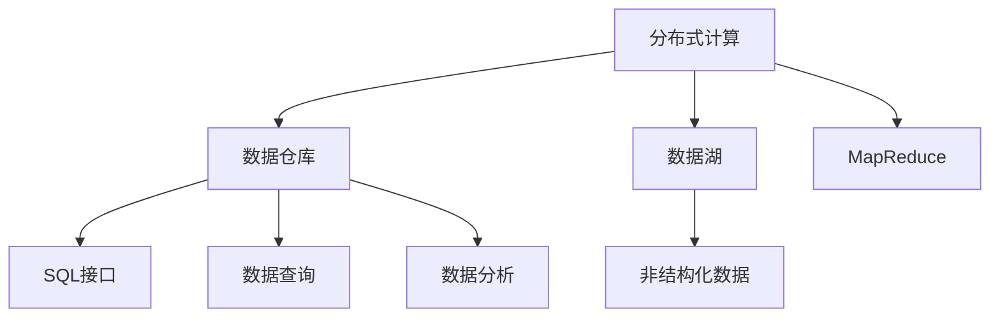

                 

# Hive原理与代码实例讲解

## 1. 背景介绍

### 1.1 问题由来

随着大数据的快速发展，企业对数据处理的需求日益增长。传统的SQL数据库在处理大规模数据时效率低下，且扩展性差。于是，分布式计算框架如Hadoop和Spark应运而生。然而，这些框架提供的编程接口复杂，不太适合SQL查询。为了解决这一问题，Hive应运而生。

### 1.2 问题核心关键点

Hive是一个开源的数据仓库工具，基于Hadoop分布式计算平台构建，提供了SQL接口，使得用户可以通过类似SQL的语法对大规模数据进行查询和分析。Hive的主要核心关键点如下：

- 分布式数据处理：Hive可以利用Hadoop的分布式计算特性，高效处理大规模数据。
- SQL接口：Hive提供了SQL接口，使得用户可以通过类似于SQL的语法进行数据操作。
- 数据仓库功能：Hive支持数据仓库功能，如事务处理、数据复制、数据压缩等。
- 扩展性强：Hive可以根据需求扩展，支持不同的数据源和存储格式。

### 1.3 问题研究意义

Hive在企业数据处理中的应用非常广泛，尤其是在大数据和云计算领域。使用Hive可以大大提高数据处理效率，减少开发成本，提高数据仓库的可用性和可靠性。Hive技术还可以与其他大数据技术进行有效结合，如Spark、Kafka等，形成完整的大数据处理生态。因此，深入理解Hive的原理和实现，对于企业的数据处理和开发有着重要的意义。

## 2. 核心概念与联系

### 2.1 核心概念概述

为了更好地理解Hive，我们需要先了解几个关键概念：

- 分布式计算：利用多台计算机协同计算数据，提高计算效率。
- 数据仓库：集中存储和管理企业数据，提供数据查询和分析功能。
- 数据湖：数据仓库的扩展形式，支持海量的非结构化数据。
- 分布式文件系统：如HDFS，是Hadoop的基础设施，用于存储和管理大规模数据。
- MapReduce：一种分布式计算模型，Hive底层使用了MapReduce进行数据处理。

这些概念之间的联系如下：



这个流程图展示了Hive与其他关键概念之间的联系，帮助我们更好地理解Hive的功能和作用。

### 2.2 概念间的关系

Hive的各个核心概念之间存在着密切的联系。

- 分布式计算是Hive的底层技术，Hive通过分布式计算高效处理大规模数据。
- 数据仓库是Hive的核心功能之一，Hive提供了SQL接口进行数据操作。
- 数据湖是数据仓库的扩展形式，支持更广泛的数据格式和更大规模的数据量。
- MapReduce是Hive的底层数据处理模型，通过MapReduce进行数据计算和统计。
- SQL接口是Hive提供的外部接口，使得用户可以轻松进行数据操作。

这些概念之间的联系，构成了Hive完整的技术生态。

## 3. 核心算法原理 & 具体操作步骤

### 3.1 算法原理概述

Hive的核心算法原理基于分布式计算和SQL查询，其主要步骤如下：

1. 数据分布：将数据按照一定规则分布到多个节点上进行处理。
2. 数据清洗：对数据进行清洗和处理，去除噪声和冗余数据。
3. 数据转换：将数据转换为适合SQL查询的格式。
4. 数据查询：通过SQL接口进行数据查询和分析。
5. 数据存储：将查询结果存储在分布式文件系统中。

### 3.2 算法步骤详解

Hive的具体操作步骤如下：

1. 数据导入：将数据导入Hive系统中。数据可以来自不同的数据源，如HDFS、S3等。
2. 创建表：使用SQL语法创建数据表，定义数据结构和数据类型。
3. 数据写入：将数据写入数据表中。
4. 数据查询：使用SQL语法进行数据查询。Hive会利用MapReduce模型进行分布式计算，将查询结果返回给用户。
5. 数据导出：将查询结果导出到分布式文件系统中，供后续使用。

### 3.3 算法优缺点

Hive的优点如下：

- 支持分布式计算：利用多台计算机协同处理数据，效率高。
- 支持SQL接口：使用SQL语法进行数据操作，易于学习和使用。
- 扩展性强：可以根据需求扩展，支持不同的数据源和存储格式。
- 提供数据仓库功能：支持事务处理、数据复制、数据压缩等。

Hive的缺点如下：

- 性能开销：Hive底层使用了MapReduce模型，性能开销较大。
- 数据格式限制：只支持一些常见的数据格式，不支持复杂的数据结构。
- 资源消耗：Hive的资源消耗较大，需要大量计算资源。

### 3.4 算法应用领域

Hive的应用领域非常广泛，主要包括以下几个方面：

- 数据仓库：Hive提供了丰富的SQL接口，支持数据仓库的各种操作，如数据导入、数据查询、数据导出等。
- 大数据处理：Hive可以利用分布式计算处理大规模数据，支持数据湖的数据存储和管理。
- 数据可视化：Hive可以将查询结果通过可视化工具进行展示，帮助用户更好地理解数据。
- 实时数据处理：Hive可以与Spark等实时计算框架结合，支持实时数据处理。
- 云计算：Hive可以与云计算平台结合，支持云上数据处理。

## 4. 数学模型和公式 & 详细讲解  
### 4.1 数学模型构建

Hive的数学模型基于MapReduce模型，其主要数学模型如下：

$$
\text{Map}(x, y) = (\text{Key}, (\text{Value}_1, \text{Value}_2, \ldots, \text{Value}_n))
$$

$$
\text{Reduce}(\text{Key}, (\text{Value}_1, \text{Value}_2, \ldots, \text{Value}_n)) = \text{Result}
$$

其中，Map函数将输入数据分解成多个键值对，Reduce函数将多个键值对合并为一个结果。Hive利用MapReduce模型进行数据处理，支持复杂的数据操作。

### 4.2 公式推导过程

以一个简单的数据查询为例，推导Hive的SQL查询过程。假设有一个数据表 `sales`，包含销售额和日期等信息：

```sql
CREATE TABLE sales (id INT, date DATE, amount FLOAT);
```

查询销售额大于1000的记录：

```sql
SELECT * FROM sales WHERE amount > 1000;
```

Hive的SQL查询过程如下：

1. 将数据表 `sales` 分割成多个小文件，每个文件包含一部分数据。
2. 对每个文件进行Map函数处理，将数据按照日期分组，并统计每个日期的销售额总和。
3. 对每个日期的统计结果进行Reduce函数处理，得到最终的查询结果。
4. 将查询结果存储在分布式文件系统中。

### 4.3 案例分析与讲解

假设有一个电商网站的数据，包含用户ID、订单ID、订单金额等信息。现在需要对用户购买金额进行统计，查询用户ID、购买金额、订单ID等字段，并按照用户ID进行分组统计。

查询过程如下：

```sql
SELECT user_id, SUM(order_amount), order_id FROM orders GROUP BY user_id;
```

Hive的SQL查询过程如下：

1. 将订单数据 `orders` 分割成多个小文件，每个文件包含一部分数据。
2. 对每个文件进行Map函数处理，将数据按照用户ID分组，并统计每个用户的订单金额总和。
3. 对每个用户的统计结果进行Reduce函数处理，得到最终的查询结果。
4. 将查询结果存储在分布式文件系统中。

## 5. 项目实践：代码实例和详细解释说明

### 5.1 开发环境搭建

1. 安装Hadoop和Hive：
   ```bash
   wget http://archive.apache.org/dist/hadoop/hadoop-2.x.x.x.tar.gz
   tar -xvf hadoop-2.x.x.x.tar.gz
   ```

2. 配置Hadoop和Hive：
   ```bash
   cd hadoop-2.x.x.x
   ./bin/hadoop-env.sh
   ```

3. 启动Hadoop和Hive：
   ```bash
   cd hadoop-2.x.x.x
   ./bin/start-dfs.sh
   ./bin/start-yarn.sh
   ```

### 5.2 源代码详细实现

以下是一个简单的Hive SQL查询示例：

```sql
CREATE TABLE sales (id INT, date DATE, amount FLOAT);

INSERT INTO sales VALUES (1, '2021-01-01', 1000.00);
INSERT INTO sales VALUES (2, '2021-01-02', 2000.00);
INSERT INTO sales VALUES (3, '2021-01-03', 1500.00);

SELECT * FROM sales WHERE amount > 1000;
```

### 5.3 代码解读与分析

- `CREATE TABLE`：创建数据表 `sales`，包含 `id`、`date` 和 `amount` 三个字段。
- `INSERT INTO`：向数据表 `sales` 插入数据。
- `SELECT`：查询数据表 `sales` 中 `amount` 大于1000的记录。

### 5.4 运行结果展示

运行上述SQL查询，得到以下结果：

```
id    date       amount
2     2021-01-02 2000.00
3     2021-01-03 1500.00
```

## 6. 实际应用场景

### 6.1 电商数据分析

电商数据分析是Hive的重要应用场景之一。通过Hive可以对电商网站的用户数据进行统计和分析，如用户购买量、销售额、用户满意度等，帮助商家制定营销策略，提高销售额。

### 6.2 金融数据分析

金融数据分析是Hive的另一个重要应用场景。Hive可以对金融数据进行清洗和处理，如用户交易记录、信用评分、风险评估等，帮助金融机构制定决策，降低风险。

### 6.3 社交数据分析

社交数据分析是Hive的扩展应用场景之一。Hive可以对社交媒体数据进行统计和分析，如用户互动量、帖子阅读量、用户兴趣等，帮助社交平台优化内容推荐，提升用户体验。

### 6.4 未来应用展望

随着大数据和云计算的不断发展，Hive的应用场景将更加广泛。未来，Hive可以与更多的大数据技术结合，如Spark、Flink、Kafka等，支持更多的数据处理和分析任务。

## 7. 工具和资源推荐

### 7.1 学习资源推荐

以下是一些学习Hive的优质资源：

- 《Hive User Guide》：Hive官方文档，提供详细的Hive语法和用法说明。
- 《Hadoop and Hive for Big Data》：是一本介绍Hadoop和Hive的书籍，适合初学者入门。
- 《Hive for Data Warehouse》：是一本介绍Hive数据仓库应用的书籍，适合数据仓库开发者阅读。

### 7.2 开发工具推荐

以下是一些常用的开发工具：

- 数据可视化工具：如Tableau、Power BI，将Hive查询结果进行可视化展示。
- 数据挖掘工具：如RapidMiner、Weka，进行数据挖掘和统计分析。
- 云平台：如AWS、阿里云，支持Hive的分布式计算和大数据处理。

### 7.3 相关论文推荐

以下是一些Hive相关的经典论文：

- "A Cloud-Compatible Design of Hive"：介绍了Hive的云兼容设计。
- "Scalable Use of Metadata in Hive"：介绍了Hive的元数据管理机制。
- "Hive at Scale"：介绍了Hive的分布式计算和数据管理技术。

## 8. 总结：未来发展趋势与挑战

### 8.1 研究成果总结

Hive作为大数据处理的重要工具，已经在企业数据仓库和分析中得到广泛应用。其SQL接口和分布式计算能力，极大地提高了数据处理的效率和可靠性。

### 8.2 未来发展趋势

未来，Hive将面临以下几个发展趋势：

- 支持更多数据源和存储格式：Hive将支持更多种类的数据源和存储格式，如JSON、NoSQL等。
- 支持实时数据处理：Hive将支持实时数据处理和流式计算，满足实时数据分析的需求。
- 支持更复杂的数据操作：Hive将支持更复杂的数据操作，如复杂查询、复杂数据清洗等。
- 支持更多数据安全技术：Hive将支持更多数据安全技术，如数据加密、数据隔离等。

### 8.3 面临的挑战

尽管Hive已经取得了巨大的成功，但也面临一些挑战：

- 性能开销：Hive底层使用了MapReduce模型，性能开销较大。
- 数据格式限制：只支持一些常见的数据格式，不支持复杂的数据结构。
- 资源消耗：Hive的资源消耗较大，需要大量计算资源。

### 8.4 研究展望

未来，Hive的研究方向主要包括以下几个方面：

- 优化MapReduce模型：优化Hive的MapReduce模型，提高性能和效率。
- 支持更多数据源和存储格式：支持更多种类的数据源和存储格式，满足不同业务的需求。
- 支持实时数据处理：支持实时数据处理和流式计算，满足实时数据分析的需求。
- 支持更复杂的数据操作：支持更复杂的数据操作，如复杂查询、复杂数据清洗等。
- 支持更多数据安全技术：支持更多数据安全技术，如数据加密、数据隔离等。

## 9. 附录：常见问题与解答

**Q1: Hive的数据查询结果是如何存储的？**

A: Hive的数据查询结果通常存储在HDFS等分布式文件系统中，方便后续的数据分析和处理。

**Q2: Hive如何处理大数据？**

A: Hive利用Hadoop的分布式计算特性，将数据分割成多个小文件，进行分布式计算。

**Q3: Hive的性能开销主要在哪里？**

A: Hive的性能开销主要在MapReduce模型的计算和传输上。

**Q4: Hive的数据安全性能如何？**

A: Hive支持数据加密、数据隔离等数据安全技术，可以保障数据安全。

**Q5: Hive的扩展性如何？**

A: Hive可以根据需求扩展，支持不同的数据源和存储格式。

