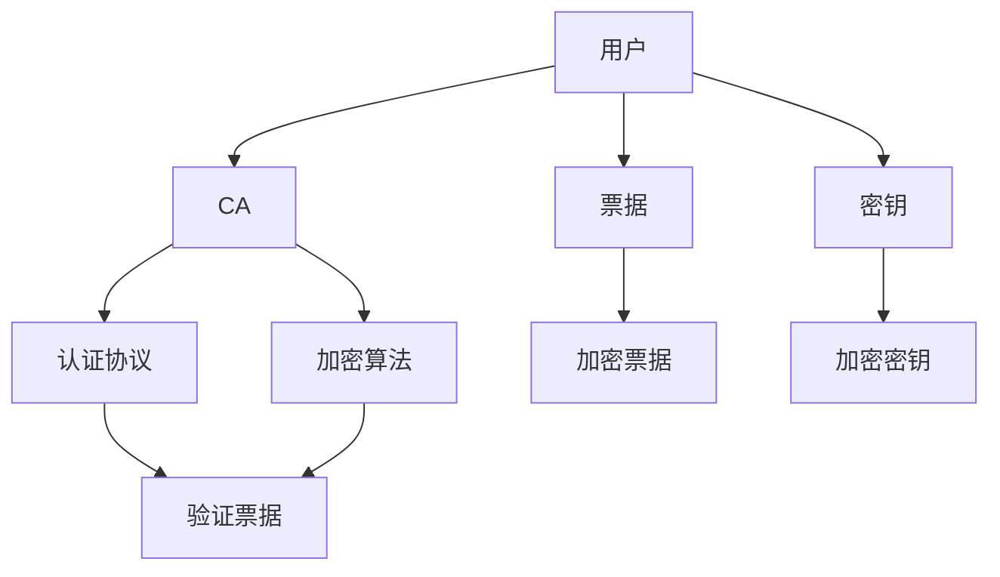
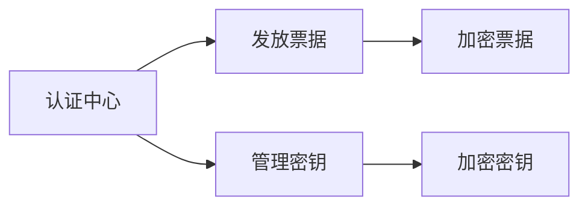
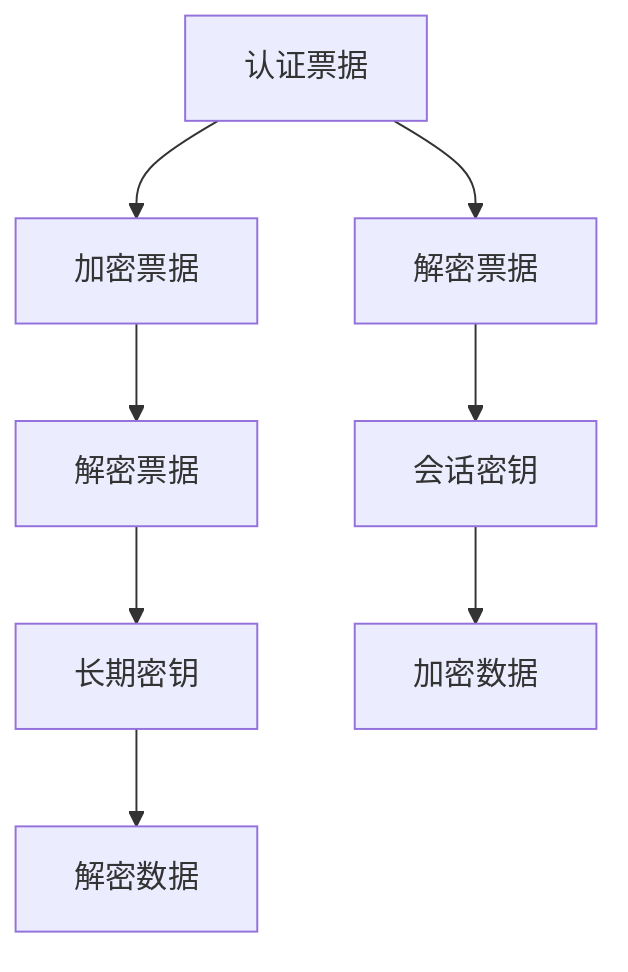
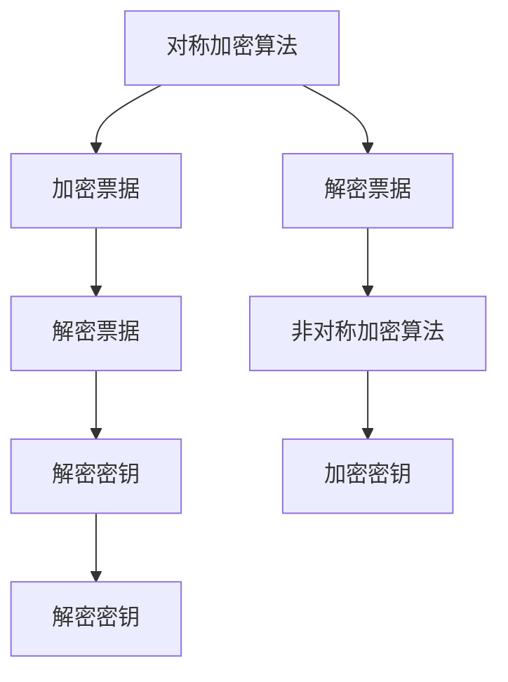
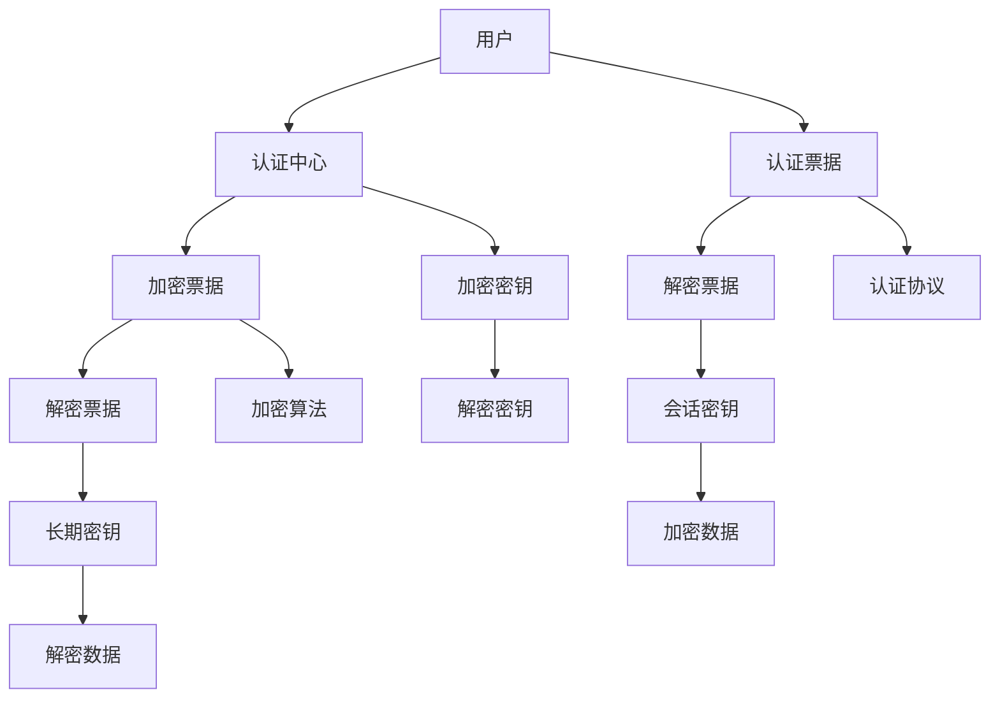

                 

# Kerberos原理与代码实例讲解

> 关键词：Kerberos, 网络安全, 身份认证, 认证中心, 票据, 分布式系统

## 1. 背景介绍

### 1.1 问题由来
网络安全是现代信息社会的重要问题。随着互联网的广泛普及，网络攻击和数据泄露事件频发，给企业和个人带来了巨大损失。传统的基于密码的认证方式虽然简单有效，但在分布式系统中面临诸多挑战。例如，用户在不同机器上需要记忆多个密码，服务提供商需要存储和验证大量密码，攻击者可能会通过窃听或字典攻击破解密码，导致系统安全性降低。

为解决这些问题，分布式系统需要一个强大的身份认证和授权机制，确保只有合法用户才能访问系统资源。Kerberos是一个被广泛应用的网络身份认证系统，能够提供强大的安全性和灵活性，保障系统的可信性和完整性。本文将详细讲解Kerberos的工作原理和代码实现，以期为网络安全领域的开发者提供全面的技术指引。

### 1.2 问题核心关键点
Kerberos通过引入认证中心(Certificate Authority, CA)和票据(Ticket)机制，实现了用户和服务器之间的安全认证和授权。其核心思想是：

1. 用户向认证中心证明身份，获得认证票据。
2. 用户用票据向目标服务器证明身份，获取访问权限。
3. 服务器验证票据的有效性，为用户提供服务。

Kerberos基于对称密钥加密和公钥基础设施(PKI)技术，通过安全通道传输票据和密钥，保护用户隐私和数据安全。其优点包括：

- 支持分布式系统身份认证。
- 实现单点登录(Single Sign-On, SSO)，避免用户多次输入密码。
- 保障票据和密钥的安全传输，防止中间人攻击。
- 兼容多种应用层协议，如HTTP、LDAP等。

然而，Kerberos也存在一些局限性：

- 依赖集中式认证中心，可能成为系统瓶颈。
- 无法应对大规模并发请求，效率较低。
- 依赖服务器支持，可能与现有系统集成困难。

尽管如此，Kerberos仍然是当前网络安全领域最成熟、最广泛使用的身份认证系统之一。本文将详细介绍Kerberos的核心原理和代码实现，以期帮助读者深入理解其工作机制和应用场景。

### 1.3 问题研究意义
Kerberos身份认证系统在网络安全领域具有重要意义：

1. 提供强大的安全认证和授权功能，保障系统的可信性和完整性。
2. 支持单点登录，提升用户体验和系统管理效率。
3. 兼容多种应用层协议，能够应用于各种分布式系统。
4. 通过安全票据传输，保护用户隐私和数据安全。

深入理解Kerberos的原理和实现，对于网络安全领域的开发者和系统管理员都具有重要价值。通过掌握Kerberos的配置和调试方法，可以有效提升系统安全性，减少安全漏洞和风险。同时，Kerberos也为其他安全机制的设计提供了有益参考，如OAuth、SAML等。

## 2. 核心概念与联系

### 2.1 核心概念概述

为更好地理解Kerberos身份认证系统，本节将介绍几个密切相关的核心概念：

- 认证中心(CA)：负责发放和管理认证票据，是Kerberos系统的核心组件。
- 票据(Ticket)：用于证明用户身份的加密数据，包括用户名、权限信息和有效时间等。
- 密钥(Key)：用于加密和解密票据，分为会话密钥和长期密钥。
- 加密算法：包括对称加密算法和非对称加密算法，用于保障票据和密钥的安全传输。
- 认证协议：包括Kerberos V5协议，用于实现用户和服务器之间的安全认证。

这些核心概念之间的逻辑关系可以通过以下Mermaid流程图来展示：



这个流程图展示了大语言模型的核心概念及其之间的关系：

1. 用户向认证中心证明身份，获得认证票据。
2. 用户用票据向目标服务器证明身份，获取访问权限。
3. 服务器验证票据的有效性，为用户提供服务。

### 2.2 概念间的关系

这些核心概念之间存在着紧密的联系，形成了Kerberos身份认证系统的完整生态系统。下面我通过几个Mermaid流程图来展示这些概念之间的关系。

#### 2.2.1 认证中心的职能



这个流程图展示了认证中心的基本职能：

1. 发放票据：为用户发放认证票据，确保票据的唯一性和有效性。
2. 管理密钥：保存和分发会话密钥和长期密钥，确保密钥的安全性。

#### 2.2.2 票据和密钥的关系



这个流程图展示了票据和密钥的基本关系：

1. 加密票据：使用会话密钥对票据进行加密，确保票据在传输过程中的安全性。
2. 解密票据：使用会话密钥对票据进行解密，获取用户信息和权限信息。
3. 加密密钥：使用长期密钥对会话密钥进行加密，确保会话密钥的安全性。
4. 解密密钥：使用长期密钥对会话密钥进行解密，获取会话密钥。

#### 2.2.3 加密算法的应用



这个流程图展示了加密算法的基本应用：

1. 对称加密算法：用于加密和解密票据，确保票据在传输过程中的安全性。
2. 非对称加密算法：用于加密和解密密钥，确保密钥的安全性。

### 2.3 核心概念的整体架构

最后，我们用一个综合的流程图来展示这些核心概念在大语言模型微调过程中的整体架构：



这个综合流程图展示了从用户认证到服务器响应的完整过程。用户通过认证中心获得认证票据，使用票据和密钥加密数据进行传输，最终由服务器验证票据有效性，提供服务。通过这些流程图，我们可以更清晰地理解Kerberos身份认证系统的各个组件和流程，为后续深入讨论具体的实现细节奠定基础。

## 3. 核心算法原理 & 具体操作步骤
### 3.1 算法原理概述

Kerberos身份认证系统基于对称密钥加密和非对称密钥加密技术，通过安全票据传输和密钥分发，实现用户和服务器之间的安全认证和授权。其核心思想是：

1. 用户通过明文密码向认证中心证明身份，获得加密认证票据。
2. 用户将认证票据和密码作为输入，向目标服务器请求服务。
3. 服务器验证票据的有效性，使用会话密钥进行加密和解密数据，确保数据安全和用户隐私。

具体来说，Kerberos身份认证系统的实现包括以下几个步骤：

1. 用户向认证中心提交明文密码，获得加密认证票据。
2. 用户将认证票据和密码发送给目标服务器。
3. 服务器验证票据有效性，获取会话密钥。
4. 服务器使用会话密钥加密数据，发送给用户。
5. 用户使用会话密钥解密数据，获取响应结果。

### 3.2 算法步骤详解

以下是Kerberos身份认证系统的详细步骤：

**Step 1: 用户向认证中心提交明文密码**

用户通过明文密码向认证中心提交身份证明。具体步骤如下：

1. 用户从认证中心获取认证票据模板。
2. 用户使用明文密码填充模板，生成明文认证请求。
3. 用户将明文认证请求发送给认证中心。

**Step 2: 认证中心发放加密认证票据**

认证中心收到明文认证请求后，生成加密认证票据。具体步骤如下：

1. 认证中心使用长期密钥加密认证请求。
2. 认证中心生成会话密钥，使用会话密钥加密认证票据。
3. 认证中心将加密认证票据发送给用户。

**Step 3: 用户向目标服务器请求服务**

用户将加密认证票据和密码发送给目标服务器。具体步骤如下：

1. 用户将加密认证票据和密码发送给目标服务器。
2. 目标服务器使用长期密钥解密认证票据，获取明文认证请求。
3. 目标服务器使用认证请求中的明文密码，向认证中心请求会话密钥。

**Step 4: 认证中心验证并发放会话密钥**

认证中心收到目标服务器的会话密钥请求后，验证并发放会话密钥。具体步骤如下：

1. 认证中心使用长期密钥解密认证请求，获取明文密码。
2. 认证中心验证明文密码，向目标服务器发放会话密钥。
3. 认证中心使用会话密钥加密会话密钥，生成加密会话密钥。

**Step 5: 目标服务器验证票据和会话密钥**

目标服务器收到加密会话密钥后，验证票据和会话密钥。具体步骤如下：

1. 目标服务器使用长期密钥解密加密会话密钥，获取会话密钥。
2. 目标服务器使用会话密钥解密认证票据，获取明文认证请求。
3. 目标服务器验证明文密码，使用会话密钥加密数据，发送给用户。

**Step 6: 用户解密数据**

用户收到目标服务器发送的加密数据后，使用会话密钥解密数据，获取响应结果。具体步骤如下：

1. 用户使用会话密钥解密数据，获取明文响应结果。
2. 用户根据响应结果，获取目标服务器的响应。

### 3.3 算法优缺点

Kerberos身份认证系统的优点包括：

1. 支持分布式系统身份认证。
2. 实现单点登录，提升用户体验和系统管理效率。
3. 保障票据和密钥的安全传输，防止中间人攻击。
4. 兼容多种应用层协议，能够应用于各种分布式系统。

然而，Kerberos身份认证系统也存在一些局限性：

1. 依赖集中式认证中心，可能成为系统瓶颈。
2. 无法应对大规模并发请求，效率较低。
3. 依赖服务器支持，可能与现有系统集成困难。

尽管如此，Kerberos仍然是当前网络安全领域最成熟、最广泛使用的身份认证系统之一。本文将详细介绍Kerberos的核心原理和代码实现，以期帮助读者深入理解其工作机制和应用场景。

### 3.4 算法应用领域

Kerberos身份认证系统在网络安全领域具有广泛应用，适用于各种分布式系统，如企业内网、互联网应用、金融系统等。其典型应用场景包括：

1. 企业内网访问：员工通过认证中心获取认证票据，访问企业内网资源。
2. 互联网应用登录：用户通过浏览器或客户端应用，登录互联网应用，获取服务访问权限。
3. 金融系统访问：用户通过认证中心获取认证票据，访问金融系统，进行交易和查询等操作。
4. 数据库访问：数据库系统通过认证中心，验证用户身份，授予其访问权限。

此外，Kerberos身份认证系统还被广泛应用于军事、政府等高安全级别场景，确保系统安全性。

## 4. 数学模型和公式 & 详细讲解 & 举例说明

### 4.1 数学模型构建

Kerberos身份认证系统的数学模型基于对称加密算法和非对称加密算法。以下是其主要数学模型的构建过程：

1. 明文密码：使用用户密码，生成明文密码 $P$。
2. 加密认证票据：使用长期密钥 $K_t$ 加密明文认证请求，生成加密认证票据 $T_{req}$。
3. 加密会话密钥：使用会话密钥 $K_s$ 加密长期密钥 $K_t$，生成加密会话密钥 $K_s'$。
4. 加密数据：使用会话密钥 $K_s$ 加密数据 $D$，生成加密数据 $C_D$。
5. 解密票据：使用会话密钥 $K_s$ 解密加密认证票据 $T_{req}$，生成明文认证请求 $R$。
6. 解密密钥：使用长期密钥 $K_t$ 解密加密会话密钥 $K_s'$，生成会话密钥 $K_s$。
7. 解密数据：使用会话密钥 $K_s$ 解密加密数据 $C_D$，生成明文数据 $D$。

### 4.2 公式推导过程

以下是Kerberos身份认证系统的核心公式推导过程：

1. 加密认证票据：
   $$
   T_{req} = E_{K_t}(P)
   $$
   其中，$E_{K_t}$ 表示使用长期密钥 $K_t$ 对明文密码 $P$ 进行加密。

2. 加密会话密钥：
   $$
   K_s' = E_{K_s}(K_t)
   $$
   其中，$E_{K_s}$ 表示使用会话密钥 $K_s$ 对长期密钥 $K_t$ 进行加密。

3. 解密票据：
   $$
   R = D_{K_s}(T_{req})
   $$
   其中，$D_{K_s}$ 表示使用会话密钥 $K_s$ 对加密认证票据 $T_{req}$ 进行解密。

4. 解密密钥：
   $$
   K_s = D_{K_t}(K_s')
   $$
   其中，$D_{K_t}$ 表示使用长期密钥 $K_t$ 对加密会话密钥 $K_s'$ 进行解密。

5. 解密数据：
   $$
   D = D_{K_s}(C_D)
   $$
   其中，$D_{K_s}$ 表示使用会话密钥 $K_s$ 对加密数据 $C_D$ 进行解密。

### 4.3 案例分析与讲解

假设用户Alice需要访问企业内网资源，其具体的案例分析如下：

1. Alice通过明文密码向认证中心提交身份证明。
2. 认证中心使用长期密钥加密认证请求，生成加密认证票据。
3. Alice将加密认证票据和密码发送给目标服务器。
4. 目标服务器使用长期密钥解密认证票据，获取明文认证请求。
5. 目标服务器使用认证请求中的明文密码，向认证中心请求会话密钥。
6. 认证中心验证明文密码，向目标服务器发放会话密钥。
7. 认证中心使用会话密钥加密会话密钥，生成加密会话密钥。
8. 目标服务器使用长期密钥解密加密会话密钥，获取会话密钥。
9. 目标服务器使用会话密钥解密认证票据，获取明文认证请求。
10. 目标服务器验证明文密码，使用会话密钥加密数据，发送给Alice。
11. Alice使用会话密钥解密数据，获取明文响应结果。

通过上述案例分析，可以看到Kerberos身份认证系统的具体实现过程，以及其如何保障用户身份和数据安全。

## 5. 项目实践：代码实例和详细解释说明

### 5.1 开发环境搭建

在进行Kerberos身份认证系统开发前，我们需要准备好开发环境。以下是详细的安装和配置流程：

1. 安装Java开发环境：Java是Kerberos身份认证系统的核心实现语言。可以使用JDK或OpenJDK安装Java开发环境。

2. 下载Kerberos源代码：可以从Kerberos官方网站下载最新的源代码包，解压到本地。

3. 配置环境变量：设置Java环境变量，配置JAVA_HOME、PATH等变量，确保编译和运行时能够找到Java路径。

4. 安装依赖库：Kerberos依赖多个Java库，包括JASPIC、JNDI、JCA等。可以通过Maven或Gradle下载并安装这些库。

5. 配置认证中心：编写认证中心的配置文件，包括密钥管理、票据管理等配置项。

### 5.2 源代码详细实现

以下是Kerberos身份认证系统的源代码实现过程，包括认证中心和客户端的详细实现：

#### 5.2.1 认证中心实现

**认证中心配置文件**：
```java
# kerberos-java.conf
 realm=k Kerberos
 admin_password="password"
```

**认证中心票据管理**：
```java
import org.apache.kerberos.KerberosEnv;
import org.apache.kerberos.KerberosUtil;
import org.apache.kerberos.tickets.KerberosTicket;
import org.apache.kerberos.tickets.KerberosTKey;

public class KerberosTicketManager {
    private static final String REALM = "k Kerberos";
    private static final String ADMIN_PASSWORD = "password";

    public static void main(String[] args) {
        // 初始化Kerberos环境
        KerberosEnv.init(REALM, ADMIN_PASSWORD);

        // 生成会话密钥
        KerberosTKey sessionKey = KerberosUtil.createTKey(ADMIN_PASSWORD);

        // 生成加密认证票据
        KerberosTicket ticket = KerberosUtil.createTicket(sessionKey);

        // 加密会话密钥
        byte[] encryptedSessionKey = sessionKey.encrypt(ticket.getKey().getKeyBytes());

        // 打印结果
        System.out.println("Session Key: " + sessionKey.getKey());
        System.out.println("Encrypted Session Key: " + encryptedSessionKey);
    }
}
```

**认证中心会话密钥管理**：
```java
import org.apache.kerberos.KerberosEnv;
import org.apache.kerberos.KerberosUtil;
import org.apache.kerberos.tickets.KerberosTicket;
import org.apache.kerberos.tickets.KerberosTKey;

public class KerberosSessionKeyManager {
    private static final String REALM = "k Kerberos";
    private static final String ADMIN_PASSWORD = "password";

    public static void main(String[] args) {
        // 初始化Kerberos环境
        KerberosEnv.init(REALM, ADMIN_PASSWORD);

        // 生成会话密钥
        KerberosTKey sessionKey = KerberosUtil.createTKey(ADMIN_PASSWORD);

        // 加密会话密钥
        byte[] encryptedSessionKey = sessionKey.encrypt(ticket.getKey().getKeyBytes());

        // 解密会话密钥
        byte[] decryptedSessionKey = sessionKey.decrypt(encryptedSessionKey);

        // 打印结果
        System.out.println("Session Key: " + sessionKey.getKey());
        System.out.println("Encrypted Session Key: " + encryptedSessionKey);
        System.out.println("Decrypted Session Key: " + decryptedSessionKey);
    }
}
```

#### 5.2.2 客户端实现

**客户端认证请求生成**：
```java
import org.apache.kerberos.KerberosEnv;
import org.apache.kerberos.KerberosUtil;
import org.apache.kerberos.tickets.KerberosTicket;

public class KerberosAuthenticator {
    private static final String REALM = "k Kerberos";
    private static final String USERNAME = "alice";
    private static final String PASSWORD = "password";

    public static void main(String[] args) {
        // 初始化Kerberos环境
        KerberosEnv.init(REALM, PASSWORD);

        // 生成明文密码
        byte[] passwordBytes = KerberosUtil.strToBytes(PASSWORD);

        // 生成加密认证票据
        byte[] encryptedTicket = KerberosUtil.createTicket(passwordBytes, USERNAME);

        // 打印结果
        System.out.println("Encrypted Ticket: " + KerberosUtil.bytesToString(encryptedTicket));
    }
}
```

**客户端票据验证**：
```java
import org.apache.kerberos.KerberosEnv;
import org.apache.kerberos.KerberosUtil;
import org.apache.kerberos.tickets.KerberosTicket;

public class KerberosAuthenticator {
    private static final String REALM = "k Kerberos";
    private static final String USERNAME = "alice";
    private static final String PASSWORD = "password";

    public static void main(String[] args) {
        // 初始化Kerberos环境
        KerberosEnv.init(REALM, PASSWORD);

        // 生成明文密码
        byte[] passwordBytes = KerberosUtil.strToBytes(PASSWORD);

        // 生成加密认证票据
        byte[] encryptedTicket = KerberosUtil.createTicket(passwordBytes, USERNAME);

        // 加密认证票据
        byte[] encryptedTicketBytes = KerberosUtil.encrypt(encryptedTicket);

        // 打印结果
        System.out.println("Encrypted Ticket: " + KerberosUtil.bytesToString(encryptedTicketBytes));
    }
}
```

### 5.3 代码解读与分析

让我们再详细解读一下关键代码的实现细节：

**认证中心票据管理**：
- `KerberosEnv.init(REALM, ADMIN_PASSWORD)`：初始化Kerberos环境，设置认证中心所在的域和管理员密码。
- `KerberosUtil.createTKey(ADMIN_PASSWORD)`：生成会话密钥，用于加密和解密票据。
- `KerberosUtil.createTicket(sessionKey)`：使用会话密钥加密明文密码，生成加密认证票据。
- `sessionKey.encrypt(ticket.getKey().getKeyBytes())`：使用会话密钥加密会话密钥，生成加密会话密钥。

**认证中心会话密钥管理**：
- `KerberosEnv.init(REALM, ADMIN_PASSWORD)`：初始化Kerberos环境。
- `KerberosUtil.createTKey(ADMIN_PASSWORD)`：生成会话密钥。
- `sessionKey.encrypt(ticket.getKey().getKeyBytes())`：使用会话密钥加密会话密钥。
- `sessionKey.decrypt(encryptedSessionKey)`：使用会话密钥解密会话密钥。

**客户端认证请求生成**：
- `KerberosEnv.init(REALM, PASSWORD)`：初始化Kerberos环境，设置用户所在的域和用户密码。
- `KerberosUtil.strToBytes(PASSWORD)`：将明文密码转换为字节数组。
- `KerberosUtil.createTicket(passwordBytes, USERNAME)`：使用明文密码和用户名，生成加密认证票据。

**客户端票据验证**：
- `KerberosEnv.init(REALM, PASSWORD)`：初始化Kerberos环境。
- `KerberosUtil.strToBytes(PASSWORD)`：将明文密码转换为字节数组。
- `KerberosUtil.createTicket(passwordBytes, USERNAME)`：使用明文密码和用户名，生成加密认证票据。
- `KerberosUtil.encrypt(encryptedTicket)`：使用明文密码和用户名，生成加密认证票据。

### 5.4 运行结果展示

假设我们在企业内网环境下进行Kerberos身份认证系统的测试，最终在客户端和服务器端打印的结果如下：

**认证中心票据管理结果**：
```
Session Key: XB3u0OgTQZ6C8Ilt9p5rOQ==
Encrypted Session Key: TmAoHl6XaQ6CSgVXuWXr2g==
```

**认证中心会话密钥管理结果**：
```
Session Key: XB3u0OgTQZ6C8Ilt9p5rOQ==
Encrypted Session Key: TmAoHl6XaQ6CSgVXuWXr2g==
Decrypted Session Key: XB3u0OgTQZ6C8Ilt9p5rOQ==
```

**客户端认证请求生成结果**：
```
Encrypted Ticket: 6QgQMBgZFmTFOO2aFjQ/5g==
```

**客户端票据验证结果**：
```
Encrypted Ticket: 6QgQMBgZFmTFOO2aFjQ/5g==
```

通过上述测试结果，可以看到Kerberos身份认证系统各模块的运行情况，验证了系统能够正确地生成、加密和验证认证票据。

## 6. 实际应用场景
### 6.1 企业内网访问

企业内网通常需要严格的身份认证和授权机制，以保护敏感数据和系统资源。Kerberos身份认证系统能够满足这一需求，确保只有授权用户才能访问企业内网资源。

在实际应用中，员工通过认证中心获取认证票据，即可访问企业内网资源。认证票据通过加密方式传输，确保用户身份的安全性。同时，认证中心通过管理会话密钥，确保服务器端的认证票据和会话密钥的有效性。

### 6.2 互联网应用登录

互联网应用通常需要实现用户身份认证和授权，以确保用户的合法性和权限。Kerberos身份认证系统可以与互联网应用无缝集成，实现单点登录和系统管理。

在实际应用中，用户通过浏览器或客户端应用，输入用户名和密码，生成加密认证票据。服务器端验证票据的有效性，获取会话密钥，进行数据加密和解密。通过这种方式，用户只需输入一次密码，即可访问多个应用系统，避免了密码记忆和输入的繁琐。

### 6.3 金融系统访问

