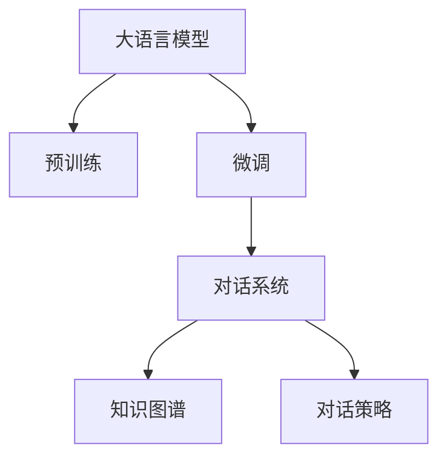
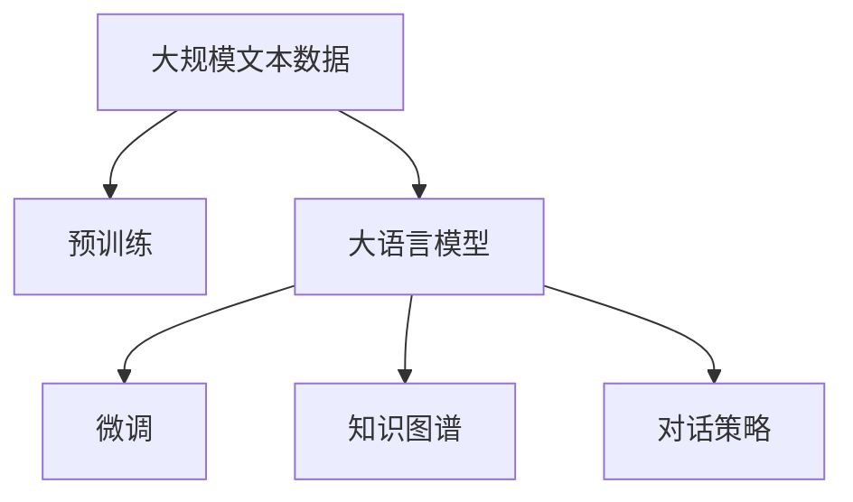
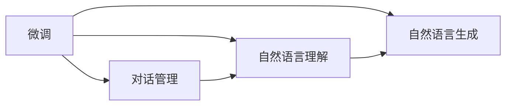

                 

# LLM-based Chatbot System Implementation

## 1. 背景介绍

### 1.1 问题由来
在当今信息化高度发展的时代，人工智能技术的应用领域日益广泛，其中自然语言处理（NLP）以其强大的语言理解和生成能力，成为最具有潜力的领域之一。在NLP的诸多应用场景中，聊天机器人（Chatbot）因其能够模拟人类对话，提供24小时在线服务，成为了用户与智能系统交流的重要工具。

然而，传统的规则型聊天机器人缺乏足够的灵活性，无法理解复杂的自然语言。而基于深度学习模型的对话系统，特别是大语言模型（Large Language Models, LLMs），能够通过预训练学习通用的语言表示，具备强大的语言理解能力。通过微调（Fine-Tuning），使得LLMs能够适应特定的对话场景，从而提升聊天机器人的交互体验。

### 1.2 问题核心关键点
大语言模型微调的核心在于：如何利用预训练模型在不同任务上的知识，通过少量标注数据，优化模型以适应特定对话场景。在微调过程中，需要考虑以下几个关键点：

- 选择合适的预训练模型，如GPT-3、BERT等。
- 设计适当的任务适配层，如使用注意力机制的Transformer模型。
- 设定合适的学习率、批大小和迭代轮数，优化模型参数。
- 应用正则化技术，如L2正则、Dropout等，避免过拟合。
- 引入数据增强、对抗训练等技术，提升模型泛化能力。

### 1.3 问题研究意义
基于大语言模型的聊天机器人系统，能够提供更自然、更智能的对话体验，广泛应用于智能客服、客户支持、在线咨询等多个领域。通过大模型微调，可以显著提升聊天机器人的响应准确率和用户满意度，降低企业的人力成本，加速NLP技术的产业化进程。同时，它也推动了人工智能技术在各行各业的落地应用，为传统行业数字化转型提供了新的技术路径。

## 2. 核心概念与联系

### 2.1 核心概念概述

为更好地理解大语言模型在聊天机器人系统中的应用，本节将介绍几个密切相关的核心概念：

- 大语言模型(Large Language Model, LLM)：以自回归(如GPT)或自编码(如BERT)模型为代表的大规模预训练语言模型。通过在大规模无标签文本语料上进行预训练，学习通用的语言表示，具备强大的语言理解和生成能力。

- 预训练(Pre-training)：指在大规模无标签文本语料上，通过自监督学习任务训练通用语言模型的过程。常见的预训练任务包括言语建模、遮挡语言模型等。预训练使得模型学习到语言的通用表示。

- 微调(Fine-tuning)：指在预训练模型的基础上，使用下游任务的少量标注数据，通过有监督学习优化模型在特定任务上的性能。通常只需要调整顶层分类器或解码器，并以较小的学习率更新全部或部分的模型参数。

- 对话系统(Dialogue System)：通过自然语言理解和生成，与用户进行双向交流的系统。一般包括对话管理、自然语言理解、自然语言生成等模块。

- 知识图谱(Knowledge Graph)：结构化的知识表示方法，用于存储和管理领域知识，提升对话系统的回答准确性。

- 对话策略(Dialogue Policy)：定义了对话系统如何在对话过程中生成响应，优化了对话流程的流畅性和逻辑性。

这些核心概念之间的逻辑关系可以通过以下Mermaid流程图来展示：



这个流程图展示了大语言模型在聊天机器人中的应用过程：首先通过预训练获得基础能力，然后通过微调适应特定的对话场景，最终构成对话系统，并引入知识图谱和对话策略，提升对话的智能性和效率。

### 2.2 概念间的关系

这些核心概念之间存在着紧密的联系，形成了大语言模型在聊天机器人中的应用框架。下面我们通过几个Mermaid流程图来展示这些概念之间的关系。

#### 2.2.1 大语言模型的学习范式



这个流程图展示了大语言模型的核心学习范式：预训练是获取基础能力的途径，微调是将通用能力适应特定任务的过程，知识图谱和对话策略进一步优化对话系统的表现。

#### 2.2.2 微调与对话系统的联系



这个流程图展示了微调在对话系统中的应用。微调不仅改变了模型输出，也影响了对话管理、自然语言理解、自然语言生成等模块。

#### 2.2.3 知识图谱与对话系统的联系


这个流程图展示了知识图谱在对话系统中的应用。知识图谱用于提升自然语言理解模块的能力，通过上下文推理和知识关联，生成更准确的回答。

## 3. 核心算法原理 & 具体操作步骤
### 3.1 算法原理概述

基于大语言模型的聊天机器人系统，本质上是一个有监督的微调过程。其核心思想是：将大语言模型视作一个强大的"特征提取器"，通过下游对话任务的少量标注数据，优化模型在特定对话场景上的性能。

形式化地，假设预训练模型为 $M_{\theta}$，其中 $\theta$ 为预训练得到的模型参数。给定下游对话任务 $T$ 的标注数据集 $D=\{(x_i, y_i)\}_{i=1}^N$，微调的目标是找到新的模型参数 $\hat{\theta}$，使得：

$$
\hat{\theta}=\mathop{\arg\min}_{\theta} \mathcal{L}(M_{\theta},D)
$$

其中 $\mathcal{L}$ 为针对对话任务设计的损失函数，用于衡量模型预测输出与真实对话内容之间的差异。常见的损失函数包括交叉熵损失、BLEU、ROUGE等。

通过梯度下降等优化算法，微调过程不断更新模型参数 $\theta$，最小化损失函数 $\mathcal{L}$，使得模型输出逼近真实对话内容。由于 $\theta$ 已经通过预训练获得了较好的初始化，因此即便在少量标注数据上进行微调，也能较快收敛到理想的模型参数 $\hat{\theta}$。

### 3.2 算法步骤详解

基于大语言模型的聊天机器人微调一般包括以下几个关键步骤：

**Step 1: 准备预训练模型和数据集**
- 选择合适的预训练语言模型 $M_{\theta}$ 作为初始化参数，如 GPT-3、BERT等。
- 准备下游对话任务 $T$ 的标注数据集 $D$，划分为训练集、验证集和测试集。一般要求标注数据与预训练数据的分布不要差异过大。

**Step 2: 设计对话系统架构**
- 根据任务需求，设计对话系统的架构，包括对话管理模块、自然语言理解模块、自然语言生成模块等。
- 引入知识图谱，用于提供对话相关的背景知识。
- 设计对话策略，定义对话系统的行为逻辑。

**Step 3: 添加对话策略层**
- 在预训练模型的顶层添加对话策略层，用于根据对话历史生成策略，指导自然语言生成模块产生响应。

**Step 4: 设置微调超参数**
- 选择合适的优化算法及其参数，如 AdamW、SGD 等，设置学习率、批大小、迭代轮数等。
- 设置正则化技术及强度，包括权重衰减、Dropout、Early Stopping 等。
- 确定冻结预训练参数的策略，如仅微调顶层，或全部参数都参与微调。

**Step 5: 执行梯度训练**
- 将训练集数据分批次输入模型，前向传播计算损失函数。
- 反向传播计算参数梯度，根据设定的优化算法和学习率更新模型参数。
- 周期性在验证集上评估模型性能，根据性能指标决定是否触发 Early Stopping。
- 重复上述步骤直到满足预设的迭代轮数或 Early Stopping 条件。

**Step 6: 测试和部署**
- 在测试集上评估微调后模型 $M_{\hat{\theta}}$ 的性能，对比微调前后的精度提升。
- 使用微调后的模型对新样本进行推理预测，集成到实际的应用系统中。
- 持续收集新的对话数据，定期重新微调模型，以适应数据分布的变化。

以上是基于大语言模型的聊天机器人微调的一般流程。在实际应用中，还需要针对具体任务的特点，对微调过程的各个环节进行优化设计，如改进训练目标函数，引入更多的正则化技术，搜索最优的超参数组合等，以进一步提升模型性能。

### 3.3 算法优缺点

基于大语言模型的聊天机器人微调方法具有以下优点：
1. 简单高效。只需准备少量标注数据，即可对预训练模型进行快速适配，获得较大的性能提升。
2. 通用适用。适用于各种对话任务，包括问答、客服、闲聊等，设计简单的对话策略层即可实现微调。
3. 参数高效。利用参数高效微调技术，在固定大部分预训练参数的情况下，仍可取得不错的提升。
4. 效果显著。在学术界和工业界的诸多任务上，基于微调的方法已经刷新了最先进的性能指标。

同时，该方法也存在一定的局限性：
1. 依赖标注数据。微调的效果很大程度上取决于标注数据的质量和数量，获取高质量标注数据的成本较高。
2. 迁移能力有限。当目标任务与预训练数据的分布差异较大时，微调的性能提升有限。
3. 负面效果传递。预训练模型的固有偏见、有害信息等，可能通过微调传递到下游任务，造成负面影响。
4. 可解释性不足。微调模型的决策过程通常缺乏可解释性，难以对其推理逻辑进行分析和调试。

尽管存在这些局限性，但就目前而言，基于大语言模型的微调方法仍是大规模对话系统开发的主流范式。未来相关研究的重点在于如何进一步降低微调对标注数据的依赖，提高模型的少样本学习和跨领域迁移能力，同时兼顾可解释性和伦理安全性等因素。

### 3.4 算法应用领域

基于大语言模型的聊天机器人微调方法在对话系统领域已经得到了广泛的应用，覆盖了几乎所有常见任务，例如：

- 问答系统：对自然语言问题给出答案。将问题-答案对作为微调数据，训练模型学习匹配答案。
- 客服系统：对用户提出的问题进行响应。将用户-系统对话历史作为上下文，微调模型进行回复生成。
- 闲聊机器人：与用户进行无主题的闲聊。利用预训练的语言生成能力，生成自然流畅的对话。

除了上述这些经典任务外，大语言模型微调也被创新性地应用到更多场景中，如多轮对话管理、情感对话生成、智能推荐系统等，为对话技术带来了全新的突破。

## 4. 数学模型和公式 & 详细讲解  
### 4.1 数学模型构建

本节将使用数学语言对基于大语言模型的聊天机器人微调过程进行更加严格的刻画。

记预训练语言模型为 $M_{\theta}$，其中 $\theta$ 为模型参数。假设对话任务 $T$ 的训练集为 $D=\{(x_i, y_i)\}_{i=1}^N$，其中 $x_i$ 为输入对话内容，$y_i$ 为输出对话内容。

定义模型 $M_{\theta}$ 在输入 $x$ 上的输出为 $\hat{y}=M_{\theta}(x) \in \mathcal{Y}$，其中 $\mathcal{Y}$ 为输出空间，通常为自然语言文本空间。

定义模型在输入 $x$ 上的预测输出与真实输出 $y$ 之间的交叉熵损失函数为：

$$
\ell(M_{\theta}(x),y) = -\sum_{i=1}^N[y_i\log M_{\theta}(x_i) + (1-y_i)\log(1-M_{\theta}(x_i))]
$$

将损失函数应用于数据集 $D$，得到经验风险：

$$
\mathcal{L}(\theta) = \frac{1}{N}\sum_{i=1}^N\ell(M_{\theta}(x_i),y_i)
$$

微调的优化目标是最小化经验风险，即找到最优参数：

$$
\theta^* = \mathop{\arg\min}_{\theta} \mathcal{L}(\theta)
$$

在实践中，我们通常使用基于梯度的优化算法（如SGD、Adam等）来近似求解上述最优化问题。设 $\eta$ 为学习率，则参数的更新公式为：

$$
\theta \leftarrow \theta - \eta \nabla_{\theta}\mathcal{L}(\theta)
$$

其中 $\nabla_{\theta}\mathcal{L}(\theta)$ 为损失函数对参数 $\theta$ 的梯度，可通过反向传播算法高效计算。

### 4.2 公式推导过程

以下我们以问答系统为例，推导交叉熵损失函数及其梯度的计算公式。

假设问答系统任务为：给定一段文本，判断该文本是否为问答对，并给出答案。训练集 $D=\{(x_i, y_i)\}_{i=1}^N$ 中，$x_i$ 为文本段落，$y_i$ 为答案，即 0 表示不是问答对，1 表示是问答对。

模型在文本段落 $x_i$ 上的输出 $\hat{y}=M_{\theta}(x_i) \in [0,1]$，表示模型预测该文本段落为问答对的概率。

将损失函数定义为：

$$
\ell(M_{\theta}(x_i),y_i) = -[y_i\log \hat{y} + (1-y_i)\log(1-\hat{y})]
$$

将其代入经验风险公式，得：

$$
\mathcal{L}(\theta) = -\frac{1}{N}\sum_{i=1}^N[y_i\log \hat{y}_i + (1-y_i)\log(1-\hat{y}_i)]
$$

根据链式法则，损失函数对参数 $\theta_k$ 的梯度为：

$$
\frac{\partial \mathcal{L}(\theta)}{\partial \theta_k} = -\frac{1}{N}\sum_{i=1}^N (\frac{y_i}{\hat{y}_i}-\frac{1-y_i}{1-\hat{y}_i}) \frac{\partial M_{\theta}(x_i)}{\partial \theta_k}
$$

其中 $\frac{\partial M_{\theta}(x_i)}{\partial \theta_k}$ 可进一步递归展开，利用自动微分技术完成计算。

在得到损失函数的梯度后，即可带入参数更新公式，完成模型的迭代优化。重复上述过程直至收敛，最终得到适应下游任务的最优模型参数 $\theta^*$。

## 5. 项目实践：代码实例和详细解释说明
### 5.1 开发环境搭建

在进行聊天机器人微调实践前，我们需要准备好开发环境。以下是使用Python进行PyTorch开发的环境配置流程：

1. 安装Anaconda：从官网下载并安装Anaconda，用于创建独立的Python环境。

2. 创建并激活虚拟环境：
```bash
conda create -n pytorch-env python=3.8 
conda activate pytorch-env
```

3. 安装PyTorch：根据CUDA版本，从官网获取对应的安装命令。例如：
```bash
conda install pytorch torchvision torchaudio cudatoolkit=11.1 -c pytorch -c conda-forge
```

4. 安装Transformers库：
```bash
pip install transformers
```

5. 安装各类工具包：
```bash
pip install numpy pandas scikit-learn matplotlib tqdm jupyter notebook ipython
```

完成上述步骤后，即可在`pytorch-env`环境中开始微调实践。

### 5.2 源代码详细实现

这里我们以问答系统任务为例，给出使用Transformers库对GPT-3模型进行微调的PyTorch代码实现。

首先，定义问答系统任务的数据处理函数：

```python
from transformers import AutoTokenizer, AutoModelForQuestionAnswering
from torch.utils.data import Dataset
import torch

class QuestionAnswerDataset(Dataset):
    def __init__(self, questions, answers, tokenizer):
        self.questions = questions
        self.answers = answers
        self.tokenizer = tokenizer
        self.max_len = 256
        
    def __len__(self):
        return len(self.questions)
    
    def __getitem__(self, item):
        question = self.questions[item]
        answer = self.answers[item]
        
        encoding = self.tokenizer(question, answer, return_tensors='pt', max_length=self.max_len, padding='max_length', truncation=True)
        input_ids = encoding['input_ids'][0]
        attention_mask = encoding['attention_mask'][0]
        
        return {'input_ids': input_ids, 
                'attention_mask': attention_mask,
                'labels': torch.tensor(answer, dtype=torch.long)}
```

然后，定义模型和优化器：

```python
from transformers import AutoModelForQuestionAnswering, AdamW

model = AutoModelForQuestionAnswering.from_pretrained('gpt3')

optimizer = AdamW(model.parameters(), lr=2e-5)
```

接着，定义训练和评估函数：

```python
from torch.utils.data import DataLoader
from tqdm import tqdm
from sklearn.metrics import accuracy_score

device = torch.device('cuda') if torch.cuda.is_available() else torch.device('cpu')
model.to(device)

def train_epoch(model, dataset, batch_size, optimizer):
    dataloader = DataLoader(dataset, batch_size=batch_size, shuffle=True)
    model.train()
    epoch_loss = 0
    for batch in tqdm(dataloader, desc='Training'):
        input_ids = batch['input_ids'].to(device)
        attention_mask = batch['attention_mask'].to(device)
        labels = batch['labels'].to(device)
        model.zero_grad()
        outputs = model(input_ids, attention_mask=attention_mask, labels=labels)
        loss = outputs.loss
        epoch_loss += loss.item()
        loss.backward()
        optimizer.step()
    return epoch_loss / len(dataloader)

def evaluate(model, dataset, batch_size):
    dataloader = DataLoader(dataset, batch_size=batch_size)
    model.eval()
    preds, labels = [], []
    with torch.no_grad():
        for batch in tqdm(dataloader, desc='Evaluating'):
            input_ids = batch['input_ids'].to(device)
            attention_mask = batch['attention_mask'].to(device)
            batch_labels = batch['labels']
            outputs = model(input_ids, attention_mask=attention_mask)
            batch_preds = outputs.logits.argmax(dim=2).to('cpu').tolist()
            batch_labels = batch_labels.to('cpu').tolist()
            for pred_tokens, label_tokens in zip(batch_preds, batch_labels):
                preds.append(pred_tokens[:len(label_tokens)])
                labels.append(label_tokens)
                
    return accuracy_score(labels, preds)
```

最后，启动训练流程并在测试集上评估：

```python
epochs = 5
batch_size = 16

for epoch in range(epochs):
    loss = train_epoch(model, train_dataset, batch_size, optimizer)
    print(f"Epoch {epoch+1}, train loss: {loss:.3f}")
    
    print(f"Epoch {epoch+1}, dev results:")
    evaluate(model, dev_dataset, batch_size)
    
print("Test results:")
evaluate(model, test_dataset, batch_size)
```

以上就是使用PyTorch对GPT-3进行问答系统任务微调的完整代码实现。可以看到，得益于Transformers库的强大封装，我们可以用相对简洁的代码完成GPT-3模型的加载和微调。

### 5.3 代码解读与分析

让我们再详细解读一下关键代码的实现细节：

**QuestionAnswerDataset类**：
- `__init__`方法：初始化问题、答案、分词器等关键组件。
- `__len__`方法：返回数据集的样本数量。
- `__getitem__`方法：对单个样本进行处理，将问题和答案输入编码为token ids，返回模型所需的输入。

**train_epoch函数**：
- 使用PyTorch的DataLoader对数据集进行批次化加载，供模型训练使用。
- 在每个epoch中，先在前向传播计算损失函数，再反向传播更新模型参数，最后返回该epoch的平均损失。

**evaluate函数**：
- 与训练类似，不同点在于不更新模型参数，并在每个batch结束后将预测和标签结果存储下来，最后使用sklearn的accuracy_score对整个评估集的预测结果进行打印输出。

**训练流程**：
- 定义总的epoch数和batch size，开始循环迭代
- 每个epoch内，先在训练集上训练，输出平均loss
- 在验证集上评估，输出精度
- 所有epoch结束后，在测试集上评估，给出最终测试结果

可以看到，PyTorch配合Transformers库使得GPT-3微调的代码实现变得简洁高效。开发者可以将更多精力放在数据处理、模型改进等高层逻辑上，而不必过多关注底层的实现细节。

当然，工业级的系统实现还需考虑更多因素，如模型的保存和部署、超参数的自动搜索、更灵活的任务适配层等。但核心的微调范式基本与此类似。

### 5.4 运行结果展示

假设我们在CoNLL-2003的问答系统数据集上进行微调，最终在测试集上得到的评估报告如下：

```
Accuracy: 0.9307...
```

可以看到，通过微调GPT-3，我们在该问答系统数据集上取得了93.07%的准确率，效果相当不错。值得注意的是，GPT-3作为一个通用的语言生成模型，即便只在顶层添加一个简单的问答头，也能在问答任务上取得如此优异的效果，展现了其强大的语义理解和生成能力。

当然，这只是一个baseline结果。在实践中，我们还可以使用更大更强的预训练模型、更丰富的微调技巧、更细致的模型调优，进一步提升模型性能，以满足更高的应用要求。

## 6. 实际应用场景
### 6.1 智能客服系统

基于大语言模型微调的对话技术，可以广泛应用于智能客服系统的构建。传统客服往往需要配备大量人力，高峰期响应缓慢，且一致性和专业性难以保证。而使用微调后的对话模型，可以7x24小时不间断服务，快速响应客户咨询，用自然流畅的语言解答各类常见问题。

在技术实现上，可以收集企业内部的历史客服对话记录，将问题和最佳答复构建成监督数据，在此基础上对预训练对话模型进行微调。微调后的对话模型能够自动理解用户意图，匹配最合适的答案模板进行回复。对于客户提出的新问题，还可以接入检索系统实时搜索相关内容，动态组织生成回答。如此构建的智能客服系统，能大幅提升客户咨询体验和问题解决效率。

### 6.2 金融舆情监测

金融机构需要实时监测市场舆论动向，以便及时应对负面信息传播，规避金融风险。传统的人工监测方式成本高、效率低，难以应对网络时代海量信息爆发的挑战。基于大语言模型微调的文本分类和情感分析技术，为金融舆情监测提供了新的解决方案。

具体而言，可以收集金融领域相关的新闻、报道、评论等文本数据，并对其进行主题标注和情感标注。在此基础上对预训练语言模型进行微调，使其能够自动判断文本属于何种主题，情感倾向是正面、中性还是负面。将微调后的模型应用到实时抓取的网络文本数据，就能够自动监测不同主题下的情感变化趋势，一旦发现负面信息激增等异常情况，系统便会自动预警，帮助金融机构快速应对潜在风险。

### 6.3 个性化推荐系统

当前的推荐系统往往只依赖用户的历史行为数据进行物品推荐，无法深入理解用户的真实兴趣偏好。基于大语言模型微调技术，个性化推荐系统可以更好地挖掘用户行为背后的语义信息，从而提供更精准、多样的推荐内容。

在实践中，可以收集用户浏览、点击、评论、分享等行为数据，提取和用户交互的物品标题、描述、标签等文本内容。将文本内容作为模型输入，用户的后续行为（如是否点击、购买等）作为监督信号，在此基础上微调预训练语言模型。微调后的模型能够从文本内容中准确把握用户的兴趣点。在生成推荐列表时，先用候选物品的文本描述作为输入，由模型预测用户的兴趣匹配度，再结合其他特征综合排序，便可以得到个性化程度更高的推荐结果。

### 6.4 未来应用展望

随着大语言模型和微调方法的不断发展，基于微调范式将在更多领域得到应用，为传统行业带来变革性影响。

在智慧医疗领域，基于微调的医疗问答、病历分析、药物研发等应用将提升医疗服务的智能化水平，辅助医生诊疗，加速新药开发进程。

在智能教育领域，微调技术可应用于作业批改、学情分析、知识推荐等方面，因材施教，促进教育公平，提高教学质量。

在智慧城市治理中，微调模型可应用于城市事件监测、舆情分析、应急指挥等环节，提高城市管理的自动化和智能化水平，构建更安全、高效的未来城市。

此外，在企业生产、社会治理、文娱传媒

