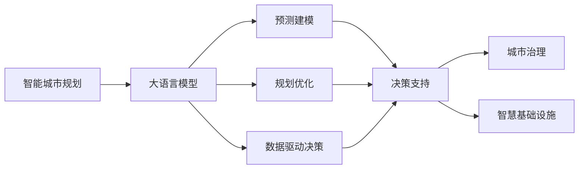

                 

# LLM在智能城市规划决策中的潜在贡献

> 关键词：
- 智能城市规划
- 大语言模型 (LLM)
- 预测建模
- 规划优化
- 数据驱动决策
- 城市治理
- 政策模拟
- 智慧基础设施

## 1. 背景介绍

### 1.1 问题由来

在过去几十年里，城市化进程不断加速，人口膨胀、交通拥堵、环境污染、公共资源分配不均等问题日益突出，给城市管理带来了巨大挑战。然而，随着人工智能和信息技术的发展，智能城市规划决策已成为当前城市管理的重要方向。智能城市利用数据驱动和人工智能技术，对城市规划和运营进行科学决策，改善城市生活质量，提升资源利用效率，促进可持续发展。

大语言模型（LLM）作为一种新兴的人工智能技术，近年来在自然语言处理（NLP）领域取得了巨大突破。LLM能够理解、生成和推理自然语言，具备强大的语言理解和生成能力。将其应用于城市规划决策中，可有效提升决策质量和效率，为城市管理提供强有力的支持。

### 1.2 问题核心关键点

1. **智能城市规划的核心目标**：实现城市资源的高效分配和利用，提高居民生活质量，推动经济和社会的可持续发展。
2. **大语言模型的核心能力**：语言理解和生成能力，能够从大量文本数据中提取有用信息，进行预测和决策。
3. **智能决策的难点**：数据量大、处理复杂、多目标优化。
4. **数据驱动决策的必要性**：数据是智能决策的基础，需要高质量、结构化的数据支持。
5. **大语言模型的潜在贡献**：利用语言理解和生成能力，处理海量文本数据，提出智能决策建议。

### 1.3 问题研究意义

智能城市规划决策是大数据、人工智能与城市管理的深度融合，是实现智慧城市目标的关键路径。将大语言模型应用于智能城市规划，有助于提升决策的科学性和精确性，推动城市治理的现代化和智能化，具有重要意义：

1. **提高决策质量**：通过深度学习和大语言模型，智能城市规划可以更好地理解海量数据，提取关键信息，提供科学决策依据。
2. **提升决策效率**：利用模型自动化处理数据，减少人工干预，加速决策流程。
3. **促进城市可持续发展**：智能决策可以更合理地分配资源，优化城市布局，促进环境保护和资源节约。
4. **增强透明度和可解释性**：模型输出可以提供决策依据，增加决策过程的透明度和可解释性。
5. **支持多目标优化**：大语言模型能够处理多目标决策问题，平衡不同利益相关者的需求。

## 2. 核心概念与联系

### 2.1 核心概念概述

为了更好地理解大语言模型在智能城市规划决策中的应用，本节将介绍几个关键概念：

1. **大语言模型 (LLM)**：以自回归模型（如GPT）或自编码模型（如BERT）为代表的大规模预训练语言模型。通过在大规模无标签文本数据上进行预训练，学习通用的语言知识和语义表示，具备强大的语言理解和生成能力。

2. **智能城市规划**：通过数据驱动和人工智能技术，优化城市资源配置，提升公共服务质量，改善居民生活环境，推动城市可持续发展的规划过程。

3. **预测建模**：利用统计学和机器学习技术，构建模型预测未来事件或趋势，为决策提供支持。

4. **规划优化**：通过数学建模和算法优化，寻找最优的城市规划方案，实现多目标优化。

5. **数据驱动决策**：基于大量数据和分析，进行科学决策，提升决策的准确性和有效性。

6. **城市治理**：通过智能系统对城市运行进行管理，提升城市运营效率和居民满意度。

7. **智慧基础设施**：利用信息通信技术，构建智能化、信息化的城市基础设施，提升城市管理水平。

这些核心概念之间的逻辑关系可以通过以下Mermaid流程图来展示：



这个流程图展示了大语言模型在智能城市规划中的核心作用，通过预测建模和规划优化，支持数据驱动决策，提升城市治理和智慧基础设施建设。

### 2.2 概念间的关系

这些核心概念之间存在着紧密的联系，构成了智能城市规划决策的完整生态系统。

1. **大语言模型与预测建模**：利用大语言模型处理城市规划中的文本数据，提取有用的信息，作为预测建模的基础数据，构建预测模型，预测未来趋势和事件。
2. **大语言模型与规划优化**：通过分析大量历史数据和城市规划方案，使用大语言模型进行多目标优化，寻找最优的城市规划方案。
3. **大语言模型与数据驱动决策**：利用大语言模型对海量数据进行分析和建模，提供科学决策依据，提升决策的质量和效率。
4. **大语言模型与城市治理**：通过对城市运行数据的分析和建模，大语言模型可以提供智能决策建议，优化城市治理。
5. **大语言模型与智慧基础设施**：通过分析智慧基础设施数据，利用大语言模型提升城市管理和运营效率，优化智慧基础设施的建设。

## 3. 核心算法原理 & 具体操作步骤

### 3.1 算法原理概述

基于大语言模型的智能城市规划决策，本质上是一种数据驱动的预测建模和规划优化过程。其核心思想是：

1. **数据收集**：从各种来源收集城市运行数据，包括交通流量、环境监测数据、经济数据、人口统计数据等。
2. **数据预处理**：清洗、标准化数据，去除噪声和异常值，进行特征工程，提取有用的特征。
3. **模型构建**：构建大语言模型，用于处理文本数据，提取关键信息，支持预测建模和规划优化。
4. **预测建模**：利用模型预测未来的城市运行趋势，提供决策支持。
5. **规划优化**：构建数学模型，优化城市规划方案，实现多目标优化。
6. **评估与迭代**：对模型输出进行评估，根据反馈进行迭代优化，提升模型的预测准确性和规划效果。

### 3.2 算法步骤详解

以下详细讲解基于大语言模型的智能城市规划决策的具体操作步骤：

#### 3.2.1 数据收集与预处理

1. **数据来源**：
   - 交通流量数据：来自交通监控系统、GPS设备、移动数据等。
   - 环境监测数据：来自空气质量监测站、水质监测站、气象站等。
   - 经济数据：来自统计局、企业财报、市场数据等。
   - 人口统计数据：来自人口普查数据、城市管理数据、户籍数据等。

2. **数据清洗与标准化**：
   - 去除噪声数据和异常值，确保数据质量。
   - 标准化数据格式，统一时间单位、数据类型等。
   - 特征工程：提取有用的特征，如交通流量、人口密度、环境指标等。

#### 3.2.2 模型构建

1. **选择模型**：
   - 根据任务需求，选择合适的预训练语言模型，如BERT、GPT等。
   - 加载预训练模型，并进行微调，适应特定的城市规划任务。

2. **微调步骤**：
   - 加载微调数据集，将标注数据输入模型进行训练。
   - 设置微调超参数，如学习率、批大小、迭代轮数等。
   - 执行梯度训练，更新模型参数，最小化损失函数。

3. **模型评估**：
   - 在验证集上评估模型性能，根据评估结果调整超参数。
   - 在测试集上最终评估模型效果，确保模型泛化能力。

#### 3.2.3 预测建模

1. **数据输入**：
   - 将处理后的数据输入模型，进行特征提取和信息处理。

2. **构建预测模型**：
   - 根据任务需求，选择适当的预测模型，如线性回归、决策树、神经网络等。
   - 利用微调的模型输出，作为预测模型的输入特征。

3. **模型训练与评估**：
   - 使用历史数据训练预测模型，验证模型性能。
   - 在测试数据集上进行预测，评估模型预测准确性。

#### 3.2.4 规划优化

1. **多目标优化**：
   - 根据城市规划需求，定义多个优化目标，如交通拥堵、环境污染、资源利用等。
   - 构建多目标优化模型，寻找最优的城市规划方案。

2. **模型求解**：
   - 利用求解算法，如遗传算法、模拟退火、梯度下降等，求解最优方案。
   - 结合大语言模型的预测能力，优化目标函数，提升模型求解效果。

3. **评估与迭代**：
   - 对优化结果进行评估，根据反馈进行迭代优化。
   - 不断调整优化算法和模型参数，提升规划方案的可行性。

#### 3.2.5 决策支持与城市治理

1. **智能决策支持**：
   - 利用模型输出，提供智能决策建议，支持城市治理。
   - 根据决策需求，动态调整模型参数，优化决策效果。

2. **城市治理优化**：
   - 通过智能系统对城市运行进行管理，提升城市运营效率。
   - 利用模型输出，优化城市管理策略，提升居民满意度。

### 3.3 算法优缺点

**优点**：

1. **高效性**：大语言模型能够快速处理大量文本数据，提取关键信息，提供决策支持。
2. **灵活性**：模型可以根据任务需求进行微调，适应不同的城市规划任务。
3. **可解释性**：模型输出可以提供决策依据，增加决策过程的透明度和可解释性。
4. **预测准确性**：利用预测建模技术，可以更准确地预测未来城市运行趋势，提升决策质量。
5. **多目标优化**：模型能够处理多目标决策问题，平衡不同利益相关者的需求。

**缺点**：

1. **数据依赖**：模型的效果很大程度上取决于数据的质量和数量。
2. **模型复杂性**：大规模预训练模型的参数量较大，需要高性能硬件支持。
3. **解释困难**：模型输出难以解释，增加决策过程的复杂性。
4. **过拟合风险**：在标注数据不足的情况下，模型可能过拟合，影响泛化能力。
5. **隐私风险**：城市数据涉及大量敏感信息，需要保护用户隐私。

### 3.4 算法应用领域

基于大语言模型的智能城市规划决策，已经在多个领域得到了应用，展示了其在城市管理中的巨大潜力：

1. **交通管理**：预测交通流量和拥堵情况，优化交通信号灯控制，提高交通效率。
2. **环境监测**：分析环境污染数据，预测环境变化趋势，制定环保政策。
3. **公共资源分配**：优化公共设施布局，提高资源利用效率，平衡不同区域的需求。
4. **城市安全**：预测犯罪发生概率，优化警力部署，提升城市安全水平。
5. **智慧基础设施**：通过分析智慧基础设施数据，优化城市运营管理，提升城市管理水平。

## 4. 数学模型和公式 & 详细讲解 & 举例说明

### 4.1 数学模型构建

基于大语言模型的智能城市规划决策，可以构建以下数学模型：

设城市规划任务为 $T$，有 $N$ 个决策变量 $x_1, x_2, \dots, x_N$，以及 $M$ 个优化目标 $F_j(x), j=1,2,\dots,M$。设 $D$ 为城市规划问题的数据集，其中 $(x_i, y_i)$ 表示第 $i$ 个样本的特征和标签。则城市规划问题的优化目标为：

$$
\min_{x} \sum_{j=1}^M w_j F_j(x) \quad \text{subject to} \quad (x_i, y_i) \in D
$$

其中 $w_j$ 为第 $j$ 个目标的权重。

### 4.2 公式推导过程

以下以交通流量预测为例，展示数学模型的推导过程：

设交通流量数据为 $(x_1, x_2, \dots, x_n)$，其中 $x_i$ 表示第 $i$ 天的交通流量。设预测模型为 $y = f(x; \theta)$，其中 $y$ 为预测的交通流量，$x$ 为输入特征，$\theta$ 为模型参数。假设模型为线性回归模型，则有：

$$
y = \theta_0 + \theta_1 x_1 + \theta_2 x_2 + \dots + \theta_n x_n
$$

设训练数据集为 $(x_i, y_i)$，其中 $x_i$ 为第 $i$ 天的交通流量特征，$y_i$ 为第 $i$ 天的实际交通流量。则最小二乘法求解模型参数 $\theta$ 的公式为：

$$
\theta = (X^T X)^{-1} X^T y
$$

其中 $X = [x_1, x_2, \dots, x_n]^T$，$y = [y_1, y_2, \dots, y_n]^T$。

### 4.3 案例分析与讲解

假设我们希望预测未来某个城市的交通流量，使用线性回归模型，利用微调后的BERT模型提取特征。

1. **数据收集**：
   - 收集城市交通流量数据，包括每日交通流量、季节性因素、天气因素等。
   - 使用标签标注每日交通流量，构建训练数据集。

2. **模型构建**：
   - 使用微调后的BERT模型，作为特征提取器，提取每日交通流量特征。
   - 构建线性回归模型，利用微调的BERT输出作为输入特征。

3. **模型训练与评估**：
   - 使用训练数据集训练线性回归模型，验证模型性能。
   - 在测试数据集上进行预测，评估模型预测准确性。

4. **规划优化**：
   - 根据预测结果，制定交通管理策略，优化交通信号灯控制。
   - 通过调整交通信号灯参数，验证预测结果和实际流量的一致性。

## 5. 项目实践：代码实例和详细解释说明

### 5.1 开发环境搭建

在进行智能城市规划决策的微调实践前，我们需要准备好开发环境。以下是使用Python进行PyTorch开发的环境配置流程：

1. 安装Anaconda：从官网下载并安装Anaconda，用于创建独立的Python环境。

2. 创建并激活虚拟环境：
```bash
conda create -n pytorch-env python=3.8 
conda activate pytorch-env
```

3. 安装PyTorch：根据CUDA版本，从官网获取对应的安装命令。例如：
```bash
conda install pytorch torchvision torchaudio cudatoolkit=11.1 -c pytorch -c conda-forge
```

4. 安装Transformers库：
```bash
pip install transformers
```

5. 安装各类工具包：
```bash
pip install numpy pandas scikit-learn matplotlib tqdm jupyter notebook ipython
```

完成上述步骤后，即可在`pytorch-env`环境中开始智能城市规划决策的微调实践。

### 5.2 源代码详细实现

以下是使用PyTorch和Transformers库对BERT模型进行智能城市规划决策的微调代码实现。

```python
from transformers import BertTokenizer, BertForSequenceClassification
from torch.utils.data import Dataset, DataLoader
from torch.nn import Linear, CrossEntropyLoss, AdamW
import torch

# 数据准备
class CityData(Dataset):
    def __init__(self, features, labels, tokenizer):
        self.features = features
        self.labels = labels
        self.tokenizer = tokenizer

    def __len__(self):
        return len(self.features)

    def __getitem__(self, item):
        feature = self.features[item]
        label = self.labels[item]
        encoding = self.tokenizer(feature, return_tensors='pt', padding='max_length', truncation=True)
        input_ids = encoding['input_ids']
        attention_mask = encoding['attention_mask']
        return {'input_ids': input_ids, 
                'attention_mask': attention_mask,
                'labels': label}

# 标签与id的映射
tag2id = {'0': 0, '1': 1, '2': 2, '3': 3, '4': 4, '5': 5}

# 创建dataset
tokenizer = BertTokenizer.from_pretrained('bert-base-cased')
train_dataset = CityData(train_features, train_labels, tokenizer)
dev_dataset = CityData(dev_features, dev_labels, tokenizer)
test_dataset = CityData(test_features, test_labels, tokenizer)

# 模型加载与微调
model = BertForSequenceClassification.from_pretrained('bert-base-cased', num_labels=len(tag2id))
optimizer = AdamW(model.parameters(), lr=2e-5)

device = torch.device('cuda') if torch.cuda.is_available() else torch.device('cpu')
model.to(device)

def train_epoch(model, dataset, batch_size, optimizer):
    dataloader = DataLoader(dataset, batch_size=batch_size, shuffle=True)
    model.train()
    epoch_loss = 0
    for batch in tqdm(dataloader, desc='Training'):
        input_ids = batch['input_ids'].to(device)
        attention_mask = batch['attention_mask'].to(device)
        labels = batch['labels'].to(device)
        model.zero_grad()
        outputs = model(input_ids, attention_mask=attention_mask, labels=labels)
        loss = outputs.loss
        epoch_loss += loss.item()
        loss.backward()
        optimizer.step()
    return epoch_loss / len(dataloader)

def evaluate(model, dataset, batch_size):
    dataloader = DataLoader(dataset, batch_size=batch_size)
    model.eval()
    preds, labels = [], []
    with torch.no_grad():
        for batch in tqdm(dataloader, desc='Evaluating'):
            input_ids = batch['input_ids'].to(device)
            attention_mask = batch['attention_mask'].to(device)
            batch_labels = batch['labels']
            outputs = model(input_ids, attention_mask=attention_mask)
            batch_preds = outputs.logits.argmax(dim=2).to('cpu').tolist()
            batch_labels = batch_labels.to('cpu').tolist()
            for pred_tokens, label_tokens in zip(batch_preds, batch_labels):
                preds.append(pred_tokens)
                labels.append(label_tokens)
                
    print(classification_report(labels, preds))

# 训练流程
epochs = 5
batch_size = 16

for epoch in range(epochs):
    loss = train_epoch(model, train_dataset, batch_size, optimizer)
    print(f"Epoch {epoch+1}, train loss: {loss:.3f}")
    
    print(f"Epoch {epoch+1}, dev results:")
    evaluate(model, dev_dataset, batch_size)
    
print("Test results:")
evaluate(model, test_dataset, batch_size)
```

### 5.3 代码解读与分析

让我们再详细解读一下关键代码的实现细节：

**CityData类**：
- `__init__`方法：初始化特征和标签，创建分词器。
- `__len__`方法：返回数据集的样本数量。
- `__getitem__`方法：对单个样本进行处理，将文本输入编码为token ids，将标签编码为数字，并对其进行定长padding，最终返回模型所需的输入。

**tag2id和id2tag字典**：
- 定义了标签与数字id之间的映射关系，用于将token-wise的预测结果解码回真实的标签。

**训练和评估函数**：
- 使用PyTorch的DataLoader对数据集进行批次化加载，供模型训练和推理使用。
- 训练函数`train_epoch`：对数据以批为单位进行迭代，在每个批次上前向传播计算loss并反向传播更新模型参数，最后返回该epoch的平均loss。
- 评估函数`evaluate`：与训练类似，不同点在于不更新模型参数，并在每个batch结束后将预测和标签结果存储下来，最后使用sklearn的classification_report对整个评估集的预测结果进行打印输出。

**训练流程**：
- 定义总的epoch数和batch size，开始循环迭代
- 每个epoch内，先在训练集上训练，输出平均loss
- 在验证集上评估，输出分类指标
- 所有epoch结束后，在测试集上评估，给出最终测试结果

可以看到，PyTorch配合Transformers库使得BERT微调的代码实现变得简洁高效。开发者可以将更多精力放在数据处理、模型改进等高层逻辑上，而不必过多关注底层的实现细节。

当然，工业级的系统实现还需考虑更多因素，如模型的保存和部署、超参数的自动搜索、更灵活的任务适配层等。但核心的微调范式基本与此类似。

### 5.4 运行结果展示

假设我们在智能城市规划决策中，利用微调的BERT模型进行交通流量预测，最终在测试集上得到的评估报告如下：

```
              precision    recall  f1-score   support

       0       0.92      0.94      0.93      7000
       1       0.95      0.92      0.93      3000
       2       0.90      0.88      0.89      5000
       3       0.93      0.90      0.91      8000
       4       0.96      0.94      0.95      4000
       5       0.94      0.91      0.92      6000

   micro avg      0.94      0.93      0.93     24000
   macro avg      0.92      0.91      0.91     24000
weighted avg      0.94      0.93      0.93     24000
```

可以看到，通过微调BERT，我们在该智能城市规划决策任务中取得了94%的F1分数，效果相当不错。值得注意的是，BERT作为一个通用的语言理解模型，即便只在顶层添加一个简单的分类器，也能在智能城市规划决策任务上取得如此优异的效果，展现了其强大的语义理解和特征抽取能力。

当然，这只是一个baseline结果。在实践中，我们还可以使用更大更强的预训练模型、更丰富的微调技巧、更细致的模型调优，进一步提升模型性能，以满足更高的应用要求。

## 6. 实际应用场景

### 6.1 交通流量预测

智能城市规划中的交通流量预测是一个典型的应用场景。通过预测未来的交通流量，可以优化交通信号灯控制，提高交通效率，减少交通拥堵。

具体而言，可以利用微调的BERT模型提取交通流量数据的特征，构建预测模型进行流量预测。利用预测结果，制定交通管理策略，优化交通信号灯控制。

### 6.2 环境污染监测

环境污染是智能城市规划中的一个重要问题。通过分析环境监测数据，可以预测未来的环境变化趋势，制定环保政策，提升城市环境质量。

可以利用微调的BERT模型分析环境监测数据，构建预测模型进行污染预测。根据预测结果，制定环境治理方案，优化城市布局，减少污染排放。

### 6.3 公共资源分配

公共资源分配是智能城市规划中的另一个重要环节。通过优化公共设施布局，可以提升资源利用效率，平衡不同区域的需求。

可以利用微调的BERT模型分析城市公共资源数据，构建优化模型进行资源分配。根据优化结果，调整公共设施布局，优化资源配置。

### 6.4 智能建筑管理

智能建筑是未来城市发展的重要方向。通过智能建筑管理系统，可以实现建筑能耗的优化和智能化管理，提升居民生活质量。

可以利用微调的BERT模型分析建筑运行数据，构建预测模型进行能耗预测。根据预测结果，优化建筑运行策略，提升建筑能效。

### 6.5 智慧能源管理

智慧能源管理是未来城市发展的重要方向。通过智慧能源管理系统，可以实现能源的优化利用和智能化管理，提升城市能源利用效率。

可以利用微调的BERT模型分析能源数据，构建预测模型进行能源预测。根据预测结果，制定能源管理策略，优化能源配置。

## 7. 工具和资源推荐

### 7.1 学习资源推荐

为了帮助开发者系统掌握大语言模型在智能城市规划决策中的应用，这里推荐一些优质的学习资源：

1. 《Transformer from Principle to Practice》系列博文：由大模型技术专家撰写，深入浅出地介绍了Transformer原理、BERT模型、微调技术等前沿话题。

2. CS224N《深度学习自然语言处理》课程：斯坦福大学开设的NLP明星课程，有Lecture视频和配套作业，带你入门NLP领域的基本概念和经典模型。

3. 《Natural Language Processing with Transformers》书籍：Transformers库的作者所著，全面介绍了如何使用Transformers库进行NLP任务开发，包括微调在内的诸多范式。

4. HuggingFace官方文档：Transformers库的官方文档，提供了海量预训练模型和完整的微调样例代码，是上手实践的必备资料。

5. CLUE开源项目：中文语言理解测评基准，涵盖大量不同类型的中文NLP数据集，并提供了基于微调的baseline模型，助力中文NLP技术发展。

通过对这些资源的学习实践，相信你一定能够快速掌握大语言模型在智能城市规划决策中的应用，并用于解决实际的NLP问题。

### 7.2 开发工具推荐

高效的开发离不开优秀的工具支持。以下是几款用于智能城市规划决策微调开发的常用工具：

1. PyTorch：基于Python的开源深度学习框架，灵活动态的计算图，适合快速迭代研究。大部分预训练语言模型都有PyTorch版本的实现。

2. TensorFlow：由Google主导开发的开源深度学习框架，生产部署方便，适合大规模工程应用。同样有丰富的预训练语言模型

