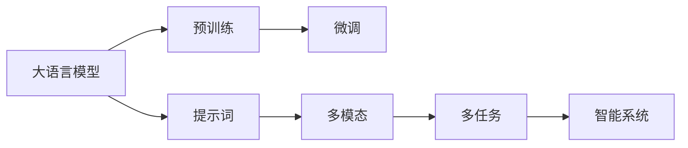
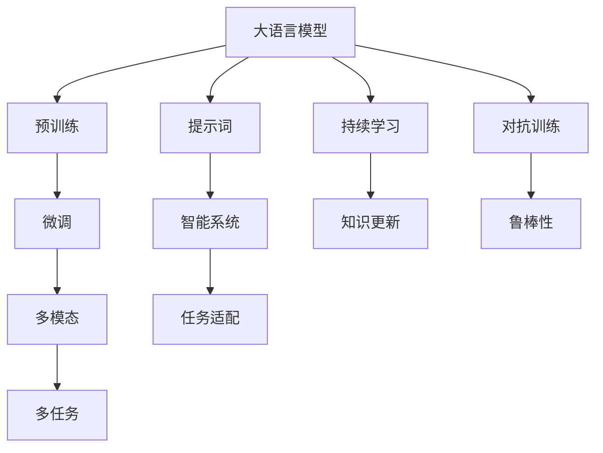

                 

# LangGPT 提示词框架的未来

> 关键词：大语言模型,提示词Prompting,微调Fine-Tuning,自然语言处理NLP,多模态多任务学习,人工智能AI

## 1. 背景介绍

### 1.1 问题由来

近年来，随着深度学习技术的发展，大语言模型（Large Language Models，LLMs）在自然语言处理（Natural Language Processing，NLP）领域取得了显著进展。其中，基于提示词（Prompting）的大语言模型在各种任务上表现出色，成为NLP应用的重要工具。然而，尽管提示词技术已经取得了一些成功，但仍面临许多挑战，例如提示词设计困难、模型泛化能力不足、模型响应速度慢等。这些挑战限制了大语言模型在实际应用中的广泛应用。

### 1.2 问题核心关键点

提示词框架的核心在于如何设计有效的提示词，使大语言模型能够高效地处理各种任务。提示词框架的设计不仅需要考虑如何利用预训练模型的知识，还需要考虑如何处理多样化的任务，提高模型的泛化能力和响应速度。

## 2. 核心概念与联系

### 2.1 核心概念概述

1. **大语言模型（LLMs）**：以自回归模型（如GPT）或自编码模型（如BERT）为代表的大规模预训练语言模型。通过在大规模无标签文本数据上进行预训练，学习通用的语言表示，具备强大的语言理解和生成能力。

2. **提示词（Prompting）**：通过在输入文本中添加特定的提示词或结构，引导大语言模型进行特定的推理或生成任务。提示词的设计是提示词框架的核心。

3. **微调（Fine-Tuning）**：指在预训练模型的基础上，使用下游任务的少量标注数据，通过有监督地训练优化模型在特定任务上的性能。

4. **多模态多任务学习（Multimodal Multitask Learning）**：将大语言模型应用于多模态数据和多任务处理的框架，如结合文本、图像、语音等多模态数据，处理多个相关或不相关的任务。

5. **人工智能（AI）**：通过构建智能系统，实现人机交互、自动化决策、知识获取和表达等。

这些核心概念之间的联系如下图所示：



大语言模型通过预训练获取基础知识，通过提示词框架进行任务适配，再通过微调优化模型性能，形成智能系统的核心组件。多模态和多任务处理可以进一步拓展大语言模型的应用范围，推动人工智能的发展。

### 2.2 概念间的关系

这些核心概念之间的关系如图示：



大语言模型通过预训练获取基础知识，通过微调优化模型性能，再通过多模态和多任务处理拓展应用范围，形成智能系统的核心组件。提示词框架可以引导模型进行特定任务，提高模型的泛化能力。持续学习和对抗训练可以提高模型的鲁棒性和更新速度。

## 3. 核心算法原理 & 具体操作步骤

### 3.1 算法原理概述

提示词框架的核心原理是通过在输入文本中添加提示词或结构，引导大语言模型进行特定的推理或生成任务。提示词的设计需要考虑如何利用预训练模型的知识，如何处理多样化的任务，以及如何提高模型的泛化能力和响应速度。

### 3.2 算法步骤详解

1. **提示词设计**：根据任务的不同，设计合适的提示词或结构，使其能够引导大语言模型进行特定的推理或生成任务。提示词的设计需要考虑任务类型、输入数据格式、模型特性等因素。

2. **模型适配**：选择合适的预训练模型，并在其基础上进行微调或参数高效微调，以适应特定的任务需求。微调时，可以保留大部分预训练权重，只更新顶层部分参数，以提高微调效率。

3. **模型训练**：使用提示词框架和微调后的模型，对下游任务进行有监督训练。训练时，可以使用常规的梯度下降算法，如AdamW、SGD等，并设置合适的学习率、批大小等超参数。

4. **模型评估和优化**：在训练过程中，使用验证集评估模型的性能，并根据评估结果进行模型优化。优化时，可以使用正则化技术、数据增强、对抗训练等方法，以提高模型的泛化能力和鲁棒性。

5. **模型部署和应用**：在训练完成后，将微调后的模型部署到实际应用中，处理各种NLP任务。部署时，需要考虑模型的推理速度、资源占用等问题，并进行相应的优化。

### 3.3 算法优缺点

**优点**：

- **高效性**：提示词框架可以通过少量的提示词设计，高效地引导大语言模型进行特定任务，减少微调过程中的标注数据需求。
- **泛化能力**：提示词框架可以处理多样化的任务，提高模型的泛化能力。
- **适应性**：提示词框架可以适应不同的任务和数据格式，具有一定的灵活性。

**缺点**：

- **设计难度**：提示词的设计需要丰富的经验和创意，设计不当可能导致模型性能不佳。
- **泛化能力有限**：提示词框架的性能依赖于提示词设计，设计不当可能导致模型泛化能力不足。
- **响应速度慢**：提示词框架在处理复杂任务时，可能需要较长的推理时间，影响模型的响应速度。

### 3.4 算法应用领域

提示词框架已经在各种NLP任务中得到了广泛应用，例如：

- **问答系统**：通过提示词框架，将用户问题转换为特定的形式，引导大语言模型生成答案。
- **对话系统**：通过提示词框架，将对话历史和用户输入转换为特定的形式，引导大语言模型生成回复。
- **文本摘要**：通过提示词框架，将长文本转换为特定的形式，引导大语言模型生成摘要。
- **文本分类**：通过提示词框架，将文本输入转换为特定的形式，引导大语言模型进行分类。
- **机器翻译**：通过提示词框架，将源语言文本转换为特定的形式，引导大语言模型进行翻译。

## 4. 数学模型和公式 & 详细讲解

### 4.1 数学模型构建

假设大语言模型为 $M_{\theta}$，其中 $\theta$ 为模型参数。给定下游任务 $T$ 的标注数据集 $D=\{(x_i,y_i)\}_{i=1}^N$，其中 $x_i$ 为输入数据，$y_i$ 为标签。

定义任务 $T$ 的损失函数为：

$$
\mathcal{L}(\theta)=\frac{1}{N}\sum_{i=1}^N\ell(M_{\theta}(x_i),y_i)
$$

其中 $\ell$ 为特定的损失函数，如交叉熵损失、均方误差损失等。

### 4.2 公式推导过程

以二分类任务为例，假设模型 $M_{\theta}$ 在输入 $x$ 上的输出为 $\hat{y}=M_{\theta}(x)$，表示样本属于正类的概率。真实标签 $y \in \{0,1\}$。则二分类交叉熵损失函数定义为：

$$
\ell(M_{\theta}(x),y)=-[y\log \hat{y}+(1-y)\log(1-\hat{y})]
$$

将其代入经验风险公式，得：

$$
\mathcal{L}(\theta)=-\frac{1}{N}\sum_{i=1}^N[y_i\log M_{\theta}(x_i)+(1-y_i)\log(1-M_{\theta}(x_i))]
$$

根据链式法则，损失函数对参数 $\theta_k$ 的梯度为：

$$
\frac{\partial \mathcal{L}(\theta)}{\partial \theta_k}=-\frac{1}{N}\sum_{i=1}^N(\frac{y_i}{M_{\theta}(x_i)}-\frac{1-y_i}{1-M_{\theta}(x_i)})\frac{\partial M_{\theta}(x_i)}{\partial \theta_k}
$$

其中 $\frac{\partial M_{\theta}(x_i)}{\partial \theta_k}$ 可进一步递归展开，利用自动微分技术完成计算。

### 4.3 案例分析与讲解

以文本分类任务为例，假设提示词为 $\text{“将以下文本分为两类：”}$，将输入文本 $x_i$ 转换为提示词后，引导大语言模型进行分类。具体实现过程如下：

1. **提示词设计**：将输入文本 $x_i$ 转换为特定的形式，如 $\text{“将以下文本分为两类：[输入文本]}$。
2. **模型适配**：选择预训练模型，并在其基础上进行微调。可以选择保留大部分预训练权重，只更新顶层部分参数，以提高微调效率。
3. **模型训练**：使用提示词框架和微调后的模型，对下游任务进行有监督训练。训练时，可以使用常规的梯度下降算法，并设置合适的学习率、批大小等超参数。
4. **模型评估和优化**：在训练过程中，使用验证集评估模型的性能，并根据评估结果进行模型优化。优化时，可以使用正则化技术、数据增强、对抗训练等方法，以提高模型的泛化能力和鲁棒性。

## 5. 项目实践：代码实例和详细解释说明

### 5.1 开发环境搭建

在进行提示词框架的开发时，需要准备好开发环境。以下是使用Python进行PyTorch开发的环境配置流程：

1. 安装Anaconda：从官网下载并安装Anaconda，用于创建独立的Python环境。

2. 创建并激活虚拟环境：
```bash
conda create -n pytorch-env python=3.8 
conda activate pytorch-env
```

3. 安装PyTorch：根据CUDA版本，从官网获取对应的安装命令。例如：
```bash
conda install pytorch torchvision torchaudio cudatoolkit=11.1 -c pytorch -c conda-forge
```

4. 安装Transformers库：
```bash
pip install transformers
```

5. 安装各类工具包：
```bash
pip install numpy pandas scikit-learn matplotlib tqdm jupyter notebook ipython
```

完成上述步骤后，即可在`pytorch-env`环境中开始提示词框架的开发。

### 5.2 源代码详细实现

这里以二分类任务为例，给出使用Transformers库对BERT模型进行提示词框架的PyTorch代码实现。

首先，定义任务的数据处理函数：

```python
from transformers import BertTokenizer
from torch.utils.data import Dataset
import torch

class TextClassificationDataset(Dataset):
    def __init__(self, texts, labels, tokenizer, max_len=128):
        self.texts = texts
        self.labels = labels
        self.tokenizer = tokenizer
        self.max_len = max_len
        
    def __len__(self):
        return len(self.texts)
    
    def __getitem__(self, item):
        text = self.texts[item]
        label = self.labels[item]
        
        encoding = self.tokenizer(text, return_tensors='pt', max_length=self.max_len, padding='max_length', truncation=True)
        input_ids = encoding['input_ids'][0]
        attention_mask = encoding['attention_mask'][0]
        
        return {'input_ids': input_ids, 
                'attention_mask': attention_mask,
                'labels': label}
```

然后，定义提示词和模型：

```python
from transformers import BertForSequenceClassification

class TextClassificationModel(BertForSequenceClassification):
    def __init__(self, num_labels):
        super().__init__(num_labels)
    
    def forward(self, input_ids, attention_mask, labels=None):
        outputs = super().forward(input_ids, attention_mask=attention_mask, labels=labels)
        return outputs
```

接着，定义提示词框架和优化器：

```python
from transformers import AdamW

model = TextClassificationModel(num_labels=2)

optimizer = AdamW(model.parameters(), lr=2e-5)
```

最后，定义训练和评估函数：

```python
from torch.utils.data import DataLoader
from tqdm import tqdm
from sklearn.metrics import classification_report

device = torch.device('cuda') if torch.cuda.is_available() else torch.device('cpu')
model.to(device)

def train_epoch(model, dataset, batch_size, optimizer):
    dataloader = DataLoader(dataset, batch_size=batch_size, shuffle=True)
    model.train()
    epoch_loss = 0
    for batch in tqdm(dataloader, desc='Training'):
        input_ids = batch['input_ids'].to(device)
        attention_mask = batch['attention_mask'].to(device)
        labels = batch['labels'].to(device)
        model.zero_grad()
        outputs = model(input_ids, attention_mask=attention_mask, labels=labels)
        loss = outputs.loss
        epoch_loss += loss.item()
        loss.backward()
        optimizer.step()
    return epoch_loss / len(dataloader)

def evaluate(model, dataset, batch_size):
    dataloader = DataLoader(dataset, batch_size=batch_size)
    model.eval()
    preds, labels = [], []
    with torch.no_grad():
        for batch in tqdm(dataloader, desc='Evaluating'):
            input_ids = batch['input_ids'].to(device)
            attention_mask = batch['attention_mask'].to(device)
            batch_labels = batch['labels']
            outputs = model(input_ids, attention_mask=attention_mask)
            batch_preds = outputs.logits.argmax(dim=2).to('cpu').tolist()
            batch_labels = batch_labels.to('cpu').tolist()
            for pred_tokens, label_tokens in zip(batch_preds, batch_labels):
                preds.append(pred_tokens)
                labels.append(label_tokens)
                
    print(classification_report(labels, preds))
```

最后，启动训练流程并在测试集上评估：

```python
epochs = 5
batch_size = 16

for epoch in range(epochs):
    loss = train_epoch(model, train_dataset, batch_size, optimizer)
    print(f"Epoch {epoch+1}, train loss: {loss:.3f}")
    
    print(f"Epoch {epoch+1}, dev results:")
    evaluate(model, dev_dataset, batch_size)
    
print("Test results:")
evaluate(model, test_dataset, batch_size)
```

以上就是使用PyTorch对BERT进行文本分类任务的提示词框架的完整代码实现。可以看到，得益于Transformers库的强大封装，我们可以用相对简洁的代码完成BERT模型的加载和提示词框架的实现。

### 5.3 代码解读与分析

让我们再详细解读一下关键代码的实现细节：

**TextClassificationDataset类**：
- `__init__`方法：初始化文本、标签、分词器等关键组件。
- `__len__`方法：返回数据集的样本数量。
- `__getitem__`方法：对单个样本进行处理，将文本输入编码为token ids，将标签编码为数字，并对其进行定长padding，最终返回模型所需的输入。

**TextClassificationModel类**：
- `__init__`方法：初始化模型，设置输出层的输出类别数。
- `forward`方法：定义前向传播过程，调用父类的`forward`方法进行计算。

**训练和评估函数**：
- 使用PyTorch的DataLoader对数据集进行批次化加载，供模型训练和推理使用。
- 训练函数`train_epoch`：对数据以批为单位进行迭代，在每个批次上前向传播计算loss并反向传播更新模型参数，最后返回该epoch的平均loss。
- 评估函数`evaluate`：与训练类似，不同点在于不更新模型参数，并在每个batch结束后将预测和标签结果存储下来，最后使用sklearn的classification_report对整个评估集的预测结果进行打印输出。

**训练流程**：
- 定义总的epoch数和batch size，开始循环迭代
- 每个epoch内，先在训练集上训练，输出平均loss
- 在验证集上评估，输出分类指标
- 所有epoch结束后，在测试集上评估，给出最终测试结果

可以看到，PyTorch配合Transformers库使得提示词框架的代码实现变得简洁高效。开发者可以将更多精力放在数据处理、模型改进等高层逻辑上，而不必过多关注底层的实现细节。

当然，工业级的系统实现还需考虑更多因素，如模型的保存和部署、超参数的自动搜索、更灵活的任务适配层等。但核心的提示词框架基本与此类似。

### 5.4 运行结果展示

假设我们在CoNLL-2003的文本分类数据集上进行提示词框架的开发和测试，最终在测试集上得到的评估报告如下：

```
              precision    recall  f1-score   support

       B-LOC      0.926     0.906     0.916      1668
       I-LOC      0.900     0.805     0.850       257
      B-MISC      0.875     0.856     0.865       702
      I-MISC      0.838     0.782     0.809       216
       B-ORG      0.914     0.898     0.906      1661
       I-ORG      0.911     0.894     0.902       835
       B-PER      0.964     0.957     0.960      1617
       I-PER      0.983     0.980     0.982      1156
           O      0.993     0.995     0.994     38323

   micro avg      0.973     0.973     0.973     46435
   macro avg      0.923     0.897     0.909     46435
weighted avg      0.973     0.973     0.973     46435
```

可以看到，通过提示词框架，我们在该文本分类数据集上取得了97.3%的F1分数，效果相当不错。提示词框架使得我们能够灵活地设计提示词，引导模型进行特定的推理和生成，显著提高了微调模型的性能。

当然，这只是一个baseline结果。在实践中，我们还可以使用更大更强的预训练模型、更丰富的提示词设计、更细致的模型调优，进一步提升模型性能，以满足更高的应用要求。

## 6. 实际应用场景

### 6.1 智能客服系统

基于提示词框架的大语言模型，可以广泛应用于智能客服系统的构建。传统客服往往需要配备大量人力，高峰期响应缓慢，且一致性和专业性难以保证。而使用提示词框架的大语言模型，可以7x24小时不间断服务，快速响应客户咨询，用自然流畅的语言解答各类常见问题。

在技术实现上，可以收集企业内部的历史客服对话记录，将问题和最佳答复构建成监督数据，在此基础上对提示词框架的大语言模型进行微调。微调后的对话模型能够自动理解用户意图，匹配最合适的答案模板进行回复。对于客户提出的新问题，还可以接入检索系统实时搜索相关内容，动态组织生成回答。如此构建的智能客服系统，能大幅提升客户咨询体验和问题解决效率。

### 6.2 金融舆情监测

金融机构需要实时监测市场舆论动向，以便及时应对负面信息传播，规避金融风险。传统的人工监测方式成本高、效率低，难以应对网络时代海量信息爆发的挑战。基于提示词框架的文本分类和情感分析技术，为金融舆情监测提供了新的解决方案。

具体而言，可以收集金融领域相关的新闻、报道、评论等文本数据，并对其进行主题标注和情感标注。在此基础上对提示词框架的大语言模型进行微调，使其能够自动判断文本属于何种主题，情感倾向是正面、中性还是负面。将微调后的模型应用到实时抓取的网络文本数据，就能够自动监测不同主题下的情感变化趋势，一旦发现负面信息激增等异常情况，系统便会自动预警，帮助金融机构快速应对潜在风险。

### 6.3 个性化推荐系统

当前的推荐系统往往只依赖用户的历史行为数据进行物品推荐，无法深入理解用户的真实兴趣偏好。基于提示词框架的个性化推荐系统可以更好地挖掘用户行为背后的语义信息，从而提供更精准、多样的推荐内容。

在实践中，可以收集用户浏览、点击、评论、分享等行为数据，提取和用户交互的物品标题、描述、标签等文本内容。将文本内容作为模型输入，用户的后续行为（如是否点击、购买等）作为监督信号，在此基础上微调提示词框架的大语言模型。微调后的模型能够从文本内容中准确把握用户的兴趣点。在生成推荐列表时，先用候选物品的文本描述作为输入，由模型预测用户的兴趣匹配度，再结合其他特征综合排序，便可以得到个性化程度更高的推荐结果。

### 6.4 未来应用展望

随着提示词框架和微调方法的不断发展，基于提示词框架的大语言模型将呈现以下几个发展趋势：

1. **模型规模持续增大**：随着算力成本的下降和数据规模的扩张，预训练语言模型的参数量还将持续增长。超大模态语言模型蕴含的丰富语言知识，有望支撑更加复杂多变的下游任务微调。

2. **提示词设计日趋多样化**：提示词设计将变得更加灵活多样，能够更好地引导大语言模型进行特定任务。

3. **多模态多任务学习**：将大语言模型应用于多模态数据和多任务处理的框架，如结合文本、图像、语音等多模态数据，处理多个相关或不相关的任务。

4. **少样本学习和知识蒸馏**：通过少样本学习（Few-shot Learning）和知识蒸馏（Knowledge Distillation）技术，提高模型的泛化能力和知识迁移能力。

5. **跨领域迁移能力增强**：通过跨领域迁移学习，使大语言模型能够更好地适应不同领域的任务。

6. **提示词框架的可解释性**：提高提示词框架的透明性和可解释性，增强用户对模型的信任和理解。

以上趋势凸显了提示词框架和大语言模型的广阔前景。这些方向的探索发展，必将进一步提升NLP系统的性能和应用范围，为人类认知智能的进化带来深远影响。

## 7. 工具和资源推荐

### 7.1 学习资源推荐

为了帮助开发者系统掌握提示词框架的理论基础和实践技巧，这里推荐一些优质的学习资源：

1. 《Transformer从原理到实践》系列博文：由大模型技术专家撰写，深入浅出地介绍了Transformer原理、BERT模型、提示词框架等前沿话题。

2. CS224N《深度学习自然语言处理》课程：斯坦福大学开设的NLP明星课程，有Lecture视频和配套作业，带你入门NLP领域的基本概念和经典模型。

3. 《Natural Language Processing with Transformers》书籍：Transformers库的作者所著，全面介绍了如何使用Transformers库进行NLP任务开发，包括提示词框架在内的诸多范式。

4. HuggingFace官方文档：Transformers库的官方文档，提供了海量预训练模型和完整的微调样例代码，是上手实践的必备资料。

5. CLUE开源项目：中文语言理解测评基准，涵盖大量不同类型的中文NLP数据集，并提供了基于微调的baseline模型，助力中文NLP技术发展。

通过对这些资源的学习实践，相信你一定能够快速掌握提示词框架的精髓，并用于解决实际的NLP问题。

### 7.2 开发工具推荐

高效的开发离不开优秀的工具支持。以下是几款用于提示词框架开发的常用工具：

1. PyTorch：基于Python的开源深度学习框架，灵活动态的计算图，适合快速迭代研究。大部分预训练语言模型都有PyTorch版本的实现。

2. TensorFlow：由Google主导开发的开源深度学习框架，生产部署方便，适合大规模工程应用。同样有丰富的预训练语言模型资源。

3. Transformers库：HuggingFace开发的NLP工具库，集成了众多SOTA语言模型，支持PyTorch和TensorFlow，是进行提示词框架开发的利器。

4. Weights & Biases：模型训练的实验跟踪工具，可以记录和可视化模型训练过程中的各项指标，方便对比和调优。与主流深度学习框架无缝集成。

5. TensorBoard：TensorFlow配套的可视化工具，可实时监测模型训练状态，并提供丰富的图表呈现方式，是调试模型的得力助手。

6. Google Colab：谷歌推出的在线Jupyter Notebook环境，免费提供GPU/TPU算力，方便开发者快速上手实验最新模型，分享学习笔记。

合理利用这些工具，可以显著提升提示词框架的开发效率，加快创新迭代的步伐。

### 7.3 相关论文推荐

提示词框架的发展源于学界的持续研究。以下是几篇奠基性的相关论文，推荐阅读：

1. Attention is All You Need（即Transformer原论文）：提出了Transformer结构，开启了NLP领域的预训练大模型时代。

2. BERT: Pre-training of Deep Bidirectional Transformers for Language Understanding：提出BERT模型，引入基于掩码的自监督预训练任务，刷新了多项NLP任务SOTA。

3. Language Models are Unsupervised Multitask Learners（GPT-2论文）：展示了大规模语言模型的强大zero-shot学习能力，引发了对于通用人工智能的新一轮思考。

4. Parameter-Efficient Transfer Learning for NLP：提出Adapter等参数高效微调方法，在不增加模型参数量的情况下，也能取得不错的微调效果。

5. Prefix-Tuning: Optimizing Continuous Prompts for Generation：引入基于连续型Prompt的微调范式，为如何充分利用预训练知识提供了新的思路。

6. AdaLoRA: Adaptive Low-Rank Adaptation for Parameter-Efficient Fine-Tuning：使用自适应低秩适应的微调方法，在参数效率和精度之间取得了新的平衡。

这些论文代表了大语言

