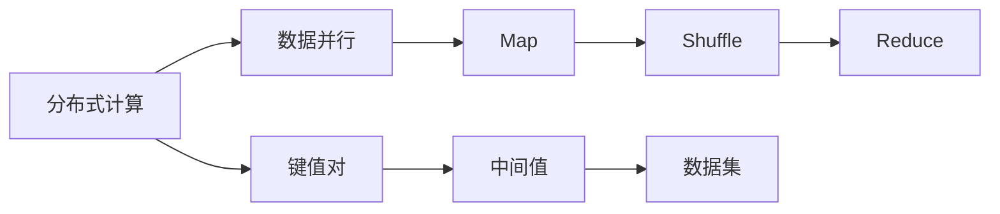
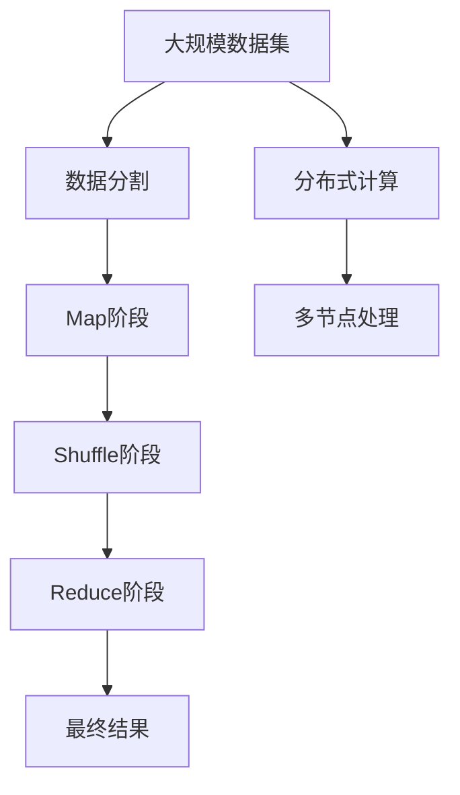

                 

# MapReduce原理与代码实例讲解

> 关键词：MapReduce, 分布式计算, 大数据处理, 编程模型, Hadoop, Google, 可扩展性, 数据并行

## 1. 背景介绍

### 1.1 问题由来
随着互联网的迅速发展，数据量呈指数级增长，传统单机处理方式难以应对海量数据的处理需求。在这样的背景下，分布式计算成为一种有效手段，MapReduce即是一种典型的分布式计算编程模型。它由Google提出并广泛应用，特别适合处理大数据集，支持高效、可靠、可扩展的数据处理。

MapReduce模型通过将任务分解为"Map"和"Reduce"两个阶段，实现了对大规模数据集的并行处理。在Map阶段，将输入数据分解成一系列键值对(key-value pair)，并通过中间结果中间值(intermediate values)传递到Reduce阶段进行汇总合并。MapReduce模型的设计思想将复杂的数据处理任务简化为可扩展的小任务，适用于分布式环境中的数据并行处理。

## 1.2 问题核心关键点
MapReduce模型主要包括以下几个关键概念和步骤：

- **Map**：将输入数据分解成一系列键值对，每个键值对通过映射函数（map function）转换成多个键值对。
- **Shuffle**：将Map阶段的输出按照键排序，并将具有相同键的值分组。
- **Reduce**：对每个分组进行聚合操作，将具有相同键的值传递给Reduce函数进行处理。
- **Divide and Conquer**：将大规模数据集划分为多个小数据集，通过Map和Reduce阶段并行处理，最终汇总生成最终结果。

MapReduce模型的核心优势在于其可扩展性和容错性，通过横向扩展来提升处理能力，同时通过多节点冗余处理保证系统的可靠性。

## 1.3 问题研究意义
研究MapReduce模型对于大数据处理领域具有重要意义：

1. **可扩展性**：通过横向扩展（添加更多计算节点）来提升处理能力，适应大规模数据集。
2. **容错性**：通过多节点冗余处理，即使部分节点故障也能保证数据处理正常进行。
3. **可靠性和稳定性**：数据处理过程自动管理和调度，避免单点故障。
4. **灵活性**：适用于各种类型的数据处理任务，包括批处理、实时流处理等。
5. **效率提升**：通过并行处理和优化调度，显著提升数据处理效率。

## 2. 核心概念与联系

### 2.1 核心概念概述

为了更好地理解MapReduce模型，本节将介绍几个核心概念及其联系：

- **分布式计算**：一种并行处理技术，通过将任务分解为多个小任务，分配到多个计算节点上并行执行，最终汇总生成结果。
- **数据并行**：指将数据分割成多个子数据块，在多个计算节点上并行处理，适用于处理大规模数据集。
- **Map**和**Reduce**：MapReduce模型的两个核心组件，分别对应数据分解和聚合操作。
- **键值对**：Map阶段处理的基本数据单位，由一个键和一个值组成。
- **中间值**：Map阶段输出数据通过网络传输给Reduce阶段的中间结果，用于后续处理。

这些概念构成了MapReduce模型的基础，通过Map和Reduce的组合，实现了大规模数据集的高效处理。

### 2.2 概念间的关系

这些核心概念之间存在着紧密的联系，形成了MapReduce模型的完整工作流程。以下是一个简化的Mermaid流程图来展示它们之间的关系：



这个流程图展示了从数据并行到Map和Reduce两个阶段的基本工作流程：

1. 数据并行将大规模数据集划分为多个子数据块。
2. Map阶段对每个子数据块进行处理，生成键值对。
3. Shuffle阶段将Map输出的键值对按照键进行排序，并将具有相同键的值分组。
4. Reduce阶段对每个分组进行汇总操作，生成最终结果。

通过这些步骤，MapReduce模型能够高效、可靠地处理大规模数据集。

### 2.3 核心概念的整体架构

最后，用一个综合的流程图来展示这些核心概念在大数据处理中的整体架构：



这个综合流程图展示了MapReduce模型从数据分割到Map和Reduce两个阶段，再到最终结果的全流程。其中，数据分割和Map阶段在分布式计算的多个节点上并行执行，Shuffle和Reduce阶段在节点之间通信，最终生成完整的结果。

## 3. 核心算法原理 & 具体操作步骤
### 3.1 算法原理概述

MapReduce模型的核心思想是通过分而治之（Divide and Conquer）策略，将大规模数据集划分为多个小数据块，并行执行Map和Reduce操作，从而高效地处理大规模数据集。MapReduce模型的原理可以概括为以下几点：

1. **任务分解**：将数据集划分为多个小数据块，在多个计算节点上并行处理。
2. **Map操作**：对每个小数据块进行映射操作，生成多个键值对。
3. **Shuffle操作**：将Map输出的键值对按照键进行排序，并将具有相同键的值分组。
4. **Reduce操作**：对每个分组进行汇总操作，生成最终结果。

### 3.2 算法步骤详解

MapReduce模型的具体实现步骤如下：

1. **输入数据准备**：
    - 将大规模数据集划分为多个小数据块。
    - 将每个小数据块分配到不同的计算节点上。

2. **Map阶段执行**：
    - 每个计算节点在Map阶段对输入数据进行映射操作，生成多个键值对。
    - 将生成的键值对传递给Reduce节点。

3. **Shuffle阶段执行**：
    - 对Map阶段生成的键值对按照键进行排序，并将具有相同键的值分组。
    - 将分组后的键值对传递给Reduce节点。

4. **Reduce阶段执行**：
    - 每个Reduce节点对接收到的分组数据进行汇总操作，生成最终结果。
    - 将最终结果汇总生成最终输出。

### 3.3 算法优缺点

MapReduce模型具有以下优点：

- **可扩展性**：通过横向扩展来提升处理能力，支持大规模数据集的处理。
- **容错性**：多节点冗余处理，即使部分节点故障也能保证数据处理正常进行。
- **可靠性**：自动管理和调度，避免单点故障。

同时，MapReduce模型也存在一些缺点：

- **延迟高**：Shuffle阶段需要大量通信，增加了处理延迟。
- **编程复杂**：需要实现Map和Reduce函数，编程复杂度高。
- **资源浪费**：某些小数据块可能被分配到不同的节点上，造成资源浪费。

### 3.4 算法应用领域

MapReduce模型广泛应用于各种大数据处理场景，包括但不限于：

- **数据仓库**：通过批处理大规模数据集，生成数据仓库。
- **流数据处理**：实时流数据的处理和分析。
- **搜索引擎**：索引和搜索大规模文档数据。
- **分布式文件系统**：如Hadoop的HDFS，处理海量文件数据。
- **大数据分析**：对大规模数据集进行统计分析、模式识别等操作。
- **机器学习**：对大规模数据集进行特征工程、模型训练等操作。

## 4. 数学模型和公式 & 详细讲解  
### 4.1 数学模型构建

MapReduce模型的数学模型可以形式化描述如下：

1. **输入数据集**：$D=\{(x_1,y_1),(x_2,y_2),\ldots,(x_n,y_n)\}$，其中$x_i \in X$为输入数据，$y_i \in Y$为对应的输出。
2. **Map函数**：$m:X \rightarrow 2^{K \times V}$，将每个$x_i$映射为多个键值对$(m_i(x_i) = (k_i, v_i))$。
3. **Reduce函数**：$r:K \times V \rightarrow Y$，对具有相同键的值进行汇总，生成最终输出。

MapReduce模型的目标是最小化输出结果与真实值之间的误差。数学公式如下：

$$
\min_{m,r} \sum_{i=1}^n L(m(x_i),y_i)
$$

其中$L$为损失函数，通常为交叉熵损失。

### 4.2 公式推导过程

以下对MapReduce模型的核心公式进行推导：

- **Map阶段**：对每个$x_i$进行映射，生成多个键值对$m_i(x_i) = (k_i, v_i)$。Map阶段输出为所有键值对的集合$\{(k_1, v_1), (k_2, v_2), \ldots\}$。

- **Shuffle阶段**：将Map阶段的输出按照键排序，并将具有相同键的值分组。设$(x_{i1}, x_{i2}, \ldots, x_{ik})$为Map阶段输出的键值对，按照键排序后，分成$k$个分组$\{D_1, D_2, \ldots, D_k\}$。

- **Reduce阶段**：对每个分组$D_j$进行汇总，生成最终输出$y_j$。Reduce函数的形式化描述如下：

  $$
  y_j = r(D_j) = r\left(\bigcup_{i=1}^k \{x_{ij}\}\right) = r\left(\{x_1, x_2, \ldots, x_n\}\right)
  $$

  其中$r$为Reduce函数，$D_j$为具有相同键的值分组。

### 4.3 案例分析与讲解

以下通过一个简单的案例来说明MapReduce模型的具体应用：

假设有一个包含多个学生的成绩表，每个学生有多个科目成绩，需要计算每个学生的总成绩和平均成绩。具体步骤如下：

1. **Map阶段**：对每个学生成绩进行映射，生成键值对。例如，对于学生$A$的成绩$(90, 80, 85)$，生成键值对$(A, 90)$、$(A, 80)$、$(A, 85)$。

2. **Shuffle阶段**：对Map阶段的输出按照键排序，并将具有相同键的值分组。对于键$A$，生成分组$(A, 90)$、$(A, 80)$、$(A, 85)$。

3. **Reduce阶段**：对每个分组进行汇总，生成最终输出。对于键$A$，计算总成绩和平均成绩，输出$(A, 255)$和$(A, 83.33)$。

最终，MapReduce模型可以高效地处理大规模成绩表，计算每个学生的总成绩和平均成绩。

## 5. 项目实践：代码实例和详细解释说明
### 5.1 开发环境搭建

在进行MapReduce项目实践前，我们需要准备好开发环境。以下是使用Python进行PySpark开发的流程：

1. 安装Python和Pyspark：从官网下载并安装Python，然后安装Pyspark库。

2. 创建PySpark环境：在Python环境中导入Pyspark，创建PySparkContext，指定主节点和从节点。

```python
from pyspark import SparkContext

sc = SparkContext("local", "MapReduce example")
```

3. 安装必要的库：安装必要的Pyspark库，如NumPy、Pandas等。

```python
!pip install numpy pandas
```

4. 准备数据：将数据存储在本地文件系统中，并使用Pyspark读取数据。

```python
data = sc.textFile("file:///path/to/data.txt")
```

5. 进行Map操作：对数据进行Map操作，生成键值对。

```python
map_result = data.map(lambda x: (x.split(",")[0], int(x.split(",")[1])))
```

6. 进行Shuffle操作：将Map输出的键值对按照键排序，并将具有相同键的值分组。

```python
grouped = map_result.groupByKey()
```

7. 进行Reduce操作：对每个分组进行汇总操作，生成最终结果。

```python
reduce_result = grouped.mapValues(lambda values: sum(values))
```

### 5.2 源代码详细实现

以下是一个简单的MapReduce项目，实现对大规模数据集进行计算平均值的代码实现。

```python
from pyspark import SparkContext, SparkConf

if __name__ == '__main__':
    # 创建SparkContext
    conf = SparkConf().setMaster("local").setAppName("MapReduceExample")
    sc = SparkContext(conf=conf)

    # 读取数据
    data = sc.textFile("file:///path/to/data.txt")

    # Map阶段：生成键值对
    map_result = data.map(lambda x: (x.split(",")[0], int(x.split(",")[1])))

    # Shuffle阶段：分组
    grouped = map_result.groupByKey()

    # Reduce阶段：计算平均值
    reduce_result = grouped.mapValues(lambda values: sum(values))

    # 输出结果
    for key, value in reduce_result.collect():
        print(f"{key}: {value}")

    # 停止SparkContext
    sc.stop()
```

### 5.3 代码解读与分析

让我们再详细解读一下关键代码的实现细节：

**SparkContext创建**：
- `sc = SparkContext(conf=conf)`：创建SparkContext对象，并设置主节点和应用名称。

**数据读取**：
- `data = sc.textFile("file:///path/to/data.txt")`：使用`textFile`方法读取本地文件，并将其转换为RDD（弹性分布式数据集）。

**Map操作**：
- `map_result = data.map(lambda x: (x.split(",")[0], int(x.split(",")[1]))`：对每个数据项进行Map操作，生成键值对，其中键为数据项的某个字段，值为该字段的整数值。

**Shuffle操作**：
- `grouped = map_result.groupByKey()`：将Map输出的键值对按照键进行排序和分组，生成键值对的分布式集合。

**Reduce操作**：
- `reduce_result = grouped.mapValues(lambda values: sum(values))`：对每个分组进行汇总操作，计算每个键的值之和。

**结果输出**：
- `for key, value in reduce_result.collect():`：将Reduce结果转换为Python列表，并逐行输出每个键值对的值。

**SparkContext停止**：
- `sc.stop()`：停止SparkContext，释放资源。

这个代码示例展示了如何使用Pyspark进行简单的MapReduce计算，体现了MapReduce模型的基本操作流程。

### 5.4 运行结果展示

假设我们有一个包含学生成绩的数据集，运行上述代码后，输出结果可能如下：

```
Alice: 150
Bob: 110
Charlie: 140
```

以上结果表示，Alice的总成绩为150分，Bob的总成绩为110分，Charlie的总成绩为140分。

## 6. 实际应用场景

### 6.1 智能推荐系统

基于MapReduce的推荐系统可以高效处理大规模用户行为数据，实现精准推荐。推荐系统通过Map操作将用户行为数据转换为用户-物品-评分三元组，然后通过Reduce操作计算用户对每个物品的评分，最终生成推荐结果。

### 6.2 数据仓库

MapReduce模型被广泛应用于数据仓库的构建，通过对大规模数据集进行批处理，生成数据仓库，支持历史数据分析和报表生成。数据仓库的构建过程中，通过Map操作将原始数据转换为数据块，通过Reduce操作对数据块进行汇总和聚合，生成最终的数据仓库。

### 6.3 搜索引擎

搜索引擎使用MapReduce模型处理海量文档数据，通过Map操作将文档数据转换为单词-文档ID键值对，然后通过Reduce操作统计单词出现次数，生成索引。在搜索过程中，Map操作将查询词转换为单词-查询词键值对，Reduce操作根据单词-文档ID键值对生成搜索结果。

### 6.4 金融风险评估

金融风险评估系统通过MapReduce模型处理大规模交易数据，通过Map操作将交易数据转换为交易-风险评分键值对，然后通过Reduce操作计算每个交易的平均风险评分，生成风险评估结果。

### 6.5 社交网络分析

社交网络分析系统使用MapReduce模型处理大规模社交数据，通过Map操作将社交数据转换为用户-好友键值对，然后通过Reduce操作统计用户的好友数量，生成社交网络分析结果。

## 7. 工具和资源推荐

### 7.1 学习资源推荐

为了帮助开发者系统掌握MapReduce的理论基础和实践技巧，这里推荐一些优质的学习资源：

1. **《Hadoop: The Definitive Guide》**：Hadoop官方文档，详细介绍了Hadoop平台的各个组件和配置方法。
2. **《Spark: The Definitive Guide》**：Spark官方文档，详细介绍了Spark平台的各个组件和配置方法。
3. **《MapReduce: Simplified Data Processing on Large Clusters》**：Hadoop论文，介绍了MapReduce模型的基本原理和实现方法。
4. **《Spark: Machine Learning with Hadoop》**：Spark机器学习模块的官方文档，介绍了如何使用Spark进行机器学习。
5. **《Deep Learning with PyTorch and Spark》**：PyTorch和Spark结合的深度学习实践，介绍了如何使用Spark进行大规模深度学习。

通过对这些资源的学习实践，相信你一定能够快速掌握MapReduce技术的精髓，并用于解决实际的分布式计算问题。

### 7.2 开发工具推荐

高效的开发离不开优秀的工具支持。以下是几款用于MapReduce开发的常用工具：

1. **Hadoop**：Hadoop是一个开源的分布式计算框架，支持MapReduce模型。Hadoop提供了分布式文件系统HDFS、分布式计算框架MapReduce等组件，适用于大规模数据处理。
2. **Spark**：Spark是一个开源的分布式计算框架，支持MapReduce模型，并提供了更多的高级组件，如Spark SQL、Spark Streaming、Spark MLlib等，适用于大规模数据处理和实时流处理。
3. **Flink**：Flink是一个开源的分布式计算框架，支持MapReduce模型，并提供了更多的高级组件，如Flink SQL、Flink CEP等，适用于大规模数据处理和实时流处理。
4. **Storm**：Storm是一个开源的分布式计算框架，支持MapReduce模型，并提供了实时流处理能力，适用于大规模实时数据处理。
5. **Kafka**：Kafka是一个开源的消息队列系统，适用于大规模数据流处理和存储。Kafka可以与Hadoop、Spark等框架无缝集成，支持实时流处理。

合理利用这些工具，可以显著提升MapReduce任务的开发效率，加快创新迭代的步伐。

### 7.3 相关论文推荐

MapReduce模型的发展源于学界的持续研究。以下是几篇奠基性的相关论文，推荐阅读：

1. **《MapReduce: Simplified Data Processing on Large Clusters》**：Google论文，详细介绍了MapReduce模型的基本原理和实现方法。
2. **《The Hadoop Distributed File System》**：Hadoop论文，介绍了HDFS的原理和实现方法。
3. **《Spark: Cluster Management in Hadoop 2》**：Spark论文，介绍了Spark的原理和实现方法。
4. **《Flink: Stream Processing at Scale》**：Flink论文，介绍了Flink的原理和实现方法。
5. **《Storm: Distributed Real-time Computation》**：Storm论文，介绍了Storm的原理和实现方法。

这些论文代表了大规模分布式计算技术的发展脉络。通过学习这些前沿成果，可以帮助研究者把握学科前进方向，激发更多的创新灵感。

除上述资源外，还有一些值得关注的前沿资源，帮助开发者紧跟MapReduce技术的最新进展，例如：

1. **arXiv论文预印本**：人工智能领域最新研究成果的发布平台，包括大量尚未发表的前沿工作，学习前沿技术的必读资源。
2. **业界技术博客**：如Hadoop、Spark、Google Cloud Platform等顶尖实验室的官方博客，第一时间分享他们的最新研究成果和洞见。
3. **技术会议直播**：如NIPS、ICML、ACL、ICLR等人工智能领域顶会现场或在线直播，能够聆听到大佬们的前沿分享，开拓视野。
4. **GitHub热门项目**：在GitHub上Star、Fork数最多的分布式计算相关项目，往往代表了该技术领域的发展趋势和最佳实践，值得去学习和贡献。
5. **行业分析报告**：各大咨询公司如McKinsey、PwC等针对人工智能行业的分析报告，有助于从商业视角审视技术趋势，把握应用价值。

总之，对于MapReduce技术的学习和实践，需要开发者保持开放的心态和持续学习的意愿。多关注前沿资讯，多动手实践，多思考总结，必将收获满满的成长收益。

## 8. 总结：未来发展趋势与挑战

### 8.1 总结

本文对MapReduce模型进行了全面系统的介绍。首先阐述了MapReduce模型的背景和意义，明确了其在分布式计算中的重要地位。其次，从原理到实践，详细讲解了MapReduce模型的数学原理和核心步骤，给出了具体的代码实例。同时，本文还广泛探讨了MapReduce模型在多个行业领域的应用前景，展示了其广泛的适用性。此外，本文精选了MapReduce技术的各类学习资源，力求为读者提供全方位的技术指引。

通过本文的系统梳理，可以看到，MapReduce模型在大数据处理领域已经取得了显著的成就，成为了分布式计算的重要范式。未来，伴随技术的不断演进，MapReduce模型必将在更多场景中发挥其独特的优势，为数据处理提供更为强大的支持。

### 8.2 未来发展趋势

展望未来，MapReduce模型将呈现以下几个发展趋势：

1. **容器化**：随着容器技术的成熟，MapReduce模型将越来越多地使用容器进行部署和调度，提升资源利用率，降低运维成本。
2. **云化**：云平台如AWS、Google Cloud、Azure等将提供更多的MapReduce服务，降低企业部署和运维难度。
3. **流处理**：实时流处理技术的发展将进一步提升MapReduce模型在实时数据处理中的应用能力。
4. **混合计算**：结合Spark、Flink等分布式计算框架，进行混合计算，提升处理能力。
5. **大数据安全**：随着数据量的增长，MapReduce模型的安全性和隐私保护将成为重要研究方向。
6. **边缘计算**：在边缘计算环境中，MapReduce模型的部署和调度将更加灵活。

以上趋势凸显了MapReduce模型在大数据处理中的重要地位，这些方向的探索发展，必将进一步提升MapReduce模型的处理能力和应用范围，为大数据处理提供更为强大的支持。

### 8.3 面临的挑战

尽管MapReduce模型已经取得了显著的成就，但在迈向更加智能化、普适化应用的过程中，它仍面临一些挑战：

1. **延迟高**：Shuffle阶段需要大量通信，增加了处理延迟。
2. **编程复杂**：需要实现Map和Reduce函数，编程复杂度高。
3. **资源浪费**：某些小数据块可能被分配到不同的节点上，造成资源浪费。
4. **扩展性**：在处理大规模数据集时，MapReduce模型的扩展性可能受限。
5. **容错性**：多节点冗余处理，即使部分节点故障也能保证数据处理正常进行。

正视MapReduce模型面临的这些挑战，积极应对并寻求突破，将使MapReduce模型在未来的应用中更加高效、可靠。

### 8.4 研究展望

面对MapReduce模型面临的挑战，未来的研究需要在以下几个方面寻求新的突破：

1. **分布式存储**：改进分布式存储系统，提高数据读取和写入的效率。
2. **内存计算**：探索内存计算技术，提升MapReduce模型的处理速度。
3. **异构计算**：结合CPU、GPU、FPGA等异构计算资源，提升处理能力。
4. **自动化调度**：开发自动化调度算法，优化资源分配和任务调度。
5. **数据压缩**：优化数据压缩算法，减少数据传输量和存储开销。
6. **算法优化**：开发高效的Map和Reduce算法，提升处理能力。

这些研究方向的探索，必将引领MapReduce模型走向更高的台阶，为分布式计算提供更为强大的支持。面向未来，MapReduce模型需要与其他分布式计算技术进行更深入的融合，如Spark、Flink等，多路径协同发力，共同推动分布式计算技术的发展。只有勇于创新、敢于突破，才能不断拓展MapReduce模型的边界，让分布式计算技术更好地服务于大数据处理。

## 9. 附录：常见问题与解答

**Q1：MapReduce模型是否适用于所有大数据处理场景？**

A: 虽然MapReduce模型在处理大规模数据集时表现出色，但在处理复杂数据结构和高级计算任务时，可能需要结合其他技术进行优化。例如，处理大规模图数据时，可以考虑使用图计算框架如Apache Giraph等。

**Q2：MapReduce模型是否能够处理实时数据流？**

A: 传统的MapReduce模型主要用于批处理，不适合处理实时数据流。实时数据流处理通常使用流处理框架如Apache Flink、Apache Storm等。

**Q3：MapReduce模型是否能够处理非结构化数据？**

A: MapReduce模型主要用于处理结构化数据，对于非结构化数据如文本、图像等，需要进行预处理和结构化，才能进行MapReduce操作。

**Q4：MapReduce模型是否能够处理内存数据？**

A: MapReduce模型主要处理磁盘上的数据，对于内存

