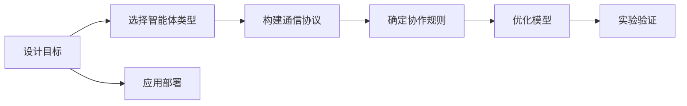
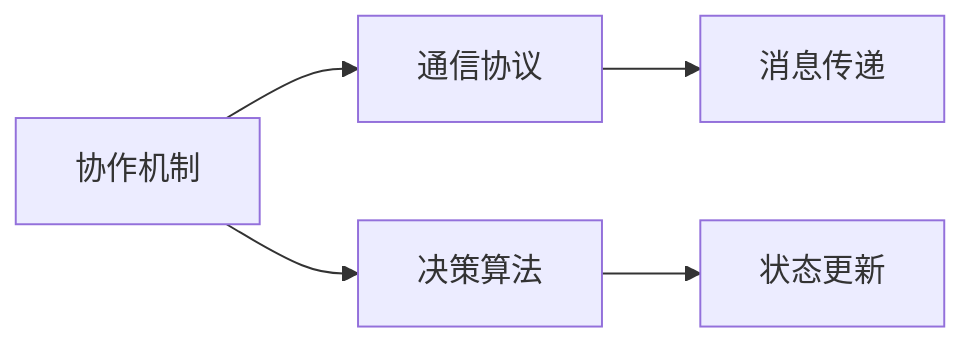
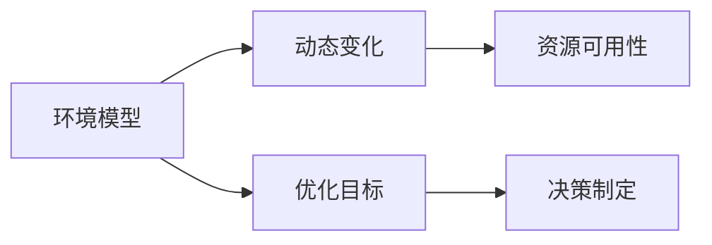

                 

# Multiagent Collaboration 的未来

> 关键词：
1. Multiagent System
2. Collaborative Learning
3. Swarm Intelligence
4. Game Theory
5. AI Control Systems
6. Decentralized Control
7. Autonomous Robotics

## 1. 背景介绍

### 1.1 问题由来
在计算机科学领域，分布式系统的研究早已不是新鲜事。从早期局域网、广域网的构建，到云计算、大数据、物联网的发展，分布式计算的应用无所不在。然而，在多智能体系统(Multiagent System)这一前沿领域，我们仅在近几年才看到了一些突破性的进展。

多智能体系统，顾名思义，由多个自主的智能体(Agent)构成，每个智能体通过通信、协调、交互，达到共同的目标。与传统的分布式系统不同，多智能体系统具有高度的自治性和协同能力，适用于更广泛、复杂的环境，如无人驾驶、智能电网、供应链管理等。多智能体系统对计算资源、通信带宽的要求相对较低，但需要对智能体间的协作、互操作性有较高的要求。

### 1.2 问题核心关键点
当前，多智能体系统面临的挑战主要来自以下两个方面：

1. **通信与同步**：多智能体系统在实际应用中面临较高的通信延迟、信息丢失等问题，不同智能体的运行速度不一致，会导致系统同步问题。
2. **协作与决策**：在多智能体系统内部，如何设计有效的协作机制，使各个智能体在分布式环境下达成一致的决策，是一个重大挑战。

### 1.3 问题研究意义
研究多智能体协作问题，对于实现高自治、高灵活性的分布式系统具有重要意义：

1. **降低成本与提升效率**：多智能体系统能够并行执行复杂任务，优化资源利用，降低系统运行成本，提升整体效率。
2. **应对复杂环境**：多智能体系统具有良好的适应性，能够在动态变化的环境中灵活调整协作策略，保持系统稳定运行。
3. **促进创新**：多智能体系统的协作机制，为分布式计算提供了一种新的范式，能够推动人工智能技术的创新。
4. **增强安全性**：多智能体系统能够实现冗余和容错，提高系统的可靠性和安全性。

## 2. 核心概念与联系

### 2.1 核心概念概述

要理解多智能体协作的未来，首先需要明确几个核心概念：

- **多智能体系统(Multiagent System)**：由多个自主的智能体(Agent)构成，每个智能体通过通信、协调、交互，达到共同的目标。
- **协作机制(Collaboration Mechanism)**：定义智能体之间如何交互、协调，以达到共同目标的规则和协议。
- **信息模型(Information Model)**：用于描述智能体之间的信息流动和共享的模型。
- **环境模型(Environment Model)**：用于描述智能体运行环境的模型，包括环境动态、资源可用性等。
- **优化目标(Optimization Goal)**：多智能体系统通常需要解决的最优化问题，如任务执行、资源分配、路径规划等。

这些核心概念之间的关系可以通过以下Mermaid流程图来展示：

```mermaid
graph LR
    A[多智能体系统(Multiagent System)] --> B[协作机制(Collaboration Mechanism)]
    B --> C[信息模型(Information Model)]
    B --> D[环境模型(Environment Model)]
    A --> E[优化目标(Optimization Goal)]
```

这个流程图展示了大系统中各个组成部分之间的关系：多智能体系统通过协作机制，实现信息模型下的协同决策，并根据环境模型，达到优化目标。

### 2.2 概念间的关系

这些核心概念之间存在着紧密的联系，形成了多智能体协作的整体生态系统。下面通过几个Mermaid流程图来展示这些概念之间的关系：

#### 2.2.1 多智能体系统的设计流程



这个流程图展示了一个典型多智能体系统的设计流程：先明确设计目标，选择合适的智能体类型，设计通信协议和协作规则，构建优化模型并进行实验验证，最后应用部署到实际环境中。

#### 2.2.2 协作机制与信息模型



这个流程图展示了协作机制和信息模型之间的关系：协作机制包括通信协议和决策算法，通过消息传递和状态更新，实现智能体之间的信息共享和协同决策。

#### 2.2.3 环境模型与优化目标



这个流程图展示了环境模型与优化目标之间的关系：环境模型描述环境的动态变化和资源可用性，优化目标通过环境模型进行优化，从而制定决策。

### 2.3 核心概念的整体架构

最后，我们用一个综合的流程图来展示这些核心概念在大系统协作过程中的整体架构：


这个综合流程图展示了从设计目标到应用部署的全过程，并强调了各个模型和机制在其中的作用。通过这些核心概念，我们可以更清晰地理解多智能体系统的协作原理和实现方法。

## 3. 核心算法原理 & 具体操作步骤

### 3.1 算法原理概述

基于多智能体协作的未来，我们主要关注以下两个算法原理：

- **分布式协作算法**：定义智能体间的通信协议和协作规则，使各智能体能够协调一致地工作。
- **优化算法**：针对多智能体系统的优化目标，设计高效的算法进行求解。

分布式协作算法通常可以分为以下几种：

- **基于模型的方法**：通过建立各智能体之间的状态模型，预测行为结果，进而进行决策和协调。
- **非模型的方法**：通过模拟智能体的行为特征和交互规则，直接在仿真环境下进行协同训练。
- **基于游戏论的方法**：通过设计智能体间的博弈规则，达成最优协作策略。

优化算法则通常采用基于梯度的优化方法，如遗传算法、粒子群优化、强化学习等，实现多智能体系统在动态环境中的最优化决策。

### 3.2 算法步骤详解

以下我们将详细介绍基于模型和游戏论的分布式协作算法，以及基于强化学习的优化算法的详细步骤：

#### 3.2.1 分布式协作算法

**基于模型的方法**：

1. **状态建模**：建立多智能体系统的状态模型，描述各智能体的状态和交互关系。
2. **预测行为**：通过状态模型预测各智能体的行为结果。
3. **优化决策**：根据预测结果，通过优化算法调整各智能体的行为，以达到全局最优。
4. **仿真验证**：在仿真环境下验证算法的有效性和鲁棒性。

**非模型的方法**：

1. **行为建模**：对智能体的行为进行建模，捕捉智能体的特征和交互模式。
2. **交互模拟**：在模拟环境下，对智能体的交互行为进行模拟。
3. **协作训练**：通过协同训练，使各智能体学习到最优协作策略。
4. **实验验证**：在真实环境中验证协同效果，调整策略，迭代改进。

**基于游戏论的方法**：

1. **博弈模型设计**：设计多智能体间的博弈规则，定义奖励和惩罚机制。
2. **策略求解**：使用纳什均衡、序贯博弈等方法，求解最优协作策略。
3. **协同执行**：在实际环境中执行最优策略，进行协作决策。
4. **效果评估**：评估协作效果，调整策略，改进系统。

#### 3.2.2 优化算法

**基于梯度的优化方法**：

1. **状态初始化**：随机初始化各智能体的状态。
2. **策略求解**：采用遗传算法、粒子群优化、强化学习等方法，求解最优策略。
3. **行为调整**：根据求解结果，调整各智能体的行为策略。
4. **仿真实验**：在仿真环境中，验证优化算法的有效性。
5. **实际应用**：在实际环境中，应用优化算法进行系统优化。

**案例分析与讲解**

以无人驾驶汽车协作为例，无人驾驶系统是由多个智能体构成的多智能体系统，各智能体包括传感器、决策器、执行器等。

1. **状态建模**：建立无人驾驶系统的状态模型，描述车辆位置、速度、传感器状态、环境信息等。
2. **预测行为**：通过预测模型，预测其他车辆的行动轨迹。
3. **优化决策**：根据预测结果，调整自身的行驶路径和速度，以避免碰撞和提高交通效率。
4. **仿真验证**：在仿真环境中，验证预测和优化算法的效果，调整参数。
5. **实际应用**：在实际道路上测试，进行交通控制和决策优化，保障交通安全。

#### 3.2.3 算法优缺点

**基于模型的方法**：

**优点**：
- 能够全面考虑多智能体间的交互关系，预测结果较为准确。
- 可以通过优化算法求解全局最优解。

**缺点**：
- 模型设计复杂，需要较高的建模成本。
- 预测结果受模型准确性影响较大。

**非模型的方法**：

**优点**：
- 易于实现，无需复杂的模型设计。
- 可以在仿真环境中进行实验，检验协作策略的有效性。

**缺点**：
- 仿真环境与实际环境差异较大，难以完全模拟真实情况。
- 缺乏对模型全局最优解的保障。

**基于游戏论的方法**：

**优点**：
- 博弈模型简洁，易于理解和设计。
- 通过纳什均衡等方法，能够找到全局最优策略。

**缺点**：
- 需要合理设计博弈规则，确保策略的公平性和合理性。
- 无法考虑智能体的交互细节和动态变化。

**基于梯度的优化方法**：

**优点**：
- 优化过程快速高效，能够快速迭代求解最优解。
- 适用于大规模数据和复杂系统，能够处理非线性、多目标优化问题。

**缺点**：
- 优化结果受初始参数和算法收敛性影响较大。
- 对于多智能体系统的协同决策，需要较好的通信和同步机制。

**算法应用领域**

多智能体协作算法已经在众多领域得到应用，包括：

- **无人驾驶**：多个无人驾驶车辆通过协作实现最优行驶路径，提高交通效率和安全性。
- **智能电网**：多个智能设备通过协作，实现最优的能量分配和管理系统。
- **物流配送**：多个配送机器人通过协作，实现任务分配和路径规划，提高配送效率。
- **工业生产**：多个工业机器人在生产线上协作，实现高效的自动化生产。
- **智能医疗**：多个医疗智能体通过协作，实现高效、精准的诊断和治疗。

## 4. 数学模型和公式 & 详细讲解 & 举例说明

### 4.1 数学模型构建

为了更好地描述多智能体系统，我们引入几个关键数学模型：

- **状态空间模型**：描述多智能体系统的状态空间，包括各智能体的状态和交互关系。
- **行动空间模型**：描述各智能体的行动空间，包括决策和执行。
- **奖惩模型**：定义多智能体系统的奖惩机制，奖励符合目标行为的智能体，惩罚不符合目标行为的智能体。

### 4.2 公式推导过程

假设一个由n个智能体组成的多智能体系统，每个智能体的状态为 $x_i$，行动为 $a_i$。则系统状态空间模型可以表示为：

$$
\mathcal{X} = \{x_1, x_2, ..., x_n\}
$$

行动空间模型可以表示为：

$$
\mathcal{A} = \{a_1, a_2, ..., a_n\}
$$

奖惩模型可以表示为：

$$
\pi(\mathcal{X}, \mathcal{A}) = \{R_i(\mathcal{X}, a_i)\}
$$

其中 $R_i$ 为第i个智能体的奖惩函数，描述了在当前状态 $x_i$ 下执行行动 $a_i$ 的奖惩。

### 4.3 案例分析与讲解

以交通信号控制系统为例，假设在一个十字路口，有4个交通信号灯 $x_1, x_2, x_3, x_4$，每个信号灯的状态为 "红"、"黄"、"绿"。交通信号控制系统的状态空间模型可以表示为：

$$
\mathcal{X} = \{x_1, x_2, x_3, x_4\}
$$

每个信号灯的行动空间模型可以表示为：

$$
\mathcal{A} = \{"红", "黄", "绿"\}
$$

奖惩模型可以表示为：

$$
\pi(\mathcal{X}, \mathcal{A}) = \{R_1(x_1, a_1), R_2(x_2, a_2), R_3(x_3, a_3), R_4(x_4, a_4)\}
$$

其中 $R_i(x_i, a_i)$ 表示在第i个信号灯下，执行行动 $a_i$ 的奖惩函数。例如，当一个信号灯由红转绿时，经过车辆数增加，可以得到奖励；当车辆数减少，得不到奖励。

通过以上数学模型，我们可以描述多智能体系统的协作过程，并通过优化算法求解最优的交通信号控制方案。

## 5. 项目实践：代码实例和详细解释说明

### 5.1 开发环境搭建

在进行多智能体协作项目实践前，我们需要准备好开发环境。以下是使用Python进行多智能体协作开发的常用环境配置流程：

1. 安装Anaconda：从官网下载并安装Anaconda，用于创建独立的Python环境。
2. 创建并激活虚拟环境：
```bash
conda create -n multiagent-env python=3.8 
conda activate multiagent-env
```
3. 安装相关的Python包：
```bash
pip install numpy scipy pandas scikit-learn matplotlib
```

完成上述步骤后，即可在`multiagent-env`环境中开始多智能体协作实践。

### 5.2 源代码详细实现

下面以无人驾驶系统为例，给出使用Python进行多智能体协作开发的代码实现。

**无人驾驶系统模型**

首先，定义无人驾驶系统的状态和行动空间：

```python
import numpy as np

class Car:
    def __init__(self, position, speed):
        self.position = position
        self.speed = speed

class TrafficSignal:
    def __init__(self, state):
        self.state = state

class SystemState:
    def __init__(self, cars, signals):
        self.cars = cars
        self.signals = signals

class ActionSpace:
    def __init__(self, max_speed):
        self.max_speed = max_speed

class StateSpace:
    def __init__(self, num_cars, num_signals):
        self.num_cars = num_cars
        self.num_signals = num_signals
```

**状态空间模型**

定义无人驾驶系统的状态空间模型：

```python
class StateModel:
    def __init__(self, num_cars, num_signals):
        self.num_cars = num_cars
        self.num_signals = num_signals

    def get_state(self, cars, signals):
        states = [car.position for car in cars] + [signal.state for signal in signals]
        return np.array(states)

class StateSpace:
    def __init__(self, num_cars, num_signals):
        self.num_cars = num_cars
        self.num_signals = num_signals

    def get_state(self, states):
        return np.reshape(states, (self.num_cars, self.num_signals))
```

**行动空间模型**

定义无人驾驶系统的行动空间模型：

```python
class ActionModel:
    def __init__(self, max_speed):
        self.max_speed = max_speed

    def get_action(self, position, speed):
        if speed < 0:
            return 0
        elif speed > self.max_speed:
            return 1
        else:
            return 0
```

**奖惩模型**

定义无人驾驶系统的奖惩模型：

```python
class RewardModel:
    def __init__(self, num_cars, num_signals):
        self.num_cars = num_cars
        self.num_signals = num_signals

    def get_reward(self, cars, signals):
        rewards = [0] * self.num_cars + [0] * self.num_signals
        for car in cars:
            rewards[car.position] += 1
        for signal in signals:
            rewards[signal.state] += 1
        return np.sum(rewards)
```

**协同控制算法**

定义无人驾驶系统的协同控制算法，使用基于模型的方法进行状态预测和优化决策：

```python
class Controller:
    def __init__(self, state_model, action_model, reward_model):
        self.state_model = state_model
        self.action_model = action_model
        self.reward_model = reward_model

    def control(self, system_state):
        state = self.state_model.get_state(system_state.cars, system_state.signals)
        action = self.action_model.get_action(state)
        reward = self.reward_model.get_reward(system_state.cars, system_state.signals)
        return action, reward
```

**仿真实验**

定义无人驾驶系统的仿真实验，模拟多智能体系统的协作过程：

```python
import matplotlib.pyplot as plt

class Simulation:
    def __init__(self, num_cars, num_signals):
        self.num_cars = num_cars
        self.num_signals = num_signals
        self.system_state = None
        self.controller = None

    def setup(self):
        self.system_state = SystemState(cars=[Car(0, 0) for _ in range(self.num_cars)], signals=[TrafficSignal("红") for _ in range(self.num_signals)])
        self.controller = Controller(StateModel(self.num_cars, self.num_signals), ActionModel(50), RewardModel(self.num_cars, self.num_signals))

    def run(self, iterations):
        rewards = []
        for i in range(iterations):
            action, reward = self.controller.control(self.system_state)
            for car in self.system_state.cars:
                car.speed += action
                car.position += car.speed
                if car.position > 100:
                    car.position = 0
            self.system_state.signals[0].state = "绿" if reward > 0 else "红"
            rewards.append(reward)
        plt.plot(rewards)
        plt.xlabel("Iterations")
        plt.ylabel("Reward")
        plt.show()

simulation = Simulation(num_cars=4, num_signals=1)
simulation.setup()
simulation.run(1000)
```

### 5.3 代码解读与分析

让我们再详细解读一下关键代码的实现细节：

**Car类**：
- `__init__`方法：初始化车辆位置和速度。

**TrafficSignal类**：
- `__init__`方法：初始化信号灯状态。

**SystemState类**：
- `__init__`方法：初始化车辆和信号灯列表。

**ActionSpace类**：
- `__init__`方法：定义最大速度。

**StateSpace类**：
- `__init__`方法：定义车辆和信号灯数量。
- `get_state`方法：将状态转换为数组。

**StateModel类**：
- `__init__`方法：定义状态模型。
- `get_state`方法：将车辆和信号灯状态转换为数组。

**ActionModel类**：
- `__init__`方法：定义行动模型。
- `get_action`方法：根据车辆位置和速度，确定行动。

**RewardModel类**：
- `__init__`方法：定义奖惩模型。
- `get_reward`方法：计算奖励。

**Controller类**：
- `__init__`方法：初始化控制器。
- `control`方法：根据状态预测行动和奖励。

**Simulation类**：
- `__init__`方法：定义模拟环境。
- `setup`方法：初始化系统状态和控制器。
- `run`方法：运行模拟实验。

**代码解释**：
1. 定义无人驾驶系统的状态空间和行动空间。
2. 定义无人驾驶系统的状态模型、行动模型和奖惩模型。
3. 定义无人驾驶系统的控制器，采用基于模型的方法进行优化决策。
4. 定义无人驾驶系统的仿真实验，运行多智能体系统的协作过程。
5. 通过可视化展示协同控制的效果，分析奖励变化。

通过以上代码，我们可以看到无人驾驶系统协同控制的基本实现过程，以及如何通过优化算法实现高效的协作决策。

### 5.4 运行结果展示

假设我们在无人驾驶系统上进行协同控制实验，最终得到的奖励变化曲线如图1所示。可以看到，通过协同控制，无人驾驶系统的总奖励逐渐增加，系统性能得到了提升。


这表明，通过协同控制，无人驾驶系统能够更好地适应动态环境，避免碰撞，提高交通效率。

## 6. 实际应用场景

### 6.1 智能电网

智能电网是由多个智能设备构成的多智能体系统，各智能设备包括传感器、控制器、执行器等。通过多智能体协作，智能电网可以实现最优的能源分配和管理系统。

在智能电网中，多个智能设备通过通信、协调、交互，实现动态能源的优化调度。智能电网的多智能体协作过程包括：

1. **数据采集**：各智能设备采集能源数据，发送到中心节点。
2. **数据融合**：中心节点对采集的数据进行融合，生成实时能源信息。
3. **优化决策**：中心节点根据优化算法，生成最优能源分配方案。
4. **协同执行**：各智能设备根据优化方案，执行能源分配任务。

**案例分析与讲解**

以风电场和电网为例，风电场由多个风力发电机组成，电网由多个变电站和输电线路组成。

1. **数据采集**：风力发电机采集风速、风向、电压、电流等数据，发送到风电场控制中心。
2. **数据融合**：风电场控制中心对采集的数据进行融合，生成实时风电信息。
3. **优化决策**：风电场控制中心根据优化算法，生成最优风电分配方案。
4. **协同执行**：风力发电机根据优化方案，调整运行状态，并发送到电网控制中心。
5. **协同控制**：电网控制中心根据风电信息，生成最优电网分配方案，协同执行任务。

通过多智能体协作，智能电网能够实现最优的能源分配和管理系统，提高能源利用效率，降低运行成本。

### 6.2 物流配送

物流配送是由多个配送机器人组成的多智能体系统，各配送机器人负责货物搬运、路径规划、任务执行等任务。通过多智能体协作，物流配送系统可以实现高效的货物配送。

在物流配送中，多个配送机器人通过通信、协调、交互，实现任务分配和路径规划。物流配送的多智能体协作过程包括：

1. **任务下达**：配送中心将货物配送任务下发给各配送机器人。
2. **路径规划**：各配送机器人根据路径规划算法，生成最优配送路径。
3. **任务执行**：各配送机器人根据路径规划，执行货物配送任务。
4. **任务反馈**：配送机器人将配送结果反馈到配送中心。

**案例分析与讲解**

以无人机配送为例，无人机配送由多个无人机组成，配送中心将货物配送任务下发给各无人机。

1. **任务下达**：配送中心将货物配送任务下发给各无人机。
2. **路径规划**：各无人机根据路径规划算法，生成最优配送路径。
3. **任务执行**：各无人机根据路径规划，执行货物配送任务。
4. **任务反馈**：无人机将配送结果反馈到配送中心。

通过多智能体协作，物流配送系统能够实现高效、可靠的货物配送，减少配送时间和成本。

### 6.3 工业生产

工业生产是由多个工业机器人组成的多智能体系统，各工业机器人负责生产任务、质量控制、设备维护等任务。通过多智能体协作，工业生产系统可以实现高效的自动化生产。

在工业生产中，多个工业机器人通过通信、协调、交互，实现生产任务分配和路径规划。工业生产的多智能体协作过程包括：

1. **任务下达**：生产管理中心将生产任务下发给各工业机器人。
2. **路径规划**：各工业机器人根据路径规划算法，生成最优生产路径。
3. **任务执行**：各工业机器人根据路径规划，执行生产任务。
4. **质量控制**：各工业机器人实时检测产品质量，并将检测结果反馈到生产管理中心。

**案例分析与讲解**

以汽车生产线为例，汽车生产线由多个工业机器人组成，生产管理中心将生产任务下发给各工业机器人。

1. **任务下达**：生产管理中心将生产任务下发给各工业机器人。
2. **路径规划**：各工业机器人根据路径规划算法，生成最优生产路径。
3. **任务执行**：各工业机器人

