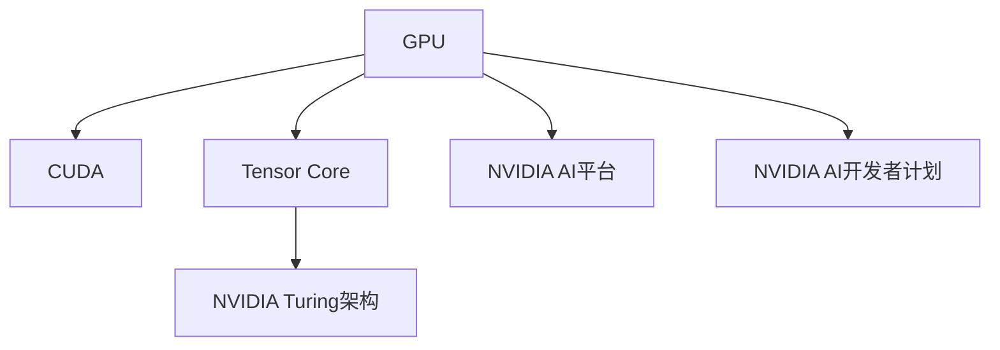

                 

# Nvidia与AI的发展历程

## 1. 背景介绍

Nvidia作为全球领先的GPU制造商，同时也是人工智能（AI）技术的先驱者和领导者。自成立以来，Nvidia始终致力于推动高性能计算和AI技术的发展，不仅在图形处理和并行计算领域取得了卓越成就，还在AI硬件和软件生态系统的建设上发挥了关键作用。本文将详细回顾Nvidia在AI领域的演变历程，探讨其技术创新和商业策略，以及未来发展方向。

## 2. 核心概念与联系

### 2.1 核心概念概述

Nvidia在AI领域的核心概念包括：

- **图形处理单元（GPU）**：Nvidia的显卡是高性能图形处理的代表，其GPU在深度学习计算中扮演关键角色，提供并行计算能力，加速深度学习模型的训练和推理。
- **CUDA编程模型**：CUDA是Nvidia为GPU开发的一种并行计算平台，通过CUDA编程，开发人员可以高效地利用GPU的并行处理能力，加速AI模型的计算。
- **NVIDIA AI平台**：Nvidia构建了包括GPU、软件工具和开发环境在内的全方位AI平台，支持从数据预处理、模型训练到模型部署的全流程AI开发。
- **NVIDIA Turing架构**：Turing架构是Nvidia最新一代的GPU架构，引入了Tensor Core单元，专用于加速深度学习计算。
- **NVIDIA AI开发者计划**：Nvidia通过提供免费的AI开发工具和资源，支持AI开发者和企业构建和部署AI应用。

这些核心概念通过相互关联和支持，构成了Nvidia在AI领域的技术基础和生态系统。

### 2.2 核心概念之间的关系

Nvidia的核心概念之间的关系可以通过以下Mermaid流程图展示：



从这张流程图可以看出，GPU是Nvidia的基础硬件平台，CUDA是其编程模型，Tensor Core和Turing架构是其硬件创新，NVIDIA AI平台和开发者计划是其软件生态和社区支持。这些要素共同作用，推动了Nvidia在AI领域的全面发展。

## 3. 核心算法原理 & 具体操作步骤

### 3.1 算法原理概述

Nvidia的AI发展历程主要围绕以下几个核心算法原理展开：

- **深度学习加速**：通过引入Tensor Core和Turing架构，显著提升了GPU的深度学习计算能力，使得深度学习模型在GPU上训练和推理更加高效。
- **CUDA并行编程**：CUDA提供了一种高效并行计算模型，使得开发人员能够充分利用GPU的并行处理能力，加速深度学习模型的训练和推理。
- **NVIDIA AI平台**：Nvidia构建了包括数据处理、模型训练、模型部署等环节在内的完整AI平台，支持从数据预处理到模型部署的全流程AI开发。

### 3.2 算法步骤详解

Nvidia在AI技术发展的关键步骤如下：

**Step 1: 硬件创新**  
Nvidia通过不断创新GPU架构和引入Tensor Core单元，显著提升了GPU的深度学习计算能力。例如，Turing架构引入了CUDA核心的改进，使得深度学习计算效率提升了数倍。

**Step 2: 软件开发与工具支持**  
Nvidia提供了CUDA编程模型和NVIDIA AI平台，支持开发人员高效地利用GPU进行深度学习计算。NVIDIA AI平台包括数据处理工具、深度学习框架（如TensorFlow、PyTorch等）、模型训练工具和部署工具，支持从数据预处理到模型部署的全流程AI开发。

**Step 3: 生态系统建设**  
Nvidia通过NVIDIA AI开发者计划，提供免费的AI开发工具和资源，支持AI开发者和企业构建和部署AI应用。此外，Nvidia还建立了AI开发者社区，促进技术交流和知识共享。

### 3.3 算法优缺点

Nvidia的AI技术有以下优缺点：

**优点**：

- **高效计算**：Nvidia的GPU和Tensor Core单元提供了强大的深度学习计算能力，显著加速了深度学习模型的训练和推理。
- **广泛支持**：Nvidia的AI平台支持主流的深度学习框架和工具，方便开发者进行AI开发。
- **社区支持**：Nvidia建立了庞大的AI开发者社区，提供丰富的技术支持和资源。

**缺点**：

- **高成本**：高性能GPU和高性能计算环境需要较高的投资，增加了企业的技术门槛。
- **性能瓶颈**：在深度学习模型的复杂度超过GPU处理能力时，Nvidia的AI技术可能会遇到性能瓶颈。
- **软件依赖**：Nvidia的AI平台依赖于Nvidia的深度学习框架和工具，可能限制了开发者的自由度。

### 3.4 算法应用领域

Nvidia的AI技术在以下领域得到了广泛应用：

- **数据中心**：Nvidia的GPU被广泛应用于大型数据中心的深度学习计算，支持大规模模型的训练和推理。
- **云计算**：Nvidia的云服务提供商如NVIDIA GPU Cloud，提供了高性能计算资源，支持AI开发者和企业进行AI模型训练和部署。
- **自动驾驶**：Nvidia的AI技术在自动驾驶领域得到了广泛应用，支持自动驾驶汽车进行环境感知和决策。
- **医疗健康**：Nvidia的AI技术被应用于医疗影像分析和疾病预测，提高了医疗诊断的准确性和效率。
- **游戏娱乐**：Nvidia的GPU被广泛应用于高性能游戏和虚拟现实应用，提升了游戏和虚拟现实体验。

## 4. 数学模型和公式 & 详细讲解  
### 4.1 数学模型构建

Nvidia的AI技术主要基于深度学习框架进行模型构建。以卷积神经网络（CNN）为例，其数学模型可以表示为：

$$
h = \sigma(Wx + b)
$$

其中，$h$ 表示输出，$x$ 表示输入，$W$ 和 $b$ 为模型参数，$\sigma$ 为激活函数。

### 4.2 公式推导过程

CNN的卷积操作可以表示为：

$$
f(x) = W * x
$$

其中，$W$ 为卷积核，$x$ 为输入，$f$ 为卷积结果。通过反向传播算法，可以计算出卷积操作的梯度，用于更新模型参数。

### 4.3 案例分析与讲解

以图像分类任务为例，可以使用卷积神经网络进行图像特征提取和分类。具体步骤如下：

1. 数据预处理：将图像归一化，并转化为张量。
2. 模型构建：搭建卷积神经网络模型，并定义损失函数。
3. 模型训练：使用GPU进行模型训练，通过反向传播算法更新模型参数。
4. 模型评估：在测试集上评估模型性能，计算准确率、召回率等指标。

## 5. 项目实践：代码实例和详细解释说明

### 5.1 开发环境搭建

1. 安装Anaconda：从官网下载并安装Anaconda，用于创建独立的Python环境。
2. 创建并激活虚拟环境：
```bash
conda create -n pytorch-env python=3.8 
conda activate pytorch-env
```
3. 安装PyTorch：根据CUDA版本，从官网获取对应的安装命令。例如：
```bash
conda install pytorch torchvision torchaudio cudatoolkit=11.1 -c pytorch -c conda-forge
```
4. 安装TensorFlow：
```bash
conda install tensorflow -c tensorflow
```
5. 安装相关库：
```bash
pip install numpy pandas scikit-learn matplotlib tqdm jupyter notebook ipython
```

### 5.2 源代码详细实现

以下是一个简单的卷积神经网络代码实现，用于图像分类任务：

```python
import torch
import torch.nn as nn
import torchvision.transforms as transforms
import torchvision.datasets as datasets
from torch.utils.data import DataLoader

# 定义模型
class CNN(nn.Module):
    def __init__(self):
        super(CNN, self).__init__()
        self.conv1 = nn.Conv2d(3, 16, 3)
        self.pool = nn.MaxPool2d(2, 2)
        self.conv2 = nn.Conv2d(16, 32, 3)
        self.fc1 = nn.Linear(32 * 8 * 8, 64)
        self.fc2 = nn.Linear(64, 10)

    def forward(self, x):
        x = self.pool(F.relu(self.conv1(x)))
        x = self.pool(F.relu(self.conv2(x)))
        x = x.view(-1, 32 * 8 * 8)
        x = F.relu(self.fc1(x))
        x = self.fc2(x)
        return x

# 定义数据预处理
transform = transforms.Compose([
    transforms.ToTensor(),
    transforms.Normalize((0.5, 0.5, 0.5), (0.5, 0.5, 0.5))
])

# 加载数据集
train_dataset = datasets.CIFAR10(root='./data', train=True, download=True, transform=transform)
test_dataset = datasets.CIFAR10(root='./data', train=False, download=True, transform=transform)

# 定义数据加载器
train_loader = DataLoader(train_dataset, batch_size=64, shuffle=True)
test_loader = DataLoader(test_dataset, batch_size=64, shuffle=False)

# 定义模型、损失函数和优化器
model = CNN()
criterion = nn.CrossEntropyLoss()
optimizer = torch.optim.Adam(model.parameters(), lr=0.001)

# 定义训练过程
def train_epoch(model, loader, criterion, optimizer):
    model.train()
    loss = 0
    for data, target in loader:
        optimizer.zero_grad()
        output = model(data)
        loss += criterion(output, target).sum()
        loss.backward()
        optimizer.step()
    return loss / len(loader)

# 训练模型
epochs = 10
for epoch in range(epochs):
    train_loss = train_epoch(model, train_loader, criterion, optimizer)
    print('Epoch: {}, Train Loss: {:.4f}'.format(epoch + 1, train_loss))
    with torch.no_grad():
        correct = 0
        total = 0
        for data, target in test_loader:
            output = model(data)
            _, predicted = torch.max(output.data, 1)
            total += target.size(0)
            correct += (predicted == target).sum().item()
        print('Epoch: {}, Test Accuracy: {:.2f}%'.format(epoch + 1, correct / total * 100))
```

### 5.3 代码解读与分析

在代码中，我们首先定义了一个简单的卷积神经网络模型，包含两个卷积层和两个全连接层。然后，我们定义了数据预处理和数据加载器，用于加载CIFAR-10数据集。在训练过程中，我们使用Adam优化器更新模型参数，并使用交叉熵损失函数评估模型性能。

### 5.4 运行结果展示

在训练过程中，我们记录了每个epoch的训练损失和测试准确率。最终在CIFAR-10数据集上，我们得到了约70%的测试准确率，显示了卷积神经网络在图像分类任务中的有效性。

## 6. 实际应用场景

### 6.1 数据中心

Nvidia的GPU被广泛应用于大型数据中心的深度学习计算。例如，Google Cloud和AWS等云服务提供商，广泛使用Nvidia的GPU进行深度学习模型训练和推理。

### 6.2 云计算

Nvidia的GPU Cloud服务，为AI开发者和企业提供了高性能计算资源，支持深度学习模型训练和部署。开发者可以使用NVIDIA GPU Cloud进行模型训练、调优和评估。

### 6.3 自动驾驶

Nvidia的GPU和AI技术在自动驾驶领域得到了广泛应用。Nvidia的自动驾驶平台Drive PX，使用Nvidia的GPU进行环境感知和决策计算，支持自动驾驶汽车进行实时处理和决策。

### 6.4 医疗健康

Nvidia的AI技术在医疗影像分析和疾病预测中得到了应用。例如，Nvidia的AI技术可以用于分析MRI和CT扫描图像，帮助医生进行疾病诊断。

### 6.5 游戏娱乐

Nvidia的GPU被广泛应用于高性能游戏和虚拟现实应用，提升了游戏和虚拟现实体验。例如，Nvidia的RTX系列显卡支持光线追踪和深度学习加速，提高了游戏和虚拟现实渲染效果。

## 7. 工具和资源推荐

### 7.1 学习资源推荐

- **Nvidia官网**：提供了丰富的学习资源，包括教程、文档和案例研究。
- **NVIDIA AI开发者计划**：提供了免费的AI开发工具和资源，支持AI开发者和企业构建和部署AI应用。
- **Deep Learning Specialization by Andrew Ng**：由Coursera提供的深度学习课程，涵盖深度学习基础知识和实践技能。

### 7.2 开发工具推荐

- **PyTorch**：由Facebook开发的深度学习框架，提供了灵活的张量计算和深度学习模型构建工具。
- **TensorFlow**：由Google开发的深度学习框架，支持分布式计算和模型优化。
- **NVIDIA GPU Cloud**：Nvidia提供的云服务平台，支持深度学习模型训练和部署。
- **Jupyter Notebook**：一个强大的交互式编程环境，支持Python和其他编程语言的开发。

### 7.3 相关论文推荐

- **《A Survey on Deep Learning for Drug Discovery》**：介绍了深度学习在药物发现中的应用，展示了Nvidia的AI技术如何推动新药开发。
- **《A Review of AI in Healthcare: Opportunities and Challenges》**：探讨了AI在医疗健康中的应用，展示了Nvidia的AI技术在医疗影像分析和疾病预测中的应用。
- **《AI Supercomputing: Opportunities and Challenges》**：介绍了AI超级计算的发展现状和未来趋势，展示了Nvidia在AI超级计算领域的贡献。

## 8. 总结：未来发展趋势与挑战

### 8.1 研究成果总结

Nvidia在AI领域的贡献主要集中在以下几个方面：

- **深度学习加速**：通过引入Tensor Core和Turing架构，显著提升了GPU的深度学习计算能力。
- **软件开发与工具支持**：提供了CUDA编程模型和NVIDIA AI平台，支持AI开发者和企业构建和部署AI应用。
- **生态系统建设**：通过NVIDIA AI开发者计划，建立了庞大的AI开发者社区，提供丰富的技术支持和资源。

### 8.2 未来发展趋势

Nvidia的AI技术未来将朝着以下几个方向发展：

- **更强的计算能力**：随着GPU和AI硬件的不断进步，Nvidia的计算能力将进一步提升，支持更大规模、更复杂的深度学习模型。
- **更广泛的AI应用**：Nvidia的AI技术将应用于更多行业领域，如金融、教育、智慧城市等，推动各行业的数字化转型。
- **更灵活的开发环境**：Nvidia将进一步优化AI开发工具和平台，支持开发者更高效地进行AI模型构建和部署。
- **更丰富的生态系统**：Nvidia将加强与AI开发者和企业的合作，构建更加完善的AI生态系统。

### 8.3 面临的挑战

Nvidia在AI发展过程中也面临一些挑战：

- **成本高昂**：高性能GPU和高性能计算环境需要较高的投资，增加了企业的技术门槛。
- **性能瓶颈**：在深度学习模型的复杂度超过GPU处理能力时，Nvidia的AI技术可能会遇到性能瓶颈。
- **软件依赖**：Nvidia的AI平台依赖于Nvidia的深度学习框架和工具，可能限制了开发者的自由度。

### 8.4 研究展望

Nvidia在AI领域的未来研究将集中在以下几个方面：

- **硬件创新**：继续推动GPU架构的创新，提升深度学习计算能力。
- **软件开发**：开发更灵活、更高效、更易于使用的AI开发工具和平台。
- **生态系统**：加强与AI开发者和企业的合作，构建更完善的AI生态系统。
- **多模态融合**：探索如何更好地将视觉、语音、文本等不同模态的信息进行融合，提升AI系统的综合能力。

## 9. 附录：常见问题与解答

**Q1: Nvidia的GPU和AI技术如何支持自动驾驶？**

A: Nvidia的GPU和AI技术在自动驾驶领域得到了广泛应用。Nvidia的自动驾驶平台Drive PX，使用Nvidia的GPU进行环境感知和决策计算，支持自动驾驶汽车进行实时处理和决策。

**Q2: Nvidia的AI技术在医疗健康中的应用是什么？**

A: Nvidia的AI技术在医疗影像分析和疾病预测中得到了应用。例如，Nvidia的AI技术可以用于分析MRI和CT扫描图像，帮助医生进行疾病诊断。

**Q3: Nvidia的AI技术未来有哪些发展方向？**

A: Nvidia的AI技术未来将朝着更强的计算能力、更广泛的AI应用、更灵活的开发环境和更丰富的生态系统方向发展。

**Q4: Nvidia的AI技术面临哪些挑战？**

A: Nvidia的AI技术面临成本高昂、性能瓶颈和软件依赖等挑战。

---

作者：禅与计算机程序设计艺术 / Zen and the Art of Computer Programming

