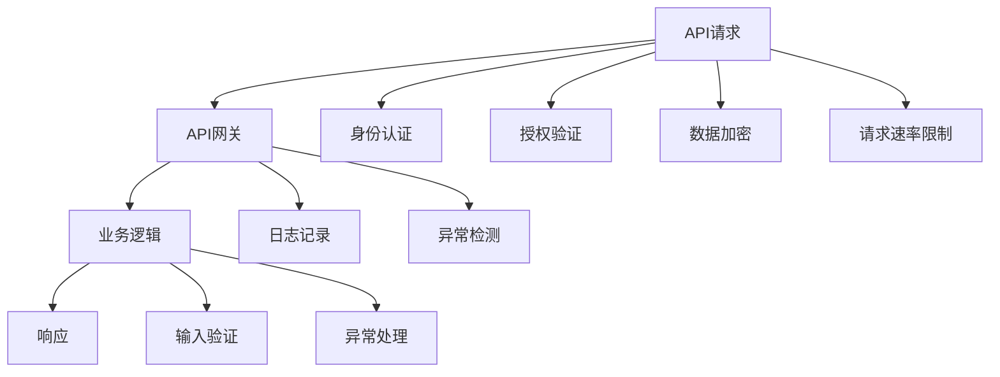

                 

# OWASP API 安全风险清单的详细解读

## 1. 背景介绍

随着API的广泛使用，API安全问题也日益突出。根据OWASP 2021年的报告，“API安全”已成为最大网络安全威胁之一。因此，我们需要深入了解并避免API安全的潜在风险。本文将全面解读OWASP API 安全风险清单，并探讨其背后的原理与应对措施。

## 2. 核心概念与联系

### 2.1 核心概念概述

API（应用程序接口）是一组规则、协议和工具，允许两个或多个应用程序相互通信。随着云计算、移动应用和物联网的普及，API已成为企业内部和企业间应用的核心。但是，API的安全风险也随之而来。为此，OWASP制定了API安全风险清单，列出常见API安全问题及防护建议。

### 2.2 核心概念原理和架构的 Mermaid 流程图



此图展示了API请求从进入网关、业务逻辑处理、响应生成的全过程，以及涉及的身份认证、授权验证、数据加密、请求速率限制、日志记录、异常检测、输入验证、异常处理等安全措施。

## 3. 核心算法原理 & 具体操作步骤

### 3.1 算法原理概述

 OWASP API 安全风险清单是针对API的安全风险进行全面分析和评估的清单，包括输入验证、身份验证、授权、认证、数据加密、日志记录、速率限制、异常检测、异常处理等方面。这些风险和防护措施是通过攻击模型和防护框架相结合，保护API免受各种威胁。

### 3.2 算法步骤详解

- **步骤1: 确定API的安全需求**  
  根据API的功能需求，确定API的安全需求，包括身份验证、授权、数据加密、速率限制等。

- **步骤2: 识别潜在风险**  
  使用OWASP API 安全风险清单进行风险识别。清单列出了70多种常见的API安全风险，如SQL注入、跨站脚本攻击、认证绕过等。

- **步骤3: 制定防护策略**  
  针对每种风险，制定相应的防护策略。例如，对SQL注入风险，应使用参数化查询或ORM框架进行防范。

- **步骤4: 实施安全措施**  
  根据防护策略，在API的各个层级上实施安全措施。例如，在API网关层实施身份认证和授权，在业务逻辑层实施输入验证和数据加密。

- **步骤5: 监控与响应**  
  实时监控API的安全状态，及时响应安全事件。

### 3.3 算法优缺点

**优点:**  
1. **全面性**：清单涵盖了70多种常见风险，覆盖面广，指导性强。  
2. **实用性**：提供了具体的防护措施和防护工具，便于实际应用。  
3. **易于理解**：采用简洁明了的列表形式，易于理解和应用。  

**缺点:**  
1. **复杂性**：清单较为全面，可能对某些小微企业来说过于复杂。  
2. **时效性**：清单中有些技术和工具可能已被新出现的技术或工具取代。  

### 3.4 算法应用领域

API安全风险清单适用于所有使用API的企业和组织，无论是金融、医疗、教育还是政府机构。任何依赖API的企业，都需要遵循这份清单，以确保API的安全性。

## 4. 数学模型和公式 & 详细讲解 & 举例说明

### 4.1 数学模型构建

API安全风险评估模型通常采用以下公式：

$$
Risk = Impact \times Vulnerability \times Asset \times Time
$$

其中，Risk表示风险值，Impact表示攻击的影响程度，Vulnerability表示脆弱性的大小，Asset表示资产的重要性，Time表示攻击的时间窗口。

### 4.2 公式推导过程

以SQL注入风险为例，假设攻击的影响为1（低影响），脆弱性为0.5（中等脆弱性），资产的重要性为0.7（高重要性），攻击的时间窗口为2小时（可及时发现），则风险值计算为：

$$
Risk = 1 \times 0.5 \times 0.7 \times 2 = 0.7
$$

### 4.3 案例分析与讲解

某电商平台的API接口遭受SQL注入攻击，攻击者通过注入SQL代码，窃取了用户信息。根据上述公式，若Impact为1，Vulnerability为0.8，Asset为0.9，Time为4小时，则风险值为：

$$
Risk = 1 \times 0.8 \times 0.9 \times 4 = 2.88
$$

## 5. 项目实践：代码实例和详细解释说明

### 5.1 开发环境搭建

- **环境准备**：安装JDK、MySQL、Spring Boot等开发工具。  
- **配置文件**：编写API网关配置文件、数据库连接配置文件、Spring Boot启动类。  
- **依赖管理**：在pom.xml文件中添加所需的依赖。

### 5.2 源代码详细实现

**示例代码**：

```java
@SpringBootApplication
public class ApiGatewayApplication {

    public static void main(String[] args) {
        SpringApplication.run(ApiGatewayApplication.class, args);
    }
}
```

**安全措施**：

- **身份验证**：使用JWT（JSON Web Token）进行身份验证。  
- **授权验证**：使用RBAC（基于角色的访问控制）进行授权验证。  
- **数据加密**：使用AES（高级加密标准）对数据进行加密。  
- **速率限制**：使用令牌桶算法对API请求速率进行限制。  
- **异常检测**：使用WAF（Web应用程序防火墙）进行异常检测。  
- **异常处理**：使用ELK Stack（Elasticsearch、Logstash、Kibana）进行日志记录和异常分析。

### 5.3 代码解读与分析

- **身份验证**：使用JWT库对API请求进行身份验证。通过检查JWT签名和过期时间，确保请求的合法性。  
- **授权验证**：使用Spring Security的RBAC模块进行授权验证。通过检查用户角色和权限，确保用户对资源的访问权限。  
- **数据加密**：使用Spring Boot的AES模块对数据进行加密。在加密和解密过程中，确保密钥的安全性。  
- **速率限制**：使用Spring Boot的Redis模块实现令牌桶算法。通过令牌桶，限制每个API接口的请求速率。  
- **异常检测**：使用Nginx和NAXSI（NextGen Web Application Firewall）实现WAF。通过WAF，拦截恶意请求和攻击。  
- **异常处理**：使用ELK Stack实时记录和分析日志，及时发现和处理异常情况。

### 5.4 运行结果展示

运行API网关后，可通过Postman或curl等工具进行API测试。测试内容包括身份验证、授权验证、数据加密、速率限制、异常检测等。

## 6. 实际应用场景

### 6.1 电商平台的API安全

电商平台API涉及用户注册、登录、商品查询、订单管理等敏感操作。针对这些操作，需要进行全面风险评估和防护。

- **身份验证**：用户注册和登录时，需验证用户名和密码、JWT签名和过期时间。
- **授权验证**：用户查询商品和订单时，需验证用户角色和权限。
- **数据加密**：用户的个人信息和订单信息需进行加密存储。
- **速率限制**：避免恶意用户通过暴力破解密码，限制登录请求速率。
- **异常检测**：通过WAF拦截SQL注入和XSS攻击。

### 6.2 医疗系统的API安全

医疗系统API涉及病人信息、病历管理、药品管理等敏感数据。针对这些数据，需要进行全面风险评估和防护。

- **身份验证**：医生和护士登录时，需验证用户名和密码、JWT签名和过期时间。
- **授权验证**：医生和护士查询病人信息、修改病历时，需验证用户角色和权限。
- **数据加密**：病人的个人信息和病历信息需进行加密存储。
- **速率限制**：避免恶意用户通过暴力破解密码，限制登录请求速率。
- **异常检测**：通过WAF拦截SQL注入和XSS攻击。

## 7. 工具和资源推荐

### 7.1 学习资源推荐

- **OWASP官网**：提供详细的API安全风险清单及其防护措施。  
- **《OWASP API Security Project》**：深入讲解API安全风险及防护措施。  
- **《API Security》书籍**：详细介绍了API安全的理论基础和实践技巧。  

### 7.2 开发工具推荐

- **Spring Boot**：快速搭建API网关，提供丰富的安全模块。  
- **JWT**：身份验证模块，简单易用，安全可靠。  
- **Spring Security**：授权验证模块，支持RBAC。  
- **AES**：数据加密模块，简单易用，性能稳定。  
- **Redis**：速率限制模块，支持令牌桶算法。  
- **Nginx**：异常检测模块，支持NAXSI。  
- **ELK Stack**：日志记录和异常处理模块，支持实时分析。

### 7.3 相关论文推荐

- **《OWASP API Security Top 10》**：OWASP发布的最新API安全风险清单及其防护措施。  
- **《The Security of Mobile API》**：详细介绍了移动API的安全防护措施。  
- **《Web API Security: A Survey》**：综述了Web API安全的研究现状和发展趋势。

## 8. 总结：未来发展趋势与挑战

### 8.1 研究成果总结

本文全面解读了OWASP API 安全风险清单，包括识别潜在风险、制定防护策略、实施安全措施和监控与响应等步骤。通过实践案例，展示了API安全的实际应用。

### 8.2 未来发展趋势

- **自动化安全检测**：随着机器学习和人工智能技术的发展，未来的API安全检测将更加自动化和智能化。
- **云安全服务**：云服务提供商将提供更全面、更安全的API防护服务，降低企业API安全风险。
- **DevSecOps**：将API安全集成到DevOps流程中，提升API安全性。

### 8.3 面临的挑战

- **技术更新快**：API安全技术不断更新，企业需要持续学习和跟进。  
- **资源消耗大**：API安全措施需要消耗大量资源，需要权衡性能和安全性。  
- **合规性要求高**：各行业对API安全有严格的合规性要求，需要确保符合标准。

### 8.4 研究展望

未来的API安全研究将更加注重自动化和智能化，通过人工智能技术提升API安全性。同时，结合DevSecOps流程，实现API安全检测、防护、监控、响应的全流程管理。

## 9. 附录：常见问题与解答

**Q1: 如何评估API的风险？**

A: 根据OWASP API 安全风险清单，评估API的风险需要考虑影响、脆弱性、资产和时间的综合因素。通过风险计算公式，可以得到API的风险值。

**Q2: 常见的API安全风险有哪些？**

A: 常见的API安全风险包括SQL注入、XSS、认证绕过、授权绕过、数据泄露、速率限制、异常检测等。针对每种风险，制定相应的防护措施。

**Q3: 如何应对API攻击？**

A: 应对API攻击，需要制定全面的防护策略。例如，使用JWT进行身份验证，使用RBAC进行授权验证，使用AES进行数据加密，使用令牌桶算法进行速率限制，使用WAF进行异常检测，使用ELK Stack进行日志记录和异常分析。

**Q4: API安全与Web安全有什么不同？**

A: API安全和Web安全有一些不同之处。Web安全主要关注Web应用程序的安全，而API安全主要关注API接口的安全。API接口通常以HTTP或RESTful方式暴露，因此需要更加严格的防护措施。

**Q5: 如何在API中使用DevSecOps？**

A: 在API中使用DevSecOps，需要集成API安全检测、防护、监控和响应到DevOps流程中。通过持续集成、持续部署和持续监控，确保API的安全性。

---

作者：禅与计算机程序设计艺术 / Zen and the Art of Computer Programming

