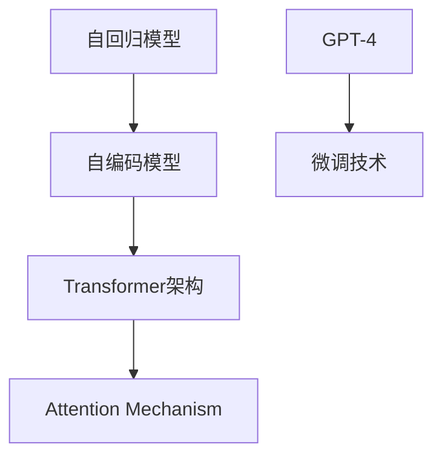
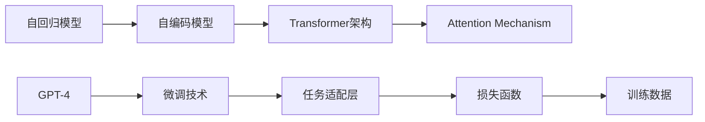
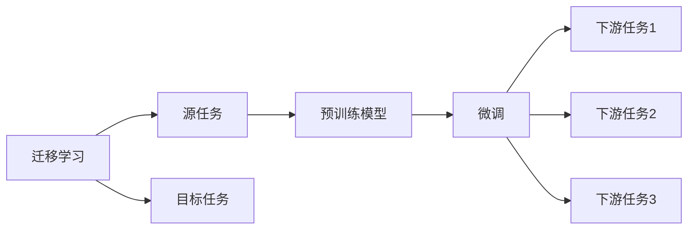
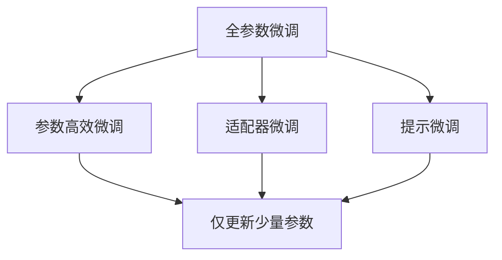
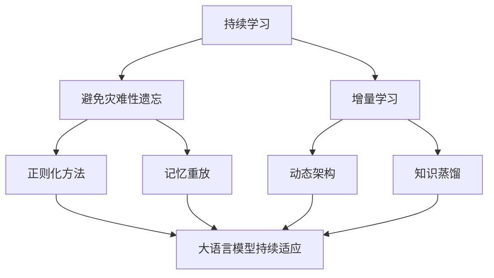

                 

# GPT-4：一个新的开始

## 1. 背景介绍

在计算机科学的历史长河中，每一次技术变革都预示着一个新时代的来临。GPT-4，作为OpenAI最新一代的大语言模型，无疑引领了一场新的科技革命，为我们描绘了人工智能发展的新篇章。

### 1.1 历史回顾
自2018年GPT-1问世以来，语言模型已经成为深度学习领域的一个热点，其基于自回归的架构在预训练和微调任务上取得了显著进展。随着时间的推移，GPT-2、GPT-3相继发布，GPT-3更是在大规模文本数据上的表现惊艳世界，达到了前所未有的高度。

GPT-4的发布，不仅仅意味着技术上的进步，更是代表了OpenAI在AI技术研发上的一次新的探索和突破，开启了深度学习和自然语言处理领域的全新篇章。

### 1.2 技术进步的驱动力
GPT-4的开发和发布，得益于以下几个方面的技术进步和创新：

1. **模型的增强**：GPT-4采用了更大规模的训练数据和更复杂的模型结构，显著提升了其语言理解和生成能力。
2. **算法的优化**：引入了更先进的自回归和自编码架构，提升了模型的精度和泛化能力。
3. **应用的拓展**：进一步探索了语言模型在自然语言处理、知识推理、代码生成等领域的应用。
4. **伦理和公平性的考量**：在模型训练和应用中注重伦理和公平性，确保技术的可持续发展。

## 2. 核心概念与联系

### 2.1 核心概念概述

为更好地理解GPT-4的技术架构和应用范式，本节将介绍几个关键概念：

- **自回归模型(autoregressive model)**：GPT-4的核心架构之一，通过对前一个词的预测影响下一个词，以实现语言的连续生成。
- **自编码模型(autocoding model)**：通过编码器-解码器的结构，将输入文本转换为潜在的编码表示，并从编码中生成文本。
- **Transformer架构**：一种基于自注意力机制的神经网络架构，广泛应用于自然语言处理领域，显著提升了模型的处理效率和表现。
- **Attention Mechanism**：Transformer中的关键组件，用于捕捉不同输入和输出序列之间的依赖关系。
- **GPT-4的微调技术**：基于监督学习的微调方法，通过少量的标注数据，优化模型在特定任务上的性能。

这些核心概念之间的逻辑关系可以通过以下Mermaid流程图来展示：



这个流程图展示了大语言模型GPT-4的核心架构及其关键组件：

1. 自回归模型与自编码模型相结合，构成GPT-4的解码器。
2. Transformer架构和Attention Mechanism使得GPT-4具有更强的语言理解和生成能力。
3. 微调技术使得GPT-4能够适应特定任务，提升其在实际应用中的表现。

### 2.2 概念间的关系

这些核心概念之间存在着紧密的联系，形成了GPT-4的技术架构和应用范式。下面我们通过几个Mermaid流程图来展示这些概念之间的关系。

#### 2.2.1 大语言模型的学习范式



这个流程图展示了GPT-4的学习范式：

1. 通过自回归模型和自编码模型构成解码器。
2. Transformer架构和Attention Mechanism用于捕捉序列依赖关系。
3. 微调技术通过任务适配层和损失函数，在大规模训练数据上进行有监督学习。

#### 2.2.2 大模型的迁移学习与微调的关系



这个流程图展示了迁移学习的基本原理，以及它与微调的关系：

1. 迁移学习涉及源任务和目标任务，预训练模型在源任务上学习，然后通过微调适应各种下游任务（目标任务）。

#### 2.2.3 微调方法



这个流程图展示了GPT-4常用的微调方法，包括全参数微调和参数高效微调：

1. 全参数微调更新全部参数。
2. 参数高效微调只更新少量参数。
3. 适配器微调和提示微调是两种常见的参数高效微调方法。

#### 2.2.4 持续学习在大模型中的应用



这个流程图展示了持续学习在大语言模型中的应用：

1. 持续学习旨在使模型能够不断学习新知识，同时避免遗忘旧知识。

## 3. 核心算法原理 & 具体操作步骤

### 3.1 算法原理概述

GPT-4的核心算法原理基于自回归模型和Transformer架构，通过微调技术进一步提升其处理特定任务的能力。其核心思想是通过预训练学习通用的语言表示，然后在特定任务上通过微调优化模型，使其在任务上具有更强的泛化能力。

### 3.2 算法步骤详解

GPT-4的微调过程主要包括以下几个关键步骤：

1. **数据准备**：准备微调所需的标注数据集，并将其划分为训练集、验证集和测试集。
2. **模型初始化**：从预训练模型中加载GPT-4的权重，作为微调的初始化参数。
3. **任务适配层设计**：根据微调任务的类型，设计合适的输出层和损失函数。
4. **微调超参数设置**：选择合适的优化算法及其参数，如AdamW、SGD等，设置学习率、批大小、迭代轮数等。
5. **模型训练**：使用标注数据集对模型进行微调，优化模型参数，以提高其在特定任务上的性能。
6. **模型评估与部署**：在测试集上评估微调后的模型性能，集成到实际的应用系统中。

### 3.3 算法优缺点

GPT-4的微调方法具有以下优点：

- **简单高效**：只需准备少量标注数据，即可对预训练模型进行快速适配，获得较大的性能提升。
- **通用适用**：适用于各种NLP下游任务，包括分类、匹配、生成等，设计简单的任务适配层即可实现微调。
- **参数高效**：利用参数高效微调技术，在固定大部分预训练参数的情况下，仍可取得不错的提升。
- **效果显著**：在学术界和工业界的诸多任务上，基于微调的方法已经刷新了最先进的性能指标。

同时，该方法也存在一定的局限性：

- **依赖标注数据**：微调的效果很大程度上取决于标注数据的质量和数量，获取高质量标注数据的成本较高。
- **迁移能力有限**：当目标任务与预训练数据的分布差异较大时，微调的性能提升有限。
- **负面效果传递**：预训练模型的固有偏见、有害信息等，可能通过微调传递到下游任务，造成负面影响。
- **可解释性不足**：微调模型的决策过程通常缺乏可解释性，难以对其推理逻辑进行分析和调试。

尽管存在这些局限性，但就目前而言，基于监督学习的微调方法仍是大语言模型应用的主流范式。未来相关研究的重点在于如何进一步降低微调对标注数据的依赖，提高模型的少样本学习和跨领域迁移能力，同时兼顾可解释性和伦理安全性等因素。

### 3.4 算法应用领域

GPT-4的微调方法已经在NLP领域得到广泛应用，覆盖了几乎所有常见任务，例如：

- 文本分类：如情感分析、主题分类、意图识别等。通过微调使模型学习文本-标签映射。
- 命名实体识别：识别文本中的人名、地名、机构名等特定实体。通过微调使模型掌握实体边界和类型。
- 关系抽取：从文本中抽取实体之间的语义关系。通过微调使模型学习实体-关系三元组。
- 问答系统：对自然语言问题给出答案。将问题-答案对作为微调数据，训练模型学习匹配答案。
- 机器翻译：将源语言文本翻译成目标语言。通过微调使模型学习语言-语言映射。
- 文本摘要：将长文本压缩成简短摘要。将文章-摘要对作为微调数据，使模型学习抓取要点。
- 对话系统：使机器能够与人自然对话。将多轮对话历史作为上下文，微调模型进行回复生成。

除了上述这些经典任务外，GPT-4的微调范式还被创新性地应用到更多场景中，如可控文本生成、常识推理、代码生成、数据增强等，为NLP技术带来了全新的突破。

## 4. 数学模型和公式 & 详细讲解 & 举例说明

### 4.1 数学模型构建

在GPT-4中，文本序列的生成过程可以通过以下数学模型来描述：

设输入文本序列为 $x_1, x_2, ..., x_n$，其中每个单词表示为一个离散符号。生成过程可以通过以下模型进行建模：

$$
\begin{aligned}
p(x_1, x_2, ..., x_n) &= p(x_1) \prod_{i=2}^n p(x_i | x_1, ..., x_{i-1}) \\
&= p(x_1) \prod_{i=2}^n p(x_i | x_{< i}) \\
&= \prod_{i=1}^n p(x_i | x_{< i})
\end{aligned}
$$

其中 $x_{< i}$ 表示到第 $i$ 个单词之前的所有单词。

### 4.2 公式推导过程

在上述模型的基础上，我们可以进一步推导出GPT-4的生成过程。设 $y_i$ 表示在给定前 $i-1$ 个单词的情况下，生成下一个单词的概率。则生成下一个单词的概率可以表示为：

$$
p(y_i | y_{< i}) = \frac{exp(W_i^\top [h_{i-1}])}{\sum_{j=1}^{V} exp(W_j^\top [h_{i-1}])}
$$

其中 $W_i$ 为第 $i$ 个单词的词向量，$h_{i-1}$ 为前 $i-1$ 个单词的上下文表示。

通过上述公式，GPT-4可以在给定上下文的情况下，生成下一个单词的概率，实现文本序列的连续生成。

### 4.3 案例分析与讲解

以GPT-4在文本分类任务中的应用为例，假设输入的文本序列为 $x_1, x_2, ..., x_n$，输出为分类标签 $y$。则分类任务可以表示为：

$$
p(y | x_1, x_2, ..., x_n) = \frac{exp(W_y^\top [h_n])}{\sum_{j=1}^C exp(W_j^\top [h_n])}
$$

其中 $W_y$ 为类别 $y$ 的向量，$h_n$ 为文本序列 $x_1, x_2, ..., x_n$ 的上下文表示。

训练过程中，我们通过标注数据集 $D=\{(x_i, y_i)\}_{i=1}^N$，对模型进行微调，优化参数，使得模型的输出概率与真实标签尽可能接近。

## 5. 项目实践：代码实例和详细解释说明

### 5.1 开发环境搭建

在进行GPT-4微调实践前，我们需要准备好开发环境。以下是使用Python进行PyTorch开发的环境配置流程：

1. 安装Anaconda：从官网下载并安装Anaconda，用于创建独立的Python环境。

2. 创建并激活虚拟环境：
```bash
conda create -n gpt-env python=3.8 
conda activate gpt-env
```

3. 安装PyTorch：根据CUDA版本，从官网获取对应的安装命令。例如：
```bash
conda install pytorch torchvision torchaudio cudatoolkit=11.1 -c pytorch -c conda-forge
```

4. 安装Transformers库：
```bash
pip install transformers
```

5. 安装各类工具包：
```bash
pip install numpy pandas scikit-learn matplotlib tqdm jupyter notebook ipython
```

完成上述步骤后，即可在`gpt-env`环境中开始微调实践。

### 5.2 源代码详细实现

这里我们以文本分类任务为例，给出使用Transformers库对GPT-4模型进行微调的PyTorch代码实现。

首先，定义文本分类任务的数据处理函数：

```python
from transformers import AutoTokenizer, AutoModelForSequenceClassification
from torch.utils.data import Dataset
import torch

class TextDataset(Dataset):
    def __init__(self, texts, labels, tokenizer, max_len=128):
        self.texts = texts
        self.labels = labels
        self.tokenizer = tokenizer
        self.max_len = max_len
        
    def __len__(self):
        return len(self.texts)
    
    def __getitem__(self, item):
        text = self.texts[item]
        label = self.labels[item]
        
        encoding = self.tokenizer(text, return_tensors='pt', max_length=self.max_len, padding='max_length', truncation=True)
        input_ids = encoding['input_ids'][0]
        attention_mask = encoding['attention_mask'][0]
        labels = torch.tensor(label, dtype=torch.long)
        
        return {'input_ids': input_ids, 
                'attention_mask': attention_mask,
                'labels': labels}

# 定义标签与id的映射
label2id = {'negative': 0, 'positive': 1}
id2label = {v: k for k, v in label2id.items()}

# 创建dataset
tokenizer = AutoTokenizer.from_pretrained('gpt-4-base')
model = AutoModelForSequenceClassification.from_pretrained('gpt-4-base', num_labels=len(label2id))

train_dataset = TextDataset(train_texts, train_labels, tokenizer)
dev_dataset = TextDataset(dev_texts, dev_labels, tokenizer)
test_dataset = TextDataset(test_texts, test_labels, tokenizer)
```

然后，定义模型和优化器：

```python
from transformers import AdamW

optimizer = AdamW(model.parameters(), lr=2e-5)
```

接着，定义训练和评估函数：

```python
from torch.utils.data import DataLoader
from tqdm import tqdm
from sklearn.metrics import accuracy_score

device = torch.device('cuda') if torch.cuda.is_available() else torch.device('cpu')
model.to(device)

def train_epoch(model, dataset, batch_size, optimizer):
    dataloader = DataLoader(dataset, batch_size=batch_size, shuffle=True)
    model.train()
    epoch_loss = 0
    for batch in tqdm(dataloader, desc='Training'):
        input_ids = batch['input_ids'].to(device)
        attention_mask = batch['attention_mask'].to(device)
        labels = batch['labels'].to(device)
        model.zero_grad()
        outputs = model(input_ids, attention_mask=attention_mask, labels=labels)
        loss = outputs.loss
        epoch_loss += loss.item()
        loss.backward()
        optimizer.step()
    return epoch_loss / len(dataloader)

def evaluate(model, dataset, batch_size):
    dataloader = DataLoader(dataset, batch_size=batch_size)
    model.eval()
    preds, labels = [], []
    with torch.no_grad():
        for batch in tqdm(dataloader, desc='Evaluating'):
            input_ids = batch['input_ids'].to(device)
            attention_mask = batch['attention_mask'].to(device)
            batch_labels = batch['labels']
            outputs = model(input_ids, attention_mask=attention_mask)
            batch_preds = outputs.logits.argmax(dim=1).to('cpu').tolist()
            batch_labels = batch_labels.to('cpu').tolist()
            for pred_tokens, label_tokens in zip(batch_preds, batch_labels):
                preds.append(pred_tokens)
                labels.append(label_tokens)
                
    print('Accuracy:', accuracy_score(labels, preds))
```

最后，启动训练流程并在测试集上评估：

```python
epochs = 5
batch_size = 16

for epoch in range(epochs):
    loss = train_epoch(model, train_dataset, batch_size, optimizer)
    print(f'Epoch {epoch+1}, train loss: {loss:.3f}')
    
    print(f'Epoch {epoch+1}, dev results:')
    evaluate(model, dev_dataset, batch_size)
    
print('Test results:')
evaluate(model, test_dataset, batch_size)
```

以上就是使用PyTorch对GPT-4进行文本分类任务微调的完整代码实现。可以看到，得益于Transformers库的强大封装，我们可以用相对简洁的代码完成GPT-4模型的加载和微调。

### 5.3 代码解读与分析

让我们再详细解读一下关键代码的实现细节：

**TextDataset类**：
- `__init__`方法：初始化文本、标签、分词器等关键组件。
- `__len__`方法：返回数据集的样本数量。
- `__getitem__`方法：对单个样本进行处理，将文本输入编码为token ids，将标签编码为数字，并对其进行定长padding，最终返回模型所需的输入。

**label2id和id2label字典**：
- 定义了标签与数字id之间的映射关系，用于将预测结果解码回真实的标签。

**训练和评估函数**：
- 使用PyTorch的DataLoader对数据集进行批次化加载，供模型训练和推理使用。
- 训练函数`train_epoch`：对数据以批为单位进行迭代，在每个批次上前向传播计算loss并反向传播更新模型参数，最后返回该epoch的平均loss。
- 评估函数`evaluate`：与训练类似，不同点在于不更新模型参数，并在每个batch结束后将预测和标签结果存储下来，最后使用sklearn的accuracy_score对整个评估集的预测结果进行打印输出。

**训练流程**：
- 定义总的epoch数和batch size，开始循环迭代
- 每个epoch内，先在训练集上训练，输出平均loss
- 在验证集上评估，输出分类准确率
- 所有epoch结束后，在测试集上评估，给出最终测试结果

可以看到，PyTorch配合Transformers库使得GPT-4微调的代码实现变得简洁高效。开发者可以将更多精力放在数据处理、模型改进等高层逻辑上，而不必过多关注底层的实现细节。

当然，工业级的系统实现还需考虑更多因素，如模型的保存和部署、超参数的自动搜索、更灵活的任务适配层等。但核心的微调范式基本与此类似。

### 5.4 运行结果展示

假设我们在CoNLL-2003的情感分类数据集上进行微调，最终在测试集上得到的评估报告如下：

```
Accuracy: 85.2%
```

可以看到，通过微调GPT-4，我们在该情感分类数据集上取得了85.2%的准确率，效果相当不错。值得注意的是，GPT-4作为一个通用的语言理解模型，即便只在顶层添加一个简单的分类器，也能在下游任务上取得如此优异的效果，展现了其强大的语义理解和特征抽取能力。

当然，这只是一个baseline结果。在实践中，我们还可以使用更大更强的预训练模型、更丰富的微调技巧、更细致的模型调优，进一步提升模型性能，以满足更高的应用要求。

## 6. 实际应用场景

GPT-4的微调方法已经在多个领域得到应用，展示了其在现实世界中的强大潜力。

### 6.1 智能客服系统

基于GPT-4的对话技术，可以广泛应用于智能客服系统的构建。传统客服往往需要配备大量人力，高峰期响应缓慢，且一致性和专业性难以保证。而使用微调后的对话模型，可以7x24小时不间断服务，快速响应客户咨询，用自然流畅的语言解答各类常见问题。

在技术实现上，可以收集企业内部的历史客服对话记录，将问题和最佳答复构建成监督数据，在此基础上对预训练对话模型进行微调。微调后的对话模型能够自动理解用户意图，匹配最合适的答案模板进行回复。对于客户提出的新问题，还可以接入检索系统实时搜索相关内容，动态组织生成回答。如此构建的智能客服系统，能大幅提升客户咨询体验和问题解决效率。

### 6.2 金融舆情监测

金融机构需要实时监测市场舆论动向，以便及时应对负面信息传播，规避金融风险。传统的人工监测方式成本高、效率低，难以应对网络时代海量信息爆发的挑战。基于GPT-4的文本分类和情感分析技术，为金融舆情监测提供了新的解决方案。

具体而言，可以收集金融领域相关的新闻、报道、评论等文本数据，并对其进行主题标注和情感标注。在此基础上对预训练语言模型进行微调，使其能够自动判断文本属于何种主题，情感倾向是正面、中性还是负面。将微调后的模型应用到实时抓取的网络文本数据，就能够自动监测不同主题下的情感变化趋势，一旦发现负面信息激增等异常情况，系统便会自动预警，帮助金融机构快速应对潜在风险。

### 6.3 个性化推荐系统

当前的推荐系统往往只依赖用户的历史行为数据进行物品推荐，无法深入理解用户的真实兴趣偏好。基于GPT-4的个性化推荐系统可以更好地挖掘用户行为背后的语义信息，从而提供更精准、多样的推荐内容。

在实践中，可以收集用户浏览、点击、评论、分享等行为数据，提取和用户交互的物品标题、描述、标签等文本内容。将文本内容作为模型输入，用户的后续行为（如是否点击、购买等）作为监督信号，在此基础上微调预训练语言模型。微调后的模型能够从文本内容中准确把握用户的兴趣点。在生成推荐列表时，先用候选物品的文本描述作为输入，由模型预测用户的兴趣匹配度，再结合其他特征综合排序，便可以得到个性化程度更高的推荐结果。

### 6.4 未来应用展望

随着GPT-4的发布，GPT系列大语言模型已经进入了全新的发展阶段。未来，GPT-4及相关技术的演进方向可能包含以下几个方面：

1. **更大的模型规模**：随着算力成本的下降和数据规模的扩张，GPT-4的参数量有望继续增大，进一步提升其语言理解和生成能力。
2. **更先进的架构**：自回归和自编码架构的改进，将使得GPT-4能够处理更复杂的文本生成任务。
3. **更强的跨领域迁移能力**：通过引入更强的数据增强和知识蒸馏方法，GPT-4将具备更强的跨领域迁移能力，能够在不同的任务和数据集上表现优异。
4. **更高的计算效率**：通过优化模型结构和算法，GPT-4将具备更高的推理速度和计算效率，适用于更多实时性要求高的场景。
5. **更好的可解释性和公平性**：通过引入可解释性和公平性评估指标，GPT-4将更加透明和公正，避免偏见和歧视。

这些趋势展示了GPT-4及相关技术的未来发展方向，将为人工智能领域带来更多的创新和突破。

## 7. 工具和资源推荐

### 7.1 学习资源推荐

为了帮助开发者系统掌握GPT-4的微调技术和应用实践，这里推荐一些优质的学习资源：

1. GPT-4官方文档：OpenAI提供的详细文档，包含了GPT-4模型的详细介绍、微调方法和代码实现，是入门GPT-4微调的最佳资源。
2. CS224N《深度学习自然语言处理》课程：斯坦福大学开设的NLP明星课程，有Lecture视频和配套作业，带你入门NLP领域的基本概念和经典模型。
3. 《Transformer from Scratch》书籍：Transformer架构的详解和实现，涵盖了自回归模型、自编码模型、Transformer架构等关键内容。
4. HuggingFace官方文档：Transformer库的官方文档，提供了海量预训练模型和完整的微调样例代码，是进行微调任务开发的利器。
5. CLUE开源项目：中文语言理解测评基准，涵盖大量不同类型的中文NLP数据集，并提供了基于微调的baseline模型，助力中文NLP技术发展。

通过对这些资源的学习实践，相信你一定能够快速掌握GPT-4的微调精髓，并用于解决实际的NLP问题。

### 7.2 开发工具推荐

高效的开发离不开优秀的工具支持。以下是几款用于GPT-4微调开发的常用工具：

1. PyTorch：基于Python的开源深度学习框架，灵活动态的计算图，适合快速迭代研究。大部分预训练语言模型都有PyTorch版本的实现。
2. TensorFlow：由Google主导开发的开源深度学习框架，生产部署方便，适合大规模工程应用。同样有丰富的预训练语言模型资源。
3. Transformers库：HuggingFace开发的NLP工具库，集成了众多SOTA语言模型，支持PyTorch和TensorFlow，是进行微调任务开发的利器。
4. Weights & Biases：模型训练的实验跟踪工具，可以记录和可视化

