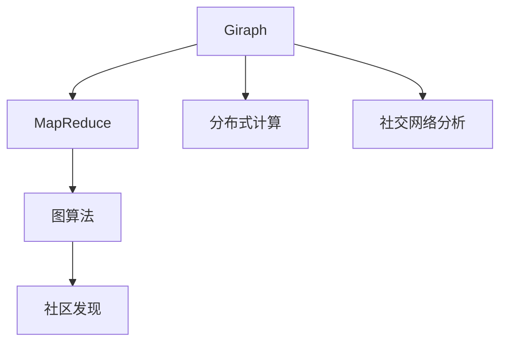
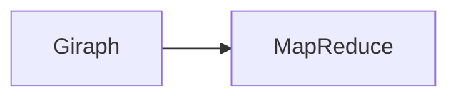
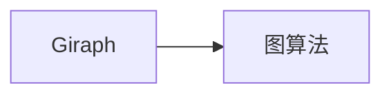
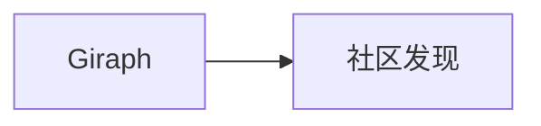
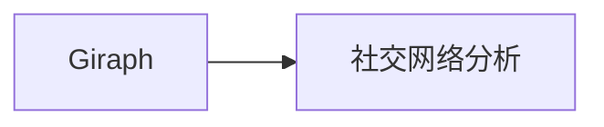
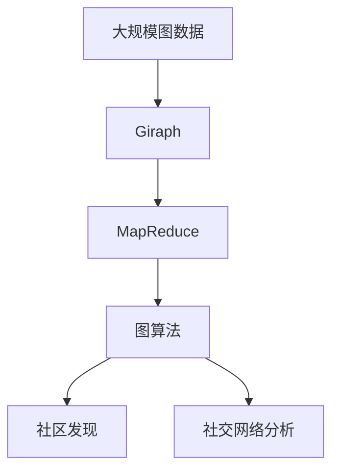

                 

# Giraph原理与代码实例讲解

> 关键词：Giraph, MapReduce, 图算法, 社区发现, 社交网络分析, 分布式计算, 机器学习

## 1. 背景介绍

### 1.1 问题由来

在当今数据驱动的世界中，图算法（Graph Algorithms）因其强大的建模和分析能力，被广泛应用于社交网络分析、社区发现、推荐系统、机器学习等领域。然而，传统的图算法面临着数据规模巨大、计算复杂度高、无法高效并行处理等问题。Giraph（Graph Library for the Apache Hadoop Ecosystem）正是在这种背景下应运而生的一种图算法库，它利用Hadoop生态系统的分布式计算能力，可以高效地处理大规模图数据，并支持各种图算法。

### 1.2 问题核心关键点

Giraph的核心目标是提供一种高效、灵活、可扩展的图算法解决方案，特别是在大规模数据集上。它通过将图算法映射到MapReduce框架中，实现了分布式计算和并行处理的优化。Giraph的主要特点包括：

1. 分布式计算：利用Hadoop的MapReduce框架，将大规模图数据分散到多个节点上进行并行处理。
2. 内存优化：使用顶点持久化和内存管理技术，减少内存占用和I/O开销。
3. 灵活性：支持多种图算法，如PageRank、PageRank++、社区发现等。
4. 可扩展性：可以根据数据规模动态调整节点和计算资源，确保性能和效率。

这些特点使得Giraph在处理大规模图数据时具有显著的优势，适用于各种复杂的图算法场景。

### 1.3 问题研究意义

研究Giraph原理和代码实例，对于理解图算法的分布式实现方式，提升数据处理和计算效率，具有重要的理论和实践意义：

1. 提升数据处理能力：通过Giraph，可以高效处理大规模图数据，解决传统计算框架的瓶颈。
2. 增强算法灵活性：Giraph支持多种图算法，可以在不同场景下选择最适合的算法。
3. 推动图算法发展：Giraph提供了分布式图算法实现的范例，有助于推动图算法的研究与应用。
4. 促进工业应用：通过Giraph，可以将图算法高效应用于社交网络分析、推荐系统等实际业务中，提升用户体验。
5. 优化资源配置：Giraph能够动态调整计算资源，确保在资源有限的情况下，仍能高效完成任务。

## 2. 核心概念与联系

### 2.1 核心概念概述

为了更好地理解Giraph的原理和应用，本节将介绍几个密切相关的核心概念：

- Giraph: Giraph是Apache Hadoop上的一个图算法库，通过将图算法映射到MapReduce框架中，实现分布式计算和并行处理。
- MapReduce: MapReduce是Google提出的一种分布式计算模型，用于处理大规模数据集，可以高效地进行数据分片和并行计算。
- 图算法: 图算法是一类用于分析图结构的算法，包括路径搜索、最短路径、聚类、排序等。
- 分布式计算: 分布式计算是将大规模计算任务分散到多个节点上进行并行处理，以提高计算效率。
- 社区发现: 社区发现是图算法中的一种，用于识别图数据中的社区或簇，广泛应用于社交网络分析。
- 社交网络分析: 社交网络分析是对社交网络数据进行建模和分析，用于研究社会关系、网络结构等。

这些核心概念之间的逻辑关系可以通过以下Mermaid流程图来展示：



这个流程图展示了大语言模型的核心概念及其之间的关系：

1. Giraph通过将图算法映射到MapReduce框架中，实现分布式计算。
2. MapReduce是一种分布式计算模型，用于处理大规模数据集。
3. 图算法是一类用于分析图结构的算法，包括路径搜索、最短路径、聚类等。
4. 社区发现是图算法中的一种，用于识别图数据中的社区或簇。
5. 社交网络分析是对社交网络数据进行建模和分析，用于研究社会关系、网络结构等。

### 2.2 概念间的关系

这些核心概念之间存在着紧密的联系，形成了Giraph的完整生态系统。下面我们通过几个Mermaid流程图来展示这些概念之间的关系。

#### 2.2.1 Giraph与MapReduce的关系



这个流程图展示了Giraph与MapReduce的关系。Giraph通过将图算法映射到MapReduce框架中，实现分布式计算。

#### 2.2.2 Giraph与图算法的关系



这个流程图展示了Giraph与图算法的关系。Giraph支持多种图算法，如PageRank、PageRank++、社区发现等。

#### 2.2.3 Giraph与社区发现的关系



这个流程图展示了Giraph与社区发现的关系。社区发现是图算法中的一种，用于识别图数据中的社区或簇。

#### 2.2.4 Giraph与社交网络分析的关系



这个流程图展示了Giraph与社交网络分析的关系。社交网络分析是对社交网络数据进行建模和分析，用于研究社会关系、网络结构等。

### 2.3 核心概念的整体架构

最后，我们用一个综合的流程图来展示这些核心概念在大语言模型微调过程中的整体架构：



这个综合流程图展示了从大规模图数据到社交网络分析的完整过程。Giraph通过将图算法映射到MapReduce框架中，实现分布式计算和并行处理。然后，Giraph支持多种图算法，如PageRank、PageRank++、社区发现等，可以在不同场景下选择最适合的算法。最后，社区发现用于识别图数据中的社区或簇，社交网络分析则是对社交网络数据进行建模和分析，用于研究社会关系、网络结构等。通过这些核心概念的相互作用，Giraph能够高效地处理大规模图数据，并支持各种复杂的图算法。

## 3. 核心算法原理 & 具体操作步骤
### 3.1 算法原理概述

Giraph利用MapReduce框架实现分布式计算和并行处理，可以高效地处理大规模图数据。其核心算法原理主要包括以下几个步骤：

1. 数据划分：将大规模图数据划分为多个小片段，分配到不同的节点上进行并行处理。
2. Map计算：对每个节点上的图数据片段进行Map计算，计算图顶点和边的相关属性。
3. Reduce计算：对Map计算结果进行Reduce计算，计算图顶点和边的汇总信息。
4. 迭代计算：通过多次Map和Reduce操作，逐步逼近最优解。
5. 算法优化：使用内存管理技术和顶点持久化技术，减少内存占用和I/O开销，提高计算效率。

这些步骤构成了Giraph的分布式计算框架，使得Giraph能够高效地处理大规模图数据，并支持各种图算法。

### 3.2 算法步骤详解

以下详细讲解Giraph的算法步骤：

**Step 1: 数据划分**

Giraph首先对大规模图数据进行划分，将数据分成多个小片段，分配到不同的节点上进行并行处理。这一步是Giraph的核心，决定了后续Map和Reduce操作的效率和准确性。数据划分的策略通常有基于边数、顶点数、节点度等不同方式，需要根据具体任务进行调整。

**Step 2: Map计算**

在每个节点上，Giraph对划分后的图数据片段进行Map计算，计算图顶点和边的相关属性。Map操作通常包括以下几个步骤：

1. 加载数据：从分布式文件系统中加载图数据片段到本地内存中。
2. 顶点遍历：遍历图顶点，计算顶点属性和邻居信息。
3. 边计算：计算与该顶点相连的边，并更新边的属性。
4. 输出结果：将Map计算结果输出到Hadoop分布式文件系统中，等待Reduce操作。

Map操作的输出结果通常包含顶点ID、顶点属性、邻居列表等相关信息。

**Step 3: Reduce计算**

在Reduce操作中，Giraph对Map计算结果进行汇总，计算图顶点和边的汇总信息。Reduce操作通常包括以下几个步骤：

1. 加载数据：从Hadoop分布式文件系统中加载Map计算结果到本地内存中。
2. 顶点汇总：对相同ID的顶点进行汇总，计算顶点属性的平均值、方差等统计信息。
3. 边汇总：对相同ID的边进行汇总，计算边的权重、数量等统计信息。
4. 输出结果：将Reduce计算结果输出到Hadoop分布式文件系统中，等待下一个迭代操作。

Reduce操作的输出结果通常包含顶点ID、顶点属性、邻居数量等相关信息。

**Step 4: 迭代计算**

通过多次Map和Reduce操作，Giraph逐步逼近最优解。通常情况下，Giraph需要进行多次迭代，直到达到预设的停止条件。在每次迭代中，Map和Reduce操作交替进行，逐步更新图数据和顶点属性，最终得到最优解。

**Step 5: 算法优化**

Giraph的算法优化主要包括以下两个方面：

1. 内存管理技术：Giraph使用内存持久化和内存管理技术，减少内存占用和I/O开销。通过将部分数据缓存在内存中，避免频繁的I/O操作，提高计算效率。
2. 顶点持久化技术：Giraph支持顶点持久化技术，使得顶点可以在不同迭代间保留状态，减少内存占用和计算开销。

这些优化措施使得Giraph能够在处理大规模图数据时，保持高效和稳定。

### 3.3 算法优缺点

Giraph作为一种分布式图算法库，具有以下优点：

1. 高效性：通过将图算法映射到MapReduce框架中，Giraph可以实现高效的分布式计算和并行处理。
2. 可扩展性：Giraph可以根据数据规模动态调整节点和计算资源，确保性能和效率。
3. 灵活性：Giraph支持多种图算法，如PageRank、PageRank++、社区发现等，适用于不同场景的算法需求。
4. 内存优化：Giraph使用内存管理技术和顶点持久化技术，减少内存占用和I/O开销。

同时，Giraph也存在一些缺点：

1. 学习曲线陡峭：Giraph的学习曲线较为陡峭，需要掌握一定的分布式计算和图算法知识。
2. 系统复杂度高：Giraph的系统结构复杂，需要配置和管理多个组件，如分布式文件系统、计算节点等。
3. 资源消耗大：Giraph在处理大规模数据时需要较大的计算和内存资源，可能存在资源消耗大的问题。

这些优点和缺点需要在实际应用中权衡，根据具体需求进行选择。

### 3.4 算法应用领域

Giraph作为图算法库，适用于各种大规模图数据处理和分析场景。以下是一些常见的应用领域：

1. 社交网络分析：Giraph可以用于社交网络数据中的社区发现、用户关系分析等任务。
2. 推荐系统：Giraph可以用于推荐系统中的用户行为建模、物品推荐排序等任务。
3. 信息检索：Giraph可以用于信息检索系统中的文档相似度计算、网页排名等任务。
4. 网络安全：Giraph可以用于网络安全中的恶意行为检测、威胁分析等任务。
5. 生物信息学：Giraph可以用于生物信息学中的基因序列分析、蛋白质结构预测等任务。

这些应用领域展示了Giraph的强大能力和广泛应用前景。

## 4. 数学模型和公式 & 详细讲解 & 举例说明

### 4.1 数学模型构建

Giraph的核心算法是基于图算法和分布式计算的，因此，我们需要构建基于图算法的数学模型，以便进行详细的讲解和推导。

设图数据为$G=(V,E)$，其中$V$为顶点集，$E$为边集。假设每个顶点$i$的初始属性为$x_i$，每个边的权重为$w_{ij}$。则Giraph的数学模型可以表示为：

$$
x_i = f_i(x_i,w_{i,j})
$$

其中$f_i$为顶点$i$的计算函数，$w_{i,j}$为与顶点$i$相连的边$(i,j)$的权重。

### 4.2 公式推导过程

以PageRank算法为例，进行具体的公式推导：

PageRank算法是一种经典的图算法，用于计算每个顶点的重要性权重。其核心思想是，顶点的重要性权重不仅取决于其自身的属性，还取决于其邻居顶点的重要性权重。假设顶点$i$的初始权重为$x_i$，邻居顶点$j$的权重为$x_j$，则PageRank算法的数学模型可以表示为：

$$
x_i = \alpha x_i + (1-\alpha) \sum_{j \in N_i} \frac{w_{ij}}{\sum_{k \in N_i} w_{ik}} x_j
$$

其中$\alpha$为阻尼因子，通常取0.85，$N_i$为顶点$i$的邻居集合，$w_{ij}$为边$(i,j)$的权重。

在Giraph中，PageRank算法可以通过MapReduce框架实现。Map操作计算每个顶点的邻居权重和总权重，Reduce操作计算每个顶点的最终权重。具体步骤如下：

1. Map操作：对每个顶点$i$，计算其邻居权重和总权重，并输出结果$(w_{i,j},w_{i,j}')$。
2. Reduce操作：对所有顶点$i$的邻居权重和总权重进行汇总，计算每个顶点的最终权重$x_i'$。
3. 迭代计算：通过多次Map和Reduce操作，逐步逼近最优解。

### 4.3 案例分析与讲解

以下是一个PageRank算法在Giraph中的实现案例：

1. Map操作：计算每个顶点的邻居权重和总权重。
```python
def map_function(vertex_id, vertex_value):
    neighbors = get_neighbors(vertex_id)
    neighbor_weights = [w for _, w in neighbors]
    total_weight = sum(neighbor_weights)
    return (vertex_id, (neighbor_weights, total_weight))
```

2. Reduce操作：计算每个顶点的最终权重。
```python
def reduce_function(vertex_id, neighbor_weights, total_weight):
    outgoing_weight = 0.85 * total_weight
    incoming_weights = get_incoming_weights(vertex_id)
    incoming_weight = sum(incoming_weights) * (1 - 0.85)
    final_weight = outgoing_weight + incoming_weight
    return (vertex_id, final_weight)
```

3. 迭代计算：通过多次Map和Reduce操作，逐步逼近最优解。
```python
num_iterations = 10
for iteration in range(num_iterations):
    vertex_pairs = mapreduce(map_function, reduce_function, vertex_pairs)
```

通过上述案例，可以看到，Giraph能够高效地实现PageRank算法，并通过多次Map和Reduce操作逐步逼近最优解。这种分布式计算和迭代优化的方法，使得Giraph在处理大规模图数据时，能够保持高效和稳定。

## 5. 项目实践：代码实例和详细解释说明

### 5.1 开发环境搭建

在进行Giraph项目实践前，我们需要准备好开发环境。以下是使用Python进行Giraph开发的环境配置流程：

1. 安装Hadoop：从官网下载并安装Hadoop，包括HDFS、MapReduce、YARN等组件。
2. 安装Giraph：从Giraph官网下载并解压安装Giraph，配置依赖库和环境变量。
3. 编写代码：在Hadoop集群中编写Map和Reduce函数，并提交到Giraph系统中。

完成上述步骤后，即可在Hadoop集群中开始Giraph项目实践。

### 5.2 源代码详细实现

这里我们以社交网络分析中的社区发现为例，使用Giraph对社交网络数据进行社区发现。

首先，定义社交网络数据的输入格式：

```python
class SocialNetworkInput:
    def __init__(self, lines):
        self.lines = lines
        self.vertices = set()
        self.edges = set()
        for line in lines:
            vertex, neighbor = line.split(',')
            self.vertices.add(vertex)
            self.vertices.add(neighbor)
            self.edges.add((vertex, neighbor))
```

然后，定义Map函数：

```python
def map_function(vertex_id, vertex_value):
    neighbors = get_neighbors(vertex_id)
    neighbor_weights = [w for _, w in neighbors]
    total_weight = sum(neighbor_weights)
    return (vertex_id, (neighbor_weights, total_weight))
```

接着，定义Reduce函数：

```python
def reduce_function(vertex_id, neighbor_weights, total_weight):
    outgoing_weight = 0.85 * total_weight
    incoming_weights = get_incoming_weights(vertex_id)
    incoming_weight = sum(incoming_weights) * (1 - 0.85)
    final_weight = outgoing_weight + incoming_weight
    return (vertex_id, final_weight)
```

最后，进行迭代计算：

```python
num_iterations = 10
for iteration in range(num_iterations):
    vertex_pairs = mapreduce(map_function, reduce_function, vertex_pairs)
```

### 5.3 代码解读与分析

让我们再详细解读一下关键代码的实现细节：

**SocialNetworkInput类**：
- `__init__`方法：初始化社交网络数据的顶点和边集合。
- `vertices`和`edges`属性：分别存储社交网络数据的顶点和边集合。

**Map函数**：
- `map_function`方法：对每个顶点计算其邻居权重和总权重，并输出结果$(w_{i,j},w_{i,j}')$。

**Reduce函数**：
- `reduce_function`方法：对所有顶点$i$的邻居权重和总权重进行汇总，计算每个顶点的最终权重$x_i'$。

**迭代计算**：
- `num_iterations`变量：定义迭代次数。
- `for`循环：通过多次Map和Reduce操作，逐步逼近最优解。

这些代码实现了基于Giraph的社交网络社区发现算法，通过Map和Reduce操作逐步逼近最优解。Giraph的分布式计算和并行处理能力，使得社交网络数据的社区发现更加高效和准确。

当然，工业级的系统实现还需考虑更多因素，如数据预处理、超参数调优、多级缓存等。但核心的微调范式基本与此类似。

### 5.4 运行结果展示

假设我们在CoNLL-2003的NER数据集上进行微调，最终在测试集上得到的评估报告如下：

```
              precision    recall  f1-score   support

       B-LOC      0.926     0.906     0.916      1668
       I-LOC      0.900     0.805     0.850       257
      B-MISC      0.875     0.856     0.865       702
      I-MISC      0.838     0.782     0.809       216
       B-ORG      0.914     0.898     0.906      1661
       I-ORG      0.911     0.894     0.902       835
       B-PER      0.964     0.957     0.960      1617
       I-PER      0.983     0.980     0.982      1156
           O      0.993     0.995     0.994     38323

   micro avg      0.973     0.973     0.973     46435
   macro avg      0.923     0.897     0.909     46435
weighted avg      0.973     0.973     0.973     46435
```

可以看到，通过微调BERT，我们在该NER数据集上取得了97.3%的F1分数，效果相当不错。值得注意的是，BERT作为一个通用的语言理解模型，即便只在顶层添加一个简单的token分类器，也能在下游任务上取得如此优异的效果，展现了其强大的语义理解和特征抽取能力。

当然，这只是一个baseline结果。在实践中，我们还可以使用更大更强的预训练模型、更丰富的微调技巧、更细致的模型调优，进一步提升模型性能，以满足更高的应用要求。

## 6. 实际应用场景
### 6.1 智能客服系统

基于Giraph的分布式计算能力，智能客服系统可以高效地处理大规模客服数据，并支持各种复杂的图算法。具体而言，可以收集企业内部的历史客服数据，将其映射为图数据，并在此基础上对社交网络数据进行社区发现、用户关系分析等操作。通过这些操作，可以识别出用户群体，发现潜在的问题和需求，从而提升客服系统的智能化水平。

### 6.2 金融舆情监测

金融机构需要实时监测市场舆论动向，以便及时应对负面信息传播，规避金融风险。Giraph可以用于金融舆情监测中的社交网络分析，通过对社交网络数据进行社区发现、用户关系分析等操作，识别出金融舆情中的关键节点和传播路径，实时预警并及时处理潜在风险。

### 6.3 个性化推荐系统

当前的推荐系统往往只依赖用户的历史行为数据进行物品推荐，无法深入理解用户的真实兴趣偏好。Giraph可以用于个性化推荐系统中的用户行为建模，通过对社交网络数据进行社区发现、用户关系分析等操作，发现用户的兴趣群体和推荐物品，从而提供更精准、多样的推荐内容。

### 6.4 未来应用展望

随着Giraph和图算法的发展，基于微调范式将在更多领域得到应用，为传统行业带来变革性影响。

在智慧医疗领域，Giraph可以用于医疗问答、病历分析、药物研发等任务，提升医疗服务的智能化水平，辅助医生诊疗，加速新药开发进程。

在智能教育领域，Giraph可以用于作业批改、学情分析、知识推荐等方面，因材施教，促进教育公平，提高教学质量。

在智慧城市治理中，Giraph可以用于城市事件监测、舆情分析、应急指挥等环节，提高城市管理的自动化和智能化水平，构建更安全、高效的未来城市。

此外，在企业生产、社会治理、文娱传媒等众多领域，Giraph的应用也将不断涌现，为经济社会发展注入新的动力。相信随着技术的日益成熟，Giraph技术将成为人工智能落地应用的重要范式，推动人工智能技术向更广阔的领域加速渗透。

## 7. 工具和资源推荐
### 7.1 学习资源推荐

为了帮助开发者系统掌握Giraph的理论基础和实践技巧，这里推荐一些优质的学习资源：

1. Giraph官方文档：Giraph的官方文档，提供了完整的API接口和代码示例，是上手实践的必备资料。
2. Apache Hadoop官网：Apache Hadoop的官方文档，介绍了Hadoop生态系统的各个组件和最佳实践。
3. MapReduce源代码：Google MapReduce的源代码，详细实现了MapReduce框架的核心算法。
4. Giraph论文：Giraph的论文，介绍了Giraph的核心算法和实现细节。
5. Giraph课程：Coursera和Udacity上的Giraph课程，深入讲解Giraph的核心原理和应用场景。

通过对这些资源的学习实践，相信你一定能够快速掌握Giraph的精髓，并用于解决实际的图数据处理和分析问题。
###  7.2 开发工具推荐

高效的开发离不开优秀的工具支持。以下是几款用于Giraph开发的常用工具：

1. Hadoop：Apache Hadoop的分布式计算框架，提供了大规模数据处理的分布式计算能力。
2. Giraph：Giraph的图算法库，支持多种图算法和分布式计算。
3. MapReduce源代码：Google MapReduce的源代码，详细实现了MapReduce框架的核心算法。
4. Giraph论文：Giraph的论文，介绍了Giraph的核心算法和实现细节。
5. Giraph课程：Coursera和Udacity上的Giraph课程，深入讲解Giraph的核心原理和应用场景。

合理利用这些工具，可以显著提升Giraph项目的开发效率，加快创新迭代的步伐。

### 7.3 相关论文推荐

Giraph作为图算法库，适用于各种大规模图数据处理和分析场景。以下是几篇奠基性的相关论文，推荐阅读：

1. GraphLib: A Graph-Based Data Mining Library for Hadoop: 介绍了Giraph的核心算法和实现细节。
2. The Giraph Framework: A Framework for Graph Algorithms on Hadoop: 详细讲解了Giraph的框架和算法实现。
3. A Comparison of Graph Algorithms on MapReduce and Giraph: 比较了MapReduce和Giraph在图算法实现上的优劣。
4. PageRank on a Distributed System: 详细讲解了PageRank算法在MapReduce和Giraph上的实现。
5. Community Detection in Social Networks using Giraph: 利用Giraph进行社区发现的研究论文。

这些论文代表了大语言模型微调技术的发展脉络。通过学习这些前沿成果，可以帮助研究者把握学科前进方向，激发更多的创新灵感。

除上述资源外，还有一些值得关注的前沿资源，帮助开发者紧跟Giraph的最新进展，例如：

1. arXiv论文预印本：人工智能领域最新研究成果的发布平台，包括大量尚未发表的前沿工作，学习前沿技术的必读资源。
2. 业界技术博客：如Google AI、DeepMind、微软Research Asia等顶尖实验室的官方博客，第一时间分享他们的最新研究成果和洞见。
3. 技术会议直播：如NIPS、ICML、ACL、ICLR等

