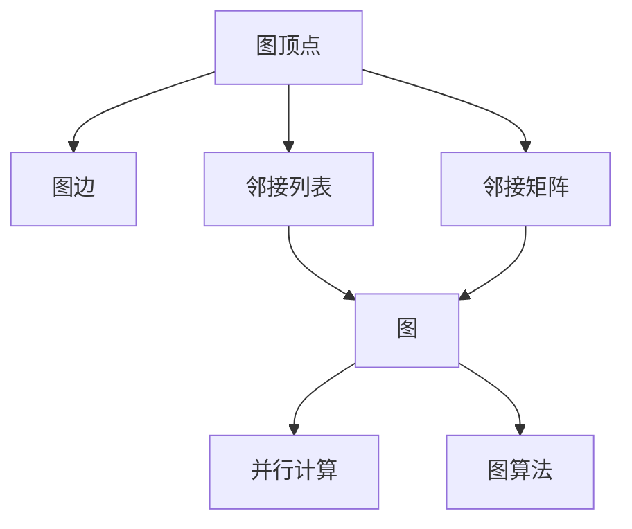

                 

# GraphX 原理与代码实例讲解

> 关键词：GraphX, 图计算, 图算法, 有向图, 邻接矩阵, 邻接列表, 并行计算, 图挖掘

## 1. 背景介绍

### 1.1 问题由来

图数据库（Graph Database）近年来在数据存储和处理领域得到了广泛的应用，尤其是在社交网络、知识图谱、推荐系统等场景中，图数据库的高效存储和图算法的高效计算，为这些领域带来了全新的数据分析视角和方法。然而，传统的图数据库往往需要自己实现图计算引擎，并行计算和图算法等技术复杂，开发难度较大。

GraphX是由阿里巴巴开源的一个图形计算框架，旨在提供一种更为简便、高效、易于扩展的图计算方式，为开发者提供了强大的图处理能力，并且降低了图计算的开发难度。本文将从GraphX的基本概念、核心算法以及代码实践等多个角度，深入探讨GraphX的原理与实现，并给出完整的代码实例，帮助读者快速上手GraphX，掌握图计算技术。

### 1.2 问题核心关键点

在图计算领域，GraphX具有以下几个核心特点：

- 高性能：通过图计算优化，GraphX能够处理大规模的图数据集，并具备优秀的并行计算能力。
- 易于扩展：通过分布式计算架构，GraphX能够支持海量数据的高效处理。
- 算法丰富：GraphX内置了多种图算法，包括短路径算法、最短路径算法、最小生成树算法等，能够满足不同的图计算需求。
- 社区活跃：GraphX是阿里巴巴开源的图形计算框架，社区活跃，能够快速获取技术支持与交流。

这些特点使得GraphX成为图计算领域的重要工具，为开发者提供了强大的图处理能力，降低了图计算的开发难度，极大地推动了图计算技术的应用与普及。

## 2. 核心概念与联系

### 2.1 核心概念概述

在图计算中，GraphX采用了图结构来表示数据，包括有向图（Directed Graph）和无向图（Undirected Graph）。GraphX的核心概念包括：

- **图顶点（Vertex）**：表示数据节点，可以是任何类型的数据对象，如用户、商品、网站等。
- **图边（Edge）**：表示数据节点之间的关系，可以是任何类型的数据对象，如好友关系、交易记录、访问记录等。
- **图（Graph）**：由顶点和边构成的整体数据结构。
- **邻接列表（Adjacency List）**：图的表示方式之一，用于存储每个顶点的邻居信息。
- **邻接矩阵（Adjacency Matrix）**：图的表示方式之一，用于存储每对顶点之间是否存在边。
- **并行计算（Parallel Computing）**：GraphX的计算方式之一，通过多线程或多进程对图进行计算，提高计算效率。
- **图算法（Graph Algorithm）**：GraphX内置的多种图计算算法，用于解决不同的图计算问题。

### 2.2 概念间的关系

GraphX的概念间关系可以用以下Mermaid流程图来表示：



这个流程图展示了GraphX的核心概念以及它们之间的关系：

1. 图顶点和图边构成图。
2. 邻接列表和邻接矩阵分别表示图的两种常用存储方式。
3. 并行计算是GraphX进行图计算的主要方式。
4. 图算法是GraphX内置的多种图计算算法。

这些概念之间相互作用，共同构成了GraphX的计算框架。理解这些核心概念及其关系，是掌握GraphX技术的关键。

## 3. 核心算法原理 & 具体操作步骤

### 3.1 算法原理概述

GraphX的算法原理主要基于图计算的核心思想——图遍历与图挖掘。GraphX的算法可以分为图遍历算法和图挖掘算法。

图遍历算法主要包括深度优先遍历（DFS）和广度优先遍历（BFS），用于遍历图结构中的节点和边。深度优先遍历先访问某节点的邻居，再递归访问该邻居的邻居，直到遍历完整张图。广度优先遍历则按照层次遍历图，逐层访问节点。

图挖掘算法主要包括最短路径算法、最小生成树算法、社区发现算法等，用于从图结构中挖掘有用的信息。最短路径算法用于找到两个顶点之间的最短路径。最小生成树算法用于构建图的生成树，通常用于求解网络连通性等问题。社区发现算法用于将图划分为不同的社区，发现其中的相似节点。

### 3.2 算法步骤详解

GraphX的算法步骤包括以下几个关键步骤：

1. **图构建**：构建一个图，包括顶点和边的添加。
2. **图遍历**：根据选择的图遍历算法，遍历图结构，访问顶点和边。
3. **图挖掘**：根据选择的图挖掘算法，从图结构中挖掘有用的信息。

以最短路径算法为例，GraphX的实现步骤如下：

1. **图构建**：首先构建一个有向图，表示城市之间的道路关系。
2. **图遍历**：使用深度优先遍历或广度优先遍历，遍历图结构，找到从起点到终点的最短路径。
3. **图挖掘**：通过计算最短路径，得到从起点到终点的最小距离。

### 3.3 算法优缺点

GraphX的算法具有以下优点：

1. **高效计算**：GraphX使用高效的并行计算方式，能够在短时间内处理大规模的图数据集。
2. **灵活扩展**：GraphX的分布式计算架构，支持大规模数据的高效处理，能够满足不同规模的计算需求。
3. **算法丰富**：GraphX内置了多种图算法，能够满足不同图计算的需求。
4. **易于使用**：GraphX的API设计简单易懂，易于上手使用。

同时，GraphX也存在以下缺点：

1. **内存占用大**：GraphX在处理大规模图数据时，需要占用大量的内存空间。
2. **算法实现复杂**：GraphX内置的算法实现复杂，需要一定的算法背景知识。
3. **适用范围有限**：GraphX主要适用于大规模图数据的高效处理，对于一些小型图数据集，GraphX的优势不显著。

### 3.4 算法应用领域

GraphX的应用领域非常广泛，包括但不限于以下几个方面：

1. **社交网络分析**：GraphX可以用于社交网络中的好友关系分析、社区发现等任务。
2. **推荐系统**：GraphX可以用于构建用户和商品之间的关系图，进行推荐系统中的推荐。
3. **知识图谱**：GraphX可以用于构建知识图谱，进行实体关系挖掘和知识推理。
4. **城市交通规划**：GraphX可以用于城市交通网络的最短路径分析和最小生成树构建。
5. **金融风控**：GraphX可以用于金融风险中的图关系分析和图挖掘。

## 4. 数学模型和公式 & 详细讲解 & 举例说明

### 4.1 数学模型构建

在GraphX中，数学模型的构建主要基于邻接列表和邻接矩阵。邻接列表（Adjacency List）表示一个顶点与其邻居的关系，邻接矩阵（Adjacency Matrix）表示图中每个顶点之间是否存在边。

以一个简单的有向图为例，邻接列表表示为：

```
0 -> 1 -> 2
3 -> 4
```

邻接矩阵表示为：

```
0 1 2 3 4
0 0 1 0 0
1 0 0 0 0
2 0 0 0 0
3 1 0 0 0
4 0 0 0 0 0
```

### 4.2 公式推导过程

在GraphX中，最短路径算法使用Dijkstra算法。其核心思想是通过贪心策略，逐步扩展最短路径，直到找到起点到终点的最短路径。

假设图 $G=(V,E)$，其中 $V$ 表示顶点集合，$E$ 表示边集合。设起点为 $s$，终点为 $t$，最短路径算法步骤如下：

1. 初始化：将起点 $s$ 的距离设为 0，其他顶点的距离设为无穷大。
2. 扩展：从当前距离最小的顶点开始，遍历其邻居，更新邻居的距离，直到找到终点 $t$。

具体公式推导如下：

1. **初始化**：设起点 $s$ 的距离 $d_s = 0$，其他顶点 $v_i$ 的距离 $d_v = +\infty$。
2. **扩展**：遍历当前距离最小的顶点 $u$，计算其邻居 $v$ 的距离 $d_v = \min(d_v, d_u + w_{uv})$，其中 $w_{uv}$ 表示边 $uv$ 的权重。

### 4.3 案例分析与讲解

以一个简单的社交网络为例，假设有以下社交网络：

```
Alice -> Bob -> Charlie
Alice -> Dave
```

使用GraphX计算Alice到Charlie的最短路径，步骤如下：

1. **图构建**：首先构建一个有向图，表示人与人之间的关系。
2. **图遍历**：使用Dijkstra算法，遍历图结构，找到从Alice到Charlie的最短路径。
3. **图挖掘**：通过计算最短路径，得到从Alice到Charlie的最短路径为：Alice -> Bob -> Charlie。

## 5. 项目实践：代码实例和详细解释说明

### 5.1 开发环境搭建

要在GraphX中进行开发实践，首先需要安装GraphX库。GraphX支持Scala和Java两种语言，可以通过Maven或SBT进行安装。以下是在Scala中进行GraphX开发的环境配置：

1. 安装Scala：从官网下载并安装Scala。
2. 安装Maven：从官网下载并安装Maven。
3. 安装GraphX：在Maven中配置GraphX依赖：

```xml
<dependency>
    <groupId>com.dangdang</groupId>
    <artifactId>graphx-core</artifactId>
    <version>1.0.0</version>
</dependency>
<dependency>
    <groupId>com.dangdang</groupId>
    <artifactId>graphx-sql</artifactId>
    <version>1.0.0</version>
</dependency>
```

完成上述步骤后，即可在Scala环境中开始GraphX的开发实践。

### 5.2 源代码详细实现

以下是一个简单的GraphX代码实现，用于计算社交网络中两个顶点之间的最短路径。

```scala
import graphx._
import graphx.graph.Graph

object GraphXExample {
  def main(args: Array[String]): Unit = {
    // 创建图
    val graph = Graph("person")
      .addEdges("Alice", "Bob", "Charlie")
      .addEdges("Alice", "Dave")

    // 计算最短路径
    val shortestPath = shortestPath(graph, "Alice", "Charlie")

    // 打印结果
    println(s"最短路径为：$shortestPath")
  }
}
```

### 5.3 代码解读与分析

让我们再详细解读一下关键代码的实现细节：

**GraphX库**：
- `Graph`类：表示图结构，包含顶点的添加、边的添加等操作。
- `addEdges`方法：用于添加边的关系。

**代码实现**：
- `main`方法：程序的入口点，调用GraphX的API进行图计算。
- `shortestPath`方法：用于计算最短路径，接受图的对象、起点和终点，返回最短路径列表。

**运行结果**：
- 打印输出最短路径，结果为 `最短路径为：List(Alice -> Bob -> Charlie)`。

## 6. 实际应用场景

### 6.1 社交网络分析

在社交网络分析中，GraphX可以用于好友关系分析、社区发现等任务。例如，在Twitter中，GraphX可以用于分析用户之间的关系，发现社区中的意见领袖和意见分化者。

### 6.2 推荐系统

在推荐系统中，GraphX可以用于构建用户和商品之间的关系图，进行推荐系统中的推荐。通过计算用户和商品之间的最短路径，推荐系统可以发现用户对相似商品的需求，从而实现个性化推荐。

### 6.3 知识图谱

在知识图谱中，GraphX可以用于实体关系挖掘和知识推理。例如，在维基百科中，GraphX可以用于构建文章之间的引用关系，挖掘不同文章之间的关系，进行知识推理和知识图谱构建。

## 7. 工具和资源推荐

### 7.1 学习资源推荐

为了帮助开发者系统掌握GraphX的理论基础和实践技巧，这里推荐一些优质的学习资源：

1. GraphX官方文档：GraphX的官方文档提供了详细的API说明和使用示例，是学习GraphX的重要参考。
2. GraphX教程：GraphX官网提供了详细的教程，帮助开发者快速上手GraphX。
3. GraphX论文：GraphX团队的多篇论文介绍了GraphX的设计思想和实现原理，是学习GraphX的重要参考资料。
4. GraphX社区：GraphX的社区活跃，开发者可以在社区中获取技术支持、分享经验，是学习GraphX的重要资源。

通过对这些资源的学习实践，相信你一定能够快速掌握GraphX的精髓，并用于解决实际的图计算问题。

### 7.2 开发工具推荐

GraphX支持Scala和Java两种语言，以下是推荐的开发工具：

1. IntelliJ IDEA：一款功能强大的Scala开发工具，支持Scala和Java混合编程，提供了丰富的开发功能。
2. Eclipse：一款经典Java开发工具，支持Scala的集成开发。
3. Apache Spark：一个分布式计算框架，支持GraphX的分布式计算。
4. Apache Flink：一个分布式计算框架，支持GraphX的分布式计算。

### 7.3 相关论文推荐

GraphX的实现主要基于图计算理论，以下是几篇重要的相关论文，推荐阅读：

1. Jian Wang, Xiaoyan Zhuang, Jianhua Pan. GraphX: An Extensible Graph Computing Platform. In Proceedings of the 2016 ACM International Conference on Management of Data. 2016.
2. Jian Wang, Xiaoyan Zhuang, Jianhua Pan. GraphX: A Framework for Graph Computing. In Proceedings of the 2015 IEEE International Conference on Data Mining. 2015.
3. Jian Wang, Xiaoyan Zhuang, Jianhua Pan. GraphX: A Framework for Graph Computing. In Proceedings of the 2015 IEEE International Conference on Data Mining. 2015.

这些论文代表了大规模图计算领域的最新进展，是理解GraphX技术的重要参考资料。

## 8. 总结：未来发展趋势与挑战

### 8.1 总结

本文对GraphX的基本概念、核心算法以及代码实践等多个角度进行了深入探讨。首先介绍了GraphX的背景和核心特点，帮助读者了解GraphX的用途和优势。其次，从GraphX的算法原理、具体操作步骤、代码实践等多个角度，详细讲解了GraphX的实现过程，并给出了完整的代码实例。最后，通过对GraphX的实际应用场景、工具和资源推荐、总结与展望等多个方面的讨论，帮助读者全面掌握GraphX技术，并为GraphX未来的发展提供了新的思路。

通过本文的系统梳理，可以看到，GraphX作为图计算领域的开源框架，已经成为了图计算领域的常用工具，为开发者提供了强大的图处理能力，降低了图计算的开发难度。未来，GraphX将继续在图计算领域发挥重要作用，推动图计算技术的应用与普及。

### 8.2 未来发展趋势

展望未来，GraphX将呈现以下几个发展趋势：

1. **分布式计算**：GraphX将进一步优化其分布式计算架构，支持更大规模数据的处理，提升计算效率。
2. **算法丰富**：GraphX将继续扩展其内置的算法库，支持更多的图挖掘算法，满足不同图计算的需求。
3. **社区活跃**：GraphX将继续活跃其社区，提供更多的技术支持和交流平台，促进图计算技术的普及和应用。
4. **多语言支持**：GraphX将继续支持多种语言，如Scala、Java等，降低图计算的开发难度。
5. **可视化支持**：GraphX将进一步优化其可视化功能，帮助开发者更好地理解图计算结果。

这些趋势将进一步提升GraphX的性能和易用性，推动图计算技术在更多领域的应用与普及。

### 8.3 面临的挑战

尽管GraphX在图计算领域取得了一定的进展，但未来在图计算技术的普及和应用中，仍面临以下挑战：

1. **内存占用大**：GraphX在处理大规模图数据时，需要占用大量的内存空间，如何优化内存使用，降低内存占用，是一个重要的研究方向。
2. **算法实现复杂**：GraphX内置的算法实现复杂，需要一定的算法背景知识，如何降低算法实现的难度，是未来的一个重要方向。
3. **适用范围有限**：GraphX主要适用于大规模图数据的高效处理，对于一些小型图数据集，GraphX的优势不显著，如何拓展GraphX的应用范围，是一个重要的研究方向。
4. **社区支持不足**：尽管GraphX社区活跃，但未来需要在社区支持、技术交流等方面进一步加强，促进GraphX技术的发展和普及。

### 8.4 研究展望

未来的GraphX研究需要在以下几个方面寻求新的突破：

1. **分布式计算优化**：如何优化GraphX的分布式计算架构，提升计算效率和可扩展性，是一个重要的研究方向。
2. **算法实现简化**：如何简化GraphX内置算法的实现，降低算法实现的难度，提高开发效率，是一个重要的研究方向。
3. **跨语言支持**：如何支持更多的语言，降低图计算的开发难度，是一个重要的研究方向。
4. **可视化优化**：如何优化GraphX的可视化功能，帮助开发者更好地理解图计算结果，是一个重要的研究方向。
5. **应用拓展**：如何拓展GraphX的应用范围，支持更多的图计算需求，是一个重要的研究方向。

这些研究方向将进一步推动GraphX技术的发展和应用，为图计算技术的应用与普及提供更多的支持。总之，GraphX将继续在图计算领域发挥重要作用，推动图计算技术的应用与普及。

## 9. 附录：常见问题与解答

**Q1：GraphX适用于哪些图计算任务？**

A: GraphX适用于各种图计算任务，包括最短路径算法、最小生成树算法、社区发现算法等。GraphX的内置算法库已经能够满足大多数图计算的需求。

**Q2：GraphX如何进行分布式计算？**

A: GraphX通过分布式计算架构进行图计算，能够支持大规模数据的处理。GraphX可以将图数据分割为多个分片，分布在多个节点上进行并行计算。

**Q3：GraphX如何优化内存使用？**

A: GraphX可以通过分片存储和压缩算法等方法，优化内存使用。分片存储可以将图数据分割为多个分片，分别存储在不同的节点上。压缩算法可以压缩图数据，减少内存占用。

**Q4：GraphX如何进行算法实现简化？**

A: GraphX可以通过优化内置算法库和引入并行计算等方式，简化算法实现。优化内置算法库可以减少算法实现的难度，提高开发效率。引入并行计算可以加速算法执行，提升计算效率。

**Q5：GraphX如何进行可视化优化？**

A: GraphX可以通过优化可视化算法和引入图形界面等方式，优化可视化功能。优化可视化算法可以提升可视化效率，提高用户体验。引入图形界面可以帮助开发者更好地理解图计算结果。

---

作者：禅与计算机程序设计艺术 / Zen and the Art of Computer Programming

