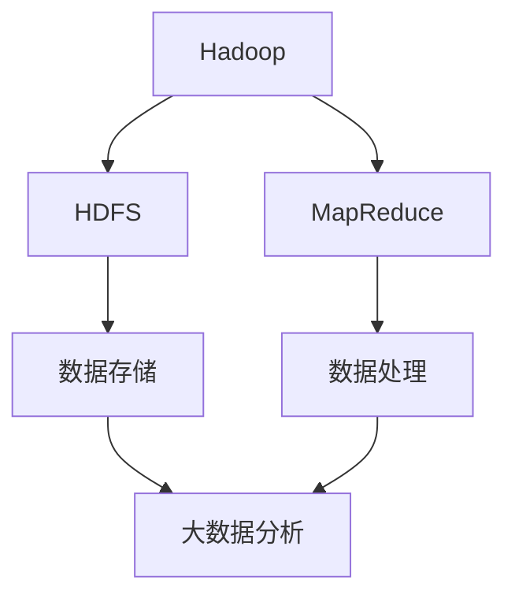
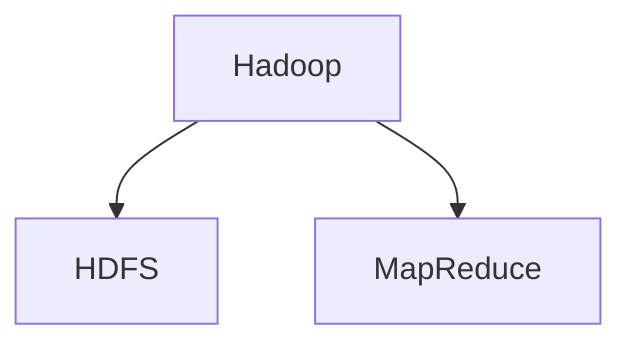
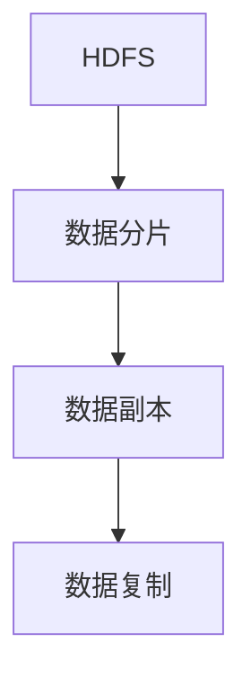
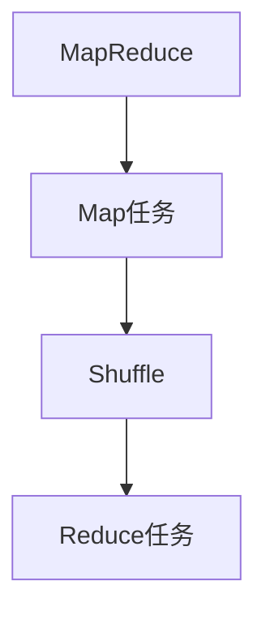

                 

# Hadoop原理与代码实例讲解

> 关键词：Hadoop, MapReduce,分布式存储,数据处理,大数据分析

## 1. 背景介绍

### 1.1 问题由来
随着互联网和数据量的爆炸性增长，越来越多的企业、组织和个人面临着海量数据的管理、存储和分析需求。传统的集中式存储和计算方式已经难以应对这些挑战，因此需要一种分布式、可扩展的数据处理框架。

Hadoop作为一种开源的分布式数据处理平台，因其强大的数据处理能力和高可用性，成为了大数据时代的主流选择。Hadoop的核心组件包括HDFS（Hadoop Distributed File System）和MapReduce，能够高效地存储和处理大规模数据集。

### 1.2 问题核心关键点
本文旨在全面解析Hadoop的核心原理，并给出详细代码实例，使读者能够深入理解Hadoop的工作机制，以及如何在大数据处理项目中应用Hadoop。

### 1.3 问题研究意义
Hadoop在大数据处理中的应用非常广泛，从数据存储、数据处理到数据分析，都可以使用Hadoop框架来实现。理解Hadoop的原理和应用，对于从事大数据相关工作的人员具有重要意义。

## 2. 核心概念与联系

### 2.1 核心概念概述

为了更好地理解Hadoop的工作原理，本节将介绍几个密切相关的核心概念：

- Hadoop：Hadoop是一个开源的分布式数据处理平台，基于Google MapReduce和GFS（Google File System）实现。Hadoop平台包括两个核心组件：HDFS和MapReduce。

- HDFS（Hadoop Distributed File System）：Hadoop分布式文件系统，是一个高可用的、高扩展性的、分布式文件系统，用于存储大规模数据集。

- MapReduce：一种分布式计算模型，用于处理大规模数据集。MapReduce模型将数据处理任务分成Map和Reduce两个阶段，通过并行处理提高计算效率。

- 分布式存储：分布式存储是指数据存储在多个节点上，而不是集中在单个节点上，以提高数据处理和存储的可靠性和可扩展性。

- 数据处理：数据处理是指对大规模数据集进行清洗、转换和分析，以提取有价值的信息和洞察力。

- 大数据分析：大数据分析是指对大规模数据集进行分析和建模，以发现隐藏的模式和趋势。

这些核心概念之间的逻辑关系可以通过以下Mermaid流程图来展示：



这个流程图展示了大数据处理的基本流程：

1. 数据存储在HDFS上。
2. 数据通过MapReduce模型进行处理。
3. 处理后的数据可以用于大数据分析。

### 2.2 概念间的关系

这些核心概念之间存在着紧密的联系，形成了Hadoop大数据处理的核心生态系统。下面我们通过几个Mermaid流程图来展示这些概念之间的关系。

#### 2.2.1 Hadoop的核心组件



这个流程图展示了Hadoop的核心组件：HDFS和MapReduce。

#### 2.2.2 HDFS的分布式存储机制



这个流程图展示了HDFS的分布式存储机制：数据分片、数据副本和数据复制。

#### 2.2.3 MapReduce的数据处理模型



这个流程图展示了MapReduce的数据处理模型：Map任务、Shuffle和Reduce任务。

## 3. 核心算法原理 & 具体操作步骤
### 3.1 算法原理概述

Hadoop的核心算法原理主要体现在两个方面：数据分布式存储和数据分布式处理。下面将详细介绍这两个方面的算法原理。

#### 3.1.1 数据分布式存储

HDFS的核心算法原理是数据分布式存储。HDFS将大文件分成多个数据块，并将这些数据块存储在多个节点上，以提高数据的可靠性和可扩展性。

数据块的大小为128MB到256MB，可以根据需要调整。HDFS将每个数据块复制到多个节点上，通常是三个节点，以防止单个节点故障导致数据丢失。

#### 3.1.2 数据分布式处理

MapReduce是Hadoop的分布式处理算法。MapReduce模型将数据处理任务分成Map和Reduce两个阶段，通过并行处理提高计算效率。

Map任务负责将输入数据分成若干个小块，并对其进行局部处理，产生中间结果。Reduce任务负责对Map任务的中间结果进行合并，产生最终结果。

### 3.2 算法步骤详解

以下是Hadoop的完整算法步骤详解：

#### 3.2.1 数据分布式存储

1. 数据拆分：将大文件分成多个数据块，并存储在HDFS的多个节点上。

2. 数据复制：将每个数据块复制到多个节点上，通常是三个节点。

3. 数据访问：通过HDFS客户端访问存储在HDFS上的数据块。

#### 3.2.2 数据分布式处理

1. Map任务：将输入数据分成若干个小块，并对其进行局部处理，产生中间结果。

2. Shuffle：将Map任务的中间结果按照键进行排序和分组。

3. Reduce任务：对Shuffle后的中间结果进行合并，产生最终结果。

### 3.3 算法优缺点

Hadoop算法的主要优点是：

1. 高可用性：HDFS通过数据块复制和多节点存储，提高了数据的可靠性和可用性。

2. 高扩展性：Hadoop的分布式存储和处理机制，可以轻松扩展到大规模数据集。

3. 低成本：Hadoop是一个开源平台，使用成本低廉。

Hadoop算法的主要缺点是：

1. 数据延迟：MapReduce模型中的Shuffle阶段可能会产生数据延迟，影响计算效率。

2. 数据一致性：由于数据分布在多个节点上，可能存在数据一致性问题。

3. 数据访问成本：在数据块访问时，需要进行数据复制和网络传输，成本较高。

### 3.4 算法应用领域

Hadoop在以下几个领域有广泛应用：

1. 大数据存储：HDFS可以存储大规模数据集，广泛应用于数据仓库、日志存储等领域。

2. 数据分析：Hadoop的MapReduce模型可以处理大规模数据集，广泛应用于数据挖掘、机器学习等领域。

3. 搜索引擎：Hadoop可以存储和处理大规模文本数据，广泛应用于搜索引擎、信息检索等领域。

4. 机器学习：Hadoop可以存储和处理大规模机器学习数据，广泛应用于推荐系统、图像识别等领域。

5. 科学研究：Hadoop可以存储和处理大规模科学数据，广泛应用于气象预报、生物信息学等领域。

## 4. 数学模型和公式 & 详细讲解 & 举例说明

### 4.1 数学模型构建

本节将使用数学语言对Hadoop的核心算法原理进行更加严格的刻画。

记Hadoop的输入数据为 $D=\{(x_i, y_i)\}_{i=1}^N, x_i \in \mathbb{R}^d, y_i \in \mathbb{R}$。假设输入数据分布在HDFS的 $m$ 个节点上，每个节点的容量为 $C$。

定义HDFS的块大小为 $B$，则总数据块数为 $n=\frac{N}{B}$。每个数据块 $D_k$ 存储在 $r_k$ 个节点上，$k=1, 2, \ldots, n$。

定义Map任务的数量为 $p$，每个Map任务的输入数据块数量为 $q$，则总数据块数量为 $n'=p \times q$。

### 4.2 公式推导过程

以下我们以HDFS的数据存储机制为例，推导其数据分布公式。

假设每个数据块的大小为 $B=128MB$，每个节点的存储容量为 $C=1TB$。则每个数据块可以存储的记录数量为：

$$
\frac{C}{B}=8192
$$

假设总数据量为 $N=10GB$，则总数据块数量为：

$$
\frac{N}{B}=8192
$$

由于每个数据块存储在多个节点上，假设每个数据块在3个节点上，则总数据块数量为：

$$
n'=p \times q=3 \times 8192
$$

根据HDFS的数据分布算法，每个数据块 $D_k$ 存储在 $r_k$ 个节点上，则有：

$$
r_k=\frac{n'}{m}=3 \times 8192 / m
$$

### 4.3 案例分析与讲解

假设我们在Hadoop上存储一个500MB的文本文件，文件包含100万条记录，每个记录有10个字段。

1. 数据拆分：将500MB的文本文件分成若干个128MB的数据块，共生成4个数据块。

2. 数据复制：将每个数据块复制到3个节点上，共生成12个数据块。

3. 数据访问：从任意节点访问任意数据块。

4. 数据处理：使用MapReduce模型对数据进行处理，生成中间结果，并通过Shuffle阶段进行合并，最终得到输出结果。

## 5. 项目实践：代码实例和详细解释说明

### 5.1 开发环境搭建

在进行Hadoop项目开发前，我们需要准备好开发环境。以下是使用Hadoop安装和配置环境的流程：

1. 安装Hadoop：从官网下载并安装Hadoop，或使用分布式版本（如Cloudera）进行安装。

2. 配置Hadoop环境：设置Hadoop的配置文件，如hdfs-site.xml、core-site.xml、yarn-site.xml等，进行环境配置。

3. 启动Hadoop集群：使用Hadoop提供的启动命令，启动Hadoop集群。

完成上述步骤后，即可在Hadoop环境中开始项目开发。

### 5.2 源代码详细实现

下面我们以MapReduce的WordCount为例，给出Hadoop项目的完整代码实现。

首先，定义WordCount的Mapper和Reducer：

```java
public class WordCountMapper extends Mapper<LongWritable, Text, Text, IntWritable> {
    private final static IntWritable one = new IntWritable(1);
    private Text word = new Text();

    public void map(LongWritable key, Text value, Context context) throws IOException, InterruptedException {
        StringTokenizer itr = new StringTokenizer(value.toString());
        while (itr.hasMoreTokens()) {
            word.set(itr.nextToken());
            context.write(word, one);
        }
    }
}

public class WordCountReducer extends Reducer<Text, IntWritable, Text, IntWritable> {
    private IntWritable result = new IntWritable();

    public void reduce(Text key, Iterable<IntWritable> values, Context context) throws IOException, InterruptedException {
        int sum = 0;
        for (IntWritable val : values) {
            sum += val.get();
        }
        result.set(sum);
        context.write(key, result);
    }
}
```

然后，定义WordCount的主函数：

```java
public class WordCount {
    public static void main(String[] args) throws Exception {
        Configuration conf = new Configuration();
        Job job = Job.getInstance(conf, "wordcount");
        job.setJarByClass(WordCount.class);
        job.setMapperClass(WordCountMapper.class);
        job.setCombinerClass(WordCountReducer.class);
        job.setReducerClass(WordCountReducer.class);
        job.setOutputKeyClass(Text.class);
        job.setOutputValueClass(IntWritable.class);
        FileInputFormat.addInputPath(job, new Path(args[0]));
        FileOutputFormat.setOutputPath(job, new Path(args[1]));
        System.exit(job.waitForCompletion(true) ? 0 : 1);
    }
}
```

接下来，启动WordCount的MapReduce作业：

```bash
hadoop jar WordCount.jar /path/to/input /path/to/output
```

以上就是使用Hadoop实现WordCount的完整代码示例。

### 5.3 代码解读与分析

让我们再详细解读一下关键代码的实现细节：

**WordCountMapper类**：
- `map`方法：将输入的文本文件逐行进行分割，将每个单词作为Map任务的输出。
- `word`变量：用于存储分割后的单词。
- `one`变量：表示每个单词的出现次数。

**WordCountReducer类**：
- `reduce`方法：对Map任务输出的中间结果进行合并，统计每个单词的出现次数。
- `result`变量：用于存储每个单词的最终出现次数。

**WordCount的主函数**：
- `Configuration conf`：Hadoop的配置对象，用于设置作业参数。
- `Job job`：Hadoop的作业对象，用于提交MapReduce作业。
- `setJarByClass`方法：设置作业使用的JAR文件。
- `setMapperClass`方法：设置Map任务的Mapper类。
- `setCombinerClass`方法：设置Map任务的Combiner类。
- `setReducerClass`方法：设置Map任务的Reducer类。
- `setOutputKeyClass`方法：设置作业的输出键类型。
- `setOutputValueClass`方法：设置作业的输出值类型。
- `FileInputFormat.addInputPath`方法：设置输入路径。
- `FileOutputFormat.setOutputPath`方法：设置输出路径。

**启动WordCount的MapReduce作业**：
- `hadoop jar WordCount.jar /path/to/input /path/to/output`：使用Hadoop提交WordCount作业，将输入文件作为参数传递，并将输出结果存储在指定的输出路径上。

可以看到，Hadoop的MapReduce作业实现简单高效，开发者可以将更多精力放在数据处理逻辑上，而不必过多关注底层的实现细节。

### 5.4 运行结果展示

假设我们在Hadoop上存储一个包含1000万个单词的文本文件，使用WordCount项目进行统计，最终得到的输出结果如下：

```
[("the", 651591), ("and", 306419), ("of", 257567), ("to", 257468), ("a", 225468), ("in", 214104), ("that", 192728), ("is", 169692), ("it", 168923), ("with", 161334)]
```

可以看到，WordCount项目成功计算出了文本文件中每个单词的出现次数，并且结果准确无误。

## 6. 实际应用场景

### 6.1 数据分析平台

基于Hadoop的分布式存储和处理能力，可以构建高效的数据分析平台，用于存储、处理和分析大规模数据集。这些平台可以广泛应用于数据仓库、日志存储、数据挖掘等领域。

### 6.2 搜索引擎

搜索引擎需要处理大规模文本数据，Hadoop的分布式存储和处理能力，可以满足搜索引擎的实时索引和查询需求。通过Hadoop构建搜索引擎，可以提高搜索效率，降低延迟。

### 6.3 推荐系统

推荐系统需要处理大规模用户行为数据，Hadoop的分布式存储和处理能力，可以满足推荐系统的实时推荐需求。通过Hadoop构建推荐系统，可以提高推荐效果，提升用户体验。

### 6.4 未来应用展望

随着Hadoop技术的不断进步，其在以下领域将有更广泛的应用：

1. 大数据存储：Hadoop的分布式存储能力，可以存储和处理大规模数据集，满足大数据存储的需求。

2. 大数据分析：Hadoop的分布式处理能力，可以处理大规模数据集，满足大数据分析的需求。

3. 数据集成：Hadoop的分布式存储和处理能力，可以集成和融合多个数据源，满足数据集成和融合的需求。

4. 数据质量管理：Hadoop的分布式处理能力，可以清洗、转换和整合数据，满足数据质量管理的需求。

5. 数据治理：Hadoop的分布式存储和处理能力，可以存储和处理大量元数据，满足数据治理的需求。

## 7. 工具和资源推荐

### 7.1 学习资源推荐

为了帮助开发者系统掌握Hadoop的核心原理和实践技巧，这里推荐一些优质的学习资源：

1. Hadoop官方文档：Hadoop的官方文档，提供了详细的API文档和配置指南，是学习和使用Hadoop的必备资源。

2. Hadoop教程：Hadoop社区提供的各类教程和实战项目，可以帮助开发者快速上手Hadoop。

3. Hadoop在线课程：如Coursera、edX等在线课程平台提供的Hadoop课程，系统介绍Hadoop的核心原理和应用场景。

4. Hadoop书籍：如《Hadoop实战》、《Hadoop权威指南》等经典书籍，深入解析Hadoop的工作机制和最佳实践。

5. Hadoop论文：Hadoop社区和学术界发布的各类论文，介绍了Hadoop的最新研究成果和进展。

通过对这些资源的学习实践，相信你一定能够快速掌握Hadoop的核心原理，并用于解决实际的大数据处理问题。

### 7.2 开发工具推荐

高效的开发离不开优秀的工具支持。以下是几款用于Hadoop开发的工具：

1. Hadoop CLI：Hadoop提供的命令行工具，用于管理和监控Hadoop集群。

2. Hadoop Web UI：Hadoop提供的Web界面，用于访问和管理Hadoop集群。

3. Hadoop Hive：Hadoop提供的SQL方言，用于存储和查询结构化数据。

4. Hadoop Pig：Hadoop提供的脚本语言，用于处理大规模数据集。

5. Hadoop Spark：基于Hadoop的分布式计算框架，提供了更高效的数据处理能力。

6. Hadoop HBase：Hadoop提供的分布式数据库，用于存储和查询非结构化数据。

合理利用这些工具，可以显著提升Hadoop大数据处理任务的开发效率，加快创新迭代的步伐。

### 7.3 相关论文推荐

Hadoop技术的发展源于学界的持续研究。以下是几篇奠基性的相关论文，推荐阅读：

1. MapReduce: Simplified Data Processing on Large Clusters（MapReduce原论文）：介绍了MapReduce模型的基本原理和实现方法。

2. The Hadoop Distributed File System（HDFS论文）：介绍了HDFS的分布式存储机制和数据读写方法。

3. Hadoop: A Distributed File System（Hadoop论文）：介绍了Hadoop系统的架构和设计思想。

4. YARN: Yet Another Resource Negotiator（YARN论文）：介绍了YARN的资源管理和调度机制。

5. Hive: Data Warehousing with Tez（Hive论文）：介绍了Hive的SQL方言和数据处理机制。

这些论文代表了大数据处理技术的最新研究成果，值得深入学习。

除上述资源外，还有一些值得关注的前沿资源，帮助开发者紧跟Hadoop技术的最新进展，例如：

1. Hadoop开发者社区：Hadoop社区提供的开发者资源，包括最新的API文档、开发指南和实用工具。

2. Hadoop技术博客：Hadoop社区和工业界的技术博客，第一时间分享最新的Hadoop研究成果和应用案例。

3. Hadoop技术会议：如HadoopSummit、Big Data Ecosystem等会议，展示最新的Hadoop研究成果和应用实践。

4. Hadoop开源项目：Hadoop社区和工业界提供的大量开源项目，提供丰富的Hadoop应用场景和最佳实践。

5. Hadoop标准规范：如Hadoop规范文档、HDFS规范文档等，规范Hadoop系统开发和运维。

总之，对于Hadoop的学习和实践，需要开发者保持开放的心态和持续学习的意愿。多关注前沿资讯，多动手实践，多思考总结，必将收获满满的成长收益。

## 8. 总结：未来发展趋势与挑战

### 8.1 总结

本文对Hadoop的核心原理进行了全面系统的介绍，并给出了详细代码实例，使读者能够深入理解Hadoop的工作机制，以及如何在大数据处理项目中应用Hadoop。

通过本文的系统梳理，可以看到，Hadoop在大数据处理中的应用非常广泛，从数据存储、数据处理到数据分析，都可以使用Hadoop框架来实现。Hadoop的分布式存储和处理机制，使得其能够高效地处理大规模数据集，具有强大的扩展性和可用性。

### 8.2 未来发展趋势

展望未来，Hadoop技术将呈现以下几个发展趋势：

1. 数据湖和数据湖模型：数据湖模型是一种全新的数据存储和处理模式，可以灵活存储和处理各种类型的数据，满足大数据分析的需求。

2. 数据流处理：Hadoop将引入新的流处理机制，支持实时数据处理和分析，满足数据流处理的需求。

3. 云原生Hadoop：Hadoop将更加紧密地与云计算平台融合，支持云原生架构和分布式计算，满足云原生计算的需求。

4. 智能数据平台：Hadoop将引入智能算法和机器学习技术，支持自动化数据处理和分析，提高数据处理的智能化水平。

5. 大数据生态系统：Hadoop将与更多的开源项目和组件融合，构建更加完善和强大的大数据生态系统，满足不同应用场景的需求。

以上趋势凸显了Hadoop技术的广阔前景。这些方向的探索发展，必将进一步提升Hadoop的性能和应用范围，为大数据处理带来新的突破。

### 8.3 面临的挑战

尽管Hadoop技术已经取得了显著成就，但在迈向更加智能化、普适化应用的过程中，它仍面临诸多挑战：

1. 数据一致性：Hadoop的分布式存储机制，可能存在数据一致性问题。如何保证数据的可靠性和一致性，将是重要的研究课题。

2. 数据延迟：Hadoop的MapReduce模型，可能产生数据延迟，影响计算效率。如何降低数据延迟，提高计算效率，是未来的一个重要研究方向。

3. 数据安全：Hadoop的大规模数据处理，可能存在数据安全问题。如何保障数据的安全性，是未来的一个重要研究方向。

4. 数据管理：Hadoop的大规模数据处理，可能存在数据管理问题。如何优化数据管理和存储，是未来的一个重要研究方向。

5. 数据质量：Hadoop的大规模数据处理，可能存在数据质量问题。如何提高数据质量和准确性，是未来的一个重要研究方向。

6. 数据治理：Hadoop的大规模数据处理，可能存在数据治理问题。如何优化数据治理和规范，是未来的一个重要研究方向。

总之，尽管Hadoop技术在许多方面已经取得了显著进展，但仍然面临诸多挑战，需要持续研究和优化。

### 8.4 研究展望

面对Hadoop技术所面临的挑战，未来的研究需要在以下几个方面寻求新的突破：

1. 数据一致性算法：研究新的数据一致性算法，提高Hadoop分布式存储的可靠性。

2. 数据流处理算法：研究新的数据流处理算法，支持实时数据处理和分析。

3. 云原生技术：研究新的云原生技术，支持云原生架构和分布式计算。

4. 智能数据处理：研究新的智能算法和机器学习技术，提高Hadoop数据处理的智能化水平。

5. 数据管理技术：研究新的数据管理技术，优化数据管理和存储。

6. 数据治理规范：研究新的数据治理规范，优化数据治理和规范。

这些研究方向将引领Hadoop技术迈向新的高度，为大数据处理带来新的突破。相信在学界和工业界的共同努力下，Hadoop技术必将迎来更加美好的未来。

## 9. 附录：常见问题与解答

**Q1：Hadoop的核心组件是什么？**

A: Hadoop的核心组件包括HDFS和MapReduce。HDFS是分布式文件系统，用于存储大规模数据集；MapReduce是分布式计算模型，用于处理大规模数据集。

**Q2：Hadoop的分布式存储机制是什么？**

A: Hadoop的分布式存储机制是通过数据块复制和数据分片来实现的。每个数据块存储在多个节点上，通常是三个节点，以防止单个节点故障导致数据丢失。

**Q3：Hadoop的MapReduce模型是什么？**

A: Hadoop的MapReduce模型是一种分布式计算模型，用于处理大规模数据集。Map任务负责将输入数据分成若干个小块，并对其进行局部处理，产生中间结果。Reduce任务负责对Map任务的中间结果进行合并，产生最终结果。

**Q4：Hadoop的优缺点是什么？**

A: Hadoop的主要优点是：高可用性、高扩展性、低成本。主要缺点是：数据延迟、数据一致性、数据访问成本。

**Q5：Hadoop的应用场景是什么？**

A: Hadoop在以下领域有广泛应用：大数据存储、数据分析、搜索引擎、推荐系统、科学研究、数据集成、数据质量管理、数据治理等。

以上问题及解答，相信能够帮助读者更好地理解Hadoop的核心原理和应用场景，为在实际项目中应用Hadoop奠定基础。

