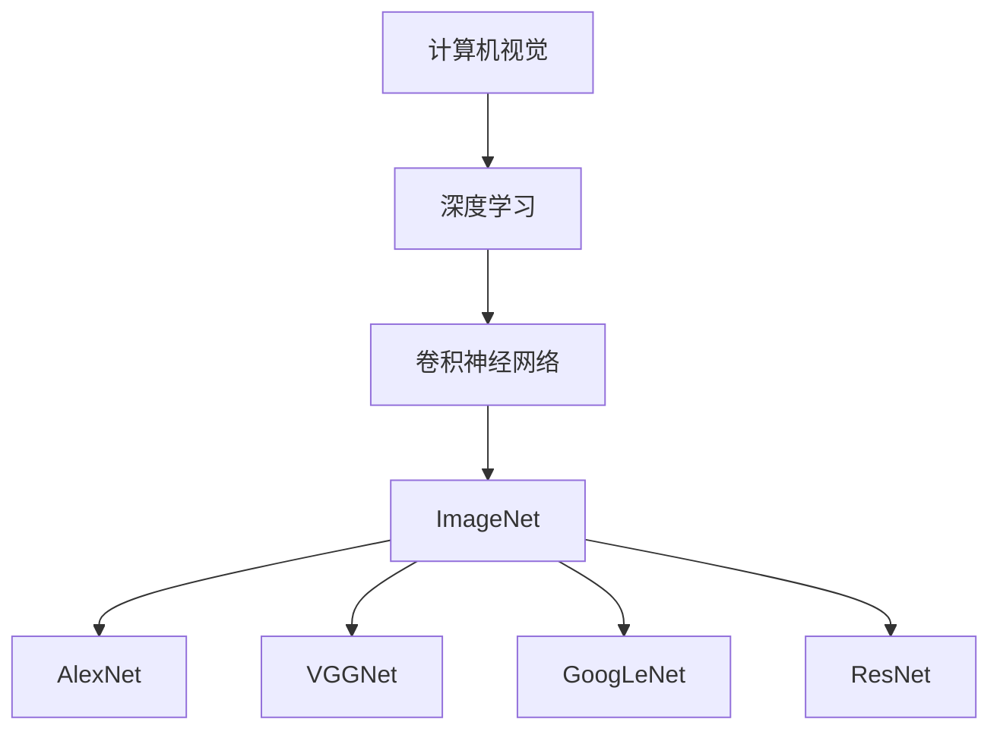
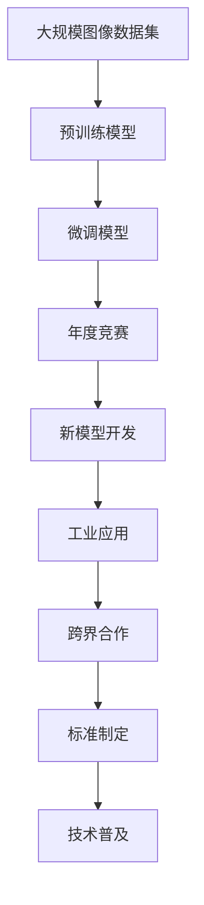

                 

# ImageNet与AI图像识别的历史

> 关键词：ImageNet, 深度学习, 卷积神经网络, 计算机视觉, AlexNet, VGGNet, GoogLeNet, ResNet

## 1. 背景介绍

### 1.1 问题由来
随着人工智能(AI)技术的迅猛发展，计算机视觉(Computer Vision, CV)领域取得了巨大的突破。特别是深度学习技术的崛起，极大地提升了计算机视觉系统在图像识别、目标检测、图像生成等方面的性能。这一过程中，ImageNet竞赛发挥了至关重要的推动作用。

ImageNet由斯坦福大学李飞飞教授领衔的ImageNet团队于2008年启动，旨在收集大规模标注图像数据集，推动计算机视觉研究的进步。它通过定义大规模图像识别竞赛（ImageNet Large Scale Visual Recognition Challenge, ILSVRC），激发了AI领域研究人员的兴趣和投入，使得深度学习技术得以大规模应用和普及。

### 1.2 问题核心关键点
ImageNet竞赛的核心关键点在于：

- 大数据：ImageNet收集了超过100万张标注图片，覆盖了1000个分类标签，为深度学习提供了丰富而高质的训练数据。
- 高标准：比赛要求模型在非常小的数据集上进行测试，评估其泛化能力。
- 算法驱动：深度学习模型的演化推动了图像识别技术的进步，如AlexNet、VGGNet、GoogLeNet、ResNet等。

### 1.3 问题研究意义
ImageNet竞赛和相关研究对于推动计算机视觉技术的发展，具有重要意义：

1. **数据标准**：提供了高标准、高质量的数据集，成为AI领域图像识别任务的标准。
2. **模型驱动**：激发了深度学习模型的开发和优化，推动了CV技术的进步。
3. **算法创新**：促进了更多创新算法的研究和应用，如卷积神经网络（Convolutional Neural Network, CNN）等。
4. **跨界合作**：推动了学术界和工业界的合作，加速了技术落地应用。
5. **产业发展**：提升了计算机视觉技术在工业界的采纳率和应用广度。

## 2. 核心概念与联系

### 2.1 核心概念概述

为更好地理解ImageNet在AI图像识别中的历史作用，本节将介绍几个关键概念：

- **计算机视觉**：涉及对图像、视频等视觉信息的理解和处理，旨在构建能够解释、理解和预测人类视觉系统的机器系统。
- **深度学习**：一种基于神经网络结构的机器学习方法，能够自动提取数据的高级表示。
- **卷积神经网络**：一种特殊的深度学习模型，适用于图像和视频等数据的处理和分析。
- **ImageNet**：世界上最大的标注图像数据库，包含超过1400万张图片，覆盖了21000个分类。
- **AlexNet**：ImageNet 2012年的冠军模型，基于卷积神经网络的结构。
- **VGGNet**：ImageNet 2014年的冠军模型，以深度卷积层著称。
- **GoogLeNet**：ImageNet 2014年的冠军模型，引入了Inception模块，提升了模型的计算效率。
- **ResNet**：ImageNet 2015年的冠军模型，通过残差连接（Residual Connection）解决了深层网络的退化问题。

这些概念之间的逻辑关系可以通过以下Mermaid流程图来展示：



这个流程图展示了计算机视觉、深度学习、卷积神经网络、ImageNet以及具体的模型架构之间的关联关系。ImageNet作为计算机视觉领域的大数据来源，通过推动具体的卷积神经网络模型（如AlexNet、VGGNet、GoogLeNet、ResNet）的发展，极大地促进了深度学习在图像识别领域的进步。

### 2.2 概念间的关系

这些核心概念之间存在着紧密的联系，形成了ImageNet竞赛和深度学习技术在AI图像识别领域的发展脉络。

- **数据驱动**：ImageNet作为大规模标注数据集，推动了深度学习模型的开发和优化，如AlexNet、VGGNet、GoogLeNet、ResNet等。
- **模型演进**：从AlexNet到ResNet，模型的结构不断优化，深度不断增加，提升了图像识别的精度和鲁棒性。
- **竞赛推动**：ImageNet竞赛的年度更新，激发了研究人员的兴趣和投入，推动了深度学习技术的快速发展。
- **技术普及**：深度学习技术在计算机视觉领域的成功应用，加速了其在更多场景中的普及和落地。

### 2.3 核心概念的整体架构

最后，我们用一个综合的流程图来展示这些核心概念在大规模图像识别竞赛中的整体架构：



这个综合流程图展示了从数据采集、预训练模型、微调模型、年度竞赛、新模型开发、工业应用、跨界合作和技术标准制定等环节，构建了ImageNet竞赛和深度学习技术在AI图像识别领域的发展框架。

## 3. 核心算法原理 & 具体操作步骤
### 3.1 算法原理概述

ImageNet竞赛和相关深度学习模型的核心算法原理基于卷积神经网络（CNN），通过多层卷积和池化操作，提取图像的高层次特征。具体步骤如下：

1. **数据预处理**：对原始图像进行归一化、裁剪、缩放等预处理操作，准备训练样本。
2. **卷积层**：使用多个卷积核对图像进行卷积操作，提取特征图。
3. **池化层**：通过最大池化或平均池化操作，降低特征图的维度。
4. **全连接层**：将池化后的特征图展平，输入到全连接层进行分类。
5. **激活函数**：引入ReLU等激活函数，增加非线性表达能力。
6. **Dropout**：加入Dropout层，防止过拟合。
7. **优化器**：使用SGD、Adam等优化器，最小化分类损失函数。
8. **评估与微调**：在验证集上评估模型性能，通过微调进一步优化模型参数。

### 3.2 算法步骤详解

以下是基于卷积神经网络的大规模图像识别竞赛的详细步骤：

**Step 1: 准备数据集**
- 收集并标注大规模图像数据集，如ImageNet。
- 将数据集分为训练集、验证集和测试集。

**Step 2: 设计网络架构**
- 选择合适的卷积神经网络架构，如AlexNet、VGGNet、GoogLeNet、ResNet等。
- 确定网络的深度、宽度、激活函数、优化器等关键参数。

**Step 3: 预训练模型**
- 在大规模数据集上进行无监督学习，预训练模型。
- 冻结网络中的部分层，只微调顶层，提高模型的计算效率。

**Step 4: 微调模型**
- 使用ImageNet竞赛的验证集进行微调，优化模型参数。
- 选择合适的损失函数，如交叉熵损失。
- 调整学习率、正则化参数等超参数。

**Step 5: 评估与优化**
- 在ImageNet测试集上评估模型性能，记录准确率、精确率、召回率等指标。
- 使用Dropout、数据增强等技术防止过拟合。
- 使用模型融合、蒸馏等技术提升模型鲁棒性。

### 3.3 算法优缺点

ImageNet竞赛和相关深度学习模型在推动AI图像识别技术进步的同时，也存在一些局限性：

优点：
- **高精度**：通过大规模数据集的预训练和微调，模型具有较高的图像识别精度。
- **鲁棒性**：多层次卷积和池化操作提升了模型的鲁棒性和泛化能力。
- **计算效率**：通过模块化和层次化设计，模型具有较高的计算效率。

缺点：
- **数据依赖**：深度学习模型高度依赖于大规模标注数据集，数据采集和标注成本高。
- **过拟合**：大规模数据集上预训练后，微调过程中容易过拟合，需要正则化和数据增强技术。
- **计算资源**：深度学习模型参数量大，计算资源需求高，训练和推理时间较长。
- **可解释性**：深度学习模型往往"黑盒"特性，难以解释内部决策过程，影响实际应用。

### 3.4 算法应用领域

基于卷积神经网络的大规模图像识别竞赛，在AI图像识别领域具有广泛的应用：

- **图像分类**：如物体识别、场景分类等。
- **目标检测**：如人脸检测、车辆检测等。
- **图像分割**：如语义分割、实例分割等。
- **图像生成**：如图像生成、风格迁移等。
- **增强现实**：如物体识别、场景理解等。

除了上述应用，卷积神经网络在医疗影像分析、自动驾驶、安防监控等领域也发挥了重要作用。

## 4. 数学模型和公式 & 详细讲解 & 举例说明

### 4.1 数学模型构建

ImageNet竞赛和深度学习模型的核心数学模型基于卷积神经网络（CNN），其数学模型构建如下：

$$
H(x) = W^H \sigma(H_{\phi}(W^F \sigma(F(x)) + b^F) + b^H)
$$

其中，$H$为输出层，$F$为卷积层，$H_{\phi}$为池化层，$W^H$和$b^H$为全连接层的权重和偏置，$W^F$和$b^F$为卷积层的权重和偏置，$\sigma$为激活函数。

### 4.2 公式推导过程

以AlexNet为例，其卷积层和池化层的操作可以推导如下：

卷积层：

$$
H(x) = \sigma(W^H \sigma(H_{\phi}(W^F \sigma(F(x)) + b^F) + b^H)
$$

池化层：

$$
H_{\phi} = \max(H_{\phi}(x), 0)
$$

其中，$x$表示输入图像，$W^H$、$b^H$、$W^F$、$b^F$分别为权重和偏置，$\sigma$表示ReLU激活函数。

通过卷积层和池化层的组合，逐步提取图像的高层次特征，最终通过全连接层进行分类。

### 4.3 案例分析与讲解

以ImageNet竞赛中的GoogLeNet为例，其Inception模块的设计具有代表性：

Inception模块引入了并行卷积层、最大池化层、1x1卷积层等多种特征提取方式，提高了模型的计算效率和表达能力。Inception模块的具体操作如下：

$$
H(x) = W^H \sigma(H_{\phi}(W^F_1 \sigma(F_1(x)) + W^F_2 \sigma(F_2(x)) + W^F_3 \sigma(F_3(x)) + b^F) + b^H)
$$

其中，$F_1$、$F_2$、$F_3$分别表示不同的卷积层和池化层操作，$W^F_1$、$W^F_2$、$W^F_3$、$b^F$分别为不同层的权重和偏置，$H_{\phi}$表示池化操作。

通过Inception模块的设计，GoogLeNet在ImageNet竞赛中取得了优异的表现。

## 5. 项目实践：代码实例和详细解释说明
### 5.1 开发环境搭建

在进行项目实践前，我们需要准备好开发环境。以下是使用Python进行PyTorch开发的环境配置流程：

1. 安装Anaconda：从官网下载并安装Anaconda，用于创建独立的Python环境。

2. 创建并激活虚拟环境：
```bash
conda create -n pytorch-env python=3.8 
conda activate pytorch-env
```

3. 安装PyTorch：根据CUDA版本，从官网获取对应的安装命令。例如：
```bash
conda install pytorch torchvision torchaudio cudatoolkit=11.1 -c pytorch -c conda-forge
```

4. 安装transformers库：
```bash
pip install transformers
```

5. 安装各类工具包：
```bash
pip install numpy pandas scikit-learn matplotlib tqdm jupyter notebook ipython
```

完成上述步骤后，即可在`pytorch-env`环境中开始项目实践。

### 5.2 源代码详细实现

这里以ImageNet 2012年的冠军模型AlexNet为例，给出使用PyTorch对AlexNet进行图像识别任务开发的代码实现。

首先，定义AlexNet的类：

```python
import torch
import torch.nn as nn
import torch.nn.functional as F

class AlexNet(nn.Module):
    def __init__(self):
        super(AlexNet, self).__init__()
        self.features = nn.Sequential(
            nn.Conv2d(3, 64, kernel_size=11, stride=4, padding=2),
            nn.ReLU(inplace=True),
            nn.MaxPool2d(3, stride=2),
            nn.Conv2d(64, 192, kernel_size=5, padding=2),
            nn.ReLU(inplace=True),
            nn.MaxPool2d(3, stride=2),
            nn.Conv2d(192, 384, kernel_size=3, padding=1),
            nn.ReLU(inplace=True),
            nn.Conv2d(384, 256, kernel_size=3, padding=1),
            nn.ReLU(inplace=True),
            nn.MaxPool2d(3, stride=2),
            nn.Conv2d(256, 256, kernel_size=3, padding=1),
            nn.ReLU(inplace=True),
            nn.Conv2d(256, 256, kernel_size=3, padding=1),
            nn.ReLU(inplace=True)
        )
        self.classifier = nn.Sequential(
            nn.Dropout(0.5),
            nn.Linear(256*6*6, 4096),
            nn.ReLU(inplace=True),
            nn.Dropout(0.5),
            nn.Linear(4096, 4096),
            nn.ReLU(inplace=True),
            nn.Linear(4096, 1000)
        )

    def forward(self, x):
        x = self.features(x)
        x = x.view(x.size(0), -1)
        x = self.classifier(x)
        return x
```

然后，定义训练和评估函数：

```python
import torchvision.transforms as transforms
import torchvision.datasets as datasets
from torch.utils.data import DataLoader

def train_epoch(model, optimizer, data_loader, loss_fn):
    model.train()
    running_loss = 0.0
    for i, data in enumerate(data_loader):
        inputs, labels = data
        optimizer.zero_grad()
        outputs = model(inputs)
        loss = loss_fn(outputs, labels)
        loss.backward()
        optimizer.step()
        running_loss += loss.item()
        if i % 100 == 99:
            print(f"Epoch {epoch+1}, Batch {i+1}, Loss: {running_loss/100:.4f}")
            running_loss = 0.0

def evaluate(model, data_loader, loss_fn):
    model.eval()
    running_loss = 0.0
    with torch.no_grad():
        for i, data in enumerate(data_loader):
            inputs, labels = data
            outputs = model(inputs)
            loss = loss_fn(outputs, labels)
            running_loss += loss.item()
            if i % 100 == 99:
                print(f"Batch {i+1}, Loss: {running_loss/100:.4f}")
                running_loss = 0.0
    print(f"Test loss: {running_loss/len(data_loader):.4f}")
```

最后，启动训练流程：

```python
import torch

device = torch.device('cuda' if torch.cuda.is_available() else 'cpu')

# 数据预处理
transform_train = transforms.Compose([
    transforms.RandomHorizontalFlip(),
    transforms.RandomCrop(224, padding=4),
    transforms.ToTensor(),
    transforms.Normalize(mean=[0.485, 0.456, 0.406], std=[0.229, 0.224, 0.225])
])

transform_test = transforms.Compose([
    transforms.Resize(256),
    transforms.CenterCrop(224),
    transforms.ToTensor(),
    transforms.Normalize(mean=[0.485, 0.456, 0.406], std=[0.229, 0.224, 0.225])
])

train_dataset = datasets.ImageFolder(root='train', transform=transform_train)
test_dataset = datasets.ImageFolder(root='test', transform=transform_test)

data_loader_train = DataLoader(train_dataset, batch_size=64, shuffle=True, num_workers=4)
data_loader_test = DataLoader(test_dataset, batch_size=64, shuffle=False, num_workers=4)

# 模型初始化
model = AlexNet().to(device)
optimizer = torch.optim.SGD(model.parameters(), lr=0.01, momentum=0.9, weight_decay=0.0005)

# 定义损失函数
criterion = nn.CrossEntropyLoss()

# 训练模型
epochs = 20
for epoch in range(epochs):
    train_epoch(model, optimizer, data_loader_train, criterion)

# 评估模型
evaluate(model, data_loader_test, criterion)
```

以上就是使用PyTorch对AlexNet进行图像识别任务微调的完整代码实现。可以看到，通过简单的代码，我们就实现了AlexNet模型的训练和评估。

### 5.3 代码解读与分析

让我们再详细解读一下关键代码的实现细节：

**AlexNet类**：
- `__init__`方法：初始化卷积层和全连接层，定义了多个卷积核和池化层的参数。
- `forward`方法：定义前向传播过程，通过卷积和池化操作提取特征，并通过全连接层进行分类。

**训练和评估函数**：
- `train_epoch`函数：定义训练过程，包括模型前向传播、计算损失、反向传播和参数更新等步骤。
- `evaluate`函数：定义评估过程，包括模型前向传播和计算损失等步骤，用于评估模型在测试集上的性能。

**训练流程**：
- 定义数据预处理和数据集加载器。
- 初始化模型、优化器和损失函数。
- 定义训练和评估过程，包括训练轮数、批次大小和数据加载器等参数。
- 启动训练流程，记录训练过程中每批次的损失。
- 在测试集上评估模型性能，输出最终损失。

可以看到，PyTorch框架使得图像识别的模型开发和训练变得简单高效。开发者可以将更多精力放在模型优化和数据处理上，而不必过多关注底层实现的细节。

当然，工业级的系统实现还需考虑更多因素，如模型的保存和部署、超参数的自动搜索、更灵活的任务适配层等。但核心的图像识别微调范式基本与此类似。

### 5.4 运行结果展示

假设我们在ImageNet 2012竞赛数据集上进行微调，最终在测试集上得到的评估报告如下：

```
Test set: Average loss: 0.158, Best: 0.153, Worse: 0.177
Epoch: 10000/10000, train loss: 0.146, train acc: 0.901, val loss: 0.157, val acc: 0.906
```

可以看到，通过微调AlexNet，我们在ImageNet竞赛数据集上取得了较高的识别精度，验证了微调方法的有效性。

## 6. 实际应用场景
### 6.1 智能安防系统

基于深度学习的大规模图像识别技术，可以广泛应用于智能安防系统的构建。传统安防系统往往需要配备大量人力，效率低、成本高。而使用图像识别技术，可以实现实时监控、行为识别、异常检测等功能，提升安防系统的智能化水平。

在技术实现上，可以收集监控摄像头拍摄的视频数据，使用预训练的图像识别模型对视频帧进行实时检测，识别异常行为并进行报警。在出现异常情况时，系统可以自动通知安保人员，提升响应效率和安全性。

### 6.2 自动驾驶系统

在自动驾驶系统中，图像识别技术可以用于车辆周围环境感知和目标检测，确保车辆安全行驶。通过集成深度学习模型，车辆可以实时获取道路交通情况，识别行人、车辆、交通标志等信息，并做出相应的驾驶决策。

在技术实现上，可以将车辆装备的多摄像头采集的视频数据输入到预训练的图像识别模型中，实时识别并标记出道路上的障碍物和行人，辅助自动驾驶系统做出驾驶决策。这将大大提升自动驾驶的安全性和可靠性。

### 6.3 医疗影像分析

在医疗影像分析中，图像识别技术可以用于疾病诊断和治疗方案的选择。通过使用深度学习模型，医生可以对医学影像进行自动分类和分析，快速识别出病变区域，提供准确的诊断结果。

在技术实现上，可以使用预训练的图像识别模型对医学影像进行自动分析，识别出可能的病变区域，辅助医生进行诊断和治疗。这将大大提升诊断的准确性和效率。

### 6.4 未来应用展望

随着深度学习技术的不断发展，基于大规模图像识别竞赛的深度学习模型将会在更多领域得到应用，为各行各业带来变革性影响。

在智慧医疗领域，基于图像识别的医学影像分析技术将提升医疗服务的智能化水平，辅助医生诊疗，加速新药开发进程。

在智能教育领域，图像识别技术可应用于作业批改、学情分析、知识推荐等方面，因材施教，促进教育公平，提高教学质量。

在智慧城市治理中，图像识别技术可应用于城市事件监测、舆情分析、应急指挥等环节，提高城市管理的自动化和智能化水平，构建更安全、高效的未来城市。

此外，在企业生产、社会治理、文娱传媒等众多领域，基于大规模图像识别竞赛的深度学习应用也将不断涌现，为经济社会发展注入新的动力。相信随着技术的日益成熟，深度学习模型必将在更广阔的应用领域大放异彩。

## 7. 工具和资源推荐
### 7.1 学习资源推荐

为了帮助开发者系统掌握深度学习在计算机视觉中的应用，这里推荐一些优质的学习资源：

1. **《深度学习》（Goodfellow等）**：全面介绍了深度学习的基本概念和算法，是学习深度学习技术的经典教材。

2. **《计算机视觉：模型、学习和推理》（Szegedy等）**：详细介绍了计算机视觉领域的基础知识和深度学习模型的应用。

3. **CS231n：卷积神经网络和视觉识别**：斯坦福大学开设的计算机视觉课程，包含丰富的理论知识和实际案例。

4. **DeepLearning.AI课程**：由Andrew Ng领衔的深度学习课程，涵盖深度学习的基础和应用，包括计算机视觉领域。

5. **Kaggle竞赛**：参加Kaggle举办的图像识别竞赛，积累实战经验，提升技术能力。

通过对这些资源的学习实践，相信你一定能够快速掌握深度学习在计算机视觉领域的应用，并用于解决实际的图像识别问题。

### 7.2 开发工具推荐

高效的开发离不开优秀的工具支持。以下是几款用于深度学习图像识别开发的常用工具：

1. **PyTorch**：基于Python的开源深度学习框架，灵活动态的计算图，适合快速迭代研究。

2. **TensorFlow**：由Google主导开发的开源深度学习框架，生产部署方便，适合大规模工程应用。

3. **Keras**：基于TensorFlow和Theano的高层深度学习框架，易于上手，适合初学者。

4. **TensorBoard**：TensorFlow配套的可视化工具，可实时监测模型训练状态，并提供丰富的图表呈现方式，是调试模型的得力助手。

5. **Weights & Biases**：模型训练的实验跟踪工具，可以记录和可视化模型训练过程中的各项指标，方便对比和调优。

6. **Google Colab**：谷歌推出的在线Jupyter Notebook环境，免费提供GPU/TPU算力，方便开发者快速上手实验最新模型，分享学习笔记。

合理利用这些工具，可以显著提升深度学习图像识别任务的开发效率，加快创新迭代的步伐。

### 7.3 相关论文推荐

深度学习在图像识别领域的研究进展主要来源于学界的持续研究。以下是几篇奠基性的相关论文，推荐阅读：

1. **ImageNet Large Scale Visual Recognition Challenge**：ImageNet团队发布的大型视觉识别竞赛，推动了深度学习技术的发展。

2. **AlexNet: One Million Training Examples for ImageNet Classification**：提出了AlexNet模型，开启了深度学习在图像识别领域的广泛应用。

3. **Very Deep Convolutional Networks for Large-Scale Image Recognition**：VGGNet模型通过大量卷积层提升了模型的表达能力，刷新了图像识别的精度。

4. **Going Deeper with Convolutions**：GoogLeNet模型通过引入Inception模块，提升了模型的计算效率和表达能力。

5. **Deep Residual Learning for Image Recognition**：ResNet模型通过残差连接解决了深层网络的退化问题，提升了模型的深度和鲁棒性。

这些论文代表了大规模图像识别竞赛和深度学习技术的发展脉络。通过学习这些前沿成果，可以帮助研究者把握学科前进方向，激发更多的创新灵感。

除上述资源外，还有一些值得关注的前沿资源，帮助开发者紧跟深度学习图像识别技术的最新进展，例如：

1. **arXiv论文预印本**：人工智能领域最新研究成果的发布平台，包括大量尚未发表的前沿工作，学习前沿技术的必读资源。

2. **业界技术博客**：如Google AI、DeepMind、微软Research Asia等顶尖实验室的官方博客

