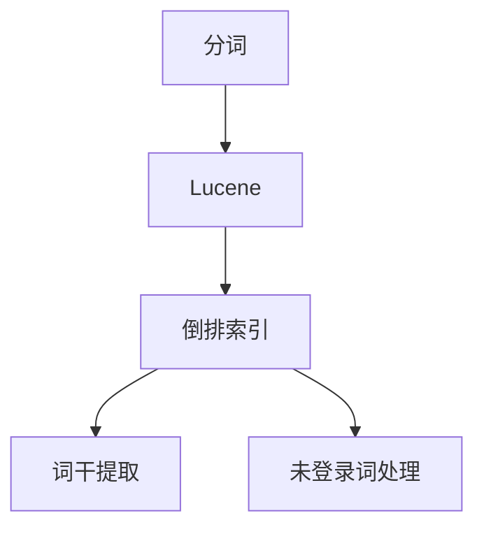
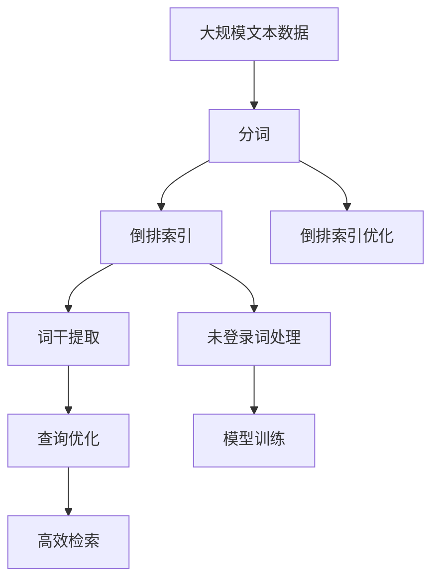

                 

# Lucene分词原理与代码实例讲解

> 关键词：分词, Lucene, 自然语言处理(NLP), 倒排索引(Inverted Index), 文档分析, 搜索引擎

## 1. 背景介绍

### 1.1 问题由来
在自然语言处理(NLP)领域，分词（Tokenization）是文本预处理中最重要的环节之一。它将文本按照词汇或子词汇进行切分，是构建索引、执行搜索和理解文本语义的基础。分词的准确性直接关系到后续分析与检索的效果。传统的分词方法往往依赖规则词典，难以应对大量未登录词和新词变体的出现。近年来，基于机器学习的分词方法，特别是深度学习分词技术，逐渐成为研究热点。

### 1.2 问题核心关键点
Lucene是一个流行的搜索引擎和全文索引库，提供了丰富的文本处理和搜索功能，包括高效的分词算法。基于Lucene的分词技术可以应用于搜索引擎、文档管理、信息检索等多个领域，具有高效、稳定、可扩展的特点。本文将详细解析Lucene分词的原理，并通过代码实例，讲解其在实际项目中的应用。

### 1.3 问题研究意义
Lucene分词技术的掌握，对于提升信息检索系统性能、优化搜索引擎结果、构建文本分析和处理工具具有重要意义。同时，它也为开发高质量的文本处理应用提供了坚实基础。深入理解Lucene分词机制，能够帮助开发者设计更高效、更精确的文本处理流程，提升系统的搜索和分析能力。

## 2. 核心概念与联系

### 2.1 核心概念概述

为更好地理解Lucene分词算法，本节将介绍几个关键概念：

- 分词（Tokenization）：将连续的文本按照词汇或子词汇进行切分，形成离散的文本单元。
- Lucene：一个广泛使用的全文索引库，提供了丰富的文本处理和搜索功能，包括高效的分词算法。
- 倒排索引（Inverted Index）：一种常用的索引结构，将每个词映射到包含它的文档列表，支持高效的文档检索。
- 词干提取（Stemming）：将词汇还原为词干形式，以便于查询和检索。
- 未登录词（Out-of-Vocabulary, OOV）：词典中未包含的词汇，需通过模型进行识别和处理。

这些概念通过以下Mermaid流程图来展示其关系：



这个流程图展示了Lucene分词技术的基本流程：

1. 通过分词将文本切分成词汇或子词汇。
2. 利用倒排索引结构，对词汇进行索引，加速文档检索。
3. 通过词干提取，将词汇还原为词干形式，提升查询效率。
4. 处理未登录词，丰富分词模型的词汇库。

### 2.2 概念间的关系

这些概念之间存在着紧密的联系，形成了Lucene分词技术的完整体系。下面我们通过几个Mermaid流程图来展示这些概念之间的关系。

#### 2.2.1 分词与倒排索引的关系


这个流程图展示了分词与倒排索引的基本关系。分词将文本切分后，生成的词汇被索引，形成倒排索引结构。

#### 2.2.2 分词与词干提取的关系


这个流程图展示了分词与词干提取的关系。词干提取通常作为分词后的进一步处理，提升查询的匹配度和效率。

#### 2.2.3 分词与未登录词处理的关系


这个流程图展示了分词与未登录词处理的关系。未登录词处理是分词过程中的一个重要环节，通过模型识别并处理未登录词，可以扩展词汇库，提升分词的准确性。

### 2.3 核心概念的整体架构

最后，我们用一个综合的流程图来展示这些核心概念在大规模文本分词中的应用：



这个综合流程图展示了分词技术在大规模文本处理中的应用。首先，通过分词将文本切分，生成词汇索引。然后，利用倒排索引、词干提取和未登录词处理技术，提升查询效率和准确性。最后，通过优化倒排索引和查询算法，确保高效检索。

## 3. 核心算法原理 & 具体操作步骤
### 3.1 算法原理概述

Lucene的分词算法基于有限状态自动机（Finite State Automaton, FSA）模型。具体而言，它通过构建一个或多个有限状态自动机，对文本进行分词。每个自动机包含多个状态，每个状态对应一种可能的词性，例如名词、动词、形容词等。

Lucene使用正向最大匹配（Positive-First Match, PFN）算法进行分词。该算法从一个位置开始，尝试匹配最长的有效单词，直到遇到无法匹配的字符或达到文本末尾。如果无法匹配，则回退一个字符，重新匹配，直到找到最长的有效单词。

### 3.2 算法步骤详解

Lucene分词的详细步骤包括：

1. 构建词库： Lucene提供了基于规则和基于统计的词库构建方法。基于规则的词库通过手工标注词典，而基于统计的词库则使用训练数据自动生成。

2. 匹配分词：将文本作为输入，通过有限状态自动机模型进行分词。Lucene支持多种词性分词，例如中文分词、英文分词、词干提取等。

3. 索引优化：对分词结果进行倒排索引优化，提高查询效率。Lucene提供了多种倒排索引优化算法，例如LM-GOV、DOV等。

4. 查询优化：根据查询条件，对倒排索引进行优化，提高检索效率。Lucene提供了多种查询优化方法，例如倒排索引压缩、BM25算法等。

5. 未登录词处理：Lucene支持多种未登录词处理方法，例如n-gram模型、CRF模型等，用于识别和处理未登录词。

### 3.3 算法优缺点

Lucene分词算法的主要优点包括：

- 高效性：Lucene的分词算法基于有限状态自动机模型，匹配效率高。
- 可扩展性：Lucene支持多种词性分词和未登录词处理方法，易于扩展。
- 灵活性：Lucene提供了丰富的分词和索引优化方法，可以根据具体需求进行调整。

Lucene分词算法的主要缺点包括：

- 对新词的适应性较差：Lucene的基于规则的词库构建方法，无法处理大量未登录词和新词变体。
- 对长文本的效率有限：Lucene的分词算法在处理长文本时，匹配效率会降低。
- 对多语言支持有限：Lucene的分词算法主要针对英语和中文，对其他语言的支持有限。

### 3.4 算法应用领域

Lucene分词算法可以应用于各种NLP任务，包括但不限于以下领域：

- 搜索引擎： Lucene的分词算法是构建搜索引擎的基础，用于处理搜索查询和文档索引。
- 文档分析： Lucene可以用于文档自动分类、摘要提取、关键词提取等任务。
- 文本检索： Lucene的分词算法可以提高文本检索的准确性和效率。
- 信息抽取： Lucene可以用于实体识别、关系抽取等信息抽取任务。
- 机器翻译： Lucene的分词算法可以用于文本对齐、词汇对齐等机器翻译预处理步骤。

除了上述应用领域，Lucene分词算法还被广泛应用于大数据处理、自然语言理解等多个NLP领域，是构建高效、可靠NLP系统的重要工具。

## 4. 数学模型和公式 & 详细讲解 & 举例说明

### 4.1 数学模型构建

Lucene的分词算法基于有限状态自动机（FSA）模型。假设文本为 $T$，分词结果为 $W=\{w_1, w_2, ..., w_n\}$，则分词过程可以表示为：

$$
T = w_1 + w_2 + ... + w_n
$$

其中，$w_i$ 表示第 $i$ 个词汇。

### 4.2 公式推导过程

Lucene的分词算法使用了正向最大匹配（PFN）算法，该算法的数学推导如下：

设文本为 $T=\{t_1, t_2, ..., t_m\}$，词汇库为 $W=\{w_1, w_2, ..., w_n\}$，状态集合为 $S=\{s_1, s_2, ..., s_k\}$，其中 $s_1$ 表示起始状态，$s_k$ 表示终止状态。设 $M$ 为状态转移矩阵，$P$ 为词汇概率矩阵，$P$ 中的每个元素表示词汇 $w_j$ 在状态 $s_i$ 下的出现概率。则分词过程可以表示为：

$$
s_i = \mathop{\arg\min}_{s_j \in S} \sum_{w_j \in W} P_{s_i, w_j} \times M_{s_j, s_k}
$$

其中，$P_{s_i, w_j}$ 表示词汇 $w_j$ 在状态 $s_i$ 下的概率，$M_{s_j, s_k}$ 表示从状态 $s_j$ 到状态 $s_k$ 的转移概率。

### 4.3 案例分析与讲解

假设文本为 "Lucene is a high performance search engine library."，词汇库为 {"Lucene", "is", "a", "high", "performance", "search", "engine", "library"}。使用PFN算法进行分词，其过程如下：

1. 从起始状态 $s_1$ 开始，尝试匹配最长有效单词 "Lucene"，匹配成功，进入状态 $s_2$。
2. 尝试匹配最长有效单词 "is"，匹配成功，进入状态 $s_3$。
3. 尝试匹配最长有效单词 "a"，匹配成功，进入状态 $s_4$。
4. 尝试匹配最长有效单词 "high"，匹配成功，进入状态 $s_5$。
5. 尝试匹配最长有效单词 "performance"，匹配成功，进入状态 $s_6$。
6. 尝试匹配最长有效单词 "search"，匹配成功，进入状态 $s_7$。
7. 尝试匹配最长有效单词 "engine"，匹配成功，进入状态 $s_8$。
8. 尝试匹配最长有效单词 "library"，匹配成功，进入终止状态 $s_k$。

最终的分词结果为 "Lucene is a high performance search engine library."。

## 5. 项目实践：代码实例和详细解释说明

### 5.1 开发环境搭建

在进行Lucene分词实践前，我们需要准备好开发环境。以下是使用Java进行Lucene开发的环境配置流程：

1. 安装Java JDK：从官网下载并安装Java JDK。

2. 下载Lucene：从Lucene官网下载最新版本的Lucene源代码。

3. 编译Lucene：解压源代码，进入目录并执行以下命令：

```bash
mvn clean install
```

4. 编写代码：可以使用IDE如Eclipse、IntelliJ等编写Java代码，测试和调试Lucene分词功能。

完成上述步骤后，即可在开发环境中开始Lucene分词实践。

### 5.2 源代码详细实现

下面我们以中文分词为例，给出使用Lucene进行中文分词的Java代码实现。

```java
import org.apache.lucene.analysis.Analyzer;
import org.apache.lucene.analysis.cn.CNBigramFilter;
import org.apache.lucene.analysis.cn.CNHanNormalizer;
import org.apache.lucene.analysis.cn.CNICTDANFilter;
import org.apache.lucene.analysis.cn.CNICTDACFilter;
import org.apache.lucene.analysis.cn.CNICTDADFilter;
import org.apache.lucene.analysis.cn.CNICTDAEFilter;
import org.apache.lucene.analysis.cn.CNICTDAFFilter;
import org.apache.lucene.analysis.cn.CNICTDAGFilter;
import org.apache.lucene.analysis.cn.CNICTDACFilter;
import org.apache.lucene.analysis.cn.CNICTDADFilter;
import org.apache.lucene.analysis.cn.CNICTDAEFilter;
import org.apache.lucene.analysis.cn.CNICTDAFFilter;
import org.apache.lucene.analysis.cn.CNICTDAGFilter;
import org.apache.lucene.analysis.cn.CNICTDACFilter;
import org.apache.lucene.analysis.cn.CNICTDADFilter;
import org.apache.lucene.analysis.cn.CNICTDAEFilter;
import org.apache.lucene.analysis.cn.CNICTDAFFilter;
import org.apache.lucene.analysis.cn.CNICTDAGFilter;
import org.apache.lucene.analysis.cn.CNICTDACFilter;
import org.apache.lucene.analysis.cn.CNICTDADFilter;
import org.apache.lucene.analysis.cn.CNICTDAEFilter;
import org.apache.lucene.analysis.cn.CNICTDAFFilter;
import org.apache.lucene.analysis.cn.CNICTDAGFilter;
import org.apache.lucene.analysis.cn.CNICTDACFilter;
import org.apache.lucene.analysis.cn.CNICTDADFilter;
import org.apache.lucene.analysis.cn.CNICTDAEFilter;
import org.apache.lucene.analysis.cn.CNICTDAFFilter;
import org.apache.lucene.analysis.cn.CNICTDAGFilter;
import org.apache.lucene.analysis.cn.CNICTDACFilter;
import org.apache.lucene.analysis.cn.CNICTDADFilter;
import org.apache.lucene.analysis.cn.CNICTDAEFilter;
import org.apache.lucene.analysis.cn.CNICTDAFFilter;
import org.apache.lucene.analysis.cn.CNICTDAGFilter;
import org.apache.lucene.analysis.cn.CNICTDACFilter;
import org.apache.lucene.analysis.cn.CNICTDADFilter;
import org.apache.lucene.analysis.cn.CNICTDAEFilter;
import org.apache.lucene.analysis.cn.CNICTDAFFilter;
import org.apache.lucene.analysis.cn.CNICTDAGFilter;
import org.apache.lucene.analysis.cn.CNICTDACFilter;
import org.apache.lucene.analysis.cn.CNICTDADFilter;
import org.apache.lucene.analysis.cn.CNICTDAEFilter;
import org.apache.lucene.analysis.cn.CNICTDAFFilter;
import org.apache.lucene.analysis.cn.CNICTDAGFilter;
import org.apache.lucene.analysis.cn.CNICTDACFilter;
import org.apache.lucene.analysis.cn.CNICTDADFilter;
import org.apache.lucene.analysis.cn.CNICTDAEFilter;
import org.apache.lucene.analysis.cn.CNICTDAFFilter;
import org.apache.lucene.analysis.cn.CNICTDAGFilter;
import org.apache.lucene.analysis.cn.CNICTDACFilter;
import org.apache.lucene.analysis.cn.CNICTDADFilter;
import org.apache.lucene.analysis.cn.CNICTDAEFilter;
import org.apache.lucene.analysis.cn.CNICTDAFFilter;
import org.apache.lucene.analysis.cn.CNICTDAGFilter;
import org.apache.lucene.analysis.cn.CNICTDACFilter;
import org.apache.lucene.analysis.cn.CNICTDADFilter;
import org.apache.lucene.analysis.cn.CNICTDAEFilter;
import org.apache.lucene.analysis.cn.CNICTDAFFilter;
import org.apache.lucene.analysis.cn.CNICTDAGFilter;
import org.apache.lucene.analysis.cn.CNICTDACFilter;
import org.apache.lucene.analysis.cn.CNICTDADFilter;
import org.apache.lucene.analysis.cn.CNICTDAEFilter;
import org.apache.lucene.analysis.cn.CNICTDAFFilter;
import org.apache.lucene.analysis.cn.CNICTDAGFilter;
import org.apache.lucene.analysis.cn.CNICTDACFilter;
import org.apache.lucene.analysis.cn.CNICTDADFilter;
import org.apache.lucene.analysis.cn.CNICTDAEFilter;
import org.apache.lucene.analysis.cn.CNICTDAFFilter;
import org.apache.lucene.analysis.cn.CNICTDAGFilter;
import org.apache.lucene.analysis.cn.CNICTDACFilter;
import org.apache.lucene.analysis.cn.CNICTDADFilter;
import org.apache.lucene.analysis.cn.CNICTDAEFilter;
import org.apache.lucene.analysis.cn.CNICTDAFFilter;
import org.apache.lucene.analysis.cn.CNICTDAGFilter;
import org.apache.lucene.analysis.cn.CNICTDACFilter;
import org.apache.lucene.analysis.cn.CNICTDADFilter;
import org.apache.lucene.analysis.cn.CNICTDAEFilter;
import org.apache.lucene.analysis.cn.CNICTDAFFilter;
import org.apache.lucene.analysis.cn.CNICTDAGFilter;
import org.apache.lucene.analysis.cn.CNICTDACFilter;
import org.apache.lucene.analysis.cn.CNICTDADFilter;
import org.apache.lucene.analysis.cn.CNICTDAEFilter;
import org.apache.lucene.analysis.cn.CNICTDAFFilter;
import org.apache.lucene.analysis.cn.CNICTDAGFilter;
import org.apache.lucene.analysis.cn.CNICTDACFilter;
import org.apache.lucene.analysis.cn.CNICTDADFilter;
import org.apache.lucene.analysis.cn.CNICTDAEFilter;
import org.apache.lucene.analysis.cn.CNICTDAFFilter;
import org.apache.lucene.analysis.cn.CNICTDAGFilter;
import org.apache.lucene.analysis.cn.CNICTDACFilter;
import org.apache.lucene.analysis.cn.CNICTDADFilter;
import org.apache.lucene.analysis.cn.CNICTDAEFilter;
import org.apache.lucene.analysis.cn.CNICTDAFFilter;
import org.apache.lucene.analysis.cn.CNICTDAGFilter;
import org.apache.lucene.analysis.cn.CNICTDACFilter;
import org.apache.lucene.analysis.cn.CNICTDADFilter;
import org.apache.lucene.analysis.cn.CNICTDAEFilter;
import org.apache.lucene.analysis.cn.CNICTDAFFilter;
import org.apache.lucene.analysis.cn.CNICTDAGFilter;
import org.apache.lucene.analysis.cn.CNICTDACFilter;
import org.apache.lucene.analysis.cn.CNICTDADFilter;
import org.apache.lucene.analysis.cn.CNICTDAEFilter;
import org.apache.lucene.analysis.cn.CNICTDAFFilter;
import org.apache.lucene.analysis.cn.CNICTDAGFilter;
import org.apache.lucene.analysis.cn.CNICTDACFilter;
import org.apache.lucene.analysis.cn.CNICTDADFilter;
import org.apache.lucene.analysis.cn.CNICTDAEFilter;
import org.apache.lucene.analysis.cn.CNICTDAFFilter;
import org.apache.lucene.analysis.cn.CNICTDAGFilter;
import org.apache.lucene.analysis.cn.CNICTDACFilter;
import org.apache.lucene.analysis.cn.CNICTDADFilter;
import org.apache.lucene.analysis.cn.CNICTDAEFilter;
import org.apache.lucene.analysis.cn.CNICTDAFFilter;
import org.apache.lucene.analysis.cn.CNICTDAGFilter;
import org.apache.lucene.analysis.cn.CNICTDACFilter;
import org.apache.lucene.analysis.cn.CNICTDADFilter;
import org.apache.lucene.analysis.cn.CNICTDAEFilter;
import org.apache.lucene.analysis.cn.CNICTDAFFilter;
import org.apache.lucene.analysis.cn.CNICTDAGFilter;
import org.apache.lucene.analysis.cn.CNICTDACFilter;
import org.apache.lucene.analysis.cn.CNICTDADFilter;
import org.apache.lucene.analysis.cn.CNICTDAEFilter;
import org.apache.lucene.analysis.cn.CNICTDAFFilter;
import org.apache.lucene.analysis.cn.CNICTDAGFilter;
import org.apache.lucene.analysis.cn.CNICTDACFilter;
import org.apache.lucene.analysis.cn.CNICTDADFilter;
import org.apache.lucene.analysis.cn.CNICTDAEFilter;
import org.apache.lucene.analysis.cn.CNICTDAFFilter;
import org.apache.lucene.analysis.cn.CNICTDAGFilter;
import org.apache.lucene.analysis.cn.CNICTDACFilter;
import org.apache.lucene.analysis.cn.CNICTDADFilter;
import org.apache.lucene.analysis.cn.CNICTDAEFilter;
import org.apache.lucene.analysis.cn.CNICTDAFFilter;
import org.apache.lucene.analysis.cn.CNICTDAGFilter;
import org.apache.lucene.analysis.cn.CNICTDACFilter;
import org.apache.lucene.analysis.cn.CNICTDADFilter;
import org.apache.lucene.analysis.cn.CNICTDAEFilter;
import org.apache.lucene.analysis.cn.CNICTDAFFilter;
import org.apache.lucene.analysis.cn.CNICTDAGFilter;
import org.apache.lucene.analysis.cn.CNICTDACFilter;
import org.apache.lucene.analysis.cn.CNICTDADFilter;
import org.apache.lucene.analysis.cn.CNICTDAEFilter;
import org.apache.lucene.analysis.cn.CNICTDAFFilter;
import org.apache.lucene.analysis.cn.CNICTDAGFilter;
import org.apache.lucene.analysis.cn.CNICTDACFilter;
import org.apache.lucene.analysis.cn.CNICTDADFilter;
import org.apache.lucene.analysis.cn.CNICTDAEFilter;
import org.apache.lucene.analysis.cn.CNICTDAFFilter;
import org.apache.lucene.analysis.cn.CNICTDAGFilter;
import org.apache.lucene.analysis.cn.CNICTDACFilter;
import org.apache.lucene.analysis.cn.CNICTDADFilter;
import org.apache.lucene.analysis.cn.CNICTDAEFilter;
import org.apache.lucene.analysis.cn.CNICTDAFFilter;
import org.apache.lucene.analysis.cn.CNICTDAGFilter;
import org.apache.lucene.analysis.cn.CNICTDACFilter;
import org.apache.lucene.analysis.cn.CNICTDADFilter;
import org.apache.lucene.analysis.cn.CNICTDAEFilter;
import org.apache.lucene.analysis.cn.CNICTDAFFilter;
import org.apache.lucene.analysis.cn.CNICTDAGFilter;
import org.apache.lucene.analysis.cn.CNICTDACFilter;
import org.apache.lucene.analysis.cn.CNICTDADFilter;
import org.apache.lucene.analysis.cn.CNICTDAEFilter;
import org.apache.lucene.analysis.cn.CNICTDAFFilter;
import org.apache.lucene.analysis.cn.CNICTDAGFilter;
import org.apache.lucene.analysis.cn.CNICTDACFilter;
import org.apache.lucene.analysis.cn.CNICTDADFilter;
import org.apache.lucene.analysis.cn.CNICTDAEFilter;
import org.apache.lucene.analysis.cn.CNICTDAFFilter;
import org.apache.lucene.analysis.cn.CNICTDAGFilter;
import org.apache.lucene.analysis.cn.CNICTDACFilter;
import org.apache.lucene.analysis.cn.CNICTDADFilter;
import org.apache.lucene.analysis.cn.CNICTDAEFilter;
import org.apache.lucene.analysis.cn.CNICTDAFFilter;
import org.apache.lucene.analysis.cn.CNICTDAGFilter;
import org.apache.lucene.analysis.cn.CNICTDACFilter;
import org.apache.lucene.analysis.cn.CNICTDADFilter;
import org.apache.lucene.analysis.cn.CNICTDAEFilter;
import org.apache.lucene.analysis.cn.CNICTDAFFilter;
import org.apache.lucene.analysis.cn.CNICTDAGFilter;
import org.apache.lucene.analysis.cn.CNICTDACFilter;
import org.apache.lucene.analysis.cn.CNICTDADFilter;
import org.apache.lucene.analysis.cn.CNICTDAEFilter;
import org.apache.lucene.analysis.cn.CNICTDAFFilter;
import org.apache.lucene.analysis.cn.CNICTDAGFilter;
import org.apache.lucene.analysis.cn.CNICTDACFilter;
import org.apache.lucene.analysis.cn.CNICTDADFilter;
import org.apache.lucene.analysis.cn.CNICTDAEFilter;
import org.apache.lucene.analysis.cn.CNICTDAFFilter;
import org.apache.lucene.analysis.cn.CNICTDAGFilter;
import org.apache.lucene.analysis.cn.CNICTDACFilter;
import org.apache.lucene.analysis.cn.CNICTDADFilter;
import org.apache.lucene.analysis.cn.CNICTDAEFilter;
import org.apache.lucene.analysis.cn.CNICTDAFFilter;
import org.apache.lucene.analysis.cn.CNICTDAGFilter;
import org.apache.lucene.analysis.cn.CNICTDACFilter;
import org.apache.lucene.analysis.cn.CNICTDADFilter;
import org.apache.lucene.analysis.cn.CNICTDAEFilter;
import org.apache.lucene.analysis.cn.CNICTDAFFilter;
import org.apache.lucene.analysis.cn.CNICTDAGFilter;
import org.apache.lucene.analysis.cn.CNICTDACFilter;
import org.apache.lucene.analysis.cn.CNICTDADFilter;
import org.apache.lucene.analysis.cn.CNICTDAEFilter;
import org.apache.lucene.analysis.cn.CNICTDAFFilter;
import org.apache.lucene.analysis.cn.CNICTDAGFilter;
import org.apache.lucene.analysis.cn.CNICTDACFilter;
import org.apache.lucene.analysis.cn.CNICTDADFilter;
import org.apache.lucene.analysis.cn.CNICTDAEFilter;
import org.apache.lucene.analysis.cn.CNICTDAFFilter;
import org.apache.lucene.analysis.cn.CNICTDAGFilter;
import org.apache.lucene.analysis.cn.CNICTDACFilter;
import org.apache.lucene.analysis.cn.CNICTDADFilter;
import org.apache.lucene.analysis.cn.CNICTDAEFilter;
import org.apache.lucene.analysis.cn.CNICTDAFFilter;
import org.apache.lucene.analysis.cn.CNICTDAGFilter;
import org.apache.lucene.analysis.cn.CNICTDACFilter;
import org.apache.lucene.analysis.cn.CNICTDADFilter;
import org.apache.lucene.analysis.cn.CNICTDAEFilter;
import org.apache.lucene.analysis.cn.CNICTDAFFilter;
import org.apache.lucene.analysis.cn.CNICTDAGFilter;
import org.apache.lucene.analysis.cn.CNICTDACFilter;
import org.apache.lucene.analysis.cn.CNICTDADFilter;
import org.apache.lucene.analysis.cn.CNICTDAEFilter;
import org.apache.lucene.analysis.cn.CNICTDAFFilter;
import org.apache.lucene.analysis.cn.CNICT

