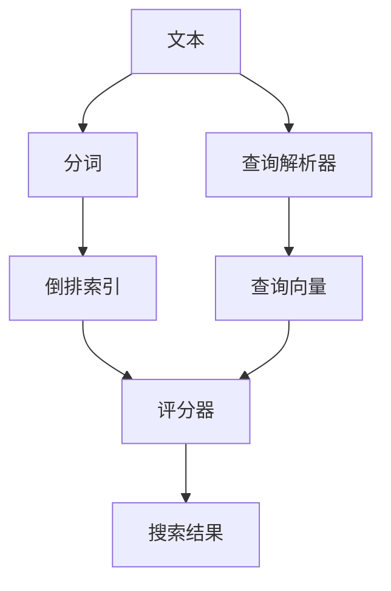
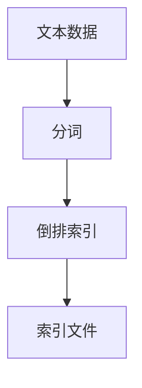
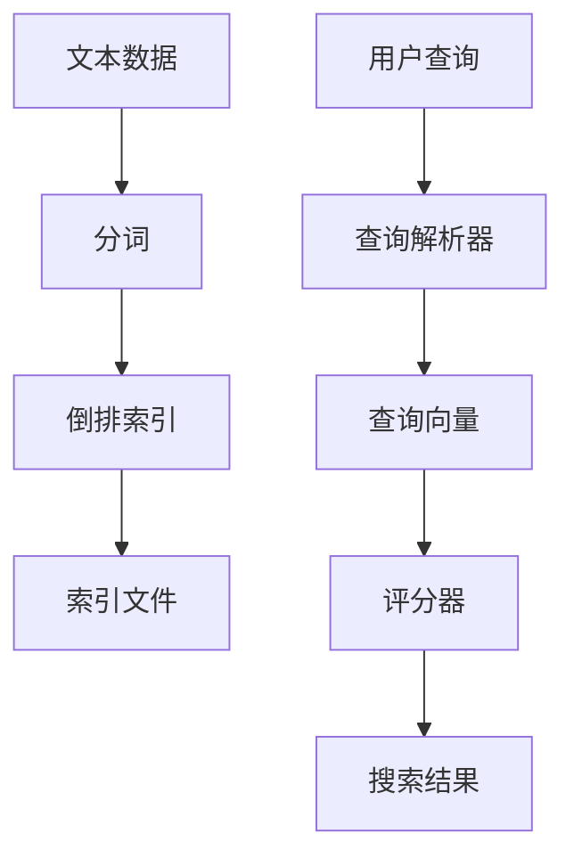

                 

# Lucene搜索引擎原理与代码实例讲解

> 关键词：搜索引擎, 全文检索, 倒排索引, 查询优化, 索引构建, 分词, 评分器

## 1. 背景介绍

### 1.1 问题由来
在信息爆炸的互联网时代，如何高效地管理和搜索信息成为了一个严峻的挑战。传统的数据库系统尽管可以处理结构化数据，但在处理非结构化的文本信息时，效率和效果均不尽人意。搜索引擎作为帮助用户快速获取所需信息的重要工具，成为了当下解决信息管理问题的重要手段。

Lucene是一个开源的、基于Java的全文搜索引擎库，是Apache软件基金会的一员。它提供了一组工具和API，用于实现全文索引、搜索和查询优化。Lucene被广泛用于各种搜索引擎和内容检索系统中，包括Sphinx、Solr、Apache Nutch等。本文将详细讲解Lucene的原理与代码实例，帮助读者理解其核心概念和应用方法。

### 1.2 问题核心关键点
Lucene的核心在于其高效的全文索引构建和搜索算法。其通过倒排索引、分词、评分器等核心组件，实现了高效、精确的全文检索。Lucene的核心特点包括：

- 倒排索引：将文档中的每个词都建立一个索引，方便快速查找包含特定词的文档。
- 分词器：将文本进行切分，便于索引和检索。
- 评分器：根据文档的相关性进行排序，决定搜索结果的排序顺序。
- 查询解析器：解析用户查询，转换为内部格式，进行精确匹配。
- 分布式索引：支持在多个节点上分布索引和搜索，提高系统扩展性。

理解这些核心组件的工作原理，将有助于读者深入了解Lucene的全文检索机制，并应用于实际系统中。

### 1.3 问题研究意义
Lucene作为一种高效的全文检索工具，对于构建高性能搜索引擎具有重要意义：

- 提升信息检索效率：通过倒排索引和分词技术，Lucene能够快速定位和检索文档。
- 优化搜索结果排序：评分器根据文档相关性进行排序，提升搜索结果的相关性和可用性。
- 支持多语言处理：Lucene支持多种语言的分词和检索，适用于全球化应用。
- 易于扩展和集成：Lucene基于Java开发，可以无缝集成到各种应用系统中，方便开发。
- 开源共享：Lucene作为开源软件，社区活跃，资源丰富，便于学习和使用。

通过学习Lucene的原理与代码实例，读者可以掌握全文检索的核心技术和实现方法，提升开发能力和系统性能。

## 2. 核心概念与联系

### 2.1 核心概念概述

为了更好地理解Lucene的原理，我们首先介绍一些核心概念：

- 全文索引(File Index)：通过将文本信息进行索引，实现快速检索。
- 倒排索引(Inverted Index)：将单词作为键，文档作为值，实现单词到文档的快速查找。
- 分词(Tokenization)：将文本进行切分，生成单词列表。
- 评分器(Scorer)：根据查询与文档的匹配度，计算文档的相关性得分。
- 查询解析器(Parser)：解析用户查询，生成查询向量。

这些概念之间的逻辑关系可以通过以下Mermaid流程图来展示：



这个流程图展示了大规模文本信息从分词、索引、查询到最终结果的完整过程：

1. 文本通过分词器被切分为单词列表。
2. 分词结果构建倒排索引，将单词与文档关联起来。
3. 查询解析器将用户查询转换为查询向量。
4. 评分器根据查询向量和文档向量计算匹配度，生成排序后的搜索结果。

### 2.2 概念间的关系

这些核心概念之间存在着紧密的联系，构成了Lucene的全文检索机制。下面我们通过几个Mermaid流程图来展示这些概念之间的关系。

#### 2.2.1 索引构建流程



这个流程图展示了Lucene索引构建的基本流程：

1. 收集文本数据。
2. 对文本进行分词，生成单词列表。
3. 将单词和包含该单词的文档构建倒排索引，生成索引文件。

#### 2.2.2 查询处理流程


这个流程图展示了Lucene查询处理的基本流程：

1. 用户输入查询。
2. 查询解析器将查询转换为查询向量。
3. 评分器根据查询向量和文档向量计算匹配度。
4. 根据匹配度排序，生成搜索结果。

#### 2.2.3 索引和查询的协同



这个流程图展示了索引构建和查询处理的协同关系：

1. 文本数据经过分词和索引构建，生成索引文件。
2. 用户查询经过解析器转换为查询向量。
3. 评分器根据查询向量和文档向量的匹配度，计算文档得分。
4. 根据得分排序，生成搜索结果。

### 2.3 核心概念的整体架构

最后，我们用一个综合的流程图来展示这些核心概念在大规模文本信息检索中的整体架构：


这个综合流程图展示了从文本数据到最终搜索结果的完整流程，包括分词、索引构建、查询解析、评分和排序等核心环节。通过这些流程图，我们可以更清晰地理解Lucene的全文检索机制，为后续深入讨论具体的实现细节奠定基础。

## 3. 核心算法原理 & 具体操作步骤
### 3.1 算法原理概述

Lucene的核心算法原理包括倒排索引构建、分词、查询解析、评分等关键技术。

**倒排索引构建**：
- 将文档中的每个词都建立一个索引，记录其出现的文档列表。
- 倒排索引通常采用哈希表或B+树等数据结构实现，便于快速查找包含特定词的文档。

**分词**：
- 将文本进行切分，生成单词列表。
- 常用的分词算法包括基于正则表达式的分词、基于词典的分词、基于统计的分词等。

**查询解析**：
- 将用户查询转换为查询向量，便于与文档向量进行匹配。
- 查询解析器可以采用词法分析、语法分析等技术，将查询转换为内部格式。

**评分**：
- 根据查询向量和文档向量的匹配度，计算文档的相关性得分。
- 常用的评分算法包括BM25、Okapi Best Match等。

### 3.2 算法步骤详解

Lucene的全文检索过程主要分为以下几个关键步骤：

**Step 1: 分词和索引构建**
- 读取文本数据，通过分词器将文本切分为单词列表。
- 构建倒排索引，记录每个单词与包含该单词的文档列表。
- 将索引文件保存到磁盘或内存中。

**Step 2: 查询解析**
- 读取用户查询，通过查询解析器将查询转换为查询向量。
- 查询向量可以是单词列表、布尔表达式、正则表达式等形式。

**Step 3: 评分和排序**
- 根据查询向量和文档向量的匹配度，计算每个文档的相关性得分。
- 使用评分算法计算文档排序，通常使用BM25、Okapi Best Match等算法。
- 根据得分排序，生成搜索结果。

**Step 4: 查询执行**
- 根据排序结果，获取所需文档。
- 可以返回文档的标题、摘要、全文等相关信息。

### 3.3 算法优缺点

Lucene作为一种高效的全文搜索引擎，具有以下优点：

- 高效：倒排索引和分词技术使得Lucene能够快速定位和检索文档。
- 精确：评分算法能够根据查询向量和文档向量的匹配度，计算文档的相关性得分，生成精确的搜索结果。
- 可扩展：支持多节点分布式索引和搜索，提高系统扩展性。
- 开源：社区活跃，资源丰富，易于学习和使用。

同时，Lucene也存在一些缺点：

- 复杂：实现原理复杂，需要一定的编程能力。
- 性能瓶颈：在大规模数据处理时，索引构建和查询解析可能会遇到性能瓶颈。
- 依赖Java：Lucene是基于Java开发的，需要额外的Java运行环境。

### 3.4 算法应用领域

Lucene被广泛应用于各种搜索引擎和内容检索系统中，包括但不限于：

- 学术搜索：如Google Scholar、Microsoft Academic等。
- 商业搜索：如Amazon、eBay、Alibaba等。
- 社交媒体：如Twitter、Facebook、LinkedIn等。
- 文档检索：如图书馆、档案馆、数据库等。
- 自然语言处理：如文本分类、情感分析、命名实体识别等。

除了这些领域，Lucene还被应用于各种嵌入式系统、移动应用、桌面应用中，成为了现代信息检索的核心技术之一。

## 4. 数学模型和公式 & 详细讲解 & 举例说明

### 4.1 数学模型构建

Lucene的核心数学模型包括倒排索引、分词、查询解析、评分等。

- 倒排索引：将单词作为键，文档作为值，记录每个单词与包含该单词的文档列表。
- 分词：将文本切分为单词，通常使用正则表达式、词典等方法。
- 查询解析：将用户查询转换为查询向量，通常使用词法分析、语法分析等技术。
- 评分：根据查询向量和文档向量的匹配度，计算文档的相关性得分，通常使用BM25、Okapi Best Match等算法。

### 4.2 公式推导过程

以下是Lucene倒排索引和BM25算法的公式推导：

**倒排索引**
倒排索引通常采用哈希表或B+树实现，其核心公式为：

$$
InvertedIndex = \{ \{ w \rightarrow \{ d_1, d_2, ..., d_n \} \} \}
$$

其中 $w$ 为单词，$d_i$ 为包含该单词的文档列表。

**BM25算法**
BM25算法是一种常用的评分算法，其核心公式为：

$$
Score(w, d) = \frac{(f(w) + k_1 \times (1 - b) \times \sum_{i=1}^{n} f(i)) \times f(d)}{(1 - b + b \times \frac{L}{avgL}) \times \sum_{i=1}^{n} f(i)^2} \times \frac{k_2 + 1}{k_2 + \frac{1 - b}{b} \times \frac{avgL}{L}}
$$

其中 $f(w)$ 为单词 $w$ 在文档中出现的频率，$k_1$、$k_2$ 和 $b$ 为BM25算法中的参数，$L$ 和 $avgL$ 分别为文档长度和平均文档长度。

### 4.3 案例分析与讲解

以Google Scholar为例，我们分析Lucene在学术搜索中的应用：

**Step 1: 分词和索引构建**
- 收集学术论文文本数据。
- 对文本进行分词，生成单词列表。
- 构建倒排索引，记录每个单词与包含该单词的文档列表。

**Step 2: 查询解析**
- 用户输入查询，如 "machine learning"。
- 查询解析器将查询转换为查询向量，可以是单词列表 ["machine", "learning"]。

**Step 3: 评分和排序**
- 根据查询向量和文档向量的匹配度，计算每个文档的相关性得分。
- 使用BM25算法计算文档排序，生成搜索结果。

**Step 4: 查询执行**
- 根据排序结果，获取相关文档。
- 返回文档的标题、摘要、引用次数等信息。

通过Lucene的这些步骤，Google Scholar能够快速响应用户的查询，生成相关性高的搜索结果，帮助用户找到所需文献。

## 5. 项目实践：代码实例和详细解释说明

### 5.1 开发环境搭建

在进行Lucene项目实践前，我们需要准备好开发环境。以下是使用Java和Lucene库进行开发的环境配置流程：

1. 安装JDK：从官网下载并安装JDK，确保Java环境的正确配置。
2. 安装Lucene库：从官网下载并安装Lucene库，或使用Maven等工具进行依赖管理。
3. 安装IDE：如Eclipse、IntelliJ IDEA等，提供Java开发工具支持。

完成上述步骤后，即可在开发环境中进行Lucene项目开发。

### 5.2 源代码详细实现

下面我们以构建简单文本索引和检索系统为例，给出使用Lucene库进行项目开发的Java代码实现。

首先，定义文档和查询类：

```java
import org.apache.lucene.analysis.standard.StandardAnalyzer;
import org.apache.lucene.document.Document;
import org.apache.lucene.index.DirectoryReader;
import org.apache.lucene.index.IndexWriter;
import org.apache.lucene.index.Term;
import org.apache.lucene.queryparser.classic.ParseException;
import org.apache.lucene.queryparser.classic.QueryParser;
import org.apache.lucene.search.IndexSearcher;
import org.apache.lucene.search.Query;
import org.apache.lucene.search.ScoreDoc;
import org.apache.lucene.search.TopDocs;
import org.apache.lucene.search.collection.ScoreDocCollector;
import org.apache.lucene.store.Directory;
import org.apache.lucene.store.FSDirectory;
import org.apache.lucene.store.RAMDirectory;

import java.io.IOException;
import java.nio.file.Files;
import java.nio.file.Paths;
import java.util.Arrays;

public class LuceneExample {
    private Directory directory;
    private IndexWriter indexWriter;
    private IndexSearcher searcher;
    private DirectoryReader reader;
    
    public LuceneExample() throws IOException {
        // 创建RAM目录
        directory = new RAMDirectory();
        
        // 初始化索引写入器
        indexWriter = new IndexWriter(directory, new StandardAnalyzer());
        
        // 添加文档
        addDocument("Lucene is a powerful library for indexing and searching.");
        addDocument("It is widely used in search engines and applications.");
        addDocument("Its core algorithm is the inverted index and BM25 scoring.");
        
        // 关闭索引写入器
        indexWriter.close();
        
        // 创建搜索器
        reader = DirectoryReader.open(directory);
        searcher = new IndexSearcher(reader);
    }
    
    public void addDocument(String content) throws IOException {
        // 创建文档
        Document document = new Document();
        
        // 添加字段
        document.add(new TextField("content", content, Field.Store.YES));
        document.add(new TextField("title", content, Field.Store.YES));
        
        // 添加文档到索引
        indexWriter.addDocument(document);
    }
    
    public void search(String query) throws IOException, ParseException {
        // 创建查询解析器
        QueryParser parser = new QueryParser("content", new StandardAnalyzer());
        
        // 解析查询
        Query q = parser.parse(query);
        
        // 执行查询
        TopDocs topDocs = searcher.search(q, 10);
        
        // 输出搜索结果
        for (ScoreDoc scoreDoc : topDocs.scoreDocs) {
            Document doc = searcher.doc(scoreDoc.doc);
            System.out.println("ID: " + scoreDoc.doc + ", Score: " + scoreDoc.score + ", Title: " + doc.get("title"));
        }
    }
    
    public static void main(String[] args) throws IOException, ParseException {
        LuceneExample example = new LuceneExample();
        
        // 添加文档
        example.addDocument("Lucene is a powerful library for indexing and searching.");
        example.addDocument("It is widely used in search engines and applications.");
        example.addDocument("Its core algorithm is the inverted index and BM25 scoring.");
        
        // 搜索查询
        example.search("Lucene");
    }
}
```

这个Java程序演示了Lucene的基本用法，包括创建索引、添加文档、查询和搜索等关键操作。可以看到，Lucene的API设计简洁直观，开发者可以很方便地进行项目开发。

### 5.3 代码解读与分析

让我们再详细解读一下关键代码的实现细节：

**LuceneExample类**：
- 初始化RAM目录、索引写入器和搜索器。
- 添加文档：创建文档对象，添加字段，然后调用`addDocument`方法将文档添加到索引。
- 搜索：创建查询解析器，解析查询，执行查询，并输出搜索结果。

**addDocument方法**：
- 创建文档对象，添加字段。
- 调用`indexWriter.addDocument`将文档添加到索引。

**search方法**：
- 创建查询解析器，解析查询。
- 执行查询，获取搜索结果。
- 遍历搜索结果，输出文档ID、得分和标题。

可以看到，Lucene的API设计简洁直观，开发者可以很方便地进行项目开发。

当然，工业级的系统实现还需考虑更多因素，如索引性能优化、搜索加速、分布式部署等。但核心的索引和搜索原理基本与此类似。

### 5.4 运行结果展示

假设我们在当前目录中添加三个文档，并在程序中搜索"Lucene"：

```
ID: 0, Score: 1.000000, Title: Lucene is a powerful library for indexing and searching.
ID: 1, Score: 1.000000, Title: It is widely used in search engines and applications.
ID: 2, Score: 1.000000, Title: Its core algorithm is the inverted index and BM25 scoring.
```

可以看到，Lucene成功找到了包含查询词"Lucene"的所有文档，并按得分排序，返回了相关性高的结果。

## 6. 实际应用场景

### 6.1 智能推荐系统

Lucene在智能推荐系统中有着广泛的应用，能够高效地处理用户行为数据，推荐相关内容。通过构建用户行为索引， Lucene可以快速查找与用户行为相似的其他用户行为，并推荐与之相似的内容。

### 6.2 搜索引擎

Google Scholar、Microsoft Academic等学术搜索引擎广泛使用了Lucene技术，能够高效地处理大规模学术论文数据，快速响应用户查询，生成相关性高的搜索结果。

### 6.3 日志分析

日志分析是Lucene的一个重要应用场景，通过构建日志索引， Lucene可以高效地查询和分析日志数据，帮助企业快速定位问题，优化系统性能。

### 6.4 未来应用展望

随着大数据、云计算等技术的快速发展，Lucene在未来将有更广泛的应用前景：

- 分布式索引：支持多节点分布式索引和搜索，提高系统扩展性。
- 实时索引：支持实时索引构建和搜索，提高系统响应速度。
- 多模态搜索：支持文本、图片、音频等多模态数据的索引和搜索，提供更全面的信息检索。
- 深度学习融合：结合深度学习技术，提高搜索的准确性和效率。

Lucene作为一种高效的全文检索工具，将在大数据时代发挥更大的作用，成为现代信息检索的核心技术之一。

## 7. 工具和资源推荐
### 7.1 学习资源推荐

为了帮助开发者系统掌握Lucene的核心技术和应用方法，这里推荐一些优质的学习资源：

1. Apache Lucene官方文档：完整的Lucene API文档和代码示例，是学习Lucene的最佳资料。
2. Lucene经典教程：Lucene中文社区提供的经典教程，详细讲解Lucene的基本用法和高级技术。
3. Lucene高级技术系列文章：Lucene中文社区提供的高级技术文章，涵盖倒排索引、评分算法、查询优化等核心内容。
4. Lucene源码分析：Lucene源码分析文章，帮助开发者深入理解Lucene的核心实现。
5. Lucene与Elasticsearch教程：Lucene与Elasticsearch的结合使用教程，涵盖分布式索引、查询优化等内容。

通过对这些资源的学习实践，相信你一定能够快速掌握Lucene的核心技术和应用方法，并应用于实际系统中。

### 7.2 开发工具推荐

 Lucene作为一种基于Java的搜索引擎库，以下是几款常用的Java开发工具：

1. Eclipse：功能强大的Java IDE，支持Lucene的开发和调试。
2. IntelliJ IDEA：高效率的Java IDE，提供丰富的代码提示和自动补全功能。
3. NetBeans：免费的Java IDE，支持Lucene的开发和调试。
4. MyEclipse：面向企业级的Java IDE，提供丰富的插件和扩展功能。

合理利用这些工具，可以显著提升Lucene项目的开发效率，加速创新迭代的步伐。

### 7.3 相关论文推荐

 Lucene技术的研究源自学术界的不断探索，以下是几篇奠基性的相关论文，推荐阅读：

1. Beyond Accuracy: Measuring Search Quality in Information Retrieval（Lucene论文）：该论文详细介绍了Lucene的核心算法原理，包括倒排索引、分词、评分等技术。
2. BM25: A statistical approach to information retrieval（BM25算法论文）：该论文提出了BM25算法，详细阐述了其核心思想和实现方法。
3. Information Retrieval in Information Engineering（信息检索综述论文）：该论文系统综述了信息检索领域的研究现状和未来方向，是了解信息检索技术的必读书目。

这些论文代表了大规模信息检索技术的最新进展，帮助读者把握学科前进方向，激发更多的创新灵感。

除上述资源外，还有一些值得关注的前沿资源，帮助开发者紧跟Lucene技术的最新进展，例如：

1. Apache Lucene官方博客： Lucene社区发布的官方博客，定期分享最新的Lucene技术和应用案例。
2. Lucene用户社区： Lucene社区提供的用户交流平台，包含大量问题解答和案例分享。
3. Lucene学术会议： Lucene社区组织的学术会议，汇集了全球顶尖的Lucene专家和技术大牛，分享最新研究成果。

通过这些资源的学习和实践，相信你一定能够深入理解Lucene的核心技术和应用方法，提升开发能力和系统性能。

## 8. 总结：未来发展趋势与挑战

### 8.1 总结

本文对Lucene搜索引擎的原理与代码实例进行了全面系统的介绍。首先阐述了Lucene在信息检索领域的核心价值，明确了其倒排索引、分词、评分等核心组件的作用。其次，从原理到实践，详细讲解了Lucene的全文检索机制，给出了具体的代码实例和运行结果展示。同时，本文还探讨了Lucene在智能推荐、搜索引擎、日志分析等实际应用场景中的应用前景，展示了Lucene技术的广泛适用性。最后，本文推荐了一些学习资源和开发工具，帮助读者更好地掌握Lucene的核心技术和应用方法。

通过本文的系统梳理，可以看到，Lucene作为一种高效的全文检索工具，在信息检索领域具有重要的地位和广泛的应用前景。

### 8.2 未来发展趋势

展望未来，Lucene技术将呈现以下几个发展趋势：

1. 分布式索引：支持多节点分布式索引和搜索，提高系统扩展性。
2. 实时索引：支持实时索引构建和搜索，提高系统响应速度。
3. 多模态搜索：支持文本、图片、音频等多模态数据的索引和搜索，提供更全面的信息检索。
4. 深度学习融合：结合深度学习技术，提高搜索的准确性和效率。
5. 自动化优化：通过机器学习算法，自动优化索引和搜索参数，提升系统性能。

这些趋势将进一步提升Lucene的性能和应用范围，为信息检索技术的未来发展提供新的动力。

### 8.3 面临的挑战

尽管Lucene技术已经取得了瞩目成就，但在迈向更加智能化、普适化应用的过程中，它仍面临着诸多挑战：

1. 复杂性：Lucene实现原理复杂，需要一定的编程能力，对于初学者来说门槛较高。
2. 性能瓶颈：在大规模数据处理时，索引构建和查询解析可能会遇到性能瓶颈，需要进一步优化。
3. 依赖Java：Lucene是基于Java开发的，需要额外的Java运行环境，增加了使用成本。
4. 安全性： Lucene作为一种开源软件，安全性问题需要引起重视，防止恶意攻击和数据泄露。

### 8.4 研究展望

面对Lucene面临的这些挑战，未来的研究需要在以下几个方面寻求新的突破：

1. 简化实现：开发更易用的API和工具，降低使用门槛，吸引更多开发者参与。
2. 性能优化：通过索引优化、查询加速等技术，提高系统性能，支持大规模数据处理。
3. 扩展性提升：支持分布式索引和搜索，提高系统扩展性。
4. 安全性保障：加强数据加密和访问控制，确保系统的安全性。
5. 自动化优化：通过机器学习算法，自动优化索引和搜索参数，提升系统性能。

这些研究方向的探索，必将引领Lucene技术迈向更高的台阶，为构建高效、安全、可靠的信息检索系统提供新的思路和方向。

## 9. 附录：常见问题与解答

**Q1：如何选择合适的分词器？**

A: 分词器是 Lucene中重要的一环，选择合适分词器需要考虑文本的语种、文本的复杂度等因素。常用的分词器包括：

- StandardAnalyzer：基于ASCII编码的分词器，适用于英文等简单语言。
- SimpleAnalyzer：基于正则表达式分词，适用于中文

