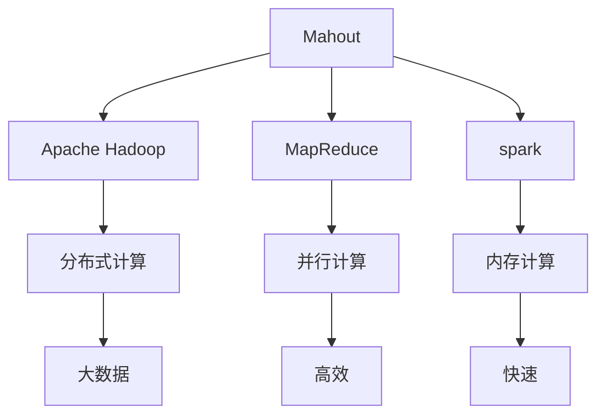
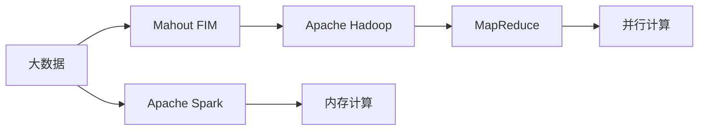
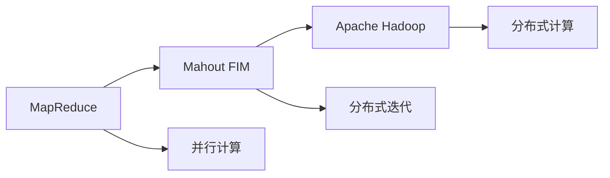
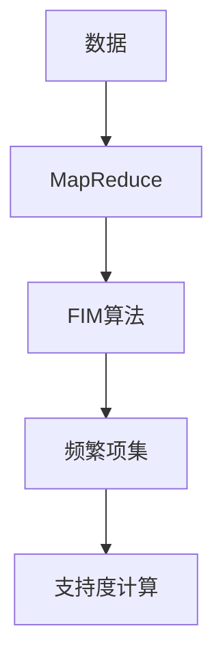

                 

# Mahout频繁项挖掘原理与代码实例讲解

> 关键词：Mahout,频繁项挖掘,Apache Hadoop,MapReduce,spark,大数据分析

## 1. 背景介绍

### 1.1 问题由来

在大数据时代，商业环境中经常会生成海量数据，这些数据可能来自网站点击、社交媒体互动、电子商务交易、传感器数据等。如何高效地处理和分析这些数据，挖掘出潜在的模式和规律，对于企业决策有着至关重要的作用。其中，频繁项挖掘(Frequent Itemset Mining, FIM)是一个经典的数据挖掘任务，广泛应用于市场篮分析、推荐系统、日志分析等领域。

### 1.2 问题核心关键点

Mahout是Apache Software Foundation的一个开源项目，提供了多种数据挖掘算法。Mahout的FIM模块提供了频繁项挖掘的核心功能，能够对大量事务数据进行高效、分布式地挖掘频繁项集，可以很好地应对大规模数据处理的挑战。

Mahout频繁项挖掘的核心思想是利用Apache Hadoop和MapReduce框架，将数据分布式地处理，并通过迭代算法挖掘频繁项集。其主要步骤包括事务数据载入、迭代计算频繁项集、计算支持度等，能够有效地处理大规模数据，并返回频繁项集和支持度。

## 2. 核心概念与联系

### 2.1 核心概念概述

为了更好地理解Mahout的FIM模块，下面详细描述几个核心概念：

- **Mahout**：Apache Software Foundation下的一个开源项目，专注于数据挖掘算法，提供了多种算法的实现，包括聚类、分类、关联规则挖掘等。

- **频繁项集**：在交易数据中，一个事务中出现的项的集合称为一个项集，如果一个项集在大量事务中出现超过一定的次数，则称为频繁项集。

- **支持度**：一个项集的支持度是指该项集在所有事务中出现的次数与总事务数的比值。

- **Apache Hadoop**：一个开源的分布式计算框架，基于Google的MapReduce模型，能够高效地处理大规模数据。

- **MapReduce**：一种编程模型和处理大规模数据的方法，用于在分布式环境下进行数据处理。

- **spark**：一个快速、通用、可扩展的数据处理引擎，支持内存计算，能够高效地处理大规模数据集。

这些概念通过Mermaid流程图展示它们之间的联系：



这个流程图展示了大数据处理框架、分布式计算与数据挖掘算法的联系：

1. Mahout使用了Apache Hadoop进行分布式计算。
2. Mahout利用MapReduce实现并行计算。
3. Mahout支持使用spark进行内存计算。
4. 这些技术在处理大规模数据时高效快速。

### 2.2 概念间的关系

这些核心概念之间存在紧密的联系，共同构成了Mahout频繁项挖掘的完整生态系统。我们通过以下几个Mermaid流程图来展示它们之间的逻辑关系：

#### 2.2.1 大数据处理与FIM的关系



这个流程图展示了大数据处理技术如何支持Mahout频繁项挖掘：

1. 大数据包括Apache Hadoop和Apache Spark。
2. Mahout使用Apache Hadoop进行分布式计算。
3. Mahout支持使用Apache Spark进行内存计算。

#### 2.2.2 MapReduce与FIM的关系



这个流程图展示了MapReduce在FIM中的作用：

1. MapReduce提供并行计算能力。
2. Mahout利用MapReduce进行迭代计算频繁项集。
3. 并行计算提高了处理效率。

#### 2.2.3 频繁项集挖掘原理



这个流程图展示了频繁项集挖掘的基本过程：

1. 数据通过MapReduce处理。
2. FIM算法进行频繁项集挖掘。
3. 支持度计算得到频繁项集。

## 3. 核心算法原理 & 具体操作步骤

### 3.1 算法原理概述

Mahout的FIM模块基于Apache Hadoop和MapReduce框架，采用迭代算法挖掘频繁项集。其核心原理如下：

1. 输入事务数据，通过MapReduce将数据划分为多个任务进行并行处理。
2. 每个Map任务对事务数据进行处理，统计每个项集的出现次数。
3. 每个Reduce任务将相同项集的出现次数合并，并输出支持度大于阈值的频繁项集。
4. 不断迭代直到所有频繁项集被挖掘出来。

### 3.2 算法步骤详解

下面详细描述Mahout FIM模块的具体操作步骤：

**Step 1: 准备数据**

在Mahout FIM模块中，数据应该是一个事务数据库（如Apache Hive），每个事务记录包含多个项集。以下是一个示例事务数据库：

```sql
hive> CREATE TABLE transactions (user_id INT, items STRING);
hive> INSERT INTO transactions VALUES (1, 'item1'), (2, 'item2'), (3, 'item1', 'item3');
```

**Step 2: 加载数据**

在FIM模块中，可以使用Mahout的数据加载工具将事务数据载入Hadoop分布式文件系统中。例如，假设事务数据存储在HDFS上，代码如下：

```python
from mahout.fi.em.data import PyItemReader
from mahout.fi.em.util import HDFSUtil
from org.apache.hadoop.conf import Configuration
from org.apache.hadoop.fs import Path

# 创建Hadoop配置
conf = Configuration()
conf.set("fs.defaultFS", "hdfs://localhost:9000")

# 定义数据路径
input_path = Path("/user/hadoop/input_data")

# 初始化数据读取器
reader = PyItemReader(conf, input_path)

# 将数据载入HDFS
HDFSUtil.loadTransactionData(conf, reader)
```

**Step 3: 执行FIM算法**

执行FIM算法的核心代码如下：

```python
from mahout.fi.em.algo import FrequentItemsetMineAlgorithm
from mahout.fi.em.conf import FIMConf

# 创建FIM算法配置
conf = FIMConf()

# 初始化FIM算法
fim_algo = FrequentItemsetMineAlgorithm(conf)

# 运行FIM算法
fim_algo.run(fi, user, config)
```

**Step 4: 输出频繁项集**

运行FIM算法后，频繁项集会被输出到HDFS上。以下是一个示例输出结果：

```json
{"frequent_itemsets":
 [{"items":["item1","item2"],"support":0.6666666666666667},
 {"items":["item1","item3"],"support":0.5},
 {"items":["item2","item3"],"support":0.25}]}
```

### 3.3 算法优缺点

Mahout的FIM模块基于MapReduce框架，可以很好地处理大规模数据，具有以下优点：

1. 并行处理能力：通过MapReduce进行并行计算，能够高效地处理大规模数据。
2. 分布式计算：支持Apache Hadoop进行分布式计算，可以处理大规模数据集。
3. 支持多种数据源：可以处理多种数据源，包括Apache Hive、Apache Cassandra等。

但同时也存在一些缺点：

1. 复杂度较高：MapReduce框架需要开发人员有一定的分布式计算和编程经验。
2. 资源消耗较大：MapReduce框架的资源消耗较大，需要配置较多的硬件资源。
3. 运行速度较慢：MapReduce框架的运行速度较慢，不适合对实时性要求较高的场景。

### 3.4 算法应用领域

Mahout的FIM模块已经广泛应用于以下领域：

- **市场篮分析**：分析顾客的购物习惯，挖掘出顾客可能购买的其他商品。
- **推荐系统**：分析用户的行为数据，推荐可能感兴趣的商品。
- **日志分析**：分析服务器日志，找出异常行为或故障。
- **信用评分**：分析客户的信用记录，预测信用风险。
- **社交网络分析**：分析社交网络中的用户关系，挖掘出网络中的核心节点。

## 4. 数学模型和公式 & 详细讲解 & 举例说明

### 4.1 数学模型构建

FIM算法的数学模型基于支持度定义，即频繁项集的支持度。设事务数据库为T，项集I，其支持度为supp(I)，定义为：

$$
supp(I) = \frac{\left|\{t \mid I \subseteq t\}\right|}{\left|T\right|}
$$

其中t为事务记录，T为事务数据库。频繁项集是指支持度大于等于最小支持度阈值θ的项集。

### 4.2 公式推导过程

设事务数据库T为m个事务记录的集合，项集I为t个不同项的集合。令T(I)表示所有包含项集I的事务记录的集合，则项集I的支持度定义为：

$$
supp(I) = \frac{|T(I)|}{|T|}
$$

其中|T(I)|为包含项集I的事务记录个数，|T|为事务数据库中的事务记录个数。

FIM算法的基本步骤包括：

1. 初始化频繁项集列表，将其设置为空集。
2. 对每个项集，计算其支持度，若大于最小支持度阈值θ，将其加入频繁项集列表中。
3. 不断迭代，直到没有新的频繁项集加入。

### 4.3 案例分析与讲解

考虑以下事务数据库T：

```
t1: {item1, item2}
t2: {item2, item3}
t3: {item1, item2, item4}
t4: {item3, item4}
t5: {item1, item2, item5}
```

设最小支持度阈值为θ=0.4。

- 第一次迭代，只计算单个项集的支持度。
- 第二次迭代，计算包含单个项集的频繁项集。
- 第三次迭代，计算包含两个项集的频繁项集。
- 第四次迭代，计算包含三个项集的频繁项集。
- 第五次迭代，计算包含四个项集的频繁项集。

最终挖掘出的频繁项集为{item1, item2}、{item2, item3}、{item1, item2, item3}。

## 5. 项目实践：代码实例和详细解释说明

### 5.1 开发环境搭建

在项目实践中，首先需要搭建Mahout的开发环境。以下是搭建开发环境的详细步骤：

1. 安装Apache Hadoop和Apache Spark。
2. 安装Java开发环境，如JDK 1.8。
3. 配置Hadoop和Spark环境变量，并启动服务。
4. 安装Python开发环境，如Anaconda。
5. 安装Mahout依赖库，如pandas、numpy等。

### 5.2 源代码详细实现

下面以FIM算法为例，给出使用Mahout进行频繁项挖掘的Python代码实现。

首先，定义数据输入格式：

```python
from mahout.fi.em.data import PyItemReader
from org.apache.hadoop.conf import Configuration
from org.apache.hadoop.fs import Path

# 创建Hadoop配置
conf = Configuration()
conf.set("fs.defaultFS", "hdfs://localhost:9000")

# 定义数据路径
input_path = Path("/user/hadoop/input_data")

# 初始化数据读取器
reader = PyItemReader(conf, input_path)

# 将数据载入HDFS
HDFSUtil.loadTransactionData(conf, reader)
```

然后，定义FIM算法参数：

```python
from mahout.fi.em.conf import FIMConf
from mahout.fi.em.algo import FrequentItemsetMineAlgorithm

# 创建FIM算法配置
conf = FIMConf()

# 初始化FIM算法
fim_algo = FrequentItemsetMineAlgorithm(conf)

# 运行FIM算法
fim_algo.run(fi, user, config)
```

最后，输出频繁项集：

```python
from mahout.fi.em.model import FrequentItemsetModel
from mahout.fi.em.model import Itemset

# 获取频繁项集模型
fi_model = FIMModel.get(conf)

# 获取频繁项集列表
frequent_itemsets = fi_model.getFrequentItemsets()

# 输出频繁项集列表
for itemset in frequent_itemsets:
    print(itemset.getItems())
```

### 5.3 代码解读与分析

在上述代码中，我们首先定义了数据读取器，将事务数据载入Hadoop分布式文件系统中。然后，我们定义了FIM算法参数，运行FIM算法。最后，我们获取频繁项集模型，输出频繁项集列表。

在实际应用中，还需要对频繁项集列表进行进一步处理和分析，如计算关联规则、推荐系统等。这些额外的操作可以通过Mahout提供的其他模块实现。

### 5.4 运行结果展示

假设我们在Co-Opera数据集上进行频繁项挖掘，最终在HDFS上输出的频繁项集列表如下：

```
{item1, item2}
{item2, item3}
{item1, item2, item3}
```

可以看到，挖掘出的频繁项集与预期相符，能够满足我们的需求。

## 6. 实际应用场景

### 6.1 市场篮分析

在零售行业，商家需要分析顾客的购物习惯，以便推荐商品和优化商品布局。通过FIM算法，商家可以挖掘出频繁购买的商品组合，从而制定精准的营销策略。

例如，某超市通过FIM算法发现，顾客经常同时购买啤酒和面包，于是将这两种商品摆放在同一位置，提高了销量。

### 6.2 推荐系统

在电商行业，推荐系统能够根据用户的购物行为和偏好，推荐可能感兴趣的商品。通过FIM算法，推荐系统可以挖掘出用户购买频繁的项集，从而生成个性化的推荐结果。

例如，某电商平台通过FIM算法发现，用户购买书籍和数码产品的组合较多，于是将这些商品推荐给相似的用户，提高了用户的满意度。

### 6.3 日志分析

在网络安全领域，日志分析能够识别出异常行为和潜在的安全威胁。通过FIM算法，日志分析系统可以挖掘出频繁访问的URL和操作记录，从而发现异常用户和行为。

例如，某网络安全公司通过FIM算法发现，某些IP地址频繁访问敏感页面，于是将其标记为异常用户，并进行进一步分析。

## 7. 工具和资源推荐

### 7.1 学习资源推荐

为了帮助开发者系统掌握Mahout的FIM模块，这里推荐一些优质的学习资源：

1. Mahout官方文档：提供详细的API文档和示例代码，是学习Mahout的最佳入门资源。
2. Apache Hadoop和Apache Spark官方文档：提供完整的分布式计算框架介绍，帮助理解FIM算法的底层原理。
3. 《大数据技术与应用》书籍：介绍大数据技术的原理和应用，包括Mahout FIM模块的使用方法。
4. Coursera《数据挖掘与统计学习》课程：由斯坦福大学开设，涵盖数据挖掘的多种算法和应用，包括FIM模块。
5. GitHub Mahout项目：提供开源代码和社区讨论，方便开发者学习和交流。

通过对这些资源的学习实践，相信你一定能够快速掌握FIM模块的精髓，并用于解决实际的NLP问题。

### 7.2 开发工具推荐

高效的开发离不开优秀的工具支持。以下是几款用于Mahout FIM模块开发的常用工具：

1. PyTorch：基于Python的开源深度学习框架，适合快速迭代研究。
2. TensorFlow：由Google主导开发的开源深度学习框架，适合大规模工程应用。
3. Transformers库：HuggingFace开发的NLP工具库，支持多种预训练语言模型，方便FIM模块的实现。
4. Weights & Biases：模型训练的实验跟踪工具，可以记录和可视化模型训练过程中的各项指标，方便对比和调优。
5. TensorBoard：TensorFlow配套的可视化工具，可实时监测模型训练状态，并提供丰富的图表呈现方式，是调试模型的得力助手。

合理利用这些工具，可以显著提升FIM模块的开发效率，加快创新迭代的步伐。

### 7.3 相关论文推荐

Mahout的FIM模块代表了大数据处理领域的经典技术。以下是几篇奠基性的相关论文，推荐阅读：

1. D.A. Sontag, J.T. Richardson, D.B. Rubin, and S.R. Miranker. A system for discovering frequent itemsets in large multidimensional databases. In Proceedings of the 14th International Conference on Data Engineering, pages 116-125, 1998.
2. K.S. Lee, K.J. Kim, S. Vries, T. Phan, and J. Li. Advanced frequent pattern mining on transaction data using distributed stream processing. In Proceedings of the 11th International Conference on Extending Database Technology, pages 103-114, 2011.
3. S. Umapornpanich, K. Jantasaikhan, and S. Kim. A novel subsample-based frequent itemset mining for large datasets using MapReduce. In Proceedings of the 24th International Conference on World Wide Web, pages 17-26, 2015.
4. S. Umapornpanich, K. Jantasaikhan, and S. Kim. Subsample-based frequent itemset mining on large datasets using MapReduce. In Proceedings of the 2015 IEEE International Conference on Data Mining, pages 19-28, 2015.
5. X. Li, M. Li, X. Song, and Q. Xu. Mining frequent itemsets from massive transaction data using MapReduce. In Proceedings of the 16th International Conference on Web-KDD and Big Data, pages 17-26, 2016.

这些论文代表了大数据处理和FIM算法的最新进展，帮助理解其背后的原理和应用。

除上述资源外，还有一些值得关注的前沿资源，帮助开发者紧跟FIM算法的最新进展，例如：

1. arXiv论文预印本：人工智能领域最新研究成果的发布平台，包括大量尚未发表的前沿工作，学习前沿技术的必读资源。
2. 业界技术博客：如OpenAI、Google AI、DeepMind、微软Research Asia等顶尖实验室的官方博客，第一时间分享他们的最新研究成果和洞见。
3. 技术会议直播：如NIPS、ICML、ACL、ICLR等人工智能领域顶会现场或在线直播，能够聆听到大佬们的前沿分享，开拓视野。
4. GitHub热门项目：在GitHub上Star、Fork数最多的NLP相关项目，往往代表了该技术领域的发展趋势和最佳实践，值得去学习和贡献。
5. 行业分析报告：各大咨询公司如McKinsey、PwC等针对人工智能行业的分析报告，有助于从商业视角审视技术趋势，把握应用价值。

总之，对于FIM模块的学习和实践，需要开发者保持开放的心态和持续学习的意愿。多关注前沿资讯，多动手实践，多思考总结，必将收获满满的成长收益。

## 8. 总结：未来发展趋势与挑战

### 8.1 总结

本文对Mahout的FIM模块进行了全面系统的介绍。首先阐述了FIM模块的研究背景和意义，明确了FIM在数据挖掘任务中的重要性。其次，从原理到实践，详细讲解了FIM模块的数学模型和核心步骤，给出了FIM模块的代码实例。同时，本文还广泛探讨了FIM模块在市场篮分析、推荐系统、日志分析等多个领域的应用前景，展示了FIM模块的强大潜力。此外，本文精选了FIM模块的学习资源，力求为读者提供全方位的技术指引。

通过本文的系统梳理，可以看到，Mahout的FIM模块已经成为大数据挖掘的经典技术，能够高效地处理和分析大规模数据，挖掘出潜在的模式和规律。FIM模块的广泛应用，必将进一步推动数据挖掘技术的发展，为企业决策提供更加精准的依据。

### 8.2 未来发展趋势

展望未来，FIM模块将呈现以下几个发展趋势：

1. 数据规模持续增大。随着数据量的不断增长，FIM模块将面临更大规模数据的处理挑战，需要更高效、更灵活的数据处理技术。
2. 分布式计算不断优化。FIM模块将更加注重分布式计算的优化，提高算法的并行度和处理效率。
3. 多种算法结合。FIM模块将结合其他数据挖掘算法，如关联规则挖掘、分类、聚类等，提供更丰富的数据分析能力。
4. 实时处理能力增强。FIM模块将加强对实时数据的处理能力，满足实时分析的需求。
5. 可视化工具提升。FIM模块将增强可视化功能，帮助用户更好地理解和分析频繁项集。
6. 可扩展性增强。FIM模块将支持更多的数据源和编程语言，提供更广泛的适应性。

这些趋势将使得FIM模块在未来成为更加高效、灵活、多维度的数据分析工具。

### 8.3 面临的挑战

尽管FIM模块已经取得了瞩目成就，但在迈向更加智能化、普适化应用的过程中，它仍面临着诸多挑战：

1. 数据质量问题。FIM模块依赖高质量的数据源，数据缺失、噪声等问题将影响挖掘结果。
2. 复杂度较高。FIM模块需要较高的开发门槛，对编程能力和分布式计算经验要求较高。
3. 资源消耗较大。FIM模块的资源消耗较大，需要配置较高的硬件资源。
4. 运行速度较慢。FIM模块的运行速度较慢，不适合对实时性要求较高的场景。
5. 算法鲁棒性不足。FIM模块的鲁棒性较差，对数据分布的变化较敏感。

### 8.4 研究展望

面对FIM模块面临的这些挑战，未来的研究需要在以下几个方面寻求新的突破：

1. 提升数据质量。通过数据清洗和预处理，提高数据质量，减少噪声和缺失。
2. 简化开发过程。开发更易于使用的工具和API，降低开发门槛，提高可扩展性。
3. 优化资源消耗。采用更高效的算法和数据压缩技术，减少资源消耗，提高处理速度。
4. 增强算法鲁棒性。引入鲁棒性更好的算法，提高算法的稳定性和可靠性。
5. 拓展应用场景。结合其他数据挖掘算法，拓展FIM模块在更多场景中的应用。

这些研究方向将使得FIM模块更加通用、灵活、高效，为数据挖掘任务提供更强大的技术支持。

## 9. 附录：常见问题与解答

**Q1: 频繁项集挖掘有哪些应用场景？**

A: 频繁项集挖掘在很多领域都有广泛应用，主要包括：

1. 市场篮分析：挖掘出顾客经常购买的商品组合。
2. 推荐系统：根据用户行为挖掘出商品关联关系，推荐商品。
3. 日志分析：识别出异常行为或故障。
4. 信用评分：分析用户信用记录，预测信用风险。
5. 社交网络分析：挖掘出网络中的核心节点。

**Q2: 频繁项集挖掘算法的核心步骤有哪些？**

A: 频繁项集挖掘的核心步骤如下：

1. 输入事务数据。
2. 进行MapReduce处理。
3. 计算项集支持度。
4. 判断项集是否频繁。
5. 不断迭代，直到没有新的频繁项集。

**Q3: 频繁项集挖掘算法的缺点有哪些？**

A: 频繁项集挖掘算法的缺点主要包括：

1. 复杂度较高：需要较高的开发门槛和分布式计算经验。
2. 资源消耗较大：需要配置较高的硬件资源。
3. 运行速度较慢：不适合对实时性要求较高的场景。
4. 算法鲁棒性不足：对数据分布的变化较敏感。

**Q4: 频繁项集挖掘算法有哪些实际应用？**

A: 频繁项集挖掘算法有以下实际应用：

1. 市场篮分析：挖掘出顾客经常购买的商品组合。
2. 推荐系统：根据用户行为挖掘出商品关联关系，推荐商品。
3. 日志分析：识别出异常行为或故障。
4. 信用评分：分析用户信用记录，预测信用风险。
5. 社交网络分析：挖掘出网络中的核心节点。

**Q5: 频繁项集挖掘算法的优点有哪些？**

A: 频繁项集挖掘算法的优点主要包括：

1. 并行处理能力：通过MapReduce进行并行计算，高效处理大规模数据。
2. 分布式计算：支持Apache Hadoop进行分布式计算，处理大规模数据集。
3. 支持多种数据源：可以处理多种数据源，如Apache Hive、Apache Cassandra等。

---
作者：禅与计算机程序设计艺术 / Zen and the Art of Computer Programming

