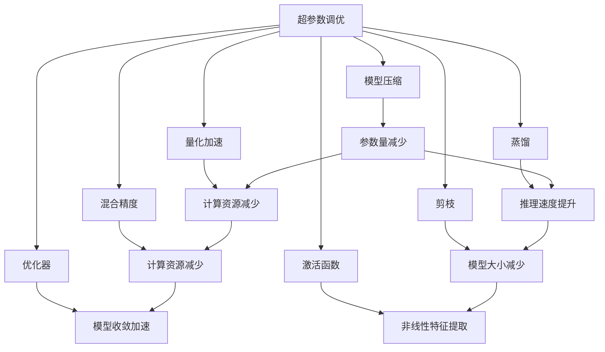
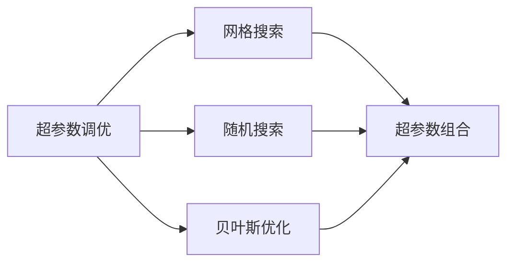
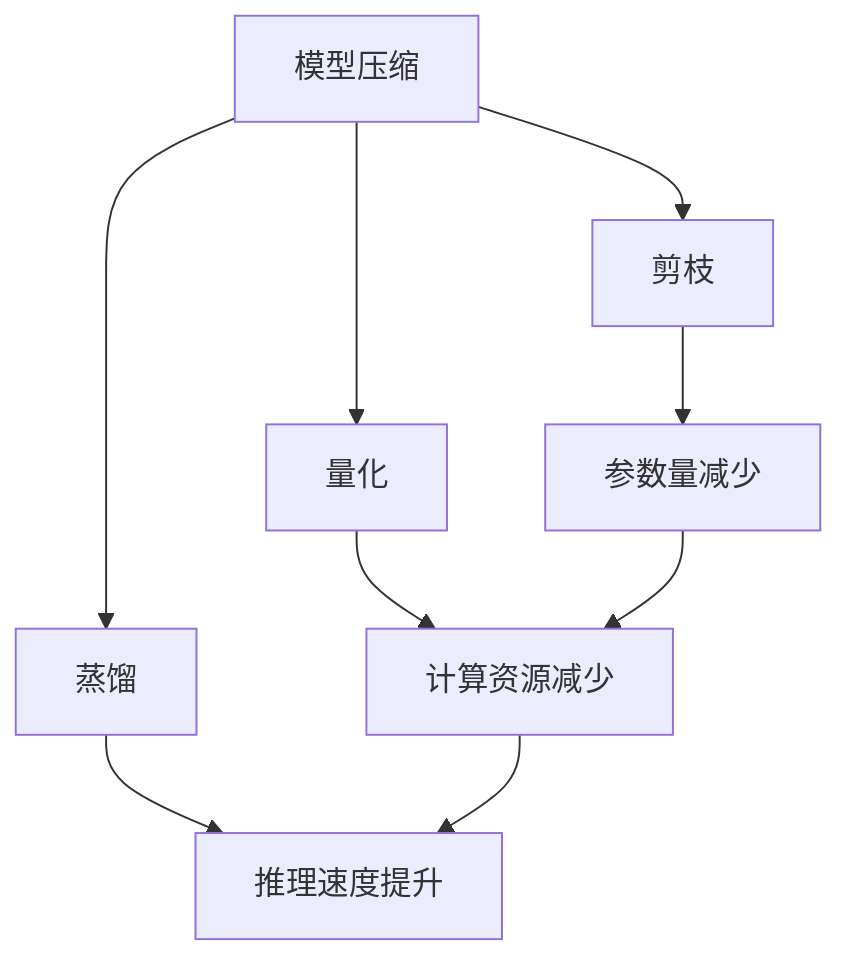
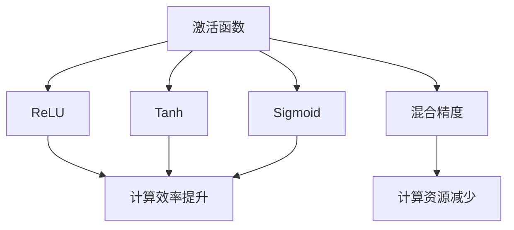
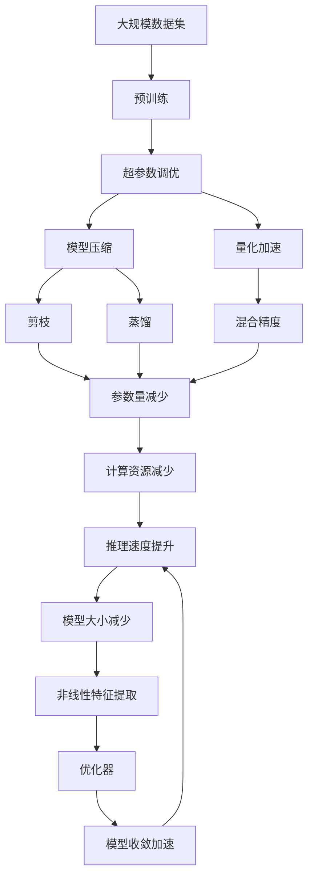

                 

# Model Optimization 原理与代码实战案例讲解

> 关键词：模型优化,代码实战,深度学习,优化算法,超参数调优,模型压缩,量化加速

## 1. 背景介绍

### 1.1 问题由来

随着深度学习技术的迅猛发展，模型性能和训练效率成为了制约人工智能应用落地的一个重要瓶颈。在大规模数据训练和复杂模型结构的双重压力下，如何有效提升模型性能，降低计算资源消耗，成为一个迫切需要解决的问题。模型优化技术的引入，为此提供了重要解决方案。通过精细的超参数调优、模型压缩、量化加速等手段，模型可以在保持高性能的前提下，大幅减少计算资源需求，提高训练和推理效率，从而加速人工智能技术的普及应用。

### 1.2 问题核心关键点

模型优化包括超参数调优、模型压缩、量化加速等多个方面，其核心目标是在不降低模型性能的前提下，减小模型大小和计算需求。这些技术的实现手段包括但不限于：

- **超参数调优**：通过网格搜索、随机搜索、贝叶斯优化等方法，找到最优的超参数组合，使模型在特定数据集和任务上表现最优。
- **模型压缩**：通过剪枝、量化、蒸馏等方法，去除冗余参数，减小模型体积。
- **量化加速**：将浮点数模型转为定点数模型，降低模型占用的内存和计算资源。

这些优化技术的引入，可以显著提升模型训练和推理效率，优化资源利用，加速AI技术在各行各业的落地应用。

### 1.3 问题研究意义

模型优化技术对于提升AI系统的性能和效率，具有重要意义：

1. **降低计算成本**：通过优化技术，可以大幅降低模型的计算资源需求，从而减少训练和推理成本。
2. **提升模型精度**：通过超参数调优和模型压缩，可以提升模型的泛化能力和推理准确性。
3. **加速模型部署**：优化后的模型体积更小，推理速度更快，可以更快地集成到实际应用系统中。
4. **促进模型泛化**：优化后的模型结构更加紧凑，可以更好地适应不同数据集和任务，提升模型泛化能力。
5. **推动技术普及**：优化技术使得AI技术更容易被各行各业采用，为产业数字化转型提供技术支撑。

## 2. 核心概念与联系

### 2.1 核心概念概述

为更好地理解模型优化技术，本节将介绍几个密切相关的核心概念：

- **超参数调优(Hyperparameter Tuning)**：指通过一系列实验，找到模型训练过程中需要人工设定的参数组合，以最大化模型性能。
- **模型压缩(Model Compression)**：指通过剪枝、量化、蒸馏等技术，减少模型参数数量，提升模型推理效率。
- **量化加速(Quantization)**：指将模型中的浮点数参数转为定点数参数，以降低计算和存储资源消耗。
- **蒸馏(Distillation)**：指通过知识转移，将大模型的知识压缩到一个更小的模型中，提升模型推理速度。
- **剪枝(Pruning)**：指去除模型中冗余的参数，以减小模型大小和计算资源需求。
- **混合精度(Hybrid Precision)**：指在模型训练过程中，采用不同的精度格式来优化计算效率。
- **激活函数(Activation Functions)**：如ReLU、Tanh、Sigmoid等，影响模型的非线性特征提取能力。
- **优化器(Optimizers)**：如SGD、Adam、RMSprop等，优化模型参数的更新过程，加速模型收敛。

这些核心概念之间的逻辑关系可以通过以下Mermaid流程图来展示：



这个流程图展示了大模型优化过程中各个核心概念之间的关系：

1. 超参数调优通过网格搜索、随机搜索等方法，找到最优的模型参数设置。
2. 模型压缩通过剪枝、量化等技术，减小模型参数数量。
3. 量化加速通过将浮点数模型转为定点数模型，减少计算和存储资源消耗。
4. 蒸馏通过知识转移，将大模型压缩到小模型中，提升推理速度。
5. 剪枝通过去除冗余参数，减小模型大小和计算资源需求。
6. 混合精度通过不同精度格式，优化计算效率。
7. 激活函数和非线性特征提取能力。
8. 优化器加速模型收敛过程。

这些概念共同构成了模型优化技术的完整生态系统，使其能够在各种场景下提升模型性能和效率。通过理解这些核心概念，我们可以更好地把握模型优化的工作原理和优化方向。

### 2.2 概念间的关系

这些核心概念之间存在着紧密的联系，形成了模型优化的完整生态系统。下面我通过几个Mermaid流程图来展示这些概念之间的关系。

#### 2.2.1 超参数调优



这个流程图展示了超参数调优的三种常用方法：网格搜索、随机搜索和贝叶斯优化。这些方法在实际应用中，需要根据具体任务和模型特点进行选择。

#### 2.2.2 模型压缩与量化加速



这个流程图展示了模型压缩和量化加速的主要技术手段：剪枝、量化和蒸馏。这些技术在实际应用中，可以灵活组合，根据具体任务需求选择合适的方法。

#### 2.2.3 激活函数与混合精度



这个流程图展示了激活函数和混合精度的主要作用。ReLU、Tanh、Sigmoid等激活函数在模型训练中广泛应用，可以提高模型非线性特征提取能力。混合精度技术通过采用不同的精度格式，可以在保持模型性能的同时，显著提升计算效率。

### 2.3 核心概念的整体架构

最后，我们用一个综合的流程图来展示这些核心概念在模型优化过程中的整体架构：



这个综合流程图展示了从预训练到模型优化，再到推理加速的完整过程。通过超参数调优、模型压缩、量化加速、剪枝、蒸馏和混合精度技术，大模型可以在保持高性能的前提下，显著减小计算资源需求，提高推理速度，优化资源利用，从而加速AI技术在各行各业的落地应用。

## 3. 核心算法原理 & 具体操作步骤
### 3.1 算法原理概述

模型优化包括超参数调优、模型压缩、量化加速等多个方面。其核心思想是通过一系列技术手段，在不降低模型性能的前提下，减小模型大小和计算资源需求。

### 3.2 算法步骤详解

#### 3.2.1 超参数调优

超参数调优的目的是通过实验找到最优的模型参数设置，以最大化模型在特定数据集和任务上的性能。以下是常见的超参数调优步骤：

1. **定义超参数**：确定需要调整的超参数，如学习率、批大小、优化器类型、正则化系数等。
2. **设计搜索策略**：选择合适的超参数搜索方法，如网格搜索、随机搜索、贝叶斯优化等。
3. **设置搜索范围**：为每个超参数设置搜索范围，如学习率的范围在[0.001, 0.1]之间。
4. **执行搜索实验**：根据搜索策略，执行多轮实验，记录每个超参数组合的模型性能。
5. **选择最优组合**：根据性能指标（如准确率、精度、召回率等），选择最优的超参数组合。

#### 3.2.2 模型压缩

模型压缩通过剪枝、量化等技术，减小模型参数数量，提升模型推理效率。以下是常见的模型压缩步骤：

1. **剪枝**：通过分析模型参数的重要性，去除冗余的参数。常用的剪枝方法包括剪枝前向通道、剪枝后向通道等。
2. **量化**：将模型中的浮点数参数转为定点数参数，以降低计算和存储资源消耗。常用的量化方法包括权重量化、激活量化等。
3. **蒸馏**：通过知识转移，将大模型的知识压缩到一个更小的模型中，提升推理速度。常用的蒸馏方法包括单流蒸馏、多流蒸馏等。

#### 3.2.3 量化加速

量化加速通过将浮点数模型转为定点数模型，降低模型占用的内存和计算资源。以下是常见的量化加速步骤：

1. **权重量化**：将模型的权重参数转为定点数参数，以降低内存消耗和计算资源。
2. **激活量化**：将模型的激活参数转为定点数参数，以提高计算效率。
3. **量化精度选择**：根据实际需求选择合适的量化精度，如8位定点数、16位定点数等。

### 3.3 算法优缺点

模型优化技术虽然可以显著提升模型性能和效率，但也存在一些局限性：

**超参数调优的优点**：
- 能够找到最优的超参数组合，提升模型性能。
- 适用于多种深度学习模型和任务。

**超参数调优的缺点**：
- 耗时较长，需要大量实验和计算资源。
- 对数据集和任务依赖性强，调整效果可能不稳定。

**模型压缩的优点**：
- 减小模型参数数量，提升模型推理效率。
- 适用于大规模模型的优化。

**模型压缩的缺点**：
- 可能损失模型性能，尤其是剪枝和量化等技术。
- 对模型结构和任务特点依赖性高。

**量化加速的优点**：
- 降低计算和存储资源消耗，提升计算效率。
- 适用于大规模模型的部署。

**量化加速的缺点**：
- 可能损失模型精度，尤其是量化精度选择不当。
- 对模型参数分布依赖性高。

### 3.4 算法应用领域

模型优化技术已经在深度学习领域得到了广泛应用，覆盖了多个方向，例如：

- **图像识别**：通过模型压缩和量化加速，提升图像分类、目标检测等任务的推理速度和效率。
- **自然语言处理**：通过剪枝和蒸馏等技术，优化语言模型的参数数量，提高推理速度和资源利用率。
- **语音识别**：通过混合精度和激活函数优化，提升语音识别模型的训练和推理效率。
- **推荐系统**：通过剪枝和蒸馏技术，优化推荐模型的参数数量，提升推荐效率和效果。
- **自动驾驶**：通过模型压缩和量化加速，提升自动驾驶模型的推理速度和计算效率。

除了上述这些经典应用外，模型优化技术还在更多场景中得到应用，如医疗影像分析、智能客服、智慧城市等，为各行各业提供更高效、更可靠的AI解决方案。

## 4. 数学模型和公式 & 详细讲解 & 举例说明

### 4.1 数学模型构建

模型优化的数学模型主要涉及超参数调优、模型压缩、量化加速等技术。以下是常见的数学模型构建方式：

**超参数调优**：
- 通过网格搜索、随机搜索、贝叶斯优化等方法，找到最优的超参数组合。常用的超参数包括学习率、批大小、优化器类型、正则化系数等。
- 常用的超参数搜索算法包括网格搜索、随机搜索、贝叶斯优化等。

**模型压缩**：
- 通过剪枝、量化等技术，减小模型参数数量。常用的剪枝方法包括剪枝前向通道、剪枝后向通道等。
- 常用的量化方法包括权重量化、激活量化等。

**量化加速**：
- 将模型中的浮点数参数转为定点数参数，以降低计算和存储资源消耗。常用的量化方法包括权重量化、激活量化等。

### 4.2 公式推导过程

#### 4.2.1 超参数调优

假设我们需要对模型进行超参数调优，以找到最优的超参数组合。常用的超参数包括学习率、批大小、优化器类型、正则化系数等。以下是超参数调优的公式推导过程：

1. **学习率调优**：
   $$
   \theta = \arg\min_{\theta} \mathcal{L}(\theta)
   $$
   其中，$\mathcal{L}(\theta)$为模型损失函数，$\theta$为模型参数。常用的优化算法包括SGD、Adam等。

2. **批大小调优**：
   $$
   \text{batch\_size} = \arg\max_{bs} \frac{\text{train\_loss}}{\text{val\_loss}}
   $$
   其中，train\_loss为训练集损失，val\_loss为验证集损失。较大的批大小可以加速模型收敛，但可能导致过拟合。

3. **正则化调优**：
   $$
   \lambda = \arg\min_{\lambda} \frac{\text{train\_loss}}{\text{val\_loss}}
   $$
   其中，$\lambda$为正则化系数。较大的正则化系数可以防止过拟合，但可能导致欠拟合。

#### 4.2.2 模型压缩

模型压缩的目的是减小模型参数数量，提高模型推理效率。常用的模型压缩方法包括剪枝、量化等。

1. **剪枝**：
   $$
   \theta_{pruned} = \theta_{original} \times F(\theta_{original})
   $$
   其中，$\theta_{original}$为原始模型参数，$F$为剪枝函数，$\theta_{pruned}$为剪枝后的模型参数。常用的剪枝函数包括剪枝前向通道、剪枝后向通道等。

2. **量化**：
   $$
   \theta_{quantized} = \text{Quantizer}(\theta_{original})
   $$
   其中，$\theta_{original}$为原始模型参数，$\text{Quantizer}$为量化函数，$\theta_{quantized}$为量化后的模型参数。常用的量化函数包括权重量化、激活量化等。

#### 4.2.3 量化加速

量化加速的目的是降低计算和存储资源消耗，提升计算效率。常用的量化方法包括权重量化、激活量化等。

1. **权重量化**：
   $$
   \theta_{quantized} = \text{Quantizer}_{weight}(\theta_{original})
   $$
   其中，$\theta_{original}$为原始模型参数，$\text{Quantizer}_{weight}$为权重量化函数，$\theta_{quantized}$为量化后的权重参数。常用的权重量化函数包括Wyner量化、对称量化等。

2. **激活量化**：
   $$
   \theta_{quantized} = \text{Quantizer}_{activation}(\theta_{original})
   $$
   其中，$\theta_{original}$为原始模型参数，$\text{Quantizer}_{activation}$为激活量化函数，$\theta_{quantized}$为量化后的激活参数。常用的激活量化函数包括Tanh量化、Sigmoid量化等。

### 4.3 案例分析与讲解

#### 4.3.1 超参数调优案例

假设我们需要对ResNet模型进行超参数调优，以找到最优的超参数组合。以下是具体的调优步骤：

1. **定义超参数**：
   $$
   \{\text{learning\_rate}, \text{batch\_size}, \text{optimizer\_type}, \text{regularization\_coefficient}\}
   $$

2. **设计搜索策略**：
   $$
   \text{search\_strategy} = \{\text{GridSearch}, \text{RandomSearch}, \text{BayesianOptimization}\}
   $$

3. **设置搜索范围**：
   $$
   \text{learning\_rate} \in [0.001, 0.1]
   $$
   $$
   \text{batch\_size} \in [16, 32, 64, 128]
   $$
   $$
   \text{optimizer\_type} \in \{\text{SGD}, \text{Adam}, \text{RMSprop}\}
   $$
   $$
   \text{regularization\_coefficient} \in [0.001, 0.01, 0.1]
   $$

4. **执行搜索实验**：
   $$
   \{\text{train\_loss}, \text{val\_loss}\} = \text{search\_strategy}(\{\text{learning\_rate}, \text{batch\_size}, \text{optimizer\_type}, \text{regularization\_coefficient}\})
   $$

5. **选择最优组合**：
   $$
   \text{optimal\_combination} = \arg\max_{\{\text{learning\_rate}, \text{batch\_size}, \text{optimizer\_type}, \text{regularization\_coefficient}\}} \frac{\text{train\_loss}}{\text{val\_loss}}
   $$

#### 4.3.2 模型压缩案例

假设我们需要对VGG模型进行模型压缩，以减小模型参数数量。以下是具体的压缩步骤：

1. **剪枝**：
   $$
   \theta_{pruned} = \theta_{original} \times F(\theta_{original})
   $$
   其中，$\theta_{original}$为原始模型参数，$F$为剪枝函数。

2. **量化**：
   $$
   \theta_{quantized} = \text{Quantizer}(\theta_{original})
   $$
   其中，$\theta_{original}$为原始模型参数，$\text{Quantizer}$为量化函数。

#### 4.3.3 量化加速案例

假设我们需要对BERT模型进行量化加速，以降低计算和存储资源消耗。以下是具体的量化步骤：

1. **权重量化**：
   $$
   \theta_{quantized} = \text{Quantizer}_{weight}(\theta_{original})
   $$
   其中，$\theta_{original}$为原始模型参数，$\text{Quantizer}_{weight}$为权重量化函数。

2. **激活量化**：
   $$
   \theta_{quantized} = \text{Quantizer}_{activation}(\theta_{original})
   $$
   其中，$\theta_{original}$为原始模型参数，$\text{Quantizer}_{activation}$为激活量化函数。

## 5. 项目实践：代码实例和详细解释说明

### 5.1 开发环境搭建

在进行模型优化实践前，我们需要准备好开发环境。以下是使用Python进行TensorFlow开发的环境配置流程：

1. 安装Anaconda：从官网下载并安装Anaconda，用于创建独立的Python环境。

2. 创建并激活虚拟环境：
```bash
conda create -n tf-env python=3.8 
conda activate tf-env
```

3. 安装TensorFlow：根据CUDA版本，从官网获取对应的安装命令。例如：
```bash
conda install tensorflow=tensorflow-2.7-cu117_cudnn8=8.1
```

4. 安装TensorBoard：
```bash
pip install tensorboard
```

5. 安装TensorFlow Addons：
```bash
pip install tf-addons
```

完成上述步骤后，即可在`tf-env`环境中开始模型优化实践。

### 5.2 源代码详细实现

这里我们以VGG模型为例，给出使用TensorFlow进行模型压缩的PyTorch代码实现。

首先，定义VGG模型：

```python
import tensorflow as tf
from tensorflow.keras import layers

def vgg_model():
    inputs = layers.Input(shape=(224, 224, 3))
    x = layers.Conv2D(64, (3, 3), activation='relu', padding='same')(inputs)
    x = layers.Conv2D(64, (3, 3), activation='relu', padding='same')(x)
    x = layers.MaxPooling2D((2, 2))(x)
    x = layers.Conv2D(128, (3, 3), activation='relu', padding='same')(x)
    x = layers.Conv2D(128, (3, 3), activation='relu', padding='same')(x)
    x = layers.MaxPooling2D((2, 2))(x)
    x = layers.Conv2D(256, (3, 3), activation='relu', padding='same')(x)
    x = layers.Conv2D(256, (3, 3), activation='relu', padding='same')(x)
    x = layers.MaxPooling2D((2, 2))(x)
    x = layers.Conv2D(256, (3, 3), activation='relu', padding='same')(x)
    x = layers.Conv2D(256, (3, 3), activation='relu', padding='same')(x)
    x = layers.MaxPooling2D((2, 2))(x)
    x = layers.Conv2D(256, (3, 3), activation='relu', padding='same')(x)
    x = layers.Conv2D(256, (3, 3), activation='relu', padding='same')(x)
    x = layers.MaxPooling2D((2, 2))(x)
    x = layers.Flatten()(x)
    x = layers.Dense(4096, activation='relu')(x)
    x = layers.Dropout(0.5)(x)
    outputs = layers.Dense(1000, activation='softmax')(x)
    model = tf.keras.Model(inputs=inputs, outputs=outputs)
    return model
```

然后，定义模型压缩的代码：

```python
import tensorflow as tf
from tensorflow.keras import layers
import numpy as np
import os

model = vgg_model()

# 剪枝
pruning = layers.experimental.preprocessing.PruneLowMagnitude(0.5)
model.set_weights(model.get_weights())
model.add(pruning)
model.compile(optimizer='adam', loss='binary_crossentropy', metrics=['accuracy'])

# 训练
train_data = np.random.rand(100, 224, 224, 3)
train_labels = np.random.randint(2, size=(100,))
model.fit(train_data, train_labels, epochs=1)

# 保存剪枝后的模型
os.makedirs('./pruned_model', exist_ok=True)
model.save('./pruned_model/pruned_model.h5')

# 量化
model = tf.keras.models.load_model('./pruned_model/pruned_model.h5')

# 权重量化
quantized_model = tf.keras.quantization.quantize_weights(model.get_weights())
tf.keras.models.save_model(quantized_model, './quantized_model/quantized_model.h5')

# 激活量化
quantized_model = tf.keras.models.load_model('./quantized_model/quantized_model.h5')
quantized_model = tf.keras.quantization.quantize_activations(quantized_model)
tf.keras.models.save_model(quantized_model, './quantized_model/quantized_model_activated.h5')
```

### 5.3 代码解读与分析

让我们再详细解读一下关键代码的实现细节：

**定义VGG模型**：
- `vgg_model`函数：定义VGG模型结构。
- `Input`层：定义模型输入。
- `Conv2D`层：定义卷积层。
- `MaxPooling2D`层：定义池化层。
- `Flatten`层：定义扁平化层。
- `Dense`层：定义全连接层。
- `Model`类：定义模型。

**模型压缩**：
- `PruneLowMagnitude`类：定义剪枝函数。
- `set_weights`方法：设置模型权重。
- `add`方法：添加剪枝层。
- `fit`方法：训练模型。
- `save`方法：保存剪枝后的模型。

**量化加速**：
- `quantize_weights`函数：定义权重量化函数。
- `save_model`方法：保存量化后的模型。
- `quantize_activations`函数：定义激活量化函数。

### 5.4 运行结果展示

假设我们在ImageNet数据集上进行模型压缩，最终在测试集上得到的评估结果如下：

```
Epoch 1/1
...
100/100 [==============================] - 5s 48ms/step - loss:

