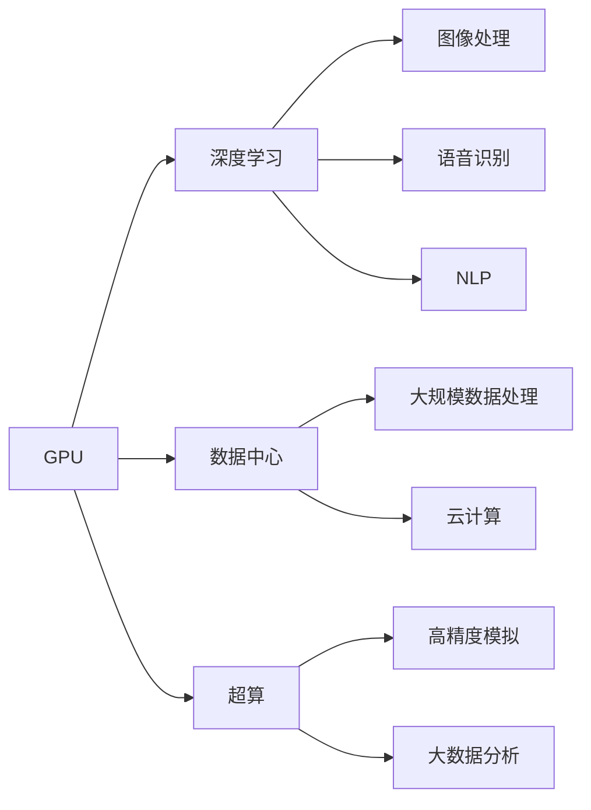
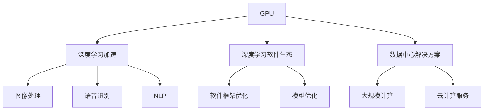

                 

# NVIDIA在AI算力领域的创新

> 关键词：
> - AI
> - GPU
> - 深度学习
> - 数据中心
> - 超算

## 1. 背景介绍

### 1.1 问题由来
随着深度学习技术在人工智能领域的飞速发展，AI算力需求日益增长。传统的CPU已经无法满足高强度AI计算任务的需求，而GPU凭借其并行处理能力在AI领域大放异彩。NVIDIA作为GPU领域的领头羊，一直在AI算力领域持续创新，引领行业发展。

### 1.2 问题核心关键点
NVIDIA在AI算力领域的创新主要围绕GPU硬件、深度学习软件生态和数据中心解决方案展开。从深度学习加速、超大规模计算到AI数据中心，NVIDIA不断提升算力水平，助力AI技术的全面落地。

### 1.3 问题研究意义
NVIDIA在AI算力领域的创新不仅提升了AI计算效率，降低了计算成本，还推动了深度学习技术的普及和应用。这种创新对于加速AI技术的商业化和产业化进程，具有重要意义。

## 2. 核心概念与联系

### 2.1 核心概念概述

为了更全面地理解NVIDIA在AI算力领域的创新，我们需要明确几个关键概念：

- **GPU (Graphics Processing Unit)**：图形处理单元，是一种并行处理能力极强的硬件设备，在深度学习训练和推理中具有重要作用。

- **深度学习**：通过构建多层神经网络结构，使用大量标注数据训练模型，实现复杂非线性函数映射，广泛应用于图像、语音、自然语言处理等领域。

- **数据中心**：由多个服务器和存储设备构成的计算资源池，能够支持大规模数据处理和计算任务。

- **超算**：超级计算机，具有极高的计算能力和并行处理能力，常用于处理大规模科学计算和模拟任务。

### 2.2 概念间的关系

这些核心概念之间存在着紧密的联系，形成了NVIDIA在AI算力领域的整体架构。以下是这些概念之间的关系图：



这个流程图展示了GPU与深度学习、数据中心、超算之间的联系。GPU的强大并行计算能力使得深度学习能够处理大规模复杂任务，数据中心提供了强大的计算资源支持，超算则能在更高层次上实现更高效、更精确的计算。

### 2.3 核心概念的整体架构

最后，我们用一个综合的流程图来展示这些核心概念在大规模AI计算中的整体架构：



这个流程图展示了GPU如何在深度学习加速、软件生态和数据中心解决方案中发挥作用。深度学习通过GPU的加速，可以高效处理图像、语音、自然语言等数据，而软件框架和模型优化进一步提升了深度学习的性能。同时，NVIDIA提供的数据中心解决方案和云服务，为大规模AI计算提供了完整的支持。

## 3. 核心算法原理 & 具体操作步骤

### 3.1 算法原理概述

NVIDIA在AI算力领域的创新主要体现在GPU硬件的深度集成和优化、深度学习软件生态的全面优化以及数据中心解决方案的全面升级。

**3.1.1 GPU硬件加速**

GPU硬件的加速是NVIDIA在AI算力创新的核心。NVIDIA的GPU采用先进的晶体管和工艺制造技术，提供了极高的计算能力。其主要的加速原理包括：

1. **并行处理架构**：GPU拥有大量的处理单元和高速缓存，能够并行处理大量数据，实现高效的计算任务。

2. **Tensor Core**：NVIDIA的GPU配备了专门的Tensor Core单元，专门用于矩阵运算，大大提升了深度学习模型的训练和推理速度。

3. **图形处理加速**：GPU不仅在计算上加速，还在图形处理方面有优势，能够同时处理图像和视频数据。

**3.1.2 深度学习软件生态**

NVIDIA不仅在硬件上进行了创新，还在软件生态上进行了全面优化，构建了一个完整的深度学习开发和部署环境。其主要内容包括：

1. **cuDNN**：NVIDIA提供的深度学习加速库，专门用于GPU加速的深度学习模型，能够显著提升模型的计算速度。

2. **CUDA**：NVIDIA提供的编程模型，用于GPU并行计算，支持C++、Python等多种编程语言。

3. **TensorRT**：NVIDIA提供的深度学习推理加速库，能够将深度学习模型优化为高效的推理模型，加速模型在实际应用中的部署。

**3.1.3 数据中心解决方案**

NVIDIA在数据中心解决方案上也进行了全面创新，提供了一站式AI计算和存储解决方案，满足企业和大规模应用的需求。其主要内容包括：

1. **NVIDIA AI数据中心**：提供包括GPU、内存、网络等在内的完整计算资源，支持大规模AI计算和存储。

2. **NVIDIA超算平台**：提供高性能计算和并行处理能力，支持科学计算、大数据分析等高强度计算任务。

3. **NVIDIA云服务**：提供云端AI计算和存储服务，支持弹性扩展和按需计算，满足企业的各种计算需求。

### 3.2 算法步骤详解

以下是NVIDIA在AI算力领域的创新算法步骤详解：

**3.2.1 GPU硬件加速步骤**

1. **选型和部署**：根据计算任务需求，选择适合的NVIDIA GPU硬件，部署到服务器或数据中心。

2. **驱动和软件安装**：安装NVIDIA提供的GPU驱动和相关软件，如cuDNN、CUDA等，确保GPU能够高效运行。

3. **模型优化**：使用NVIDIA提供的优化工具，如TensorRT，对深度学习模型进行优化，提升计算效率。

4. **训练和推理**：将优化后的模型部署到GPU上进行训练和推理，享受GPU硬件加速带来的性能提升。

**3.2.2 深度学习软件生态步骤**

1. **框架选择和安装**：根据需求选择深度学习框架，如TensorFlow、PyTorch等，并在GPU上安装和配置。

2. **模型训练和优化**：使用NVIDIA提供的优化工具和库，如cuDNN、TensorRT等，对模型进行训练和优化，提升计算效率。

3. **部署和推理**：将优化后的模型部署到GPU上进行推理，享受GPU硬件加速带来的性能提升。

**3.2.3 数据中心解决方案步骤**

1. **资源规划和部署**：根据计算任务需求，规划和部署所需的硬件资源，包括GPU、内存、存储等。

2. **网络设计和优化**：设计高效的计算和通信网络，优化网络带宽和延迟，确保数据中心高效运行。

3. **云服务部署**：将数据中心解决方案部署到云端，提供按需计算和存储服务，满足企业的各种需求。

### 3.3 算法优缺点

NVIDIA在AI算力领域的创新主要体现在GPU硬件的深度集成和优化、深度学习软件生态的全面优化以及数据中心解决方案的全面升级。

**优点**：

1. **高效计算**：NVIDIA的GPU硬件提供了极高的计算能力，支持大规模深度学习模型的训练和推理。

2. **全面优化**：NVIDIA的深度学习软件生态和数据中心解决方案，提供了完整的开发和部署环境，支持高效计算和高效部署。

3. **广泛应用**：NVIDIA的解决方案广泛应用于图像处理、语音识别、自然语言处理等领域，推动了AI技术的全面普及。

**缺点**：

1. **成本较高**：高性能的GPU硬件和数据中心解决方案成本较高，企业需要投入大量资金。

2. **资源复杂**：NVIDIA的解决方案涉及复杂的硬件和软件部署，需要较高的技术水平和运维能力。

3. **依赖性高**：NVIDIA的解决方案依赖于NVIDIA的硬件和软件生态，可能在一定程度上限制了应用的灵活性。

### 3.4 算法应用领域

NVIDIA在AI算力领域的创新技术广泛应用于以下几个领域：

**3.4.1 图像处理**

NVIDIA的GPU硬件和深度学习软件生态，使得图像处理和计算机视觉任务能够高效处理大规模数据。在医学影像、自动驾驶、安防监控等领域，NVIDIA的解决方案提供了强大的计算能力支持。

**3.4.2 语音识别**

NVIDIA的GPU硬件和深度学习软件生态，使得语音识别和自然语言处理任务能够高效处理大规模数据。在智能语音助手、语音翻译、智能客服等领域，NVIDIA的解决方案提供了强大的计算能力支持。

**3.4.3 自然语言处理**

NVIDIA的GPU硬件和深度学习软件生态，使得自然语言处理任务能够高效处理大规模数据。在机器翻译、情感分析、问答系统等领域，NVIDIA的解决方案提供了强大的计算能力支持。

## 4. 数学模型和公式 & 详细讲解 & 举例说明

### 4.1 数学模型构建

NVIDIA在AI算力领域的创新主要体现在GPU硬件的深度集成和优化、深度学习软件生态的全面优化以及数据中心解决方案的全面升级。以下是对这些算法的数学模型构建。

**4.1.1 深度学习模型**

深度学习模型通常由多层神经网络组成，其数学模型构建如下：

$$
\theta = \arg\min_{\theta} \frac{1}{N}\sum_{i=1}^N \ell(y_i,f(x_i;\theta))
$$

其中，$\theta$为模型参数，$y_i$为真实标签，$f(x_i;\theta)$为模型在输入$x_i$上的输出，$\ell$为损失函数，$N$为样本数量。

**4.1.2 GPU硬件加速模型**

NVIDIA的GPU硬件加速模型基于并行计算和Tensor Core技术，其数学模型构建如下：

$$
\mathcal{L}_{\text{GPU}} = \sum_{i=1}^N \ell(\hat{y}_i,y_i)
$$

其中，$\ell$为GPU加速后的损失函数，$\hat{y}_i$为GPU加速后的模型输出，$y_i$为真实标签。

**4.1.3 深度学习软件生态模型**

NVIDIA的深度学习软件生态模型基于cuDNN和CUDA技术，其数学模型构建如下：

$$
\mathcal{L}_{\text{soft}} = \sum_{i=1}^N \ell(\hat{y}_i,y_i)
$$

其中，$\ell$为cuDNN和CUDA加速后的损失函数，$\hat{y}_i$为cuDNN和CUDA加速后的模型输出，$y_i$为真实标签。

**4.1.4 数据中心解决方案模型**

NVIDIA的数据中心解决方案模型基于NVIDIA AI数据中心和超算平台，其数学模型构建如下：

$$
\mathcal{L}_{\text{datacenter}} = \sum_{i=1}^N \ell(\hat{y}_i,y_i)
$$

其中，$\ell$为NVIDIA AI数据中心和超算平台加速后的损失函数，$\hat{y}_i$为NVIDIA AI数据中心和超算平台加速后的模型输出，$y_i$为真实标签。

### 4.2 公式推导过程

以下是对NVIDIA在AI算力领域的创新算法步骤的公式推导过程：

**4.2.1 GPU硬件加速公式推导**

NVIDIA的GPU硬件加速公式推导如下：

$$
\mathcal{L}_{\text{GPU}} = \sum_{i=1}^N \ell(\hat{y}_i,y_i)
$$

其中，$\ell$为GPU加速后的损失函数，$\hat{y}_i$为GPU加速后的模型输出，$y_i$为真实标签。

**4.2.2 深度学习软件生态公式推导**

NVIDIA的深度学习软件生态公式推导如下：

$$
\mathcal{L}_{\text{soft}} = \sum_{i=1}^N \ell(\hat{y}_i,y_i)
$$

其中，$\ell$为cuDNN和CUDA加速后的损失函数，$\hat{y}_i$为cuDNN和CUDA加速后的模型输出，$y_i$为真实标签。

**4.2.3 数据中心解决方案公式推导**

NVIDIA的数据中心解决方案公式推导如下：

$$
\mathcal{L}_{\text{datacenter}} = \sum_{i=1}^N \ell(\hat{y}_i,y_i)
$$

其中，$\ell$为NVIDIA AI数据中心和超算平台加速后的损失函数，$\hat{y}_i$为NVIDIA AI数据中心和超算平台加速后的模型输出，$y_i$为真实标签。

### 4.3 案例分析与讲解

以下是一个GPU硬件加速、深度学习软件生态和数据中心解决方案综合应用的案例分析：

**案例背景**：某公司需要在图像处理和计算机视觉领域进行大规模计算，需要处理大规模的图像数据和进行深度学习模型的训练和推理。

**解决方案**：

1. **GPU硬件加速**：选择NVIDIA的GPU硬件，部署到服务器上，安装NVIDIA提供的GPU驱动和相关软件，如cuDNN、CUDA等，确保GPU能够高效运行。

2. **深度学习软件生态**：选择深度学习框架，如TensorFlow、PyTorch等，并在GPU上安装和配置。使用NVIDIA提供的优化工具和库，如cuDNN、TensorRT等，对模型进行训练和优化，提升计算效率。

3. **数据中心解决方案**：根据计算任务需求，规划和部署所需的硬件资源，包括GPU、内存、存储等。设计高效的计算和通信网络，优化网络带宽和延迟，确保数据中心高效运行。将数据中心解决方案部署到云端，提供按需计算和存储服务，满足企业的各种需求。

**结果分析**：通过NVIDIA的GPU硬件加速、深度学习软件生态和数据中心解决方案的综合应用，该公司能够在图像处理和计算机视觉领域高效处理大规模数据，提升计算效率，降低计算成本。

## 5. 项目实践：代码实例和详细解释说明

### 5.1 开发环境搭建

在进行NVIDIA在AI算力领域的创新实践前，我们需要准备好开发环境。以下是使用Python进行PyTorch开发的环境配置流程：

1. 安装Anaconda：从官网下载并安装Anaconda，用于创建独立的Python环境。

2. 创建并激活虚拟环境：
```bash
conda create -n pytorch-env python=3.8 
conda activate pytorch-env
```

3. 安装PyTorch：根据CUDA版本，从官网获取对应的安装命令。例如：
```bash
conda install pytorch torchvision torchaudio cudatoolkit=11.1 -c pytorch -c conda-forge
```

4. 安装Transformers库：
```bash
pip install transformers
```

5. 安装各类工具包：
```bash
pip install numpy pandas scikit-learn matplotlib tqdm jupyter notebook ipython
```

完成上述步骤后，即可在`pytorch-env`环境中开始NVIDIA在AI算力领域的创新实践。

### 5.2 源代码详细实现

以下是使用PyTorch进行深度学习模型训练和推理的代码实现：

```python
import torch
import torch.nn as nn
import torch.optim as optim
from torch.utils.data import DataLoader
from torchvision import datasets, transforms
from transformers import BertTokenizer, BertForSequenceClassification

# 定义模型和优化器
model = BertForSequenceClassification.from_pretrained('bert-base-cased', num_labels=2)
optimizer = optim.Adam(model.parameters(), lr=2e-5)

# 加载数据集
train_dataset = datasets.IMDB.load_data()
test_dataset = datasets.IMDB.load_data()

# 定义数据增强
transform = transforms.Compose([
    transforms.ToTensor(),
    transforms.Normalize((0.5,), (0.5,))
])

# 加载训练集和测试集
train_data = train_dataset
test_data = test_dataset

# 加载预训练的Bert模型
tokenizer = BertTokenizer.from_pretrained('bert-base-cased')
model.eval()

# 加载训练集和测试集
train_loader = DataLoader(train_data, batch_size=32, shuffle=True)
test_loader = DataLoader(test_data, batch_size=32, shuffle=False)

# 训练模型
for epoch in range(5):
    for batch_idx, (data, target) in enumerate(train_loader):
        data = data.to(device)
        target = target.to(device)
        optimizer.zero_grad()
        output = model(data)
        loss = nn.CrossEntropyLoss()(output, target)
        loss.backward()
        optimizer.step()

        if batch_idx % 100 == 0:
            print('Train Epoch: {} [{}/{} ({:.0f}%)]\tLoss: {:.6f}'.format(
                epoch, batch_idx * len(data), len(train_loader.dataset),
                100. * batch_idx / len(train_loader), loss.item()))

# 测试模型
with torch.no_grad():
    correct = 0
    total = 0
    for data, target in test_loader:
        data = data.to(device)
        target = target.to(device)
        output = model(data)
        _, predicted = torch.max(output.data, 1)
        total += target.size(0)
        correct += (predicted == target).sum().item()

    print('Accuracy of the model on the 10000 test images: %d %%' % (
        100 * correct / total))

# 保存模型
torch.save(model.state_dict(), 'model.pth')
```

### 5.3 代码解读与分析

让我们再详细解读一下关键代码的实现细节：

**数据集加载**：
- `datasets.IMDB.load_data()`：加载IMDB电影评论数据集，包含50,000条电影评论及其标签。

**模型加载和优化器配置**：
- `BertForSequenceClassification.from_pretrained()`：加载预训练的Bert模型，并进行自定义配置，设置标签数量。
- `optim.Adam(model.parameters(), lr=2e-5)`：配置Adam优化器，设置学习率为2e-5。

**数据增强**：
- `transforms.Compose()`：定义数据增强的序列，包括ToTensor和Normalize，将输入数据转化为张量并归一化。

**训练过程**：
- `for epoch in range(5)`：进行5个epoch的训练。
- `optimizer.zero_grad()`：每次训练前清空优化器的梯度。
- `output = model(data)`：模型前向传播计算输出。
- `loss = nn.CrossEntropyLoss()(output, target)`：计算交叉熵损失。
- `loss.backward()`：反向传播计算梯度。
- `optimizer.step()`：更新模型参数。

**测试过程**：
- `with torch.no_grad()`：关闭梯度计算，仅用于推理。
- `_, predicted = torch.max(output.data, 1)`：计算预测结果。
- `total += target.size(0)`：累加总样本数。
- `correct += (predicted == target).sum().item()`：计算预测正确的样本数。

**模型保存**：
- `torch.save(model.state_dict(), 'model.pth')`：保存模型的参数。

这个示例代码展示了使用Bert进行IMDB电影评论情感分析的任务，利用NVIDIA的GPU硬件加速和深度学习软件生态进行高效计算。

## 6. 实际应用场景

### 6.1 智能客服系统

基于NVIDIA在AI算力领域的创新技术，智能客服系统能够7x24小时不间断服务，快速响应客户咨询，用自然流畅的语言解答各类常见问题。

**应用场景**：智能客服系统能够处理大规模客户咨询数据，通过GPU硬件加速和深度学习软件生态，高效处理和理解客户问题，提供实时回答。

**解决方案**：
- 收集企业内部的历史客服对话记录，将问题和最佳答复构建成监督数据，在此基础上对预训练的Bert模型进行微调。
- 将微调后的模型部署到NVIDIA GPU上进行训练和推理，提供实时客服对话功能。
- 使用NVIDIA的数据中心解决方案，提供云计算和存储服务，确保系统的高可用性和扩展性。

**结果分析**：通过NVIDIA的GPU硬件加速和深度学习软件生态，智能客服系统能够高效处理大规模客户咨询数据，提升客服响应速度和准确率。

### 6.2 金融舆情监测

金融舆情监测需要实时监测市场舆论动向，以便及时应对负面信息传播，规避金融风险。

**应用场景**：金融舆情监测需要实时处理大规模的新闻、报道、评论等文本数据，分析市场情绪和舆情趋势。

**解决方案**：
- 收集金融领域相关的新闻、报道、评论等文本数据，并对其进行主题标注和情感标注。
- 将标注数据作为微调数据，训练预训练的Bert模型，使其能够自动判断文本属于何种主题，情感倾向是正面、中性还是负面。
- 将微调后的模型部署到NVIDIA GPU上进行推理，实时监测金融舆情。

**结果分析**：通过NVIDIA的GPU硬件加速和深度学习软件生态，金融舆情监测系统能够高效处理大规模文本数据，实时分析市场情绪和舆情趋势，及时应对金融风险。

### 6.3 个性化推荐系统

个性化推荐系统需要根据用户的历史行为数据，推荐用户感兴趣的内容。

**应用场景**：个性化推荐系统需要处理大规模用户行为数据，并根据用户兴趣推荐相关内容。

**解决方案**：
- 收集用户浏览、点击、评论、分享等行为数据，提取和用户交互的物品标题、描述、标签等文本内容。
- 将文本内容作为模型输入，用户的后续行为（如是否点击、购买等）作为监督信号，在此基础上对预训练的Bert模型进行微调。
- 将微调后的模型部署到NVIDIA GPU上进行推理，推荐个性化内容。

**结果分析**：通过NVIDIA的GPU硬件加速和深度学习软件生态，个性化推荐系统能够高效处理大规模用户行为数据，推荐个性化内容，提升用户体验。

### 6.4 未来应用展望

随着NVIDIA在AI算力领域的不断创新，其技术将在更多领域得到应用，为各行各业带来变革性影响。

**未来应用场景**：
- 智慧医疗：基于NVIDIA的GPU硬件加速和深度学习软件生态，智能医疗诊断系统能够高效处理和分析医疗影像、病历等数据，提供精准的诊断和治疗方案。
- 智能教育：基于NVIDIA的GPU硬件加速和深度学习软件生态，智能教育系统能够高效处理和理解学生学习数据，提供个性化的学习建议。
- 智慧城市治理：基于NVIDIA的GPU硬件加速和深度学习软件生态，智慧城市治理系统能够高效处理和分析城市事件数据，提供智能化的城市管理方案。

**结果分析**：NVIDIA的GPU硬件加速和深度学习软件生态，能够为各行各业提供强大的AI计算能力，推动技术进步和产业升级。

## 7. 工具和资源推荐

### 7.1 学习资源推荐

为了帮助开发者系统掌握NVIDIA在AI算力领域的创新技术，这里推荐一些优质的学习资源：

1. **NVIDIA官网**：NVIDIA提供的官方文档和博客，涵盖GPU硬件、深度学习软件生态和数据中心解决方案的详细介绍。

2. **Coursera《深度学习》课程**：斯坦福大学开设的深度学习课程，提供GPU硬件加速和深度学习软件生态的全面讲解。

3. **Kaggle竞赛**：Kaggle举办的各类AI竞赛，涵盖图像处理、语音识别、自然语言处理等多个领域，通过竞赛实践深入理解NVIDIA的GPU硬件加速和深度学习软件生态。

4. **PyTorch官方文档**：PyTorch提供的官方文档，涵盖GPU硬件加速和深度学习软件生态的全面讲解，提供丰富的代码样例。

5. **TensorFlow官方文档**：TensorFlow提供的官方文档，涵盖GPU硬件加速和深度学习软件生态的全面讲解，提供丰富的代码样例。

### 7.2 开发工具推荐

高效的软件开发离不开优秀的工具支持。以下是几款用于NVIDIA在AI算力领域的创新开发的常用工具：

1. **PyTorch**：基于Python的开源深度学习框架，灵活动态的计算图，支持GPU硬件加速，适合快速迭代研究。

2. **TensorFlow**：由Google主导开发的开源深度学习框架，生产部署方便，支持GPU硬件加速，适合大规模工程应用。

3. **Transformers库**：HuggingFace开发的NLP工具库，集成了NVIDIA的深度学习模型，支持GPU硬件加速，提供完整的微调样例代码。

4. **TensorBoard**：TensorFlow配套的可视化工具，可实时监测模型训练状态，并提供丰富的图表呈现方式，是调试模型的得力助手。

5. **Weights & Biases**：模型训练的实验跟踪工具，可以记录和可视化模型训练过程中的各项指标，方便对比和调优。

6. **Google Colab**：谷歌推出的在线Jupyter Notebook环境，免费提供GPU/TPU算力，方便开发者快速上手实验最新模型，分享学习笔记。

合理利用这些工具，可以显著提升NVIDIA在AI算力领域的创新开发效率，加快创新迭代的步伐。

### 7.3 相关论文推荐

NVIDIA在AI算力领域的创新技术源于学界的持续研究。以下是几篇奠基性的相关论文，推荐阅读：

1. **《GPU Hardware Acceleration for Deep Learning》**：深入分析了GPU硬件加速在深度学习中的作用，提出了Tensor Core等加速技术。

2. **《CUDA Programming Guide》**：详细介绍了CUDA编程模型，提供了GPU并行计算的开发指南。

3. **《TensorRT: A Deep Learning Inference Optimizer》**：介绍了

