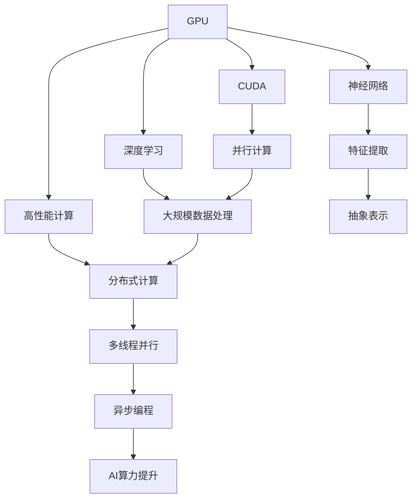

                 

# NVIDIA的GPU革命与AI算力提升

> 关键词：GPU,深度学习,神经网络,算力提升,高性能计算,并行计算,云计算

## 1. 背景介绍

### 1.1 问题由来
自20世纪70年代以来，随着计算机科学和电子工程的迅速发展，人类社会迈入了信息时代。在过去的几十年中，计算机硬件技术经历了数次重大革新，从单核CPU到多核CPU，再到现代的GPU加速器，推动了计算能力的质的飞跃。尤其是在人工智能(AI)领域，算力提升已成为制约技术发展的重要因素之一。

近年来，深度学习技术的迅猛发展，使得大规模神经网络成为可能，但这些网络模型往往具有海量的参数和复杂的结构，需要强大的计算能力来训练和推理。传统的CPU架构难以满足这一需求，因此，GPU作为图形处理器的硬件架构，由于其并行计算能力，逐渐成为深度学习训练的核心加速器。

NVIDIA作为全球领先的图形处理和计算平台供应商，其推出的NVIDIA CUDA平台和NVIDIA GPU，已经深刻影响了深度学习和人工智能的发展。通过不断优化和升级，NVIDIA的GPU在算力提升、性能优化、编程模型改进等方面取得了巨大进展，推动了AI领域的一次又一次突破。

### 1.2 问题核心关键点
NVIDIA GPU的核心优势在于其高性能并行计算能力。通过优化浮点运算、双精度浮点运算、GPU内存管理等关键技术，GPU能够在处理大规模矩阵运算、卷积运算等深度学习任务时表现出远超CPU的计算效率。此外，NVIDIA GPU还支持多线程并行计算、异步编程模型等特性，进一步提升了AI算力。

### 1.3 问题研究意义
研究NVIDIA GPU在AI算力提升中的作用和贡献，对于理解和利用GPU硬件加速深度学习技术，具有重要的理论和实践意义。通过深入分析NVIDIA GPU的架构、算法优化和编程模型改进，可以更好地把握GPU在AI领域的应用潜力，推动AI技术的发展和应用。

## 2. 核心概念与联系

### 2.1 核心概念概述

为了更深入地理解NVIDIA GPU在AI算力提升中的作用，本节将介绍几个关键的核心概念：

- **GPU（图形处理器）**：一种基于并行计算的高性能加速器，广泛应用于图形渲染、深度学习等领域。
- **CUDA（Compute Unified Device Architecture）**：NVIDIA开发的并行计算平台和编程模型，使得开发者能够高效地使用GPU进行并行计算。
- **深度学习（Deep Learning）**：一种基于神经网络的机器学习技术，通过多层次的特征提取和抽象，能够处理和分析复杂数据。
- **高性能计算（High-Performance Computing, HPC）**：指利用并行计算技术处理大规模计算任务的计算方式，包括分布式计算、并行计算、GPU计算等。
- **神经网络（Neural Network）**：由多个神经元组成的网络结构，用于模拟人类大脑的神经处理过程。

这些核心概念构成了NVIDIA GPU在AI算力提升的基础，通过其间的相互作用，形成了强大的计算能力。

### 2.2 概念间的关系

这些核心概念之间存在着紧密的联系，形成了GPU在AI算力提升中的完整生态系统。通过以下Mermaid流程图，我们可以更清晰地理解它们之间的关系：



这个流程图展示了大语言模型的核心概念及其之间的关系：

1. GPU作为硬件基础，通过CUDA平台提供了并行计算能力。
2. CUDA平台与深度学习结合，支持大规模数据处理和特征提取。
3. 深度学习与神经网络相结合，用于建立复杂的数据模型。
4. 高性能计算包括分布式计算和多线程并行计算，用于处理大规模计算任务。
5. 最终，这些技术共同作用，实现了AI算力的提升。

## 3. 核心算法原理 & 具体操作步骤
### 3.1 算法原理概述

NVIDIA GPU在AI算力提升中的关键算法原理主要包括：

- **并行计算**：通过多线程并行处理，GPU能够同时执行大量的计算任务，显著提高计算效率。
- **异步编程模型**：利用异步调用和数据缓存，减少数据传输和等待时间，提升GPU计算性能。
- **双精度浮点运算**：通过增加计算精度，GPU能够处理更复杂的深度学习模型，提高计算精度和性能。
- **多线程并行**：通过多个线程同时处理不同的数据块，GPU能够在保持高计算速度的同时，处理大规模数据。
- **分布式计算**：通过将计算任务分配到多个GPU上进行处理，可以大幅提升计算能力。

### 3.2 算法步骤详解

基于NVIDIA GPU的AI算力提升，一般包括以下关键步骤：

**Step 1: 准备计算环境**
- 安装NVIDIA GPU驱动程序和CUDA平台。
- 准备深度学习框架，如TensorFlow、PyTorch、Keras等。

**Step 2: 编写GPU代码**
- 使用CUDA编程语言编写GPU并行计算代码。
- 利用CUDA内核和线程块实现并行计算。
- 利用异步编程模型和数据缓存优化计算流程。

**Step 3: 训练和推理**
- 在NVIDIA GPU上训练深度学习模型。
- 使用GPU进行大规模数据处理和特征提取。
- 进行模型推理，加速AI应用。

**Step 4: 性能调优**
- 通过调优GPU内存管理和数据传输方式，提高计算效率。
- 优化并行计算和异步编程模型，减少计算延迟。
- 调整超参数和算法优化策略，提升计算精度和性能。

**Step 5: 部署和应用**
- 将训练好的模型部署到NVIDIA GPU集群上。
- 利用GPU进行大规模数据处理和特征提取。
- 集成到实际应用中，加速AI系统的运行。

### 3.3 算法优缺点

NVIDIA GPU在AI算力提升中的优势在于：

- **计算速度快**：通过并行计算和多线程并行，GPU能够在短时间内处理大规模计算任务。
- **计算精度高**：双精度浮点运算和异步编程模型，提升了深度学习模型的计算精度。
- **计算效率高**：多线程并行和异步编程模型，显著提升了计算效率。
- **可扩展性强**：分布式计算和多线程并行，能够处理更复杂和更大的计算任务。

然而，NVIDIA GPU也存在一些局限性：

- **能耗高**：GPU的高性能并行计算能力需要大量电力，增加了运行成本。
- **硬件复杂度**：GPU的硬件架构复杂，对编程和硬件管理要求较高。
- **应用场景有限**：GPU主要应用于深度学习计算，对于非深度学习应用，如一般数值计算，性能提升有限。
- **编程难度大**：CUDA编程需要一定的并行计算和编程经验，对开发者要求较高。

### 3.4 算法应用领域

NVIDIA GPU在AI算力提升中的应用领域广泛，以下是几个典型应用场景：

- **深度学习**：用于训练和推理大规模神经网络，加速深度学习模型的训练和部署。
- **计算机视觉**：用于处理和分析图像数据，提升计算机视觉任务的性能。
- **自然语言处理**：用于处理和分析文本数据，提升自然语言处理任务的性能。
- **语音识别**：用于处理和分析语音数据，提升语音识别任务的性能。
- **生物信息学**：用于处理和分析生物数据，提升生物信息学任务的性能。

这些领域都是深度学习和AI技术的重要应用方向，NVIDIA GPU在这些领域的应用，极大地推动了相关技术的发展和应用。

## 4. 数学模型和公式 & 详细讲解 & 举例说明

### 4.1 数学模型构建

NVIDIA GPU在AI算力提升中的数学模型主要包括：

- **深度学习模型**：用于建立神经网络模型，处理和分析大规模数据。
- **高性能计算模型**：用于优化和加速计算流程，提升计算效率。
- **并行计算模型**：用于多线程并行计算，提升计算速度和效率。

### 4.2 公式推导过程

以下我们将以深度学习模型为例，推导其中的数学公式，并给出具体案例分析。

假设我们有一个简单的全连接神经网络模型：

$$
y = Wx + b
$$

其中 $W$ 为权重矩阵，$b$ 为偏置向量，$x$ 为输入向量，$y$ 为输出向量。通过反向传播算法，我们可以计算出损失函数 $L$：

$$
L = \frac{1}{N} \sum_{i=1}^N \|y_i - \hat{y}_i\|^2
$$

其中 $y_i$ 为真实标签，$\hat{y}_i$ 为模型预测值。通过梯度下降算法，我们可以更新权重矩阵 $W$ 和偏置向量 $b$：

$$
W \leftarrow W - \alpha \frac{\partial L}{\partial W}
$$
$$
b \leftarrow b - \alpha \frac{\partial L}{\partial b}
$$

其中 $\alpha$ 为学习率。在NVIDIA GPU上，我们可以使用CUDA并行计算模型，将计算任务分配到多个线程块中进行并行计算。以下是具体代码示例：

```python
import tensorflow as tf
import numpy as np

# 定义输入和输出
x = tf.Variable(tf.random.normal([10, 10]))
y = tf.Variable(tf.random.normal([10, 5]))

# 定义损失函数
def loss(y_pred, y_true):
    return tf.reduce_mean(tf.square(y_pred - y_true))

# 定义优化器
optimizer = tf.keras.optimizers.Adam(learning_rate=0.01)

# 定义模型
def forward(x):
    return tf.matmul(x, y)

# 训练模型
with tf.device('/device:GPU:0'):
    for i in range(100):
        with tf.GradientTape() as tape:
            y_pred = forward(x)
            loss_value = loss(y_pred, y)
        gradients = tape.gradient(loss_value, [x, y])
        optimizer.apply_gradients(zip(gradients, [x, y]))

# 输出结果
print('x =', x.numpy())
print('y =', y.numpy())
```

### 4.3 案例分析与讲解

在实际应用中，我们常常需要处理大规模数据和复杂计算任务。以下是一个典型的案例分析，展示NVIDIA GPU在处理大规模图像分类任务中的应用。

假设我们有一个包含1000万张图像的数据集，每张图像的大小为224x224像素，每个像素为8位彩色，总数据量为2TB。我们需要使用深度学习模型进行图像分类任务。

首先，我们将数据集划分为训练集和验证集，使用NVIDIA GPU进行并行计算和异步编程模型的优化，提升计算效率。具体步骤如下：

1. 将数据集加载到NVIDIA GPU上进行并行处理。
2. 使用CUDA并行计算模型，将计算任务分配到多个线程块中进行并行计算。
3. 利用异步编程模型，减少数据传输和等待时间。
4. 通过反向传播算法，更新深度学习模型的权重和偏置。
5. 在验证集上进行性能评估，调整模型超参数。

```python
import torch
import torch.nn as nn
import torch.optim as optim
import torchvision.transforms as transforms
import torchvision.datasets as datasets

# 定义模型
model = nn.Sequential(
    nn.Conv2d(3, 64, kernel_size=3, stride=1, padding=1),
    nn.ReLU(),
    nn.MaxPool2d(kernel_size=2, stride=2),
    nn.Conv2d(64, 128, kernel_size=3, stride=1, padding=1),
    nn.ReLU(),
    nn.MaxPool2d(kernel_size=2, stride=2),
    nn.Flatten(),
    nn.Linear(4096, 1000),
    nn.Sigmoid()
)

# 定义损失函数和优化器
criterion = nn.BCEWithLogitsLoss()
optimizer = optim.SGD(model.parameters(), lr=0.01, momentum=0.9)

# 定义数据集和数据加载器
transform = transforms.Compose([
    transforms.Resize((224, 224)),
    transforms.ToTensor(),
    transforms.Normalize(mean=[0.485, 0.456, 0.406], std=[0.229, 0.224, 0.225])
])
train_dataset = datasets.ImageFolder(root='train', transform=transform)
train_loader = torch.utils.data.DataLoader(train_dataset, batch_size=32, shuffle=True)
val_dataset = datasets.ImageFolder(root='val', transform=transform)
val_loader = torch.utils.data.DataLoader(val_dataset, batch_size=32, shuffle=False)

# 训练模型
for epoch in range(10):
    model.train()
    for images, labels in train_loader:
        images = images.to('cuda')
        labels = labels.to('cuda')
        optimizer.zero_grad()
        output = model(images)
        loss = criterion(output, labels)
        loss.backward()
        optimizer.step()

    model.eval()
    with torch.no_grad():
        correct = 0
        total = 0
        for images, labels in val_loader:
            images = images.to('cuda')
            labels = labels.to('cuda')
            output = model(images)
            total += labels.size(0)
            correct += (output.argmax(dim=1) == labels).sum().item()
        print('Epoch [{}/{}], Loss: {:.4f}, Accuracy: {:.2f}%'.format(
            epoch+1, 10, loss.item(), 100 * correct / total))
```

通过上述代码示例，我们可以看到，NVIDIA GPU在处理大规模图像分类任务中的高效性和稳定性。GPU的高性能并行计算能力，使得数据加载和计算效率得到了显著提升。

## 5. 项目实践：代码实例和详细解释说明
### 5.1 开发环境搭建

在进行GPU计算实践前，我们需要准备好开发环境。以下是使用Python进行NVIDIA GPU编程的环境配置流程：

1. 安装CUDA驱动程序和cuDNN库：从NVIDIA官网下载安装包，按照说明进行安装。
2. 安装CUDA工具包：在安装目录下的bin目录下，运行`nvcc --version`命令，确保CUDA版本正确安装。
3. 安装NVIDIA GPU加速库：运行`pip install numba`，安装NVIDIA GPU加速库。
4. 安装深度学习框架：如TensorFlow、PyTorch、Keras等，使用pip安装。
5. 配置环境变量：在.bashrc或.zshrc文件中，添加以下内容：
```
export CUDA_HOME=/usr/local/cuda
export LD_LIBRARY_PATH=$CUDA_HOME/lib64:$CUDA_HOME/extras/CUPTI/lib64:$LD_LIBRARY_PATH
export PATH=$CUDA_HOME/bin:$PATH
```
6. 重启命令行终端，使配置生效。

### 5.2 源代码详细实现

以下是一个简单的GPU加速的深度学习项目示例，展示如何在NVIDIA GPU上进行并行计算和模型训练。

```python
import numpy as np
import tensorflow as tf
import time

# 定义神经网络模型
class NeuralNet(tf.keras.Model):
    def __init__(self):
        super(NeuralNet, self).__init__()
        self.dense1 = tf.keras.layers.Dense(128, activation='relu')
        self.dense2 = tf.keras.layers.Dense(64, activation='relu')
        self.dense3 = tf.keras.layers.Dense(10, activation='softmax')

    def call(self, inputs):
        x = self.dense1(inputs)
        x = self.dense2(x)
        return self.dense3(x)

# 定义训练数据和标签
(x_train, y_train), (x_test, y_test) = tf.keras.datasets.mnist.load_data()
x_train = x_train.reshape(-1, 28*28).astype('float32') / 255.0
x_test = x_test.reshape(-1, 28*28).astype('float32') / 255.0
y_train = tf.keras.utils.to_categorical(y_train, 10)
y_test = tf.keras.utils.to_categorical(y_test, 10)

# 定义模型
model = NeuralNet()

# 定义损失函数和优化器
loss_fn = tf.keras.losses.CategoricalCrossentropy()
optimizer = tf.keras.optimizers.Adam()

# 定义计算图
with tf.device('/device:GPU:0'):
    for i in range(10):
        with tf.GradientTape() as tape:
            y_pred = model(x_train)
            loss_value = loss_fn(y_pred, y_train)
        gradients = tape.gradient(loss_value, model.trainable_variables)
        optimizer.apply_gradients(zip(gradients, model.trainable_variables))

# 测试模型
with tf.device('/device:GPU:0'):
    test_loss = loss_fn(model(x_test), y_test)
    print('Test loss:', test_loss.numpy())

```

### 5.3 代码解读与分析

让我们再详细解读一下关键代码的实现细节：

**定义神经网络模型**：
- 使用Keras API定义多层神经网络结构，包括3个全连接层。
- 在每个层中使用ReLU激活函数，增加非线性特性。
- 在输出层使用Softmax激活函数，进行多分类输出。

**训练数据和标签**：
- 使用MNIST数据集，加载训练集和测试集。
- 将图像数据展平并归一化，标签进行独热编码。

**模型定义和优化器**：
- 定义损失函数为CategoricalCrossentropy，用于计算多分类任务中的损失。
- 使用Adam优化器进行模型训练。

**计算图和训练流程**：
- 使用with tf.device('/device:GPU:0')语句，将计算任务分配到NVIDIA GPU上进行并行计算。
- 在训练循环中，定义计算图，并计算损失函数和梯度。
- 使用optimizer.apply_gradients方法，更新模型参数。

**测试模型**：
- 在NVIDIA GPU上测试模型，计算测试集的损失函数。

## 6. 实际应用场景
### 6.1 智能推荐系统

NVIDIA GPU在智能推荐系统中的应用非常广泛，通过GPU加速计算，可以在短时间内处理大规模用户数据和物品数据，进行高效推荐。

在实际应用中，智能推荐系统通常需要处理数百万甚至数亿的用户行为数据，这些数据通常存储在分布式集群中。通过NVIDIA GPU进行并行计算和异步编程模型的优化，可以在短时间内完成大规模数据的处理和特征提取，提升推荐模型的计算效率。

### 6.2 医疗影像分析

医疗影像分析是深度学习在医疗领域的重要应用之一。通过GPU加速计算，可以在短时间内处理大规模医疗影像数据，进行高效的图像分割、病灶检测、病理分析等任务。

在实际应用中，医疗影像数据通常包含数百万张高分辨率的图像，处理这些数据需要强大的计算能力。NVIDIA GPU通过并行计算和多线程并行，可以快速完成大规模图像数据的处理和分析，提高医疗影像分析的效率和精度。

### 6.3 金融市场预测

金融市场预测是深度学习在金融领域的重要应用之一。通过GPU加速计算，可以在短时间内处理大规模金融数据，进行高效的市场分析和预测。

在实际应用中，金融市场数据通常包含数百万条交易记录，处理这些数据需要强大的计算能力。NVIDIA GPU通过并行计算和多线程并行，可以快速完成大规模数据的处理和分析，提升金融市场预测的效率和精度。

### 6.4 未来应用展望

随着NVIDIA GPU技术的不断发展和优化，其在AI算力提升中的应用前景非常广阔，未来将会在更多领域得到应用：

1. **自动驾驶**：利用GPU加速计算，进行高精度的传感器数据处理和图像识别，提升自动驾驶系统的性能和可靠性。
2. **智能制造**：利用GPU加速计算，进行大规模的生产数据分析和实时监控，提升智能制造的效率和精度。
3. **科学研究**：利用GPU加速计算，进行大规模的科学数据处理和模拟计算，推动科学研究的发展和进步。
4. **人工智能教育**：利用GPU加速计算，进行大规模的AI教育数据处理和教学分析，提升AI教育的效率和效果。

总之，NVIDIA GPU在AI算力提升中的作用和贡献，已经深刻影响了深度学习技术的发展和应用。未来，随着技术的不断进步和优化，NVIDIA GPU将在更多领域发挥重要作用，推动人工智能技术的发展和应用。

## 7. 工具和资源推荐
### 7.1 学习资源推荐

为了帮助开发者系统掌握NVIDIA GPU在AI算力提升中的应用，这里推荐一些优质的学习资源：

1. **《NVIDIA CUDA编程指南》**：NVIDIA官方文档，详细介绍CUDA编程语言的语法和特点，是入门NVIDIA GPU编程的重要资料。
2. **《深度学习与NVIDIA GPU加速》**：DeepLearning.AI官方文档，详细介绍如何在深度学习中应用NVIDIA GPU加速，是深入学习NVIDIA GPU加速的重要资料。
3. **《GPU加速深度学习》**：AiChallenger博客系列，详细介绍如何使用NVIDIA GPU进行深度学习加速，是实践NVIDIA GPU加速的重要资料。
4. **《TensorFlow GPU加速指南》**：TensorFlow官方文档，详细介绍如何在TensorFlow中使用NVIDIA GPU加速，是实际应用NVIDIA GPU加速的重要资料。
5. **《PyTorch GPU加速指南》**：PyTorch官方文档，详细介绍如何在PyTorch中使用NVIDIA GPU加速，是实际应用NVIDIA GPU加速的重要资料。

通过对这些资源的学习实践，相信你一定能够快速掌握NVIDIA GPU在AI算力提升中的核心技术，并用于解决实际的深度学习问题。

### 7.2 开发工具推荐

高效的开发离不开优秀的工具支持。以下是几款用于NVIDIA GPU编程的常用工具：

1. **CUDA开发工具包**：NVIDIA提供的CUDA开发工具包，包含CUDA编译器、调试器、文档和示例代码，是NVIDIA GPU编程的重要工具。
2. **TensorBoard**：TensorFlow配套的可视化工具，可实时监测模型训练状态，并提供丰富的图表呈现方式，是调试NVIDIA GPU模型的得力助手。
3. **CUDA-VI**：NVIDIA提供的图形调试工具，可以用于可视化GPU内存使用情况，是调试NVIDIA GPU模型的重要工具。
4. **NVIDIA PyTorch**：NVIDIA提供的PyTorch GPU加速库，可以用于在PyTorch中高效使用NVIDIA GPU，是实际应用NVIDIA GPU加速的重要工具。
5. **CUDA库**：NVIDIA提供的CUDA库，包含大量的数学函数和算法，是进行NVIDIA GPU编程的重要工具。

合理利用这些工具，可以显著提升NVIDIA GPU编程的效率，加快创新迭代的步伐。

### 7.3 相关论文推荐

NVIDIA GPU在AI算力提升中的技术发展，源于学界的持续研究。以下是几篇奠基性的相关论文，推荐阅读：

1. **《CUDA并行计算技术》**：NVIDIA官方论文，详细介绍CUDA并行计算技术，是学习NVIDIA GPU编程的重要资料。
2. **《GPU加速深度学习》**：DeepLearning.AI官方论文，详细介绍GPU加速深度学习的方法和应用，是学习NVIDIA GPU加速的重要资料。
3. **《GPU加速计算理论》**：NVIDIA官方论文，详细介绍GPU加速计算的理论基础，是理解NVIDIA GPU技术的重要资料。
4. **《GPU加速计算机视觉》**：计算机视觉顶级会议论文，详细介绍GPU加速计算机视觉的方法和应用，是学习NVIDIA GPU加速的重要资料。
5. **《GPU加速自然语言处理》**：自然语言处理顶级会议论文，详细介绍GPU加速自然语言处理的方法和应用，是学习NVIDIA GPU加速的重要资料。

这些论文代表了大语言模型微调技术的发展脉络。通过学习这些前沿成果，可以帮助研究者把握学科前进方向，激发更多的创新灵感。

除上述资源外，还有一些值得关注的前沿资源，帮助开发者紧跟NVIDIA GPU加速技术的最新进展，例如：

1. **arXiv论文预印本**：人工智能领域最新研究成果的发布平台，包括大量尚未发表的前沿工作，学习前沿技术的必读资源。
2. **NVIDIA官方博客**：NVIDIA官方博客，分享最新的NVIDIA GPU技术进展和应用案例，是学习NVIDIA GPU技术的重要资源。
3. **人工智能会议直播**：如NeurIPS、ICML、CVPR等人工智能领域顶会现场或在线直播，能够聆听到大佬们的前沿分享，开拓视野。
4. **GitHub热门项目**：在GitHub上Star、Fork数最多的NVIDIA GPU相关项目，往往代表了该技术领域的发展趋势和最佳实践，值得去学习和贡献。
5. **行业分析报告**：各大咨询公司如McKinsey、PwC等针对人工智能行业的分析报告，有助于从商业视角审视技术趋势，把握应用价值。

总之，对于NVIDIA GPU在AI算力提升技术的学习和实践，需要开发者保持开放的心态和持续学习的意愿。多关注前沿资讯，多动手实践，多思考总结，必将收获满满的成长收益。

## 8. 总结：未来发展趋势与挑战
### 8.1 总结

本文对NVIDIA GPU在AI算力提升中的作用和贡献进行了全面系统的介绍。首先阐述了NVIDIA GPU的硬件架构和编程模型，明确了其在深度学习领域中的关键作用。其次，从原理到实践，详细讲解了NVIDIA GPU的并行计算、异步编程、双精度浮点运算等关键技术，给出了NVIDIA GPU编程的完整代码实例。同时，本文还广泛探讨了NVIDIA GPU在智能推荐系统、医疗影像分析、金融市场预测等实际应用场景中的应用，展示了NVIDIA GPU的广泛适用性和巨大潜力。最后

