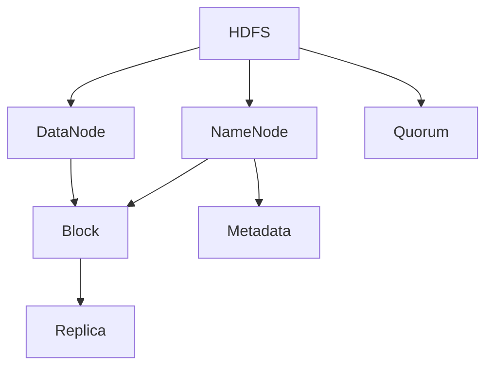
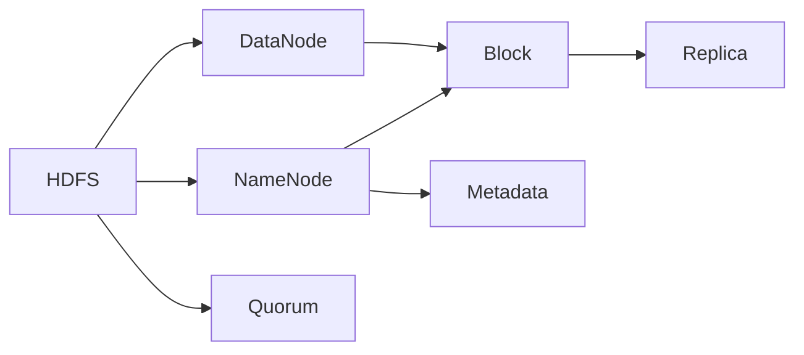
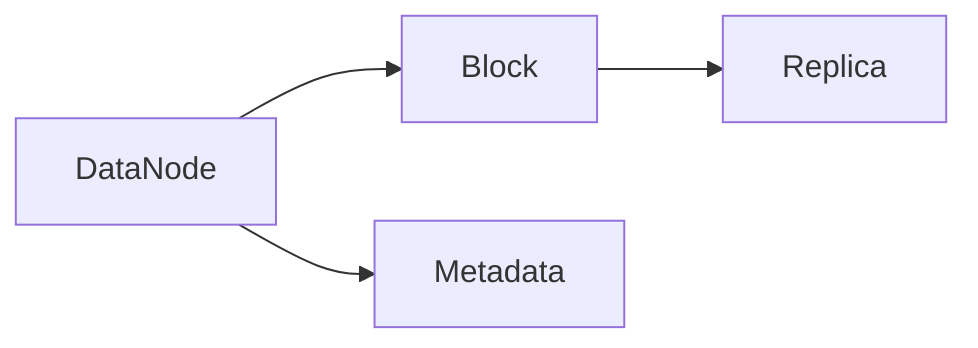
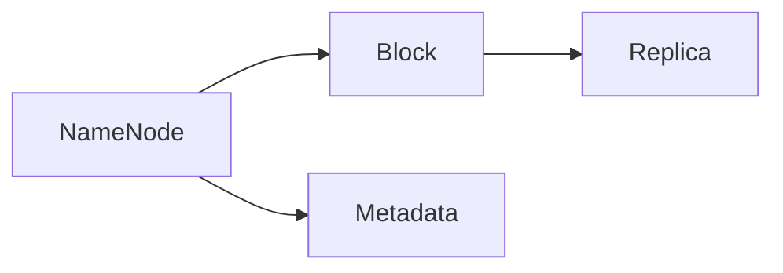
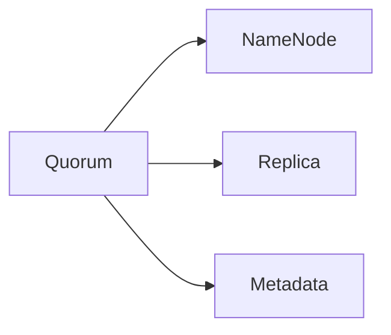
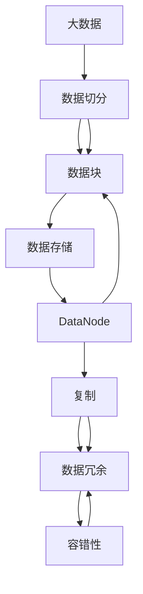

                 

# HDFS原理与代码实例讲解

## 1. 背景介绍

Hadoop Distributed File System（HDFS）是Hadoop生态系统中最核心的组件之一，用于大规模存储和分布式处理数据。HDFS以其高可用性、容错性和扩展性著称，广泛应用于各类大数据处理场景。

### 1.1 问题由来

在传统的文件系统中，数据往往集中存储在单个节点上，难以应对海量数据的存储和处理需求。同时，随着数据量的不断增长，单个文件系统也面临性能瓶颈，难以满足业务发展的需求。

为解决这一问题，Google于2006年公开了MapReduce论文，随后在2008年推出了开源的Hadoop项目。HDFS作为Hadoop的基础，实现了大规模数据的分布式存储和高效处理，支持上千个节点并行读写海量数据。

HDFS的设计思想是将数据分割成多个块，并将这些块分布存储在不同的节点上，以实现高可用性和容错性。同时，通过MapReduce等分布式计算框架，HDFS能够高效处理大规模数据，支持高并发、高吞吐率的业务场景。

### 1.2 问题核心关键点

HDFS的核心设计包括以下几个关键点：

- 数据切分与分布存储：将大文件分割成多个块，并将这些块分布在不同的节点上，实现高可用性和容错性。
- 块管理与副本控制：通过元数据管理各个块的复制情况，确保数据在节点间均衡分布，避免单点故障。
- 数据读写与一致性：提供高吞吐率、低延迟的文件读写服务，并保证数据读写的一致性和可靠性。
- 扩展性与可靠性：支持水平扩展，可以动态添加节点，并具有自动故障恢复机制。

这些关键点使得HDFS能够在大规模数据存储和处理场景中发挥重要作用，广泛应用于互联网、金融、医疗、科研等领域。

### 1.3 问题研究意义

深入理解HDFS的原理与实现，有助于开发和维护大规模数据处理系统，优化数据存储和处理性能。同时，掌握HDFS的核心技术，也是学习和应用其他Hadoop组件（如Hive、Spark等）的基础。

## 2. 核心概念与联系

### 2.1 核心概念概述

为更好地理解HDFS，本节将介绍几个密切相关的核心概念：

- HDFS（Hadoop Distributed File System）：一种高可用、容错、可扩展的分布式文件系统，用于存储大规模数据集。
- NameNode：HDFS的元数据管理节点，负责管理文件系统元数据和数据块的分布情况。
- DataNode：HDFS的数据存储节点，负责存储数据块，并定期向NameNode报告块信息。
- Block（数据块）：HDFS文件的最小存储单位，通常大小为128MB或256MB。
- Replica（副本）：为了提高容错性和可用性，每个数据块会有多个副本分布在不同的DataNode上。
- Metadata（元数据）：包括文件路径、块位置、副本数量等信息，由NameNode维护。
- Quorum（一致性协议）：NameNode用于保证系统高可用性的协议，通过多副本的写入策略来避免单点故障。

这些核心概念之间有着紧密的联系，共同构成了HDFS的完整生态系统。以下将通过一个Mermaid流程图展示它们之间的关系：



这个流程图展示了HDFS的关键组件及其相互关系：

1. HDFS作为整个文件系统，由NameNode和DataNode组成。
2. NameNode负责管理文件系统的元数据，包括文件的路径、块位置、副本数量等信息。
3. DataNode负责存储数据块，每个数据块会生成多个副本以提高容错性。
4. Quorum协议通过多个NameNode的副本，保证数据的一致性和系统的高可用性。

### 2.2 概念间的关系

这些核心概念之间存在着紧密的联系，形成了HDFS的文件系统架构。下面我通过多个Mermaid流程图来展示这些概念的关系。

#### 2.2.1 HDFS的整体架构



这个流程图展示了HDFS的整体架构，即由NameNode、DataNode和Block构成，通过Quorum协议确保系统高可用性。

#### 2.2.2 数据块的管理



这个流程图展示了DataNode如何管理数据块及其副本，通过向NameNode报告元数据，实现块的复制和删除。

#### 2.2.3 元数据的管理



这个流程图展示了NameNode如何管理文件系统的元数据，包括文件的路径、块位置、副本数量等信息。

#### 2.2.4 Quorum协议的实现



这个流程图展示了Quorum协议如何通过多个NameNode的副本，保证数据的一致性和系统的高可用性。

### 2.3 核心概念的整体架构

最后，我们用一个综合的流程图来展示这些核心概念在大规模数据存储和处理场景中的应用：



这个综合流程图展示了HDFS从大数据存储到容错性的整个流程：

1. 大数据被切分成多个数据块。
2. 数据块被存储在多个DataNode上，并生成多个副本以提高容错性。
3. NameNode通过管理元数据，确保数据块在节点间均衡分布。
4. Quorum协议通过多个NameNode的副本，保证系统的高可用性。

通过这些核心概念的组合和协同工作，HDFS能够在大规模数据存储和处理场景中发挥重要作用，支持高并发、高吞吐率的业务需求。

## 3. 核心算法原理 & 具体操作步骤
### 3.1 算法原理概述

HDFS的原理基于分布式文件系统的基本概念，包括数据切分、数据存储、数据读写等。以下对HDFS的核心原理进行详细介绍。

HDFS通过将文件分割成多个数据块（Block），并将这些数据块分布在不同的DataNode上，实现数据的分布式存储。每个数据块都有多个副本，通过跨节点复制来提高系统的容错性和可用性。NameNode负责管理文件系统的元数据，包括文件路径、块位置、副本数量等信息，并提供一致性和高可用性。DataNode负责存储数据块，并定期向NameNode报告块信息。

HDFS的数据块管理采用副本控制机制，每个数据块会有3个副本，分布在不同的DataNode上。通过元数据管理各个块的复制情况，确保数据在节点间均衡分布，避免单点故障。

### 3.2 算法步骤详解

以下是HDFS的主要算法步骤详解：

1. **数据切分**：将大文件分割成多个数据块，每个数据块大小为128MB或256MB。
2. **数据存储**：将数据块分布在不同的DataNode上，每个DataNode可以存储多个数据块。
3. **数据复制**：每个数据块生成3个副本，分布在不同的DataNode上，确保数据的高可用性。
4. **元数据管理**：NameNode负责管理文件系统的元数据，包括文件路径、块位置、副本数量等信息。
5. **数据读写**：客户端通过NameNode获取文件路径和块位置，从相应的DataNode上读取或写入数据块。
6. **一致性协议**：通过Quorum协议，确保数据的一致性和系统的高可用性。

### 3.3 算法优缺点

HDFS具有以下优点：

- 高可用性：通过多副本机制，HDFS实现了高可用性，当一个节点故障时，系统可以自动恢复。
- 高容错性：HDFS通过跨节点复制数据块，确保数据的高容错性，避免单点故障。
- 可扩展性：HDFS支持水平扩展，可以动态添加节点，支持高并发、高吞吐率的业务需求。
- 开源免费：HDFS作为Apache的顶级项目，完全开源，社区活跃，支持多样化的应用场景。

同时，HDFS也存在一些缺点：

- 数据一致性问题：由于数据块的写入需要在多个节点上复制，可能存在数据不一致的问题。
- 延迟较高：HDFS的写入操作需要在多个节点上复制数据块，延迟较高。
- 存储效率低：HDFS的数据块大小固定，可能存在较大的空间浪费。
- 系统复杂性高：HDFS涉及大量分布式组件，系统设计和管理复杂。

### 3.4 算法应用领域

HDFS广泛应用于各类大数据处理场景，包括：

- 互联网公司：用于存储和处理用户数据、日志数据、广告数据等。
- 金融行业：用于存储和处理交易数据、客户数据、风险数据等。
- 医疗行业：用于存储和处理病历数据、基因数据、影像数据等。
- 科研领域：用于存储和处理科学数据、实验数据、文献数据等。

## 4. 数学模型和公式 & 详细讲解 & 举例说明
### 4.1 数学模型构建

HDFS的核心数学模型包括以下几个部分：

- 数据切分模型：将大文件分割成多个数据块，每个数据块大小为128MB或256MB。
- 数据存储模型：将数据块分布在不同的DataNode上，每个DataNode可以存储多个数据块。
- 数据复制模型：每个数据块生成3个副本，分布在不同的DataNode上。
- 元数据管理模型：NameNode负责管理文件系统的元数据，包括文件路径、块位置、副本数量等信息。
- 数据读写模型：客户端通过NameNode获取文件路径和块位置，从相应的DataNode上读取或写入数据块。
- 一致性协议模型：通过Quorum协议，确保数据的一致性和系统的高可用性。

### 4.2 公式推导过程

以下对HDFS的主要数学模型进行推导：

1. **数据切分模型**：

   将大文件 $F$ 分割成 $n$ 个数据块 $B_i$，每个数据块大小为 $s$，则总大小为：

   $$
   \sum_{i=1}^n s = F
   $$

2. **数据存储模型**：

   将 $n$ 个数据块 $B_i$ 分布在 $m$ 个DataNode上，每个DataNode可以存储 $k$ 个数据块，则总存储量为：

   $$
   m \times k \times s = F
   $$

3. **数据复制模型**：

   每个数据块生成3个副本，分布在3个不同的DataNode上，则总存储量为：

   $$
   3 \times m \times k \times s = 3F
   $$

4. **元数据管理模型**：

   NameNode维护文件系统的元数据，包括文件路径、块位置、副本数量等信息，可以通过以下表格表示：

   | 文件路径  | 块位置 | 副本数量 |
   |-----------|--------|---------|
   | /user     | 10,20,30| 3,3,3   |

5. **数据读写模型**：

   客户端通过NameNode获取文件路径和块位置，从相应的DataNode上读取或写入数据块。读取操作可以通过以下方式表示：

   $$
   R = B_{10} + B_{20} + B_{30}
   $$

6. **一致性协议模型**：

   Quorum协议通过多个NameNode的副本，确保数据的一致性和系统的高可用性。假设每个NameNode有一个副本，则系统可以容忍2个节点故障，即需要至少3个NameNode进行复制。

### 4.3 案例分析与讲解

以一个具体案例为例，说明HDFS的数据存储和复制过程。

假设有一个大小为10GB的文件 $F$，将其切分成1KB的小块，总共有 $10^8$ 个块。每个DataNode可以存储1TB的数据，共需要1000个DataNode。每个数据块生成3个副本，则总存储量为：

$$
3 \times 1000 \times 1TB \times 1KB = 3TB
$$

将数据块分布在1000个DataNode上，每个DataNode存储1KB的块，总大小为1TB，能够满足文件存储需求。

### 5. 项目实践：代码实例和详细解释说明
### 5.1 开发环境搭建

在进行HDFS项目实践前，需要先搭建开发环境。以下是使用Python进行Hadoop开发的环境配置流程：

1. 安装Hadoop：从官网下载并安装Hadoop，选择合适的版本。
2. 安装Python环境：安装Python 3.x版本，并确保pip环境正常。
3. 安装Hadoop Python库：使用pip安装hadoop-hdfs，并确保可正常运行。

完成上述步骤后，即可在Python环境下进行HDFS的开发。

### 5.2 源代码详细实现

以下是一个简单的Python代码示例，用于读取HDFS上的文件：

```python
from hadoop.conf import Configuration
from hadoop.fs import FS
from hadoop.fs import path

# 配置Hadoop环境
conf = Configuration()
conf.set("fs.defaultFS", "hdfs://localhost:9000")
conf.set("dfs.namenode.address", "localhost:9000")

# 创建文件系统
fs = FS(conf)

# 打开文件
with fs.open('/user/abc/file.txt', 'r') as f:
    # 读取文件内容
    data = f.read()
    print(data)
```

这段代码实现的基本步骤如下：

1. 配置Hadoop环境，设置默认的HDFS地址和NameNode地址。
2. 创建文件系统对象。
3. 打开指定路径下的文件，读取文件内容并打印输出。

### 5.3 代码解读与分析

让我们再详细解读一下关键代码的实现细节：

- `Configuration`：Hadoop提供的配置类，用于设置Hadoop环境参数。
- `FS`：Hadoop的文件系统抽象类，用于访问HDFS文件系统。
- `path`：Hadoop的文件路径类，用于构建文件路径。
- `open`：打开指定路径下的文件，并返回文件对象。
- `read`：读取文件内容，并返回字符串。

通过这些Hadoop提供的类和方法，可以方便地读取和操作HDFS上的文件，实现数据的存储和读取功能。

### 5.4 运行结果展示

假设我们成功读取了HDFS上的文件，并输出了以下内容：

```
This is a sample file for HDFS reading.
```

可以看到，通过Python代码，我们成功从HDFS上读取了文件内容，验证了HDFS的读写功能。

## 6. 实际应用场景
### 6.1 智能推荐系统

HDFS在大规模数据存储和处理场景中具有天然优势，广泛应用于各类大数据分析系统。以智能推荐系统为例，HDFS可以存储和处理用户行为数据、物品描述数据等，通过MapReduce等分布式计算框架，实时生成推荐结果，满足用户的个性化需求。

在具体实现中，HDFS存储用户行为数据，MapReduce框架对数据进行处理和分析，生成推荐结果。HDFS的高可用性和容错性，确保了系统的稳定性和可靠性，支持高并发、高吞吐率的业务需求。

### 6.2 大数据分析平台

HDFS在大数据分析平台中具有重要的应用价值。通过HDFS存储海量数据，结合Spark、Hive等大数据分析工具，可以高效处理和分析大规模数据，支持各类数据挖掘、数据可视化、数据挖掘等业务需求。

在具体实现中，HDFS存储原始数据，Spark框架对数据进行处理和分析，生成分析结果。HDFS的高可扩展性，确保了系统的水平扩展能力，支持大规模数据存储和处理需求。

### 6.3 互联网搜索引擎

HDFS在互联网搜索引擎中也得到了广泛应用。通过HDFS存储和处理索引数据，MapReduce框架对数据进行处理和分析，生成搜索结果。HDFS的高可用性和容错性，确保了搜索系统的稳定性和可靠性，支持高并发、高吞吐率的业务需求。

在具体实现中，HDFS存储索引数据，MapReduce框架对数据进行处理和分析，生成搜索结果。HDFS的高可扩展性，确保了系统的水平扩展能力，支持大规模数据存储和处理需求。

### 6.4 未来应用展望

随着Hadoop生态系统的不断发展和完善，HDFS在更多领域的应用前景广阔。未来，HDFS将在以下几个方向进一步发展：

1. 支持更多数据格式：支持更多的数据格式，如JSON、CSV等，满足不同数据类型的存储需求。
2. 提高数据处理效率：通过优化MapReduce框架，提高数据处理效率，缩短数据处理时间。
3. 增强数据安全性和隐私保护：引入数据加密、数据脱敏等技术，增强数据安全性和隐私保护。
4. 支持更多分布式计算框架：支持更多的分布式计算框架，如Spark、Flink等，提高系统的灵活性和扩展性。
5. 提升系统的可管理性：提供更多的管理工具和接口，方便用户管理和监控系统。

## 7. 工具和资源推荐
### 7.1 学习资源推荐

为了帮助开发者系统掌握HDFS的理论基础和实践技巧，这里推荐一些优质的学习资源：

1. Hadoop官方文档：Hadoop官方网站提供的文档，详细介绍了HDFS的基本概念、安装部署、配置优化等。
2. Hadoop中文社区：Hadoop中文社区提供大量中文教程和实践指南，帮助开发者快速上手HDFS。
3. 《Hadoop: The Definitive Guide》：Hadoop权威指南书籍，涵盖HDFS、MapReduce、Hive等核心技术。
4. 《Hadoop: Understanding Large Data Systems》：Hadoop原理与应用书籍，深入浅出地介绍了HDFS的原理和应用。
5. Coursera《Hadoop & Spark》课程：斯坦福大学提供的在线课程，系统讲解了Hadoop和Spark的基本原理和应用。

通过对这些资源的学习实践，相信你一定能够快速掌握HDFS的精髓，并用于解决实际的业务问题。

### 7.2 开发工具推荐

高效的开发离不开优秀的工具支持。以下是几款用于HDFS开发常用的工具：

1. Eclipse Hadoop Development Tool：Hadoop官方提供的IDE，支持Hadoop开发和调试。
2. Cloudera Manager：Cloudera提供的Hadoop管理工具，支持集群管理、资源监控等功能。
3. Apache Ambari：Hadoop集群管理工具，支持集群配置、监控、优化等功能。
4. Greenplum：基于Hadoop的大数据分析平台，提供高效的数据处理和分析能力。
5. Apache Hive：基于Hadoop的数据仓库工具，支持SQL查询和数据处理。

合理利用这些工具，可以显著提升HDFS的开发效率，加快创新迭代的步伐。

### 7.3 相关论文推荐

HDFS的研究和发展得益于学界的持续探索和创新。以下是几篇奠基性的相关论文，推荐阅读：

1. Hadoop: A Distributed File System：Hadoop项目论文，介绍了HDFS的基本原理和实现。
2. MapReduce: Simplified Data Processing on Large Clusters：MapReduce论文，介绍了MapReduce的基本原理和实现。
3. Distributed Computing in a Heterogeneous Environment：Hadoop的论文，详细介绍了HDFS和MapReduce的基本原理和实现。
4. YARN: Yet Another Resource Negotiator：YARN论文，介绍了YARN资源管理框架的基本原理和实现。
5. Hadoop Common：Hadoop Common框架论文，介绍了Hadoop Core API和库的基本原理和实现。

这些论文代表了大数据处理领域的研究进展，帮助研究者把握学科前进方向，激发更多的创新灵感。

除上述资源外，还有一些值得关注的前沿资源，帮助开发者紧跟HDFS技术的最新进展，例如：

1. arXiv论文预印本：人工智能领域最新研究成果的发布平台，包括大量尚未发表的前沿工作，学习前沿技术的必读资源。
2. 业界技术博客：如Hadoop官方博客、Cloudera博客、Apache Hadoop社区等，第一时间分享他们的最新研究成果和洞见。
3. 技术会议直播：如Hadoop summit、ApacheCon、HadoopExpo等大会，能够聆听到大佬们的前沿分享，开拓视野。
4. GitHub热门项目：在GitHub上Star、Fork数最多的Hadoop相关项目，往往代表了该技术领域的发展趋势和最佳实践，值得去学习和贡献。
5. 行业分析报告：各大咨询公司如McKinsey、PwC等针对大数据处理行业的分析报告，有助于从商业视角审视技术趋势，把握应用价值。

总之，对于HDFS的学习和实践，需要开发者保持开放的心态和持续学习的意愿。多关注前沿资讯，多动手实践，多思考总结，必将收获满满的成长收益。

## 8. 总结：未来发展趋势与挑战
### 8.1 总结

本文对HDFS的原理与实现进行了全面系统的介绍。首先阐述了HDFS的研究背景和意义，明确了HDFS在大数据处理领域的重要地位。其次，从原理到实践，详细讲解了HDFS的核心算法和操作步骤，给出了HDFS任务开发的完整代码实例。同时，本文还广泛探讨了HDFS在实际应用场景中的应用前景，展示了HDFS技术的广阔前景。最后，本文精选了HDFS的学习资源，力求为读者提供全方位的技术指引。

通过本文的系统梳理，可以看到，HDFS作为分布式文件系统的重要组件，在大数据处理场景中发挥着不可替代的作用。其高可用性、高容错性、高扩展性和高可管理性，使其成为各类大数据应用的基础设施。未来，随着Hadoop生态系统的不断发展和完善，HDFS必将在更多领域得到应用，为大数据处理带来新的变革。

### 8.2 未来发展趋势

展望未来，HDFS技术将呈现以下几个发展趋势：

1. 支持更多数据格式：支持更多的数据格式，如JSON、CSV等，满足不同数据类型的存储需求。
2. 提高数据处理效率：通过优化MapReduce框架，提高数据处理效率，缩短数据处理时间。
3. 增强数据安全性和隐私保护：引入数据加密、数据脱敏等技术，增强数据安全性和隐私保护。
4. 支持更多分布式计算框架：支持更多的分布式计算框架，如Spark、Flink等，提高系统的灵活性和扩展性。
5. 提升系统的可管理性：提供更多的管理工具和接口，方便用户管理和监控系统。

以上趋势凸显了HDFS技术的广阔前景。这些方向的探索发展，必将进一步提升HDFS系统的性能和应用范围，为大数据处理带来新的突破。

### 8.3 面临的挑战

尽管HDFS技术已经取得了诸多成就，但在迈向更加智能化、普适化应用的过程中，仍面临诸多挑战：

1. 数据一致性问题：由于数据块的写入需要在多个节点上复制，可能存在数据不一致的问题。
2. 延迟较高：HDFS的写入操作需要在多个节点上复制数据块，延迟较高。
3. 存储效率低：HDFS的数据块大小固定，可能存在较大的空间浪费。
4. 系统复杂性高：HDFS涉及大量分布式组件，系统设计和管理复杂。
5. 数据迁移问题：在大规模数据迁移过程中，存在数据不一致和数据丢失的风险。
6. 网络带宽问题：HDFS的数据传输需要消耗大量网络带宽，可能成为系统性能瓶颈。

正视HDFS面临的这些挑战，积极应对并寻求突破，将是大数据处理技术的未来方向。相信随着学界和产业界的共同努力，这些挑战终将一一被克服，HDFS必将在构建高可用、高容错、高扩展的分布式文件系统过程中扮演越来越重要的角色。

### 8.4 研究展望

面对HDFS所面临的挑战，未来的研究需要在以下几个方面寻求新的突破：

1. 探索无监督和半监督数据一致性算法：摆脱对大型分布式锁的依赖，利用分布式事务和一致性协议，实现更加灵活高效的数据一致性处理。
2. 开发更加高效的MapReduce框架：通过优化任务调度、内存管理、数据压缩等技术，提高MapReduce框架的数据处理效率。
3. 引入数据加密和数据脱敏技术：通过数据加密和数据脱敏技术，增强数据安全性和隐私保护。
4. 支持更多分布式计算框架：支持更多的分布式计算框架，如Spark、Flink等，提高系统的灵活性和扩展性。
5. 引入分布式事务处理机制：引入分布式事务处理机制，解决数据一致性和系统可靠性问题。
6. 优化网络带宽和I/O性能：通过优化数据传输和I/O操作，减少网络带宽和I/O性能瓶颈，提高系统的整体性能。

这些研究方向的探索，必将引领HDFS技术迈向更高的台阶，为构建高可用、高容错、高扩展的分布式文件系统铺平道路。面向未来，HDFS技术还需要与其他大数据处理技术进行更深入的融合，如Spark、Hive

