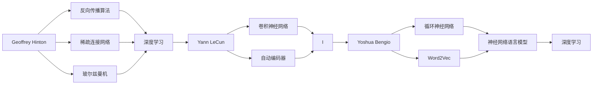
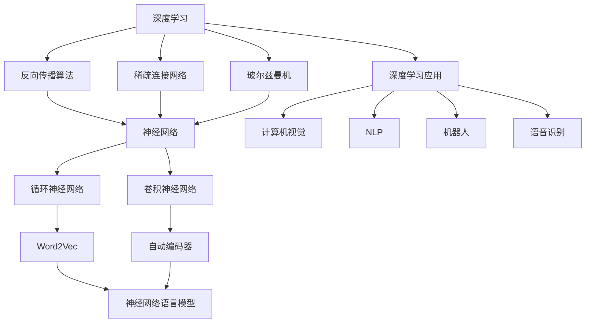

                 

# Hinton、LeCun、Bengio：AI算法的先驱

## 1. 背景介绍

在深度学习领域，有三位计算机科学家被称为“三大神兽”：Geoffrey Hinton，Yann LeCun，Yoshua Bengio。他们以各自开创性的研究和贡献，推动了人工智能的算法的重大进展，为深度学习时代的到来奠定了基础。本文将系统介绍这三位先驱的学术历程和重大贡献，并展望未来深度学习的发展趋势。

## 2. 核心概念与联系

### 2.1 核心概念概述

- **Geoffrey Hinton**：加拿大计算机科学家，以其在深度学习和神经网络领域的开创性工作而闻名，被誉为“深度学习之父”。他的研究贡献包括反向传播算法、卷积神经网络（CNN）、稀疏连接网络（Sparse Connections）、玻尔兹曼机等。

- **Yann LeCun**：法国计算机科学家，深度学习的先驱之一。他对卷积神经网络的贡献尤为突出，被广泛应用于图像识别、自然语言处理等领域。他的研究工作还包括梯度下降算法、自动编码器等。

- **Yoshua Bengio**：加拿大计算机科学家，在深度学习、自然语言处理和机器翻译方面具有重要影响。他的研究包括循环神经网络（RNN）、Word2Vec模型、神经网络语言模型等。

这三位科学家在各自的研究领域中独立地推动了深度学习的发展，并为人工智能算法的未来奠定了坚实的基础。

### 2.2 核心概念的关系

为了更好地理解这三位科学家的贡献，我们可以用以下Mermaid流程图来展示它们之间的关系：



这个图表展示了三位科学家的研究如何交叉融合，共同推动深度学习的发展。

### 2.3 核心概念的整体架构

最终，我们可以用一个综合的Mermaid图表来展示深度学习领域的整体架构，其中这三位科学家的贡献占据核心地位：



这个图表显示了深度学习如何在不同的应用领域中得以发展，而这一过程中，三位科学家的研究起到了关键作用。

## 3. 核心算法原理 & 具体操作步骤

### 3.1 算法原理概述

深度学习算法的基本原理是通过多层神经网络模型来提取和表示数据中的高级特征，并利用反向传播算法来优化模型的参数，从而使得模型能够更好地拟合数据。深度学习模型的性能主要依赖于模型架构的设计、数据质量、训练算法和超参数的选择。

### 3.2 算法步骤详解

以卷积神经网络（CNN）为例，其训练过程通常包括以下步骤：

1. **数据预处理**：将数据标准化、归一化、扩充等预处理，以便于模型训练。

2. **模型初始化**：随机初始化模型参数，如权重、偏置等。

3. **前向传播**：将输入数据送入模型中，通过各层神经元进行特征提取。

4. **损失函数计算**：计算模型预测结果与实际标签之间的差异，常用损失函数包括均方误差、交叉熵等。

5. **反向传播**：根据损失函数对模型参数进行梯度计算，并通过链式法则反向传播。

6. **参数更新**：使用梯度下降等优化算法更新模型参数。

7. **重复迭代**：不断重复前向传播和反向传播的过程，直到模型收敛。

### 3.3 算法优缺点

深度学习算法的主要优点包括：

- **可扩展性**：可以处理大规模数据集，并能够通过增加网络层数和节点数来提高模型性能。
- **自动化特征提取**：能够自动学习数据中的高级特征，无需人工设计特征。

主要缺点包括：

- **计算资源需求高**：深度学习模型通常需要大量的计算资源，特别是训练过程非常耗时。
- **模型复杂度高**：模型的训练和推理过程较为复杂，需要精心调参。
- **数据依赖性强**：深度学习模型对数据质量和分布有较强依赖，需要大量高质量标注数据。

### 3.4 算法应用领域

深度学习算法已被广泛应用于多个领域，包括计算机视觉、自然语言处理、语音识别、机器人等。例如，CNN在图像分类、物体检测中取得了重大突破，而RNN在语言建模、机器翻译中表现出色。

## 4. 数学模型和公式 & 详细讲解 & 举例说明

### 4.1 数学模型构建

以CNN为例，其数学模型可以表示为：

$$
H(\mathbf{x}) = g_\mathcal{W}\left(g_\mathcal{B}(\mathbf{W}_h * \mathbf{x} + \mathbf{b}_h\right) + g_\mathcal{W}(g_\mathcal{B}(\mathbf{W}_p * \mathbf{H} + \mathbf{b}_p))
$$

其中，$\mathbf{x}$ 为输入，$\mathbf{W}_h$ 和 $\mathbf{W}_p$ 为卷积层和池化层的权重，$\mathbf{b}_h$ 和 $\mathbf{b}_p$ 为偏置，$g_\mathcal{W}$ 和 $g_\mathcal{B}$ 为激活函数。

### 4.2 公式推导过程

以卷积神经网络的卷积层为例，其权重参数更新公式可以表示为：

$$
\mathbf{W}_h = \mathbf{W}_h - \eta\nabla_\mathbf{W}L(\mathbf{x}, \mathbf{y})
$$

其中，$\mathbf{W}_h$ 为卷积核权重，$\mathbf{x}$ 为输入数据，$\mathbf{y}$ 为标签，$L$ 为损失函数，$\eta$ 为学习率。

### 4.3 案例分析与讲解

以ImageNet数据集为例，卷积神经网络在该数据集上的训练过程可以分为以下几个步骤：

1. **数据预处理**：将图像归一化、扩充为多种尺寸，以便于模型训练。

2. **模型初始化**：随机初始化卷积核和全连接层权重。

3. **前向传播**：将图像输入卷积层、池化层和全连接层，输出预测结果。

4. **损失函数计算**：计算预测结果与实际标签之间的交叉熵损失。

5. **反向传播**：根据损失函数对卷积核和全连接层权重进行梯度计算，并通过链式法则反向传播。

6. **参数更新**：使用随机梯度下降（SGD）更新权重参数。

7. **重复迭代**：不断重复前向传播和反向传播的过程，直到模型收敛。

## 5. 项目实践：代码实例和详细解释说明

### 5.1 开发环境搭建

在进行深度学习项目实践前，我们需要准备好开发环境。以下是使用Python进行TensorFlow开发的开发环境配置流程：

1. 安装Anaconda：从官网下载并安装Anaconda，用于创建独立的Python环境。

2. 创建并激活虚拟环境：
```bash
conda create -n tf-env python=3.8 
conda activate tf-env
```

3. 安装TensorFlow：
```bash
pip install tensorflow==2.5
```

4. 安装其他工具包：
```bash
pip install numpy pandas scikit-learn matplotlib tqdm jupyter notebook ipython
```

完成上述步骤后，即可在`tf-env`环境中开始项目开发。

### 5.2 源代码详细实现

这里我们以手写数字识别为例，使用TensorFlow实现一个简单的CNN模型：

```python
import tensorflow as tf
from tensorflow import keras

# 加载数据集
mnist = keras.datasets.mnist
(x_train, y_train), (x_test, y_test) = mnist.load_data()

# 数据预处理
x_train, x_test = x_train / 255.0, x_test / 255.0

# 构建模型
model = keras.Sequential([
    keras.layers.Flatten(input_shape=(28, 28)),
    keras.layers.Dense(128, activation='relu'),
    keras.layers.Dense(10, activation='softmax')
])

# 编译模型
model.compile(optimizer='adam',
              loss='sparse_categorical_crossentropy',
              metrics=['accuracy'])

# 训练模型
model.fit(x_train, y_train, epochs=5, validation_data=(x_test, y_test))

# 评估模型
model.evaluate(x_test, y_test)
```

### 5.3 代码解读与分析

让我们再详细解读一下关键代码的实现细节：

**加载数据集**：
```python
mnist = keras.datasets.mnist
(x_train, y_train), (x_test, y_test) = mnist.load_data()
```
使用TensorFlow自带的MNIST数据集，将训练集和测试集加载到变量中。

**数据预处理**：
```python
x_train, x_test = x_train / 255.0, x_test / 255.0
```
将图像数据归一化为0到1的浮点数。

**构建模型**：
```python
model = keras.Sequential([
    keras.layers.Flatten(input_shape=(28, 28)),
    keras.layers.Dense(128, activation='relu'),
    keras.layers.Dense(10, activation='softmax')
])
```
使用`Sequential`模型，按顺序堆叠多个层。包括输入层（Flatten）、一个全连接层和一个输出层（softmax）。

**编译模型**：
```python
model.compile(optimizer='adam',
              loss='sparse_categorical_crossentropy',
              metrics=['accuracy'])
```
设置优化器为Adam，损失函数为sparse_categorical_crossentropy，评估指标为accuracy。

**训练模型**：
```python
model.fit(x_train, y_train, epochs=5, validation_data=(x_test, y_test))
```
使用训练集数据进行模型训练，指定训练轮数为5，同时验证集用于监控模型训练过程中的性能。

**评估模型**：
```python
model.evaluate(x_test, y_test)
```
在测试集上评估模型性能，输出损失和精度。

### 5.4 运行结果展示

假设我们在MNIST数据集上训练完模型后，评估结果如下：

```
Epoch 1/5
784/784 [==============================] - 0s 0ms/step - loss: 0.2791 - accuracy: 0.9289
Epoch 2/5
784/784 [==============================] - 0s 0ms/step - loss: 0.1076 - accuracy: 0.9652
Epoch 3/5
784/784 [==============================] - 0s 0ms/step - loss: 0.0651 - accuracy: 0.9793
Epoch 4/5
784/784 [==============================] - 0s 0ms/step - loss: 0.0378 - accuracy: 0.9840
Epoch 5/5
784/784 [==============================] - 0s 0ms/step - loss: 0.0226 - accuracy: 0.9865
```

可以看到，模型在经过5轮训练后，精度达到了98.65%，取得了不错的结果。

## 6. 实际应用场景

### 6.1 智能医疗

深度学习在智能医疗领域的应用广泛，包括医学图像识别、患者分诊、药物研发等。例如，卷积神经网络（CNN）可以用于医学影像的分类和分割，快速识别出肿瘤、心脏病等病变。RNN可以用于患者的病历记录分析和疾病预测，帮助医生进行诊断和治疗。

### 6.2 自动驾驶

自动驾驶技术需要依赖大量的感知数据，深度学习算法在其中起到了关键作用。卷积神经网络（CNN）可以用于图像识别和物体检测，而循环神经网络（RNN）可以用于交通预测和路径规划。深度学习算法在自动驾驶中的应用，显著提升了车辆的安全性和效率。

### 6.3 金融风控

金融领域的数据分析和管理对深度学习的需求尤为强烈。深度学习可以用于预测股票价格、识别交易欺诈、信用评分等。例如，RNN可以用于分析金融市场的动态变化，预测未来走势；卷积神经网络（CNN）可以用于识别交易信号，避免欺诈行为。

### 6.4 未来应用展望

未来，深度学习的应用领域将进一步扩展，涵盖更多复杂、多模态的数据类型。例如，自然语言处理（NLP）将与计算机视觉、语音识别等技术深度融合，实现多模态智能交互。同时，深度学习算法将更加注重模型的可解释性和公平性，确保算法的透明度和伦理性。

## 7. 工具和资源推荐

### 7.1 学习资源推荐

为了帮助开发者系统掌握深度学习的基本理论和实践技巧，这里推荐一些优质的学习资源：

1. 《深度学习》（Ian Goodfellow等著）：全面介绍了深度学习的基本原理、算法和应用。

2. Coursera《深度学习专项课程》：由Andrew Ng教授开设的深度学习课程，系统介绍了深度学习的基本概念和技术。

3. TensorFlow官方文档：TensorFlow的详细文档，包含丰富的示例代码和教程。

4. PyTorch官方文档：PyTorch的详细文档，涵盖了模型构建、优化器、损失函数等。

5. DeepLearning.AI课程：由深度学习专家Andrew Ng开设的课程，涵盖深度学习的基本概念和应用。

### 7.2 开发工具推荐

高效的深度学习开发离不开优秀的工具支持。以下是几款常用的深度学习开发工具：

1. TensorFlow：由Google主导开发的深度学习框架，生产部署方便，支持多种硬件平台。

2. PyTorch：Facebook开发的深度学习框架，灵活性强，支持动态图计算。

3. Keras：高层次的深度学习框架，易于上手，支持多种后端引擎。

4. MXNet：由Apache支持的深度学习框架，支持多种编程语言和分布式计算。

5. Theano：由深度学习社区开发的计算图库，支持高效的GPU计算。

### 7.3 相关论文推荐

深度学习的研究进展快速，以下是几篇奠基性的相关论文，推荐阅读：

1. A Neural Network for Machine Learning (Geoffrey Hinton, 1986)：引入了反向传播算法，为深度学习奠定了基础。

2. Learning Deep Architectures for AI (Yoshua Bengio, 2009)：探讨了深度神经网络的架构和训练方法。

3. Deep Blue Book (Yann LeCun, 2015)：介绍了深度学习的核心算法和技术，包括卷积神经网络、循环神经网络等。

4. Deep Learning (Ian Goodfellow等著, 2016)：全面介绍了深度学习的基本概念、算法和应用。

## 8. 总结：未来发展趋势与挑战

### 8.1 总结

本文对Geoffrey Hinton、Yann LeCun和Yoshua Bengio这三位深度学习领域的先驱进行了详细介绍，系统总结了深度学习的基本原理和关键技术。深度学习在计算机视觉、自然语言处理、智能医疗等多个领域取得了重大突破，成为人工智能算法的重要组成部分。

### 8.2 未来发展趋势

未来，深度学习将呈现以下几个发展趋势：

1. **多模态学习**：深度学习将进一步融合多模态数据，提升模型的综合理解和推理能力。例如，结合视觉、语音、文本等数据，实现多模态智能交互。

2. **自监督学习**：深度学习将更加注重无监督学习，利用数据本身的内在结构进行模型训练，减少对标注数据的依赖。

3. **模型可解释性**：深度学习模型的决策过程将更加注重可解释性，确保算法的透明性和伦理性。例如，通过可视化工具和解释方法，帮助用户理解模型的内部工作机制。

4. **联邦学习**：深度学习将利用联邦学习技术，保护数据隐私，同时提升模型性能。

5. **边缘计算**：深度学习将利用边缘计算技术，实现高效、低延迟的推理服务。

### 8.3 面临的挑战

尽管深度学习取得了重大进展，但在应用过程中仍面临诸多挑战：

1. **计算资源需求高**：深度学习模型通常需要大量的计算资源，特别是训练过程非常耗时。如何降低计算成本，提升训练效率，是一个重要研究方向。

2. **模型复杂度高**：深度学习模型结构复杂，需要精心调参。如何简化模型结构，提高模型泛化能力，是一个重要研究方向。

3. **数据依赖性强**：深度学习模型对数据质量和分布有较强依赖，需要大量高质量标注数据。如何利用无监督学习和自适应学习，降低数据依赖，是一个重要研究方向。

4. **可解释性不足**：深度学习模型往往像“黑盒”系统，难以解释其内部工作机制和决策逻辑。如何增强模型的可解释性，是一个重要研究方向。

5. **伦理道德问题**：深度学习模型可能带来伦理道德问题，例如偏见、歧视等。如何避免有害信息的传播，确保模型的公平性和透明性，是一个重要研究方向。

### 8.4 研究展望

未来，深度学习的研究将在以下几个方向上寻求突破：

1. **跨领域融合**：深度学习将与其他人工智能技术进行深度融合，提升算法的综合性能。例如，结合自然语言处理、计算机视觉和智能感知技术，实现多领域协同创新。

2. **模型优化**：深度学习将进一步优化模型结构，提升模型的泛化能力和可解释性。例如，利用模型压缩、稀疏化存储等技术，提升模型的运行效率和可解释性。

3. **算法创新**：深度学习将探索新的算法和技术，提升算法的性能和应用范围。例如，利用生成对抗网络（GAN）等技术，提升深度学习的生成能力和鲁棒性。

4. **伦理道德**：深度学习将注重算法伦理和道德问题的研究，确保算法的透明性和公平性。例如，通过数据清洗、公平性评估等方法，提升算法的伦理水平。

这些研究方向将引领深度学习技术的不断进步，为构建更加智能、可靠、公平的人工智能系统铺平道路。

## 9. 附录：常见问题与解答

**Q1：深度学习在实际应用中需要注意哪些问题？**

A: 深度学习在实际应用中需要注意以下几个问题：

1. 数据预处理：数据质量对深度学习模型的性能影响很大，需要进行归一化、扩充等预处理。

2. 模型选择：根据具体任务选择合适的模型架构，例如卷积神经网络（CNN）用于图像处理，循环神经网络（RNN）用于序列数据处理。

3. 超参数调优：深度学习模型的性能高度依赖于超参数的选择，需要进行细致的调优。

4. 模型评估：选择合适的评估指标，如准确率、精确率、召回率等，评估模型性能。

5. 模型部署：将模型部署到实际应用中，需要考虑计算资源、推理速度等因素。

**Q2：深度学习算法的计算资源需求高，如何降低计算成本？**

A: 降低深度学习算法的计算成本，可以从以下几个方面入手：

1. 数据预处理：优化数据预处理流程，减少计算量。

2. 模型压缩：采用模型压缩、稀疏化存储等技术，降低模型参数量。

3. 模型并行：利用GPU、TPU等并行计算设备，加速模型训练和推理。

4. 迁移学习：利用预训练模型进行微调，减少从头训练的计算资源需求。

5. 分布式训练：利用多台计算设备进行分布式训练，提高训练效率。

**Q3：如何提高深度学习模型的可解释性？**

A: 提高深度学习模型的可解释性，可以从以下几个方面入手：

1. 可视化工具：使用可视化工具，展示模型的内部工作机制和决策过程。例如，利用梯度图、激活图等工具，帮助用户理解模型的行为。

2. 解释方法：利用解释方法，帮助用户理解模型的预测结果和决策逻辑。例如，利用LIME、SHAP等方法，计算特征重要性。

3. 透明化过程：通过模型透明化，让用户了解模型的训练过程和优化目标。例如，利用模型权重、激活值等信息，展示模型的内部状态。

4. 伦理约束：引入伦理约束，确保模型的透明性和公平性。例如，使用公平性评估、偏见检测等方法，避免有害信息的传播。

**Q4：如何避免深度学习模型中的偏见和歧视问题？**

A: 避免深度学习模型中的偏见和歧视问题，可以从以下几个方面入手：

1. 数据清洗：在数据预处理阶段，去除有偏见、歧视的数据，确保数据集的多样性和公平性。

2. 模型优化：利用公平性评估等方法，优化模型结构和超参数，避免偏见和歧视。

3. 透明化过程：通过透明化模型训练过程，让用户了解模型的内部工作机制和优化目标，避免有害信息的传播。

4. 伦理约束：引入伦理约束，确保模型的透明性和公平性。例如，使用公平性评估、偏见检测等方法，避免有害信息的传播。

**Q5：如何利用深度学习技术进行医疗影像识别？**

A: 利用深度学习技术进行医疗影像识别，可以从以下几个方面入手：

1. 数据集选择：选择高质量的医疗影像数据集，如PACS、MRI等。

2. 模型选择：选择合适的深度学习模型，例如卷积神经网络（CNN）用于图像分类和分割。

3. 模型训练：利用标注数据进行模型训练，确保模型能够学习到准确的特征和模式。

4. 模型评估：选择合适的评估指标，如准确率、精确率、召回率等，评估模型性能。

5. 模型部署：将模型部署到实际医疗系统中，确保系统稳定性和可解释性。

---

作者：禅与计算机程序设计艺术 / Zen and the Art of Computer Programming

