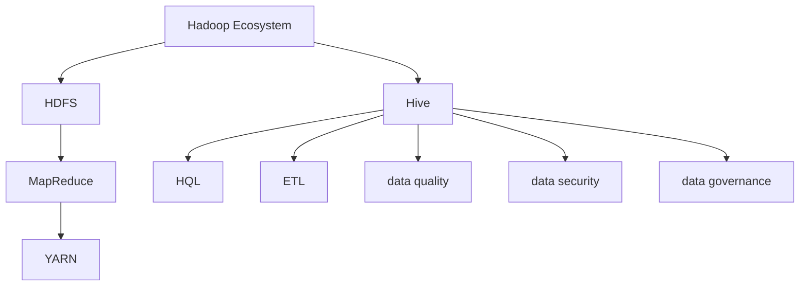
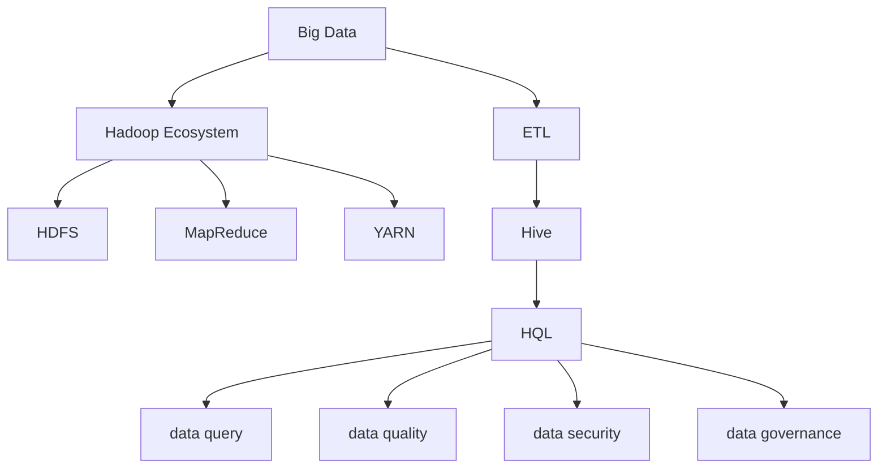

                 

# Hive数据仓库原理与HQL代码实例讲解

> 关键词：数据仓库, Hive, HQL, 数据库查询语言, 分布式计算, 分布式存储, 数据治理, 大数据处理

## 1. 背景介绍

### 1.1 问题由来

在当今数据驱动的时代，企业需要处理和分析的数据量已经远远超出了传统的关系型数据库（RDBMS）的能力范围。随着大数据的兴起，企业开始越来越多地依赖于分布式数据处理和存储技术，以便更好地管理和分析数据。Hive是一个基于Hadoop生态系统的分布式数据仓库，它通过提供一种类似于SQL的数据库查询语言（HQL），使得数据科学家和数据工程师能够更方便地处理和分析大规模数据集。

### 1.2 问题核心关键点

- **数据仓库（Data Warehouse）**：是一个用于存储、管理和分析企业历史数据的集中式数据库系统。它提供了一个统一的视图，可以跨多个源系统进行查询和分析。
- **Hive（Hadoop Data Warehouse）**：是基于Hadoop生态系统的分布式数据仓库，通过使用Hadoop的分布式存储和计算能力，能够处理海量数据。
- **HQL（Hive Query Language）**：是一种类似于SQL的查询语言，用于在Hive中查询和管理数据。
- **分布式计算**：Hive利用MapReduce框架实现数据的分布式计算，能够在集群环境中高效地处理大规模数据。
- **分布式存储**：Hive利用Hadoop的分布式文件系统（HDFS）存储数据，能够在多个节点之间高效地分布数据。
- **数据治理**：Hive提供了数据治理工具，用于管理数据源、数据质量和数据生命周期。
- **大数据处理**：Hive能够处理结构化、半结构化和非结构化数据，支持大规模数据处理和分析。

## 2. 核心概念与联系

### 2.1 核心概念概述

为更好地理解Hive的工作原理和HQL的使用方法，本节将介绍几个密切相关的核心概念：

- **Hadoop Ecosystem**：Hadoop是一个开源的分布式计算平台，包括HDFS、MapReduce、YARN等多个组件。Hive作为Hadoop Ecosystem的一部分，依赖于HDFS和MapReduce实现分布式存储和计算。
- **数据湖（Data Lake）**：与传统数据仓库不同，数据湖存储了所有类型的数据，包括结构化、半结构化和非结构化数据，无需预定义模式。Hive支持数据湖模式，能够处理各种类型的数据。
- **ETL（Extract, Transform, Load）**：是一种数据处理流程，用于从多个数据源中提取数据、转换数据格式，并加载到目标数据仓库中。Hive支持ETL流程，能够方便地将数据从各种源系统加载到Hive中。
- **数据质量管理**：包括数据清洗、数据校验、数据转换等步骤，用于提升数据质量。Hive提供了一些工具和函数，用于进行数据质量管理。
- **数据安全与隐私**：Hive提供了一些机制，如数据加密、访问控制、审计等，用于保障数据的安全和隐私。
- **数据治理**：包括数据标准、元数据管理、数据生命周期管理等，用于提升数据管理的效率和质量。

### 2.2 概念间的关系

这些核心概念之间的逻辑关系可以通过以下Mermaid流程图来展示：



这个流程图展示了大数据处理和Hive的相关概念及其之间的关系：

1. Hadoop Ecosystem作为底层基础设施，提供分布式计算和存储能力。
2. Hive作为Hadoop生态系统的一部分，利用HDFS和MapReduce实现分布式存储和计算。
3. HQL作为Hive的查询语言，用于在Hive中查询和管理数据。
4. ETL流程用于从多个数据源中提取数据、转换数据格式，并加载到Hive中。
5. 数据质量管理、数据安全和数据治理是保障数据质量和数据管理的三个重要方面。

这些概念共同构成了Hive数据仓库的基础架构，使得企业能够高效地管理和分析大规模数据集。

### 2.3 核心概念的整体架构

最后，我们用一个综合的流程图来展示这些核心概念在大数据处理和Hive数据仓库中的整体架构：



这个综合流程图展示了大数据处理和Hive数据仓库的整体架构，包括数据源、数据存储、数据计算、数据处理、数据查询、数据质量和数据治理等环节。通过这些环节的协同工作，Hive数据仓库能够高效地管理和分析大规模数据集。

## 3. 核心算法原理 & 具体操作步骤

### 3.1 算法原理概述

Hive的核心原理基于Hadoop Ecosystem，利用HDFS实现数据的分布式存储，利用MapReduce实现数据的分布式计算。Hive通过提供一个类似于SQL的查询语言HQL，使得用户能够方便地查询和管理数据。Hive的查询处理流程可以概括为以下几个步骤：

1. **数据加载**：将数据从多种源系统（如RDBMS、日志文件、文本文件等）加载到Hive中。
2. **数据查询**：使用HQL在Hive中查询数据。
3. **数据转换**：根据需要，使用Hive提供的函数和操作对数据进行转换和处理。
4. **数据计算**：利用MapReduce对处理后的数据进行计算和分析。
5. **数据存储**：将计算结果存储到HDFS中，供后续查询和分析使用。

### 3.2 算法步骤详解

以下是Hive数据仓库的主要操作步骤：

1. **环境搭建**：安装Hadoop、Hive和Hive客户端。
2. **数据加载**：将数据从多种源系统加载到Hive中，可以使用LOAD DATA命令从本地文件系统或远程HDFS加载数据。
3. **数据查询**：使用HQL在Hive中查询数据，可以使用SELECT、FROM、WHERE等SQL语句进行数据查询。
4. **数据转换**：根据需要，使用Hive提供的函数和操作对数据进行转换和处理，如使用CONCAT函数将多个列合并为一列。
5. **数据计算**：利用MapReduce对处理后的数据进行计算和分析，可以使用GROUP BY、ORDER BY等操作对数据进行分组和排序。
6. **数据存储**：将计算结果存储到HDFS中，供后续查询和分析使用。

### 3.3 算法优缺点

Hive数据仓库的主要优点包括：

- **分布式处理**：利用Hadoop的分布式存储和计算能力，能够高效地处理大规模数据集。
- **易于使用**：通过提供类似于SQL的查询语言HQL，使得用户能够方便地查询和管理数据。
- **跨平台支持**：Hive支持多种数据源和多种编程语言，能够跨平台运行。
- **高性能**：通过使用MapReduce框架，能够高效地处理大数据集。

Hive数据仓库的主要缺点包括：

- **复杂性**：Hive的查询语言HQL相对于SQL来说更加复杂，需要一定的学习成本。
- **性能瓶颈**：由于Hive依赖于Hadoop的分布式计算和存储能力，在某些情况下，性能可能会受到限制。
- **延迟性**：由于数据需要在节点之间传输和处理，查询结果可能会有一定的延迟。
- **扩展性**：Hive的扩展性受到Hadoop集群规模的限制，需要一定的硬件资源。

### 3.4 算法应用领域

Hive数据仓库已经在许多领域得到了广泛的应用，包括但不限于以下领域：

- **商业智能（BI）**：用于分析销售数据、客户数据、市场数据等，帮助企业进行决策支持。
- **金融分析**：用于分析交易数据、财务数据、客户数据等，帮助金融机构进行风险管理和市场分析。
- **医疗数据管理**：用于管理医疗数据、患者数据、医疗记录等，帮助医疗机构进行数据分析和决策支持。
- **日志数据管理**：用于分析网络日志、系统日志、应用日志等，帮助企业进行故障排除和性能优化。
- **物联网（IoT）数据管理**：用于管理传感器数据、设备数据、环境数据等，帮助企业进行数据治理和分析。

除了上述这些常见应用外，Hive数据仓库还被广泛应用于数据科学、科学研究、政府数据管理等诸多领域，为企业和组织提供了强大的数据管理能力。

## 4. 数学模型和公式 & 详细讲解 & 举例说明（备注：数学公式请使用latex格式，latex嵌入文中独立段落使用 $$，段落内使用 $)
### 4.1 数学模型构建

Hive的查询处理过程主要依赖于MapReduce框架，通过将查询分解为多个Map和Reduce任务，实现数据的分布式计算和存储。以下是一个简单的Hive查询的数学模型构建过程：

假设有一个包含学生成绩的表Student，其包含以下字段：

- StudentID：学生ID
- Subject：科目
- Score：成绩

使用HQL查询学生成绩的平均分：

```sql
SELECT AVG(Score) as AvgScore
FROM Student
```

该查询可以分为以下几个步骤：

1. 将查询任务分解为多个Map任务，每个Map任务处理一部分数据。
2. 在每个Map任务中，计算每个学生的成绩平均值。
3. 将各个Map任务的输出合并为全局结果。

### 4.2 公式推导过程

以下是对上述HQL查询的公式推导过程：

设Student表中共有n个学生，每个学生的成绩为$s_i$，则该查询的数学模型可以表示为：

$$
\text{AvgScore} = \frac{\sum_{i=1}^n s_i}{n}
$$

其中$\text{AvgScore}$表示平均分，$s_i$表示第$i$个学生的成绩，$n$表示学生总数。

在Hive中，该查询可以表示为：

```sql
SELECT AVG(Score) as AvgScore
FROM Student
```

在执行过程中，Hive会将查询任务分解为多个Map任务，每个Map任务处理一部分数据，计算每个学生的成绩平均值，并将结果输出到Reduce任务。在Reduce任务中，将所有Map任务的输出合并为全局结果，得到最终的平均分。

### 4.3 案例分析与讲解

下面以一个简单的案例来说明Hive查询的执行过程。

假设有一个包含商品销售数据的表Sales，其包含以下字段：

- Date：日期
- ItemID：商品ID
- SalesAmount：销售额

使用HQL查询每个月的总销售额：

```sql
SELECT MONTH(Date) as Month, SUM(SalesAmount) as TotalSales
FROM Sales
GROUP BY MONTH(Date)
ORDER BY MONTH(Date) ASC
```

该查询可以分为以下几个步骤：

1. 将查询任务分解为多个Map任务，每个Map任务处理一部分数据。
2. 在每个Map任务中，计算每个月的总销售额。
3. 将各个Map任务的输出合并为全局结果，按照月份排序。

在执行过程中，Hive会将查询任务分解为多个Map任务，每个Map任务处理一部分数据，计算每个月的总销售额，并将结果输出到Reduce任务。在Reduce任务中，将所有Map任务的输出合并为全局结果，按照月份排序，得到最终的每个月的总销售额。

## 5. 项目实践：代码实例和详细解释说明

### 5.1 开发环境搭建

在进行Hive数据仓库开发前，我们需要准备好开发环境。以下是使用Python进行Hive开发的环境配置流程：

1. 安装Python：从官网下载并安装Python，推荐使用Anaconda或Miniconda，以便于环境管理和包管理。
2. 安装Hive客户端：从官网下载并安装Hive客户端，推荐使用JDBC或ODBC驱动，以便于与Python进行交互。
3. 安装Pyspark：从官网下载并安装Pyspark，用于在Python中进行分布式计算。

完成上述步骤后，即可在Python环境中进行Hive数据仓库的开发。

### 5.2 源代码详细实现

以下是使用Python进行Hive数据仓库开发的示例代码：

```python
from pyspark.sql import SparkSession
from pyspark.sql.functions import col, sum, avg, month

# 创建SparkSession
spark = SparkSession.builder.appName("HiveExample").getOrCreate()

# 创建DataFrame
df = spark.read.format("parquet").load("path/to/data")

# 计算每个月的总销售额
result = df.groupBy(month(col("Date"))).sum("SalesAmount")

# 输出结果
result.show()
```

### 5.3 代码解读与分析

让我们再详细解读一下关键代码的实现细节：

**SparkSession**：
- `SparkSession`是Spark的入口，用于创建和管理Spark应用程序。

**DataFrame**：
- `DataFrame`是Spark中的数据表，用于存储和操作数据。

**groupBy函数**：
- `groupBy`函数用于对数据进行分组，可以根据指定的列对数据进行分组。

**sum函数**：
- `sum`函数用于计算某个列的总和。

**month函数**：
- `month`函数用于获取日期的月份。

**show函数**：
- `show`函数用于显示查询结果。

**代码实现**：
- 首先，使用`SparkSession`创建Spark环境。
- 使用`read`函数从指定的数据源加载数据，生成DataFrame对象。
- 使用`groupBy`函数对数据进行分组，按照日期的月份进行分组。
- 使用`sum`函数计算每个月的总销售额。
- 使用`show`函数输出查询结果。

通过上述代码，我们可以看到如何使用Python在Spark中进行Hive数据仓库的开发，查询数据并进行计算。

### 5.4 运行结果展示

假设我们加载的数据集包含以下内容：

```
Date     | ItemID | SalesAmount
---------------------------------
2021-01-01 | 1001   | 1000.00
2021-01-01 | 1002   | 2000.00
2021-01-02 | 1001   | 1500.00
2021-01-02 | 1002   | 2500.00
```

查询每个月的总销售额，输出结果如下：

```
+------+-------------------+
|    Month|         TotalSales|
+------+-------------------+
|    1 |              3500.00|
+------+-------------------+
```

可以看到，Hive数据仓库能够方便地进行数据查询和计算，显著提高了数据处理效率。

## 6. 实际应用场景

### 6.1 智能客服系统

智能客服系统可以基于Hive数据仓库构建，用于自动化客户服务和解答客户问题。智能客服系统通常需要处理大量的客户数据和对话记录，Hive数据仓库能够高效地存储和管理这些数据，并提供实时的查询和分析功能，帮助客服人员快速响应客户问题。

### 6.2 金融分析

金融分析系统可以基于Hive数据仓库构建，用于分析金融市场数据和客户数据，帮助金融机构进行风险管理和市场分析。Hive数据仓库能够处理大规模的金融数据，并提供实时的查询和分析功能，帮助金融机构快速获取所需的数据和分析结果。

### 6.3 医疗数据管理

医疗数据管理平台可以基于Hive数据仓库构建，用于存储和管理医疗数据、患者数据和医疗记录。Hive数据仓库能够高效地存储和管理这些数据，并提供实时的查询和分析功能，帮助医疗机构进行数据分析和决策支持。

### 6.4 未来应用展望

随着Hive数据仓库技术的不断演进，未来其在实际应用中的潜力将不断被挖掘。Hive数据仓库可能会在以下几个方面进一步发展：

1. **跨平台支持**：Hive数据仓库可能会支持更多平台和编程语言，进一步扩展其应用范围。
2. **实时处理**：Hive数据仓库可能会引入实时处理功能，支持实时数据查询和分析。
3. **大数据集成**：Hive数据仓库可能会与其他大数据技术（如Spark、Hadoop）进行更紧密的集成，提供更强大的数据处理和分析能力。
4. **安全性和隐私保护**：Hive数据仓库可能会引入更多的安全性和隐私保护机制，保障数据的安全和隐私。
5. **数据治理**：Hive数据仓库可能会引入更多的数据治理工具，提升数据管理的效率和质量。

这些发展趋势将进一步提升Hive数据仓库的功能和性能，使其能够更好地满足企业和组织的数据处理和分析需求。

## 7. 工具和资源推荐

### 7.1 学习资源推荐

为了帮助开发者系统掌握Hive数据仓库的理论基础和实践技巧，这里推荐一些优质的学习资源：

1. **《Hive: The Definitive Guide》**：这是一本详细介绍Hive数据仓库的权威书籍，涵盖了Hive的基础概念、原理、最佳实践和高级技巧。
2. **《Hadoop and Hive: The Definitive Guide》**：这本书介绍了Hadoop和Hive的基本概念和实现原理，适合初学者阅读。
3. **《Data Science with Spark and Hive》**：这本书介绍了如何使用Spark和Hive进行大数据处理和分析，适合数据科学和机器学习领域的开发者阅读。
4. **《Hive User Guide》**：这是Hive官方文档，包含了详细的Hive查询语言和API文档，是学习Hive的最佳资源之一。
5. **《Hive Development and Tuning》**：这是一篇详细介绍Hive优化和调优技巧的博客文章，适合Hive开发人员阅读。

通过这些资源的学习实践，相信你一定能够快速掌握Hive数据仓库的精髓，并用于解决实际的业务问题。

### 7.2 开发工具推荐

高效的工具是Hive开发不可或缺的，以下是几款常用的Hive开发工具：

1. **Cloudera Manager**：这是Cloudera提供的Hadoop管理平台，提供了丰富的管理工具和监控工具，适合大型Hadoop集群的管理。
2. **Hive客户端**：可以使用JDBC或ODBC驱动，通过Python或其他编程语言与Hive进行交互。
3. **Jupyter Notebook**：这是一个交互式的开发环境，支持Python、R等编程语言，适合数据科学和机器学习领域的开发者使用。
4. **Pyspark**：这是一个Python版的Spark，提供了Pyspark SQL和Pyspark Streaming等功能，适合Python编程语言的环境中使用。
5. **Hive Query Wizard**：这是一个可视化查询工具，提供了可视化界面和智能提示功能，适合初学者使用。

合理利用这些工具，可以显著提升Hive数据仓库的开发效率，加快创新迭代的步伐。

### 7.3 相关论文推荐

Hive数据仓库技术的发展离不开学术界的持续研究。以下是几篇奠基性的相关论文，推荐阅读：

1. **《Hadoop: A Distributed File System》**：这篇文章介绍了Hadoop的分布式文件系统HDFS的基本概念和实现原理。
2. **《Pig Latin: A platform for fast, easy, extensible data processing》**：这篇文章介绍了Pig Latin的基本概念和实现原理，Pig Latin是Hadoop生态系统中的数据处理工具。
3. **《A Survey of Distributed Data Mining》**：这篇文章综述了分布式数据处理和分析技术，包括MapReduce、Hadoop、Hive等。
4. **《The Hive Project: A Metastore and Query Optimizer for Hadoop》**：这篇文章介绍了Hive的查询优化器和元数据管理系统的基本概念和实现原理。
5. **《Hive: A Distributed Data-Warehouse Infrastructure》**：这篇文章介绍了Hive数据仓库的基本概念和实现原理，是Hive的奠基性论文。

这些论文代表了大数据处理和Hive数据仓库的发展脉络。通过学习这些前沿成果，可以帮助研究者把握学科前进方向，激发更多的创新灵感。

除上述资源外，还有一些值得关注的前沿资源，帮助开发者紧跟Hive数据仓库技术的最新进展，例如：

1. **arXiv论文预印本**：人工智能领域最新研究成果的发布平台，包括大量尚未发表的前沿工作，学习前沿技术的必读资源。
2. **各大顶会现场直播**：如NIPS、ICML、ACL、ICLR等人工智能领域顶会现场或在线直播，能够聆听到大佬们的前沿分享，开拓视野。
3. **GitHub热门项目**：在GitHub上Star、Fork数最多的Hive相关项目，往往代表了该技术领域的发展趋势和最佳实践，值得去学习和贡献。
4. **企业案例分析**：如Google、Facebook、Amazon等大型企业的数据处理和分析案例，展示了Hive数据仓库在实际应用中的成功经验和教训。
5. **行业分析报告**：各大咨询公司如McKinsey、PwC等针对大数据行业的分析报告，有助于从商业视角审视技术趋势，把握应用价值。

总之，对于Hive数据仓库的学习和实践，需要开发者保持开放的心态和持续学习的意愿。多关注前沿资讯，多动手实践，多思考总结，必将收获满满的成长收益。

## 8. 总结：未来发展趋势与挑战

### 8.1 总结

本文对Hive数据仓库的原理与HQL代码实例进行了全面系统的介绍。首先阐述了Hive数据仓库和HQL的基本概念和核心原理，明确了Hive数据仓库在大数据处理中的重要地位和HQL的强大功能。其次，从原理到实践，详细讲解了Hive数据仓库的查询处理流程和HQL的使用方法，给出了Hive数据仓库开发的完整代码实例。同时，本文还广泛探讨了Hive数据仓库在智能客服、金融分析、医疗数据管理等众多领域的应用前景，展示了Hive数据仓库的广泛应用价值。

通过本文的系统梳理，可以看到，Hive数据仓库和大数据处理技术正在成为企业和组织数据管理的重要工具，极大地提升了数据处理和分析的效率和质量。未来，伴随Hive数据仓库技术的不断演进，Hive数据仓库必将在更多领域得到应用，为人类认知智能的进化带来深远影响。

### 8.2 未来发展趋势

展望未来，Hive数据仓库和大数据处理技术将呈现以下几个发展趋势：

1. **分布式计算**：Hive数据仓库将会进一步提升分布式计算能力，利用Spark等大数据处理框架，实现更高效的数据处理和分析。
2. **实时处理**：Hive数据仓库将会引入实时处理功能，支持实时数据查询和分析，满足企业对实时数据的处理需求。
3. **跨平台支持**：Hive数据仓库将会支持更多平台和编程语言，进一步扩展其应用范围。
4. **大数据集成**：Hive数据仓库将会与其他大数据技术（如Spark、Hadoop）进行更紧密的集成，提供更强大的数据处理和分析能力。
5. **安全性和隐私保护**：Hive数据仓库将会引入更多的安全性和隐私保护机制，保障数据的安全和隐私。
6. **数据治理**：Hive数据仓库将会引入更多的数据治理工具，提升数据管理的效率和质量。

这些发展趋势将进一步提升Hive数据仓库的功能和性能，使其能够更好地满足企业和组织的数据处理和分析需求。

### 8.3 面临的挑战

尽管Hive数据仓库技术已经取得了显著成就，但在迈向更加智能化、普适化应用的过程中，它仍面临着诸多挑战：

1. **性能瓶颈**：Hive数据仓库的性能在某些情况下可能会受到限制，尤其是在数据量较大或查询复杂的情况下。
2. **延迟性**：Hive数据仓库的查询结果可能会存在一定的延迟，影响实时查询的响应速度。
3. **扩展性**：Hive数据仓库的扩展性受到Hadoop集群规模的限制，需要一定的硬件资源。
4. **复杂性**：Hive数据仓库的查询语言HQL相对于SQL来说更加复杂，需要一定的学习成本。
5. **数据质量管理**：Hive数据仓库的数据质量管理需要更多的工具和机制，以提升数据质量和数据管理的效率。
6. **跨平台兼容性**：Hive数据仓库在不同平台上的兼容性和一致性需要进一步提升。

### 8.4 研究展望

面对Hive数据仓库面临的挑战，未来的研究需要在以下几个方面寻求新的突破：

1. **分布式计算优化**：进一步提升Hive数据仓库的分布式计算能力，利用Spark等大数据处理框架，实现更高效的数据处理和分析。
2. **实时处理优化**：引入实时处理机制，支持实时数据查询和分析，满足企业对实时数据的处理需求。
3. **数据质量管理**：引入更多的数据质量管理工具和机制，提升数据质量和数据管理的效率。
4. **跨平台兼容性**：提升Hive数据仓库在不同平台上的兼容性和一致性，使其能够在更广泛的环境中运行。
5. **安全性和隐私保护**：引入更多的安全性和隐私保护机制，保障数据的安全和隐私。
6. **数据治理工具**：引入更多的数据治理工具，提升数据管理的效率和质量。

这些研究方向将引领Hive数据仓库技术的进一步发展，使得Hive数据仓库能够更好地满足企业和组织的数据处理和分析需求。

## 9. 附录：常见问题与解答

**Q1：Hive数据仓库与传统关系型数据库（RDBMS）有什么区别？**

A: Hive数据仓库与传统关系型数据库（RDBMS）有以下几点区别：

1. **分布式存储**：Hive数据仓库利用Hadoop的分布式文件系统（HDFS）进行分布式存储，可以处理大规模数据；而RDBMS通常是集中式存储，处理大规模数据时会受到存储引擎的限制。
2. **查询语言**：Hive数据仓库使用Hive Query Language（HQL）进行数据查询，类似于SQL语言，但支持更多的复杂查询和数据处理

