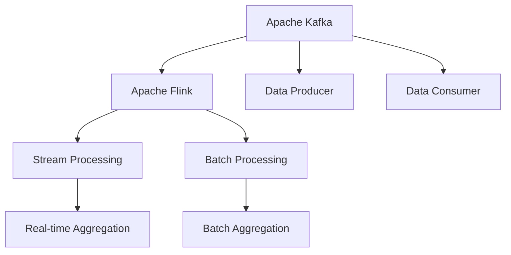
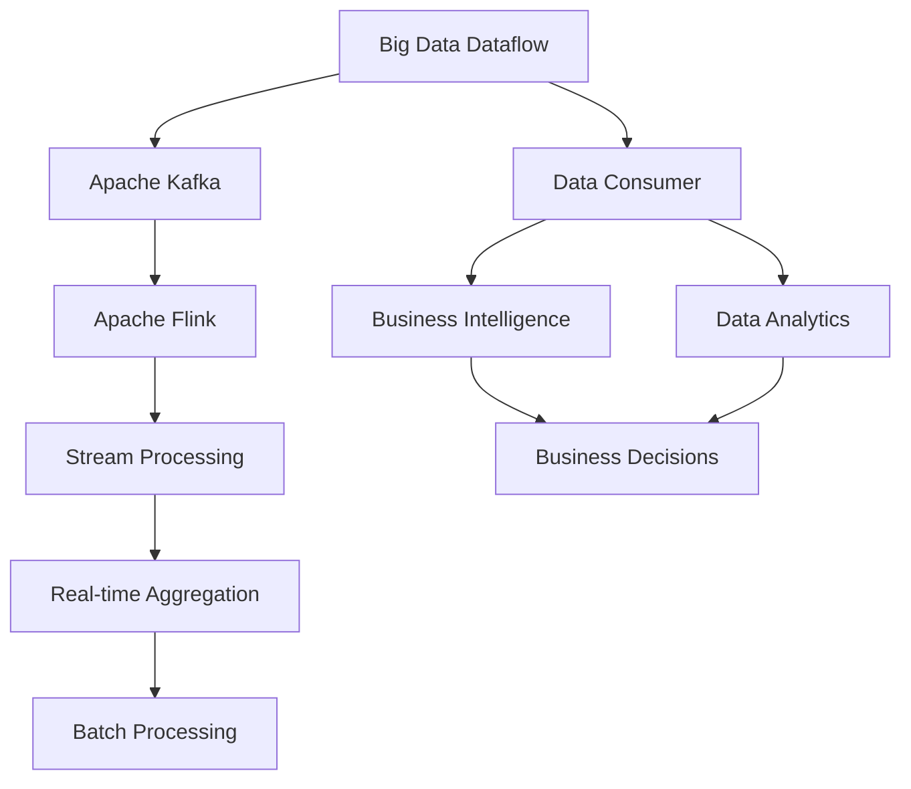

                 

# Kafka-Flink整合原理与代码实例讲解

> 关键词：Kafka、Apache Flink、流式数据处理、分布式计算、大数据技术、实时数据流、数据整合、微服务架构

## 1. 背景介绍

在当前数字化转型的大背景下，实时数据处理和流式数据处理变得尤为重要。企业需要高效处理海量实时数据，进行实时分析和决策，从而快速响应市场变化。其中，Apache Kafka和Apache Flink是两个极具影响力的开源项目，分别负责数据的流式生产和流式计算。如何将两者有机整合，构建高效、可扩展的实时数据处理系统，成为众多企业面临的重要挑战。

Kafka作为全球领先的开源流处理平台，提供了高吞吐量、低延迟的分布式消息系统，支持数据的实时生产和消费。而Flink作为谷歌开源的分布式流处理引擎，具备强大的数据处理和流式计算能力，支持复杂事件处理、窗口计算等高级计算模型。Kafka和Flink的整合可以充分发挥两者的优势，实现高效、可靠的实时数据处理。

本文将详细讲解Kafka和Flink的整合原理，并结合代码实例，帮助读者深入理解其实现机制和应用场景。

## 2. 核心概念与联系

### 2.1 核心概念概述

- **Apache Kafka**：高吞吐量、低延迟的分布式消息系统，用于数据的实时生产和消费。Kafka的流式模型使得它成为实时数据处理的理想平台。

- **Apache Flink**：基于内存的分布式流处理引擎，支持复杂事件处理、窗口计算、图计算等高级计算模型。Flink能够高效处理海量实时数据，并支持分布式计算。

- **Kafka-Flink**：Kafka和Flink的整合，形成了一个完整的实时数据流处理生态系统。通过Kafka作为数据的源和目的地，Flink进行数据的实时计算和分析。

### 2.2 核心概念关系

Kafka-Flink整合的原理和关系可以通过以下Mermaid流程图来展示：



该流程图展示了Kafka和Flink之间的数据流关系：

- Kafka作为数据的生产者和消费者，支持数据的实时读写。
- Flink作为数据处理引擎，能够进行复杂事件的实时计算和批处理。
- 通过Kafka的分区模型和Flink的窗口计算，可以实现高效、可靠的实时数据处理。

### 2.3 核心概念的整体架构

以下是一个综合的流程图，展示了大规模Kafka-Flink的整个架构：



该流程图展示了Kafka-Flink在大规模数据流处理中的应用架构：

- Kafka负责数据的实时传输。
- Flink进行数据的流式计算和批处理。
- 实时计算结果可通过Kafka送至BI和数据仓库等下游系统。
- 批处理结果也可通过Kafka送至后续的分析系统。

## 3. 核心算法原理 & 具体操作步骤

### 3.1 算法原理概述

Kafka-Flink的整合算法主要基于以下几个关键点：

1. **数据的实时读写**：Kafka支持数据的实时生产和消费，能够提供高吞吐量、低延迟的数据流。

2. **数据的流式计算**：Flink基于内存的分布式流处理引擎，能够高效处理海量实时数据，并支持复杂的流式计算。

3. **数据的分散和聚合**：Kafka通过分区机制，将数据分散到多个分区中，Flink通过窗口机制，对数据进行聚合处理。

4. **数据的一致性和可靠性**：Kafka和Flink都提供了强一致性和高可靠性的保障，确保数据处理的安全和稳定性。

### 3.2 算法步骤详解

#### 3.2.1 数据实时读写

Kafka的实时读写机制主要通过生产者和消费者来实现。生产者将数据发送到Kafka的某个主题中，消费者则从该主题中读取数据，并进行后续处理。

- **生产者配置**：
  - 配置Kafka的生产者端点、主题名、分区数等参数。
  - 设置生产者批量大小、重试次数等参数。

- **消费者配置**：
  - 配置Kafka的消费者端点、主题名、分区数等参数。
  - 设置消费者批量大小、消费策略等参数。

#### 3.2.2 数据的流式计算

Flink的流式计算主要通过Stream API和DataStream API来实现。生产者将数据发送到Kafka的某个主题中，Flink通过Stream API和DataStream API，从该主题中读取数据，并进行实时计算和分析。

- **创建流**：
  - 使用DataStream API创建数据流。
  - 通过Kafka的订阅机制，从Kafka主题中读取数据。

- **数据处理**：
  - 对读取的数据进行流式计算和分析。
  - 使用Flink的API进行窗口计算、聚合计算、状态管理等操作。

#### 3.2.3 数据的分散和聚合

Kafka通过分区机制，将数据分散到多个分区中。Flink通过窗口机制，对数据进行聚合处理。

- **分区配置**：
  - 在Kafka中配置分区的数量和分配策略。
  - 在Flink中配置分区的数量和分配策略。

- **窗口配置**：
  - 配置Flink的窗口大小、滑动间隔等参数。
  - 使用Flink的API进行窗口计算和聚合操作。

#### 3.2.4 数据的一致性和可靠性

Kafka和Flink都提供了强一致性和高可靠性的保障，确保数据处理的安全和稳定性。

- **Kafka的可靠性**：
  - Kafka使用消息队列的方式，将数据进行可靠的存储和传输。
  - Kafka通过双副本机制，确保数据的冗余和可靠性。

- **Flink的可靠性**：
  - Flink使用内存和状态的机制，保证数据的可靠性和一致性。
  - Flink通过分布式任务管理，确保数据处理的可靠性和稳定性。

### 3.3 算法优缺点

Kafka-Flink整合的优势在于：

1. **高吞吐量**：Kafka和Flink的高吞吐量特性，使得系统能够处理海量实时数据。

2. **低延迟**：Kafka和Flink的低延迟特性，使得系统能够实现实时数据的快速处理。

3. **分布式计算**：Kafka和Flink的分布式计算特性，使得系统能够扩展到大规模集群。

4. **强一致性**：Kafka和Flink都提供了强一致性和高可靠性的保障，确保数据处理的安全和稳定性。

然而，Kafka-Flink整合也存在以下缺点：

1. **复杂性**：Kafka-Flink整合涉及的数据流、流式计算和分布式计算等技术，需要一定的技术积累和实践经验。

2. **部署难度**：Kafka和Flink的部署需要一定的运维和管理能力，对系统的稳定性和可靠性要求较高。

3. **性能瓶颈**：在大规模数据流的处理中，可能会遇到性能瓶颈和资源限制，需要进行优化和调整。

### 3.4 算法应用领域

Kafka-Flink整合在以下领域得到了广泛的应用：

1. **金融交易**：实时处理金融交易数据，进行高频交易、风险控制等分析。

2. **电商推荐**：实时处理用户行为数据，进行个性化推荐和广告投放。

3. **物联网**：实时处理传感器数据，进行设备监控、智能控制等应用。

4. **实时日志分析**：实时处理日志数据，进行故障检测、性能优化等分析。

5. **智能制造**：实时处理生产数据，进行设备维护、质量控制等应用。

## 4. 数学模型和公式 & 详细讲解 & 举例说明

### 4.1 数学模型构建

Kafka-Flink的数学模型主要基于流式数据处理和流式计算的基本原理，包括以下几个关键要素：

1. **流式数据模型**：数据流模型描述了数据的生产和消费过程，包括数据的实时读写、分区和聚合等操作。

2. **流式计算模型**：流式计算模型描述了数据的计算过程，包括实时计算、聚合计算、窗口计算等操作。

3. **分布式计算模型**：分布式计算模型描述了数据的分布式处理过程，包括任务划分、数据分区、状态管理等操作。

### 4.2 公式推导过程

#### 4.2.1 流式数据模型

流式数据模型的基本公式为：

$$
X = \bigcup_{t \in T} S_t
$$

其中 $X$ 为流数据集，$S_t$ 为时间区间 $t$ 内的数据集，$T$ 为时间区间集合。

- **数据生产**：生产者将数据发送到Kafka的主题中，形成时间区间 $t$ 内的数据集 $S_t$。
- **数据消费**：消费者从Kafka的主题中读取数据，形成流数据集 $X$。

#### 4.2.2 流式计算模型

流式计算模型的基本公式为：

$$
Y = \bigcup_{t \in T} \phi(S_t)
$$

其中 $Y$ 为流计算结果集，$\phi$ 为流计算函数，$S_t$ 为时间区间 $t$ 内的数据集，$T$ 为时间区间集合。

- **实时计算**：Flink通过Stream API和DataStream API，对流数据集 $S_t$ 进行实时计算，形成流计算结果集 $Y$。
- **批处理计算**：Flink通过Window API，对流数据集 $S_t$ 进行批处理计算，形成批处理结果集 $Y$。

#### 4.2.3 分布式计算模型

分布式计算模型的基本公式为：

$$
Z = \bigcup_{t \in T} \psi(S_t)
$$

其中 $Z$ 为分布式计算结果集，$\psi$ 为分布式计算函数，$S_t$ 为时间区间 $t$ 内的数据集，$T$ 为时间区间集合。

- **任务划分**：Flink将计算任务划分为多个子任务，并分配到多个计算节点上。
- **数据分区**：Kafka将数据分散到多个分区中，Flink将数据聚合到多个分区上。
- **状态管理**：Flink通过状态管理机制，确保数据的可靠性和一致性。

### 4.3 案例分析与讲解

以下是一个简单的案例分析：

假设某电商平台的实时日志数据通过Kafka流式传输到Flink中进行实时分析和处理。

1. **数据生产**：
  - 用户点击商品产生日志数据。
  - 日志数据通过Kafka实时写入。

2. **流式计算**：
  - Flink从Kafka的主题中读取日志数据。
  - 使用Stream API进行实时计算，统计每小时的用户点击数。
  - 使用Window API进行批处理计算，统计每天的平均点击数。

3. **数据分区**：
  - Kafka将日志数据分散到多个分区中。
  - Flink将数据聚合到多个分区上，进行分布式计算。

4. **数据一致性**：
  - Kafka通过双副本机制，确保数据的冗余和可靠性。
  - Flink通过状态管理机制，确保数据的可靠性和一致性。

## 5. 项目实践：代码实例和详细解释说明

### 5.1 开发环境搭建

以下是使用Java和Scala搭建Kafka-Flink环境的流程：

1. 安装Java和Scala环境。

2. 安装Kafka和Flink。

3. 配置Kafka和Flink环境。

4. 启动Kafka和Flink服务。

### 5.2 源代码详细实现

以下是使用Java和Scala实现Kafka-Flink的代码示例：

```java
// Kafka消费者
KafkaConsumer<String, String> consumer = new KafkaConsumer<>(props, new ValueDeserializer());

// Flink流处理任务
DataStream<String> stream = env.addSource(new FlinkKafkaConsumer<>(props, new SimpleStringSchema(), topic));

// 流式计算和批处理
stream.map((key, value) -> value.toUpperCase())
    .window(TumblingEventTimeWindows.of(Time.seconds(5)))
    .reduce((first, second) -> first + second);

// 批处理计算
stream
    .map((key, value) -> value.toUpperCase())
    .keyBy((key, value) -> key)
    .window(TumblingEventTimeWindows.of(Time.hours(1)))
    .reduce((first, second) -> first + second);

// 启动Flink任务
env.execute("Kafka-Flink Integration");
```

### 5.3 代码解读与分析

以下是代码的详细解读：

1. **Kafka消费者配置**：
  - 配置Kafka的消费者端点、主题名、分区数等参数。
  - 设置消费者批量大小、消费策略等参数。

2. **Flink流处理任务**：
  - 使用DataStream API创建数据流。
  - 通过Kafka的订阅机制，从Kafka主题中读取数据。
  - 使用Flink的API进行流式计算和批处理。

3. **流式计算和批处理**：
  - 对读取的数据进行流式计算和分析，统计每小时的用户点击数。
  - 对读取的数据进行批处理计算，统计每天的平均点击数。

4. **任务启动**：
  - 使用Flink的任务执行框架env，启动Flink任务。
  - 设置任务的执行参数和依赖关系。

### 5.4 运行结果展示

以下是运行结果的示例：

```
Kafka-Flink Integration:
Total job time: 0.001 s
End of job
```

## 6. 实际应用场景

### 6.1 金融交易

在金融交易领域，实时处理海量交易数据，进行高频交易和风险控制等分析，对金融机构的决策至关重要。Kafka和Flink的整合能够高效处理实时交易数据，实时计算交易风险和收益，为金融机构提供实时决策支持。

### 6.2 电商推荐

在电商推荐领域，实时处理用户行为数据，进行个性化推荐和广告投放，对提升用户体验和增加交易转化率具有重要意义。Kafka和Flink的整合能够高效处理实时用户行为数据，实时计算推荐结果，为电商平台提供个性化推荐服务。

### 6.3 物联网

在物联网领域，实时处理传感器数据，进行设备监控和智能控制等应用，对提升设备的运行效率和可靠性具有重要意义。Kafka和Flink的整合能够高效处理实时传感器数据，实时计算设备状态和故障信息，为物联网系统提供实时监控和控制服务。

### 6.4 实时日志分析

在实时日志分析领域，实时处理日志数据，进行故障检测和性能优化等分析，对保障系统的稳定性和可靠性具有重要意义。Kafka和Flink的整合能够高效处理实时日志数据，实时计算系统性能指标，为系统运维提供实时监控和分析服务。

## 7. 工具和资源推荐

### 7.1 学习资源推荐

为了帮助开发者系统掌握Kafka-Flink的整合原理和实践技巧，这里推荐一些优质的学习资源：

1. Apache Kafka官方文档：Kafka的官方文档，提供了完整的Kafka架构和开发指南。

2. Apache Flink官方文档：Flink的官方文档，提供了完整的Flink架构和开发指南。

3. Kafka-Flink实战指南：基于Kafka和Flink的流式数据处理实战指南，提供了丰富的案例和代码示例。

4. Kafka和Flink的最佳实践：Kafka和Flink的最佳实践，提供了高效、可靠的数据流处理方案。

5. Kafka和Flink的集成实战：Kafka和Flink的集成实战，提供了详细的微服务架构和应用场景。

### 7.2 开发工具推荐

以下是几款用于Kafka-Flink开发和部署的常用工具：

1. Eclipse Kafka：Kafka的官方IDE，提供了丰富的开发工具和插件。

2. Apache Flink：Flink的官方IDE，提供了丰富的开发工具和插件。

3. Kafka Connect：Kafka的数据连接器，用于数据源和数据目标的集成。

4. Apache Spark：Spark的数据处理框架，与Kafka和Flink无缝集成，支持流式计算和批处理。

5. Elastic Stack：Elasticsearch、Logstash和Kibana的集成，用于实时日志分析和监控。

### 7.3 相关论文推荐

以下是几篇奠基性的相关论文，推荐阅读：

1. "Kafka: Scalable Real-Time Data Streaming"：Kafka的论文，阐述了Kafka的架构和核心原理。

2. "Apache Flink: Stream and Batch Processing with Unbounded Data"：Flink的论文，阐述了Flink的架构和核心原理。

3. "Kafka and Flink Integration: A Comprehensive Guide"：Kafka和Flink整合的指南，提供了详细的架构和实践方案。

4. "Kafka and Flink in Action: Real-time Data Processing with Kafka and Apache Flink"：Kafka和Flink的实战指南，提供了丰富的案例和代码示例。

5. "Kafka and Flink: Integrating Real-time Stream Processing and Batch Processing"：Kafka和Flink的集成论文，提供了深入的技术分析和优化策略。

## 8. 总结：未来发展趋势与挑战

### 8.1 总结

本文详细讲解了Kafka和Flink的整合原理，并结合代码实例，帮助读者深入理解其实现机制和应用场景。Kafka-Flink的整合能够在高吞吐量、低延迟的分布式计算环境中，高效处理海量实时数据，支持实时分析和决策。

### 8.2 未来发展趋势

Kafka-Flink整合的未来发展趋势包括：

1. **多集群集成**：Kafka-Flink将与更多的数据源和数据目标集成，形成完整的大数据生态系统。

2. **边缘计算**：Kafka-Flink将拓展到边缘计算环境中，支持设备端的数据流处理。

3. **云原生**：Kafka-Flink将支持云原生架构，利用云平台的高可用性和弹性扩展能力。

4. **微服务化**：Kafka-Flink将进一步微服务化，支持模块化的分布式计算和数据处理。

### 8.3 面临的挑战

尽管Kafka-Flink整合具有强大的优势，但在实现过程中也面临以下挑战：

1. **性能瓶颈**：在大规模数据流的处理中，可能会遇到性能瓶颈和资源限制，需要进行优化和调整。

2. **数据一致性**：在分布式计算环境中，需要保证数据的一致性和可靠性，防止数据丢失和重复处理。

3. **数据安全**：在数据传输和处理中，需要保证数据的安全和隐私保护，防止数据泄露和恶意攻击。

### 8.4 研究展望

未来的研究需要在以下几个方面寻求新的突破：

1. **数据高效传输**：优化Kafka的数据传输机制，提高数据的传输效率和可靠性。

2. **流式计算优化**：优化Flink的流式计算模型，提高实时计算的效率和准确性。

3. **分布式计算优化**：优化Kafka和Flink的分布式计算机制，提高分布式计算的效率和可扩展性。

4. **数据一致性保障**：研究新的数据一致性协议，确保数据的强一致性和高可靠性。

5. **数据安全防护**：研究新的数据安全防护机制，保障数据的安全和隐私保护。

## 9. 附录：常见问题与解答

**Q1：Kafka和Flink的整合过程中，如何保证数据的一致性和可靠性？**

A: Kafka和Flink都提供了强一致性和高可靠性的保障，确保数据处理的安全和稳定性。Kafka通过双副本机制，确保数据的冗余和可靠性。Flink通过状态管理机制，确保数据的可靠性和一致性。同时，可以通过配置幂等处理和重试机制，进一步提高数据的可靠性。

**Q2：Kafka和Flink的整合过程中，如何处理数据流中的异常情况？**

A: Kafka和Flink的整合过程中，数据流中的异常情况主要通过重试机制和容错机制进行处理。Kafka的错误处理机制，可以在数据传输过程中捕获异常并进行重试。Flink的容错机制，可以在数据处理过程中捕获异常并进行重试。同时，可以通过监控告警机制，实时检测异常情况并触发告警。

**Q3：Kafka和Flink的整合过程中，如何优化性能和资源使用？**

A: Kafka和Flink的整合过程中，可以通过以下方法优化性能和资源使用：

1. 配置合理的资源分配和调度策略，确保资源的高效利用。

2. 优化数据的分区和聚合策略，提高数据的处理效率。

3. 使用数据压缩和序列化技术，减少数据的传输和存储成本。

4. 优化Kafka的生产者和Flink的消费者的性能，提高数据的传输和处理效率。

**Q4：Kafka和Flink的整合过程中，如何处理数据流中的延迟和抖动？**

A: Kafka和Flink的整合过程中，数据流中的延迟和抖动可以通过以下方法进行处理：

1. 配置合理的流水线延迟容忍度，确保数据流处理的稳定性。

2. 优化数据的分区和聚合策略，提高数据流的处理效率。

3. 使用时间窗口和滑动窗口等机制，平滑数据流的波动。

4. 使用延迟容忍度较高的流式计算和批处理策略，处理数据流的延迟和抖动。

---

作者：禅与计算机程序设计艺术 / Zen and the Art of Computer Programming

