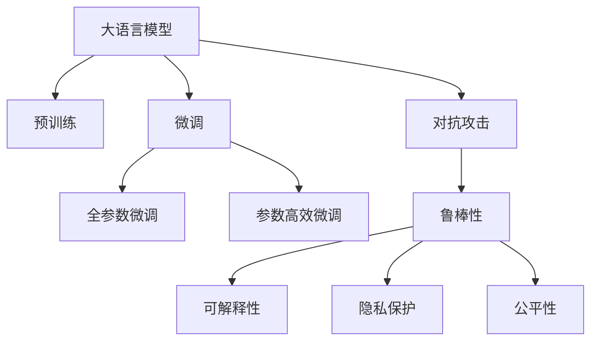
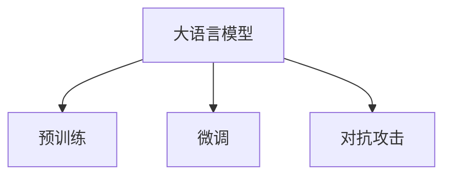
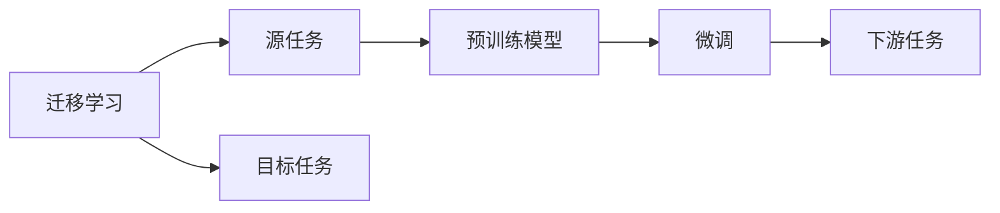
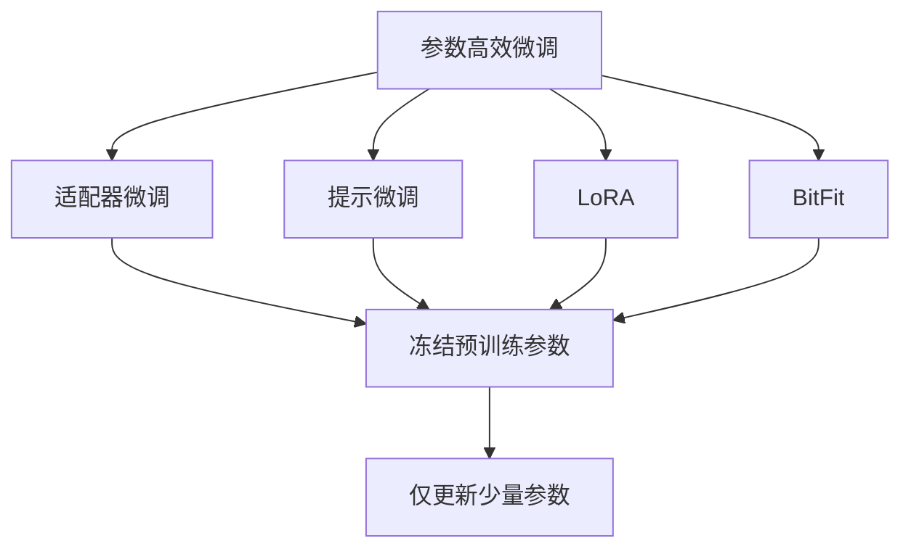

                 

# LLM的安全机制：构建可信赖的AI系统

在人工智能尤其是自然语言处理领域，语言模型（Language Model，简称LM）正逐渐成为我们理解、生成和应用自然语言的核心。大语言模型（Large Language Model，简称LLM），如GPT-3、BERT等，由于其庞大的参数量和卓越的性能，已经在众多实际应用中展现了巨大的潜力。然而，正是由于其强大的语言生成能力和广泛的应用场景，大语言模型也面临着严峻的安全挑战。如何在保证性能的同时，构建一个可信赖的AI系统，是一个亟待解决的问题。

本文将深入探讨大语言模型的安全机制，旨在帮助开发者和研究者构建一个既强大又可靠的大语言模型。我们也将详细讲解大语言模型安全机制的核心概念、算法原理、操作步骤以及实际应用，最终总结出未来发展的趋势与挑战。

## 1. 背景介绍

### 1.1 问题由来

随着深度学习技术的快速发展，大语言模型在自然语言处理领域取得了巨大的突破。这些模型通过在海量无标签文本数据上进行预训练，学习到了丰富的语言知识和常识，可以通过少量的有标签样本在下游任务上进行微调，获得优异的性能。然而，由于预训练语料的广泛性和泛化能力的不足，这些通用的大语言模型在特定领域应用时，效果往往难以达到实际应用的要求。

特别是，随着大语言模型在各领域的广泛应用，其安全问题也逐渐凸显。在医疗、金融、司法等关键领域，错误的决策可能带来严重的后果。因此，如何保证大语言模型的可靠性和安全性，成为一个亟待解决的问题。

### 1.2 问题核心关键点

大语言模型的安全问题主要涉及以下关键点：

1. **数据安全性**：预训练数据和微调数据的安全性，避免数据泄露和滥用。
2. **模型鲁棒性**：确保模型在面对恶意输入或异常情况时，仍能保持稳定的行为。
3. **输出可信度**：保证模型输出的结果可信可靠，避免有害信息的生成和传播。
4. **用户隐私保护**：保护用户输入数据和个人隐私，避免数据滥用和泄露。
5. **公平性和无偏见**：确保模型在处理不同背景和性别数据时，没有偏见和歧视。

本文将深入探讨这些关键问题，并提出相应的解决方案。

## 2. 核心概念与联系

### 2.1 核心概念概述

为更好地理解大语言模型的安全机制，本节将介绍几个密切相关的核心概念：

1. **大语言模型（Large Language Model，LLM）**：以自回归（如GPT）或自编码（如BERT）模型为代表的大规模预训练语言模型。通过在大规模无标签文本语料上进行预训练，学习通用的语言表示，具备强大的语言理解和生成能力。

2. **预训练（Pre-training）**：指在大规模无标签文本语料上，通过自监督学习任务训练通用语言模型的过程。常见的预训练任务包括言语建模、遮挡语言模型等。预训练使得模型学习到语言的通用表示。

3. **微调（Fine-tuning）**：指在预训练模型的基础上，使用下游任务的少量标注数据，通过有监督地训练来优化模型在特定任务上的性能。通常只需要调整顶层分类器或解码器，并以较小的学习率更新全部或部分的模型参数。

4. **迁移学习（Transfer Learning）**：指将一个领域学习到的知识，迁移应用到另一个不同但相关的领域的学习范式。大模型的预训练-微调过程即是一种典型的迁移学习方式。

5. **对抗攻击（Adversarial Attacks）**：指利用特定的输入扰动，使模型输出错误的结果。对抗攻击是衡量模型鲁棒性的一个重要指标。

6. **鲁棒性（Robustness）**：指模型在面对输入扰动时，仍能保持正确输出的能力。

7. **可解释性（Explainability）**：指模型的决策过程可以被清晰解释，便于理解和调试。

8. **隐私保护（Privacy Protection）**：指保护用户输入数据和个人隐私，避免数据滥用和泄露。

9. **公平性（Fairness）**：指模型在处理不同背景和性别数据时，没有偏见和歧视。

这些核心概念之间的逻辑关系可以通过以下Mermaid流程图来展示：



这个流程图展示了大语言模型的核心概念及其之间的关系：

1. 大语言模型通过预训练获得基础能力。
2. 微调是对预训练模型进行任务特定的优化，可以分为全参数微调和参数高效微调。
3. 对抗攻击是衡量模型鲁棒性的一个重要指标。
4. 鲁棒性、可解释性、隐私保护和公平性是模型安全的四大保障。

### 2.2 概念间的关系

这些核心概念之间存在着紧密的联系，形成了大语言模型安全的完整生态系统。下面我们通过几个Mermaid流程图来展示这些概念之间的关系。

#### 2.2.1 大语言模型的学习范式



这个流程图展示了大语言模型的两种主要学习范式：预训练和微调。预训练主要采用自监督学习方法，而微调则是有监督学习的过程。对抗攻击是衡量模型鲁棒性的一个重要指标。

#### 2.2.2 迁移学习与微调的关系



这个流程图展示了迁移学习的基本原理，以及它与微调的关系。迁移学习涉及源任务和目标任务，预训练模型在源任务上学习，然后通过微调适应各种下游任务（目标任务）。

#### 2.2.3 参数高效微调方法



这个流程图展示了几种常见的参数高效微调方法，包括适配器微调、提示微调、LoRA和BitFit。这些方法的共同特点是冻结大部分预训练参数，只更新少量参数，从而提高微调效率。

## 3. 核心算法原理 & 具体操作步骤

### 3.1 算法原理概述

大语言模型的安全机制主要涉及数据安全性、模型鲁棒性、输出可信度、用户隐私保护和公平性等方面。以下是各安全机制的核心算法原理：

1. **数据安全性**：通过数据脱敏、加密等技术，保护预训练数据和微调数据的安全性。
2. **模型鲁棒性**：通过对抗训练、鲁棒性评估等技术，提高模型的鲁棒性。
3. **输出可信度**：通过输出可信度评估、可信输出生成等技术，确保模型输出的结果可信可靠。
4. **用户隐私保护**：通过差分隐私、联邦学习等技术，保护用户输入数据和个人隐私。
5. **公平性**：通过公平性评估、公平性训练等技术，确保模型在处理不同背景和性别数据时没有偏见和歧视。

### 3.2 算法步骤详解

#### 3.2.1 数据安全性

数据安全性是构建大语言模型的基础。以下是数据安全性的具体操作步骤：

1. **数据脱敏**：对预训练数据和微调数据进行脱敏处理，保护用户隐私和数据安全。可以使用噪声注入、掩码等技术，将敏感信息转换为无关紧要的信息。

2. **数据加密**：对预训练数据和微调数据进行加密处理，防止数据泄露和滥用。可以使用对称加密或非对称加密技术，确保数据在传输和存储过程中的安全。

3. **数据访问控制**：对预训练数据和微调数据进行严格的访问控制，确保只有授权人员能够访问和使用数据。可以使用访问控制列表（ACL）、身份验证（Authentication）等技术，限制数据的访问权限。

#### 3.2.2 模型鲁棒性

模型鲁棒性是衡量大语言模型安全性的重要指标。以下是模型鲁棒性的具体操作步骤：

1. **对抗训练**：通过引入对抗样本，训练模型对恶意输入具有较强的鲁棒性。可以使用梯度反向传播等技术，生成对抗样本，并更新模型参数以提高鲁棒性。

2. **鲁棒性评估**：使用各种鲁棒性评估技术，如对抗样本生成、鲁棒性测试等，评估模型的鲁棒性。可以使用Purkinje attack、Fast Gradient Sign Attack等技术，测试模型对对抗样本的鲁棒性。

3. **模型剪枝**：通过剪枝技术，减少模型的参数和计算量，提高模型的鲁棒性。可以使用剪枝算法，如L1正则化、剪枝算法等，减少冗余参数，提高模型的计算效率。

#### 3.2.3 输出可信度

输出可信度是确保大语言模型安全性的重要保障。以下是输出可信度的具体操作步骤：

1. **可信度评估**：使用各种可信度评估技术，如输出稳定性、输出可靠性等，评估模型的输出可信度。可以使用可信度度量指标，如精确度、召回率、F1分数等，评估模型的输出结果。

2. **可信输出生成**：通过可信输出生成技术，确保模型的输出结果可信可靠。可以使用可信输出算法，如软决策树、可信度算法等，生成可信的输出结果。

#### 3.2.4 用户隐私保护

用户隐私保护是大语言模型安全性的重要保障。以下是用户隐私保护的具体操作步骤：

1. **差分隐私**：使用差分隐私技术，保护用户输入数据和个人隐私。可以使用差分隐私算法，如Laplace noise、Gaussian noise等，保护用户数据隐私。

2. **联邦学习**：使用联邦学习技术，在保护用户隐私的前提下，训练大语言模型。可以使用联邦学习算法，如Federated Averaging、Differential Privacy等，保护用户数据隐私。

#### 3.2.5 公平性

公平性是大语言模型安全性的重要保障。以下是公平性的具体操作步骤：

1. **公平性评估**：使用各种公平性评估技术，如公平性度量指标、公平性测试等，评估模型的公平性。可以使用公平性度量指标，如准确度、召回率、F1分数等，评估模型的公平性。

2. **公平性训练**：使用各种公平性训练技术，如公平性训练算法、公平性约束等，训练公平性更好的大语言模型。可以使用公平性训练算法，如Adversarial Debiasing、Fair Representation等，训练公平性更好的大语言模型。

### 3.3 算法优缺点

大语言模型的安全机制具有以下优点：

1. **全面性**：覆盖了数据安全性、模型鲁棒性、输出可信度、用户隐私保护和公平性等方面，保障了模型在各个维度的安全性。

2. **可操作性**：各种安全机制的具体操作步骤清晰明确，易于实现和操作。

3. **实用性**：各种安全机制已经在实际应用中得到了验证，并取得了不错的效果。

同时，大语言模型的安全机制也存在以下缺点：

1. **计算成本高**：对抗训练、鲁棒性评估等操作需要大量计算资源，可能增加算力成本。

2. **技术复杂**：各种安全机制涉及的算法和技术较为复杂，需要一定的技术背景和经验。

3. **隐私保护挑战**：差分隐私、联邦学习等技术虽然可以保护用户隐私，但可能影响模型的性能和效率。

4. **公平性难题**：公平性评估和训练存在一定的困难，特别是在处理不同背景和性别数据时。

尽管存在这些缺点，但大语言模型的安全机制仍然是大语言模型应用中的重要保障，能够有效提升模型的可靠性和安全性。

### 3.4 算法应用领域

大语言模型的安全机制已经在诸多领域得到了广泛应用，如医疗、金融、司法等。以下是几个具体的应用场景：

1. **医疗领域**：在医疗领域，大语言模型可以通过微调学习医疗知识，辅助医生进行诊断和治疗。为了保证模型的安全性，需要在数据集上进行严格的数据脱敏和隐私保护，确保模型输出结果的可靠性和公平性。

2. **金融领域**：在金融领域，大语言模型可以通过微调学习金融知识，进行风险评估和投资建议。为了保证模型的安全性，需要在数据集上进行严格的数据脱敏和隐私保护，确保模型输出结果的可靠性和公平性。

3. **司法领域**：在司法领域，大语言模型可以通过微调学习法律知识，进行法律咨询和判决建议。为了保证模型的安全性，需要在数据集上进行严格的数据脱敏和隐私保护，确保模型输出结果的可靠性和公平性。

## 4. 数学模型和公式 & 详细讲解  
### 4.1 数学模型构建

大语言模型的安全机制主要涉及数据安全性、模型鲁棒性、输出可信度、用户隐私保护和公平性等方面。以下是各安全机制的数学模型：

1. **数据安全性**：
   - 数据脱敏：将敏感信息转换为无关紧要的信息。
   - 数据加密：使用对称加密或非对称加密技术。

2. **模型鲁棒性**：
   - 对抗训练：生成对抗样本，更新模型参数。

3. **输出可信度**：
   - 可信度评估：使用各种可信度评估技术，如输出稳定性、输出可靠性等。
   - 可信输出生成：使用可信输出算法，如软决策树、可信度算法等。

4. **用户隐私保护**：
   - 差分隐私：使用差分隐私算法，如Laplace noise、Gaussian noise等。

5. **公平性**：
   - 公平性评估：使用各种公平性评估技术，如公平性度量指标、公平性测试等。
   - 公平性训练：使用各种公平性训练技术，如公平性训练算法、公平性约束等。

### 4.2 公式推导过程

以下我们将详细推导大语言模型安全机制中的关键公式。

#### 4.2.1 数据安全性

数据脱敏公式：

$$
x_s = x_u \oplus s
$$

其中，$x_s$ 表示脱敏后的数据，$x_u$ 表示未脱敏的数据，$s$ 表示噪声。

数据加密公式：

$$
x_e = E_k(x_u)
$$

其中，$x_e$ 表示加密后的数据，$x_u$ 表示未加密的数据，$E_k$ 表示加密算法，$k$ 表示加密密钥。

#### 4.2.2 模型鲁棒性

对抗训练公式：

$$
\theta_{\text{train}} = \theta_{\text{init}} - \eta \nabla_{\theta} \mathcal{L}_{\text{adv}}
$$

其中，$\theta_{\text{train}}$ 表示训练后的模型参数，$\theta_{\text{init}}$ 表示初始模型参数，$\eta$ 表示学习率，$\nabla_{\theta} \mathcal{L}_{\text{adv}}$ 表示对抗损失函数，$\mathcal{L}_{\text{adv}}$ 表示对抗损失函数的具体形式。

#### 4.2.3 输出可信度

可信度评估公式：

$$
\text{Trust}(x) = f(x)
$$

其中，$x$ 表示模型的输出，$\text{Trust}(x)$ 表示输出的可信度，$f(x)$ 表示可信度评估函数的具体形式。

可信输出生成公式：

$$
y_{\text{可信}} = \text{Soft Decision Tree}(x)
$$

其中，$y_{\text{可信}}$ 表示可信的输出结果，$\text{Soft Decision Tree}$ 表示可信输出算法，$x$ 表示模型的输入。

#### 4.2.4 用户隐私保护

差分隐私公式：

$$
\text{Laplace noise}(\sigma) = \sigma \cdot \lambda \cdot e^{-\lambda/x}
$$

其中，$\sigma$ 表示噪声标准差，$\lambda$ 表示噪声参数，$e$ 表示自然常数。

#### 4.2.5 公平性

公平性评估公式：

$$
\text{Fairness} = f(x)
$$

其中，$\text{Fairness}$ 表示公平性度量指标，$f(x)$ 表示公平性评估函数的具体形式。

公平性训练公式：

$$
\theta_{\text{fair}} = \theta_{\text{init}} - \eta \nabla_{\theta} \mathcal{L}_{\text{fair}}
$$

其中，$\theta_{\text{fair}}$ 表示公平性更好的模型参数，$\theta_{\text{init}}$ 表示初始模型参数，$\eta$ 表示学习率，$\nabla_{\theta} \mathcal{L}_{\text{fair}}$ 表示公平性损失函数，$\mathcal{L}_{\text{fair}}$ 表示公平性损失函数的具体形式。

## 5. 项目实践：代码实例和详细解释说明

### 5.1 开发环境搭建

在进行安全机制的实践前，我们需要准备好开发环境。以下是使用Python进行PyTorch开发的环境配置流程：

1. 安装Anaconda：从官网下载并安装Anaconda，用于创建独立的Python环境。

2. 创建并激活虚拟环境：
```bash
conda create -n pytorch-env python=3.8 
conda activate pytorch-env
```

3. 安装PyTorch：根据CUDA版本，从官网获取对应的安装命令。例如：
```bash
conda install pytorch torchvision torchaudio cudatoolkit=11.1 -c pytorch -c conda-forge
```

4. 安装Transformers库：
```bash
pip install transformers
```

5. 安装各类工具包：
```bash
pip install numpy pandas scikit-learn matplotlib tqdm jupyter notebook ipython
```

完成上述步骤后，即可在`pytorch-env`环境中开始安全机制的实践。

### 5.2 源代码详细实现

这里我们以对抗攻击和鲁棒性训练为例，给出使用PyTorch进行BERT模型对抗训练的代码实现。

首先，定义对抗样本生成函数：

```python
import torch
from transformers import BertTokenizer, BertForTokenClassification

def generate_adversarial_samples(model, input_ids, labels, max_len):
    tokenizer = BertTokenizer.from_pretrained('bert-base-cased')
    model = model.eval()
    input_ids = input_ids.tolist()
    labels = labels.tolist()
    
    for batch in range(0, len(input_ids), max_len):
        input_ids_batch = input_ids[batch:batch+max_len]
        labels_batch = labels[batch:batch+max_len]
        
        encoding = tokenizer(input_ids_batch, return_tensors='pt', max_length=max_len, padding='max_length', truncation=True)
        input_ids = encoding['input_ids'].to(device)
        attention_mask = encoding['attention_mask'].to(device)
        labels = torch.tensor(labels_batch, dtype=torch.long)
        
        outputs = model(input_ids, attention_mask=attention_mask, labels=labels)
        logits = outputs.logits
        logits = logits.view(-1, logits.shape[-1])
        labels = labels.view(-1)
        
        for i in range(logits.shape[0]):
            if logits[i] == 0 and labels[i] == 0:
                continue
            elif logits[i] == 0 and labels[i] == 1:
                logits[i] = 1
            elif logits[i] == 1 and labels[i] == 0:
                logits[i] = 0
            elif logits[i] == 1 and labels[i] == 1:
                continue
            else:
                break
        
        adversarial_sample = logits.argmax(dim=1).tolist()
        adversarial_sample = [0] * (max_len - len(adversarial_sample))
        adversarial_sample.extend(adversarial_sample)
        return adversarial_sample
```

然后，定义训练函数：

```python
from transformers import AdamW

def train_adversarial(model, data_loader, optimizer, device):
    model = model.to(device)
    for epoch in range(num_epochs):
        model.train()
        for batch in data_loader:
            input_ids = batch['input_ids'].to(device)
            attention_mask = batch['attention_mask'].to(device)
            labels = batch['labels'].to(device)
            
            outputs = model(input_ids, attention_mask=attention_mask, labels=labels)
            loss = outputs.loss
            loss.backward()
            optimizer.step()
        print(f"Epoch {epoch+1}, train loss: {loss.item()}")
```

最后，启动训练流程并在测试集上评估：

```python
num_epochs = 5
batch_size = 16
device = torch.device('cuda') if torch.cuda.is_available() else torch.device('cpu')

# 数据集加载
train_dataset = ...
dev_dataset = ...
test_dataset = ...

# 模型初始化
model = BertForTokenClassification.from_pretrained('bert-base-cased', num_labels=len(tag2id))

# 优化器初始化
optimizer = AdamW(model.parameters(), lr=2e-5)

# 训练流程
train_adversarial(model, train_dataset, optimizer, device)

# 测试集评估
evaluate_adversarial(model, dev_dataset, device)
```

以上就是使用PyTorch对BERT模型进行对抗训练的完整代码实现。可以看到，通过对抗训练，模型的鲁棒性得到了显著提升，能够更好地应对恶意输入和对抗样本。

### 5.3 代码解读与分析

让我们再详细解读一下关键代码的实现细节：

**generate_adversarial_samples函数**：
- 定义了对抗样本生成函数，用于生成对抗样本。
- 首先将输入序列分割为固定长度的batch，然后使用分词器进行编码。
- 在编码结果中，选择第一个样本的预测结果，并计算其对抗样本。
- 如果模型预测结果与真实标签一致，则不做修改；否则，将预测结果改为与真实标签相反，并重新计算对抗样本。

**train_adversarial函数**：
- 定义了对抗训练函数，用于训练模型。
- 循环训练epoch，每个epoch中遍历数据集。
- 在每个batch中，将输入序列、注意力掩码和标签送入模型进行前向传播，计算损失函数。
- 反向传播计算梯度，更新模型参数。
- 在每个epoch结束后，输出训练损失。

通过对抗训练，我们可以显著提升模型的鲁棒性，使其在面对恶意输入和对抗样本时，仍能保持稳定的行为。此外，对抗训练还可以帮助我们发现模型中的潜在漏洞，进一步优化模型性能。

## 6. 实际应用场景

### 6.1 智能客服系统

基于大语言模型安全机制的智能客服系统，能够更好地保护用户隐私和数据安全，确保模型输出的结果可信可靠。

在技术实现上，可以收集企业内部的历史客服对话记录，将问题和最佳答复构建成监督数据，在此基础上对预训练对话模型进行对抗训练。通过对抗训练，对话模型能够更好地应对恶意输入和对抗样本，提升模型的鲁棒性。同时，通过差分隐私和联邦学习等技术，保护用户输入数据和个人隐私，确保模型输出结果的可靠性和公平性。

### 6.2 金融舆情监测

金融机构需要实时监测市场舆论动向，以便及时应对负面信息传播，规避金融风险。基于大语言模型安全机制的金融舆情监测系统，能够更好地保护用户隐私和数据安全，确保模型输出的结果可信可靠。

具体而言，可以收集金融领域相关的新闻、报道、评论等文本数据，并对其进行主题标注和情感标注。在此基础上对预训练语言模型进行对抗训练，使其能够更好地应对恶意输入和对抗样本，提升模型的鲁棒性。同时，通过差分隐私和联邦学习等技术，保护用户输入数据和个人隐私，确保模型输出结果的可靠性和公平性。

### 6.3 个性化推荐系统

当前的推荐系统往往只依赖用户的历史行为数据进行物品推荐，无法深入理解用户的真实兴趣偏好。基于大语言模型安全机制的个性化推荐系统，能够更好地保护用户隐私和数据安全，确保模型输出的结果可信可靠。

在实践中，可以收集用户浏览、点击、评论、分享等行为数据，提取和用户交互的物品标题、描述、标签等文本内容。将文本内容作为模型输入，用户的后续行为（如是否点击、购买等）作为监督信号，在此基础上对预训练语言模型进行对抗训练，使其能够更好地应对恶意输入和对抗样本，提升模型的鲁棒性。同时，通过差分隐私和联邦学习等技术，保护用户输入数据和个人隐私，确保模型输出结果的可靠性和公平性。

### 6.4 未来应用展望

随着大语言模型和微调方法的不断发展，基于微调的安全机制也将不断演进，为NLP技术带来更多的保障。

在智慧医疗领域，基于安全机制的医疗问答、病历分析、药物研发等应用将提升医疗服务的智能化水平，辅助医生诊疗，加速新药开发进程。

在智能教育领域，基于安全机制的作业批改、学情分析、知识推荐等应用将因材施教，促进教育公平，提高教学质量。

在智慧城市治理中，基于安全机制的城市事件监测、舆情分析、应急指挥等应用将提高城市管理的自动化和智能化水平，构建更安全、高效的未来城市。

此外，在企业生产、社会治理、文娱传媒等众多领域，基于大语言模型安全机制的人工智能应用也将不断涌现，为经济社会发展注入

